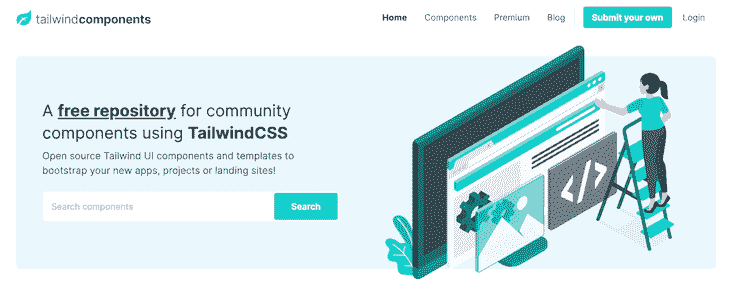
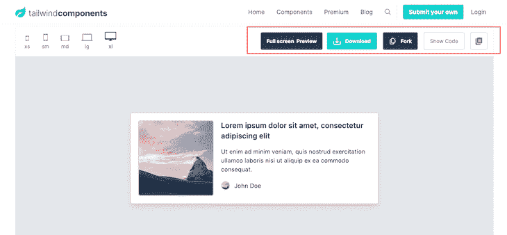
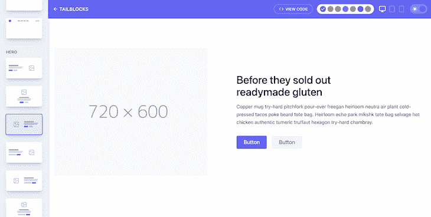
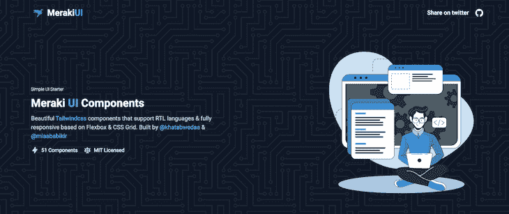
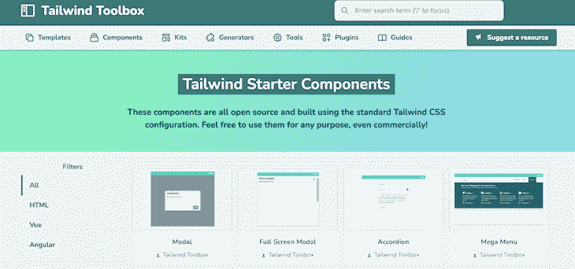
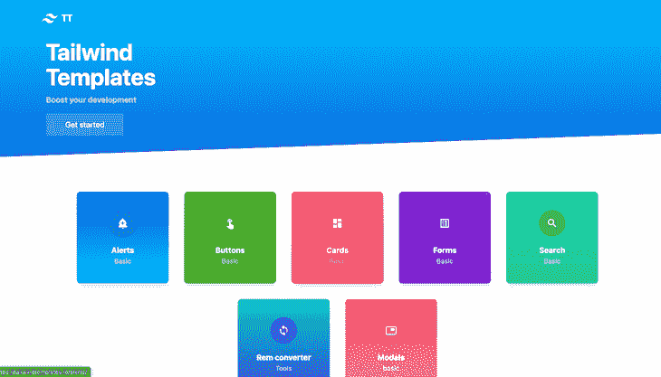
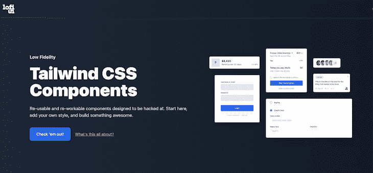
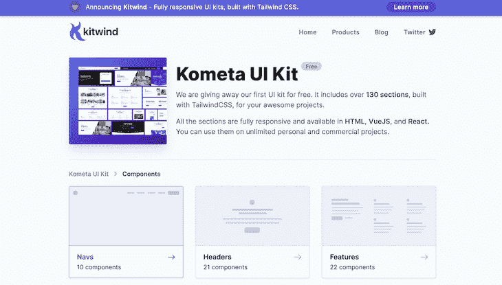
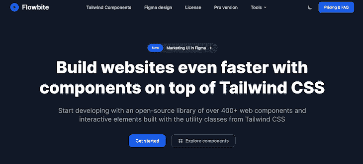
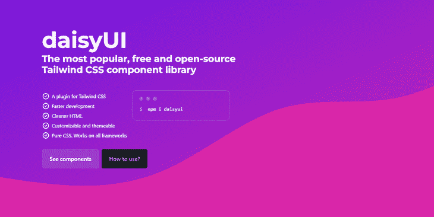

# 10 个最佳顺风 CSS 组件和模板集合

> 原文：<https://blog.logrocket.com/10-best-tailwind-css-component-template-collections/>

***编者按:**这篇文章于 2022 年 6 月 24 日更新，以确保所有信息都是最新的，并涵盖额外的顺风组件和模板集合，包括[材料顺风](#material-tailwind)、 [Flowbite](#flowbite) 和 [daisyUI](#daisyui) 。*

Tailwind CSS 是一个实用优先的框架，用于快速构建定制 UI 组件。

这意味着，与其他 CSS 框架或库不同，Tailwind CSS 组件不是预先样式化的。相反，您可以使用 Tailwind 的低级实用程序类来构建自定义接口，用于样式化 CSS 属性，如`margin`、`flex`、`color`等等。

自 2017 年推出以来，Tailwind CSS 在开发人员社区中的受欢迎程度大幅增长，主要是因为它为开发人员提供了构建自定义界面的灵活性，而不受任何 UI 工具包规则的约束。

但是，过多的选择可能会造成决策瘫痪。有时，您可能想要修改现有的示例或从现有的示例中获取灵感，以便更快地开始。为了满足这种需求，Tailwind 组件和模板集合提供了完全响应的 UI 组件和页面模板。

这些集合允许您将 HTML 片段直接复制并粘贴到您的代码库中，以便使用或修改。它们由其他开发人员和组织构建，通过查看潜在的结果，您可以快速开始您的项目。

在本文中，我将向您介绍 10 个最好的免费 Tailwind CSS 组件集合，包括:

1.  [顺风组件](#tailwind-components)
2.  [尾座](#tailblocks)
3.  [Meraki UI](#meraki-ui)
4.  [顺风工具箱](#tailwind-toolbox)
5.  [顺风模板](#tailwind-templates)
6.  [Lofi UI](#lofi-ui)
7.  [Kometa UI 套件](#kometa-ui-kit)
8.  [材料顺风](#material-tailwind)
9.  流动比特
10.  [daisyUI](#daisyui)

如果你没有使用 Tailwind CSS 的经验，你可能想先阅读这篇关于使用 Tailwind CSS 样式化组件的文章。让我们开始吧。

[Tailwind Components](https://tailwindcomponents.com/) 是一个开源的、由社区贡献的免费或付费的 Tailwind UI 模板和组件的集合，可用于引导新的应用程序、项目和登录页面。

该集合包括现成的下拉菜单、登录、模态、选项卡、输入和选择，它们都是用 Tailwind CSS、[和一个非常有用的备忘单](https://tailwindcomponents.com/cheatsheet/)构建的。您也可以通过提交自己的组件供他人使用来为集合做出贡献。

要使用任何组件或模板，单击它，您将被重定向到一个单独的页面。如果你想的话，可以预览它，然后下载它，把它放到你的 GitHub 中，或者直接复制代码。

[Tailblocks](http://tailblocks.cc/) 是一个 60+极简布局块的集合，如证明、团队、步骤、统计、定价、英雄、页眉、画廊、页脚、功能和电子商务。

Tailblocks 组件特别酷，因为它们提供了黑暗模式支持，并且您可以从界面中更改原色。该项目的 GitHub repo 由[梅尔特·库鲁肯](https://github.com/mertJF/tailblocks)创建和维护，拥有超过 51k 颗星，已经被分叉超过 400 次，所以它非常受欢迎。

要使用任何布局块，选择它，从调色板中选择一种颜色，选择深色或浅色模式，单击**查看代码**按钮，然后将其复制并粘贴到您的项目中。

Meraki UI 是一个由 50 多个漂亮的顺风 CSS 组件组成的集合，支持从右到左(RTL)语言。这意味着，如果用户的默认浏览器语言设置为 RTL 语言，Meraki UI 将反转所有内容，包括文本、滚动、进度指示器、按钮等。

这个顺风组件集合由 [Khatab Wedaa](https://twitter.com/khatabwedaa) 和 [Mosab Ibrahim](https://twitter.com/miaababikir) 创建，包括提醒、登录表单、按钮、卡片、下拉菜单、导航栏、分页和页脚。要使用任何组件，只需复制它就可以了。

[Tailwind Toolbox](https://www.tailwindtoolbox.com/) 是一个开源的、社区贡献的初学者模板和组件的集合，也是一个插件、工具、生成器、工具包和指南的目录，可以帮助你更好地使用 Tailwind CSS。

Tailwind Toolbox 由 Amrit 凪良公司创建和维护，包括超过 45 个登录页面模板和 16 个组件，以及其他清单。您可以通过点击“建议资源”按钮向集合投稿。

除了 HTML 标记，Tailwind Toolbox 还为预期的 JavaScript 交互提供了模板脚本，比如打开和关闭模态。要使用脚本，点击模板或组件来下载 CSS 模板或复制 Tailwind 组件的代码。

[Tailwind Templates](https://tailwindtemplates.io/) 是一个不断增长的免费 UI 组件集合，采用了 Tailwind CSS 样式。由 [J-hiz](http://j-hiz.com/) 建造，它拥有 30 多种独特的组件设计，包括警告、按钮、卡片、表单、搜索输入和模态。

目前，它只有组件，但 CSS 模板将很快添加。要使用任何组件，单击父分类，然后复制您喜欢的任何模板的代码。

[Lofi UI](https://lofiui.co/) 是一个不断增长的低保真度顺风 CSS 组件集合。

低保真度仅仅意味着组件的结构是可重用的，并且具有最少的样式，因此您可以添加自己的样式并定制您的设计来满足您的个人品味。换句话说，组件被构建为尽可能高效地使用 HTML，并依赖 CSS 来使它们发挥作用。

请将这些顺风组件视为一个起点，您可以在此基础上进行构建，并根据自己的需要进行定制。

Lofi UI 由 Rob Stinson 构建和维护，目前拥有超过 40 个优雅的 UI 组件和布局。要使用它，请单击任何组件卡。然后您将被重定向到 CodePen，在那里您可以复制和定制结果代码。

Kometa UI Kit 是一个包含 130 多个不同类别的组件和布局块的 CSS 工具包，包括导航、标题、功能、定价、常见问题、内容、团队、博客、统计和页脚。

正如主页上提到的，所有的布局块都是完全响应的，并且可以作为普通的 HTML 片段或 React/Vue 组件使用。Kometa 也有一个博客，分享如何用 Tailwind CSS 构建更漂亮、更出色的用户界面的技巧和诀窍。

Kometa UI 是 Kitwind 团队的产品。要使用 Kometa UI 工具包中的任何组件，请单击父分类，找到您喜欢的变体，然后将代码复制为普通 HTML、Vue 或 React 代码。

[Material Tailwind](https://www.material-tailwind.com/) is a simple-to-use components library for Tailwind CSS with [Google’s Material Design](https://material.io/design). It has a number of React and HTML components, all of which are written using Tailwind CSS classes and adhere to the Material Design guidelines.

Material Tailwind 允许您根据自己的喜好修改颜色、字体、样式和其他任何东西，从而使个性化您的 Tailwind CSS 组件变得容易。

Material Tailwind 支持多种框架，尽管它目前只支持 React 和 HTML 组件。其他框架，如 Vue 和 Angular，也将很快得到支持。

[Flowbite](https://flowbite.com/) is an open source component library that uses Tailwind CSS utility classes to create components. It offers over 400 components and interactive elements, as well as dark mode support and a Figma design system.

它支持许多现代前端开发框架，包括 React、Vue、Svelte、Laravel 和 Rails。

Flowbite 的 pro 版已经推出，其中包含基于 Tailwind CSS 实用程序类的 Figma 设计系统，以及数百个开发的页面和组件，如应用程序 UI、营销 UI 和电子商务布局。

[daisyUI](https://daisyui.com/) is a popular open source Tailwind CSS component library. It has over 10,000 Github stars and over 800,000 npm downloads.

daisyUI 为所有常见 UI 组件的 Tailwind CSS 添加了 btn、card 等类。这使我们能够专注于每个项目最关键的方面，而不是为每个项目创建基本元素。

daisyUI 中的 Tailwind 组件具有较低的 CSS 特异性，因此您可以使用 Tailwind CSS 实用程序类来个性化一切。

daisyUI 与各种前端框架一起工作，包括 React、Nextjs、Nuxt、Vue、Solidjs、Svelte、Remix、Angular 等。

## 结论

鉴于 Tailwind CSS 的低级本质，您可以构建高度可定制的模板和设计，而无需编写一行 CSS 或担心如何覆盖自以为是的组件样式，而其他 CSS 框架提供了这种功能。

有了本文中介绍的 Tailwind CSS 组件和模板集合，设计项目的样式变得简单多了。获取灵感来创建自己的顺风 CSS 样式模板，或者简单地复制、粘贴并轻松定制以适合您的口味。

## 你的前端是否占用了用户的 CPU？

随着 web 前端变得越来越复杂，资源贪婪的特性对浏览器的要求越来越高。如果您对监控和跟踪生产环境中所有用户的客户端 CPU 使用、内存使用等感兴趣，

[try LogRocket](https://lp.logrocket.com/blg/css-signup)

.

[https://logrocket.com/signup/](https://lp.logrocket.com/blg/css-signup)

LogRocket 就像是网络和移动应用的 DVR，记录你的网络应用或网站上发生的一切。您可以汇总和报告关键的前端性能指标，重放用户会话和应用程序状态，记录网络请求，并自动显示所有错误，而不是猜测问题发生的原因。

现代化您调试 web 和移动应用的方式— [开始免费监控](https://lp.logrocket.com/blg/css-signup)。