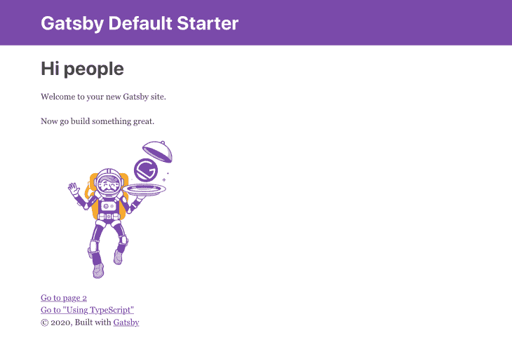
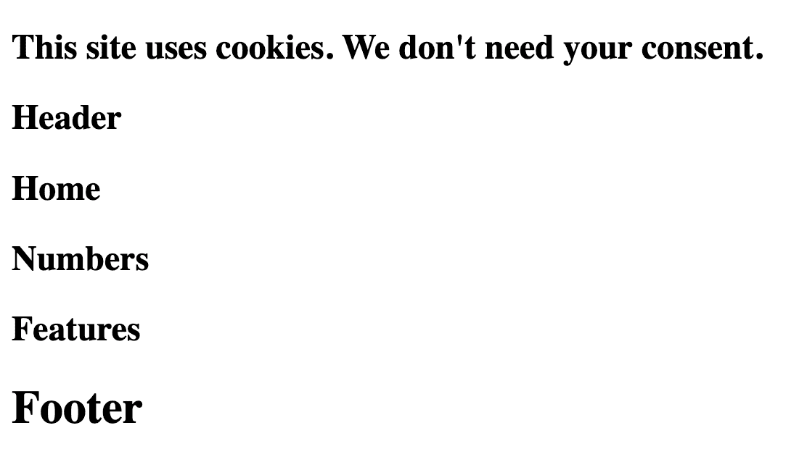
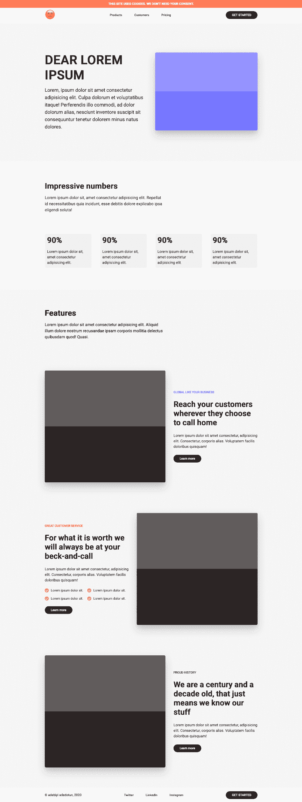
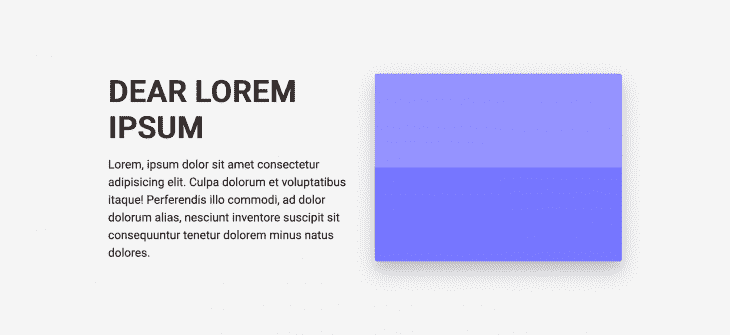
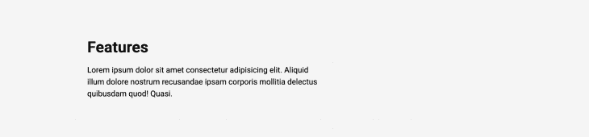
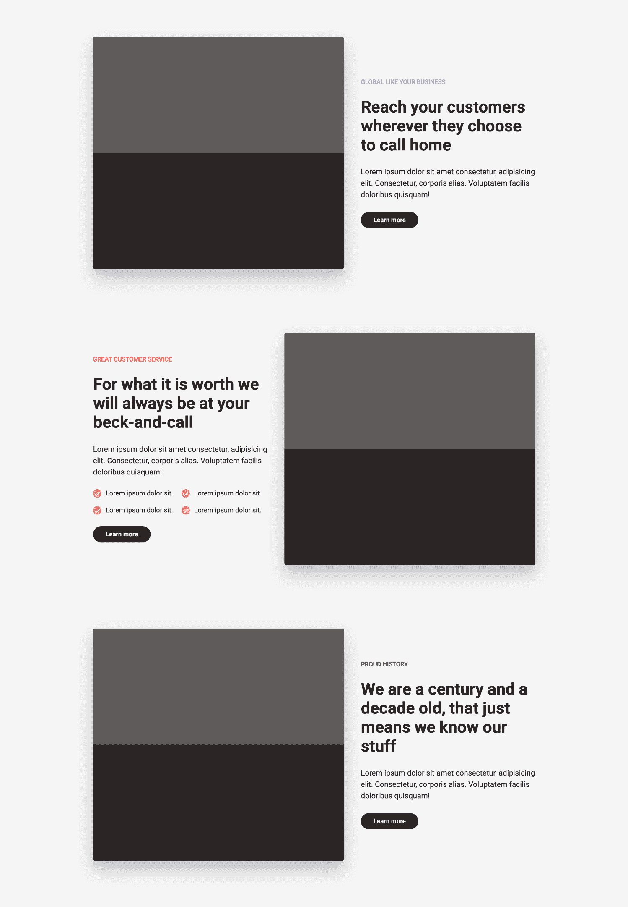

# 10 个盖茨比造型方法

> 原文：<https://blog.logrocket.com/10-gatsby-styling-methods/>

假设这是崭新的一天，你在混乱中感到幸运。你决定带着[盖茨比](https://www.gatsbyjs.org/)出去兜兜风，避开这个世界的不幸。不仅仅是因为它很快，或者因为你可以从任何地方获取数据，而是因为一些特殊的原因，它没有投入生产。所以你开始吧。

使用像 Gatsby 这样的框架的一个唾手可得的成果是，它抽象出了许多常见的和多余的任务，用一个更强大的、相对易用的 API，或者说[about](https://jaredpalmer.com/gatsby-vs-nextjs)来代替它。然而，这种讨价还价往往是以固执己见为代价的，你经常会遇到障碍。

对 CSS-in-JS 的不同观点是真实的。虽然我们都可能——在某种程度上——对如何将样式应用于组件感到紧张，但框架通常采取不同的立场。说得委婉一点，盖茨比不在乎你如何设计你的组件。但这不是关于如何设置它们，这就引出了本文。

Gatsby 支持各种各样的风格选择，目标是帮助你选择其中的一些。我们不会一一列举。取而代之的是一个足够的样式方法列表，包括:

## 先决条件

在我们开始我们的造型之旅之前，你需要了解一些盖茨比的细微差别。

*   [插件](https://www.gatsbyjs.org/docs/recipes/working-with-plugins/):这些对于盖茨比来说就像`npm`包对于`Node`项目一样。你可以安装插件来配合你的 Gatsby 应用程序使用，这样你就不必重新编写或重新发明某些功能。
*   `[gatsby-config.js](https://www.gatsbyjs.org/docs/api-files-gatsby-config/)`:这是盖茨比的配置文件，很像你的 git 的`.gitignore`文件、[的`.eslintrc`文件、](https://eslint.org/)的`.prettierrc`文件、[的](https://prettier.io/)文件。本质上，您可以对这个文件进行一些配置。
*   这是你的 Gatsby 站点和浏览器之间的接口。

基本上，每当我们安装一个 Gatsby 插件时，都会在`gatsby-config.js`中进行配置。

## 创建盖茨比网站

要创建新的 Gatsby 应用程序，您需要安装 [Gatsby CLI](https://www.gatsbyjs.org/docs/quick-start#use-the-gatsby-cli) :

```
npm install -g gatsby-cli // Installs the gatbsy CLI globally
```

创建一个名为`styling-in-gatsby`的新 Gatsby 站点:

```
gatsby new styling-in-gatsby // Creates a new gatbsy site named styling-in-gatsby
```

将目录更改到新网站:

```
cd styling-in-gatsby // Switch directory into the new gatsby site
```

运行网站:

```
gatsby develop -p 3000 // Instruct Gatsby to run on port 3000
```

> 有关创建和运行 Gatsby 站点的更多信息，请参考[文档](https://www.gatsbyjs.org/docs/quick-start/)。

如果一切顺利，网站应该在`[http://localhost:3000](http://localhost:3000)`上运行



Gatsby default starter index page.

## 默认启动器

为了简单起见，我已经为所需的文件/文件夹创建了一个存储库。这里可以抢[。](https://github.com/adebiyial/styling-in-gatsby-demo)

您的页面现在应该是这样的:



我们将遵循的表单非常简单。我们将构建一个虚构的登录页面，用不同的样式方法设计不同的部分。

最终目标是这样的:



随着我们的发展，您需要注意一些事情:

*   每当我们修改`gatsby-config.js`文件时，您都需要终止(如果它正在运行)和/或用`gatsby develop`重启您的服务器。虽然 Gatsby 会自动注意到这一点，并在您的同意下重启服务器，但我发现有时需要手动完成。
*   有一个 GitHub 存储库用于[开始](https://github.com/adebiyial/styling-in-gatsby-demo)和[结束](https://github.com/adebiyial/styling-in-gatsby-demo/tree/finished)的登陆页面。如果需要，您可以将它们作为指南。

说完了，让我们开始吧。

## 没有布局组件的全局 CSS

当你开始一个新的 web 项目时，你通常会做的一件事就是[重置](https://bitsofco.de/my-css-reset-base/)或者[标准化](https://necolas.github.io/normalize.css/)你的 CSS，这样在浏览器之间就有了一个统一的开始位置。这是一个使用全局 CSS 而不用担心[范围](https://css-tricks.com/saving-the-day-with-scoped-css/)的完美例子。

用这个[最小 CSS 重置](https://www.digitalocean.com/community/tutorials/css-minimal-css-reset)更新`src/styles/global/reset.css`:

```
html {
  box-sizing: border-box;
  font-size: 16px;
  font-family: "Roboto", sans-serif;
}

*, *:before, *:after {
  box-sizing: inherit;
}

body, h1, h2, h3, h4, h5, h6, p, ol, ul {
  margin: 0;
  padding: 0;
  font-weight: normal;
}

h1, h2, h3, h4, h5, h6 {
  font-weight: bold;
}

ol, ul {
  list-style: none;
}

img {
  max-width: 100%;
  height: auto;
}

a {
  text-decoration: none;
}
```

在`gatsby-browser.js`中导入最小 CSS 复位`src/styles/reset.css`:

```
import "./src/styles/global/reset.css"
```

您应该会立即看到这些变化。

## 带有布局组件的全局 CSS

盖茨比鼓励使用[布局组件](https://www.gatsbyjs.org/tutorial/part-three/#creating-layout-components)。基本上，这些都是包装可重用组件的包装器组件，比如页眉和页脚。

容器(包装器)是布局组件的理想选择。

用内容更新`src/styles/global/container.css`:

```
.container {
  max-width: 1080px;
  padding: 0 16px;
  margin: 0 auto;
}
```

更新`<Container/>` ( `src/components/Container.js`)组件:

```
import React from "react"
import "../styles/global/container.css"

export default function Container({ children }) {
  return <div className="container">{children}</div>
}
```

了解有关容器/包装的更多信息:

## CSS 模块

CSS 模块允许组件范围的 CSS。这意味着您的样式被本地化到一个特定的组件。它与 Gatsby 一起开箱即用，无需任何额外的配置。它真的很灵活，因为它可以使用 CSS，萨斯/SCSS，手写笔，更少，如你所见

我们会用它来制作登陆页面的顶部横幅。


更新`src/styles/modules/banner.module.css`:

```
.banner {
  padding: 10px;
  text-align: center;
  background: tomato;
  color: white;
}

.banner-title {
  font-size: 15px;
  text-transform: uppercase;
}
```

更新`src/components/Banner.js`组件:

```
import React from "react"
import bannerStyles from "../styles/modules/banner.module.css"

export default function Banner() {
  return (
    <section className={bannerStyles.banner}>
      <h1 className={bannerStyles.bannerTitle}>
        This site uses cookies. We don't need your consent.
      </h1>
    </section>
  )
}
```

> 你注意到样式显示为`banner-title`而组件显示为`bannerTitle`了吗？那是盖茨比。它把烤肉串盒子(`banner-title`)变成了骆驼盒子(`bannerTitle`)

## 带触笔的触笔/CSS 模块

手写笔类似于萨斯/SCSS，它给 CSS 添加了**功能**:变量、混合、操作符。

我们会用它来构建登陆页面的顶部导航。


Landing page top nav.

> 你可以安装[这个 VSCode 扩展](https://marketplace.visualstudio.com/items?itemName=sysoev.language-stylus)来支持手写笔文件

安装`gatsby-plugin-stylus`插件:

```
yarn add gatsby-plugin-stylus
```

更新`gatsby-config.js`中的`plugins`数组(重新运行`gatsby-develop`):

```
plugins: [
  `gatsby-plugin-stylus`,
  // other plugins
]
```

更新`src/styles/stylus/header.styl`:

```
$clr-brown = #211c1c

.link {
  font-size: 15px;
  padding: 10px 30px;
  font-weight: 500;
  border-radius: 50px;
  color: $clr-brown;
  transition: background-color 0.2s;

  &:hover {
    background-color: #211c1c14;
  }

  &:nth-child(2) {
    margin: 20px 0;
  }
}

.emoji {
  font-size: 50px;
}
```

更新`src/styles/stylus/header.module.styl`:

```
.navInner {
  height: 70px;
  display: flex;
  justify-content: space-between;
  align-items: center;

  .cta {
    font-size: 15px;
    background-color: #211c1c;
    color: white;
    padding: 10px 30px;
    font-weight: 500;
    border-radius: 50px;
  }
}
```

更新`<Header/>` ( `src/components/Header.js`)组件:

```
import { Link } from "gatsby"
import React from "react"
import NavStyle from "../styles/stylus/header.module.styl"
import "../styles/stylus/header.styl"
import Container from "./Container"

export default function Header() {
  return (
    <section id="nav">
      <Container>
        <nav className={NavStyle.navInner}>
          <div className="nav-inner__start">
            <h1 className="emoji">🙁</h1>
          </div>
          <div className="nav-inner__center">
            <Link to="/" className="link">
              Products
            </Link>
            <Link to="/" className="link">
              Customers
            </Link>
            <Link to="/" className="link">
              Pricing
            </Link>
          </div>
          <div className="nav-inner__end">
            <Link to="/" className={NavStyle.cta}>
              GET STARTED
            </Link>
          </div>
        </nav>
      </Container>
    </section>
  )
}
```

### SCSS/SCSS CSS 模块

SCSS 类似于手写笔，它为 CSS 添加了**功能:变量、混合、操作符。它被称为:拥有超能力的 CSS。**

我们用它来构建登录页面的主页部分:



安装`gatsby-plugin-sass`和`node-sass`:

```
yarn add gatsby-plugin-sass node-sass
```

更新`gatsby-config.js`中的`plugins`数组:

```
plugins: [
  `gatsby-plugin-sass`,
  // other plugins
]
```

更新`src/styles/scss/home.scss`:

```
#home {
  background-color: #f2f2f2;

  .home-inner {
    padding: 150px 0;
    display: grid;
    align-items: center;
    gap: 40px;
    grid-template-columns: repeat(2, 1fr);

    .home-inner__start {
      color: #211c1c;

      h1 {
        font-size: 72px;
      }

      p {
        margin-top: 20px;
        font-size: 24px;
        line-height: 1.5;
      }
    }

    .home-inner__end {
      height: 100%;
    }
  }
}
```

更新`src/styles/scss/home.module.scss`:

```
.box {
  box-shadow: 0 15px 11px rgba(20, 23, 31, 0.05),
    0 9px 46px rgba(20, 23, 31, 0.06), 0 24px 38px rgba(20, 23, 31, 0.19);
  width: 100%;
  height: 100%;
  border-radius: 5px;
  background-color: #635bff;
  background-image: linear-gradient(
    rgba(255, 255, 255, 0.2) 50%,
    transparent 50%,
    transparent
  );
}
```

> 背景图片来自 Lea Verou 的:[方格条纹其他背景图案带有 CSS3 渐变](https://lea.verou.me/2010/12/checkered-stripes-other-background-patterns-with-css3-gradients/)

更新`<Home/>`组件(`src/components/Home.js`):

```
import React from "react"
import HomeStyles from "../styles/scss/home.module.scss"
import "../styles/scss/home.scss"
import Container from "./Container"

export default function Home() {
  return (
    <section id="home">
      <Container>
        <div className="home-inner">
          <div className="home-inner__start">
            <h1>DEAR LOREM IPSUM</h1>
            <p>
              Lorem, ipsum dolor sit amet consectetur adipisicing elit. Culpa
              dolorum et voluptatibus itaque! Perferendis illo commodi, ad dolor
              dolorum alias, nesciunt inventore suscipit sit consequuntur
              tenetur dolorem minus natus dolores.
            </p>
          </div>
          <div className="home-inner__end">
            <div className={HomeStyles.box}></div>
          </div>
        </div>
      </Container>
    </section>
  )
}
```

### 带有 SASS 的 SASS/CSS 模块

[SASS](https://sass-lang.com/) 与 SCSS 相同，但有缩进语法的区别。我们不需要安装任何东西，因为我们已经为 SCSS 安装了。

我们用它来构建装载页面的数字部分:


Landing page numbers section.

> 您可以安装这个 VSCode 扩展来支持 SASS 文件

更新`src/styles/sass/numbers.sass`:

```
#numbers
  color: #211c1c
  padding: 100px 0

.numbers-inner header
  margin-bottom: 100px
  display: grid
  grid-template-columns: repeat(12,1fr)
  gap: 40px

  > div
    grid-column: span 7

  .title
    font-size: 38px

  p
  margin-top: 20px
  font-size: 20px
  line-height: 1.5
```

更新`src/styles/sass/numbers.modules.sass`:

```
.numbersGrid
  display: grid
  grid-template-columns: repeat(4, 1fr)
  gap: 40px

li
  padding: 5%
  background-color: #211c1c14
  border-radius: 5px

.percent
  font-size: 38px

.percent-info
  margin-top: 20px
  font-size: 18px
  line-height: 1.5
```

更新`<Numbers/>` ( `src/components/Numbers.js`)组件:

```
import React from "react"
import NumberStyles from "../styles/sass/numbers.module.sass"
import "../styles/sass/numbers.sass"
import Container from "./Container"

export default function Numbers() {
  return (
    <section id="numbers">
      <Container>
        <div className="numbers-inner">
          <header>
            <div>
              <h1 className="title">Impressive numbers</h1>
              <p>
                Lorem ipsum dolor sit, amet consectetur adipisicing elit.
                Repellat id necessitatibus quia incidunt, esse debitis dolore
                explicabo ipsa eligendi soluta!
              </p>
            </div>
          </header>
          <ul className={NumberStyles.numbersGrid}>
            <li>
              <h4 className={NumberStyles.percent}>90%</h4>
              <p className={NumberStyles.percentInfo}>
                Lorem ipsum dolor sit, amet consectetur adipisicing elit.
              </p>
            </li>
            <li>
              <h4 className={NumberStyles.percent}>90%</h4>
              <p className={NumberStyles.percentInfo}>
                Lorem ipsum dolor sit, amet consectetur adipisicing elit.
              </p>
            </li>
            <li>
              <h4 className={NumberStyles.percent}>90%</h4>
              <p className={NumberStyles.percentInfo}>
                Lorem ipsum dolor sit, amet consectetur adipisicing elit.
              </p>
            </li>
            <li>
              <h4 className={NumberStyles.percent}>90%</h4>
              <p className={NumberStyles.percentInfo}>
                Lorem ipsum dolor sit, amet consectetur adipisicing elit.
              </p>
            </li>
          </ul>
        </div>
      </Container>
    </section>
  )
}
```

## 情绪

Emotion 是一个 CSS-in-JS 库，像其他 CSS-in-JS 一样，允许你用 JavaScript 编写 CSS 样式。

让我们用它来构建特性部分的一部分。



Landing page features header.

安装`gatsby-plugin-emotion`、`@emotion/core`、`@emotion/styled`:

```
yarn add gatsby-plugin-emotion @emotion/core @emotion/styled
```

更新`gatsby-config.js`中的`plugins`数组:

```
plugins: [
  `gatsby-plugin-emotion`,
  // other plugins
]
```

更新`src/styles/emotion/FeatureStyles.js`:

```
import styled from "@emotion/styled"

export const FeatureSection = styled.section`
  padding: 100px 0;
  background-color: #f2f2f2;
`

export const FeatureInner = styled.div`
  padding: 0;
  display: grid;
  row-gap: 150px;
`

export const FeatureHeader = styled.header`
  display: grid;
  grid-template-columns: repeat(12, 1fr);
  gap: 40px;

  > div:first-of-type {
    grid-column: span 7;
  }

  .title {
    font-size: 38px;
  }

  .subtitle {
    margin-top: 20px;
    font-size: 20px;
    line-height: 1.5;
  }
`
```

更新`<Features/>` ( `src/components/Features.js`)组件:

```
import React from "react"
import {
  FeatureHeader,
  FeatureInner,
  FeatureSection,
} from "../styles/emotion/FeatureStyles"
import Container from "./Container"

export default function Features() {
  return (
    <FeatureSection>
      <Container>
        <FeatureInner>
          <FeatureHeader>
            <div>
              <h1 className="title">Features</h1>
              <p className="subtitle">
               Lorem ipsum dolor sit amet consectetur adipisicing elit. Aliquid
              illum dolore nostrum recusandae ipsam corporis mollitia delectus
                quibusdam quod! Quasi.
              </p>
            </div>
          </FeatureHeader>
        </FeatureInner>
      </Container>
    </FeatureSection>
  )
}
```

## 样式组件

就像 Emotion 一样，它也是一个 CSS-in-JS 库，允许你用 JavaScript 编写 CSS 样式。

我们会将它用于功能部分的其他部分:



安装`gatsby-plugin-styled-components`、`styled-components`和`babel-plugin-styled-components`:

```
yarn add gatsby-plugin-styled-components styled-components babel-plugin-styled-components
```

更新`gatsby-config.js`中的`plugins`数组:

```
plugins: [
  `gatsby-plugin-styled-components`,
  // other plugins
]
```

更新`<StyledCopy/>` ( `src/styles/styled-component/StyledCopy.js`)组件:

```
import styled from "styled-components"

const StyledCopy = styled.div.attrs(props => ({
  section: props.section,
}))`
  display: grid;
  align-content: center;
  justify-items: flex-start;
  gap: 5%;
  color: #211c1c;

  .tag {
    font-size: 15px;
    font-weight: 500;
    letter-spacing: -0.2px;
    color: ${props =>
      props.section === "proud-history"
        ? "#1c9724"
        : props.section === "global"
        ? "#635bff"
        : "red"};
  }

  .subtitle {
    font-size: 18px;
    line-height: 1.5;
  }

  .items {
    display: grid;
    grid-template-columns: 1fr 1fr;
    gap: 20px;

    .check-mark {
      width: 20px;
      height: 20px;
      background-color: rgba(255, 0, 0, 0.5);
      border-radius: 50%;
      padding: 5px;
      display: flex;
      justify-content: center;
      align-items: center;
      color: white;
      transform: scaleX(-1) rotate(-46deg);
      line-height: 1;
    }

    .about-item {
      margin-left: 10px;
    }

    .item {
      display: flex;
      font-weight: 500;
    }
  }

  .cta {
    font-size: 15px;
    background-color: #211c1c;
    color: white;
    padding: 10px 30px;
    font-weight: 500;
    border-radius: 50px;
    color: white;
  }
`

export default StyledCopy
```

更新`<StyledRow/>` ( `src/styles/styled-component/StyledRow.js`)组件:

```
import styled from "styled-components"

const StyledRow = styled.div`
  display: grid;
  grid-template-columns: repeat(12, 1fr);
  gap: 40px;

  [class*="img-wrap"] {
    grid-column: span 7;
  }

  .copy {
    grid-column: span 5;
  }

  .img {
    display: contents;

    .img-wrap {
      height: 550px;
      width: auto;
      background-color: #211c1c;
      border-radius: 5px;
      box-shadow: 0 15px 11px rgba(20, 23, 31, 0.05),
        0 9px 46px rgba(20, 23, 31, 0.06), 0 24px 38px rgba(20, 23, 31, 0.19);
      background-image: linear-gradient(
        rgba(255, 255, 255, 0.2) 50%,
        transparent 50%,
        transparent
      );
    }
  }
`

export default StyledRow
```

更新`<Features/>`组件(`src/components/Features.js`)。

目前，`copy-title`不是我们所需要的，让我们用`Bulma`来设计它:

```
import { Link } from "gatsby"
import React from "react"
import "../styles/bulma/copytitle.scss"
import {
  FeatureHeader,
  FeatureInner,
  FeatureSection,
} from "../styles/emotion/FeatureStyles"
import StyledCopy from "../styles/styled-component/StyledCopy"
import StyledRow from "../styles/styled-component/StyledRow"
import Container from "./Container"

export default function Features() {
  return (
    <FeatureSection>
      <Container>
        <FeatureInner>
          <FeatureHeader>
            <div>
              <h1 className="title">Features</h1>
              <p className="subtitle">
                Lorem ipsum dolor sit amet consectetur adipisicing elit. Aliquid
                illum dolore nostrum recusandae ipsam corporis mollitia delectus
                quibusdam quod! Quasi.
              </p>
            </div>
          </FeatureHeader>
          <StyledRow>
            <div className="img">
              <div className="img-wrap"></div>
            </div>
            <StyledCopy className="copy" {...{ section: "global" }}>
              <span className="tag">GLOBAL LIKE YOUR BUSINESS</span>
              <h1 className="copy-title">
                Reach your customers wherever they choose to call home"
              </h1>
              <p className="subtitle">
                Lorem ipsum dolor sit amet consectetur, adipisicing elit.
                Consectetur, corporis alias. Voluptatem facilis doloribus
                quisquam!
              </p>
              <Link to="/" className="cta">
                Learn more
              </Link>
            </StyledCopy>
          </StyledRow>
          <StyledRow>
            <StyledCopy className="copy" {...{ section: "customer-service" }}>
              <span className="tag">GREAT CUSTOMER SERVICE</span>
              <h1 className="copy-title">
                For what it is worth we will always be at your beck-and-call
              </h1>
              <p className="subtitle">
                Lorem ipsum dolor sit amet consectetur, adipisicing elit.
                Consectetur, corporis alias. Voluptatem facilis doloribus
                quisquam!
              </p>
              <div className="items">
                <div className="item">
                  <div className="check-mark">L</div>
                  <p className="about-item">Lorem ipsum dolor sit.</p>
                </div>
                <div className="item">
                  <div className="check-mark">L</div>
                  <p className="about-item">Lorem ipsum dolor sit.</p>
                </div>
                <div className="item">
                  <div className="check-mark">L</div>
                  <p className="about-item">Lorem ipsum dolor sit.</p>
                </div>
                <div className="item">
                  <div className="check-mark">L</div>
                  <p className="about-item">Lorem ipsum dolor sit.</p>
                </div>
              </div>
              <Link to="/" className="cta">
                Learn more
              </Link>
            </StyledCopy>
            <div className="img">
              <div className="img-wrap"></div>
            </div>
          </StyledRow>
          <StyledRow>
            <div className="img">
              <div className="img-wrap"></div>
            </div>
            <StyledCopy className="copy" {...{ section: "proud-history" }}>
              <span className="tag">PROUD HISTORY</span>
              <h1 className="copy-title">
                We are a century and a decade old, that just means we know our
                stuff
              </h1>
              <p className="subtitle">
                Lorem ipsum dolor sit amet consectetur, adipisicing elit.
                Consectetur, corporis alias. Voluptatem facilis doloribus
                quisquam!
              </p>
              <Link to="/" className="cta">
                Learn more
              </Link>
            </StyledCopy>
          </StyledRow>
        </FeatureInner>
      </Container>
    </FeatureSection>
  )
}
```

### 布尔玛

布尔玛是一个基于 Flexbox 的免费开源 CSS 框架。我喜欢把它和 [Bootstrap](https://getbootstrap.com/) 或者 [TailwindCSS](https://tailwindcss.com) 归为一类。

安装`bulma`、`node-sass`和`gatsby-plugin-sass`(如果你完成了 SCSS 部分，你已经安装了`node-sass`和`gatsby-plugin-sass`。您可以放心地忽略它们):

```
yarn add bulma node-sass gatsby-plugin-sass
```

更新`src/styles/bulma/copytitle.scss`:

```
// @import "~bulma/bulma.sass";

.copy-title {
  font-size: 38px;
  letter-spacing: -0.2px;
}
```

> 我已经注释掉了`@import "~bulma/bulma.sass"`，因为它篡改了我的一些类名，比如`title`。这就是我们有 [CSS-in-JS](https://github.com/MicheleBertoli/css-in-js) 的原因。请随意取消注释，并尽可能多地使用布尔玛。

更新`<CopyTitle/>` `(src/components/CopyTitle.js)`组件:

```
import React from "react"
import "../styles/bulma/copytitle.scss"

export default function CopyTitle({ title }) {
  return <h1 className="copy-title">{title}</h1>
}
```

如果没有页脚，它就不是一个完整的登录页面。让我们用`Less`来做这件事。

### 较少的

如果你懂任何 SASS 萨斯，或手写笔，那么你已经在 Less 上领先了。

[少了](http://lesscss.org/)很像铁笔/SCSS/萨斯:


安装`gatsby-plugin-less`:

```
yarn add gatsby-plugin-less
```

更新`gatsby-config.js`中的`plugins`数组:

```
plugins: [
  `gatsby-plugin-less`,
  // other plugins
]
```

更新`src/styles/footer.less`:

```
@brown: #211c1c;
@hoverBrown: #211c1c14;

.navInner {
  height: 70px;
  display: flex;
  justify-content: space-between;
  align-items: center;

  .link {
    font-size: 15px;
    padding: 10px 30px;
    font-weight: 500;
    border-radius: 50px;
    color: @brown;
    transition: background-color 0.2s;

    &:hover {
      background-color: @hoverBrown;
    }

    &:nth-child(2) {
      margin: 20px 0;
    }
  }
}
```

更新`src/styles/footer.module.less`:

```
@brown: #211c1c;

.cta {
  font-size: 15px;
  background-color: @brown;
  color: white;
  padding: 10px 30px;
  font-weight: 500;
  border-radius: 50px;
}
```

更新`<Footer/>`组件:

```
import { Link } from "gatsby"
import React from "react"
import "../styles/less/footer.less"
import FooterStyle from "../styles/less/footer.module.less"
import Container from "./Container"

export default function Footer() {
  return (
    <footer id="nav">
      <Container>
        <nav className="navInner">
          <div className="nav-inner__start">
            <p>&copy; adebiyi adedotun, 2020</p>
          </div>
          <div className="nav-inner__center">
            <a href="https://twitter.com/adebiyial" className="link">
              Twitter
            </a>
            <a
              href="https://www.linkedin.com/in/adebiyiadedotun/"
              className="link"
            >
              LinkedIn
            </a>
            <a href="https://instagram.com/adebiyial" className="link">
              Instagram
            </a>
          </div>
          <div className="nav-inner__end">
            <Link to="/" className={FooterStyle.cta}>
              GET STARTED
            </Link>
          </div>
        </nav>
      </Container>
    </footer>
  )
}
```

就是这样。

如果一切顺利，那么您应该已经准备好了完整的登录页面。它没有反应，你可以试一试。

你可以在 [GitHub](https://github.com/adebiyial/styling-in-gatsby-demo/tree/finished) 上抓取完整的代码。

### 还有更多

这是我们工作的本质，总会有更多。我们没有触及[顺风社](https://tailwindcss.com/)、[风格的 JSX](https://github.com/vercel/styled-jsx) 、[后社](https://postcss.org/)以及许多其他的，因为我们能经历的只有这么多。我选择省略它们，因为它们中的一些需要额外的设置，文档已经充分解释了这一点，如果需要，还有更好的故障排除指南。

这些是指向文档的直接链接

其中一些方法有自己的附加配置，您可能会感兴趣，这些也可以在单独的官方文档页面中找到。这些配置对于它们对应的 CSS 方法与 Gatsby 一起工作并不是必需的。

## 结论

在我的工作中，使用[风格的组件](https://www.smashingmagazine.com/2020/07/styled-components-react/)和/或普通的 CSS(使用 [BEM](http://getbem.com/introduction/) )对我来说一直很有效，如果事情看起来很棘手(使用如此多的 CSS 方法来构建一个登陆页面)，那是因为它确实如此。该样品用于机械目的。

您不会用示例中那么多的 CSS 方法构建一个实际的生产应用程序，即使您这样做了，也要记住:最终，它都是 CSS。

## 使用 [LogRocket](https://lp.logrocket.com/blg/signup) 消除传统错误报告的干扰

[](https://lp.logrocket.com/blg/signup)

[LogRocket](https://lp.logrocket.com/blg/signup) 是一个数字体验分析解决方案，它可以保护您免受数百个假阳性错误警报的影响，只针对几个真正重要的项目。LogRocket 会告诉您应用程序中实际影响用户的最具影响力的 bug 和 UX 问题。

然后，使用具有深层技术遥测的会话重放来确切地查看用户看到了什么以及是什么导致了问题，就像你在他们身后看一样。

LogRocket 自动聚合客户端错误、JS 异常、前端性能指标和用户交互。然后 LogRocket 使用机器学习来告诉你哪些问题正在影响大多数用户，并提供你需要修复它的上下文。

关注重要的 bug—[今天就试试 LogRocket】。](https://lp.logrocket.com/blg/signup-issue-free)