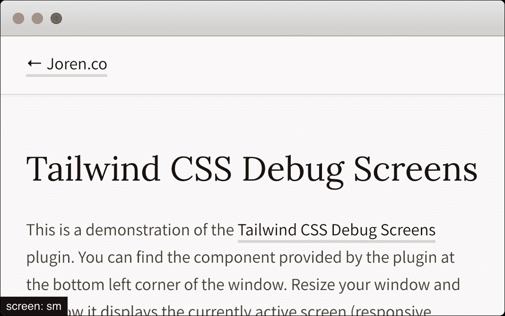

# 提高生产力的 10 个 CSS 技巧

> 原文：<https://blog.logrocket.com/10-tailwind-css-tips-to-boost-your-productivity/>

我喜欢顺风有两个原因。首先，它使得构建响应界面变得更加容易。当你掌握了所有的实用程序类，你真的会惊讶于从一个界面到另一个界面调整 UI 元素的速度有多快。

其次，因为你只能使用 Tailwind 的预定义类来设计你的组件，它在你的前端团队中创建了一个强大的约定，这使得一起工作的过程更加容易。

最终，使用 Tailwind 有助于您更快地创建更干净的代码，并减少错误。今天，我想和你分享 10 个很棒的技巧，我真的认为我们可以作为前端开发人员使用，在使用 Tailwind CSS 构建应用程序时更有效率。

我们开始吧！

## 在你的顺风配置文件中，设置`!important`为`true`。

该选项将所有实用程序类附加上`!important`关键字。

当您处理为某些元素添加样式的第三方库时，这尤其有用。这样，您将确保当您向这些元素添加新的实用程序类时，它们将始终被应用。

```
javascript
// tailwind.config.js
module.exports = {
  important: true,
};
```

现在，Tailwind 的所有实用程序类都将生成为`!important`:

```
css
.mt-1 {
  margin-top: 1px !important;
}
.mt-2 {
  margin-top: 2px !important;
}
.mt-3 {
  margin-top: 3px !important;
}
/* And so on... */
```

## 厌倦了居中和定义主容器类的填充？

在您的配置文件中为您的容器设置一些设置，它将自动应用于所有的`.container`类。

```
javascript
// tailwind.config.js
module.exports = {
  theme: {
    container: {
      center: true,
      padding: "1.5rem",
    },
  },
};
```

所以，没有必要这样做:

```
html
<div class="container p-6 mx-auto"></div>

```

现在，你可以这样做:

```
html
<div class="container"></div>

```

## 不要忘记，您仍然可以添加自己的实用程序类

配置文件中的`extend`属性将自动为您的项目生成并添加新的类。当您需要给定 CSS 属性的附加类时，这很方便。

例如，当谈到最大高度时，您只能访问以下类:

```
.max-h-full    /* max-height: 100%; */
.max-h-screen  /* max-height: 100vh; */

```

但是，如果您需要使用像`max-h-xs`、`max-h-sm`或`max-h-md`这样的类更精确地控制 max-height 属性，该怎么办呢？

那么，你可以这样来生成它们:

```
javascript
    // tailwind.config.js
    module.exports = {
      theme: {
        extend: {
          maxHeight: {
            xs: "20rem",
            sm: "24rem",
            md: "28rem",
            lg: "32rem",
            xl: "36rem",
            "2xl": "42rem",
            "3xl": "48rem",
            "4xl": "56rem",
            "5xl": "64rem",
            "6xl": "72rem",
          },
        },
      },
    };
```

## 总是知道哪个断点当前是活动的



[TailwindCSS 调试屏幕](https://github.com/jorenvanhee/tailwindcss-debug-screens)插件将让你在开发模式下显示当前活动的屏幕。设置只需几秒钟，从长远来看，这可能会为您节省大量时间。您可以这样安装它:

```
bash
npm install tailwindcss-debug-screens --save-dev
```

```
javascript
// tailwind.config.js
module.exports = {
  plugins: [require("tailwindcss-debug-screens")],
};

```

将类`debug-screens`添加到您的`<body>`标签中。

```
html
<body class="debug-screens"></body>
```

## 如果您需要将顺风整合到现有项目中，您可以停用预检

来自文档:预检是顺风项目的一组基本样式，旨在消除跨浏览器的不一致，并使您更容易在设计系统的约束下工作。

这意味着预检将删除所有默认边距、字体大小等。，用于所有元素，如标题、引号、列表等等。

几个月前，我需要逐步将 Tailwind 集成到一个现有的项目中(该项目有严格的基础风格)。预检的问题是它破坏了所有的应用程序界面。我花了一段时间才找到让它失效的方法:

```
javascript
// tailwind.config.js
module.exports = {
  corePlugins: {
    preflight: false,
  },
};
```

## 需要自己定义断点吗？

如果你的设计器使用的断点不同于 Tailwind 提供的断点，不用担心！只需打开您的配置文件并定义您自己的文件。请记住，如果需要，您可以使用最小宽度和最大宽度定义来创建断点。

```
javascript
// tailwind.config.js
module.exports = {
  theme: {
    screens: {
      sm: { min: "640px", max: "767px" },
      md: { min: "768px", max: "1023px" },
      lg: { min: "1024px", max: "1279px" },
      xl: { min: "1280px" },
    },
  },
};

// Will equal to
// tailwind.config.js
module.exports = {
  theme: {
    screens: {
      sm: "640px",
      // => @media (min-width: 640px) { ... }
      md: "768px",
      // => @media (min-width: 768px) { ... }
      lg: "1024px",
      // => @media (min-width: 1024px) { ... }
      xl: "1280px",
      // => @media (min-width: 1280px) { ... }
    },
  },
};
```

## 对于填充、边距、宽度和高度，你更喜欢 px 而不是默认的 rem 吗？

配置文件中的 spacing 属性允许您在捕捉中覆盖默认的间距/大小比例。

```
javascript
// tailwind.config.js
module.exports = {
  theme: {
    spacing: {
      "1": "8px",
      "2": "12px",
      "3": "16px",
      "4": "24px",
      "5": "32px",
      "6": "48px",
    },
  },
};
```

## 如何订购弹性项目

如果你正在使用 flexbox，你可能已经习惯了`order`属性。可惜顺风不包括。

一个很好的解决方法是使用[tailwindcss-flexbox-order](https://github.com/035media/tailwindcss-flexbox-order)扩展。

然后，您将能够配置和生成 flexbox 订单类别及其所有响应变量。

默认情况下，会生成以下实用程序类:

```
css
.-order-1 {
  order: -1;
}
.order-0 {
  order: 0;
}
.order-1 {
  order: 1;
}
.order-2 {
  order: 2;
}
.order-3 {
  order: 3;
}
.order-4 {
  order: 4;
}
.order-5 {
  order: 5;
}
```

## 最好避免使用@apply 并将所有内容提取到组件中

亚当·瓦森(顺风的创造者)，[在推特](https://twitter.com/adamwathan/status/1226511611592085504?lang=en)上说:

> 坦白说:Tailwind 中的`apply`特性只是为了欺骗那些被长长的类列表吓跑的人，让他们尝试这个框架。你几乎不应该使用它。而是重用你的实用程序散落的 HTML。

简而言之，这会导致可维护性问题。我建立了几个项目，我很少需要依赖它们。所以相信我，这是可能的！

如果你正在使用像 Vue.js 或 React 这样的框架(在那里你把一切都定义为组件)，避免使用`@apply`特性会很简单。我很少使用它。

我还有另一个不经常使用它的原因:我发现当我只在代码中使用实用程序类时，调试代码更容易。您可以看到哪个样式应用于每个标签，因为您的团队只有一个地方可以控制样式(即类)。

所以，小心使用`@apply`功能，这样从长远来看你可以节省一些时间！

* * *

### 更多来自 LogRocket 的精彩文章:

* * *

## 当你遇到问题时，如何快速寻求帮助

Tailwind 是一个不断发展的社区，充满了热情的前端开发人员。您可以通过以下渠道联系其他用户:

这就是我的全部！在用 Tailwind(尤其是`tailwindcss-debug-screens`)开始一个项目之前，知道这些技巧会让我的生活变得容易得多。

自从我开始应用它们，用顺风工作变得更加舒适。如果你有其他没有在这里列出的建议，请在评论中解释并与我们分享。

## 结论

最后一点:要想一直获得关于顺风社区建设的最新消息，你可以看看 Awesome Tailwind 的 README.md 文件。几秒钟后，您将能够看到所有您应该关注的新包和资源。

编码快乐！

## 你的前端是否占用了用户的 CPU？

随着 web 前端变得越来越复杂，资源贪婪的特性对浏览器的要求越来越高。如果您对监控和跟踪生产环境中所有用户的客户端 CPU 使用情况、内存使用情况等感兴趣，

[try LogRocket](https://lp.logrocket.com/blg/css-signup)

.

[](https://lp.logrocket.com/blg/css-signup)[https://logrocket.com/signup/](https://lp.logrocket.com/blg/css-signup)

LogRocket 就像是网络和移动应用的 DVR，记录你的网络应用或网站上发生的一切。您可以汇总和报告关键的前端性能指标，重放用户会话和应用程序状态，记录网络请求，并自动显示所有错误，而不是猜测问题发生的原因。

现代化您调试 web 和移动应用的方式— [开始免费监控](https://lp.logrocket.com/blg/css-signup)。