# 理解 Unity 中的 2D 和 3D 光线投射

> 原文：<https://blog.logrocket.com/2d-3d-raycasting-unity/>

光线投射经常是教程、论坛和博客中激烈辩论的主题。不仅来自爱好者，也来自高级开发人员，他们往往难以理解物理类的细微差别。

如果你不完全熟悉 Unity 的官方文档也没关系。为了覆盖更多的领域，他们采取了一种笼统而简单的方法，而不是详尽而详细的解释。

这就是为什么我很高兴你在我们详细探索光线投射时找到了这篇文章！

我们想深入研究这个问题，这就是为什么这篇文章采用了非常理论化的方法。主要的想法是帮助每个人真正理解在 Unity 的 Raycasting 下发生了什么。

我们也希望你能从中得到乐趣，并发现这篇文章是 Unity 中光线投射的一体化资源。

## 在 Unity 中理解物理学

你是否曾经对选择哪种方法感到不确定？或者对每种方法的不同之处犹豫不决？

这很正常。考虑到 Unity 给了你 22 种现成的方法，如果你考虑到过载，你会得到 100 多种不同的方法在你的场景中使用——这是一个很大的数目！

哦，那只是 3D 的。难怪人们会恐慌！

让我们来看看 Unity 的内部:

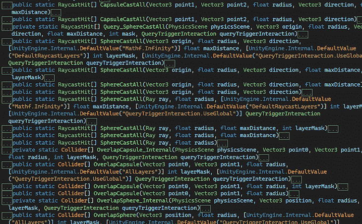

令人畏惧，是吧？

别担心。毕竟物理只是 Unity engine 内部的另一门课。

让我们尝试通过添加一些上下文来构建物理课。这里我们想要的是知道类在引擎中的位置。

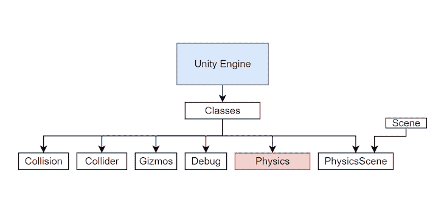

现在，让我们深入研究物理课本身。

如果我们把 100 多种方法分成三个简单的类别会怎么样？它们会更容易被记住。我们只需要给它们取个好听的名字。

像这样:

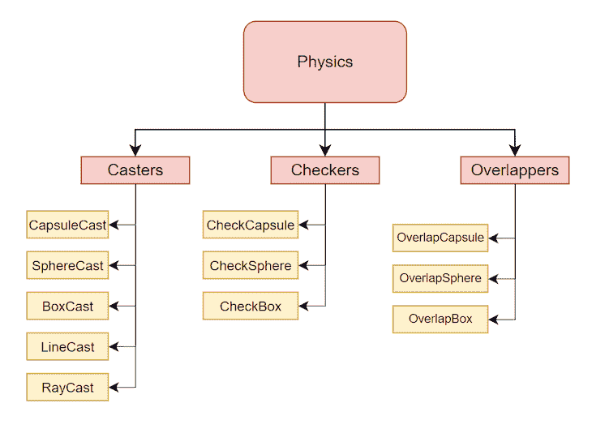

看看那个！整洁！

稍后我们将看到这种分组背后的基本原理，但是，现在，让我们继续一些关键的概念。

## 光线投射可能不是你想的那样

我们都曾在某个时候使用过“光线投射”这个说法。这听起来很符合逻辑，但是如果你知道这在 Unity 中并不完全准确或有用呢？

在上面提到的 100 多种方法中，*唯一使用射线的*组是施法者。

你看，为了理解自己的系统，Unity 根据自己的需要修改了自己的命名规则。似乎很明显，他们从 Nvidia 的 PhysX 框架改编了类，但由于这种约定并不真正明确，人们可能会感到困惑，这就是为什么我们首先分析了物理类。

* * *

### 更多来自 LogRocket 的精彩文章:

* * *

在 Unity 的上下文中更有意义的一个术语，也是我们从现在开始将使用的一个术语，是物理查询。

如果你仔细想想，那就是:你正在检查你游戏的*物理*世界，而不仅仅是投射光线。

如果不管，Unity 将在后台工作，进行大量的计算。这就是物理学疑问出现的地方。它们是你用来评估正在发生的事情的工具。

说到这里，就不能不提到牛顿来谈物理。继续阅读，找出为什么老艾萨克可能是错的。

## 物理场景

当然，你已经知道 Unity 中的场景是一种资产，对吗？

你可能不知道的是，Unity 在场景中存储了很多东西，而不仅仅是游戏对象和变换。

场景的一个重要组成部分是物理场景。

看看这个。进入窗口>分析>物理调试器和惊奇！你现在可以接触到一个大卫·林奇式的替代现实——把它想象成统一的颠倒。

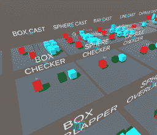

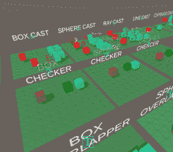

物理场景有自己的类和方法，都和物理有关。这是你调试碰撞和层的终极工具。

花点时间探索这个新窗口的所有设置；你需要的所有物理知识都在这里。

虽然我们并不真正了解内部运作，但我们知道物理场景与物理模块协同工作。

两者合在一起，它们是女巫的炖汤，所有的物理都混合在一起。

## 物理查询是什么样子的

在这一部分，我们将非常简要地触及物理查询的最基本的概念。

游戏对象需要符合物理类要考虑的某些方面。这就是为什么在下图中，我们画了物体内部的刚体，以及作为某种边界的碰撞器。

一般来说，你可以把碰撞器想象成与外界的公共通讯器，而刚体更像是一个物体内部的私有属性。

它们协同工作，但是当碰撞器可以访问它们的刚体时，刚体对碰撞器一无所知。


总而言之，碰撞器和刚体都是用来发现在你游戏的物理世界中正在发生什么，接下来会发生什么。

但是，如果你不想等着知道将要发生什么呢？如果您需要提前知道，以便采取行动，该怎么办？如果你根本不想去呢？

让你确定这一点的技术的名字，你猜对了——物理查询。

在下图中，您将看到一个简单的物理查询:

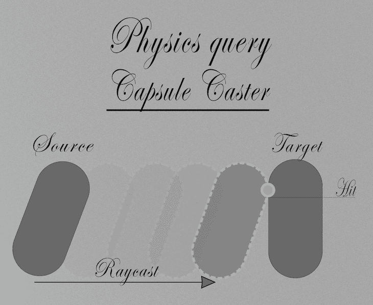

你看到的是一个源和一个目标对象。我们说过，我们想提前知道事情。能够接触到它给了我们大量的机会来编码有趣的反应。

我们可以说，当两个对撞机在同一时间和空间时，就发生了碰撞；它们是重叠的。换句话说，他们在握手。这就是 RaycastHit 的由来。

当两个刚体在同一时间和空间时，我们会想到穿透力和脱离力或碰撞；但那是另一个教程。

## 概述

只是简单回顾一下到目前为止您所看到的内容。我们看到了什么是物理类，以及它在引擎中的位置。我们已经把所有的课程分成记忆组。我们已经看到了物理学的“另一面”。我们建立了一些合适的词汇来理解技术层面上发生的事情。我们也解释了物理查询是什么样子的。

让我们继续。

## 解释棋子、脚轮和重叠器

我们将解释我们如何以及为什么划分这三个组。

最重要的是。让我们就此达成一致:所有的物理学疑问…

*   探测空间
*   使用几何模型(直线、射线、球体、立方体或胶囊)
*   可以忽略层
*   可以忽略触发器
*   可以参加 Unity 的回调(活动)

现在您已经知道了所有查询的共同点，让我们来看看一些不同之处。

### **跳棋**

*   最简单的一种
*   他们不扫；它们是静止的形状
*   他们不检索除了真或假之外的信息，他们问 Unity:你撞到什么东西了吗？统一回答:是/否

### **脚轮**

*   他们移动/清扫。查询穿越空间
*   他们检索到了 RaycastHit:一个充满有价值信息的结构体
*   他们找回了布尔
*   它们以数组的形式给出一次或多次点击的信息
*   如果你想到未来的碰撞(早期探测)，就很容易理解它们
*   问 Unity:我会把这个【形状】扔成一条直线。如果它击中了什么，给我所有关于它的数据

### **重叠**

*   他们根本不扫也不动
*   他们只检索(对撞机的)数组
*   他们关心两个东西是否同时在同一个地方
*   他们问 Unity:我会把这个[形状]放在我面前。如果有东西出现在里面，给我里面所有物体的对撞机的所有数据

## 打破牛顿第三定律

还记得牛顿第三定律吗？关于作用力和反作用力的那个？他对电子游戏知之甚少。

视频游戏最奇怪的一点是，尽管我们尽最大努力让它们变得真实，它们还是会留在视频游戏中。

在电子游戏中，反应并不一定跟随一个动作。电子游戏给了我们这个劫持牛顿第三定律的大好机会。

在电子游戏中，牛顿第三定律是这样的:

行动>可能的分析>可能的反应。

现在使用查询这个词更有意义了。这些疑问本质上是对世界的早期发现。我们可以捕捉并分析正在发生的事情。我们可以在其他事情发生之前采取行动。

想想看，发生在文学作品中的不也是如此吗？

## 解释回购

作者用 Unity 项目创建了一个[公共回购，供大家学习](https://github.com/Mauro-Fuentes/Unity_RayCasters)。如果你仍然对 Unity 中的光线投射有疑问，我希望这能帮助你理解。

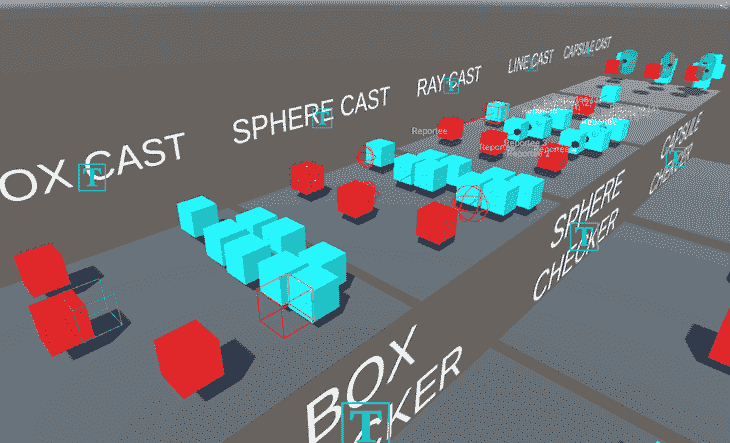

在里面，你会发现 Unity 最重要的物理查询方法的可视化表示。它们清楚地描述了每种方法中发生的事情。我们将继续为你们添加和润色这个回购协议。

你甚至不需要按下播放键就能看到查询的运行；你可以在编辑时间看到它。最棒的是，代码中没有任何花哨的技巧。你只需抓取代码并将其粘贴到你的游戏中就可以尝试了。

出于礼貌，请提及我们或作者——即使是 Unity 也不敢这么做！

## 非合金

在这一节中，我们将讨论物理查询、内存分配、缓冲和非分配查询之间的关系。

### 分配

每当你在代码中创建一些东西，你就分配内存。因为分配意味着“分配”。所以，分配是好的…直到它们不好。

那么，什么时候分配是一件坏事呢？

通常，在以下情况下，分配是不好的:

*   不负责分配
*   不知道你在分配什么
*   失去对流程的控制
*   忘记他们
*   反正也不会用(找 YAGNI)

那么，和物理查询有什么关系呢？

那很简单，每个物理查询版本都是量身定制的，每次解决一两个上述问题。随着时间的推移，每个物理查询都有其优点和缺点。

### 缓冲器

现在，让我们转到缓冲区。

基于 Unity 的文档和来自精英中的精英的编程最佳实践，让我们在这里陈述一些准则:

1.  缓冲所有东西，而不是在运行时创建东西。
2.  尽可能寻找 0 不负责任的分配。

### 非合金

在非分配方法中，Unity 确保在使用内存之前负责任地分配内存(预分配)。因为数组是一种引用类型，所以可以将其作为参数传递。Unity 不关心那个数组的内容，只关心大小。

看看这个:

```
public static int OverlapSphereNonAlloc(Vector3 position, float radius, Collider[] results) 
```

看到 Unity 要求一个对撞机阵列了吗？

把它想象成一个魔方。你把它交给 Unity，它会在内部洗牌后再还给你。该方法不会以这种方式产生垃圾，因为 Unity 不需要创建新的数组。

这就是为什么它被称为非分配，因为*他们*不分配内存，你分配！

相反，其他版本在每次调用时都会创建一个新数组。

例如:

```
public static Collider[] OverlapSphere(Vector3 position, float radius) 
```

这意味着如果你再次调用它，它将会忘记旧的数组，并希望垃圾收集器能够处理掉它。

## 事实还是诡计

如果你曾经读过 Unity 的博客或论坛，你会意识到人们在这个话题上失去理智，我们会尽力解释发生了什么！

在这一部分，我们将陈述一些基本事实，以帮助你得出自己的结论，不再被骗。我们会给你工具来帮助你组织和选择你需要的方法。

### 事实 1: **不能直接调用 Unity 的物理方法**

| 一个新的名称 Name | 雷，雷 | 生气了 | 生气了 | 生气了 | 生气了 | 生气了 | 生气了 | 生气了 | 在外 | 吸收 | 返回 | Returns |  |  |
|  |  |  |  |  |  |  |  |  |  |  |  |  |  | 调味瓶 |
| 胶囊广告 | CapsuleCast | 第一点 | 第二点 | 半径 | 方向 | 最大距离 | 图层蒙版 | queryTriggerInteraction | queryTriggerInteraction |  | 弯曲件 | 没有检索命中 | 调味瓶 | 胶囊广告 |
| Caster | 第一点 | 第二点 | 半径 | 方向 | 最大距离 | 图层蒙版 | queryTriggerInteraction | 外部射线投射 | queryTriggerInteraction | 弯曲件 | 正在检索 1 个命中 | 调味瓶 | 胶囊安装 | retrieving 1 hit |
| 第一点 | 第二点 | 半径 | 方向 | 最大距离 | 图层蒙版 | queryTriggerInteraction | RaycastHit[] | 检索所有点击(不受控制) | 调味瓶 | 胶囊铸件 | 第一点 | 第二点 | 半径 | 方向 |
| 最大距离 | 图层遮罩 | queryTriggerInteraction | RaycastHit[] | （同 Internationalorganizations）国际组织 | 检索受控点击 | 调味瓶 | 球形 Cast | layerMask | queryTriggerInteraction | 起源 | 半径 | 方向 | 最大距离 | 图层蒙版 |
| queryTriggerInteraction | 外部射线投射 |  | 弯曲件 | 正在检索 1 个命中 | 调味瓶 | 球形 Cast | 射线 |  |  | 半径 |  | 最大距离 | 图层蒙版 | queryTriggerInteraction |
| Caster | SphereCast | 弯曲件 | 没有检索命中 | 调味瓶 | 球形 Cast | 射线 | maxDistance | layerMask | 半径 | out RaycastHit | 最大距离 | 图层蒙版 | queryTriggerInteraction | 外部射线投射 |
| Caster | 弯曲件 | 正在检索 1 个命中 | 调味瓶 | 球形安装 | radius |  | 起源 | 半径 | 方向 | 最大距离 | 图层蒙版 | queryTriggerInteraction | RaycastHit[] | 检索所有点击(不受控制) |
| 调味瓶 | 球形安装 | 射线 |  |  | 半径 | 最大距离 | 图层遮罩 | queryTriggerInteraction | RaycastHit[] | 检索所有点击(不受控制) | 调味瓶 | 球形铸件 | 射线 | 半径 |
| 方向 | 最大距离 | 图层蒙版 | queryTriggerInteraction | RaycastHit[] | （同 Internationalorganizations）国际组织 | 检索受控点击 | 调味瓶 | 球形铸件 | queryTriggerInteraction |  | 起源 | 半径 | 方向 | 最大距离 |
| 图层蒙版 | queryTriggerInteraction | RaycastHit[] | （同 Internationalorganizations）国际组织 | 检索受控点击 | 调味瓶 | 盒式广播 | maxDistance | 中心 | 半范围 | 方向 | 方向 | 最大距离 | 图层遮罩 | queryTriggerInteraction |
| Caster | SphereCastNonAlloc | 弯曲件 | 没有检索命中 | 调味瓶 | 盒式广播 | 中心 | 半范围 | 方向 | 方向 | 最大距离 | 图层蒙版 | queryTriggerInteraction | 外部射线投射 | retrieving controlled hits |
| 弯曲件 | 正在检索 1 个命中 | 调味瓶 | 盒式铸件 | origin | 中心 | 半范围 | 方向 | 方向 | 最大距离 | 图层遮罩 | queryTriggerInteraction | RaycastHit[] | 检索所有点击(不受控制) | 调味瓶 |
| BoxCastNonAlloc |  | 中心 | 半范围 | 方向 | 方向 | 最大距离 | 图层蒙版 | queryTriggerInteraction | RaycastHit[] | （同 Internationalorganizations）国际组织 | 检索受控点击 | 调味瓶 | 光线投射 |  |
| Caster | 起源 | 方向 | 最大距离 | 图层遮罩 | queryTriggerInteraction | orientation | maxDistance | 弯曲件 | 没有检索命中 | 调味瓶 | 光线投射 | 起源 | 方向 | no retrieving hit |
| 最大距离 | 图层蒙版 | queryTriggerInteraction | 外部射线投射 | halfExtents | 弯曲件 | 正在检索 1 个命中 | 调味瓶 | 光线投射 | -雷 | out RaycastHit |  | bool |  | 最大距离 |
| 图层遮罩 | queryTriggerInteraction |  | center | 弯曲件 | 没有检索命中 | 调味瓶 | 光线投射 | -雷 | queryTriggerInteraction |  |  | RaycastHit[] | 最大距离 | 图层遮罩 |
| queryTriggerInteraction | 外部射线投射 |  | 弯曲件 | 正在检索 1 个命中 | 调味瓶 | 射线追踪原点方向 | 最大距离 | 图层遮罩 | queryTriggerInteraction | RaycastHit[] | 检索所有点击(不受控制) | 调味瓶 | 射线铸造 | 射线 |
|  |  |  |  | 最大距离 | 图层蒙版 | queryTriggerInteraction | RaycastHit[] | 检索所有点击(不受控制) | 调味瓶 | RayCastNonAlloc |  |  | 起源 | 方向 |
| Caster | 最大距离 | 图层蒙版 | queryTriggerInteraction | RaycastHit[] | （同 Internationalorganizations）国际组织 | 检索受控点击 | 调味瓶 | RayCastNonAlloc | 射线 | 最大距离 | 图层遮罩 | queryTriggerInteraction | RaycastHit[] | （同 Internationalorganizations）国际组织 |
| 检索受控点击 | 调味瓶 | 线播 |  | 开始 | 结束 | 图层蒙版 | queryTriggerInteraction | layerMask | queryTriggerInteraction | 弯曲件 | 没有检索命中 | 调味瓶 | 线播 | retrieving 1 hit |
| 开始 | 结束 | ray |  |  | 图层蒙版 | queryTriggerInteraction | 外部射线投射 | layerMask | 弯曲件 | 正在检索 1 个命中 |  | bool |  | no retrieving hit |
| Caster | RayCast | ray |  |  |  |  | maxDistance | layerMask | queryTriggerInteraction | out RaycastHit | 国际跳棋 | 检验盒 |  | 中心 |
| Caster | RayCastAll | 方向 | 图层蒙版 | queryTriggerInteraction | direction |  | 弯曲件 | 没有检索命中 | 国际跳棋 | 检查球 |  | 位置 | 半径 | 图层蒙版 |
| queryTriggerInteraction | RayCastAll | ray | 弯曲件 | 没有检索命中 | 国际跳棋 | 检查胶囊 | maxDistance | 开始 | 结束 | 半径 | 图层蒙版 | queryTriggerInteraction |  | retrieving all hits (uncontrolled) |
| 弯曲件 | 没有检索命中 |  |  | origin | direction |  | maxDistance | layerMask | queryTriggerInteraction |  | RaycastHit[] | int |  | retrieving controlled hits |
| Caster | RayCastNonAlloc | 重叠 | 重叠框 |  | 中心 |  | maxDistance | 方向 | 图层蒙版 | queryTriggerInteraction | 碰撞器[] | 检索所有点击(不受控制) | 重叠 | 重叠框 |
| 中心 |  |  | 方向 |  | 面具 | queryTriggerInteraction | 碰撞器[] | （同 Internationalorganizations）国际组织 | 检索受控点击 | 重叠 | 重叠层 | 位置 | 半径 |  |
| Caster | 图层蒙版 | queryTriggerInteraction | 碰撞器[] | 检索所有点击(不受控制) | 重叠 | OverlapSphereNonAlloc |  | 位置 | radius |  |  | layerMask | queryTriggerInteraction | no retrieving hit |
| Caster | （同 Internationalorganizations）国际组织 | 检索受控点击 | 重叠 | 重叠胶囊 | 零点 | 第一点 | 半径 | layerMask | queryTriggerInteraction | 图层蒙版 | queryTriggerInteraction | 碰撞器[] | 检索所有点击(不受控制) | 重叠 |
| OverlapCapsuleNonAlloc |  | 零点 | 第一点 | 半径 |  |  | 图层蒙版 | queryTriggerInteraction |  |  | （同 Internationalorganizations）国际组织 | 检索受控点击 | Unity 的大多数方法都是私有的。您真正调用的实际上是包装器方法(如果您愿意，也可以称为重载)。即使你可以，别忘了 Unity 的核心是 C++。 | 您调用方法包装器；然后它们调用其他包装器；包装器调用根方法；根方法调用其他类；这些类有更多的内部包装器等等，直到你碰到 Unity C#/C++的墙。事情就是这样。你不能控制它，不能改变它。 |
| 为了给你一个思路，假设你调用最简单版本的 CapsuleCast(): | 物理。CapsuleCast()(一个方法包装器)调用“根”CapsuleCast() | 该根调用 PhysicsScene 中的另一个 CapsuleCast()。 | 从那里调用 InternalCapsultCast()。从那里，一个查询被创建。从那里，有一个对某个类的调用，请求另一个被称为注入版本的版本，在那里你碰到了 C#/C++层的墙。 | 事实 2: **只根据你的需要调用方法** | 所以，你还在犹豫用什么方法。你问自己哪个更快，哪个更好。没问题，我们准备了这个方法来帮助你。请注意，此图像仅用于说明目的。 | 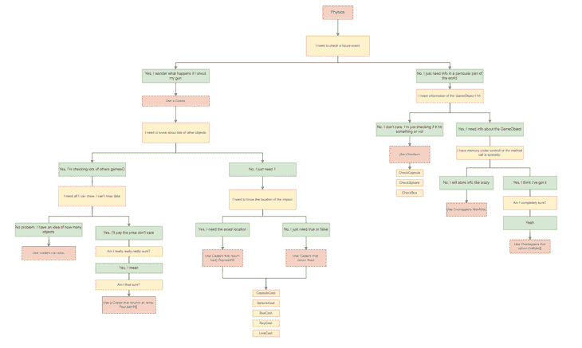 | 最后一点:记住我们之前说过的话——不要在微优化上失去理智，只需为你的分配负责。 | 事实三:**物理查询是同一枚硬币的 100 个面** | 我们走得更远；我们已经创建了一个一体化的谷歌表单，您可以在其中比较和对比所有方法。你很快就会意识到他们有更多的共同点。这是因为他们已经为 Unity 标准做了很好的规划。 | 您可以搜索每种方法。在这个例子中，让我们看看如何只过滤那些使用光线作为参数的方法: | 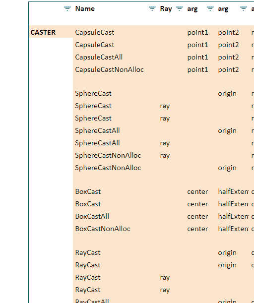 | 事实 4: **样板文件的神话** | 如果我们回到第一个事实。仔细想想，整个 C#层都是样板文件。现在，包装器不是样板文件，因为它们是帮助您选择适合您需要的方法的工具。 | 但无论如何，我们继续前进，还准备了另一种类型的文件来帮助解决问题——它是回购中的 [`helper.cs`。](https://github.com/Mauro-Fuentes/Unity_RayCasters) |
| 记住这件丑陋的事情: |  | 我们把它变成了这样: | 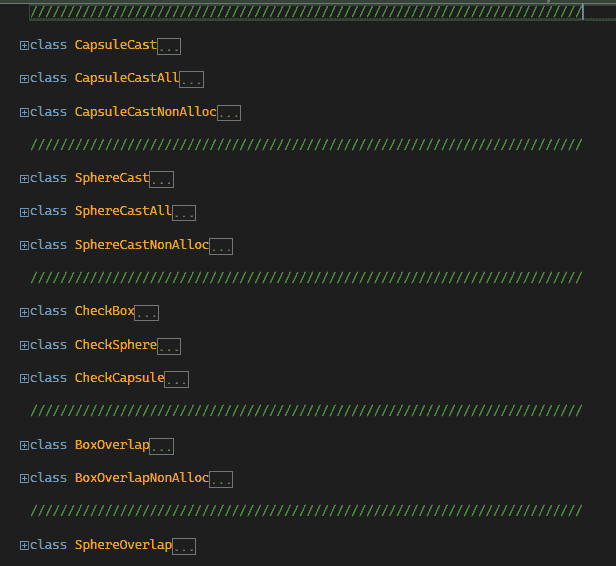 | 注意，helper.cs 是一个剥离的人类可读代码版本，必须**而不是**按原样用于编码。这个文件只是以一种整洁的方式描绘了物理类。 | 表演 | 最后一点。我们不想在这里听起来悲观，但是性能到底是什么？ | 什么更有表演性？ | 你不懂，你不会维护，你不会控制但不会制造垃圾的超快代码？ | **或** | 有点慢的代码，产生了一点垃圾，但是它很短，容易阅读，容易维护。 | 试验 | 作为免责声明，这些测试是使用普通的 Unity profiler 运行的。我们不关心实际的原始值，而是(垃圾)性能的比例对比。你也可以测试它，我们已经提供了一个[场景，在这里你可以创建你自己的](https://github.com/Mauro-Fuentes/Unity_RayCasters)。 | 这三个测试案例是在 1400 台对撞机上运行的。每个案例时长两分钟。使用的方法是 BoxOverlap。 |
| 测试的结构是这样的: | **测试:** | **时间:**任务完成该帧所用的时间:X 毫秒(ms) | **每帧垃圾:** X 每帧产生的以千字节(KB)为单位的垃圾量(/帧) | **每秒垃圾量:** X 垃圾量乘以 60 帧，我们得到 1 秒钟的垃圾量 | **每分钟垃圾数:**将该结果乘以 60 秒，以估计 1 分钟内未收集的垃圾数 | 丑陋的 | 在这种情况下，我们使用 BoxOverlap 方法，但这是最坏的想法。在更新函数中缓存数组。信不信由你，曾经有一段时间 Unity 开发者推荐这种做法。 | **时间:** 0.83 毫秒 | **每帧垃圾:** 22.5 KB G/F | **每秒垃圾数:**22.5 KB G/F x60f = 1350 KB G/s[1.35 MB G/s] | **每分钟垃圾:**1350 KB s x60s = 80001 KB G/m[80mb G/m] | 你看到了吗？想象一下，如果你用 1 GB 的内存运行。你的游戏不仅每分钟消耗 80 MB 的垃圾，而且每次它不得不转储这么多垃圾并且只分配一个简单的列表时，它肯定会冻结或口吃。太丑了！ | 坏事 | 这种情况和以前一样，但是它预先在 Update 方法之外缓存数组。 |
| **时间:** 0.77 毫秒 | **每帧垃圾:** 11.8 KB G/F | **每秒垃圾数:** 11.8 KB G/F x 60 F = 708 KB G/s | **每分钟垃圾数:**708 KB x60s = 42mb G/分钟 | 比以前丑了一半。 | 好人 | 没什么好说的。 | **时间:**0.1 毫秒 | **每帧垃圾:** 0 B G/F | **每秒垃圾数:** 0 x 60 x 60 = 0 B G/s | **每分钟垃圾:**人间天堂！ | 图层:忽略一个或多个图层 | 我们说过每个物理查询都可以忽略层。 | 该结构的名称是 LayerMask，因为它是单数，所以可能会欺骗您。但是这个特殊的结构直接连接到 Unity 的内部，所以它知道你的项目中的所有层。这是完美的，因为你只需要一个访问所有。 | 如果你在回购内部的 3D 场景中查找，你会发现一个框投忽略层。这些游戏对象有一个非常特殊的(紫色)立方体。如果你点击它，你会发现它属于一个名为“SpecialCube”的自定义层。 |
| 现在，如果您选择记者，您会发现它有脚本“BoxCasterIgnoreLayer”。忽略“特殊立方体”所在的层，只需选择该层并将其传递给物理查询即可。 | 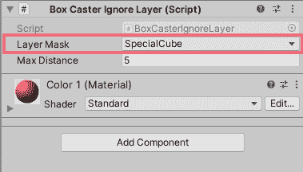 | 代码如下所示: | 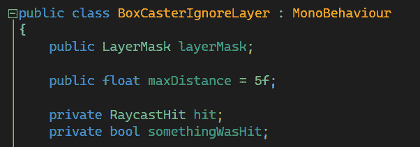 | 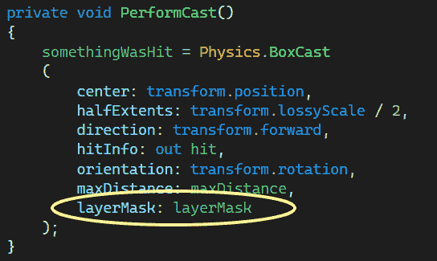 | 如果您想要添加更多层，只需在检查器中选取“更多”。 | 结论 | 现在你已经完成了这篇文章，我们希望你对 Unity 的物理理解更加全面。 | 请记住，现在您已经有了一个包含所有查询的 Unity 项目、一个包含清晰可读文本的 Helper 类、一个用于过滤类的 Google sheet 哦，还有一个 drawio 文件来帮助您决定使用哪种方法。 | 如果您觉得我们应该添加一些内容，请随时联系我们。 | 我们知道这篇文章更多的是理论性的，而不是实践性的。但是，现在你已经有了理解所有关于 3D 和 2D 的物理课的基础，因为这篇文章为以后的很多内容做了铺垫。 | 不要犹豫，评论或联系我们。尽情享受吧！ | 使用 [LogRocket](https://lp.logrocket.com/blg/signup) 消除传统错误报告的干扰 | [LogRocket](https://lp.logrocket.com/blg/signup) 是一个数字体验分析解决方案，它可以保护您免受数百个假阳性错误警报的影响，只针对几个真正重要的项目。LogRocket 会告诉您应用程序中实际影响用户的最具影响力的 bug 和 UX 问题。 | 然后，使用具有深层技术遥测的会话重放来确切地查看用户看到了什么以及是什么导致了问题，就像你在他们身后看一样。 |
| LogRocket 自动聚合客户端错误、JS 异常、前端性能指标和用户交互。然后 LogRocket 使用机器学习来告诉你哪些问题正在影响大多数用户，并提供你需要修复它的上下文。 | 关注重要的 bug—[今天就试试 LogRocket】。](https://lp.logrocket.com/blg/signup-issue-free) |  | center |  |  | orientation |  | mask | queryTriggerInteraction |  | Collider[] | int |  | retrieving controlled hits |
| Overlappers | OverlapSphere |  | position | radius |  |  | layerMask | queryTriggerInteraction |  |  | Collider[] |  | retrieving all hits (uncontrolled) |
| Overlappers | OverlapSphereNonAlloc |  | position | radius |  |  | layerMask | queryTriggerInteraction |  |  | int |  | retrieving controlled hits |
| Overlappers | OverlapCapsule |  | point0 | point1 | radius |  |  | layerMask | queryTriggerInteraction |  |  | Collider[] |  | retrieving all hits (uncontrolled) |
| Overlappers | OverlapCapsuleNonAlloc |  | point0 | point1 | radius |  |  | layerMask | queryTriggerInteraction |  |  | int |  | retrieving controlled hits |

Most of Unity’s methods are private. What you are really calling are in fact wrapper methods (overloads, if you will). Even if you could, don’t forget Unity’s core is C++.

You call method wrappers; then they call other wrappers; wrappers call root methods; root methods call other classes; those classes have more internal wrappers and so on until you hit the Unity C#/C++ wall. That’s just the way it is. You can’t control it, not change it.

To give you an idea, suppose you call the simplest version of CapsuleCast():

```
Physics.CapsuleCast(point1, point2, radius, direction, maxDistance); 
```

Physics.CapsuleCast() (a method wrapper) calls the “root” CapsuleCast()

That root calls another CapsuleCast() inside the PhysicsScene.

From there, a call to the InternalCapsultCast() is made. From there, a query is created. From there, there’s a call to some class that asks for another version called Injected versions and there you hit the wall of the C#/C++ layer.

### Fact 2: **Call methods based only on what you need**

So, you are still hesitant of what method to use. You ask yourself which one is faster or which one is better. No problem, we’ve prepared this approach to help you out. Notice, this image is for illustration purposes only.


As a final thought: remember what we said earlier — don’t lose your head on micro-optimizations, just be responsible for your allocations.

### Fact 3: **Physics queries are 100 faces of the same coin**

We went even further; we’ve created an all-in-one Google Sheet where you can compare and contrast all methods. You will soon realize that they have more in common than not. That’s because they have been really well planned for Unity standards.

You can search for each method. In this example, let’s see how to filter only for methods that use ray as parameters:


### Fact 4: **The myth of boilerplate**

If we go back to the first fact; the whole C# layer is boilerplate if you think about it. Now, wrappers are not boilerplate, since they are tools that help you filter to choose a method that suits your needs.

But anyway, we went ahead and also prepared another type of file to help out — it’s the [`helper.cs` in the repo.](https://github.com/Mauro-Fuentes/Unity_RayCasters)

Remember this ugly thing:


We have turned it into this:


Notice that helper.cs is a stripped human-readable code version and must **not** be used for coding as is. This file just portrays Physics classes in a tidy way.

## Performance

One final note. We don’t want to sound pessimistic here, but what is it about performance anyway?

What’s more performant?

Superfast code you don’t understand, you can’t maintain, you don’t control but doesn’t create garbage?

**Or**

Somewhat slow code that creates *a bit* of garbage, but it’s short, easy to read, and maintainable by juniors?

## Tests

As a disclaimer, these tests were run using the normal Unity profiler. We weren’t concerned about the factual raw values, but the proportional contrast in (garbage) performance. You can test it too, we’ve provided a [scene where you can create yours](https://github.com/Mauro-Fuentes/Unity_RayCasters).

The three test cases were run against 1400 colliders. Each case is two minutes long. The method used is BoxOverlap.

The structure of tests is this:

**Test:**

*   **Time:** Time the task took to complete that frame: X milliseconds (ms)
*   **Garbage per frame:** X amount in KiloBytes (KB) of garbage generated per frame (/frame)
*   **Garbage per second:** X amount of garbage multiplied by 60 frames, so we get the amount in 1 second
*   **Garbage per minute:** That result is multiplied by 60 seconds to estimate the garbage in 1 minute if not collected

### The Ugly

In this case, we use the BoxOverlap method, but with the worst idea possible. To cache the array inside the Update function. Believe it or not, there was a time when Unity developers recommended this practice.

*   **Time:** 0.83 ms
*   **Garbage per frame:** 22.5 KB G/F
*   **Garbage per second:** 22.5 KB G/F x 60 F = 1350 KB G/s [1.35 MB G/s]
*   **Garbage per minute:** 1350 KB s x 60 s = 80001 KB G/m [80 MB G/m]

Did you see that? Imagine if you are running with 1 GB of memory. Your game not only takes 80 MB of trash per minute, but also it will certainly freeze or stutter every time it has to dump so much garbage and only to allocate 1 simple list. That’s ugly!

### The Bad

This case is the same as before, but it caches the array beforehand and outside the Update method.

*   **Time:** 0.77 ms
*   **Garbage per frame:** 11.8 KB G/F
*   **Garbage per second:** 11.8 KB G/F x 60 F = 708 KB G/s
*   **Garbage per minute:** 708 KB x 60 s = 42 MB G/min

That’s half the ugly as before.

### The Good

There’s not much to say.

*   **Time:** 0.1ms
*   **Garbage per frame:** 0 B G/F
*   **Garbage per second:** 0 x 60 x 60 = 0 B G/s
*   **Garbage per minute:** Heaven on earth!

## Layers: ignoring one or multiple layers

We said that every single Physics query can ignore layers.

The name of the struct is LayerMask and can fool you because it is singular. But this special struct is directly wired to Unity’s guts, so it knows all the layers in your project. That’s perfect because you only need one to access all.

If you look up in the 3D scene inside the repo, you will find a Box Cast Ignore Layer. Those gameObjects have a very special (purple) type of cube. If you click it, you’ll find that it belongs to a custom layer called “SpecialCube”.

Now, if you select the Reporter, you’ll find that it has the Script “BoxCasterIgnoreLayer”. Ignoring the layer, where the “SpecialCube” is, it’s as simple as choosing that layer and pass it to the Physics query.


The code looks like this:


If you want to add more layers — simply choose more in the inspector.

## Conclusion

Now that you’ve finished this article, we hope your understanding of Unity’s Physics is far more comprehensive now.

Remember that now you have a Unity project with all queries, a Helper class with clean, readable text, and a Google sheet to filter classes — oh, and a drawio file to help you decide which method to use.

Feel free to contact us if you feel we should add something.

We know this article is more theoretical than a hands-on approach. But, now you have the basis to understand all about Physics class both 3D and 2D, because this article paves the ground for lots of future content.

Don’t hesitate to comment or contact us. Enjoy!

## Cut through the noise of traditional error reporting with [LogRocket](https://lp.logrocket.com/blg/signup)

[](https://lp.logrocket.com/blg/signup)

[LogRocket](https://lp.logrocket.com/blg/signup) is a digital experience analytics solution that shields you from the hundreds of false-positive errors alerts to just a few truly important items. LogRocket tells you the most impactful bugs and UX issues actually impacting users in your applications.

Then, use session replay with deep technical telemetry to see exactly what the user saw and what caused the problem, as if you were looking over their shoulder.

LogRocket automatically aggregates client side errors, JS exceptions, frontend performance metrics, and user interactions. Then LogRocket uses machine learning to tell you which problems are affecting the most users and provides the context you need to fix it.

Focus on the bugs that matter — [try LogRocket today](https://lp.logrocket.com/blg/signup-issue-free).