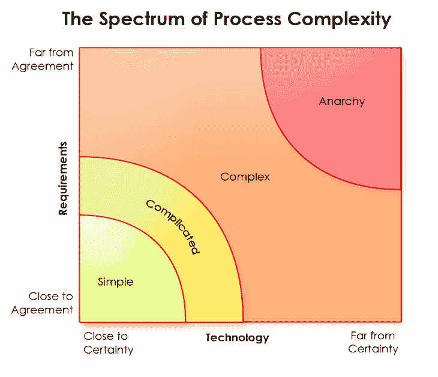
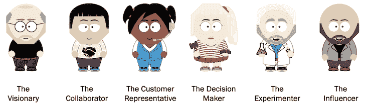
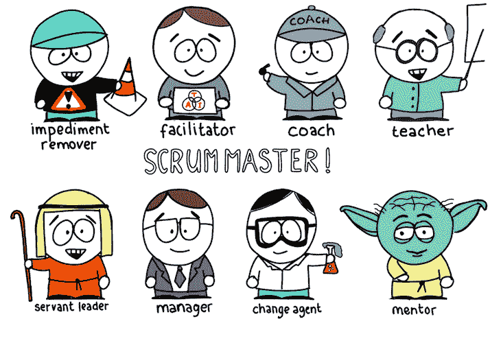

# 敏捷产品开发中的 3 个 scrum 角色是什么？

> 原文：<https://blog.logrocket.com/product-management/3-scrum-roles-agile/>

感觉几乎每个人要么已经在 scrum 中工作，要么渴望在 scrum 中工作。这并不奇怪:这个框架可能已经有 30 年的历史了，但它仍然是解决复杂问题的最有效的方法之一。

scrum 的核心部分是 scrum 团队及其相应的 scrum 角色:产品所有者、scrum master 和开发人员。没有正确实现的 scrum 角色，整个框架就会崩溃。

让我们更深入地理解具体的角色、他们的职责，以及他们如何与 scrum 过程中涉及的其他角色和利益相关者合作。

* * *

## 目录

* * *

## scrum 是什么？

让我们从 scrum 本身的入门开始。

简单地说， [scrum](https://blog.logrocket.com/product-management/what-are-five-types-of-scrum-meetings/) 是一个帮助团队交付价值的框架。

根据 scrum 指南 的说法，Scrum 是“一个轻量级的框架，通过对复杂问题的适应性解决方案，帮助人们、团队和组织创造价值。”

让我们来分解一下 scrum 的定义。

### …一个轻量级框架…”

Scrum 提供了一个基本的结构，仅此而已。它没有确切地告诉我们如何解决问题，也没有提供一步一步的过程。相反，它是提供核心原则的基础，并使团队和组织能够在此基础上进行构建。

Scrum 的轻量级特性允许它在不同的环境中有效地工作。

### …帮助个人、团队和组织创造价值…'

scrum 的主要目标是最大化团队和组织创造的价值。框架中存在的一切都是出于这个原因。

### …通过对复杂问题的适应性解决方案…”

复杂的问题是那些具有高度不确定性的问题。复杂问题的解决方案不能提前计划，而是在团队解决问题的过程中逐渐发现的。

Scrum 帮助我们以结构化的方式驾驭这种复杂性。

Source: [scrum-tips.com](https://www.scrum-tips.com/agile/stacey-complexity-model/)

Scrum 由五个构件组成:

1.  Scrum 理论
2.  Scrum 价值观
3.  Scrum 团队
4.  Scrum 事件
5.  Scrum 人工制品

在本指南中，我们将深入探讨第三个构件:scrum 团队。

## scrum 团队

scrum 团队是 scrum 的基本单位。简而言之，这是一个由专业人士组成的小组，他们一起朝着[产品目标](https://blog.logrocket.com/product-management/what-is-a-product-vision-statement-examples/)努力。

为了实现其目标，团队必须是小型的、跨职能的、自我管理的。让我们更详细地探讨这三种品质。

### 小的

虽然这不再是硬性规定，但建议团队规模为 10 人或更少。scrum 团队应该足够小，以便有效地协作。随着团队越来越大，每个人越来越难团结起来，沟通开销会极大地降低团队交付价值的能力。

如果问题太大，一个小团队解决不了，考虑建立多个小团队朝着同一个目标努力，而不是建立一个大团队。一个补充框架，比如 [LeSS](https://less.works/less/framework) 或 [Nexus](https://www.scrum.org/resources/nexus-guide) ，可能会帮助我们实现这一目标。

### 跨职能部门

scrum 团队必须能够在最少的外部依赖下实现 sprint 目标。

理想情况下，团队应该拥有交付最终产品所需的所有技能。它包括设计、开发、测试、集成和任何附加的改进。虽然偶尔使用外部帮助是可以的，但这不应该成为标准程序。

### 自我管理

团队不受任何外部权威的管理；应该是[自组织](https://blog.logrocket.com/product-management/12-agile-manifesto-principles-how-to-adopt-them/#11-trust-your-team)。scrum 团队最适合决定如何实现产品目标，并且应该完全有权[计划其工作和优先级](https://blog.logrocket.com/product-management/why-you-need-perfectly-groomed-backlog-sprint-planning/)。

## scrum 的三个角色是什么？

框架中有三个不同的 scrum 角色:

1.  **产品负责人**，负责通过确保团队致力于最有价值的项目来实现价值最大化
2.  Scrum master ，负责通过确保 Scrum 的采用和团队效率来实现价值最大化
3.  **开发者**，谁负责创造价值

让我们更深入地看看这三个 scrum 角色是如何对敏捷产品开发过程做出贡献的。

### 产品所有者

也被称为价值最大化者，[产品负责人](https://blog.logrocket.com/product-management/product-manager-career-path/#product-owner)负责确保 scrum 团队关注最有价值的项目。毕竟，没有比做错事更浪费的了。

产品所有者通过维护和传达产品的清晰愿景并拥有产品待办事项来实现这一点。

[产品愿景](https://blog.logrocket.com/product-management/what-is-a-product-vision-statement-examples/)使团队能够有效地自我管理。没有明确的方向，团队就不会有任何有意义的边界，自组织就会陷入无政府状态。

[产品积压](https://blog.logrocket.com/product-management/product-vs-sprint-vs-release-backlog/)是一个有序的项目列表，告诉团队下一步要做什么。一个[适当整理的待办事项清单](https://blog.logrocket.com/product-management/what-is-backlog-grooming-aka-refinement/)就像是产品目标的路线图。

产品所有者如何实现这些成果因组织而异。例如，小公司的产品负责人可能独自负责用户研究、市场验证和业务规划。在较大的公司中，他们通常作为推动者，与商业利益相关者密切合作，引出并阐明[产品需求](https://blog.logrocket.com/product-management/how-to-write-product-requirements-documents-prds/)和愿景。

#### 产品所有者的责任

不管设置如何，有一点是不变的:产品所有者是唯一负责产品待办事项的人，因此也是负责[产品方向](https://blog.logrocket.com/product-management/build-consensus-product-direction-5-tips/)的人。他们可能会受到外部利益相关者的影响，可能会将一些职责委托给其他 scrum 团队成员，但是产品负责人有最终决定权。

让我们仔细看看产品负责人的一些最重要的职责。

产品所有者必须是:

*   **有远见的** —通过制定和[沟通产品战略来关注未来](https://blog.logrocket.com/product-management/how-to-communicate-product-strategy/)
*   **合作者**——与涉众和 scrum 团队紧密合作，确保一致性
*   **客户代表**——了解他们用户的需求和痛点，并利用这些知识来指导 scrum 团队的决策
*   **决策者** —利用他们的专业知识和权威来确定优先事项并做出重要的产品决策
*   **实验者** —帮助团队设计实验，以寻求更好的方法来实现产品目标；毕竟，一切都是假设
*   **影响者**——帮助每个人不仅理解愿景，而且感受并爱上愿景(即[产品支持](https://blog.logrocket.com/product-management/what-is-product-enablement/)

Source: [QAgile](https://www.qagile.pl/szkolenie-professional-scrum-product-owner-advanced/)

#### 成为产品所有者所需的技能

*   **商业敏锐度** —为了恰当地管理积压订单，产品负责人必须了解业务是如何运作的，包括收入来源、市场动态等。
*   **利益相关者管理** —特别是在公司环境中，产品负责人必须管理多个利益相关者的期望
*   **讲故事** —产品负责人是产品的远见者。他们如何呈现和讲述愿景将影响团队的动力和产品可以获得的资源水平

### **Scrum master**

产品负责人通过确保 scrum 团队专注于最有价值的项目来实现价值最大化，而 scrum 大师则通过确保团队的有效性来实现。

Scrum masters 是所谓的仆人领导；他们通过服务于产品所有者、开发人员和组织来散发领导力。

#### scrum 主管的职责

scrum 主管的主要职责是指导每个参与产品开发的人采用 scrum。最后，scrum 是那些容易理解却很难掌握的东西之一。虽然大多数人可以很容易理解 scrum 的基础知识，但是 scrum master 可以确保团队真正掌握框架。

* * *

订阅我们的产品管理简讯
将此类文章发送到您的收件箱

* * *

这不仅仅是让特定的事件和艺术品就位。scrum master 通过关注透明性、检查和适应来确保团队采用经验主义。他们也帮助人们真正理解并实践 scrum 价值观。

一个成功的 scrum 大师是一个为团队和更广泛的组织服务的人:

*   **障碍消除者** —通过消除障碍来帮助团队有效工作
*   主持人——计划和运行 scrum 事件，以确保团队从中获得最大收益
*   **蔻驰**——通过在正确的时间提出正确的问题，帮助团队解决问题并将问题提升到新的水平
*   **老师**——确保组织中的每个人都理解 scrum 和敏捷理论
*   仆人式领导——尽管 scrum master 缺乏正式的管理权威，但尽一切努力帮助团队实现伟大
*   经理 —管理的不是人，而是过程，以确保团队的活动是有效的
*   **变革推动者** —坚持不懈地推动整个组织的积极变革
*   **导师**——与他人分享他们深刻的个人经验

[Barry Overeem](https://medium.com/the-liberators/my-journey-as-a-scrum-master-75d95cb4a54d)

#### 成为 scrum 大师所需的技能

*   促进——scrum master 不仅帮助促进大多数 [scrum 事件](https://blog.logrocket.com/product-management/what-are-five-types-of-scrum-meetings/)，他们也促进整个 scrum 过程。他们必须善于建立正确的结构，并充分利用协作
*   **冲突解决** —冲突可能会帮助团队达到新的水平，也可能会造成严重的损害，这取决于冲突处理得如何。作为一个仆人式的领导者，scrum master 应该保护团队免于自我毁灭，并引导团队走向成功的正确道路
*   **敏捷理论**——scrum 大师应该帮助团队[采纳 scrum 价值观，拥抱敏捷思维](https://blog.logrocket.com/product-management/four-agile-manifesto-values-explained/)。不用说，他们应该对[敏捷宣言](https://blog.logrocket.com/product-management/12-agile-manifesto-principles-how-to-adopt-them/)有深入的了解

### 开发商

这个 scrum 角色的名字可能会引起误解。许多人将“开发人员”与严格的技术程序员工作联系在一起，例如 Node.js 开发人员。在 scrum 中，开发人员是任何帮助开发增量的角色。简单地编写代码不足以交付一个完全可用的产品。

scrum 中的开发者角色包括 UX 研究员、UI 设计师、QA 专家、DevOps 工程师、文案等。

例如，假设我们正在为金融科技行业打造一款信息化产品。如果我们的法律和财务专家为每个迭代贡献产品内容，他们也是开发人员。

#### scrum 开发人员的职责

开发人员负责在每个冲刺阶段交付有价值的增量。让我们更详细地看看 scrum 开发人员负责什么:

*   **传递增量** *—* 迭代建立增量；这是开发人员在 scrum 中的主要角色
*   **实现冲刺目标** —自我管理，与产品负责人合作，并根据需要重新协商范围，以实现[冲刺目标](https://blog.logrocket.com/product-management/what-is-sprint-planning-guide-meeting-agenda-cheat-sheet/#do-you-need-to-set-a-sprint-goal)
*   **确保质量** *—* 坚持完成的定义，确保产品质量符合产品愿景中设定的标准
*   **朝着产品目标**努力——不仅关注增量，还要帮助产品负责人细化需求、与用户对话、收集信息等。

#### 成为 scrum 开发人员所需的技能

*   **技术专长** —开发人员必须具备构建增量所需的技能
*   协作技巧——Scrum 需要真正的团队成员之间的紧密协作才能有效
*   —为了让团队真正跨职能，开发人员应该能够在各个领域做出贡献，而不仅仅是他们的专业领域
*   产品焦点(Product focus)—Scrum 是一个构建产品的框架，它需要宏观的思维和与客户交谈、帮助分析等的意愿。它不适合那些只专注于编码的人

## Scrum 角色与职位

Scrum 角色往往会带来很多困惑。像“产品负责人和产品经理有什么区别？”还有，“scrum 中有项目经理的位置吗？”每天都上来。

理解 scrum 角色不同于职位头衔是很重要的。

你的职称表明你是一名专家，并且会因组织的不同而有很大差异。Scrum 角色描述了你对 scrum 团队的贡献。

换句话说，scrum 角色更像是你戴的一顶帽子，而不是一个正式的头衔。

例如，假设你是一个项目经理，有两个团队分配给你。团队 A 使用看板，而团队 B 使用 scrum。在组织环境中，您仍然是项目经理，但是在团队 A 中，您戴着服务交付经理的帽子。同时，在 B 队，你戴着 scrum 大师帽。每顶帽子对各自的团队都有完全不同的职责。

你也不一定要成为[产品经理](https://blog.logrocket.com/product-management/product-manager-career-path/)才能成为产品负责人，就像你不一定要成为程序员才能成为开发者一样。如果你正在开发一个营销产品，而营销主管是最适合优先处理待办事项和建立产品愿景的人，那么他们最适合戴上产品负责人的帽子。

简而言之，你的职位回答了这个问题:“你在这家公司是谁？”当你的 scrum 角色回答这个问题时，“你对 scrum 团队的责任是什么？”

## 关键要点

Scrum 是一个轻量级框架，在复杂的环境中最大化价值创造。scrum 的五个要素是理论、价值观、团队、事件和工件。

scrum 团队是框架的关键部分。这是一个小型的、跨职能的、小型管理的团队。

scrum 有三个不同的角色:

*   **产品负责人**通过确保团队专注于正确的事情来实现价值最大化。他们通过设定和传达产品愿景并对产品待办事项进行优先排序来实现这一点
*   scrum master 通过确保团队真正采用框架，包括它的理论和价值观，来最大化价值。他们还帮助团队改进他们的内部流程
*   **开发人员**是构建产品和直接创造价值的人。他们可能是 UX 的设计师、程序员、文案、质量工程师和许多其他角色——无论需要什么能力来实现产品目标

关键是要记住 scrum 角色描述了个人对 scrum 团队的关系和责任；这与职位和职业轨迹是分开的。

*精选图片来源:[icon scout](https://iconscout.com/icon/partnership-1543484)*

## [LogRocket](https://lp.logrocket.com/blg/pm-signup) 产生产品见解，从而导致有意义的行动

[LogRocket](https://lp.logrocket.com/blg/pm-signup) 确定用户体验中的摩擦点，以便您能够做出明智的产品和设计变更决策，从而实现您的目标。

使用 LogRocket，您可以[了解影响您产品的问题的范围](https://logrocket.com/for/analytics-for-web-applications)，并优先考虑需要做出的更改。LogRocket 简化了工作流程，允许工程和设计团队使用与您相同的[数据进行工作](https://logrocket.com/for/web-analytics-solutions)，消除了对需要做什么的困惑。

让你的团队步调一致——今天就试试 [LogRocket](https://lp.logrocket.com/blg/pm-signup) 。

[Bart Krawczyk Follow](https://blog.logrocket.com/author/bartkrawczyk/) Learning how to build beautiful products without burning myself out (again). Writing about what I discovered along the way.