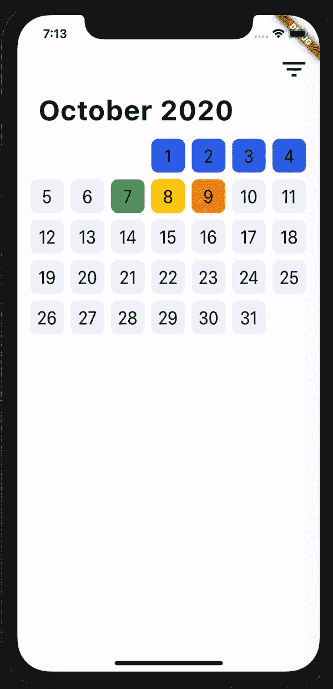
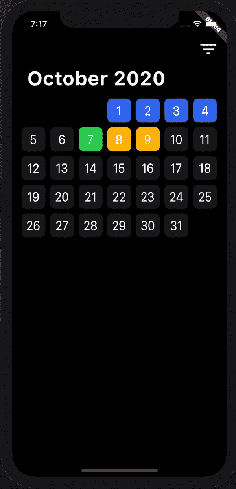
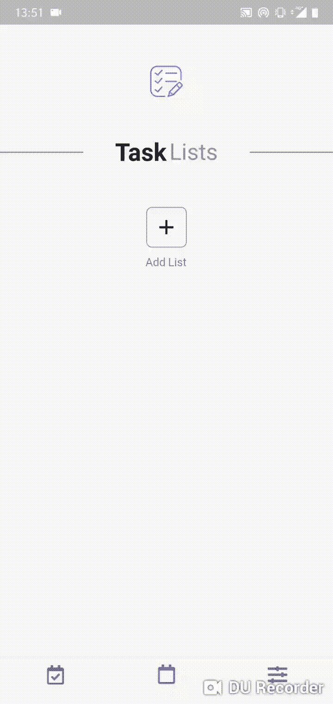
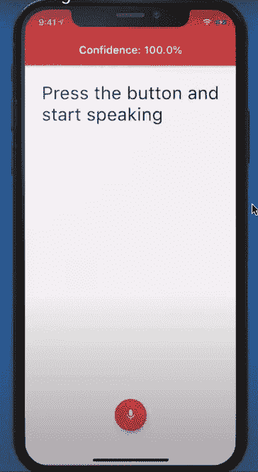

# 32 个用于优秀移动应用的免费 Flutter 模板

> 原文：<https://blog.logrocket.com/32-free-flutter-templates-mobile-apps/>

本文展示了 Flutter 开源移动应用程序的精选列表。开源项目总是学习任何编程框架的一个极好的方法:这些项目将使您的 Flutter 开发学习之旅更快，并对您的知识提供即时的帮助。

让我们开始吧，看看你是否能找到一个模板来启发你的下一个项目。

## 目录

## 业务和财务模板

### 1.今天要节俭

[今日节俭](https://github.com/AmruthPillai/BeThriftyToday)是由[阿姆鲁思·皮莱](https://github.com/AmruthPillai)开发的一款简单而安全的资金管理应用程序，可以帮助跟踪你的收入和支出。该应用程序有一个简单易用的用户界面，允许用户添加收入或支出，并用一个吸引人的彩色图标来指定交易，以表明其类别。

你可以通过从右向左滑动来删除交易，按住交易来编辑项目。

该应用程序是使用 **Flutter 和 Firebase** 直观设计的。这是快速添加和易于导航。

### 2.发票忍者

Invoice Ninja 是一个强大的商业套件，用于记录发票、任务、费用、维护库存、自动化和许多其他功能。这款先进的发票软件支持所有桌面和移动平台，这是同行业中最杰出的公司所无法比拟的。

这是发票忍者的配套应用，它是使用 [Flutter Redux Starter](https://github.com/hillelcoren/flutter-redux-starter) 创建的。

### 3.找到；查出

[Trace](https://github.com/trentpiercy/trace) 是由 [Trent Piercy](https://github.com/trentpiercy) 开发的完全用 Flutter 构建的现代加密组合和市场浏览器。它是开源的、轻量级的、快速的和强大的。它的一些特点是:

*   投资组合概述
*   聚合市场浏览器
*   投资组合时间线
*   交易历史
*   详细的市场数据
*   在明暗主题之间切换

### 4.收据经理

[收据管理器](https://github.com/ReceiptManager/Application)应用是由 [Monolidth](https://github.com/monolidth) 开发的管理收据的极简应用。它速度很快，并使用 OCR 将收据永久存储在 SQL 数据库中。

用户必须拍摄收据的照片，然后应用程序将收据上传到服务器，解析它，并将输出作为 JSON 响应发送回应用程序。应用程序将收据存储在 SQL 数据库中。

### 5.哈顿

每个应用程序都需要支付服务或交易接口，以便在注册订阅时进行支付。通过 [HADWIN](https://github.com/brownboycodes/HADWIN) ，人们可以学习各种基础知识和技能，比如设计模式和状态管理/使用提供者模式的嵌套状态管理。此外，如何用 restful API 从服务器获取数据，将应用程序连接到后端服务。

使用 Camera API 构建实时界面，将数据写入本地存储、自定义导航堆栈、复杂动画，并部署到 play store。

这个应用只是由 [Nabhodipta Garai](https://github.com/brownboycodes) 开发的一个原型，只模拟交易。

## 电子商务模板

### 6.打开电子商务应用程序

[Open Ecommerce App](https://github.com/4seer/openflutterecommerceapp) project 是由 [4seer](https://github.com/4seer) 和其他贡献者开发的移动电子商务应用。

创建这个项目背后的想法是建立一个商业上可行的产品，可以被中小型企业用来将他们的产品放到网上并到达大众。该应用程序包含一个闪屏，主屏幕，类别列表，带有过滤器的产品屏幕，带有评级和评论的产品详细信息屏幕，订购过程，以及带有登录和收藏夹的用户配置文件。

你可以在这里阅读关于这个项目[的内容，并为之做出贡献。app 真的很细致，设计的很有美感，看着很完美。](https://medium.com/@openflutterproject/open-flutter-project-e-commerce-app-fe97570a633)

### 7 .Shope:一个飘动的电子商务用户界面模板

Shope 是由[罗伯托·华雷斯](https://github.com/robertodevs)为 Flutter 开发的一款设计简洁美观的极简模板。[商店](https://github.com/robertodevs/flutter_ecommerce_template)电子商务 UI 套件旨在帮助程序员节省前端开发的时间。

开发者可以使用这个模板在 Flutter 中为 Android 和 iOS 构建他们的应用。UI 工具包包括重用组件所需的所有资源。它包含 38 个屏幕、资产、图标和字体。

### 8.完整的电子商务界面应用程序

我们有另一个漂亮的 UI 模板来创建一个由 [Abu Anwar](https://github.com/abuanwar072) 开源的电子商务应用程序:[完整的电子商务界面应用程序](https://github.com/abuanwar072/E-commerce-Complete-Flutter-UI)。它具有现代的设计、吸引人的颜色和精心设计的小部件。该应用程序包含如下屏幕:

*   入职
*   注册和登录
*   忘记密码了？
*   个人资料屏幕
*   OTP 验证
*   主页
*   产品详情
*   订单屏幕

## 教育模板

### 9.数学颤动

由杰伊·加贾尔开发的[数学游戏](https://github.com/j-j-gajjar/Mathematics)为用户设计了基本的算术测验，最适合 4 到 10 岁的孩子。学生可以通过创建随机测验来挑战自己，或者教师可以下载 PDF 表格来测试他们的学生。这是一个简单的应用程序，只有几个屏幕，但有一个强大的概念，有很多东西要从代码中学习，因为它涉及到很多数学逻辑。它有 web 支持和 PWA 支持。

### 10.Flutter 电子书应用

[Flutter 电子书应用](https://github.com/JideGuru/FlutterEbookApp)是由 [Festus Olusegun](https://github.com/JideGuru) 开发的一个简单而直观的应用程序，用于从 [Feedbooks](http://www.feedbooks.com/api) API 阅读和下载书籍。

用户可以下载、阅读和标记喜爱的书籍，以及在阅读完成后切换到黑暗模式并删除下载的书籍。这是使用提供者状态管理和 Dio 进行网络调用和下载文件开发的。NoSQL 数据库 Object DB 将文件存储在设备上。

### 11.图书搜索

[BookSearch](https://github.com/Norbert515/BookSearch) 是一个由[诺贝特·科兹尔](https://github.com/Norbert515)为初学者开源的项目，用于在阅读时搜索和收集书籍。它使用了[的 GoogleBooks](https://developers.google.com/books/docs/v1/getting_started) API，有一个干净的用户界面和清晰的动画。

开发者已经使用了 SQFlite 和 Flutter Redux 并在这里贴了[详细教程和代码](https://proandroiddev.com/flutter-how-i-built-a-simple-app-in-under-an-hour-from-scratch-and-how-you-can-do-it-too-6d8e7fe6c91b)。

### 12.StarBook

StarBook 是由 [Hashir Shoaib](https://github.com/hashirshoaeb) 开发的数字日记，可以帮助用户跟踪他们一个月的情绪和工作效率。这是一种不可思议的方式来观察用户一天中的感受，它允许用户意识到他们的总体态度以及如何改善它。

用户可以用不同的颜色来评价他们每天的心情，并写一个简短的总结。该应用程序专注于为每个用户提供个性化的体验，提高他们的生产力，改善客观性，并改善情绪健康。该应用程序使用 [Hive](https://blog.logrocket.com/handling-local-data-persistence-flutter-hive/) 在本地存储数据。

## 生产力模板

下一组是由不同程序员在 Flutter 中制作的待办应用。待办事项是程序员在学习初期开发的最常见的应用程序。它制作简单，通过它可以理解编程语言的复杂基础。

### 13.任务主义者

在[Hugo extra](https://github.com/huextrat)的 [Taskist](https://github.com/huextrat/Taskist) 中，开发者使用 Firebase 制作了带有不同动画的应用。

### 14.记笔记

Bibek Timsina 的笔记很可爱。开发者已经使用 **SQFlite** 在设备上存储笔记。从这个模板中可以了解如何实现搜索功能以及如何在应用程序中使用交错的 GridView。

### 15.什么事

Burhanuddin Rashid 设计的一个简单的待办事项应用程序，用于记录你的日常任务。它建立在[集团模式](https://blog.logrocket.com/state-management-flutter-bloc-pattern/)之上。您可以通过指定唯一的颜色来添加项目和标签，然后通过定义任务的优先级和截止日期来添加任务。您还可以根据项目、标签和日期对任务进行排序。

### 16.包包包包包包包包包包包包包包包包包包包包包包包包包包包包包包包包包包包包包包包

范二·拉赫马蒂的 Tasker 是一个设计精美的开源任务管理器应用程序，完全由 Dart 和 Flutter 构建。

### 17.扑向待办事项

由[小李](https://github.com/asjqkkkk)创作的是一个人如何设计和开发一个待办事项应用程序的完全跳出框框的思考。

这个开发者添加了自定义的主题和颜色，用户可以根据自己的口味进行更改，每个待办事项都可以添加自定义图标。

它有一个非常独特的方式来显示所有已完成的待办事项。用户将在主页上看到一个待办事项卡片，并像旋转木马一样水平滚动。该应用使用提供者状态管理、 [SharedPreferences](https://blog.logrocket.com/using-sharedpreferences-in-flutter-to-store-data-locally/) 和用于本地存储的 SQFlite 开发。

### 18.一秒日记

[一秒日记](https://github.com/KyleKun/one_second_diary)是由[卡伊奥·佩德罗索](https://github.com/KyleKun)开发的极简视频日记，记录你每天的一秒钟。打开应用程序，记录您的瞬间并保存视频。第二天重复这个过程。过了几个月或者一年，就把整个视频编好，分享给你的朋友和家人。

### 19\. Zefyr Editor

Zefyr 编辑器是一个丰富的文本编辑器，为 Flutter 应用程序提供了简单性和灵活性。它为不受干扰的写作提供了一个干净的界面。这是一个 Flutter 包，你可以把它安装到你的 Flutter 应用程序中，它将赋予用户像中型网站一样写作的能力。这个包是由 [Memspace](https://github.com/memspace) 开发的。

如果你很难在截止日期前完成工作，或者全神贯注于工作以至于没有时间观念，这个应用程序就是为你准备的。

一个好的时间追踪应用程序尊重你的隐私，并在不太花哨的情况下完成工作。这个是由 [Kenton Hamaluik](https://github.com/hamaluik) 开源的。完全离线，它用多个并行定时器跟踪任务。此应用程序已本地化为多种语言。

### 21.多变的天气

[FlutterWeather](https://github.com/ArizArmeidi/FlutterWeather) 是一个简单的天气应用程序，使用 [OpenWeatherMap](https://openweathermap.org/) API 创建，它自动获取用户的当前位置，并显示每小时和七天的天气信息。用户还可以搜索全球任何其他目的地。

该应用程序使用提供商包设计得非常好，由 [Ariz Armeidi](https://github.com/ArizArmeidi) 开发。

### 22.羽毛

如果你正在寻找一个更好的天气预报应用程序，它有很好的用户界面和 UX，那么羽毛就是适合你的；它是由[雅各布](https://github.com/jhomlala)开发的。

这款应用的特点是:

*   显示当前温度、最高和最低温度、湿度、压力和风力
*   显示当前太阳/月亮位置，日落/日出前动画倒计时，日落/日出时间
*   五天的天气预报(温度、风、雨和气压)
*   基于每日周期的应用背景变化
*   自动选择用户位置(当位置不能被选择时还有错误处理！)
*   将位置和天气数据保存在本地存储中
*   离线工作(用户需要先下载数据)
*   每 15 分钟自动刷新数据
*   块结构和 Dio

### 23.灰色

[Grey](https://github.com/avirias/Grey) 是由 [Avinash Kumar](https://github.com/avirias) 开发的材质设计的音乐播放器。它是第一个在 Flutter 中设计的完整的音乐播放器。这个应用程序是使用 **SQFlite** 数据库创建的，能够在启动时更快地加载歌曲:

*   播放本地歌曲
*   漂亮的屏幕
*   搜索歌曲功能
*   热门曲目、最近的歌曲和随机功能
*   专辑视图，艺术家视图
*   播放队列、随机播放和添加到收藏夹选项
*   播放/暂停，下一个/上一个
*   主题(暗/亮)、自定义字体和动画
*   横向模式

### 24.因基诺

与[因基诺](https://github.com/roughike/inKino)、[伊罗·克兰卡](https://github.com/roughike)一起创建了一个多平台 Dart 应用程序，用于探索芬基诺电影院的电影和放映时间。该应用利用 Redux，40%的代码在 Flutter 和 web 上共享。

Flutter 被用来创建 Android 和 iOS 应用程序。AngularDart 用于创建渐进式 web 应用程序。总的来说，这个项目是多平台 Dart 项目的一个特例。

### 25.MovieLab

[MovieLab](https://github.com/ErfanRht/MovieLab) 是一款开源、跨平台的移动应用，用于浏览电影和电视剧，包括演员阵容、制作团队、个人传记和剧情摘要。它是用飞镖用颤振写的。

有了 MovieLab，电影和连续剧信息唾手可得。这个应用程序是由范二·拉赫马蒂开发的。

可以用 Tsacdop 欣赏播客。这是一个用 Flutter 开发的播客播放器:一个干净、简单、漂亮、友好的应用程序，也是免费和开源的。它的一些特点是:

*   播客群组管理
*   播放列表支持
*   睡眠定时器/速度设置
*   OPML 文件导出和导入
*   后台自动同步
*   收听和订阅历史记录
*   深色模式/强调色
*   下载供离线播放
*   自动下载新剧集/自动删除过期下载
*   设置备份
*   跳过沉默
*   提高音量

### 27.Virlow 颤动记录器

[Virlow Flutter Recorder](https://github.com/virlow-voice/virlow-flutter-recorder) 是一款开源的 Flutter 应用，可以用 TL 转录录制的音频；博士和速记笔记。它还包括一个富文本编辑器，允许您更改转录和添加附加注释。

### 28.将语音转换为文本

[Flutter Speech to Text](https://github.com/MarcusNg/flutter_voice) 类似于上面的应用程序，但是没有内置的文本编辑器。你可以在 [YouTube](https://youtu.be/wDWoD1AaLu8) 上观看整个教程。

这是一个简单的单页应用程序，如果需要，你可以在你的应用程序中反复灌输。它有一个漂亮干净的用户界面，由 Marcus Ng 设计。

## 游戏模板

### 29.绞刑吏

由[雷扎·塔瓦索利](https://github.com/tavasolireza)制作的《刽子手是一款完全用飞镖和颤动框架编写的刽子手游戏。玩家每回合有五次机会猜单词。以前的分数可以在高分页面查看。

### 30.布盒

由[麦克](https://github.com/rnike)制作的组织盒是一款用[火焰](https://blog.logrocket.com/comparing-flutter-game-engines/)制作的简单游戏。我会说这是一种减压方式。

用户必须在规定的时间内从盒子中取出纸巾。垂直拖动纸巾给用户更多的分数；如果盒子是空的，用户必须向左或向右拖动盒子来填充它。漂亮的用户界面简洁明了。

### 31.MathMatrix

学习玩简单的算术游戏，以提高整体数学技能。由[杰伊·萨维萨尼](https://github.com/jaysavsani07)创作的 MathMatrix 简单易学，适合所有年龄段，从儿童到成人。每一关都是为了测试玩家的智力。

这个游戏以各种方式让你提高记忆力、注意力、速度、反应力、注意力和逻辑性。每一个层次都变得更加复杂，并试图从用户身上提取最好的东西。

### 32.不可能的街区

由[贾维·帕切科](https://github.com/javipacheco)制作的不可能的阻挡是一个复杂的游戏，在 Flutter Redux 中创建了简单的规则。玩这个记忆游戏来锻炼你的认知区域。

这个免费的大脑训练游戏可以帮助你提高记忆力，同时还能享受乐趣。它适合年轻人和成年人。如果你喜欢一个魔方或魔方，你会喜欢这个免费游戏。

这就是这个伟大的开源颤振移动应用程序列表的结尾。如果你有建议要补充，一定要让我知道。谢谢大家！

## 使用 [LogRocket](https://lp.logrocket.com/blg/signup) 消除传统错误报告的干扰

[LogRocket](https://lp.logrocket.com/blg/signup) 是一个数字体验分析解决方案，它可以保护您免受数百个假阳性错误警报的影响，只针对几个真正重要的项目。LogRocket 会告诉您应用程序中实际影响用户的最具影响力的 bug 和 UX 问题。

然后，使用具有深层技术遥测的会话重放来确切地查看用户看到了什么以及是什么导致了问题，就像你在他们身后看一样。

LogRocket 自动聚合客户端错误、JS 异常、前端性能指标和用户交互。然后 LogRocket 使用机器学习来告诉你哪些问题正在影响大多数用户，并提供你需要修复它的上下文。

关注重要的 bug—[今天就试试 LogRocket】。](https://lp.logrocket.com/blg/signup-issue-free)