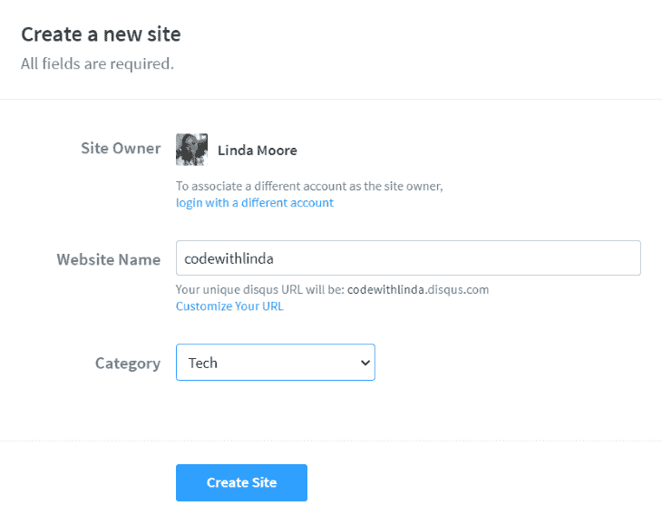
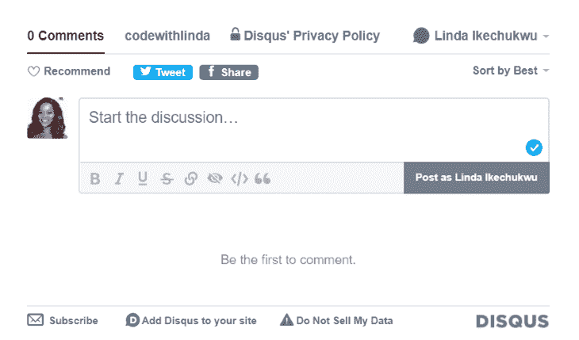
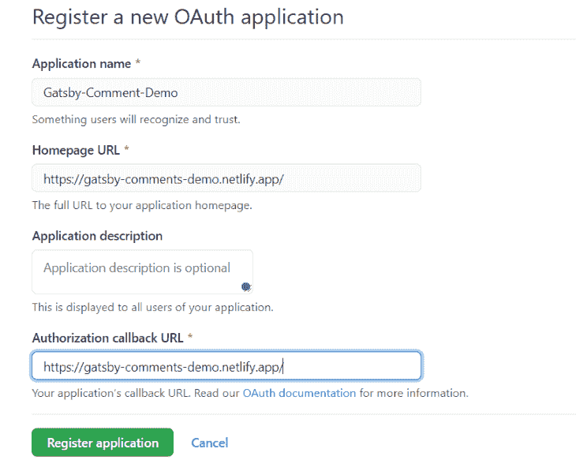
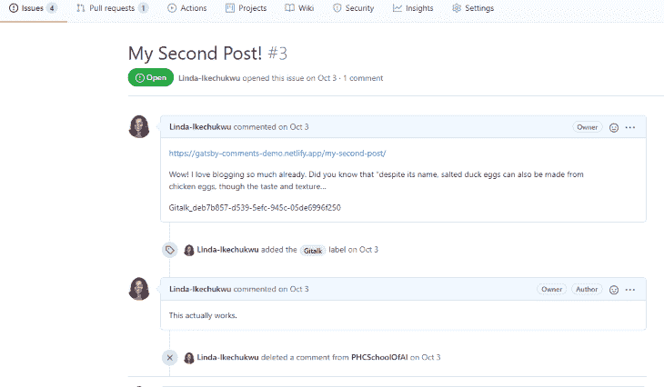
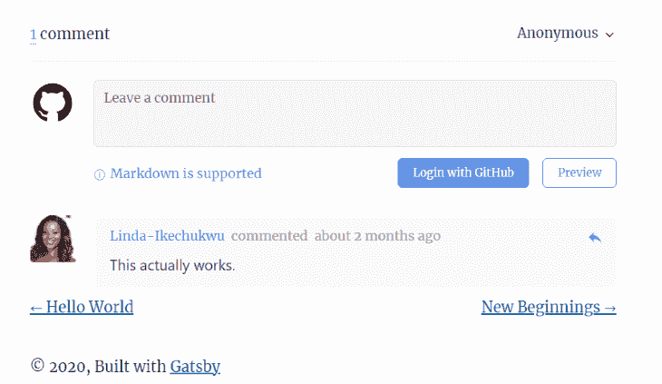
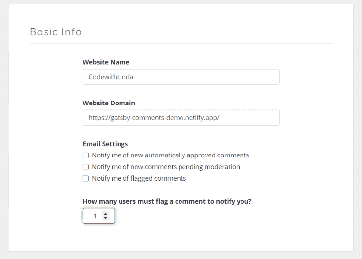
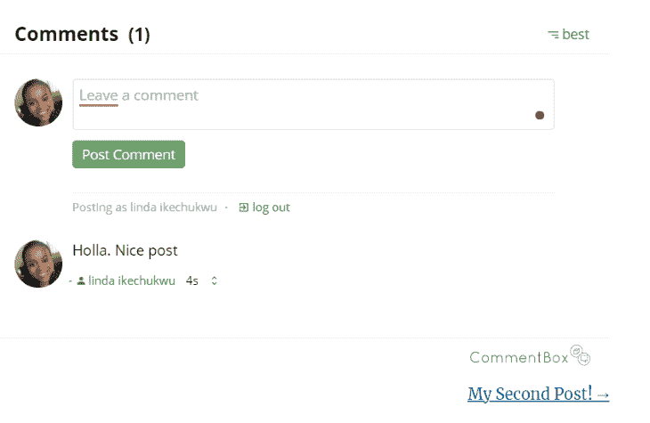
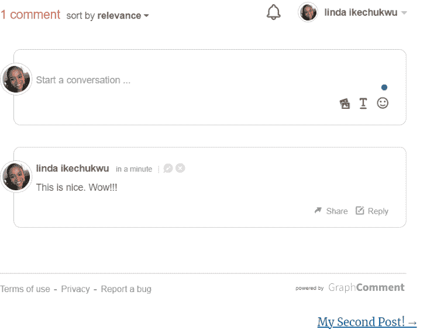

# 4 个插件为你的 Gatsby.js 博客添加评论

> 原文：<https://blog.logrocket.com/4-plugins-to-add-comments-to-your-gatsbyjs-blog/>

在你的博客上发表评论有很多好处。它提供了一个与你的读者互动的机会，并接受对你写作的反馈。由于用户生成的内容，它还提高了 SEO。

虽然有很多很棒的付费评论平台，但在本帖中，我们将关注你可以免费使用的插件。

在本文中，我们将介绍如何使用以下四个插件中的任何一个，在几乎不做任何配置的情况下，无缝地将评论集成到您的 Gatsby 博客中:

1.  迪斯克斯
2.  GitTalk
3.  评论框
4.  图表注释

Disqus 是一个流行的第三方评论插件，它可以很容易地在一个博客上添加、管理和调节评论，只需要很少的配置。

### 赞成的意见

*   使用 Disqus 帐户或社交登录的强大身份验证选项
*   易于定制并适应您网站的主题
*   直接从您的博客页面或管理仪表板上管理评论
*   使用机器学习的自动化垃圾邮件审核
*   媒体(图像、视频和 gif)可以嵌入到评论中

### 骗局

*   有时会降低页面加载速度，因为它不是异步加载的，并且有很多依赖项

## 诉讼中的纠纷

要在 Gatsby 上开始使用 Disqus，你首先需要[注册一个账户](https://disqus.com/profile/signup/intent/)，然后点击‘我想在我的网站上安装 Disqus’。在下一页上，输入网站名称并记下来，因为我们将在下一步中使用它。



接下来，安装`gatsby-plugin-disqus`:

```
npm install gatsby-plugin-disqus --save
```

或者

```
yarn add gatsby-plugin-disqus
```

然后，在`gatsby-config.js`中添加并配置插件:

```
// gatsby-config.js
module.exports = {
  plugins: [
    {
      resolve: `gatsby-plugin-disqus`,
      options: {
        shortname: `codewithlinda`
      }
    },
  ]
}

```

`shortname`选项应该与您在上一步中提供的网站名称相对应。

下一步是将 Disqus 评论组件添加到您的博客页面模板文件中:

```
import Disqus from 'gatsby-plugin-disqus'

const PostTemplate = () => (
  <>
    /* Page Contents */
    <Disqus 
      identifier={post.id}
      title={post.title}
      url={`${config.siteUrl}${location.pathname}`}
    />
  </>
)

export default PostTemplate

```

根据 GraphQL 查询的结构，提供 ID、标题和路径 URL。这些有助于正确地将评论线索与相应的博客帖子关联起来。部署并导航到您的站点 URL，您现在应该已经启用了 Disqus 评论。



GitTalk 是基于 GitHub issues 和 [Preact](https://preactjs.com/) 的评论组件。用户认证是通过 GitHub 完成的，所以它是科技博客的理想选择，因为你的大多数读者已经有了一个 GitHub 账户。

### 赞成的意见

*   没有性能缺陷。GitTalk 是无服务器的，所以评论加载很快
*   所有的评论都将存储在你的 GitHub repo 中，所以你可以控制所有的数据，并且可以随时轻松地迁移
*   支持多种语言

### 骗局

*   仅适用于拥有 GitHub 帐户的用户
*   没有内在的节制。这意味着你不能从博客页面删除或禁用评论，你必须从 GitHub 问题线程中手动删除它

## GitTalk 在行动

为了将 GitTalk 集成到 Gatsby 博客中，我们将使用`gatsby-plugin-gitalk`。

首先，安装插件:

```
npm install --save gatsby-plugin-gitalk
```

或者

```
yarn add gatsby-plugin-gitalk
```

然后[为你的博客注册一个新的 GitHub Oauth 应用程序](https://github.com/settings/applications/new)来启用认证和授权。提供一个应用程序名称(可以是任何名称)、一个主页 URL(应该是您博客的 URL)、一个描述和一个授权回调 URL(也应该是您博客的 URL)。



单击“注册应用程序”以生成我们将在下一步中使用的客户端 ID 和客户端密码。

接下来，在`gatsby-config.js`中添加并配置插件:

```
plugins: [
    {
      resolve: `gatsby-plugin-gitalk`,
      options: {
        config: {
          clientID: 'f16d485a306b836cabd1',
          clientSecret: '6ee5e2a6c2a4992fc49aeab2740e6493bbc9cfae',
          repo: 'gatsby-demo-comments',
          owner: 'Linda-Ikechukwu',
          admin: ['Linda-Ikechukwu']
        }

      }
    },
  ]

```

在配置选项中，`clientID`和`clientSecret`是上一步的值。`repo`是您希望提交评论问题的回购协议的名称——最好是存放博客代码的回购协议。`owner`配置是您的 GitHub 用户名，`admin`是一组回购所有者和合作者。还有其他可选的配置参数可以在[这里](https://github.com/gitalk/gitalk#options)找到。

最后，将评论组件添加到博客文章模板文件中:

```
//in template/blog-post.js
import Gitalk from 'gatsby-plugin-gitalk'
import '@suziwen/gitalk/dist/gitalk.css'

const PostTemplate = () => {
  let gitalkConfig = {
    id: post.slug || post.id,
    title:post.frontmatter.title,
  }
  return (
     <Gitalk options={gitalkConfig}/>
  )
}

export default PostTemplate

```

CSS 文件包含插件的样式。可以通过复制`node_modules/@suziwen/gitalk/dist/gitalk.css`的内容来修改评论组件的样式，修改后作为替换导入。根据 GraphQL 查询的结构，为注释组件提供一个 ID 和标题。

当针对某篇文章的第一条评论被提交时，GitTalk 会打开一个问题，将配置中提供的标题作为该问题的标题，并将该文章下的任何评论附加到该问题中。您可以通过删除关于您的 GitHub 问题的评论来删除您页面上的评论。



要测试、部署和访问您的站点 URL，单击初始化评论，现在您应该在您的站点上启用了评论。



CommentBox 是一个关注隐私的第三方评论解决方案，每月提供 100 条免费评论。

### 赞成的意见

*   通过社交或电子邮件登录进行身份验证
*   匿名评论可用
*   直接从您的博客页面或管理仪表板上管理评论
*   从 Disqus 导入和迁移注释

### 骗局

*   每月 100 条评论的有限免费等级，之后你需要支付 15 美元

## 行动中的评论框

要开始使用 CommentBox，您需要[创建一个帐户](https://dashboard.commentbox.io/login)。输入你的网站域名，不要 https 和 www。之后，将为您生成一个项目 ID。请注意这一点，因为它将在未来的步骤中使用。



接下来，通过 npm 安装 CommentBox:

```
npm install commentbox.io --save

```

然后，将评论组件添加到您的博客页面模板文件中:

```
import commentBox from 'commentbox.io';
const BlogPostTemplate = ()=>{
  useEffect(() =>{
    commentBox('5632596591509504-proj')
  },[])

  return(
     <div className="commentbox" />
  )

}

```

提供给`commentBox`函数的参数应该是上一步生成的项目 ID。默认情况下，注释会被自动批准，但您也可以选择从仪表板中手动批准它们。

如果你想改变评论插件的主题，给`commentBox`函数提供一个带有以下参数的对象:

```
commentBox('5632596591509504-proj', {
   backgroundColor: null,  // default transparent
   textColor: null,  // default black
    subtextColor: null,  // default grey
})

```



GraphComments 不仅仅是一个评论平台。这是一个嵌入到你博客中的社区系统。

### 赞成的意见

*   通过社交或电子邮件登录进行身份验证
*   匿名评论。从管理仪表板批准
*   推送通知已启用。如果用户收到回复或对他们的评论投赞成票，他们就会收到提醒
*   媒体(图像、视频和 gif)可以嵌入到评论中
*   直接从您的博客页面或管理仪表板上管理评论
*   用户可以编辑评论

### 骗局

*   每月最多 1，000，000 次数据加载的有限免费层。这意味着你的网站每月的总浏览量将被限制在一百万，之后 GraphComments 将在这个月的剩余时间里被自动禁用。对于流量极小的网站来说，这真的没什么好担心的。

## 图表注释在起作用

首先，[注册](https://graphcomment.com/admin/#/register)并在您的仪表盘上添加一个新站点。请记下您的唯一 ID，因为它将在以后的步骤中使用。


之后，您将被重定向到您的仪表板。点击我的站点>您的站点名称>设置，找到您的设置脚本。

您可以使用`[react-inline-script](https://www.npmjs.com/package/react-inline-script)`或`useEffect`将脚本添加到您的博客文章模板文件中:

```
import Script from "react-inline-script"

<div id="graphcomment"></div>
      <Script>
        {`
          window.gc_params = {
              graphcomment_id: 'codewithlinda',
              fixed_header_height: 0,
          };

          (function() {
            var gc = document.createElement('script'); gc.type = 'text/javascript'; gc.async = true;
            gc.src = 'https://graphcomment.com/js/integration.js?' + Math.round(Math.random() * 1e8);
            (document.getElementsByTagName('head')[0] || document.getElementsByTagName('body')[0]).appendChild(gc);
          })();
        `}
      </Script>

```

或者

```
useEffect(() => {
    window.gc_params = {
      graphcomment_id: 'codewithlinda',
      fixed_header_height: 0,
   };

  (function() {
    var gc = document.createElement('script'); gc.type = 'text/javascript'; gc.async = true;
    gc.src = 'https://graphcomment.com/js/integration.js?' + Math.round(Math.random() * 1e8);
    (document.getElementsByTagName('head')[0] || document.getElementsByTagName('body')[0]).appendChild(gc);
  })();
 }, [])

```

确保`graphcomment_id`值与您在上一步中给出的值相匹配。就是这样。GraphComments 现在应该嵌入到您的博客页面中了。



## 结论

在本文中，我讨论了如何使用四个插件 Disqus、CommentBox、GitTalk 和 GraphComments 为 Gatsby 博客设置评论。

如果你喜欢掌控一切，并希望从一个 GitHub 帐户管理你的博客、代码、文章和评论，那么就用 GitHub 吧。如果你不介意第三方工具(他们可能会拥有你的评论内容)，并且想坚持使用大多数网络用户已经习惯并且可能已经有账户的东西，使用 Disqus。如果你不想被 Disqus 的性能缺陷所困扰，那么 GraphComments 和 CommentBox 都有简洁的界面和很酷的自由层产品。

最后，选择使用哪个评论插件完全取决于你自己。虽然上面提到的四个插件都很棒，但是还有其他的选择。探索，找到适合你的，并使用它。

那么，你更喜欢哪个评论插件呢？请随意发表评论。

## 使用 [LogRocket](https://lp.logrocket.com/blg/signup) 消除传统错误报告的干扰

[](https://lp.logrocket.com/blg/signup)

[LogRocket](https://lp.logrocket.com/blg/signup) 是一个数字体验分析解决方案，它可以保护您免受数百个假阳性错误警报的影响，只针对几个真正重要的项目。LogRocket 会告诉您应用程序中实际影响用户的最具影响力的 bug 和 UX 问题。

然后，使用具有深层技术遥测的会话重放来确切地查看用户看到了什么以及是什么导致了问题，就像你在他们身后看一样。

LogRocket 自动聚合客户端错误、JS 异常、前端性能指标和用户交互。然后 LogRocket 使用机器学习来告诉你哪些问题正在影响大多数用户，并提供你需要修复它的上下文。

关注重要的 bug—[今天就试试 LogRocket】。](https://lp.logrocket.com/blg/signup-issue-free)