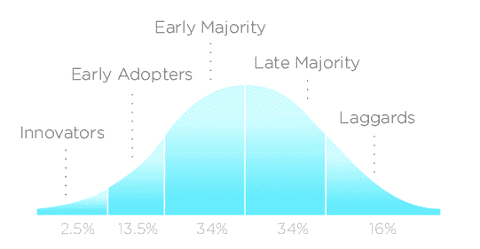

# 简化市场渗透战略的 4 个步骤

> 原文：<https://blog.logrocket.com/product-management/4-steps-simplify-go-to-market-strategy/>

无论你从事的是什么产品或服务，将其推向市场都是令人生畏的。这是产品专业人员的训练。

我们经常把事情弄得比原本应该的更复杂，但事情不一定非要这样。

* * *

## 目录

* * *

## 什么是市场渗透？

市场渗透率衡量给定市场中使用某一产品或服务的客户占该市场总估计规模的百分比。

要计算您的市场渗透率，请将使用您产品的客户数量除以市场中的客户总数:

*市场渗透率=(客户数量/目标市场规模)x 100*

## 什么是市场渗透战略？

市场渗透战略是通过增加市场份额来发展业务的任何举措。这通常是通过努力在市场上已经存在的未开发客户中增加销售来实现的。

没有灵丹妙药或秘方能让你的上市每次都成功，但我在这篇文章中分享的技巧和见解至少会帮助你晚上睡觉。

## 如何用 4 个步骤执行成功的市场渗透战略

以下是我十多年来在将产品推向市场时用头撞墙所学到的东西。通过接受下面概述的四个原则，你可以简化你的[市场渗透战略](https://blog.logrocket.com/product-management/what-is-go-to-market-strategy-examples-guide/)中那些让其他人犯错的部分。

### 1.打造一个最小的可爱产品

如果你正在阅读这篇文章，你可能已经有了一个绝妙的想法，或者正在开发一个即将上市的产品。太棒了。但我必须警告你，无论你的想法有多优秀，在你把它做对之前，你都会失败几次。

首先要明白的是，你需要*一个*产品来构建*这个*产品。

你越早将产品送到用户手中，你就能越快地创造出产品。我经常观察到的一个错误是，人们在谈论他们正在开发的了不起的产品，但是没有人使用它。

首先，你必须创造一个符合[最低用户期望](https://blog.logrocket.com/product-management/what-is-a-minimum-lovable-product-mlp-how-to-build/)的产品，这很有挑战性。比如你想和 Airbnb 竞争，你的酒吧就是 Airbnb。用户不会接受比这更低的价格。

这就是差异化和聚焦激光的重要性。

### 2.聚焦你的价值主张

在我看来，与一家成熟的公司直接竞争是一个糟糕的策略。

以脸书为例。脸书最初是哈佛学生的社交网络。然后，扩展到其他学院，等等。它没有直接与 MySpace 等社交网络竞争——根据你的年龄，你可能听说过也可能没有，但它曾经比脸书大几百倍。

还没卖出去？这是另一个公司的例子，我相信你听说过:

网飞一开始并没有提供流媒体服务，也没有试图与百视达竞争。点播视频流媒体巨头最初是一个基于邮件的 DVD 订阅服务，此前没有人提供这种服务。从那里，它不断检查，完善和调整其业务模式。

如果你想打入市场，你必须[从竞争中脱颖而出](https://blog.logrocket.com/product-management/what-is-product-differentiation-definition-strategies-examples/)并瞄准激光聚焦的观众。

我喜欢使用[蓝海战略](https://www.blueoceanstrategy.com/what-is-blue-ocean-strategy/)，因为它简单而有价值，它迫使你思考如何与众不同。我鼓励你把它用于你想推向市场的产品。

蓝海战略的核心部分是[四个行动框架](https://blog.logrocket.com/product-management/what-is-a-strategy-canvas-how-to-create-examples/#what-is-the-four-actions-framework)，它概述了帮助您在竞争中强化价值主张的活动和考虑事项:

1.  [升起](https://blog.logrocket.com/product-management/what-is-a-strategy-canvas-how-to-create-examples/#raise)
2.  [减少](https://blog.logrocket.com/product-management/what-is-a-strategy-canvas-how-to-create-examples/#reduce)
3.  [创建](https://blog.logrocket.com/product-management/what-is-a-strategy-canvas-how-to-create-examples/#create)
4.  [消除](https://blog.logrocket.com/product-management/what-is-a-strategy-canvas-how-to-create-examples/#eliminate)

### 3.从小处着手

推出一个产品需要一个事件来吸引大量的注意力。这通常是降低你可信度的好方法。很有可能，你的第一个产品很糟糕。

你认为史蒂夫·乔布斯在哪里开了第一家苹果商店？纽约市？当然不是。他不希望媒体关注他在苹果商店购物的独特体验。

第一家苹果商店在华盛顿特区附近弗吉尼亚州泰森斯的泰森斯角购物中心开张

这并不是说苹果公司没钱在纽约市开店；公司领导层希望从市场中学习，适应市场，并找出如何在带给更多人之前创造令人印象深刻的体验。

太快获得太多的关注会使产品在面向大众发布之前很难获得正确的结果。

例如，假设你想创建一个类似 Airbnb 的服务，专注于冬季运动爱好者。你的目标受众集中在哪里？也许是欧洲？

* * *

订阅我们的产品管理简讯
将此类文章发送到您的收件箱

* * *

我得说那太大了。理想情况下，你会找到一个滑雪胜地，并从那里开始，甚至是一个地区——但不是一个大陆或国家。你最好更深入地关注。

我会鼓励你尽可能少的锁定受众，以确保你能吸引用户。你越专注，你就越了解你的目标受众。

请记住，在用户能够从中受益之前，你的想法是没有价值的。

### 4.锁定早期采用者

假设你已经确定了你的重点，你的产品瞄准了一个小市场，你知道如何在竞争中脱颖而出。这是不是意味着你准备好发射了？别急，我的朋友。

如果有什么人讨厌的话，那就是改变。

不是每个人都愿意使用新产品。如果可以直接用 Airbnb，甚至直接用滑雪场预订，我为什么要用 Airbnb 做冬季运动？你如何解决这个难题？

人是不一样的。有些人抗拒改变，有些人则不断寻求新事物。这就是采用曲线出现的时候。

无论你想把什么产品推向市场，如果你的目标受众不对，你都会失败。

从创新者和早期采用者开始是强制性的。他们将为大众铺平道路。你必须了解每个观众之间的差异，因为他们有不同的愿望和限制。

我们不会对[采用曲线](https://blog.logrocket.com/product-management/why-product-adoption-strategy-crucial-b2b-scenarios/#what-is-product-adoption)进行太深入的探讨，但我会给你一些与建立走向市场战略相关的提示:

*   创新者关心技术，希望尽早获得别人没有的早期产品。他们不介意失败的经历，因为他们主要对技术感兴趣
*   早期采用者愿意尝试新服务，因为他们乐于接受新体验，即使这些体验并不完整。这些人在苹果商店排队购买第一部 iPhone
*   **早期大多数**在不知道产品好用的情况下，绝不会购买。只有在许多人尝试过并表示认可之后，他们才会接受尝试不同的东西。这通常需要几年时间。
*   **后期多数**只想用防弹服。他们只会考虑从头到尾都有坚实支持的产品或服务。方便才是王道
*   落后者反对变革。只有在没有替代品的情况下，他们才会开始使用某种东西。在大多数情况下，当当前选项被弃用时，它们会继续使用

产品经理最常犯的错误是在没有对早期采用者进行审查的情况下，将目标锁定在早期大多数人身上。如果没有早期用户使用你的产品，你就没有成功的机会。

这是关键的一课:找到你的早期用户，把你的产品拿到他们手中，学习，适应，获得评论。然后，也只有到那时，你才准备好瞄准早期的大多数。

要了解更多关于采用曲线的信息，请观看由[颠覆性创新](https://www.youtube.com/watch?v=Y-97AXOPzJo)制作的视频:

[https://www.youtube.com/embed/Y-97AXOPzJo](https://www.youtube.com/embed/Y-97AXOPzJo)

视频

## 关键要点

在结束之前，让我们快速总结一下成功的市场渗透战略的四个关键因素:

1.  **打造一个最不可爱的产品**——接受你的想法一开始不会完美。努力尽可能快地学习制造理想的产品
2.  **激光聚焦你的价值主张** —不要试图与成熟的产品竞争。专注于确定差异化的替代方案
3.  **从小处着手**——不要一开始就努力制造太多的轰动。专注于确定一小部分受众，并与他们互动。记住，你的目标是尽快学会
4.  **瞄准早期采用者**——确定谁是早期采用者，并把你的产品送到他们手中

我们可以把上面描述的所有原则进一步提炼成一个单一的、支配性的格言:

制造顾客想买的产品，而不是你必须卖的产品。

*精选图片来源:[icon scout](https://iconscout.com/icon/spaceship-6163133)*

## [LogRocket](https://lp.logrocket.com/blg/pm-signup) 产生产品见解，从而导致有意义的行动

[LogRocket](https://lp.logrocket.com/blg/pm-signup) 确定用户体验中的摩擦点，以便您能够做出明智的产品和设计变更决策，从而实现您的目标。

使用 LogRocket，您可以[了解影响您产品的问题的范围](https://logrocket.com/for/analytics-for-web-applications)，并优先考虑需要做出的更改。LogRocket 简化了工作流程，允许工程和设计团队使用与您相同的[数据进行工作](https://logrocket.com/for/web-analytics-solutions)，消除了对需要做什么的困惑。

让你的团队步调一致——今天就试试 [LogRocket](https://lp.logrocket.com/blg/pm-signup) 。

[David Pereira Follow](https://blog.logrocket.com/author/davidpereira/) Product Leader with 15+ years of experience. Partner at Value Rebels and interim CPO at omoqo. Almost every product team is trapped somehow; untrapping them is what drives me.