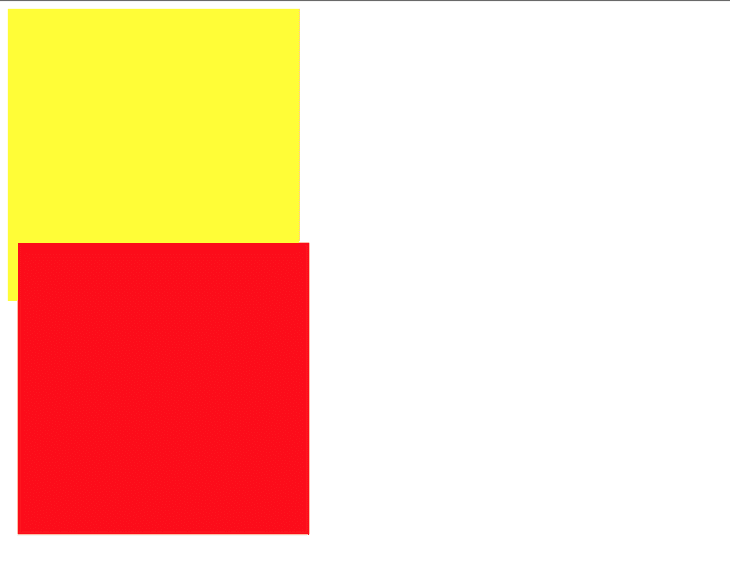
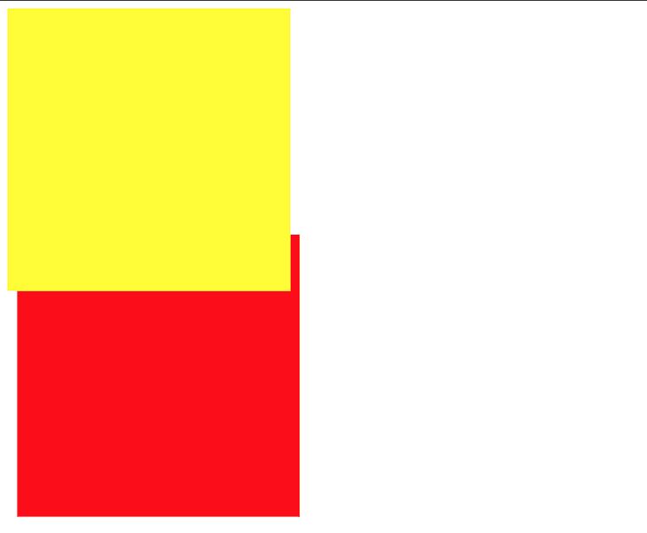
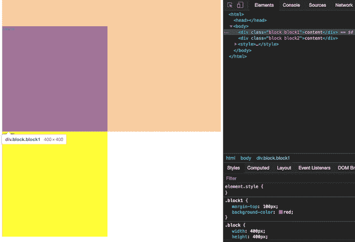
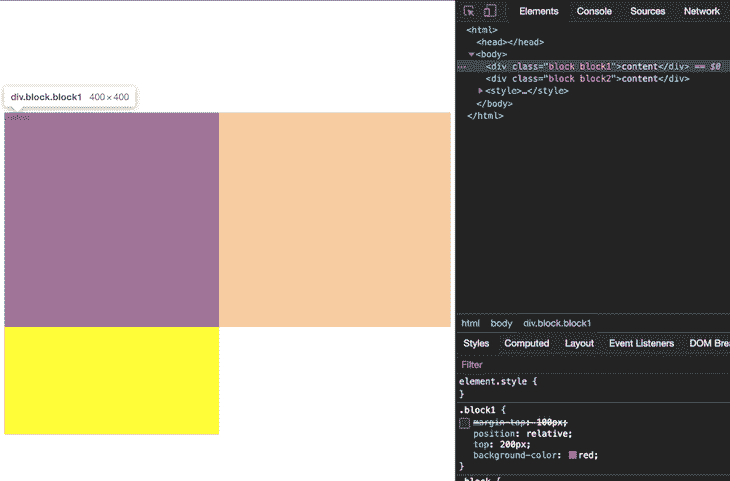
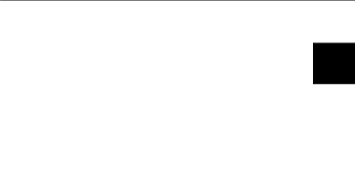
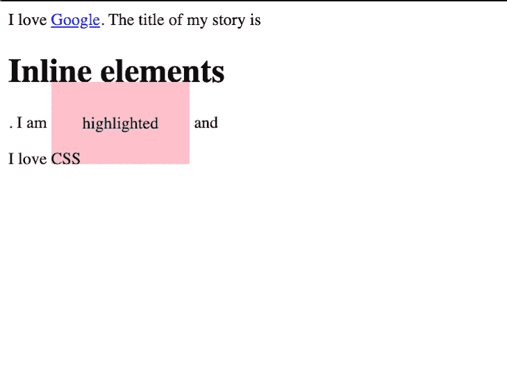
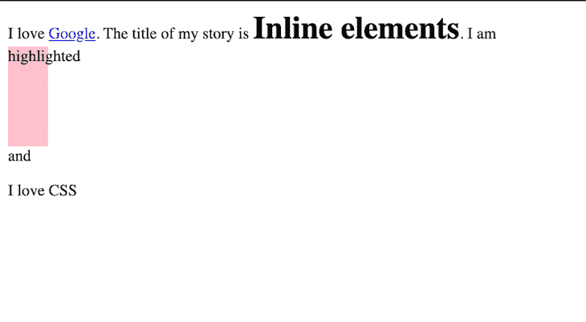
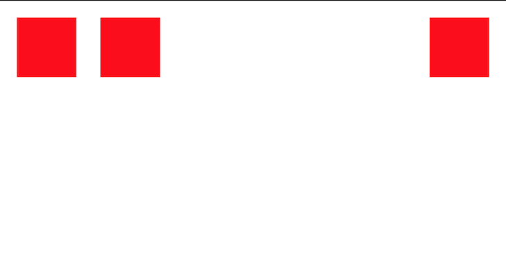

# 5 个不兼容的 CSS 属性和值

> 原文：<https://blog.logrocket.com/5-css-properties-and-values-that-are-incompatible/>

拜托，我把 div 放在右边了，为什么它还是出现在左边呢？

*“真的吗？为什么我的浏览器不再支持* `flex` *？”*

CSS 有时很有趣，有时有点有趣，但大多数时候令人沮丧。以我的经验来看，当网页上的结果和我们预期的不完全一样时，大部分的挫败感就会产生。

我发现大多数时候问题不在于拼写或选择器，而是我们没有使用兼容的属性和值。这就是为什么，有时候，当我们改变一些事情时，它会突然地，看似随机地起作用。

为了避免将来出现这些令人头疼的问题，在本文中，我将解决在 CSS 中不能一起工作的 5 个 CSS 属性和值(无论我们多么希望它们能够一起工作)。

## CSS 检查:定位值和非定位值

为了完全理解本文的内容，我们将首先回顾定位值和非定位值。

首先，定位值包括`absolute`、`fixed`、`relative`和`sticky`。一个`absolute`定位的元素失去了它在文档流中的位置，但如果是相对定位的，则受父元素的约束(否则，受视窗约束)。值为`0`的`top`属性会将元素定位在其边界的顶部。

与`absolute`不同的是，`fixed`定位的元素受视口限制，这意味着值为`0`的`top`属性将元素定位在视口的顶部。一个`relative`定位的元素是相对于自身的，接受`top`、`left`、`bottom`、`right`。下一节将展示这些属性如何影响相对定位的元素。

最后，`sticky`定位的元素是固定和相对的组合。当使用`top`位置属性时，您可以将这些元素限制在父对象的视口中，直到父对象不再出现在视图中。这里可以阅读更多[。](https://css-tricks.com/position-sticky-2/)

对于我们接下来的两个部分，需要注意的是，位置为`[static](https://www.w3.org/wiki/CSS_static_and_relative_positioning?viewType=Print&viewClass=Print#Static_positioning)`的元素，虽然类似于`relative`定位的元素，但是[不被认为是定位的](https://www.w3.org/wiki/CSS_static_and_relative_positioning?viewType=Print&viewClass=Print#Static_positioning)。相反，`static`是文档中每个声明元素的默认位置。

## 1.`position: static`和`z-index: n`

由于静态元素是相对于文档的正常流程放置的，并且不能从该流程中移除，因此在`absolute`子元素考虑父元素的位置之前，必须在父元素上有一个`relative`值。当`z-index`加入其中时，这就成了问题。

`z-index`是用于在 z 轴上定位元素(在其他元素之上或之下)的属性；该属性也只考虑已定位的元素。请记住，`static`是一个默认位置，因此不被视为定位本身。下面，我们将看到这在哪里成为一个问题。

### 示例:

使用`static`，元件必须遵守正常流程:

```
<div class='block1'></div>
<div class='block2'></div>
```

现在，尝试添加`z-index`:

```
.block1,
.block2 {
  width: 300px;
  height: 300px;
}

.block1 {
  background-color: yellow;
  z-index: 1;
}

.block2 {
  position: absolute;
  background-color: red;
  margin-top: -60px;
  margin-left: 10px;
}
```

以下是输出:



你会注意到正常的流程是从`.block1`到`.block2`。而且，即使`z-index`属性包含在代码块中，它在`.block1`的样式声明中也会被忽略，因为`z-index`只考虑定位的元素。

要解决这个问题，请将`position` `relative`添加到`.block1`来查看:

```
.block1,
.block2 {
  width: 300px;
  height: 300px;
}

.block1 {
  position: relative;
  background-color: yellow;
  z-index: 1;
}

.block2 {
  background-color: red;
  margin-top: -60px;
  margin-left: 10px;
}
```



请记住，如果您没有显式声明一个`position`属性，`static`将成为您的默认属性，`z-index`将不会对其起作用。

## 2.`position: static`和`top|bottom|left|right`

你可能已经猜到了，这也和上面`static`的解释有关系。我们知道`top`、`bottom`、`left`和`right`用于重新定位元素，因此使用这些属性可能会使我们在使用具有`static`位置的元素时遇到麻烦。

但是`margin-top`之类的呢？在下面的例子中，我们将看看这些`margin-`员工和他们重新定位的同事之间的区别。

### 示例:

首先，创建您的块:

```
<div class="block block1">content</div>
<div class="block block2">content</div>
```

现在，尝试添加`margin-top`:

```
.block {
  width: 400px;
  height: 400px;
}
.block1 {
  margin-top: 100px;
  background-color: red;
}
.block2 {
  background-color: yellow;
}

```

这是您的输出:



使用`margin-top`，你会注意到红色的盒子被推动了，但是没有重新定位。红色框从其原始位置(在 dev tools 中选择元素时的橙色覆盖)被推出，并因此影响它后面的所有其他元素。在这种情况下，您会注意到黄色的盒子也被按下了。

现在，正如您可能已经猜到的那样，`top`和类似的东西将不会与静态元素一起工作。然而，在这个例子中，我们可以通过使用具有固定位置的`top`(`relative`)来解决这个问题:

```
.block {
  width: 400px;
  height: 400px;
}
.block1 {
  position: relative;
  top: 200px;
  background-color: red;
}
.block2 {
  background-color: yellow;
}

```



如您所见，该元素现在已重新定位，并且不会影响周围的元素(黄色框)。

在上面的例子中，我们可以看到`margin-`位置只将元素推到不同的一边——在这个过程中影响周围的元素——而`top`重新定位元素而不影响其他元素。你可能也注意到了，虽然所有的元素都可以被推动，但不是所有的元素(见:`static`)都可以被重新定位。

为了在使用这些属性时避免潜在的错误，注意到虽然所有位置的边距表现相同，但是不同位置的`top|bottom|left|right`(`relative`、`absolute`、`fixed`和`sticky`)表现不同也是有用的。

## 3.`positio**n**: x`和`animation|transition`

动画和过渡是 CSS 属性，允许从一个样式属性平滑转换到另一个样式属性。

例如，将不透明度为 0 的元素转换为不透明度为 1 的元素。该元素从 0 开始，完全不可见，然后逐渐开始变换，直到可以清晰看到。一个更简单的例子是元素从一个高度到另一个高度的变换。

如果你一直在关注，你知道我接下来要问的问题:动画和过渡如何与`position`一起工作？有一个简单的答案，我们将在下面的例子中探讨。

### 示例:

```
<div class="container">
  <div class="elem"></div>
</div>

```

对于本例，我们将使用`relative`位置:

```
.container {
  margin-top: 100px;
}

.elem {
  position: relative;
  width: 100px;
  height: 100px;
  background-color: black;
}

```

结果:


然后，我们可以引入一个涉及`position`属性的转换(在类似于`hover`的状态上)，如下所示:

```
.elem:hover {
  width: 100px;
  height: 100px;
  background-color: black;
  position: fixed;
  right: 0;
}

```

结果:



乍一看，这似乎是有效的，因为值已经改变了。但是，因为浏览器不知道要制作什么动画，所以不会出现平滑过渡。原因很简单:动画通常包含随时间变化的值。例如，不透明度从 0 到 1 的动画涉及不透明度 0、0.1、0.2 等等。然而，对于从`position: static`到`position: fixed`的变化，没有这样的中间值要通过。

因此，如果你试图对一个`position`属性进行转换，你可能永远不会成功——这就是简单的答案。现在你知道了！

## 4.`display: inline`和`height|width`

显示元素的两种主要类型是`inline`和`block`。块元素总是从新行开始，这要求下一个直接元素也必须出现在新行上。块元素覆盖尽可能多的水平空间，即使它是多余的。`block`元素的一些例子包括`p`、`h1`、`div`、`form`和`pre`。

相比之下，行内元素只占用它们需要的空间，因此不会打断文档的流动。顾名思义，内联元素出现在找到的任何内容的内联。`inline`元素的一些例子是`span`、`a`和`button`。

在下面的例子中，我们将看到这些显示元素的作用。

### 示例:

```
<div>
  I love <a href='https://google.com'>Google</a>. The title of my story is
  <h1>Inline elements</h1>. I am <span class="highlight">highlighted</span> and
  <p>I love CSS</p>
</div>

.highlight {
  background-color: pink;
  padding: 30px;
}

```



正如您所做的那样，锚标记不会破坏流程，但是标题(“内联元素”)会。这是因为标题`h1`是一个`block`元素。

另一方面，`span`元素(“突出显示”)的处理方式略有不同。`padding`被应用于四个角，但是元素周围的元素只考虑左右填充。其他元素未移动。这是因为`span`是一个`inline`元素。

因为内联元素只占用它们需要的空间，所以它们不接受`height`或`width`样式。下面，我将解释为什么如果你的高度或宽度不合适，你应该经常检查`display`。

### 示例:

当我们将`height`和`width`的值加到`inline`元素上时…

```
.highlight {
  background-color: pink;
  padding: 30px;
  width: 40px;
  height: 100px;
}

```

…结果与我们之前的示例相同！


值得注意的是，您可以为块元素显式指定一个`inline`显示，反之亦然，如下所示:

```
.highlight {
  background-color: pink;
  padding: 30px;
  width: 40px;
  height: 100px;
  display: block;
}
h1 {
  display: inline;
}

```



在经典的变形中，`h1`现在只使用所需的空间，而`span`元素现在可以接受高度或宽度。

总之，如果您的高度或宽度不起作用，您应该检查目标元素的`display`。这很可能与`inline`有关。

同样值得注意的是，有一个名为`[inline-block](https://www.w3schools.com/css/css_inline-block.asp)`的`display`值。它的行为类似于`inline`元素，但是接受`block`元素允许的属性。

## 5.`display: flex`和`justify-self`

假设我想在一个容器中显示三个元素:前两个在容器的左边缘，最后一个在容器的右边缘。

有些人(比如我自己)会立即想到这样做:

```
<div class="container">
  <div class="block block1"></div>
  <div class="block block2"></div>
  <div class="block block3"></div>
</div>

.container {
  display: flex;
}
.block {
  width: 100px;
  height: 100px;
  margin: 20px;
  background-color: red;
}
.block3 {
  justify-self: end;
}

```

毕竟，`justify-self`应该是`justify`到主轴(水平)末端的最后一个块，对吗？事实证明，并不尽然。

经过一些反复试验，我发现即使`justify-self`可以处理`block-level`布局、`absolutely`定位的元素和`grid-layouts`，它也不能处理 flex 容器。

这是因为，在主轴上，flex 容器将内容视为一个组。对于该组，它试图根据`justify-content`属性为每个孩子分配足够且相等的空间。因此，每个单独元素的可用空间有限。

另一方面，使用 [`align-self`](https://developer.mozilla.org/en-US/docs/Web/CSS/CSS_Box_Alignment/Box_Alignment_in_Flexbox) 给我们在横轴上更灵活的空间来定位单个项目。

在下面的例子中，我将向你展示为了实现我最初设定的目标，我最终做了什么。

### 示例:

```
.block3 {
margin-left: auto;
}

```



通过这种方法，`.block3`可以访问主轴上的所有可用空间，因此`auto`的`margin-left`将其推到右边。如果还添加了`margin-right: auto`，这将使元素位于可用空间的中心。

## 结论

一些(或者大部分，取决于你问谁)CSS 冲突是 CSS 属性和值的不兼容组合的结果。在本文中，我们研究了五种这样的组合，它们是:

*   `position: static`和`z-index: n`
*   `position: static`和`top|bottom|left|right`
*   `position: x`和`animation|transition`
*   `display: inline`和`height|width`
*   `display: flex`和`justify-self`

虽然我肯定还有更多属性和值的组合让 CSS 如此令人沮丧，但有了这五个技巧，我希望编写 CSS 比以前容易一点。

祝你好运！

## 你的前端是否占用了用户的 CPU？

随着 web 前端变得越来越复杂，资源贪婪的特性对浏览器的要求越来越高。如果您对监控和跟踪生产环境中所有用户的客户端 CPU 使用、内存使用等感兴趣，

[try LogRocket](https://lp.logrocket.com/blg/css-signup)

.

[](https://lp.logrocket.com/blg/css-signup)[https://logrocket.com/signup/](https://lp.logrocket.com/blg/css-signup)

LogRocket 就像是网络和移动应用的 DVR，记录你的网络应用或网站上发生的一切。您可以汇总和报告关键的前端性能指标，重放用户会话和应用程序状态，记录网络请求，并自动显示所有错误，而不是猜测问题发生的原因。

现代化您调试 web 和移动应用的方式— [开始免费监控](https://lp.logrocket.com/blg/css-signup)。