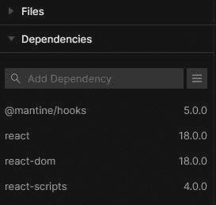
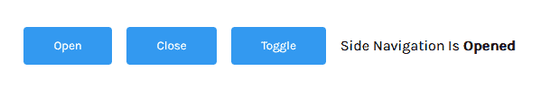
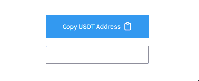
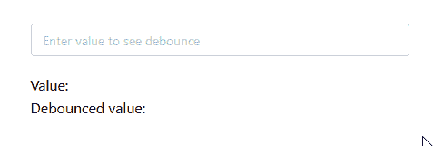

# 在 React 中简化 UI 管理的 5 个陷阱

> 原文：<https://blog.logrocket.com/5-mantine-hooks-simplifying-ui-management-react/>

在开发前端应用程序时，某些任务会重复出现，而且通常是不可避免的。从管理表单状态到访问 web 存储，作为一名前端开发人员，您可能会不断遇到这些场景。

为每种情况编写相同的代码很容易变得重复，最好将这些任务的逻辑封装成小的、可重用的函数。幸运的是，React 钩子通过自定义钩子帮助解决了这个问题！

自定义钩子是一个函数，它允许您使用内置的 React 钩子(如`useState`、`useEffect`等)编写可重用的有状态逻辑。这种架构加强了良好的软件设计原则，如代码可读性、关注点分离和防止代码重复。这是迄今为止我最喜欢的 React 特性之一！

Mantine——一个 React 组件库——已经创建了一组定制钩子来处理常见的状态管理和 DOM 操作任务。在这篇文章中，我们将探索五个有用的钩子，它们是我从 [50 多个可用的钩子](https://mantine.dev/hooks/use-counter/)中挑选出来的。

首先，我们来看看 Mantine 是怎么回事。

## 什么是 Mantine？

Mantine 是一个 React 组件库，旨在为用户和开发者提供更好的体验。类似于流行的 UI 框架，如 [Material UI](https://mui.com/) ，Mantine 包含了一些基本特性，如主题化、样式化和核心包中包含的可重用组件:`@mantine/core`。

我发现这个项目有趣的地方在于它的各个部分是如何被分割成独立的包的:`@mantine/hooks`、`@mantine/form`和`@mantine/dates`，允许你为你的项目挑选你想要的包而不使它膨胀。我们的重点将放在挂钩包装上。

其中一些挂钩依赖于 Mantine 库本身，也就是说，需要您下载核心包，但是我将要介绍的这些挂钩并不需要它。

## 先决条件

要跟进，您需要:

*   熟悉 React 概念，比如状态和钩子
*   关于定制钩子如何工作的一些知识

你可以在这里看到所有五个鱼钩的动作。现在让我们安装 Mantine。

## 在 react 项目中安装 martine hooks

我们将使用 CodeSandbox 来引导一个新的 React 项目。在新的浏览器选项卡中键入`react.new`创建一个 starter React 应用程序:

```
// App.js
import "./styles.css";
export default function App() {
  return (
    <div className="App">
      <h1>Hello CodeSandbox</h1>
      <h2>Start editing to see some magic happen!</h2>
    </div>
  );
}

```

接下来，通过在**依赖项**选项卡中搜索`@mantine/hooks`并将其添加到依赖项列表中来安装 Mantine Hooks 库。



如果您选择在终端中引导 React 应用程序，请使用以下命令下载 Hooks 包:

```
npm install @mantine/hooks

```

让我们看看单子上的第一个钩子。

## `use-disclosure`挂钩

`use-disclosure`钩子用于控制一个布尔值作为状态。它用管理其值的`open`、`close`和`toggle`方法返回一个`handlers`属性。这个钩子可以在控制侧边导航的视图时使用；创建切换按钮；和许多其他的例子:

```
import { useDisclosure } from "@mantine/hooks";

export default function UseDisclosure() {
  const [sideNav, handlers] = useDisclosure(false);

  return (
    <div>
      <button onClick={() => handlers.open()}>Open</button>
      <button onClick={() => handlers.close()}>Close</button>
      <button onClick={() => handlers.open()}>Toggle</button>
      <span>
        Side navigation is <strong>{sideNav ? "opened" : "closed"}</strong>
      </span>
    </div>
  );
}

```



与`use-disclosure`相似的是另一个值得大喊的钩子:`use-toggle`。`use-toggle`的功能类似于`use-disclosure`中的 toggle 方法，但是接受两个数组值而不是一个布尔值:

```
import { useToggle } from '@mantine/hooks';

function UseToggle() {
  const [value, toggle] = useToggle(['blue', 'orange']);

  return (
    <Button color={value} onClick={() => toggle()}>
      {value}
    </Button>
  );

```

## `use-clipboard`挂钩

如果我不得不使用整个库中的一个钩子，它将是这个——我对我经常 googled“复制到剪贴板 JavaScript”没有什么印象。:("

`use-clipboard`钩子与`window`对象的`navigator.clipboard`属性接口。

`use-clipboard`接受一个`options`参数并返回一个具有以下属性的对象:

*   `copy`:将数值复制到剪贴板的功能
*   `copied`:布尔值，表示在`options.timeout`中指定的时间内`copy`被调用
*   `reset`:清除超时并将`copied`复位为假的功能
*   `error`:出错时包含`Error`对象

```
import { useClipboard } from "@mantine/hooks";
import { checkIcon, clipboardIcon } from "../icons";

export default function UseClipboard() {
  const user = {
    usdtAddress: "0x2a38ed609c51bbe050bf07939d3eafe0f9e029c8"
  };

  const clipboard = useClipboard({ timeout: 1500 });

  return (
    <div>
      <button onClick={() => clipboard.copy(user.bitcoinAddress)}>
        {clipboard.copied ? (
          <>Address copied {checkIcon}</>
        ) : (
          <>Copy BTC Address {clipboardIcon}</>
        )}
      </button>
    </div>
  );
}
```



您将会注意到，大多数 Mantine 钩子都是现有浏览器 API 的包装器。

## `use-local-storage`挂钩

`use-local-storage`钩子使用`window.localstorage`接口来允许你使用本地存储项作为反应状态。这个钩子的工作方式类似于`useState`钩子——它返回一个状态变量和一个更新函数:

```
import { useLocalStorage } from '@mantine/hooks'

export default function UseLocalStorage() {
  const [language, setLanguage] = useLocalStorage({
    key: 'lang',
    defaultValue: '',
  })

  return (
    <div>Current language: {language}</div>
  )
}

```

这里，`language`的值是用关键字`lang`从本地存储项中初始化的。

`setLanguage`更新本地存储项目`language`及其状态值。

下面是一个例子，其中`use-local-storage`用于存储用户的首选语言类型:

```
import { useLocalStorage } from '@mantine/hooks'

export default function UseLocalStorage() {
  const [language, setLanguage] = useLocalStorage({
    key: 'lang',
    defaultValue: '',
  })

  const updateLanguage = (e) => {
    setLanguage(e.target.value)
  }

  return (
    <div>
      <h3>Select your preferred language below:</h3>
      <select onChange={updateLanguage}>
        <option hidden disabled selected value>
          Select a language
        </option>
        <option value='english'>English</option>
        <option value='spanish'>Spanish</option>
        <option value='french'>French</option>
        <option value='latin'>Latin</option>
      </select>
      <br />
      <span>Current language: {language}</span>
    </div>
  )
}

```

您应该注意到，出于安全原因，这个钩子在 iframes 上不起作用——就像 CodeSandbox 中显示的浏览器一样。要查看它的工作情况，请在您的本地开发环境中尝试这个挂钩。

## `use-input-state`挂钩

这个钩子用于管理本地和定制输入的状态:

```
import { useInputState } from "@mantine/hooks";

export default function UseInputState() {
  const [firstName, setFirstName] = useInputState("");

  return (
    <>
      <input type="email" value={firstName} onChange={setFirstName} />
      <br />
      <span>Text input value: {firstName}</span>
    </>
  );
}

```

虽然没有 Mantine 的表单管理库(`@mantine/form`)的 [useForm](https://mantine.dev/form/use-form/) 钩子强大，但是这个钩子使得获取输入值更加容易，而不必直接处理事件对象。

## `use-debounced-value`挂钩

这个钩子用于[去抖](https://www.geeksforgeeks.org/debouncing-in-javascript/)——延迟触发——改变一个值。一个[自动完成搜索框](https://mcu-character-search.netlify.app/)是应用这种实践的一个常见例子。例如，当进行搜索时，浏览器向后端发出多个请求，每个字符都输入到输入字段中。

像这样接受如此大量的服务器请求可能会随着用户的增加而耗尽带宽。因此，您可以使用反跳来减少服务器请求的数量，只在指定的时间后发出请求:

```
import { useState } from "react";
import { useDebouncedValue } from "@mantine/hooks";
import { Center, Text, TextInput } from "@mantine/core";

export default function UseDebouncedValue() {
  const [value, setValue] = useState("");
  const [debounced] = useDebouncedValue(value, 200);

  return (
    <Center>
      <div style={{ width: "70%", marginTop: "2rem" }}>
        <TextInput
          placeholder="Enter value to see debounce"
          value={value}
          style={{ flex: 1 }}
          onChange={(e) => setValue(e.currentTarget.value)}
        />
        <br />
        <Text>Value: {value}</Text>
        <Text>Debounced value: {debounced}</Text>
      </div>
    </Center>
  );
}

```



`use-debounced-value`挂钩设计用于控制部件。这意味着您的组件会在每次状态改变时呈现—当一个新字符输入到输入中时。

如果你不想让这种情况发生，Mantine 提供了一个替代钩子`use-debounced-state`，用于在不受控制的组件中去抖。点击查看这些挂钩之间的[差异。](https://mantine.dev/hooks/use-debounced-value/#differences-to-usedebouncedstate)

这就完成了列表！

## 结论

到目前为止，我们已经看到了在 React 中使用定制钩子的好处，以及如何将组件逻辑整合到小的可重用函数中。Mantine Hooks 包是这个特性影响力的另一个例子。一定要检查 Mantine 文档，看看其他错过这个列表的有趣的钩子。

## [LogRocket](https://lp.logrocket.com/blg/react-signup-general) :全面了解您的生产 React 应用

调试 React 应用程序可能很困难，尤其是当用户遇到难以重现的问题时。如果您对监视和跟踪 Redux 状态、自动显示 JavaScript 错误以及跟踪缓慢的网络请求和组件加载时间感兴趣，

[try LogRocket](https://lp.logrocket.com/blg/react-signup-general)

.

[ ](https://lp.logrocket.com/blg/react-signup-general) [](https://lp.logrocket.com/blg/react-signup-general) 

LogRocket 结合了会话回放、产品分析和错误跟踪，使软件团队能够创建理想的 web 和移动产品体验。这对你来说意味着什么？

LogRocket 不是猜测错误发生的原因，也不是要求用户提供截图和日志转储，而是让您回放问题，就像它们发生在您自己的浏览器中一样，以快速了解哪里出错了。

不再有嘈杂的警报。智能错误跟踪允许您对问题进行分类，然后从中学习。获得有影响的用户问题的通知，而不是误报。警报越少，有用的信号越多。

LogRocket Redux 中间件包为您的用户会话增加了一层额外的可见性。LogRocket 记录 Redux 存储中的所有操作和状态。

现代化您调试 React 应用的方式— [开始免费监控](https://lp.logrocket.com/blg/react-signup-general)。