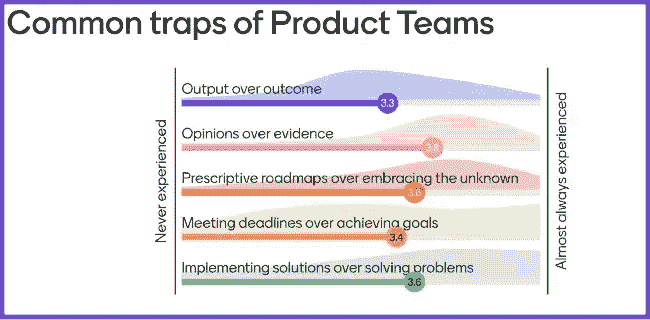

# 大多数产品团队都会犯的 5 个错误(以及如何避免它们)

> 原文：<https://blog.logrocket.com/product-management/5-mistakes-product-teams-make-how-to-avoid/>

几乎所有我小时候喜欢的东西都被订阅服务取代了。我成长的世界如今被视为复古。

例如，我是一个重金属迷。我收集 CD，和朋友交换，并以拥有所有铁娘子专辑为荣。我花了一段时间才到达那里。今天，由于 Spotify，任何人都可以在几秒钟内访问他们想要的任何专辑。一些青少年甚至不知道什么是 CD。

另一个例子:一个月一到两次，我会去百视达租一部电影。我会走到那里，选择我想看的电影——但常常失望地发现没有。今天，无论你是谁，你都可以直接搜索、租借或购买任何你想看的东西。没有压力，只是按。

归根结底，各行业正在自我颠覆，变得数字化，感觉就像一眨眼的功夫。在这种情况下，会出现许多机会。这就是为什么你总能找到许多与产品团队合作的空缺职位。

但行业发展的速度也给产品团队留下了足够的空间，让他们落入陷阱，从事阻碍效率和创新的反模式活动。在本指南中，我们将分析产品团队最常犯的一些错误，并逐步帮助您革新团队的工作方式。

* * *

## 目录

* * *

## 产品团队会陷入哪些陷阱？

工业被破坏的速度令人难以置信。尽管有这些增长和创新，但是，许多团队仍然带着 20 世纪 70 年代的思维方式工作。

我这么说是什么意思？我经常在世界各地发表演讲。在每次演讲之前，我想对服务人员经常面临的常见反模式和陷阱有一个概述。无论我在哪个国家，我都得到了相似的结果。它们经常让我震惊。

例如，下面的图表分解了我从西欧观众那里收集的反馈。与会者列举了以下让他们的产品团队感到停滞不前的场景:

*   产出超过结果
*   证据意见
*   拥抱未知的规范路线图
*   在截止日期前完成目标
*   实施解决方案胜于解决问题

一个队向右得分越远，它就越被困住了:

我在美国、东欧和英国得到了几乎相同的结果。为什么会发生这些事情？

作为产品经理，我们必须做出选择:你可以屈服于现状，继续停滞不前，或者后退一步，反思并挑战困扰你的团队多年的反模式。

让我来帮你寻找机会，让你的工作变得更好。

## 评估现状

引导变革需要勇气。人们不喜欢改变，因为未知令人恐惧。然而，如果你够勇敢，采取容易理解的方法，你会得到支持者。

你可以从帮助人们认识问题及其后果开始。之后可以谈改进的方法，之前不行。

不要告诉你的同事他们工作不正常。向他们展示反模式，并询问他们多久面对一次。然后，带着希望，把自己定位为引领转型的引路人。当人们遇到问题时，他们需要有人指导他们解决问题。

下面是我的方法:说出你看到的反模式，让你的同事给它们打分。你可以用任何数字板来做这件事(例如 [Mentimeter](https://www.mentimeter.com/app) 、 [Miro](https://miro.com/) 、[壁画](https://mural.co/)等)。).

下一个问题是，我们是否乐于永远保持这种状态？

## 5 个常见的产品管理错误(以及如何克服它们)

在这种情况下，您拥有解决反模式所需的开放性。让我向您介绍我经常面临的五种效率低下的情况，以及如何克服它们:

1.  [输出超过结果](#output-over-outcome)
2.  [对证据的意见](#opinions-over-evidence)
3.  [拥抱未知的规定性路线图](#prescriptive-roadmaps-over-embracing-the-unknown)
4.  [在截止日期前完成目标](#meeting-deadlines-over-achieving-goals)
5.  [实施解决方案而不是解决问题](#implementing-solutions-over-solving-problems)

### 1.产出超过结果

你的公司如何衡量成功？

如果你像大多数产品团队一样，[速度](https://blog.logrocket.com/product-management/agile-product-management-what-does-it-mean/)，[特色](https://blog.logrocket.com/product-management/what-are-product-features-define-examples/)，期限是衡量成功的手段。问题是它们都不能保证你为你的企业创造价值。

也许你很幸运，成功意味着[增加了一个重要的 KPI](https://blog.logrocket.com/product-management/what-metrics-kpis-product-managers-track/) ，比如[客户满意度](https://blog.logrocket.com/product-management/customer-satisfaction-survey-templates-examples-questions/)、退货率、[交谈率](https://blog.logrocket.com/product-management/what-is-conversion-rate-how-to-calculate/)等。你交付多少特性并不重要，重要的是它们如何改变最终的结果。

大多数人认为输出是自然的，而结果不是。然而，你必须关注结果来创造价值。

你可以把结果带到你的谈话中来。以下是一些例子:

*   **请求**——每当你收到一个请求，努力理解结果。不要纠结于解决方案；你的目标是交付结果
*   **待办事项** —写下你的[待办事项](https://blog.logrocket.com/product-management/product-vs-sprint-vs-release-backlog/)以关注结果。衡量要实现什么，而不是交付什么

从输出到结果改变你的心态是复杂的，但是创造价值是强制性的。

### 2.证据意见

每个人对任何事情都有自己的看法，这很好。但是让意见左右你的决定是不好的。关键是要远离观点，更接近证据。

产品团队每天都面临这种困境。利益相关者想要一些东西，因为他们认为它很酷，但是他们还没有和任何用户谈过。开发商和[设计师](https://blog.logrocket.com/product-management/product-designer-vs-product-manager/)经常陷入混战，提出的事实很少，但观点很多。

当讨论基于观点时，结果取决于运气。

* * *

订阅我们的产品管理简讯
将此类文章发送到您的收件箱

* * *

更好的方法是留心。如果你认为你的产品不可思议，但是缺乏证据，那么做实验来检验你的假设怎么样？

比方说，一个设计师认为需要一个复杂的改编，但是没有证据说服开发者。进行一次未经授权的原型测试并比较不同的设计怎么样？

要创造有价值的产品，证据必须比意见更有说服力。

### 3.拥抱未知的规范路线图

[好的路线图](https://blog.logrocket.com/product-management/how-to-build-product-roadmap-overview-examples/)设置护栏，让团队发挥创意。糟糕的路线图迫使团队在不知道原因的情况下完成不可能的任务。

大多数路线图没有给创造力留下空间。原因各不相同，从缺乏信任到缺乏理解。只要你的路线图定义了团队要交付什么，他们就没有成功的机会。

与高层管理人员会面，要求他们制定不同的路线图。鼓励他们提出产品团队负责的目标，但要建立带宽来试验其他解决方案。

一些领导团队会接受这一点，但大多数不会。在这一点上，你可以建议尝试一个实验:下一个路线图的 20%应该集中在一个目标上，而其余的将像以前一样。

当你有机会拥抱未知时，你就增加了创造杰出解决方案的机会。

让结果说话更响亮，并对你的[路线图](https://blog.logrocket.com/product-management/product-roadmap-tools-best-features-free-paid/)进行渐进的改变。

### 4.在截止日期前完成目标

在为数不多的可能比规定的路线图更糟糕的事情中，有一件是带有固定期限的路线图。当这种情况发生时，团队会走捷径来满足任意的愿望。

[截止日期](https://blog.logrocket.com/product-management/how-to-meet-product-deadlines/)有什么问题？不是截止日期本身，而是它们是如何设定的。通常，团队之外的人会定义截止日期，然后要求团队做出承诺。当然，那是不行的。没有人会承诺他们没有计划的事情。

合作是这个难题的答案。如果领导因为任何原因想要在截止日期前完成任务，与团队分享。

例如，如果[客户获取成本](https://blog.logrocket.com/product-management/what-is-customer-acquisition-cost-how-to-reduce/)过高，就需要改善或增加[客户终身价值](https://blog.logrocket.com/product-management/what-customer-lifetime-value-clv-how-calculate/)。领导层可能害怕资金耗尽，所以他们希望在三个月内解决这种情况。与团队分享就足够了。

像这样的问题，“在接下来的三个月里，我们将如何改变我们的处境？”是制定有价值目标的良好开端。这个问题使团队能够逆向工作，寻找不同的选项。

当你专注于目标时，结果会以积极的方式给你惊喜。但是当你的注意力集中在最后期限时，质量就会下降。

### 5.实施解决方案胜于解决问题

在过去的几十年里，你的级别越高，你能做的决定就越多。传统上，高层人士往往很少甚至没有客户联系。从那以后，事情发生了很大的变化。

好的领导是关于创造一个[团队可以自主工作的环境](https://blog.logrocket.com/product-management/12-agile-manifesto-principles-how-to-adopt-them/#11-trust-your-team)。

不幸的是，一些领导者误解了他们的角色，试图发号施令。他们有所有最好的想法，并希望他们的团队按照他们所说的实施解决方案。然而，团队甚至不知道他们正在解决什么问题。

在你作为产品经理的职业生涯中，你不可避免地会遇到这样的领导者。你可以赢得这场战斗，不是靠争论，而是靠好奇心。提出问题来理解问题。例如:

*   “好主意。你能帮助我理解我们正在解决什么问题吗？”
*   “了解背景会很有帮助。你能分享更多相关信息吗，比如这种情况发生的频率有多高，人们是如何处理的，以及这让他们有多恼火？”
*   “当我们实施了该解决方案时，我们如何知道我们成功了？”

争论使人烦恼，但好奇心会促使他们反思。

> "数百万人看到苹果落地，但牛顿问为什么."—伯纳德·巴鲁克

## 转换公式

当你做我上面提到的测试时，你可能会意识到你的产品团队有许多反模式。不要不知所措——大多数团队都没有机会体验不同的工作方式。把它作为一个机会去做一些不同的事情。

实现任何转型的秘诀如下:

1.  认识到问题以及为什么你需要解决它
2.  不要试图一次解决所有问题；一次选择一个问题
3.  实验并测量结果
4.  和你的团队一起思考，决定如何继续前进
5.  冲洗并重复

转变是一场超级马拉松，而不是 100 米短跑。放松，但要坚持不懈。

## [LogRocket](https://lp.logrocket.com/blg/pm-signup) 产生产品见解，从而导致有意义的行动

[LogRocket](https://lp.logrocket.com/blg/pm-signup) 确定用户体验中的摩擦点，以便您能够做出明智的产品和设计变更决策，从而实现您的目标。

使用 LogRocket，您可以[了解影响您产品的问题的范围](https://logrocket.com/for/analytics-for-web-applications)，并优先考虑需要做出的更改。LogRocket 简化了工作流程，允许工程和设计团队使用与您相同的[数据进行工作](https://logrocket.com/for/web-analytics-solutions)，消除了对需要做什么的困惑。

让你的团队步调一致——今天就试试 [LogRocket](https://lp.logrocket.com/blg/pm-signup) 。

[David Pereira Follow](https://blog.logrocket.com/author/davidpereira/) Product Leader with 15+ years of experience. Partner at Value Rebels and interim CPO at omoqo. Almost every product team is trapped somehow; untrapping them is what drives me.