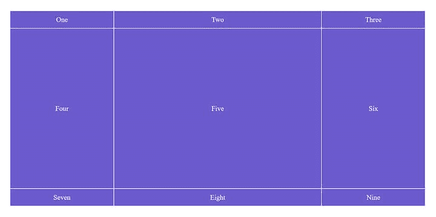
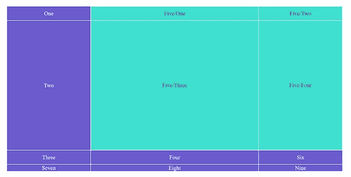

# 你现在就可以测试 5 个新的 CSS 特性

> 原文：<https://blog.logrocket.com/5-new-css-features-you-can-already-test/>

在浏览器逐渐开始实现它们之前，CSS 特性首先在 W3 协会的规范中定义——通常是经过长时间的讨论。值得一提的 CSS 新特性数不胜数，但在本指南中，我们将重点介绍已经可以在至少一个 web 浏览器的稳定版本中测试的五个特性:

1.  [CSS 子网格](#1csssubgrid)
2.  [柔性盒间隙](#2flexboxgaps)
3.  [`content-visibility`房产](#3thecontentvisibilityproperty)
4.  [`contain-intrinsic-size`房产](#4thecontainintrinsicsizeproperty)
5.  [中的`:is`和`:where`伪类](#5theisandwherepseudoclasses)

请注意，浏览器对这些功能的支持一直在变化，因此请经常查看网站的当前支持水平，如[我能使用](https://caniuse.com/)、 [MDN CSS 参考](https://developer.mozilla.org/en-US/docs/Web/CSS/Reference)(支持信息在每页的底部)，以及 [Chrome 平台状态](https://chromestatus.com/features)。

## 1.CSS 子网格

CSS Grid 是一个灵活的布局模块，允许开发人员创建复杂的布局，而无需使用 JavaScript 或求助于混乱的 CSS 技巧。

要将网格布局应用于 HTML 元素，请向其添加以下规则。

```
 .grid-container {
    display: grid;
}

```

有几个特定于网格的属性可用于设置您需要的精确布局。

例如，在上面的例子中，`.grid-container`的子元素将是网格项，它们将根据您用 [`grid-template-columns`](https://developer.mozilla.org/en-US/docs/Web/CSS/grid-template-columns) 和 [`grid-template-rows`](https://developer.mozilla.org/en-US/docs/Web/CSS/grid-template-rows) 属性定义的规则进行布局:

```
.grid-container {
    display: grid;
    grid-template-columns: 1fr 2fr 1fr;
    grid-template-rows: 50px 70vh 50px;
}

```

上面的代码定义了下面的 CSS 网格布局。



但是，如果您也想在网格布局中包含一些(或全部)孙元素呢？这就是 CSS 子网格发挥作用的地方。

您可以将以下规则添加到网格项目，使其能够采用其父项的网格轨迹(包括名称网格线和区域，即使它也可以定义自己的)。

```
.grid-item {
    /* these rules specify the subgrid's position within the layout */
    grid-column: 2 / 4;      /* two columns vertically */
    grid-row: 1 / 3;         /* two rows horizontally */

    /* these rules belong to the subgrid itself */
    display: grid;
    grid-template-columns: subgrid;
    grid-template-rows: subgrid;
}

```

[`grid-column`](https://developer.mozilla.org/en-US/docs/Web/CSS/grid-column) 和 [`grid-row`](https://developer.mozilla.org/en-US/docs/Web/CSS/grid-row) 属性定义网格项在网格列或行中的位置。`.grid-item`的子元素将形成子网格。一个网格项目可以跨越多个网格单元。例如，这里它分布在四个单元格中(在上面的例子中，`grid-column`和`grid-row`的值是任意的)。

如您所见，`subgrid`不是一个独立的 CSS 属性，而是一个可以添加到`grid-template-columns`和`grid-template-rows`属性中的值。它使`.grid-item`的子节点包含在网格布局中:



正如您所看到的，子网格已经成为网格布局的一部分，它已经被定位到我们想要的确切位置(在第二和第四条垂直网格线与第一和第三条水平网格线之间)。

其余的网格项保持了正常的网格流，第四行也出现在布局的底部。但是，由于我们只使用`grid-template-rows`属性定义了三行，所以第四行没有预设值，所以它只取其内容的自然高度。如果我们从最后三个网格项中删除文本，它们甚至不会出现，因为它们的自然高度是 0。

您可以使用下面的 CodePen 演示来测试上面的例子。

参见 [CodePen](https://codepen.io) 上安娜·莫努斯([@阿蒙斯](https://codepen.io/amonus) )
的 Pen [亚格子测试](https://codepen.io/amonus/pen/dyMgeLP)。

您也可以通过仅采用`grid-template-columns`或`grid-template-rows`并对另一个使用新值来创建一维子网格。

例如，在下面的例子中，子网格只采用主网格的列，但是它为行创建了一个新规则。

```
.grid-item {
        display: grid;
        grid-template-columns: subgrid;
        grid-template-rows: 200px 400px 200px;
}

```

### 浏览器支持

CSS 子网格规范是 2020 年 8 月的 W3C 候选推荐标准。目前，只有火狐 71+ 支持[，但也有](https://caniuse.com/css-subgrid)[即将推出 Chromium](https://blog.chromium.org/2020/06/improving-chromiums-browser.html) ，这款开源网络浏览器被用作包括 Chrome、Opera、Brave 和新的微软 Edge 在内的主流浏览器的基础。

如果你需要一个后备方法，注意嵌套网格(用`inherit`值定义)和 CSS 子网格不是一回事。可以使用嵌套网格并重新计算网格轨迹来模拟子网格；然而，在这种情况下，您仍然有两个独立的网格，而不是一个与网格项目的一些或所有子项目共享其轨迹的网格。

## 2.柔性盒间隙

长期以来，在 flexbox 布局中的 flex 行或 flex 列之间添加间隙一直是一个难题。这通常是通过向 flex 项目添加边距来解决的，但边距的问题是，它们也被添加到每个 flex 行或列的开头和结尾。尽管可以通过在第一个/最后一个元素上添加负边距来消除这些问题，但这并不是最优雅的解决方案。

幸运的是，浏览器对 flexbox gaps 的支持越来越好。 [`gap`](https://developer.mozilla.org/en-US/docs/Web/CSS/gap) 、 [`row-gap`](https://developer.mozilla.org/en-US/docs/Web/CSS/row-gap) 和`[column-gap](https://developer.mozilla.org/en-US/docs/Web/CSS/column-gap)`属性存在于不同的上下文中，具有不同级别的浏览器支持。您可以在以下布局模块中使用间隙属性。

*   Flexbox，由`display: flex;`声明定义
*   CSS 网格，由`display: grid;`声明定义
*   多列(多线圈)布局，由`column-count`和/或`column-width`属性定义

你可以在 [CSS 框对齐模块(3 级)](https://www.w3.org/TR/css-align-3/#gaps)规范中找到 gap 属性的共享语法。

您可以使用具有任意长度值(px、em、rem、cm、mm、vmin、vmax 等)的`gap`、`row-gap`和`column-gap`属性。)或百分比(%)。

在 flexbox 上下文中，您需要将它们添加到 flex 容器中(而不是添加到 flex 条目中)。

```
.flex-container {
  row-gap: 10px;
  column-gap: 15px;
}

```

`gap`属性是`row-gap`和`column-gap`的简写。如果使用两个值，那么第一个值属于`row-gap`，第二个值属于`column-gap`。

```
.flex-container {
  gap: 10px 15px;
}

```

如果只使用一个值，`row-gap`和`column-gap`将取相同的值。

```
.flex-container {
  gap: 10px;
}

```

### 浏览器支持

您可以在相关的[我可以使用表格](https://caniuse.com/?search=gap)中检查浏览器对 gap 属性的支持，这些表格显示了在各种上下文中的支持。你可以看到它在 CSS 网格布局中得到最广泛的支持，因为这是它第一次被定义的地方。

在 flexbox 布局中，Edge 84+、Firefox 63+、Chrome 84+和 Opera 70+目前支持 gap 属性。Internet Explorer(显然)和 Safari 不支持它。

考虑到 Safari 和旧浏览器的回退，`gap`属性的问题是您不能用 [`@supports`](https://developer.mozilla.org/en-US/docs/Web/CSS/@supports) 特性查询来测试它，因为浏览器在三个布局模块(flexbox、CSS grid、multicol)中的支持是不同的，并且`@supports`检查最广泛支持的上下文(CSS grid)。如果你需要支持 Safari、IE 或更老的浏览器，现在最好使用 margin hack(除非你想用 JavaScript 做额外的检查)。

## 3.`content-visibility`属性

[`content-visibility`](https://www.w3.org/TR/css-contain-2/#content-visibility) 属性使您能够管理屏幕外元素的呈现过程(和可见性)。作为 CSS 包容模块的一部分，这个组件可以帮助你显著提高页面的渲染性能。

它可以有三个值:

*   `visible`(默认)—元素的渲染正常进行
*   `hidden` —当元素的渲染被跳过时，无论是在屏幕外还是在屏幕上
*   `auto` —元素离屏时，跳过其渲染；当它出现在屏幕上时，它的渲染会自动实现

您可以简单地将`content-visibility`属性添加到您想要更改其呈现过程的元素中。

* * *

### 更多来自 LogRocket 的精彩文章:

* * *

```
article {
  content-visibility: auto;
} 

```

当内容可见性自动化时(取`auto`值)，呈现过程的不同方面(布局、风格、绘画和大小控制)会自动打开和关闭——你可以在[这本优秀的指南](https://web.dev/content-visibility/)中详细了解。在他们的测试网站(一个旅游博客)上，作者通过将`content-visibility: auto;`规则添加到测试博客的不同部分，成功地将初始页面加载的渲染时间减少了七倍多(从 232 毫秒到 30 毫秒)——这是一个相当令人印象深刻的结果。

### 浏览器支持

目前 Chrome 85+、Edge 85+和 Opera 71+支持的[属性。火狐团队也在讨论添加功能](https://caniuse.com/css-content-visibility)，但它仍处于非常早期的阶段。

## 4.`contain-intrinsic-size`属性

[`contain-intrinsic-size`](https://www.w3.org/TR/css-sizing-4/#propdef-contain-intrinsic-size) 属性定义了激活了[大小约束](https://developer.mozilla.org/en-US/docs/Web/CSS/CSS_Containment#Size_containment)的元素的显式宽度和高度，这意味着元素的大小不受其子元素大小的影响。设置明确的宽度和/或高度旨在防止这些元素在某些情况下折叠为零。

例如，当`content-visibility`被设置为`auto`时，建议您为`contain-intrinsic-size`定义一个值(参见上一节)。当屏幕外元素的渲染过程被跳过时，它们被渲染为空元素，所以它们的宽度和高度默认设置为`0`。但是，在它们滚动到视图中之前，它们的内容会自动呈现在屏幕上，这可能会导致 UX 问题，例如滚动条大小的突然变化。

`contain-intrinsic-size`的默认值为`none`，但可以取任意长度值(px、rem、em、cm、mm 等。)也是。您可以使用一个或两个值。对于一个值，固有的宽度和高度将是相同的，而对于两个值，第一个值提供宽度，第二个值提供高度。例如:

```
article {
  content-visibility: auto;
  contain-intrinsic-size: 700px 1000px;
} 

```

### 浏览器支持

目前， [Chrome 83+](https://www.chromestatus.com/feature/5737051062272000) 、Edge 83+和 Opera 69+支持`contain-intrinsic-size`属性。火狐不支持。

## 5.`:is()`和`:where()`伪类

由[选择器第 4 级](https://www.w3.org/TR/selectors-4/)规范定义的 [`:is()`](https://developer.mozilla.org/en-US/docs/Web/CSS/:is) 和 [`:where()`](https://developer.mozilla.org/en-US/docs/Web/CSS/:where) 伪类使得减少较长 CSS 选择器列表中的重复成为可能。它们可用于标记重复选择器中的唯一项目，这样您只需添加一个选择器，而不是几个。

这两个伪类做的事情几乎一样；唯一的区别在于具体程度。`:is()`取括号内最具体元素的具体性，而`:where()`的具体性始终是`0`。特异性很重要，因为它决定了覆盖给定 CSS 规则的难易程度。

例如，如果您有以下选择器列表:

```
.my-class p em,
.my-class li em,
.my-class section em {
    // CSS rules
}

```

如果您想保持较高的特异性，以使后续声明更难覆盖所属规则，那么您可以使用`:is()`来缩短列表。

```
.my-class :is(p, li, section) em {
  // CSS rules
}

```

如果您想保持特异性`0`以便更容易覆盖所属规则，您可以使用`:where()`。

```
.my-class :where(p, li, section) em {
  // CSS rules
}

```

在上面的例子中，`.my-class em`选择器会覆盖`:where`规则，但不会覆盖`:is`。你可以在下面的 CodePen 演示中比较这两个伪类的效果——目前，它只在 Firefox 中有效(`:is`在 Safari 中也有效，但`:where`无效)，但你可以在 Chrome 中通过启用 chrome://flags/ URL 中的`Experimental Web Platform features`标志来测试该功能。

参见 [测试之笔:is and :where 伪类](https://codepen.io/amonus/pen/dyMEbqQ)作者安娜·莫纳斯([@阿蒙斯](https://codepen.io/amonus) )
于 [CodePen](https://codepen.io) 。

浏览器支持

### Firefox 78+和 Safari 14+目前支持的 [`:is`伪类。基于 Chromium 的浏览器(Chrome 15+，Edge 79+，Opera 15+)支持使用`:-webkit-any()`前缀的前缀语法。在 Chrome 68+、Opera 55+和 Edge 79+中也可以通过将`Experimental Web Platform features`标志设置为选中来启用该功能。](https://caniuse.com/css-matches-pseudo)

而 [`:where`伪类就没那么广泛支持](https://caniuse.com/mdn-css_selectors_where)。目前，只有 Firefox 78+支持它，但您可以通过使用`Experimental Web Platform features`标志在 Chrome 72+中启用它。

最后的想法

## 您应该谨慎使用本文中讨论的新 CSS 特性。理想情况下，您应该为它们提供一个反馈方法，使用带前缀的版本，或者等到它们被更广泛地实现。

但是，如果您喜欢试验，您已经可以使用`content-visibility`和`contain-intrinsic-size`属性。你可以在已经支持它的浏览器中实现严重的性能优化(你可以用`@supports`规则测试浏览器的支持)，并且它们不会影响还不支持它的浏览器。

除了这五个新的 CSS 特性之外，还有许多其他有趣的发展，比如还没有在任何浏览器中实现的`aspect-ratio` ( [W3](https://drafts.csswg.org/css-sizing-4/#aspect-ratio) 、 [MDN](https://developer.mozilla.org/en-US/docs/Web/CSS/aspect-ratio) 、[我可以使用](https://caniuse.com/?search=aspect-ratio))和`leading-trim` ( [W3](https://www.w3.org/TR/css-inline-3/#leading-trim) )属性，以及已经在中实现的`::marker`伪元素( [W3](https://www.w3.org/TR/css-lists-3/#marker-pseudo) 、 [MDN](https://developer.mozilla.org/en-US/docs/Web/CSS/::marker) 、[我可以使用](https://caniuse.com/css-marker-pseudo)

总而言之，值得不断关注 CSS 新特性的标准化和实现过程。浏览器中有许多有用的功能，最终将使前端开发变得更容易、更快。

你的前端是否占用了用户的 CPU？

## 随着 web 前端变得越来越复杂，资源贪婪的特性对浏览器的要求越来越高。如果您对监控和跟踪生产环境中所有用户的客户端 CPU 使用、内存使用等感兴趣，

.

[try LogRocket](https://lp.logrocket.com/blg/css-signup)

LogRocket 就像是网络和移动应用的 DVR，记录你的网络应用或网站上发生的一切。您可以汇总和报告关键的前端性能指标，重放用户会话和应用程序状态，记录网络请求，并自动显示所有错误，而不是猜测问题发生的原因。

[](https://lp.logrocket.com/blg/css-signup)[https://logrocket.com/signup/](https://lp.logrocket.com/blg/css-signup)

现代化您调试 web 和移动应用的方式— [开始免费监控](https://lp.logrocket.com/blg/css-signup)。

Modernize how you debug web and mobile apps — [Start monitoring for free](https://lp.logrocket.com/blg/css-signup).