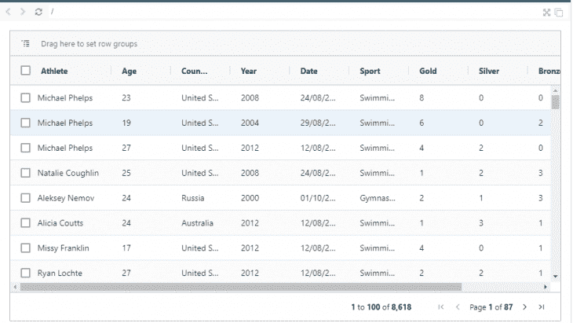
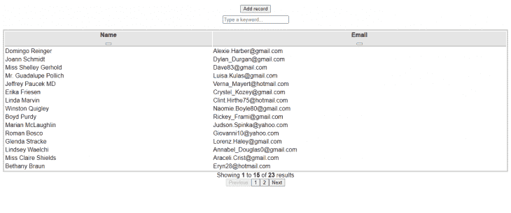
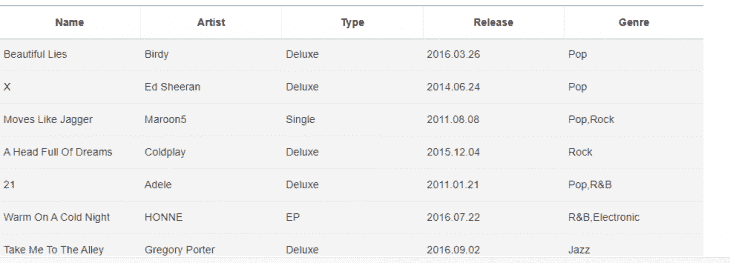

# 5 为您的下一个项目开放源代码 JavaScript 数据网格

> 原文：<https://blog.logrocket.com/5-open-source-javascript-datagrids/>

如果你曾经为企业或金融科技公司开发过 web 应用程序，你会发现他们经常在表格中组织数据。数据网格是可以按行和列呈现数据的组件，并使用户能够执行诸如排序和过滤数据、导出数据、单元格内编辑、分页等操作。

网格是数据驱动的，旨在处理高性能的商业 web 应用程序。他们拥有类似电子表格的用户体验，可以定制来构建复杂的、可伸缩的、数据丰富的界面。

在本文中，我们将概述数据网格的重要性，并讨论您应该在下一个项目中考虑的五种 JavaScript 数据网格。

## 为什么数据网格很重要

数据网格在呈现大量数据(如实时报告、跟踪统计数据等)的 web 应用程序中是必不可少的。以下是您应该为下一个应用程序选择数据网格的一些原因:

*   数据网格提高了应用程序的性能。大多数开源 datagrid 库都是非常轻量级的，所以它们不能弥补太多的开销。此外，大多数图书馆都有虚拟滚动功能，可以改善用户在浏览大型数据集时的体验
*   数据网格具有过滤、排序和分页等特性，使得在大型数据集中导航变得更加容易

## 前 5 名 JavaScript 数据网格

已经了解了使用数据网格的一些重要性，让我们来看看其中的一些。

### 反应表

[React Table](https://react-table.tanstack.com) 是一个无头、开源、轻量级、可扩展的数据表。对于无头数据表，这意味着它不控制您的标记如何呈现或 UI 元素。这使您可以自由地对数据网格进行主题化，以满足您的应用程序需求。

React Table 允许您使用 React 挂钩来配置数据网格特性，如过滤、排序、分页、虚拟化行、单元格内编辑等。

要将它添加到您的项目中，请安装包含以下内容的软件包:

```
npm install react-table
// or
yarn add react-table

```

然后开始用主钩子`useTable`构建基本数据表。这是带有分页的典型 React 数据网格的外观:


您也可以查看[演示](https://codesandbox.io/s/ammezie-react-table-demo-r99iy)。

你可以[将 React Table 集成到你的 React 应用程序](https://blog.logrocket.com/complete-guide-building-smart-data-table-react/)中，即使你只需要使用`usePagination`钩子实现分页。它是一个表实用程序，您可以继续结合这些钩子为您的应用程序构建一个强大的数据网格。

然而，如果您正在构建一个大规模的企业应用程序，您可能需要考虑您的团队从零开始构建一些有形的东西所花费的时间。

### AG 网格

AG Grid 是一个完整的、功能齐全的 JavaScript 数据网格。它有社区版和企业版。它支持主要的 JavaScript 框架，包括 Vanilla JavaScripit、React、Vue 和 Angular。它具有核心功能，如选择、过滤、数据绑定、呈现单元格、单元格内编辑、主-详细信息、导入和导出选项、虚拟滚动、键盘事件、测试和安全选项。

AG Grid 还有其他 UI 组件来扩展网格，如迷你图、工具面板、上下文菜单、状态栏以及集成和独立的图表。

要将开源版本安装到您的 JavaScript 项目中，请运行:

```
npm install ag-grid-community

```

如果你正在做一个 React 项目，你还必须安装`ag-grid-react`包来访问所有的 [React UI 组件](https://blog.logrocket.com/top-9-ui-libraries-kits-react/)。

这是一个典型的 AG Grid 数据网格的样子:



您可以查看基本的[演示](https://codesandbox.io/s/react-yn6h9)来了解 AG Grid 如何与 React 一起工作。

AG Grid 还包括预定义的 UI 主题，并让您能够创建自己的主题。主题包括阿尔卑斯山(带黑暗模式)、巴尔哈姆(带黑暗模式)和材质 UI。

但是，AG Grid 社区版功能有限。您需要获得企业版才能访问主-详细信息、集成图表、迷你图、Excel 导出、行分组、聚合、高级筛选、开发人员支持等功能。尽管如此，如果您正在从事一个大型企业项目，您会希望考虑使用这个 datagrid 的好处，并减少从头构建一个 datagrid 的痛苦。

### 网格. js

[Grid.js](https://gridjs.io) 是一个免费开源的 Javascript 表格插件，用 TypeScript 构建。Grid.js 具有数据绑定、过滤、自定义和多列排序、单元格格式、搜索和分页、选择的配置，并支持 React、Angular 和 Vue。

就像我们之前讨论的 React Table 一样，Grid.js 是一个高级的实用表插件。要将 Grid.js 添加到 JavaScript 项目中，请运行:

```
npm install gridjs

```

然后导入`Grid`模块和 CSS 主题开始构建:

```
import { Grid } from "gridjs";
import "gridjs/dist/theme/mermaid.css";

```

此外，React Table 使用钩子，Grid.js 使用配置。配置是您传递给`Grid`实例的属性，例如`search`、`sort`、`pagination`、`style`等。如果您正在使用任何 JavaScript 框架，Grid.js 已经为每个框架推荐了包装器包。

例如，如果您正在使用 React，您必须运行`npm install gridjs-react`并安装`gridjs`，因为它是包装器工作的核心依赖项:

```
<Grid
  data={[
    ['John', '[email protected]'],
    ['Mike', '[email protected]']
  ]}
  columns={['Name', 'Email']}
  search={true}
  pagination={{
    enabled: true,
    limit: 1,
  }}
/>

```

Grid.js 对样式并不固执己见，所以您可以继续集成您自己的主题来构建一个更复杂的数据表。



可以去看看[的演示](https://codesandbox.io/s/gridjs-demo-gnfmi)。

然而，Grid.js 并不适合企业应用程序，因为它没有对诸如单元格内编辑、虚拟滚动、导出选项、类似 Excel 的过滤和排序等特性的原生支持。

### 可手持的

Handsontable 是一个 JavaScript 库，用于构建快速高效的数据网格。它有一个免费的商业许可，并支持 React、Vue 和 Angular 框架。在核心部分，Handsontable 支持数据绑定(从数据源获取数据，以及如何在 datagrid 上呈现数据)、本地保存数据、中间件、事件、钩子和配置。与 Grid.js 类似，手动配置选项允许您根据自己的喜好配置数据网格。

要将包添加到 JavaScript 项目中，请运行:

```
npm install handsontable

```

然后导入`Handsontable`模块和 CSS 主题。如果你正在做一个 React 项目，你将不得不安装可手持的 React 包装器包`@handsontable/react`。这是 Handsontable with React 的基本代码片段:

```
import { HotTable } from '@handsontable/react';

const hotData = [
  ["", "Tesla", "Volvo", "Toyota", "Honda"],
  ["2020", 10, 11, 12, 13],
  ["2021", 20, 11, 14, 13],
  ["2022", 30, 15, 12, 13]
];

const App = () => {
  return (
    <div id="hot-app">
      <HotTable
        data={hotData}
        colHeaders={true}
        rowHeaders={true}
        width="600"
        height="300"
      />
    </div>
  );
}

```

关于 Handsontable 如何与 React 一起工作的基本示例，您可以查看[演示](https://codesandbox.io/s/handsontable-demo-ukqtq)。

Handsontable 具有这种类似电子表格的 UI，当您希望构建一个具有单元格函数、类型、公式、上下文菜单、键盘导航、国际化、执行批处理操作等功能的电子表格 web 应用程序时，它是最好的选择。然而，当你使用这个库的时候，你会受到主题化选项的限制。

### 吐司 UI 网格

作为一名 JavaScript 开发人员，您可能遇到过 [Toast UI Grid](https://nhn.github.io/tui.grid/latest/) 控件，尤其是通知或弹出控件。Toast UI 网格是一个用于实现数据网格的纯 JavaScript 网格控件。它具有复杂的列操作、自定义编辑器、主题化选项、日期选择器、验证、排序、国际化、数据汇总、自定义事件、冻结列、过滤器、分页和无限滚动等功能。

要将 Toast UI 网格安装到您的 JavaScript 项目中，请运行:

```
npm install tui-grid

```

然后从`tui-grid`导入`Grid`模块。要开始构建您的 JavaScript 网格，创建一个`Grid`的实例并传递选项给它。就像 Grid.js 一样，您需要传递配置选项，调用各种 API 来构建您的网格。

这是典型的 Toast UI 网格的外观:



然而，Toast UI 网格只是一个纯 JavaScript 网格，不支持其他 JavaScript 框架，这是您在选择满足数据网格需求的库时可能要考虑的事情。

## 结论

JavaScript 数据网格是最好由第三方处理的控件，因为它们为您提供了许多功能，并减少了构建您自己的数据网格工具所花费的时间。在本文中，我们讨论了数据网格的重要性，并比较了五种开源 JavaScript 数据网格，包括 React Table、AG Grid、Handsontable、Grid.js 和 Toast UI。我们还强调了这些数据网格的特性和用法。

如果你曾经使用过一个你认为应该在这个列表中的数据网格，请在评论部分提到它。

## 通过理解上下文，更容易地调试 JavaScript 错误

调试代码总是一项单调乏味的任务。但是你越了解自己的错误，就越容易改正。

LogRocket 让你以新的独特的方式理解这些错误。我们的前端监控解决方案跟踪用户与您的 JavaScript 前端的互动，让您能够准确找出导致错误的用户行为。

[](https://lp.logrocket.com/blg/javascript-signup)

LogRocket 记录控制台日志、页面加载时间、堆栈跟踪、慢速网络请求/响应(带有标题+正文)、浏览器元数据和自定义日志。理解您的 JavaScript 代码的影响从来没有这么简单过！

[Try it for free](https://lp.logrocket.com/blg/javascript-signup)

.