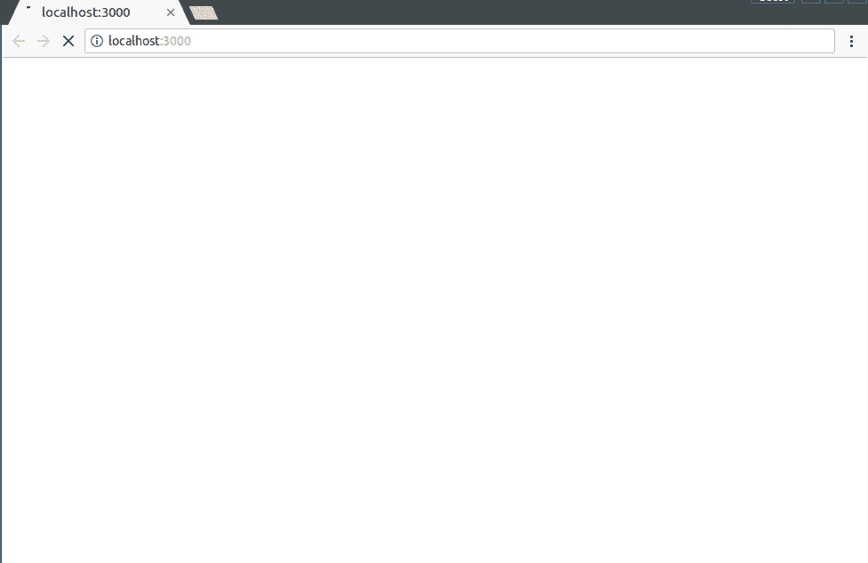
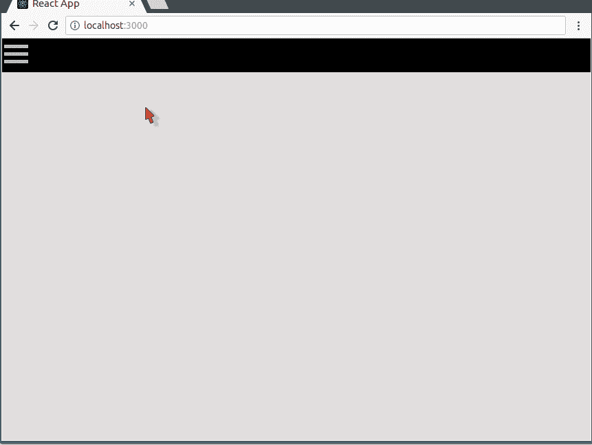
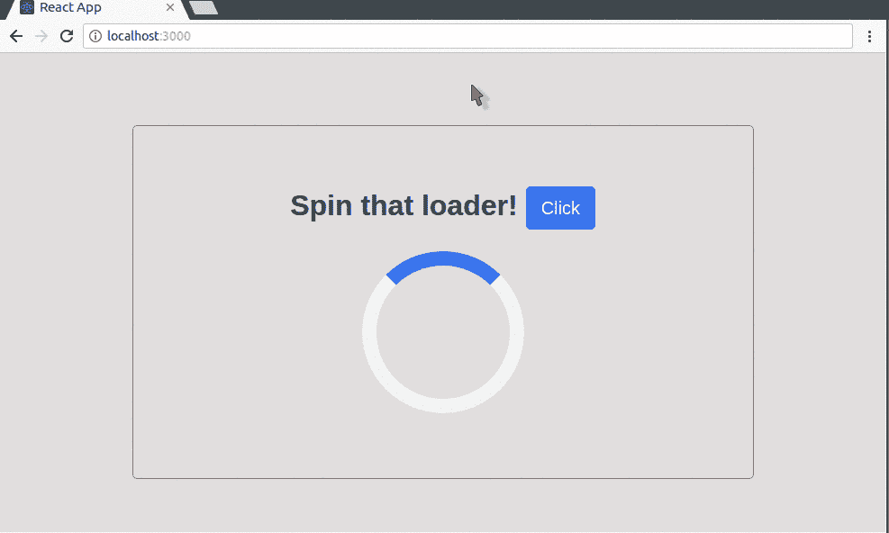
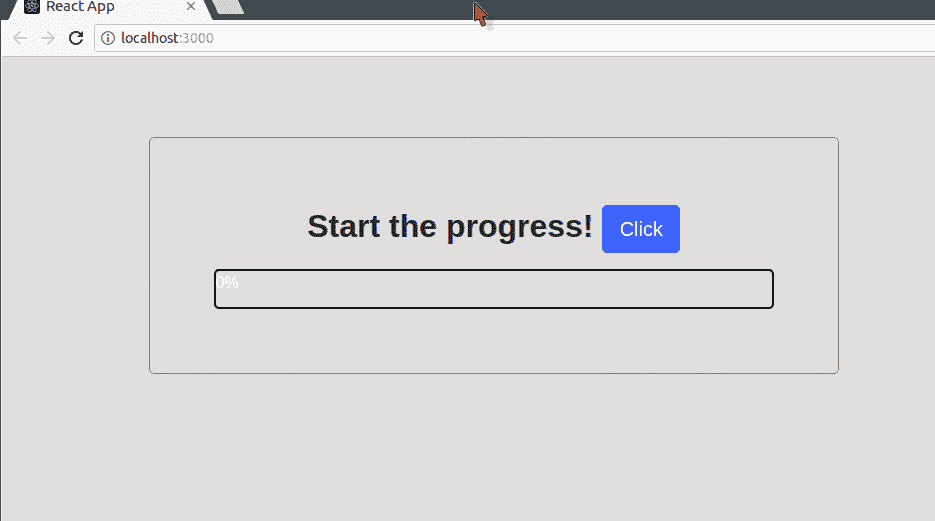
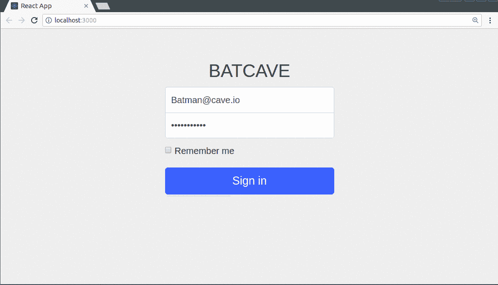

# 5 带示例的 React Motion 用例- LogRocket 博客

> 原文：<https://blog.logrocket.com/5-react-motion-use-cases-with-examples-78fc07104d58/>

React Motion 是一个库，使用物理定律可以轻松地在组件中创建逼真的动画。通过简单地指定一个导出组件的刚度和湿度值，可以探索无限可能的真实动画。

起初，这些术语对于一个刚刚了解这个库的人来说可能没有太大的意义，但是在本文的最后，我们将讨论这些术语的含义，并查看这个库适用的几个用例。

## 先决条件

为了按照本文的流程进行操作，有必要在您的计算机上安装这些工具:

1.  节点和国家预防机制
2.  创建-反应-应用(`npm install -g create-react-app`)

我们将展示使用 create-react-app 工具的所有用例。

由于本文的重点是展示如何在 react 项目中使用 react-motion 库，因此假设读者至少具备 React 的基础知识，并对 JavaScript 有一个大致的了解。

到本文结束时，我们将已经创建了几个简单的动画项目，包括这个动画大屏幕显示仪:



## 简要概述

在我们开始编写代码和探索任何用例之前，我们必须首先讨论 react-motion 库的一些基本属性，这样我们才能在很大程度上理解它。

react-motion 输出三个主要组件:`Motion`、`StaggeredMotion`和`TransitionMotion`。

在整篇文章中，我们将使用`Motion`组件，我们将看到如何将它导入到我们的开发环境中，并设计有创意的动画。我们将制作的这种动画称为弹簧动画，因为它们从一个定义的值开始，并向目标值弹起。

除了我们刚刚讨论的开始和结束值之外，在创建动画时我们还将设置另外两个值。这些值(变量)是:`stiffness`和`damping`。当开始创建这些动画时，可能看不到更改这些值会带来什么影响，但这些变量控制着每个动画的整体感觉和结构。

话虽如此，下面还是简单定义一下:

*   `stiffness`定义动画中的对象被拉向其最终值的力度
*   `damping`是物体接近目标时将受到的模拟摩擦力

调整这些值可以给整个动画带来巨大或细微的变化。

既然我们已经定义了这些术语，我们可以继续构建一些项目来展示相关的用例。

## 1.汉堡菜单

我们将整合 react-motion 的第一个项目是汉堡菜单。这个项目一点也不难构建，并且无需编写一行 JavaScript 代码就可以构建。

然而，本教程旨在演示如何在 React 中轻松地制作组件动画。

让我们首先使用 create-react-app 创建一个新项目:

```
create-react-app react-motion-hamburger-menu
```

现在，让我们导航到新创建的目录，并拉入我们需要的依赖项:

```
cd react-motion-hamburger-menu
npm install --save react-motion styled-components
```

我们安装`react-motion`是因为我们需要它来制作侧面部分的动画，当抽屉被点击时，侧面部分会摆动到屏幕上。

我们需要`styled-components`在我们的应用程序中创建样式化的组件。创建一个样式化组件的另一个好处是，我们可以在样式化时轻松地使用该组件的 props 值，这已经在动画中创造了无限的可能性，因为我们可以动态地使用 props 值来更新该组件的样式。

让我们更新`App.js`文件，我们将导入样式化的组件包并使用它来创建一个`Wrapper`组件。最后，我们将呈现尚未定义的包装组件和汉堡组件:

```
// App.js

import React, { Component } from 'react';
import styled from 'styled-components';
import Hamburger from './Hamburger';
const Wrapper = styled.div`
  width: 100vw;
  height: 100vh;
`;

class App extends Component {
  render() {
    return (
      <Wrapper>
        <Hamburger />
      </Wrapper>
    );
  }
}
export default App;
```

干得漂亮！现在让我们在`src`目录中创建一个`Hamburger.js`文件:

```
cd src
touch Hamburger.js
```

在`Hamburger.js`文件中，让我们开始布局总体结构，我们将从导入`styled-components`和`react-motion`包开始。我们还想使用样式化的组件包创建两个组件。这些组件是`Drawer`和`Links`，前者将是当我们点击汉堡图标时滑入屏幕焦点区域的抽屉部分，而后者将保存抽屉上的链接:

```
//Hamburger.js

import React, { Component } from 'react';
import styled from 'styled-components';
import { Motion, spring } from 'react-motion';
import './App.css';

const Drawer = styled.div`
  position: absolute;
  height: 90%;
  background: black;
  width: 40vh;
  left: ${props => props.left}vh;
`;

const Link = styled.div`
  cursor: pointer;
  padding: 1em 1em 1em 3em;
  color: white;
  font-weight: bold;
`;
// ...
```

您可能已经注意到，我们在为`Drawer`组件编写样式时编写了`${(props) => props.left}vh`，我们这样做是为了让`left`属性的值可以是动态的，并且随着它在组件中的更新而更新。

现在我们可以进一步定义和导出`Hamburger`组件。在`Hamburger`组件中，我们想要注册一个构造函数并调用`super()`函数。我们还注册了一个状态`toggleState`，我们将使用它随时跟踪汉堡菜单的状态。我们还将包括一个方法来处理汉堡包图标上的点击。

```
// ...
class Hamburger extends Component {
  constructor(props) {
    super(props);
    this.state = {
      toggleState: 0
    };
    this.handleClick = this.handleClick.bind(this);
  }

  handleClick() {
    this.refs.container.classList.toggle('change');
    this.setState({
      toggleState: this.state.toggleState ? 0 : 1
    });
  }
}
// ...
```

现在在`render`函数中，我们将编写一些 JSX 代码来定义 DOM 上应用程序的结构。对于最好的部分，我们将从 react-motion 注册一个`Motion`组件。`Motion`组件采用了[渲染道具](https://reactjs.org/docs/render-props.html)模式，所以它接受一些道具和一个函数作为它的孩子，我们将`Drawer`组件传递给那个函数:

```
// ...
class Hamburger extends Component {
  constructor(props) {
    super(props);
    this.state = {
      toggleState: 0
    };
    this.handleClick = this.handleClick.bind(this);
  }

  handleClick() {
    this.refs.container.classList.toggle('change');
    this.setState({
      toggleState: this.state.toggleState ? 0 : 1
    });
  }

  render() {
    return (
      <div id="parent">
        <div id="nav-bar">
          <div className="container" ref="container" onClick={this.handleClick}>
            <div className="bar1" />
            <div className="bar2" />
            <div className="bar3" />
          </div>
        </div>

        <Motion
          defaultStyle={{ left: -40 }}
          style={{
            left: spring(this.state.toggleState ? 0 : -40, {
              stiffness: 210,
              damping: 10
            })
          }}
        >
          {style => (
            <Drawer left={style.left}>
              <Link>Home</Link>
              <Link>Contact</Link>
              <Link>Exit</Link>
            </Drawer>
          )}
        </Motion>
      </div>
    );
  }
}
export default Hamburger;
```

从上面的代码可以看出，在`Motion`组件中，我们将可选的`defaultStyle`设置为`left: -40`，然后将`style`设置为这个长表达式:

```
left: spring(this.state.toggleState ? 0 : -40, {
  stiffness: 210,
  damping: 10
})
```

这两个表达的意思是:

1.  默认情况下，将该组件的`left`属性(在样式化组件中自动更新)设置为-40vh。
2.  如果设置了`toggleState`变量，则在应用 210 的`stiffness`和 10 的`damping`时，将组件从其当前`left`值(-40vh)动画化为 0vh 之一。然而，当它没有设置时，让它继续等于-40(因此没有动画)

我们现在可以运行这个应用程序来看看我们构建了什么，但是我们可能会被它的可怕程度吓一跳！让我们给`App.css`文件添加一些 CSS，让它看起来更漂亮:

```
#parent {
  background-color: rgb(225, 223, 223);
  height: 100vh;
}
.container {
  display: inline-block;
  cursor: pointer;
}
.bar1,
.bar2,
.bar3 {
  width: 35px;
  height: 5px;
  background-color: rgb(187, 187, 187);
  margin: 6px 0;
  transition: 0.4s;
}

.change .bar1 {
  -webkit-transform: rotate(-45deg) translate(-9px, 6px);
  transform: rotate(-45deg) translate(-9px, 6px);
}

.change .bar2 {
  opacity: 0;
}

.change .bar3 {
  -webkit-transform: rotate(45deg) translate(-8px, -8px);
  transform: rotate(45deg) translate(-8px, -8px);
}

#nav-bar {
  background: black;
  padding: 0.2em;
}
```

太棒了。我们现在可以通过在项目的根目录中键入以下命令来运行应用程序:

```
npm start
```

我们将浏览器指向`[http://localhost:3000](http://localhost:3000)`,得到这个屏幕:



这个项目的源代码可以在 GitHub 上找到。

## 2.预加载器

在这一节中，我们将模拟一个预加载器在其他动作正在运行并且需要时间在用户得到输出之前完成时的旋转。然而，这只是一个模拟，所以我们不会将微调器与任何更大的应用程序或流程联系起来。我们开始。

我们可以用这个命令创建一个新的应用程序:

```
create-react-app react-motion-preloader
```

让我们导航到工作目录，使用以下命令安装依赖项:

```
cd react-motion-preloader
npm install --save react-motion styled-components bootstrap
```

我们将在我们所有的项目中使用样式组件，因为它使一切变得更容易。

现在我们想要更新`App.js`文件，我们将导入样式化的组件包并使用它来创建一个`Wrapper`组件。最后，我们将呈现包装组件和一个尚未定义的`Preloader`组件:

```
//App.js

import React, { Component } from 'react';
import styled from 'styled-components';
import Preloader from './Preloader';
const Wrapper = styled.div`
  width: 100vw;
  height: 100vh;
`;

class App extends Component {
  render() {
    return (
      <Wrapper>
        <Preloader />
      </Wrapper>
    );
  }
}
export default App;
```

我们还需要为我们的应用程序提供一些关于如何引用我们刚刚引入的引导包的信息，所以我们打开`index.js`文件，并将这一行包含到导入列表:`import '../node_modules/bootstrap/dist/css/bootstrap.min.css'`中，看起来像这样:

```
//Index.js

import React from 'react';
import ReactDOM from 'react-dom';
import './index.css';
import App from './App';
import '../node_modules/bootstrap/dist/css/bootstrap.min.css';
import registerServiceWorker from './registerServiceWorker';

ReactDOM.render(<App />, document.getElementById('root'));
registerServiceWorker();
```

我们将在 src 目录中创建`Preloader.js`文件:

```
cd src
touch Preloader.js
```

在`Preloader.js`文件中，让我们开始布局总体结构，我们将从导入样式组件和反应动作包开始。我们还想使用样式化组件创建一个组件— `Loader`。

* * *

### 更多来自 LogRocket 的精彩文章:

* * *

该组件将是实际的装载机/旋转器:

```
//Preloader.js

import React, { Component } from 'react';
import styled from 'styled-components';
import { Motion, spring } from 'react-motion';
import './App.css';

const Loader = styled.div`
  border: 16px solid #f3f3f3;
  border-radius: 50%;
  border-top: 16px solid #3498db;
  margin: 0 auto;
  width: 180px;
  height: 180px;
  transform: rotate(${props => props.transform}deg);
}
`;
// ...
```

在为`Loader`组件编写样式时，我们编写了`(${props => props.transform}deg)`,这样做是为了让`transform`属性的值可以在组件本身更新时动态更新。

现在我们可以进一步定义和导出`Preloader`组件。在`Preloader`组件中，我们想要注册一个构造函数并调用`super()`函数。我们还登记了两个状态变量:

1.  `startLoader`
2.  `numberOfSpins`

应用程序将使用`startLoader`来决定何时启动加载器，而`numberOfSpins`决定旋转器旋转多少整圈，对于这个项目，我们将通过将 360 乘以 5 来将其设置为 5。最后，我们将包含一个简单的函数，将`startLoader`的值从 0 切换到 1，以指示它应该在单击按钮时启动微调器:

```
//Preloader.js

// ...
class Preloader extends Component {
  constructor(props) {
    super(props);
    this.state = {
      startLoader: 0,
      numberOfSpins: 360 * 5
    };
    this.handleClick = this.handleClick.bind(this);
  }
  handleClick(e) {
    this.setState({
      startLoader: 1
    });
  }
}
// ...
```

现在在`render`函数中，我们将编写一些 JSX 代码来定义 DOM 上应用程序的结构。我们将从 react-motion 注册一个`Motion`组件。`Motion`接受一些道具和一个函数作为它的孩子，我们将`Loader`组件传递给那个函数:

```
//Preloader.js
// ...
class Preloader extends Component {
  constructor(props) {
    super(props);
    this.state = {
      startLoader: 0,
      numberOfSpins: 360 * 5
    };
    this.handleClick = this.handleClick.bind(this);
  }

  handleClick(e) {
    this.setState({
      startLoader: 1
    });
  }

  render() {
    return (
      <div id="parent">
        <div className="container">
          <div id="preloader-holder">
            <p id="preloader-text">
              {' '}
              Spin that loader! <button
                onClick={this.handleClick}
                className="btn btn-lg btn-primary"
              >
                Click
              </button>
            </p>
            <div id="preloader-wrapper">
              <Motion
                defaultStyle={{ transform: 0 }}
                style={{
                  transform: spring(
                    this.state.startLoader ? this.state.numberOfSpins : 0,
                    { stiffness: 10, damping: 10 }
                  )
                }}
              >
                {style => <Loader transform={style.transform} />}
              </Motion>
            </div>
          </div>
        </div>
      </div>
    );
  }
}
export default Preloader;
```

这个应用程序的神奇之处在于我们将一个最优的`defaultStyle`设置为`transform: 0`，然后将`style`设置为:

```
transform: spring(
  this.state.startLoader ? this.state.numberOfSpins : 0,
  { stiffness: 10, damping: 10 }
)
```

最基本的意思是:

1.  将`transform`属性(绑定到`Loader`组件)的默认属性设置为 0
2.  无论何时设置`startLoader`状态变量，对设置的旋转次数执行`transform`

在运行这个应用程序之前，我们需要在`App.css`文件中包含一些样式:

```
// App.css
#parent {
  padding-top: 5em;
  padding-bottom: 40px;
  background-color: rgb(225, 223, 223);
  height: 100vh;
}

#preloader-holder {
  border: 1px solid grey;
  border-radius: 5px;
  padding: 4em;
  text-align: center;
}

#preloader-text {
  font-size: 2em;
  font-weight: bold;
}

#preloader-wrapper {
  padding: 0.5em;
}
```

我们现在可以通过在项目的根目录中键入以下命令来运行应用程序:

```
npm start
```

我们将浏览器指向`[http://localhost:3000](http://localhost:3000)`,得到这个屏幕:



> **注意:**微调器以这种方式旋转，因为我们已经将`stiffness`和`damping`设置为 10，您可以通过理解前面讨论的`stiffness`和`damping`属性的行为并充分更新它们来根据您的喜好调整动画。

这个项目的源代码可以在 GitHub 上找到。

## 3.进度条

几乎没有一个用过移动智能手机或电脑的人会说他/她以前没见过进度条。进度条非常重要，因为它们可以通过显示整个进度条的当前长度，向用户传达进程的状态。

让我们使用 react-motion 构建自己的简单进度条:

```
create-react-app react-motion-progress-bar
```

让我们导航到工作目录，使用以下命令安装依赖项:

```
cd react-motion-progress-bar
npm install --save react-motion styled-components bootstrap
```

现在我们想要更新`App.js`文件，我们将导入样式化的组件包并使用它来创建一个`Wrapper`组件。最后，我们将呈现包装组件和一个尚未定义的`Progress`组件:

```
//App.js
import React, { Component } from 'react';
import styled from 'styled-components';
import Progress from './Progress';

const Wrapper = styled.div`
  width: 100vw;
  height: 100vh;
`;

class App extends Component {
  render() {
    return (
      <Wrapper>
        <Progress />
      </Wrapper>
    );
  }
}

export default App;
```

我们还需要为我们的应用程序提供一些关于如何引用我们刚刚引入的引导包的信息，因此我们打开`index.js`文件并将这一行包含到导入列表中，如下所示:

```
//index.js
import React from 'react';
import ReactDOM from 'react-dom';
import './index.css';
import App from './App';
import '../node_modules/bootstrap/dist/css/bootstrap.min.css';
import registerServiceWorker from './registerServiceWorker';

ReactDOM.render(<App />, document.getElementById('root'));
registerServiceWorker();
```

我们将进一步在 src 目录中创建 Progress.js 文件:

```
cd src
touch Progress.js
```

在`Progress.js`文件中，我们将从导入样式组件和反应动作包开始。我们还想使用样式化的组件包创建一个组件— `ProgressBar`。

这个组件将是实际的`ProgressBar`，我们将根据一个`startProgress`状态变量的状态来启动进度条。我们还将`Motion`组件的`stiffness`和`damping`设置为 10:

```
//Progress.js
import React, { Component } from 'react';
import styled from 'styled-components';
import { Motion, spring } from 'react-motion';
import './App.css';

const ProgressBar = styled.div`
  background: green;
  width: 100%;
  height: 100%;
  margin: 0;
  width: ${props => props.width}%;
`;

class Progress extends Component {
  constructor(props) {
    super(props);
    this.state = {
      startProgress: 0
    };
    this.handleClick = this.handleClick.bind(this);
  }

  handleClick(e) {
    this.setState({
      startProgress: 1
    });
  }

  truncate(x) {
    return Math.trunc(x);
  }

  render() {
    return (
      <div id="parent">
        <div className="container">
          <div id="progress-holder">
            <p id="progress-text">
              {' '}
              Start the progress! <button
                onClick={this.handleClick}
                className="btn btn-lg btn-primary"
              >
                Click
              </button>
            </p>
            <div id="progress-bar-wrapper">
              <Motion
                defaultStyle={{ width: 0 }}
                style={{
                  width: spring(this.state.startProgress ? 100 : 0, {
                    stiffness: 10,
                    damping: 10
                  })
                }}
              >
                {style => (
                  <ProgressBar width={style.width}>
                    {' '}
                    {this.truncate(style.width)}%
                  </ProgressBar>
                )}
              </Motion>
            </div>
          </div>
        </div>
      </div>
    );
  }
}
export default Progress;
```

我们在这里使用了`Math.trunc`函数，通过移除小数位数，将`spring` ed 宽度返回为整数。

在运行这个应用程序之前，让我们将这些样式添加到`App.css`文件中:

```
// App.css
    #parent {
      padding-top: 5em;
      padding-bottom: 40px;
      background-color: rgb(225, 223, 223);
      height: 100vh;
    }

    #progress-holder{
    border: 1px solid grey;
    border-radius: 5px;
    padding: 4em;
    text-align: center;
    }

    #progress-text{
      font-size: 2em;
      font-weight: bold;
    }

    #progress-bar-wrapper{
    border: 2px solid black;
    border-radius: 5px;
    height: 40px;
    color:white;
    }
```

我们现在可以通过在项目的根目录中键入以下命令来运行应用程序:

```
npm start
```

我们将浏览器指向`[http://localhost:3000](http://localhost:3000)`,得到这个屏幕:



这个项目的源代码可以在 GitHub 上找到。

## 4.动画通知

有什么比收到用户和应用程序最后一次交互的通知更好的呢？你猜对了！得到实时的滑动动画通知。我们将构建一个小的登录系统，接收用户名和密码，然后当用户点击`Sign in`按钮时，通知用户他的验证状态。

```
create-react-app react-motion-login-notification
```

让我们导航到工作目录，使用以下命令安装依赖项:

```
cd react-motion-login-notification
npm install --save react-motion styled-components bootstrap
```

现在我们想要更新`App.js`文件，我们将导入样式化的组件包并使用它来创建一个`Wrapper`组件。最后，我们将呈现包装组件和一个尚未定义的`Form`组件:

```
//App.js
import React, { Component } from 'react';
import styled from 'styled-components';
import Form from './Form';

const Wrapper = styled.div`
  width: 100vw;
  height: 100vh;
`;

class App extends Component {
  render() {
    return (
      <Wrapper>
        <Form />
      </Wrapper>
    );
  }
}
export default App;
```

我们还需要为我们的应用程序提供一些关于如何引用我们刚刚引入的引导包的信息，所以我们打开`index.js`文件，并将这一行包含到导入列表:`import '../node_modules/bootstrap/dist/css/bootstrap.min.css'`中，看起来像这样:

```
//index.js
import React from 'react';
import ReactDOM from 'react-dom';
import './index.css';
import App from './App';
import '../node_modules/bootstrap/dist/css/bootstrap.min.css';
import registerServiceWorker from './registerServiceWorker';

ReactDOM.render(<App />, document.getElementById('root'));
registerServiceWorker();
```

现在让我们在 src 目录中创建一个 Form.js 文件:

```
cd src
touch Form.js
```

在`Form.js`文件中，我们将从导入样式组件和反应动作包开始。我们将使用样式化的组件定义一个单独的组件，这个组件将被称为`NotificationBox`。我们将注册一个州——`startAnimation`——它将决定动画何时开始，我们将注册两个函数:

1.  `handleClick`:该函数将处理**注册**按钮上的点击事件，并调用另一个函数，从而将`startAnimation`的状态重置为 1
2.  `resetValue`:该功能将重置`startAnimation`变量的状态。

```
//Form.js
    import React, { Component } from 'react';
    import styled from 'styled-components';
    import { Motion, spring } from 'react-motion';
    import './App.css';

    const NotificationBox = styled.div`
        position: absolute;
        padding: 1.5em;
        left: 5%;
        top: ${(props) => props.top}%;
        opacity: ${(props) => props.opacity};
        font-size: 0.8em;
        font-weight: bold;
        border-radius: 5px;
        background: #81C784;
        color: white;
    `;
    class Form extends Component {

      constructor(props) {
        super(props);
        this.state = {
          startAnimation: 1
        };
        this.handleClick = this.handleClick.bind(this);
        this.resetValue = this.resetValue.bind(this);
      }

      handleClick (e){
        e.preventDefault();
        this.setState({
          startAnimation: 0
        })
        setTimeout(this.resetValue, 2500);
      }

      resetValue (){
        this.setState({
          startAnimation: 1
        })
      }
```

在`render`函数中，我们编写一些定义表单结构的 JSX 代码，然后注册一个`Motion`组件来激活`NotificationBox`组件:

```
//Form.js
    ...

    class Form extends Component {

      constructor(props) {
        super(props);
        this.state = {
          startAnimation: 1
        };
        this.handleClick = this.handleClick.bind(this);
        this.resetValue = this.resetValue.bind(this);
      }

      handleClick (e){
        e.preventDefault();
        this.setState({
          startAnimation: 0
        })
        setTimeout(this.resetValue, 2500);
      }

      resetValue (){
        this.setState({
          startAnimation: 1
        })
      }

        render() {
      return(
    <div id="parent">
    <div className="container">
      <form onSubmit={this.handleClick} className="form-signin">
        <h2 className="form-signin-heading">BATCAVE</h2>
        <label className="sr-only">Email address</label>
        <input type="email" id="inputEmail" className="form-control" placeholder="Email address" required=""  />
        <label  className="sr-only">Password</label>
        <input type="password" id="inputPassword" className="form-control" placeholder="Password" required="" />
        <div className="checkbox">
          <label>
            <input type="checkbox" value="remember-me" /> Remember me
          </label>
        </div>
        <button className="btn btn-lg btn-primary btn-block" type="submit">Sign in</button>
      </form>

      <Motion
        defaultStyle={{ top: 0, opacity: 0 }}
        style={{ top: spring(this.state.startAnimation ? 80 : 1), opacity: spring(this.state.startAnimation ? 0 : 1) }}
       >
      {(style) => (
        <NotificationBox
        top={style.top}
        opacity={style.opacity}
         >
           Welcome Batman
      </NotificationBox>
      )}
      </Motion>

    </div>
    </div>
            )
        }
    }
    export default Form;
```

和以前一样，我们将组件的 top 和 opacity 属性和它的样式绑定在一起，这样当单击 submit 按钮时，我们可以得到很好的动画效果。让我们将样式添加到`App.css`文件中:

```
//App.css
#parent {
  padding-top: 40px;
  padding-bottom: 40px;
  background-color: #eee;
  height: 100vh;
}

.form-signin {
  max-width: 330px;
  padding: 15px;
  margin: 0 auto;
}

.form-signin .form-signin-heading,
.form-signin .checkbox {
  margin-bottom: 10px;
}

.form-signin-heading {
  text-align: center;
}

.form-signin .checkbox {
  font-weight: 400;
}

.form-signin .form-control {
  position: relative;
  box-sizing: border-box;
  height: auto;
  padding: 10px;
  font-size: 16px;
}

.form-signin .form-control:focus {
  z-index: 2;
}

.form-signin input[type='email'] {
  margin-bottom: -1px;
  border-bottom-right-radius: 0;
  border-bottom-left-radius: 0;
}

.form-signin input[type='password'] {
  margin-bottom: 10px;
  border-top-left-radius: 0;
  border-top-right-radius: 0;
}
```

我们现在可以通过在项目的根目录中键入以下命令来运行应用程序:

```
npm start
```

我们将浏览器指向`[http://localhost:3000](http://localhost:3000)`,得到这个屏幕:



这个项目的源代码可以在 GitHub 上找到。

## 5.动画大屏幕显示仪

到目前为止，我们已经看了一些基本的例子，但现在我们将看一些更复杂的东西，我们将创建一个动画“超大屏幕显示仪”简单来说，这是一个在初始加载时显示黑屏的应用程序，然后使用 react-motion 逐渐显示大屏幕。让我们开始吧。

我们将创建一个新项目:

```
create-react-app react-motion-jumbotron-revealer
```

我们可以导航到此目录并安装依赖项:

```
cd react-motion-jumbotron-revealer
npm install --save react-motion styled-components
```

让我们快速编辑一下`App.js`文件，我们想要导入`styled-components`和`ImageBoxAnimation`(这是我们很快就会创建的一个组件):

```
import React, { Component } from 'react';
import styled from 'styled-components';
import ImageBoxAnimation from './ImageBoxAnimated';

const Wrapper = styled.div``;

class App extends Component {
  render() {
    return (
      <Wrapper>
        <ImageBoxAnimation />
      </Wrapper>
    );
  }
}
export default App;
```

我们需要为两个组件创建两个单独的文件，因此让我们导航到 src 目录并创建它们:

```
cd src
touch ImageBoxAnimated.js
touch BlackBoxAnimated.js
```

厉害！现在让我们在我们最喜欢的编辑器中打开`ImageBoxAnimated.js`文件并开始编写一些代码，我们要做的第一件事是导入依赖项和`BlackBoxAnimated`组件(尽管文件当前是空的),然后使用样式化的组件创建一个新组件。`ImageBox`组件基本上是一个`div`，它从互联网上加载一张图片作为背景图片:

```
// ImageBox component

import React from 'react';
import styled from 'styled-components';
import BlackBoxAnimated from './BlackBoxAnimated';

const ImageBox = styled.div`
  width: 100vw;
  height: 100vh;
  background: url('http://4khdwallpapers.net/wp-content/uploads/2018/01/wonder-woman-hd-wallpaper.jpg');
  background-size: cover;
  background-position: center;
`;
// ...
```

接下来我们要做的是创建`ImageBoxAnimation`组件并设置一个状态变量— `animationNumber<>/code> — we need this state variable to decide when the black boxes that will initially cover the jumbotron will start to slide away.`

我们还将定义一个函数——`startNextAnimation`——用于增加决定哪个盒子滑动的`animationNumber`。

我们将使用`setTimeout()`函数来调用增加`animationNumber`的`startNextAnimation`函数。每当超时运行时，一个新的黑盒就会滑过大屏幕的图像(到这个项目完成时，大约会有 10 个黑盒)。

在 render 函数中，我们首先将对象`{ animationNumber }`初始化为应用程序的当前状态，这样我们就可以在 render 函数中直接引用它，而不必调用`this`。

接下来，我们将注册 10 个`BlackBoxAnimated`组件的实例，并向每个实例传递三个道具，这些道具是:

*   `heightPercentage`:这个道具负责设置每个黑匣子相对于大屏幕总高度的高度。我们将它设置为 10 %,这样我们就有正好 10 个盒子的空间
*   这个道具需要一个布尔值来决定盒子应该向哪个方向滑动，因为如果所有的盒子都向一个方向滑动，那么视觉上会很无聊。我们将在真实和虚假之间交替，给它一种曲折的感觉。
*   这个道具非常重要，因为它负责动画的层叠行为。它通过将黑盒的值与一个数字进行比较并向`BlackBoxAnimated`组件返回一个布尔值，来确保黑盒一次只留下一个(因为`setTimeout`函数在调用`setNextAnimation`函数之前会给出半秒的间隔，后者负责将`animationNumber`的值增加 1)。A `false`不做任何事情，而 a `true`开始动画。

最后，我们将导出应用程序:

```
//ImageBoxAnimated.js
// ...
class ImageBoxAnimation extends React.Component {
  componentWillMount() {
    this.setState({
      animationNumber: 1
    });

    setTimeout(this.startNextAnimation, 500);
    setTimeout(this.startNextAnimation, 1000);
    setTimeout(this.startNextAnimation, 1500);
    setTimeout(this.startNextAnimation, 2000);
    setTimeout(this.startNextAnimation, 2500);
    setTimeout(this.startNextAnimation, 3000);
    setTimeout(this.startNextAnimation, 3500);
    setTimeout(this.startNextAnimation, 4000);
    setTimeout(this.startNextAnimation, 4500);
  }

  startNextAnimation = () => {
    this.setState({
      animationNumber: this.state.animationNumber + 1
    });
  };
  render() {
    const { animationNumber } = this.state;

    return (
      <ImageBox>
        <BlackBoxAnimated
          heightPercentage={10}
          reverseDirection={false}
          startAnimation={animationNumber >= 1}
        />

        <BlackBoxAnimated
          heightPercentage={10}
          reverseDirection={true}
          startAnimation={animationNumber >= 2}
        />

        <BlackBoxAnimated
          heightPercentage={10}
          reverseDirection={false}
          startAnimation={animationNumber >= 3}
        />

        <BlackBoxAnimated
          heightPercentage={10}
          reverseDirection={true}
          startAnimation={animationNumber >= 4}
        />

        <BlackBoxAnimated
          heightPercentage={10}
          reverseDirection={false}
          startAnimation={animationNumber >= 5}
        />

        <BlackBoxAnimated
          heightPercentage={10}
          reverseDirection={true}
          startAnimation={animationNumber >= 6}
        />

        <BlackBoxAnimated
          heightPercentage={10}
          reverseDirection={false}
          startAnimation={animationNumber >= 7}
        />

        <BlackBoxAnimated
          heightPercentage={10}
          reverseDirection={true}
          startAnimation={animationNumber >= 8}
        />

        <BlackBoxAnimated
          heightPercentage={10}
          reverseDirection={false}
          startAnimation={animationNumber >= 9}
        />

        <BlackBoxAnimated
          heightPercentage={10}
          reverseDirection={true}
          startAnimation={animationNumber >= 10}
        />
      </ImageBox>
    );
  }
}

export default ImageBoxAnimation;
```

现在已经完成了，让我们打开我们不久前创建的`BlackBoxAnimated.js`文件，为由`ImageBox`传递的数据做准备。我们将从导入我们需要的依赖项开始，但是这一次我们也将导入`PropTypes from 'prop-types'`，这将帮助我们确认我们的道具在被接收时是我们想要的样子。我们还将使用样式化组件定义一个`Blackbox`组件，并用一些样式填充它:

```
//BlackBoxAnimated.js

import React, { Component } from 'react';
import styled from 'styled-components';
import PropTypes from 'prop-types';
import { Motion, spring } from 'react-motion';

const BlackBox = styled.div`
  height: ${props => props.heightPercentage}%;
  width: 100%;
  background: #000;
  transform-origin: ${props => props.xDirection} center;
`;
// ...
```

我们使用`${(props) => props.heightPercentage}%`和`${(props) => props.xDirection} center`,因为我们想将组件中的这些属性与样式属性绑定在一起。

接下来，我们将创建`BlackBoxAnimated`组件(您可以在 React 中将组件定义为函数)并定义它应该预期的道具。我们将注册`Motion`组件，只有当`startAnimation`的值为真时，才会触发动画。

最后，我们将检查我们在组件中收到的道具是否是我们期望的类型:

```
//BlackBoxAnimated.js
import React, { Component } from 'react';
import styled from 'styled-components';
import PropTypes from 'prop-types';
import { Motion, spring } from 'react-motion';

const BlackBox = styled.div`
  height: ${props => props.heightPercentage}%;
  width: 100%;
  background: #000;
  transform-origin: ${props => props.xDirection} center;
`;

const BlackBoxAnimated = ({
  startAnimation = false,
  heightPercentage,
  reverseDirection = false
}) => (
  <Motion
    defaultStyle={{ scaleX: 1 }}
    style={{ scaleX: spring(startAnimation ? 0 : 1) }}
  >
    {style => (
      <BlackBox
        heightPercentage={heightPercentage}
        xDirection={reverseDirection ? `left` : `right`}
        style={{
          transform: `scaleX(${style.scaleX})`
        }}
      />
    )}
  </Motion>
);

BlackBoxAnimated.propTypes = {
  startAnimation: PropTypes.bool,
  heightPercentage: PropTypes.number.isRequired,
  reverseDirection: PropTypes.bool
};
```

很好，我们现在可以通过在项目的根目录中键入以下命令来运行应用程序了:

```
npm start
```

我们将浏览器指向`[http://localhost:3000](http://localhost:3000)`,得到这个屏幕:


这个项目的源代码可以在 GitHub 上找到。

## 结论

在本文中，我们看到了如何使用 React Motion 来调整带有 React 组件的动画。我们也逐渐理解了在使用库时可用的`stiffness`和`damping`变量背后的思想。

虽然我们在本教程中看到的例子主要涵盖了库的基本方面，但对于任何希望用组件构建非常复杂和好看的 web 动画的人来说，这是一个良好的开端。

## [LogRocket](https://lp.logrocket.com/blg/react-signup-general) :全面了解您的生产 React 应用

调试 React 应用程序可能很困难，尤其是当用户遇到难以重现的问题时。如果您对监视和跟踪 Redux 状态、自动显示 JavaScript 错误以及跟踪缓慢的网络请求和组件加载时间感兴趣，

[try LogRocket](https://lp.logrocket.com/blg/react-signup-general)

.

[ ](https://lp.logrocket.com/blg/react-signup-general) [](https://lp.logrocket.com/blg/react-signup-general) 

LogRocket 结合了会话回放、产品分析和错误跟踪，使软件团队能够创建理想的 web 和移动产品体验。这对你来说意味着什么？

LogRocket 不是猜测错误发生的原因，也不是要求用户提供截图和日志转储，而是让您回放问题，就像它们发生在您自己的浏览器中一样，以快速了解哪里出错了。

不再有嘈杂的警报。智能错误跟踪允许您对问题进行分类，然后从中学习。获得有影响的用户问题的通知，而不是误报。警报越少，有用的信号越多。

LogRocket Redux 中间件包为您的用户会话增加了一层额外的可见性。LogRocket 记录 Redux 存储中的所有操作和状态。

现代化您调试 React 应用的方式— [开始免费监控](https://lp.logrocket.com/blg/react-signup-general)。