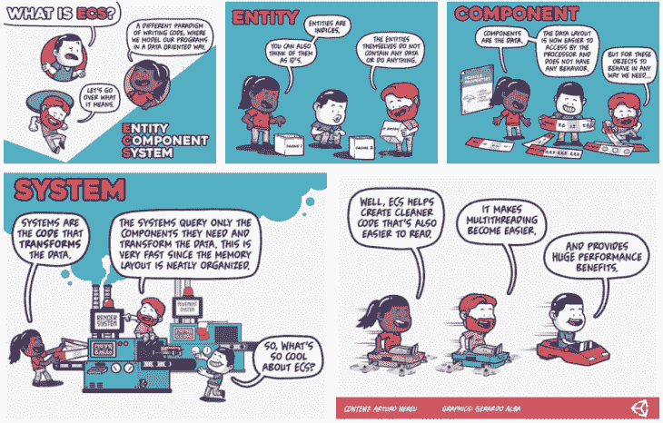
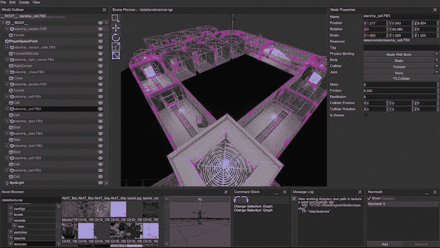

# 为你的下一个项目考虑 5 个 Rust 游戏引擎

> 原文：<https://blog.logrocket.com/5-rust-game-engines-consider-next-project/>

越来越多的开发者选择 Rust 而不是 C++作为他们游戏开发的首选语言。有许多游戏引擎可以用于 Rust 中的项目。让我们来看看五个流行的 Rust 游戏引擎，并讨论如何选择最适合您需求的选项。

在本文中:

## 为什么要用 Rust 做游戏开发？

在 Rust 发布之前，C++是游戏开发的首选语言。像 C 和汇编这样的语言在过去几年里也提供了可靠的性能和速度。

许多开发者仍然使用这些语言进行游戏开发。然而, [Rust 社区](https://www.rust-lang.org/community)是强大的，活跃的，并且正在成长，特别是在游戏开发领域。

根据 Stack Overflow 2021 年的调查，Rust 在过去的六年里一直是最受欢迎的语言。其不断增长的[生产用户名单](https://www.rust-lang.org/production/users)包括科技巨头，如 Atlassian、Mozilla 等。

Rust 在大公司和开发者中如此受欢迎有很多原因。例如:

*   Rust 非常快，因为它不使用垃圾收集器
*   Rust 的构建系统 Cargo ，帮助管理你的库，保持版本锁定，等等
*   Rust 支持函数式和命令式范例

通常情况下，Rust 至少和 C/C++一样快，而且由于该语言即将进行的性能更新，它在未来可能会变得更快。

Rust 也因为它的并发性而拥有很大的游戏开发能力。Rust 中的并发性可防止数据竞争，并提供出色的内存管理，使您的应用程序不会崩溃。

对我来说，Rust 是一种设计良好且非常干净的语言。虽然有些人认为 Rust 有一个陡峭的学习曲线，但是[广泛的文档](https://www.rust-lang.org/learn)和扩展的[机箱注册表](https://crates.io)肯定可以帮助你快速学习最佳实践。

## 5 款流行的 Rust 游戏引擎

让我们来看看一些 Rust 游戏引擎，你可能会考虑用在游戏开发领域的项目中。

### 紫色

[Amethyst](https://amethyst.rs/) 是用 Rust 编写的数据驱动、面向数据的游戏引擎。这种免费的开源软件越来越受欢迎，因为它快速且易于使用。

紫水晶的核心原则包括:

*   大规模并行架构
*   遵循[实体组件系统(ECS)](https://en.wikipedia.org/wiki/Entity_component_system) 范式来组织游戏逻辑
*   使用 Rusty Object Notation (RON ),它很简单，支持所有数据类型

ECS 使得 Amethyst 完全是线程安全的，避免了任何形式的内存锁定。在下面的 [ECS 信息图](https://github.com/ArturoNereu/ECS_101)中了解更多信息:



此外，ECS 加强了代码模块化。因此，您可以共享数据结构或逻辑等组件，而不必重写它们。

紫水晶主要用于开发 2D 和 3D 游戏。开始使用 Rust 进行游戏开发的人发现 Amethyst 对初学者来说是友好的，这要感谢可以帮助开发人员使用引擎的精确文档。

要安装 Amethyst 引擎，请将以下代码添加到您的`Cargo.toml`文件中:

```
amethyst = "0.15.3"

```

在撰写本文时，Amethyst 与 Bevy 引擎合作，这意味着 [Bevy 本质上是 Amethyst 2.0](https://community.amethyst.rs/t/bevy-engine-addressing-the-elephant-in-the-room/1645) 。开发者应该知道紫水晶创造者计划最终[存档紫水晶/紫水晶回购](https://amethyst.rs/posts/amethyst--starting-fresh)。

Amethyst 和 Bevy 项目旨在合作，而不是竞争。有计划在未来将这些项目的不同领域整合到一个游戏引擎中。在下一节中了解更多关于 Bevy 的信息。

### 一群

Bevy 是另一个简单的数据驱动游戏引擎。虽然它仍处于发展的早期阶段，可能会经历重大的变化，但这并不妨碍它的重要功能闪闪发光。

要使用 Bevy 引擎，请将下面一行添加到您的`Cargo.toml`中:

```
bevy = "0.7.0"

```

像 Amethyst 一样，Bevy 使用 ECS，应用模块化架构，因此组件可以重用甚至替换。对于游戏开发的新手来说，它很容易上手。

然而，开发人员被警告不要在严肃的项目中使用 Bevy，因为 API 仍在开发中，预计会有重大变化。

您可以使用 Bevy 进行 2D 和 3D 渲染，也可以使用图形数据结构构建自定义渲染流。另一个很棒的特性是 Bevy UI，它可以帮助你用代码或者使用场景格式动态地编写 UI。

我最喜欢的 Bevy 特性是`[hot_asset_reloading](https://bevy-cheatbook.github.io/assets/hot-reload.html)`，它允许你修改和重新加载资源，而不需要编译你的修改。如果您在运行时添加一个资产，这个特性将捕获它并重新加载它以供使用，这对于提高生产率是非常好的。

要启用此功能，只需添加这一行:

```
$ asset_server.watch_for_changes().unwrap();

```

如果你认为这是你需要的游戏引擎，确保你按照这个[完整教程](https://bevyengine.org/learn/book/introduction)来获得更好的理解。正如我前面说过的，撰写本文时，Bevy 仍处于开发阶段，它的 API 预计会发生变化。

### 菲洛克斯

[Fyrox](https://crates.io/crates/rg3d) 是一个生产就绪的引擎，拥有大量的[文档](https://docs.rs/fyrox/latest/fyrox/)和[资源](https://lib.rs/crates/fyrox-resource)，专注于 2D 和 3D 渲染。要使用 Fyrox 引擎，请将下面一行添加到您的`Cargo.toml`中:

```
rg3d = "0.24.0"

```

除了清晰易用之外，它最受欢迎的特性之一是[场景编辑器](https://github.com/FyroxEngine/Fyrox/tree/master/editor)，它提供了一个场景预览，如本例中的[所示:](https://github.com/mrDIMAS/StationIapetus)



Fyrox 引擎最初被称为 rg3d，但项目创始人[根据社区投票](https://github.com/FyroxEngine/Fyrox/issues/239)改变了这个工作名称。[当前版本(v0.24)](https://github.com/FyroxEngine/Fyrox/releases) 支持 Windows、Linux、macOS 和 WebAssembly。

与其他一些游戏引擎不同，Fyrox 具有可靠的快速迭代编译功能。

其他新的或改进的特性包括 2D 支持、UI 布局和呈现的性能改进等等。[声音(rg3d_sound)也被优化](https://docs.rs/rg3d-sound/latest/rg3d_sound/)为快 30%。

### 活塞

Piston 项目由一群活跃的贡献者维护。由于这种维护和资源的共享，它被描述为一个模块化的开源游戏引擎。

要使用活塞引擎，将下面一行添加到您的`cargo.toml`文件中:

```
piston = "0.53.1"

```

Piston 广泛的库集合包括 2D、3D、图像处理、事件编程、GUI、声音和动画以及其他功能。这些库可以独立使用，这取决于您正在处理的项目。

库的维护由开发人员共享，以提供更多的时间，提高生产率，并实现代码库的更高质量。

除了它的模块化库，Piston 的公共 API 允许你访问像游戏手柄、鼠标或键盘这样的输入。Piston 的另一个伟大之处是事件循环。您可以将您的游戏逻辑传递到事件循环中，或者为它创建一个单独的线程。

Piston 还使用了一种名为 [Dyon](http://www.piston.rs/dyon-tutorial/) 的动态脚本语言，这是专门为游戏引擎创建的，旨在与 Rust 一起工作。没有编程经验的人会发现它很容易上手和使用。

请务必查看这个[活塞库](https://github.com/pistondevelopers/piston-tutorials)，查看一些有用的示例和其他必要的教程。

### 南努

[Nannou](https://github.com/nannou-org/nannou) 是一个开源游戏框架，目前还处于早期阶段。对于开发者来说，它也更容易上手，但它仍然是一个流行的游戏引擎，目前正在大量使用。在撰写本文时，[南努箱子](https://crates.io/crates/nannou)已经有超过 35000 次下载。

要使用 Nannou 引擎，将下面一行添加到您的`cargo.toml`文件中:

```
nannou = "0.18.1"

```

Nannou 由一整套图形、音频、激光、照明等创意工具组成。在许多方面，它就像是艺术家的工具包——它的许多工具允许有创造力的个人高效地工作。

这个项目也是学习 Rust 语言的一个很好的工具包。它旨在只使用 Rust 库，并要求你使用`cargo build`进行编译。

但是，请记住 Rust 与其他语言具有互操作性，尤其是与 C 和 C++的互操作性。如果没有 Rust 库可用于您正在寻找的功能，您可以使用类似于`[bindgen](https://rust-lang.github.io/rust-bindgen/)`的东西来访问另一个库。

## 如何决定使用哪个 Rust 游戏引擎

在了解了以上五个引擎之后，你可能会想你应该使用哪一个。答案并不简单。但是，您可以查看它们提供的常见模式，以帮助确定哪些选项最符合您的需求。

例如，它们都提供了 GUI 和编辑器。少数注重性能，尤其是活塞和 Fyrox。Bevy 提议`hot_asset_reloading`提高生产率。

* * *

### 更多来自 LogRocket 的精彩文章:

* * *

上述选项不一定是所有可用引擎中最好的。然而，它们都有很高的下载量、有用的特性、丰富的文档等等。它们中的任何一个都可能是你项目的绝佳选择。

在我看来，选择一个 Rust 游戏引擎的最好方法是浏览各种游戏引擎特性，并选择一个支持你试图构建的游戏引擎。问自己这样的问题:

*   我的项目需要什么特性？
*   每个引擎有什么独特的功能？
*   是否有可用的文档和社区支持？

## 结论

在本文中，我们研究了 Rust 游戏引擎 Amethyst、Bevy、Fyrox、Piston 和 Nannou。我们还探讨了 Rust 为何如此受欢迎，这也是它在游戏开发中被更多使用的原因。

我希望这有助于向您展示如何选择最适合您需求的游戏引擎。如果你喜欢这篇文章，并想开始你的游戏开发经验，你可以去看一些使用各种引擎的教程。

## [log rocket](https://lp.logrocket.com/blg/rust-signup):Rust 应用的 web 前端的全面可见性

调试 Rust 应用程序可能很困难，尤其是当用户遇到难以重现的问题时。如果您对监控和跟踪 Rust 应用程序的性能、自动显示错误、跟踪缓慢的网络请求和加载时间感兴趣，

[try LogRocket](https://lp.logrocket.com/blg/rust-signup)

.

[](https://lp.logrocket.com/blg/rust-signup)

LogRocket 就像是网络和移动应用程序的 DVR，记录你的 Rust 应用程序上发生的一切。您可以汇总并报告问题发生时应用程序的状态，而不是猜测问题发生的原因。LogRocket 还可以监控应用的性能，报告客户端 CPU 负载、客户端内存使用等指标。

现代化调试 Rust 应用的方式— [开始免费监控](https://lp.logrocket.com/blg/rust-signup)。