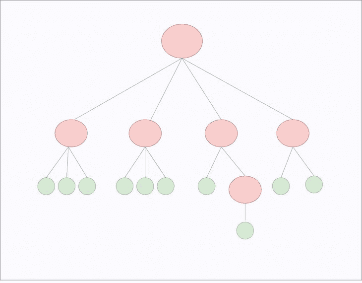
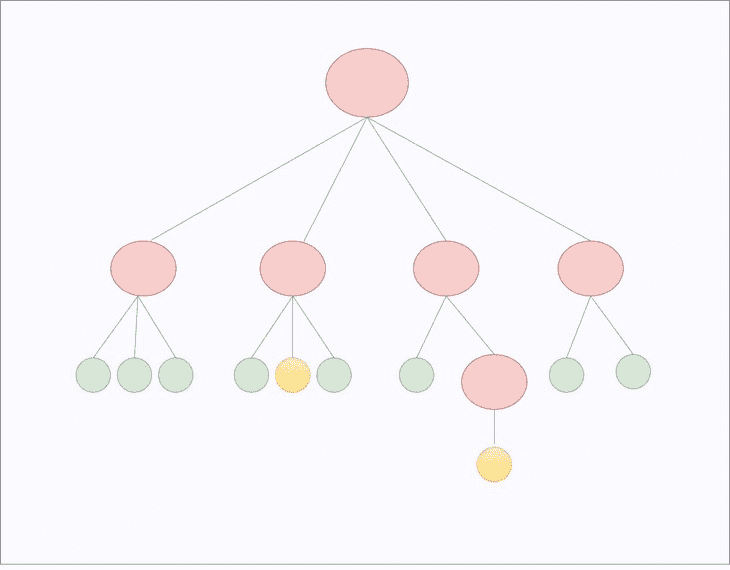
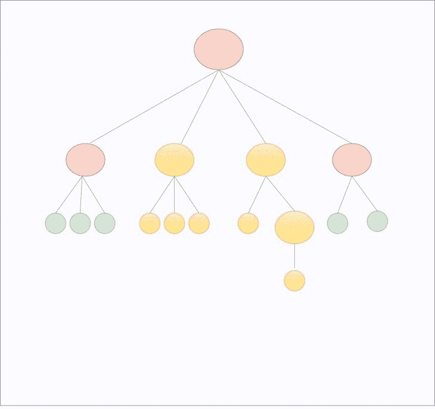

# 构建 React 应用时不要做的 5 件事

> 原文：<https://blog.logrocket.com/5-things-not-do-building-react-applications/>

***编者按**:这篇文章最后一次更新是在 2021 年 8 月 13 日，以反映提到的任何技术变化或代码更新。但是，它可能仍然包含过时的信息。*

在这一点上，React 是地球上最受欢迎的图书馆之一。React 引起了极大的兴趣，并且由于其 UI 优先的方法，新的开发人员被带到了该平台。

虽然这个库和整个 React 生态系统都已经成熟了很多年，但在某些情况下，我们会想，“这样做的正确方法到底是什么？”

这是一个合理的问题——并不总是有一种坚定的“正确”的做事方式。事实上，有时候最佳实践并不那么好。其中一些会损害性能和可读性，从长远来看，会使事情变得毫无成效。

在本文中，我们将回顾在使用 React 时实际上可以避免的五种普遍接受的开发实践，为什么它们是可以避免的，以及完成相同事情的替代方法。

## 优化从一开始就做出反应

React 以其速度而闻名，每次新的更新都会添加新的优化。但是，在使用这些新的优化之前，最好先看看实际的性能。

因为与其他前端平台相比，React 更容易扩展，所以开发人员不需要重写整个模块来加快速度。导致性能问题的罪魁祸首通常是 React 用来更新虚拟 DOM 的协调过程。

让我们看看 React 是如何处理这个问题的。在每个组件呈现上，React 生成一个由 UI 元素组成的树，叶节点是 DOM 元素。

当更新状态或道具时，React 必须以最小的变化生成新的树，并保持事情的可预测性。

例如，树可以是这样的:



假设应用程序接收到新数据，下列黄色节点需要更新:



React 通常会重新呈现整个子树，而不是只呈现相关节点:



当顶层组件的状态发生变化时，它下面的所有组件都会重新呈现。这种默认行为对于小型应用程序来说是可以接受的。然而，随着应用程序的增长，使用 React DevTools 中的 [Profiler 工具来测量实际性能可能是有益的。](https://blog.logrocket.com/react-devtools-5-things-you-didnt-know-you-could-do/)

### 如何在 React 中使用 Profiler？

Profiler 工具给出了浪费在不需要的渲染上的时间的精确细节。如果数字很大，您可以通过防止重新呈现未受影响的纯功能组件来优化它们。在这种情况下，您可以使用`React.memo()`来记忆组件。

`React.memo()`对接收到的属性做一个简单的比较，只有当属性不同时，而不仅仅是因为父状态改变时，才会重新呈现一个组件。

```
const AChildComponent = React.memo(function AChildComponent(props) {
  // component will re-render if the prop changes
  return (
    <div />
  );
});

```

对于基于类的组件，你可以通过[扩展一个`React.PureComponent`](https://blog.logrocket.com/react-pure-components-functional/) 或者[使用`shouldComponentUpdate()`](https://blog.logrocket.com/react-reference-guide-react-component/#shouldcomponentupdate) 定义一个定制的实现来执行一个简单的比较:

```
shouldComponentUpdate(nextProps, nextState) {
    if (this.props.color !== nextProps.color) {
      return true;
    }
    if (this.state.count !== nextState.count) {
      return true;
    }
    return false;
  }

```

这样，如果除了`color`或`count`之外的任何其他道具或状态改变，组件将不会更新。

除此之外，还有一些开发人员通常会忽略的非 React 优化技巧，但它们会影响应用程序的性能。这可以通过考虑未优化的映像和未压缩的构建文件来避免。

### 为什么图像优化很重要？

如果您构建的是动态图像，那么文件巨大的图像会给用户一种应用程序运行缓慢的印象。要解决此问题，请在将图像推送到服务器之前对其进行压缩，或者使用动态图像处理解决方案。

[Cloudinary 是一个很棒的优化 React 图片的工具](https://blog.logrocket.com/handling-images-with-cloudinary-in-react/)，因为它有自己的 React 库；其他选项包括亚马逊 S3 或 T2 Firebase T3。

### 压缩构建文件的目的是什么？

Gzipping 构建文件(`bundle.js`)可以大幅减小文件大小。但是，您必须修改 web 服务器配置。

Webpack 有一个名为 compression-webpack-plugin 的 gzip 压缩插件。使用这种技术在构建期间生成`bundle.js.gz`。

## 服务器端渲染对 SEO 有必要吗？

尽管单页面应用程序(SPAs)很棒，但是它们引起了两个主要问题。

第一，当应用程序最初加载时，浏览器中没有 JavaScript 缓存。如果应用程序很大，那么最初加载应用程序所需的时间也会很长。

第二，由于应用程序在客户端呈现，搜索引擎使用的网络爬虫不能索引 JavaScript 生成的内容。搜索引擎会将一个应用程序视为空白，然后对其进行排名，赶走流量。

这就是[服务器端渲染(SSR)技术](https://blog.logrocket.com/why-you-should-render-react-on-the-server-side-a50507163b79/)派上用场的地方。在 SSR 中，JavaScript 内容最初是从服务器呈现的。在初始渲染之后，客户端脚本接管并像普通 SPA 一样工作。

设置传统 SSR 的复杂性和成本更高，因为您需要 Node.js/Express.js 服务器。然而，如果你是为了 SEO 的利益，这是一个好消息。Google 毫无困难地索引和抓取 JavaScript 内容。

以下是 2015 年 10 月谷歌搜索中心博客的摘录:

> 今天，只要你不阻止 Googlebot 抓取你的 JavaScript 或 CSS 文件，我们通常能够像现代浏览器一样呈现和理解你的网页。为了反映这一改进，我们最近更新了技术网站管理员指南，建议不要禁止 Googlebot 抓取您网站的 CSS 或 JS 文件。

如果你只是因为担心你的谷歌页面排名而使用 SSR，那么你不需要使用 SSR。但是，如果您使用 SSR 来提高初始渲染速度，请尝试使用类似 Next.js 的库来实现更简单的 [SSR。](https://blog.logrocket.com/ssg-vs-ssr-in-next-js/)

这为您节省了安装 Node.js/Express.js 服务器所需的时间。

## 内嵌样式和 CSS 导入

在 React 中引入样式的传统 CSS-in-CSS 方法已经存在了几十年，并与 React 组件一起工作。使用这种方法，所有的样式表都进入一个`stylesheets`目录，并将所需的 CSS 导入组件。

然而，当现在使用组件时，样式表不再有意义。React 鼓励开发人员从组件的角度考虑应用程序，而样式表迫使您从文档的角度考虑应用程序。

各种其他方法将 CSS 和 JavaScript 代码合并到一个文件中。内嵌样式可能是其中最受欢迎的:

```
import React from 'react';

const divStyle = {
  margin: '40px',
  border: '5px solid pink'
};
const pStyle = {
  fontSize: '15px',
  textAlign: 'center'
};

const TextBox = () => (
  <div style={divStyle}>
    <p style={pStyle}>Yeah!</p>
  </div>
);

export default TextBox;

```

您不必再导入 CSS，但是您牺牲了可读性和可维护性。

除此之外，内联样式不支持媒体查询、伪类、伪元素和样式回退。当然，有一些方法可以让你做其中的一些，但是并不那么方便。

这就是 JSS CSS 派上用场的地方，内联样式并不完全是 JSS CSS。下面的代码使用`styled-components`演示了这个概念:

```
import styled from 'styled-components';

const Text = styled.div`
  color: white,
  background: black
`
<Text>This is CSS-in-JS</Text>

```

浏览器看到的大概是这样的:

```
<style>
.hash234dd2 {
  background-color: black;
  color: white;
}
</style>

<p class="hash234dd3">This is CSS-in-JS</p>

```

一个新的`<style>`标签被添加到 DOM 的顶部，并且与内联样式不同，实际的 CSS 样式在这里生成。所以，任何在 CSS 中有效的东西在`styled-components`中也有效。

此外，这种技术增强了 CSS，提高了可读性，并且适合组件架构。使用`styled-components`库，您还可以获得捆绑到库中的 SASS 支持。

## React 中可以嵌套三元运算符吗？

React 中流行三元运算符；它是我创建条件语句的首选操作符，在`render()`方法中非常好用。

例如，它们帮助您以内联方式呈现元素。在下面的例子中，我用它来显示登录状态:

```
render() {
  const isLoggedIn = this.state.isLoggedIn;
  return (

      The user is {isLoggedIn ? 'currently' : 'not'} logged in.

  );
}

```

但是，当您一次又一次地嵌套三元运算符时，它们可能会变得难看和难以阅读:

```
int median(int a, int b, int c) {
    return (a<b) ? (b<c) ? b : (a<c) ? c : a : (a<c) ? a : (b<c) ? c : b;
}

```

正如您所看到的，简写符号更紧凑，但是它们使代码看起来混乱。现在，想象一下如果你的结构中有十几个或者更多的嵌套 ternaries(这比你想象的要经常发生)。

一旦开始使用条件操作符，就很容易继续嵌套它，直到您决定需要一种更好的技术来处理条件呈现。

但是，好的一面是你有很多选择。你可以使用一个像 JSX 控制语句这样的巴别塔插件来扩展 JSX，以包含条件语句和循环的组件:

```
// before transformation
<If condition={ test }>
  <span>Truth</span>
</If>

// after transformation
{ test ? <span>Truth</span> : null }

```

还有一种流行的技术叫做即时调用函数表达式(IIFE)。这是一个匿名函数，在定义后立即调用:

```
(function() {
 // Do something
 }
)()

```

我们将函数放在一对括号中，使匿名函数成为函数表达式。这种模式在 JavaScript 中很流行，但是在 React 中，您可以将所有 if/else 语句放在函数中，并返回您想要呈现的任何内容。

这里有一个例子演示了我们将如何在 React 中使用 IFFE:

```
{
   (() => {
      if (this.props.status === 'PENDING') {
         return (<div className="loading" />);
      }
      else {
         return (<div className="container" />);

   })()
} 

```

React 中有更多的方法来运行条件语句，我们已经在 React 中的 [8 条件渲染方法中介绍过。](https://blog.logrocket.com/conditional-rendering-in-react-c6b0e5af381e)

## 闭包在 React 中有用吗？

闭包是可以访问外部函数的变量和参数的内部函数。闭包在 JavaScript 中无处不在，无论您是否意识到，您可能都使用过它们:

```
class SayHi extends Component {

render () {
 return () {
  <Button onClick={(e) => console.log('Say Hi', e)}>
    Click Me
  </Button>
 }
}
}

```

但是当你在`render()`方法中使用闭包时，这实际上是不好的。每当`SayHi`组件呈现时，一个新的匿名函数被创建并传递给`Button`组件。

虽然道具没变，`<Button />`还是会被强制重新渲染。如前所述，浪费的渲染会对性能产生直接影响。

相反，用一个类方法代替闭包，这样可读性更好，也更容易调试:

```
class SayHi extends Component {

  showHiMessage = (e) => {
    console.log('Say Hi', e)
  };

  render () {
   return () {
      <Button onClick={this.showHiMessage}>
          Click Me
      </Button>
   }
  }
}

```

对于函数组件，作为属性传递给子组件的函数也会导致重新呈现，不管子组件是否被记忆。在这种情况下，我们使用`useCallback`钩子来记忆渲染之间的函数:

```
const showHiMessage = React.useCallback((e) => console.log('Say Hi', e), []);

```

## 结论

当一个平台成长时，每天都会出现新的模式。一些模式有助于您改进整个工作流程，而另一些则有明显的副作用。

当副作用影响应用程序的性能或损害可读性时，寻找替代方法可能是个更好的主意。在这篇文章中，我介绍了 React 中的一些实践，由于它们的缺点，你可以避免这些实践。

你对 React 有什么看法，React 的最佳实践是什么？请在评论中分享它们。