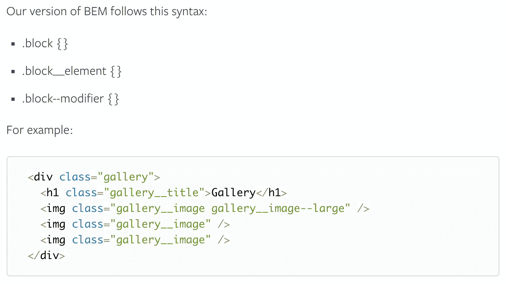
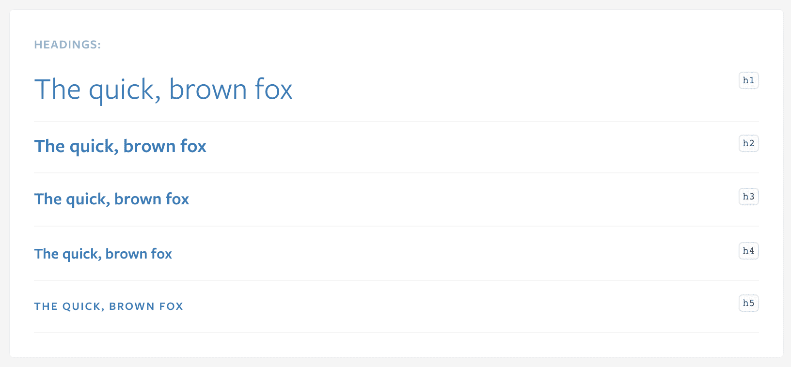
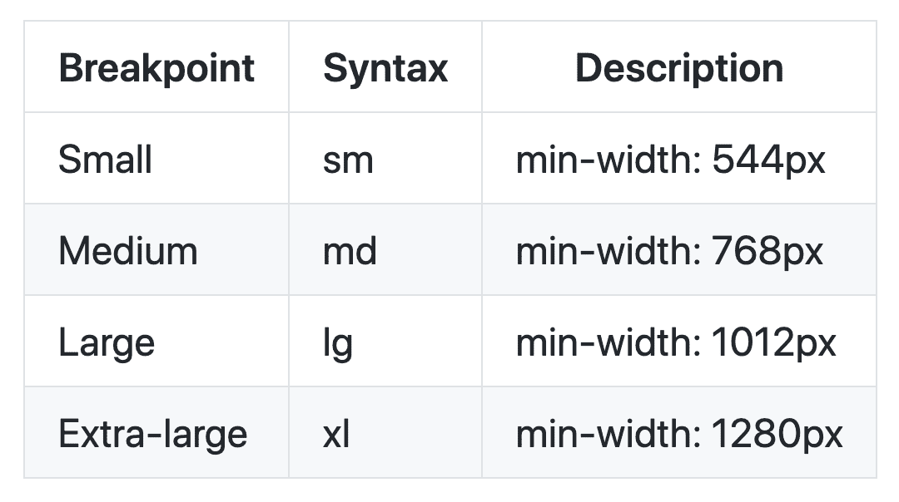
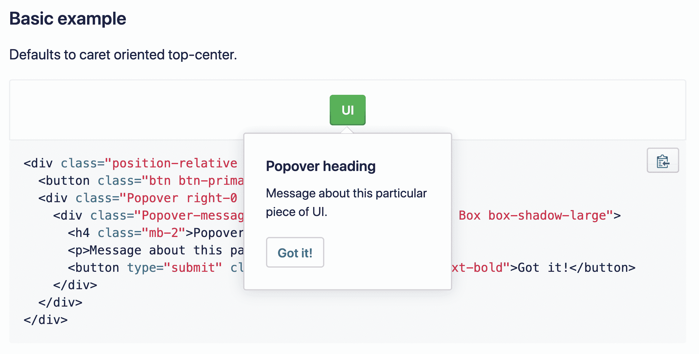
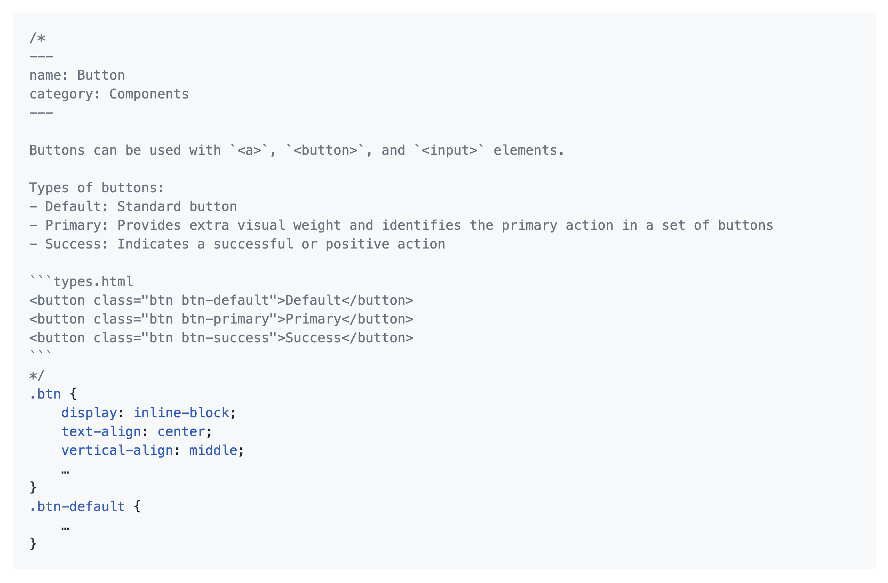
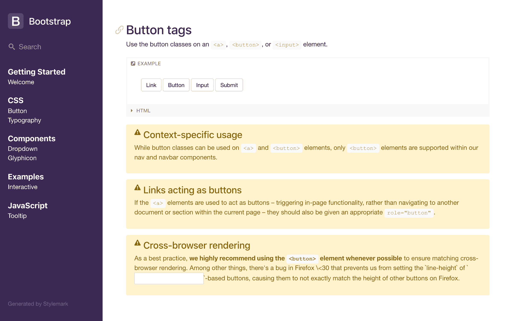

# 创建 CSS 样式指南时需要考虑的 5 件事

> 原文：<https://blog.logrocket.com/5-things-to-consider-when-creating-your-css-style-guide-7b85fa70039d/>

CSS 样式指南是一套关于如何使用和编写 CSS 代码的标准和规则。它通常包含全局品牌定义，如颜色和版式，以及一组可重用的组件，用于构建更加一致和可维护的项目。

CSS 样式指南应该被认为是每个项目需求的平等公民。

对于什么是风格指南，有不止一个定义。例如，[维基百科](https://en.wikipedia.org/wiki/Style_guide)说:

> “文体指南(或文体手册)是一套写作和设计文档的标准，可用于一般用途，也可用于特定的出版物、组织或领域。(…)

> 风格指南建立并实施风格以改善沟通。为此，它确保一个文档内和多个文档之间的一致性，并在使用和语言构成、视觉构成、拼写和排版方面实施最佳实践。"

[CSS 指南网站/哈利·罗伯茨](https://cssguidelin.es/)说:

> "(CSS 样式指南应包含)编写合理、可管理、可伸缩的 CSS 的高级建议和指南."

[谷歌 HTML/CSS 样式指南](https://google.github.io/styleguide/htmlcssguide.html)说:

> "这个文档定义了 HTML 和 CSS 的格式和样式规则。它旨在改善协作、代码质量和支持基础设施。”

所有这些定义都告诉我们风格指南的主要任务:帮助彼此理解如何阅读、编写和使用代码。重要的是要知道每一个风格指南都是独一无二的，它的定义、原则和结构应该是一个团队的努力，而不是跟随某人的逻辑或想法的一种有说服力的方式。

以下是使用 CSS 样式指南时应该记住的五件事。

### 定义编码格式

每个风格指南都有一套规则，可以帮助项目中的每个人以相同的方式编写代码。通过遵循这些规则，开发人员可以避免日常任务中的典型问题，比如合并冲突和林挺错误。您的团队可以在项目早期就空格或制表符的缩进偏好达成一致。其他常见的规则有制表符宽度、在文档末尾添加新行以及使用引号。

例如， [WordPress 风格指南](https://make.wordpress.org/core/handbook/best-practices/coding-standards/css/#structure)定义了编写 CSS 声明的结构:

WordPress Style Guide

有像[pretty](https://prettier.io/)或 [editorconfig](https://editorconfig.org/) 这样的工具可以帮助你的团队产生格式良好的代码。确保在项目中包含配置文件。此外，您可能希望在自述文件中添加一条注释，说明如何在不同的代码编辑器中设置代码格式。

### 就命名约定达成一致

CSS 有许多不同的命名约定。最受欢迎的是 [BEM](https://css-tricks.com/bem-101/) 、[smacs](http://smacss.com/)和 [OOCSS](https://github.com/stubbornella/oocss/wiki) ，仅举几例。如果您的团队决定适应命名约定，每个开发人员都应该理解组件的结构。代码看起来像是由一个人写的，这将提高可读性。此外，将 CSS 命名约定与 JS 命名约定分开总是一个好主意。

例如， [Lonely Planet](https://rizzo.lonelyplanet.com/documentation/css/naming) 使用 BEM 作为命名约定:

Lonely Planet Style Guide, BEM example

> “给事物命名很难，但值得一试。为了简单起见，我们在类名中使用了 BEM 方法。BEM 还有助于我们避免跨模块冲突，并从类名中指明意图和关系。”

> — [孤独星球，命名](https://rizzo.lonelyplanet.com/documentation/css/naming)

不是每个开发人员都同意命名约定，但是只要每个开发人员都遵循它，这就是最重要的。这就是为什么风格指南不应该是单个开发人员的责任，而应该是每个开发人员共同努力的结果。在自述文件中的某个地方添加一个关于命名约定的注释不会有什么坏处。

我更喜欢在几乎每个项目中使用边界元法。我也熟悉其他命名约定。熟悉所有的命名约定是值得的，因为如果您在多个项目或多个团队中工作，这可能是很有帮助的。

### 定义编码规则

编码规则应该包括关于定义全局样式、变量、混合、函数等等的决定。这些编码规则可以是任何东西，从排版到单位使用。

例如,《孤独星球》定义了排版的用法。团队决定，通过不在全局范围内建立排版，而是将一个特定的类应用于包装元素，可以避免项目之间的风格冲突。我只能猜测，但我认为团队是在注意到问题后做出这个决定，然后进行讨论，最后达成一致。我可能不同意这个问题，但如果我是团队的一员，我会理解他们来自哪里。

Lonely Planet Style Guide, Typography section

一旦团队就每一条规则达成一致，你就应该坚持下去。这个问题不需要进一步讨论。这可以为你的团队节省很多时间。它还应该防止团队成员之间可能的分歧和争论。

例如，Primer 定义了四个主要断点。通过识别这些断点，创意团队可以在这些限制内设计页面和组件，开发团队可以更容易地设计这些页面和元素的样式，而无需进一步猜测或讨论断点。

Primer Style Guide, Breakpoints section

我更喜欢将颜色、版式和断点定义为全局变量。这帮助我建立了一个更加一致、可识别和可发现的品牌。

### 定义可重用组件(如果它们是你的风格指南的一部分)

有些样式指南包含可重用组件，有些则不包含。只要有助于团队构建更好的、可维护的产品，你在风格指南中保留什么并不重要。

当组件是样式指南的一部分时，您应该考虑以下一些问题:

*   如果你把组件放在网站/应用的不同部分，它会有什么表现？
*   如果将组件放在另一个元素中，它会有什么表现？
*   你能把组件分成更小的可重复使用的项目吗？

风格指南组件应该始终是产品的独立粒子。通过解决这个标准，您可以更有效地维护、更新甚至替换组件。

例如，Primer 定义了一个 popover 组件。popover 气泡的内容可以是另一个组件，比如按钮。如果主按钮改变了，它会在每个组件中更新，包括弹出窗口。

Primer Style Guide, Popover section

一个好的做法是给你的组件增加变化。你也应该隔离变化。如果您需要一个具有不同文本大小和对齐方式的元素，那么可以考虑为这个特定的组件使用两个独立的变体类。

当相同的变体出现在多个组件上时，那么您可以考虑添加实用程序类。实用程序类通常解决对齐、填充和边距等问题。

例如，Primer 定义了填充的[实用程序类。popover 组件使用一个实用程序类来实现与其他组件的一致间距。](https://styleguide.github.com/primer/utilities/padding/)

我不喜欢在项目中添加实用程序类，但是如果你能证明添加它们的决定是正确的，那就去做吧。

* * *

### 更多来自 LogRocket 的精彩文章:

* * *

### 考虑使用工具作为风格指南

一些工具，像 [KSS](http://warpspire.com/kss/) 或 [mdcss](https://github.com/jonathantneal/mdcss) 或 [Stylemark](https://github.com/nextbigsoundinc/stylemark) 或 [Nucleus](https://holidaypirates.github.io/nucleus/getting-started.html) ，可以帮助你直接从代码中生成风格指南。所有这些工具都基于相同的原理工作，即一种文档化语法，它可以解析代码中的注释，并将其编译为静态页面。

一些工具，如 Stylemark 和 mdcss，支持 Markdown 语法，如果您熟悉它，这可能会很有用。

Stylemark Style Guide example

一般来说，除了提供例子之外，建议写出组件的用途，如何使用它，以及可以应用哪些修饰语。

Stylemark Style Guide, Bootstrap example

如果您不喜欢自动生成样式指南，您可以手动创建它。只要不花太多时间，任何方法都可以。

我更喜欢使用 KSS 和样式标记，因为我可以在几分钟内设置和配置一个新的样式指南。到目前为止，我还没有碰到任何问题。我发现这些工具具备创建健壮且易于使用的文档的所有要求。

### 结论

每个风格指南都有或者应该有相同的目标——提高一致性和可用性。通过标准化您的代码，并应用统一的设计原则，您可以创建一个独特的“该做什么，不该做什么”的食谱，它可以帮助您的团队更有效和一致地构建产品。

## 你的前端是否占用了用户的 CPU？

随着 web 前端变得越来越复杂，资源贪婪的特性对浏览器的要求越来越高。如果您对监控和跟踪生产环境中所有用户的客户端 CPU 使用、内存使用等感兴趣，

[try LogRocket](https://lp.logrocket.com/blg/css-signup)

.

[https://logrocket.com/signup/](https://lp.logrocket.com/blg/css-signup)

LogRocket 就像是网络和移动应用的 DVR，记录你的网络应用或网站上发生的一切。您可以汇总和报告关键的前端性能指标，重放用户会话和应用程序状态，记录网络请求，并自动显示所有错误，而不是猜测问题发生的原因。

现代化您调试 web 和移动应用的方式— [开始免费监控](https://lp.logrocket.com/blg/css-signup)。