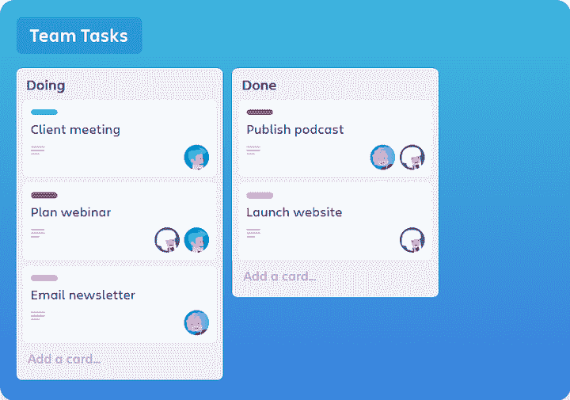
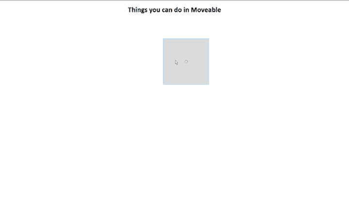
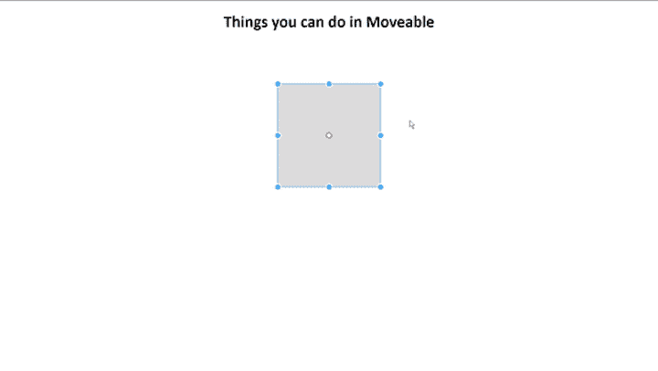
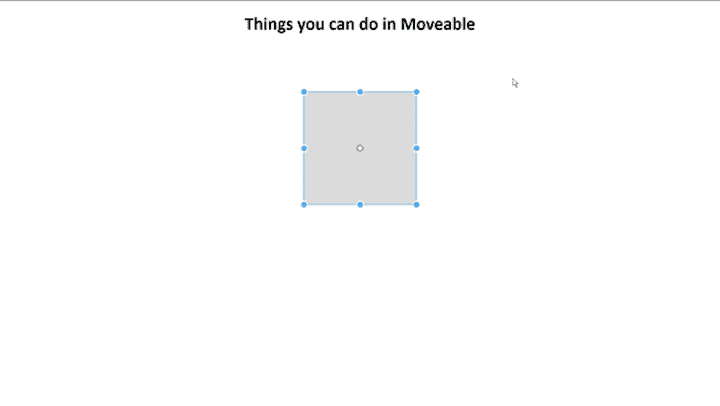
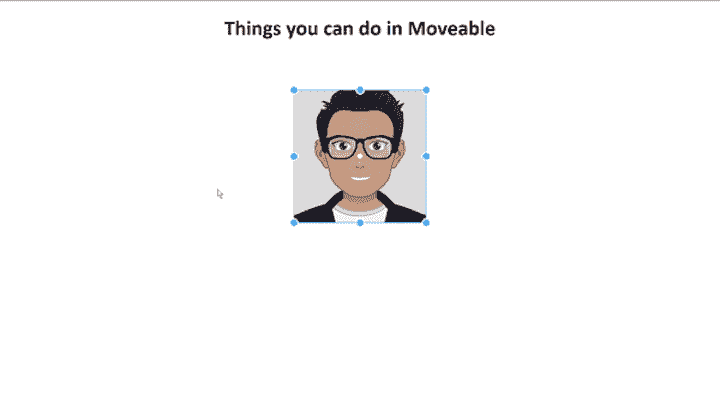
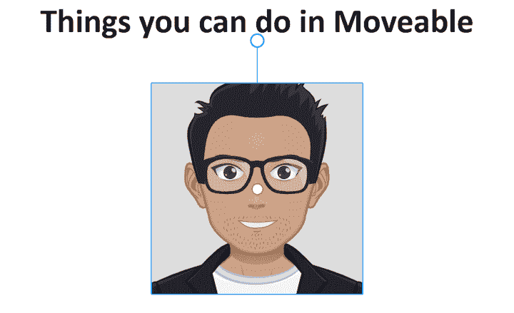
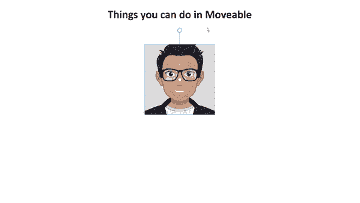
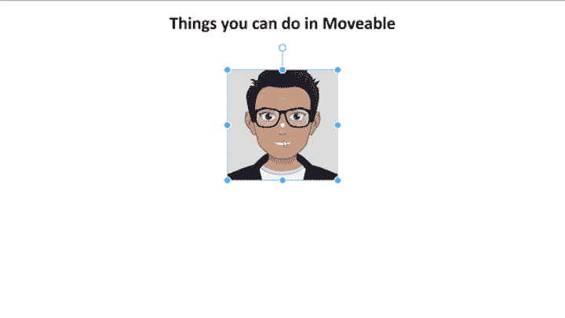
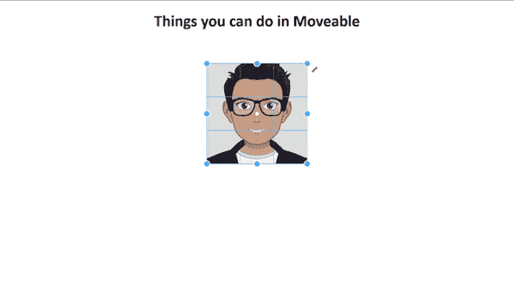

# 你可以用移动博客做的 5 件事

> 原文：<https://blog.logrocket.com/5-things-you-can-do-with-moveable/>

Moveable 是一个由韩国前端工程师 Younkue Choi 开发的 npm 包，它使您的组件可拖动、可调整大小、可伸缩、可旋转、可弯曲、可挤压、可分组、可咬合，等等。

在本教程中，我们将带您浏览一些使用[可移动库](https://www.npmjs.com/package/moveable)可以做的最酷、最有用的事情。你可以在 [GitHub](https://github.com/lelouchB/moveable-example) 上找到完整的代码。

## 设置

我们将使用普通的 JavaScript 环境来讨论可移动的特性。

创建一个名为`features`的新目录。对于这个例子，我们将只使用可移动脚本，但是您也可以使用 npm 包。

```
npm i moveable

```

创建一个名为`index.html`的新 HTML 文件，并向其中添加以下脚本。

```
<script src="//daybrush.com/moveable/release/latest/dist/moveable.min.js"></script>

```

创建一个新的`index.js`文件，并将其添加到`index.html`中。同样，用`class="root"`创建一个空的`div`。这就是我们要引用`moveable`的地方。

下面是您的`index.html`的样子:

```
<!DOCTYPE html>
<html lang="en">
<head>
    <meta charset="UTF-8">
    <meta name="viewport" content="width=device-width, initial-scale=1.0">
    <link rel="stylesheet" href="style.css">
    <title>Features</title>

</head>
<body>
    <div id="title">
        <h1>Things you can do in Moveable</h1>
    </div>
    <div class="container">
        <div class="root">

        </div>
    </div>
    <script type=" module " src="./index.js "></script>
  <script src="//daybrush.com/moveable/release/latest/dist/moveable.min.js"></script>
</body>
</html>

```

所有的样式和 CSS 都由你决定。为了本教程的目的，我添加了基本的样式。

```
.container {
    display: flex;
    align-items: center;
    justify-content: center;
    min-height: 50vh;
    margin: 0;
}
#title {
    font-family: 'Gill Sans', 'Gill Sans MT', Calibri, 'Trebuchet MS', sans-serif;
    text-align: center;
}
#root {
    background-color: #DDD;
    width: 200px;
    height: 200px;
}

```

我们的应用程序应该如下所示。可移动的魔法将发生在灰色的盒子里。


## 特征

以下是五个激动人心的功能，你可以添加到您的组件与可移动。

对于每个特性，我们将关注主要选项和事件。我们不可能在一篇博文中涉及到所有的方法和特性，但是我们会带您了解设置基本功能所需的内容。

我们开始吧！

### 1.可拖动的

顾名思义，Draggable 使您能够拖动和移动目标。对于以 Trello 风格的列为特色的应用程序来说，这很方便。



现在我们有了一个空的`index.js`，让我们开始创建一个新的可移动实例。

```
const move = new Moveable(parentElement, options)

```

第一个参数是`parentElement`，它可以是 HTML 或 SVG 元素。对于本教程，我们将只引用一个 HTML 元素，参数将是`argument.body`。

第二个参数是一个包含我们需要传递的所有选项的对象。我们需要传递的第一个选项是`target`，它包含对 DOM 元素的引用。

```
const move = new Moveable(document.body, {
  target: document.querySelector(".root"),
  draggable: true,
})

```

另一个选项是`draggable:true`。这默认为`false`——不仅仅是可拖动的，所有其他特性也是如此。如果你想访问两个特性，比如`draggable`和`scalable`，你需要将它们都设置为`true`。

您的应用程序现在应该是这样的:


接下来，调用`on`方法。这个方法有两个参数:事件的名称——在本例中是`drag`——和一个附属于它的处理函数。

```
on(eventName, handlerToAttach)

```

让我们回顾一下代码。

```
move.on("drag",  ({ target, transform }) => {
    target.style.transform = transform;
});

```

同样，第一个参数是`"drag"`，另一个是以对象作为参数的函数。这个`target`是 HTML 中的元素，在本例中，它是一个带有`class="root"`的`div`。

如果我们在控制台记录这个`target`，我们将会以一个对象的形式看到与那个元素相关的所有信息。

* * *

### 更多来自 LogRocket 的精彩文章:

* * *

```
div.root
accessKey: ""
accessKeyLabel: ""
align: ""
assignedSlot: null
attributes: NamedNodeMap [ class="root", style="transform: matrix(1, 0, 0, 1, 0, 0) translate(48px, -6px);" ]
baseURI: "http://127.0.0.1:5500/"
childElementCount: 0
childNodes: NodeList [ #text ]
children: HTMLCollection { length: 0 }
classList: DOMTokenList [ "root" ]
className: "root"
clientHeight: 200
clientLeft: 0
clientTop: 0
clientWidth: 200
contentEditable: "inherit"
contextMenu: null
// More Information
//
style: CSS2Properties { transform → "matrix(1, 0, 0, 1, 0, 0) translate(31px, 56px)" }
//
//

```

中间的某处是`style`属性；这是存储元素位置的地方。

另一个参数`transform`是一个字符串，每当触发`drag`事件时，或者换句话说，每当元素被拖动时，该字符串就会更新。我们将对其他特性使用相同的`transform`参数，每个特性都有自己的事件名称。

```
console.log(transform)
matrix(1,0,0,1,7,134) translate(3px, -8px)

```

下面的内容现在应该更有意义了。

```
const move = new Moveable(document.body, {
  target: document.querySelector(".root"),
  draggable: true,
});
move.on("drag", ({ target, transform }) => {
  target.style.transform = transform;
});

```

查看运行中的代码:



### 2.可调整大小的

Resizable 指示目标的宽度和高度是否可以增加或减少。当调整应用程序中组件的大小时，例如调整 Trello 板中的列大小时，此功能非常有用。

如上所述，第一步是设置`resizable: true`。让我们设置`draggable:false`,这样我们就可以开始只关注 Resizable。

```
const move = new Moveable(document.body, {
  target: document.querySelector(".root"),
  draggable: false,
  resizable: true,
});

```

您的应用程序应该如下所示:


我们将再次在`move`上使用`on`方法，但是这次我们的事件名称将是`resize`。

```
move.on("resize", ({ target, width, height }) => {
    target.style.width = width + "px";
    target.style.height = height + "px";
});

```

代替`transform`，`width`和`height`是处理函数的参数。这将根据用户更新`width`和`height`。



默认情况下，`keepRatio`设置为`false`。如果设置为`true`，宽高比将保持不变。

```
const move = new Moveable(document.body, {
  target: document.querySelector(".root"),
  draggable: false,
  resizable: true,
  keepRatio: true,
});

```



现在，将`draggable`和`resizable`都设置为 true 以查看它的运行情况。

以下是完整的代码:

```
const move = new Moveable(document.body, {
  target: document.querySelector(".root"),
  draggable: true,
  resizable: true,
  keepRatio: true,

});
move.on("drag", ({ target, transform }) => {
  console.log(transform);
  target.style.transform = transform;
});

move.on("resize", ({ target, width, height }) => {
    console.log(width, height);
    target.style.width = width + "px";
    target.style.height = height + "px";
});

```

### 3.可攀登的

此功能指示目标的`x`和`y`是否可以缩放或变换。

首先，将`scalable:true`和所有其他选项设置为`false`。

```
const move = new Moveable(document.body, {
  target: document.querySelector(".root"),
  draggable: false,
  resizable: false,
  keepRatio: false,
  scalable:true,  
});

```

在我们继续之前，我们应该区分一下`resize`和`scale`。调整大小意味着改变元素的宽度和/或高度，而缩放改变图像的大小，同时保持尺寸不变。把它想象成放大或缩小。

为了演示这个特性，一个简单的彩色`div`会令人困惑，所以我们将使用一个图像。

用类`root`在`div`中添加一个图像。

```
<div class="root">
            
</div>

```


现在，添加事件名为`scale`的`on`方法。

```
move.on("scale", ({ target, transform }) => {
    target.style.transform = transform;
});

```

这类似于`draggable`，但是这一次，如果我们控制台日志`transform`，我们将看到类似这样的内容:

```
// scale
matrix(1,0,0,1,0,0) scale(1.17, 1.055)

//drag
matrix(1,0,0,1,7,134) translate(3px, -8px)

```

我们来看看`scale`的动作，然后再加上`resize`。



如您所见，整个图像——换句话说，`div`的内容——被缩放。

我们来对比一下`resize`。设置`resizable: true`和`scalable:false`。


如果你注意到我们最初在 CSS 中设置的灰色背景，那么`div`的尺寸被改变了，但是`image`的尺寸保持不变。这应该可以澄清`resizable`和`scalable`之间的区别。

现在为`scalable`设置`keepRatio:true`。

```
const move = new Moveable(document.body, {
  target: document.querySelector(".root"),
  draggable: false,
  resizable: false,
  keepRatio: true,
  scalable:true,
});

move.on("drag", ({ target, transform }) => {
  target.style.transform = transform;
});

move.on("resize", ({ target, width, height }) => {
    target.style.width = width + "px";
    target.style.height = height + "px";
});

move.on("scale", ({ target, transform }) => {
    target.style.transform = transform;
});

```

### 4.可旋转的

我相信你现在已经找到窍门了。列表中的下一个特征是可旋转的。

首先，设置`rotatable: true`。您的应用程序应该如下所示:



现在添加带有 yjr 事件名`rotate`的`on`方法。

```
move.on("rotate", ({ target, transform }) => {
  console.log(transform)
  target.style.transform = transform
});

// transform
// matrix(1,0,0,1,0,0) rotate(-9.200532252654511deg)

```



让我们把我们到目前为止讨论过的特性结合起来。



```
const move = new Moveable(document.body, {
  target: document.querySelector(".root"),
  draggable: true,
  scalable: true,
  resizable: false,
  keepRatio: false,
  rotatable: true,
});
move.on("drag", ({ target, transform }) => {
  target.style.transform = transform;
});
move.on("resize", ({ target, width, height }) => {
  target.style.width = width + "px";
  target.style.height = height + "px";
});
move.on("scale", ({ target, transform }) => {
  target.style.transform = transform;
});
move.on("rotate", ({ target, transform }) => {
  target.style.transform = transform;
});

```

### 5.可弯曲的

该特征指示目标是否可以被扭曲(即，扭曲、弯曲)。

将`warpable:true`和其他设置为`false`你的应用应该如下所示。


现在，添加事件名为`warp`的`on`方法。

```
 move.on("warp", ({ target, transform }) => {
  target.style.transform = transform;
 });

```



## 可在框架和故事书中移动

Moveable 有针对所有主要框架定制的软件包。

您可以在 mobile 的[故事书页面](https://daybrush.com/moveable/storybook/)上玩不同的功能，无需任何设置。

## 参考

要了解更多信息，请查看以下资源。

## 通过理解上下文，更容易地调试 JavaScript 错误

调试代码总是一项单调乏味的任务。但是你越了解自己的错误，就越容易改正。

[log 火箭](https://lp.logrocket.com/blg/javascript-signup)让您以全新独特的方式理解这些错误。我们的前端监控解决方案跟踪用户与您的 JavaScript 前端的互动，让您能够发现用户到底做了什么导致了错误。

[](https://lp.logrocket.com/blg/javascript-signup)

LogRocket 记录控制台日志、页面加载时间、堆栈跟踪、慢速网络请求/响应(带有标题+正文)、浏览器元数据和自定义日志。理解您的 JavaScript 代码的影响从来没有这么简单过！

[Try it for free](https://lp.logrocket.com/blg/javascript-signup)

.