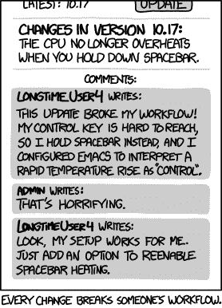

# 保持 JavaScript 库最新的 5 个技巧

> 原文：<https://blog.logrocket.com/5-tips-to-keep-your-javascript-libraries-up-to-date/>

[npm](https://www.npmjs.com/) 是个蛮荒之地。它是这个星球上最大的软件包注册中心，它的增长率超过了软件包管理领域曾经经历过的任何事情。那里[的大部分软件包已经几年没有更新过了](https://blog.nodeswat.com/what-i-learned-from-analysing-1-65m-versions-of-node-js-modules-in-npm-a0299a614318#dfaa)。

开发者可能放弃一个包的原因是多方面的。他们可能已经失去了兴趣，不再使用这个包，甚至不再使用 JavaScript。

根据我的经验，人们通常不能保持他们的代码是最新的，仅仅是因为这可能是令人厌烦的、令人筋疲力尽的、乏味的工作。如果我添加此功能，软件包会继续工作吗？更新这种依赖性会破坏什么吗？我的哪些依赖项已经过时了？这种内部问题很快就会变得令人厌倦。

但不一定非要这样。您可以通过实现一些方便的工具和工作流来处理维护和未来验证您的 JavaScript 库的大部分工作，从而避免这些陷阱。

在本指南中，我们将概述五种技术来帮助您最大限度地减少与保持库最新相关的麻烦。我们不会深入讨论如何设置它们的太多细节——这超出了一篇文章的范围——但是如果您想了解更多，我们会为您提供一些有用的资源。根据您在开源发布领域的经验水平，其中一些技术可能看起来很新，令人望而生畏。但是我保证这是值得的，特别是当你维护多个库的时候。

## 1.掌控一切

让我们明白最明显的一点:要使任何东西保持最新，您必须了解它的环境。

跟上 JavaScript 生态系统是一项艰巨的任务。每天都有更多新的、有趣的东西涌现出来，超出了你的学习时间表。不要盲目追随每一个新的、闪亮的潮流，而是要对那些一次又一次出现的事物保持敏锐的目光。

JS 生态系统中的许多整体变化是由语言本身的更新驱动的。每隔几年，我们就会看到突破性的、不容错过的改进——比如 Promises、`async` / `await`、es 模块语法等等。Axel Rauschmayer 的 [2ality](https://2ality.com/) 博客定期分解 ECMAScript 标准的新特性和即将出现的特性，是跟踪这些变化的良好资源。

但是了解外部世界只是硬币的一面。另一个是了解内部世界——你的图书馆——就像你的手背一样。这似乎是显而易见的，但是如果你自己不使用你的库——或者不再使用它——你可能不会注意到用户经常遇到的痛点。例如，如果您的用户不得不努力解决令人困惑的回调代码，而不是使用承诺，或者每次使用您的库时都看到重复的警告，因为它使用了一个[早已过时的 Node.js API](https://github.com/substack/node-falafel/issues/68) ，您将永远不会知道。

底线:如果你想保持你的库是最新的，你自己使用它。这就是你注意到更新机会的方式。

## 2.编写自动化测试

您应该编写测试可能是开源工作中最广为人知和最少争议的需求之一。好的测试既能确保你的软件像预期的那样工作，又能降低未来的变化破坏你的代码的可能性。

毫无疑问:保持 JavaScript 库的更新总是涉及到变化。改变是可怕的，因为结果往往是不确定的。如果你没有自动化测试，你很可能会避免更新东西，因为你担心你会在没有注意到的情况下破坏一些东西。去过那里，做过那个。

那么你应该怎么做呢？

### 选择一个测试框架

有太多的[库用于测试 JavaScript 代码](https://blog.logrocket.com/most-in-demand-javascript-testing-tools-in-2020/)。如果你不确定该选哪一个，我推荐使用 [Jest](https://jestjs.io/en/) 。它非常受欢迎，易于上手，由脸书开发，有强大的企业支持。

### 编写好的测试

学习如何编写好的测试实际上比选择一个特定的框架更重要。但是如果你不知道如何编写测试，你可能想从编写测试的冒险开始，然后从中积累一些经验。

编写好的测试有很多范例，不管你选择哪一个，某些人可能都会反对你。我个人赞同肯特·c·多兹的方法:“你的测试越像你的软件被使用的方式，它们就能给你越多的信心。”

### 自动化您的测试

持续集成(CI)是一个每当您的代码发生变化时(即，每当您将代码推送到 GitHub 时)自动对其运行测试的过程。有无数的提供商提供 CI 服务，其中大部分对开源软件是免费的。几年前，当我第一次建立一个具有持续集成的库时，我选择了 Travis CI，从那以后我一直很满意它。

## 3.监控你的依赖关系

如果你为 JavaScript 生态系统写一些东西，你的代码很可能依赖于 npm 上托管的许多包。至少，您对您的测试框架有依赖性。

为了保持库中内容的新鲜和安全，您必须确保您的依赖项是最新的。当然，您可以手动完成(使用诸如 [npm-check](https://npmjs.com/package/npm-check) 之类的工具)。但是，就像测试一样，如果你不得不手工做一些烦人的事情，很有可能你根本不会做。

幸运的是，保持依赖关系最新也可以自动化。像 JavaScript 世界中的任何东西一样，有多种工具可以用来完成这项工作。最明显的选择是[dependent bot](https://dependabot.com/)，因为它与 GitHub 集成在一起。dependent bot 在 GitHub repos 中打开 pull 请求，每个依赖项更新一个请求。您的 CI 服务根据 Dependabot 所做的更改运行您的所有测试。如果测试没有通过，就很容易找出问题的根源，因为您将确切地知道是哪个依赖项更新导致了测试失败。

## 4.记录您的公共 API

我可能会失去你们中的一些人，但我还是要说:

写👏a👏全面的👏自述文件。

我不能夸大记录你的库的公共 API 的重要性。广泛地。

这是大多数开发人员从心底讨厌的工作类型。但是高质量的文档可以促进采用，提高您的专业声誉，并帮助用户确定如何最好地使用您代码的特定部分。

JavaScript 是一种动态语言，它的代码非常容易被发现。对于为在浏览器中使用而创建的库来说尤其如此，因为它们经常将自己所做的一切放在一个全局对象中。如果你让用户对你的库的 API 的功能一无所知，他们自己会发现的——他们可能会找到并使用你从未打算让他们使用的东西。这将使你的代码成为维护的噩梦；如果你的用户依赖于你的库的内部，你没有办法在不破坏用户代码的情况下改变它们。

除了编写自述文件，另一个记录库的公共 API 的好方法是在代码旁边提供[类型定义](https://www.geekabyte.io/2017/10/understanding-declaration-files-in.html)。类型定义帮助用户发现你的 API，当他们试图使用类型中没有声明为公共的东西时，它会提示他们的代码编辑器警告他们。

您不必手动编写类型定义；最近版本的 TypeScript 足够聪明，可以[从代码中的 JSDoc 注释](https://dev.to/open-wc/generating-typescript-definition-files-from-javascript-5bp2)中提取一个定义文件！

## 5.释放时保持理智

将一个新版本的库推送到 npm 就像运行`npm publish`一样简单。这几乎太容易了——已知会出现无法预料的问题。

以下是一些提示，帮助你在发布新版本时保持有组织、冷静和镇定。

### 克制自己不要发布主要版本

发布主要版本是必要之恶。你需要时不时地这样做，因为你不可能永远保持与所有旧东西的兼容性。然而，在发布重大变更时，你应该保持低调，尤其是当你的库拥有非零数量的用户时。在方便的地方收集你对 API 更新的想法，并在适当的时候将它们打包成一个主要版本。

原因很简单:当`npm install`在一个项目中运行时，通常会自动安装次要更新和补丁更新，这在大多数活动项目中时有发生。然而，有人跨越主要版本边界主动更新您的库的可能性相对较低。这给你的用户留下了无可救药的过时软件，因为你不太可能把特性和错误修复移植到以前的主要版本。

### 尽早放弃对过时 Node.js 版本的支持

请相信我。我对在我的一些库中维护对旧 Node.js 版本的支持感到内疚，这很痛苦——主要是因为即使您继续支持它们，您的依赖项也会开始放弃对这些旧 Node.js 版本的支持，并且您将不再能够将它们更新到最新版本。

为了让您的生活更轻松，放弃对 [Node.js 版本](https://nodejs.org/en/about/releases/)的支持，每当您进行主要版本升级时，就不再维护这些版本。

### 不要使用`npm publish`

如上所述，`npm publish`使得犯错误太容易了。如果你忘记提交一个本地的改变，删除包的版本号，运行测试，等等。，`npm publish`会幸灾乐祸地忽略这些疏漏。

像 [np](https://npmjs.com/package/np) 这样的工具将会捕捉到这些问题中的大部分，并给你更多的信心，让你相信在一个版本发布之后，事情仍然会像预期的那样工作。如果你真的想变得乏味，你甚至可以[自动化你的发布](https://twitter.com/mikeal/status/1166416545620230144)。

## 结论

有许多技术我们没有涉及；不可能将所有内容都包含在一篇文章中。然而，上面的提示应该给你一个坚实的基础，使你的 JavaScript 库保持最新，而没有任何通常与任务相关的麻烦。

让我们回顾一下我们学到的内容:

*   永远不要停止学习。不进则退。这就是在快速发展的技术世界里，尤其是在网络上，事情是如何运作的
*   把事情写下来。在你建立公共文档之前，你的概念和它们的限制对大众来说仍然是个谜。在用户控制 API 的解释之前，让他们知道
*   自动化，自动化，自动化！ CI 是你的朋友。不管是什么任务，如果机器人为你做，它会节省你很多时间和压力，并减少出错的空间

如果你感到不知所措，不要烦恼:这是多年的经验，浓缩成一篇简短的博文。罗马不是一天建成的如果你一步一步地整合这些知识，你会很快建立起信心，并发展出一套程序来长期保持你的图书馆与时俱进。

## 通过理解上下文，更容易地调试 JavaScript 错误

调试代码总是一项单调乏味的任务。但是你越了解自己的错误，就越容易改正。

LogRocket 让你以新的独特的方式理解这些错误。我们的前端监控解决方案跟踪用户与您的 JavaScript 前端的互动，让您能够准确找出导致错误的用户行为。

LogRocket 记录控制台日志、页面加载时间、堆栈跟踪、慢速网络请求/响应(带有标题+正文)、浏览器元数据和自定义日志。理解您的 JavaScript 代码的影响从来没有这么简单过！

[Try it for free](https://lp.logrocket.com/blg/javascript-signup)

.