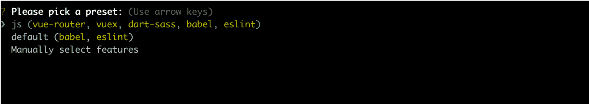
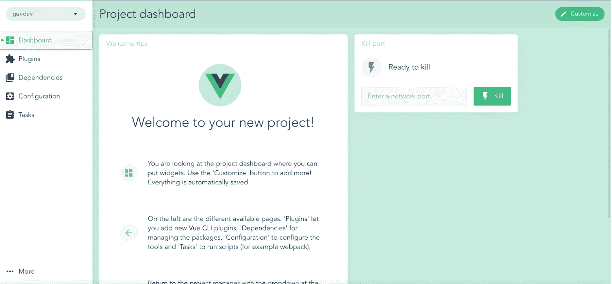
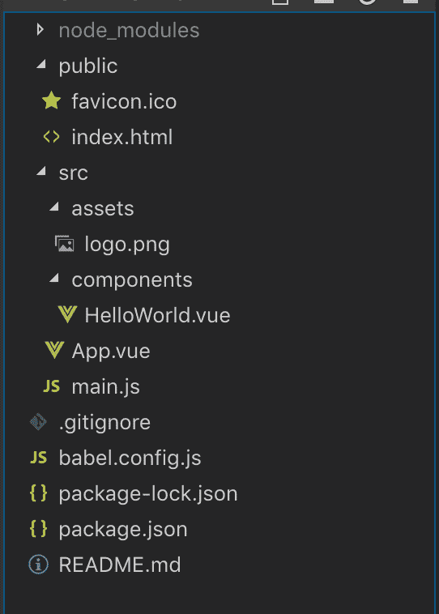

# Vue.js - LogRocket 博客的 5 个有用的开发工具

> 原文：<https://blog.logrocket.com/5-useful-development-tools-for-vue-js/>

2014 年，Vue.js 开始在主要由 Angular 和 React 主导的领域竞争。快进到 2018 年，Vue 在 Github 上获得的星星比后者多。虽然星计数并不意味着使用，它多少意味着兴趣，在 Vue 的例子中，考虑到它的强大和相对简单，这是非常合理的。

虽然使用 Vue 无疑是一种乐趣，但有时开发人员需要部署某些额外的工具来帮助他们跟上框架的速度，并使用它高效地构建应用程序。本文揭示了五种工具来做到这一点。

## 1.CLI 视图

[Vue 命令行界面(CLI)](https://cli.vuejs.org/) 是搭建 Vue 应用的标准工具。作为一个搭建工具，Vue CLI 可以防止您花费过多的时间从零开始组装应用程序的各种依赖项，并为您的项目创建一个结构。

客观地说，Vue CLI 在决定你希望你的应用程序由什么组成时，把你放在了驾驶座上。

`vue create`是为您搭建 Vue 应用程序的命令。一开始，您可以选择预设:



预设是基于这样的假设提供的，即你可能想让你的应用程序尽可能快地启动并运行，而不会被太多的细节所困扰。

`js`预置安装了一个`vue-router`(用于创建单页面应用程序)`vuex`(Vue 的状态管理模式和库)`dart-sass`(CSS 预处理程序 sass 的主要实现)`babel`(用于编译 ES6 代码以兼容旧浏览器)和`eslint`(一个 JavaScript linter)。

然而，您可以选择使用**默认**，它只提供上述组件中的两个，或者**手动选择特性**，它将为每个组件提供替代选项。

如果您喜欢在 GUI 中工作而不是在终端上工作，那么您很幸运:Vue CLI 3 附带了一个 GUI，使您的应用程序更容易搭建和管理。在终端中输入`vue ui` 会让你被下面的惊叹宠坏。



毫无疑问:Vue CLI 3 的 GUI 没有任何终端上没有的特殊功能；通过使这些功能更容易获得，它只会使生活变得更简单。

## 2.vue . js devtools

作为开发人员——更重要的是，作为人类——我们容易犯错，因此需要跟踪应用程序中的错误或异常的方法。说到 Vue 应用， [Vue.js devtools](https://github.com/vuejs/vue-devtools) 已经被证明是这样做的标准。

作为一个调试工具，Vue devtools 作为一个扩展出现在许多浏览器上，它允许你通过简单地访问包含 Vue 代码的网页来轻松地调试 Vue 代码。

在你的浏览器上安装了 Vue devtools 扩展之后，你会在你的搜索栏旁边发现一个 Vue 图标，它表示在给定的网页上是否有 Vue 代码。图标变亮或变暗表示这一点。

为了让你的 Vue 代码可以被 Vue devtools 调试，你必须使用 **Vue.config.devtools = true 从你的代码中授予后者明确的权限。**完成后，浏览器开发者菜单上的 Vue 标签将会出现。

基本上，Vue devtools 把你的 Vue 应用程序分解成它的核心要素，让你深入了解每一步都发生了什么。您将能够查看您启用的 Vue 组件和其中的数据(及其状态);Vuex 存储中定义的状态和触发的突变；你的应用程序的性能；和其他事情。

## 3.网络包

当构建一个只有几个页面的简单 Vue 应用程序时，您可能只需要在 HTML 文件的 JS 脚本中编写 Vue 代码的基本设置/过程就可以了。但是，当您更进一步，准备创建需要在至少两个页面上重用的组件时，这种基本设置就变得很麻烦了。

如上图所示，重用组件的诱惑正是单文件组件(sfc)的目标。

请注意:运行`vue create`实际上提供了 sfc，因为您将能够与。vue 文件。



在上面的图片中，我们在`App.vue`组件中使用了一个`HelloWorld.vue`组件，该组件又被`main.js`声明用于渲染。它看起来像这样:

```
import Vue from 'vue'
import App from '/App.vue'

Vue.config.productionTip = false

new Vue({
  render: h => h(App),
}).$mount('#app')
```

`main.js`包含纯 Vue 代码，它应该在我们的网页上呈现 Vue 组件。然而，浏览器无法从这段代码中实现所需的组件。这就是网络包派上用场的地方。

毫无疑问:webpack 本身并不是使单页面应用程序可行的灵丹妙药。一个典型的用于 vue 的 webpack 模板带有像 Babel、vue-loader 和 vue-template-compiler 这样的依赖项，用于将 Vue 代码编译成 JavaScriptcss-loader 和 vue-style-loader，用于操作。vue 文件；和其他组件。

webpack 所做的是将所有这些组装成一个整体，创建一个依赖图，然后提供一个输出 JS 文件，其中包含我们需要的所有编译代码。

因此，让我们说，我们没有用`vue create ,`来搭建我们的 Vue 应用程序，而是用一个 webpack 模板，使用`vue init webpack-simple` 。

我们将获得额外的文件，包括一个存放我们的配置的`webpack.config.js`和一个位于`dist`文件夹中的`build.js`，后者是从 webpack 构建中得到的输出文件。启用获取这个输出文件的过程使得 webpack 在 Vue 开发中非常有用。

## 4.Nuxt.js

要了解 [Nuxt.js](https://github.com/nuxt/nuxt.js) ，首先要认识到它的必要性。首先，Nuxt 是在 Vue 应用上实现服务器端渲染(SSR)的一个巨大飞跃。为了理解为什么 SSR 是一个问题，让我们简单地了解一下为什么客户端渲染并不总是令人满意的。

使用客户端呈现，我们(开发人员和用户)在客户端(我们的浏览器)的支配下获取、最初操作和呈现数据。因此，在页面加载时间和获取并显示必要数据所需的时间之间总是有一个滞后。

除了这个过程对用户体验有害之外——特别是对于慢速连接——它对 SEO 也是不利的，因为爬行器在爬行网页时不能索引内容。

因此，Nuxt 可以被认为是解决 Vue 上客户端渲染不足的官方实现工具。[这篇文章](https://blog.logrocket.com/building-server-rendered-apps-in-vue-using-nuxt-js-c12c6c253274)公正地回顾了 Nuxt 如何胜任地处理 SSR。

除了这个核心实用程序，Nuxt 还因静态站点生成而广为人知，在我看来，这是一个惊人的价值主张。在这种情况下，Nuxt 允许我们构建静态网页，而不需要部署服务器。它以一种特别简单的方式处理这个问题，并使路由变得轻而易举。

Nuxt 也可以作为构建轻量级 spa 的框架。在接下来的一篇文章中，我将通过构建一个功能性网站，带您了解探索 Nuxt 的过程。

## 5.视图虚拟对象

虽然有其他适合这种情况的开发工具，但 [vue-dummy](https://github.com/paulcollett/vue-dummy) 是我个人最喜欢的工具之一。基本上，vue-dummy 是一个为我们的应用程序提供占位符文本和图像的库。它简化了生成占位符内容的过程，以至于我们几乎认为这是理所当然的。

要使用它，我们将从使用 npm 安装库开始，或者简单地将链接添加到我们的 HTML 页面:

```
npm install vue-dummy --save-dev
```

或者:

```
<script src="https://unpkg.com/vue-dummy"></script>
```

完成后，我们可以明确说明我们使用 vue-dummy 的意图:

```
Vue.use(VueDummy)
```

我们现在可以利用 vue-dummy 指令来呈现占位符文本。例如，要添加 300 个单词的占位符 Lorem ipsum 文本，我们只需编写如下内容:

```
<p v-dummy="300"></p>
```

同样，我们将使用``来生成一个 200×200 的占位符图像。

如前所述，很容易想当然地认为 vue-dummy 是有用的。我发现每当我用 Python 后端开发 web 应用程序时，它都有很大的帮助，因此不能利用 webpack 的热重载来即时查看我的前端代码的更改如何影响界面的总体外观。

无论你是开发一个静态还是动态的 web 应用，vue-dummy 都是一个可以快速开发 vue 应用的工具。

## 结论

Vue.js 很棒，很强大，但它仍然需要一些帮助，以使开发人员能够享受压力较小的生活。这篇文章列出了五个工具，它们将帮助每一个 web 开发人员用 Vue 创造出令人惊叹的用户界面和体验。

## 像用户一样体验您的 Vue 应用

调试 Vue.js 应用程序可能会很困难，尤其是当用户会话期间有几十个(如果不是几百个)突变时。如果您对监视和跟踪生产中所有用户的 Vue 突变感兴趣，

[try LogRocket](https://lp.logrocket.com/blg/vue-signup)

.

[](https://lp.logrocket.com/blg/vue-signup)[https://logrocket.com/signup/](https://lp.logrocket.com/blg/vue-signup)

LogRocket 就像是网络和移动应用程序的 DVR，记录你的 Vue 应用程序中发生的一切，包括网络请求、JavaScript 错误、性能问题等等。您可以汇总并报告问题发生时应用程序的状态，而不是猜测问题发生的原因。

LogRocket Vuex 插件将 Vuex 突变记录到 LogRocket 控制台，为您提供导致错误的环境，以及出现问题时应用程序的状态。

现代化您调试 Vue 应用的方式- [开始免费监控](https://lp.logrocket.com/blg/vue-signup)。