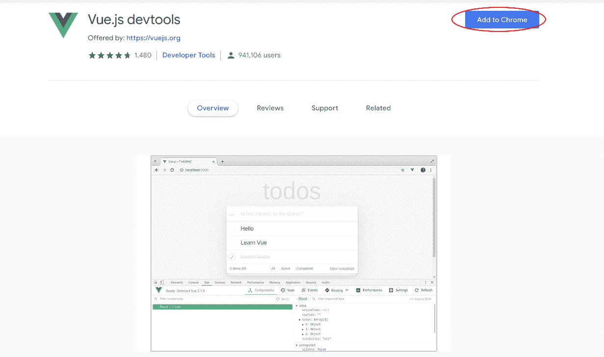
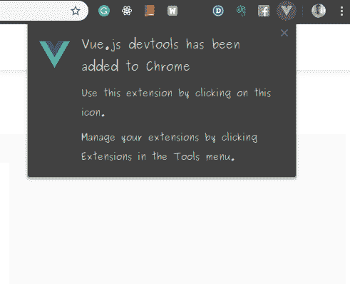
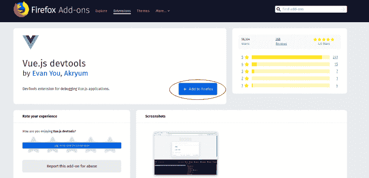
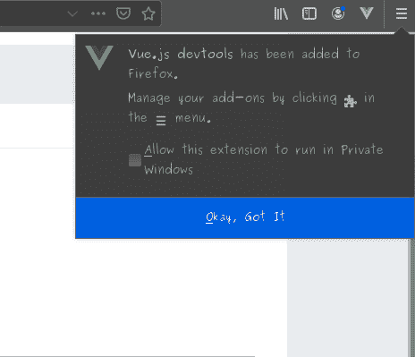
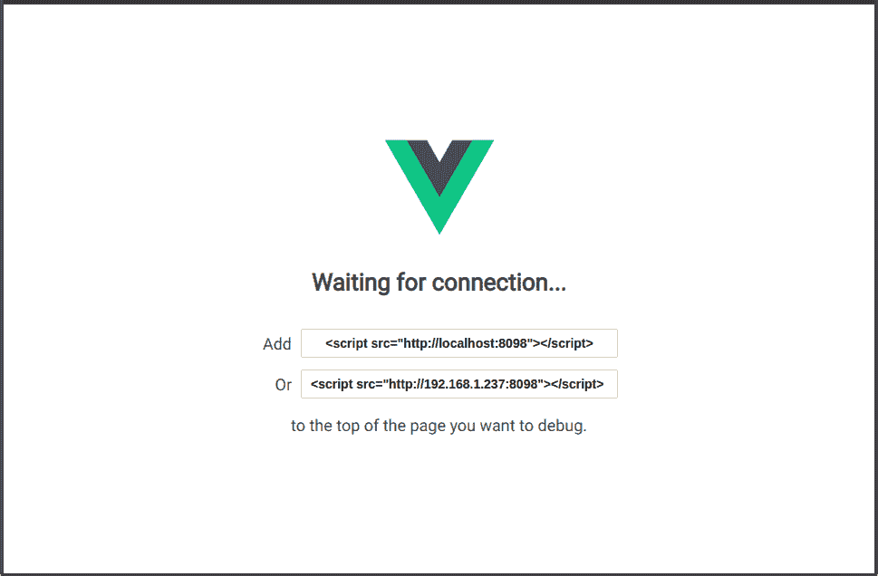
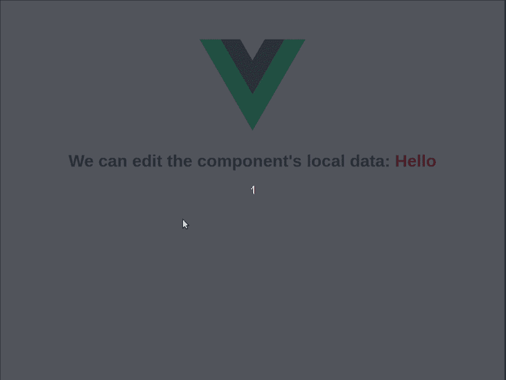
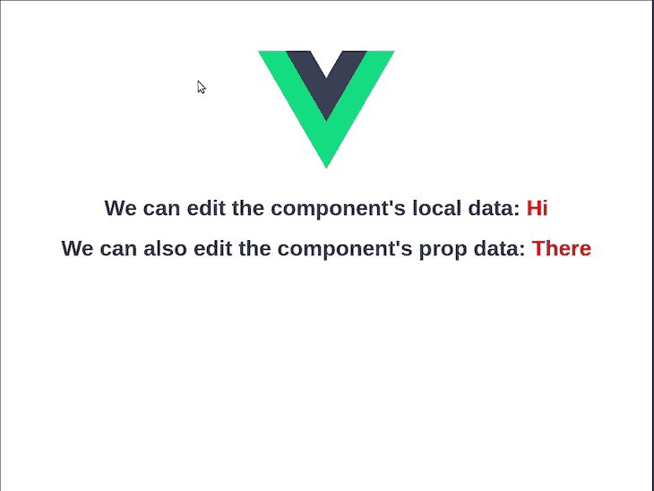
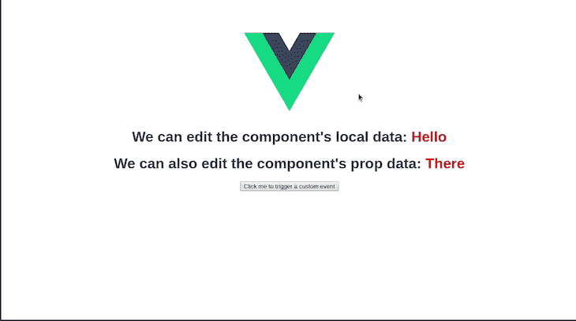
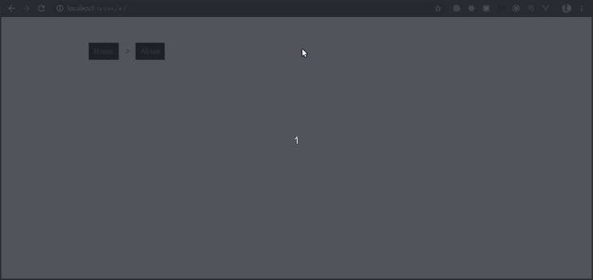

# 你应该使用的 5 个 Vue DevTools 技巧

> 原文：<https://blog.logrocket.com/5-vue-devtools-hacks/>

## 介绍

在选择用于开发 web 应用程序的 JavaScript 框架时，开发人员有一个令人印象深刻的列表可供选择。每个框架都有独特的优点和缺点。对于 Vue 来说，它的优势之一在于其 [DevTools](https://github.com/vuejs/vue-devtools) 的健壮性。

切换到新框架的 JavaScript 开发人员在运行时调试他们的应用程序时，可能会倾向于使用一般的方法(如[logging](https://developer.mozilla.org/en-US/docs/Web/API/Console/log)around)——虽然这并不坏，但使用特定于该框架的工具会更有效，因为它们提供了更专业的功能。

在本文中，我们将看看 Vue DevTools，并了解如何在运行时使用它来操作 Vue 应用程序，以获得更好的调试体验。

## 先决条件

要学习本教程，您需要在计算机上安装以下工具:

## 装置

基本上有三种安装 Vue DevTools 的方法:

*   作为 [Chrome](https://www.google.com/chrome/) 的扩展，
*   作为[火狐](https://www.mozilla.org/en-US/firefox/new/)的扩展，
*   作为独立的(电子)应用

从上面的列表中，我们可以看到 DevTools 作为 Chrome 和 Firefox 浏览器的自定义扩展只在可用[(如官方知识库所述)。其他浏览器的用户必须在他们的机器上安装独立的应用程序。](https://github.com/vuejs/vue-devtools)

### 如何为 Chrome 安装 Vue DevTools

*   在您的 Chrome 浏览器上访问此[页面](https://chrome.google.com/webstore/detail/vuedevtools/nhdogjmejiglipccpnnnanhbledajbpd):



*   点击**添加到 Chrome** 按钮。
*   弹出窗口显示时，点击**添加扩展名**

这将添加 Vue DevTools 作为 Chrome 扩展，并显示一个确认通知:



### 如何为 Firefox 安装 Vue DevTools

*   在您的 Firefox 浏览器上访问此[页面](https://addons.mozilla.org/en-US/firefox/addon/vue-js-devtools/):



*   点击**添加到 Firefox** 按钮
*   弹出窗口显示时，点击**添加**

这将添加 Vue DevTools 作为 Firefox 扩展，并显示一个确认通知:



### 如何将 Vue DevTools 安装为独立的(电子)应用程序

运行此命令以全局方式(使用 Npm)将 Vue Devtools 安装为独立应用程序:

```
npm install -g @vue/devtools
```

或者在本地作为项目依赖项:

```
npm install --save-dev @vue/devtools
```

我们也可以使用[纱线](https://yarnpkg.com/en/)在全球范围内安装:

```
yarn global add @vue/devtools
```

安装完成后，我们可以使用以下命令启动应用程序:

```
vue-devtools
```



这将打开独立的应用程序，您需要将此链接添加到您的应用程序的`index.html`文件中:

```
<script src="http://localhost:8098"></script>
```

等待独立应用程序重新加载，它会自动连接到您的 Vue 应用程序。

## 使用 Vue DevTools 的 5 种方法

Vue DevTools 使得在运行时调试 Vue 应用程序变得很容易，我们将看看使用 DevTools 插件进行调试的五种方式。

### 编辑组件数据

当使用 Vue 构建组件时，您可能想要尝试各种组件值或实时操作组件数据。更新 IDE 中的数据项，然后到浏览器中查看结果，这样做已经没有用了。

Vue DevTools 允许您实时编辑组件数据:

*   打开浏览器的开发工具，导航到 **Vue** 选项卡
*   在选项卡的左栏中选择您的组件
*   编辑选项卡右栏中的组件数据



*提示:你可以通过点击 CTRL+SHIFT+I(Mac 的 CMD)*来启动 Chrome DevTools

默认情况下，属性数据不可编辑，但我们可以通过在设置选项卡中启用它来使其可编辑。



有了这个特性，您可以编辑所有数据类型、切换布尔值和操作数组值。您还可以从远程 API 操作数据。只要数据已经加载到 Vue 应用程序中，就完全可以进行实时编辑。

### 在 DOM 中加载组件

Vue DevTools 允许你在 DOM 中加载定制组件的 HTML。这对于调试应用程序的 UI 非常有用。要在 DOM 中加载组件数据，导航到组件选项卡下的点击**检查 DOM** 选项:


在 **Inspect DOM** 选项旁边是**在编辑器中打开**选项，它在你的默认编辑器中打开选中的组件。不错！

### 跟踪自定义事件

您可以使用 DevTools 跟踪定制事件(使用`this.$emit('customEvent')`发出的事件)。这允许您查看您的事件是否被正确触发，并检查它们所承载的有效负载。

要跟踪自定义事件，请执行以下操作:

*   导航到事件选项卡
*   打开**录制(如果尚未打开)**
*   触发事件并观察它们的记录:



### 监控路线历史和数据

当使用 Vue 构建 SPA 应用程序时，您可能希望调试您的路线或者实时跟踪整个导航流程。Vue DevTools 有一个 **Routing** 选项卡，当您的应用程序从一条路线转换到另一条路线时，它会记录您的路线数据和历史。

“路由”选项卡有两个选项:

*   **历史**显示路线的导航历史及其数据
*   **路线**显示应用程序中的所有路线及其选项

要使用**路由选项卡**，请执行以下操作:

*   导航至**路由**选项卡
*   选择**历史(默认选择)**或**路线**
*   在路线间导航并观察记录:



### 调试 Vuex 行为和跨越先前状态的时间旅行

Vuex 是 Vue 的一个状态管理库，允许你以一种可预测的方式管理和改变你的应用程序的状态。Vue DevTools 允许您为了调试的目的实时检查状态。

Vue Devtools 有一个 **Vuex** 选项卡，每当 Vuex 调度一个突变时，它记录你的状态。如果状态开始以不可预知的方式运行，这将简化调试过程。还有一个功能可以让你实时穿越 Vuex 状态的以前版本。

以下是运行中的时间旅行调试功能:


## 结论

作为一名 web 开发人员，每天都在进步。随着简化开发过程的现代工具的出现，开发人员利用这些工具实现更快、更有效的工作流是有益的。

在本文中，我们探索了使用 Vue DevTools 进行更快、更有效调试的五种方法。我希望您能利用这些特性，并对您的 Vue 应用程序有更好的调试体验。

## 像用户一样体验您的 Vue 应用

调试 Vue.js 应用程序可能会很困难，尤其是当用户会话期间有几十个(如果不是几百个)突变时。如果您对监视和跟踪生产中所有用户的 Vue 突变感兴趣，

[try LogRocket](https://lp.logrocket.com/blg/vue-signup)

.

[](https://lp.logrocket.com/blg/vue-signup)[https://logrocket.com/signup/](https://lp.logrocket.com/blg/vue-signup)

LogRocket 就像是网络和移动应用程序的 DVR，记录你的 Vue 应用程序中发生的一切，包括网络请求、JavaScript 错误、性能问题等等。您可以汇总并报告问题发生时应用程序的状态，而不是猜测问题发生的原因。

LogRocket Vuex 插件将 Vuex 突变记录到 LogRocket 控制台，为您提供导致错误的环境，以及出现问题时应用程序的状态。

现代化您调试 Vue 应用的方式- [开始免费监控](https://lp.logrocket.com/blg/vue-signup)。