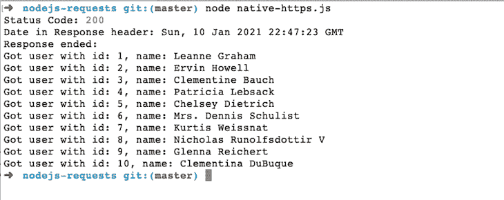
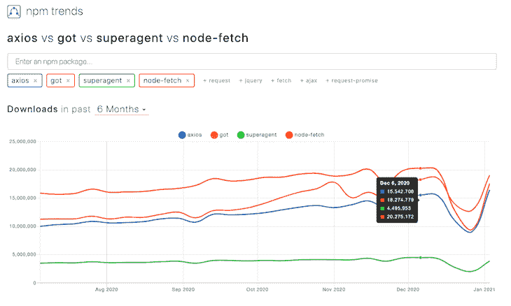

# 在 Node.js - LogRocket 博客中进行 HTTP 请求的 5 种方法

> 原文：<https://blog.logrocket.com/5-ways-to-make-http-requests-in-node-js/>

## 介绍

在 Node.js 中有多种方法可以发出 HTTP 请求。当然，我们可以使用标准的 HTTP/HTTPS 模块，或者我们可以使用许多 npm 包中的一个，这使我们的生活更加轻松。

在这篇文章中，我们将看到 Node.js 安装中内置的本机 HTTPS 模块的代码示例，以及 Axios、Got、SuperAgent 和 node-fetch 等 npm 包。让我们开始吧！

[https://www.youtube.com/embed/kgFDKx8dj5A](https://www.youtube.com/embed/kgFDKx8dj5A)

视频

### 先决条件

在我们深入描述和代码之前，下面是您需要使用一些 Node.js 代码的一些先决条件，包括调用远程模拟 JSON API:

*   您应该在您的机器上运行 Node.js】可能作为 Docker 容器)。所有示例都将使用 Node.js 14.x(活动 LTS)运行
*   您熟悉像`npm init`这样的 npm 命令，并且能够使用`npm install --save <module-name>`将 npm 包安装到项目中
*   您可以在命令行上运行带有`node <filename>`的 JavaScript 文件来查看示例输出
*   你熟悉[回调、承诺和异步/等待](https://blog.logrocket.com/evolution-async-programming-javascript/)

基本的东西，但最好在继续下一步之前进行检查🙂

### 我们将使用的示例

我们将通过调用来自 [JSONPlaceholder](https://jsonplaceholder.typicode.com/users) 模拟 API 的数据，用所有 HTTP 客户端选项创建一个 GET 请求示例。它将向我们发回 10 个用户的数据。我们将打印出每个用户的姓名和用户 ID。

所有的代码将作为一个单独的拉请求。你可以在 [GitHub](https://github.com/geshan/nodejs-requests) 上看到这个开源仓库中收集的所有代码示例。第一个例子是基于回调的，接下来的两个例子是基于承诺的，最后两个例子使用 async/await。

## Node.js 中 HTTP 请求的客户端选项

我们将通过五个选项对占位符 API 进行 GET HTTP 调用。Node.js 有内置模块来执行许多与 HTTP(S)相关的操作，其中之一就是能够进行 HTTP 调用。让我们从 Node.js 自带的本地 HTTP(S)选项开始，作为我们的第一个例子。

### 标准 Node.js HTTP(S)模块

Node.js 附带了标准库中的 [HTTP](https://nodejs.org/api/http.html) 和 [HTTPS](https://nodejs.org/api/https.html) 模块。对于我们的例子，因为它是一个 HTTPS URL，我们将使用 HTTPS 模块来执行 GET 调用。下面是代码示例:

```
const https = require('https');

https.get('https://jsonplaceholder.typicode.com/users', res => {
  let data = [];
  const headerDate = res.headers && res.headers.date ? res.headers.date : 'no response date';
  console.log('Status Code:', res.statusCode);
  console.log('Date in Response header:', headerDate);

  res.on('data', chunk => {
    data.push(chunk);
  });

  res.on('end', () => {
    console.log('Response ended: ');
    const users = JSON.parse(Buffer.concat(data).toString());

    for(user of users) {
      console.log(`Got user with id: ${user.id}, name: ${user.name}`);
    }
  });
}).on('error', err => {
  console.log('Error: ', err.message);
});

```

让我们浏览一下代码。首先，我们需要`https`标准节点模块，它在 Node.js 安装中可用。不需要一个`package.json`文件或任何`npm install --save`来运行它。

然后，我们用`get`方法调用我们的 JSONPlaceholder URL，它有一个回调函数，提供我们放在`res`变量中的响应。

接下来，我们将`data`初始化为一个空数组，之后，我们从 respone 的头部记录状态代码和日期。随后，每当我们获取数据时，我们就将数据块推送到数据数组。

然后，在响应端，我们连接数组数据，将其转换为字符串，并解析 JSON 以获得 10 个用户的列表作为对象数组。因此，我们遍历这 10 个用户，一次记录一个用户对象的 ID 和名称。

这里需要注意一点:如果请求有错误，错误消息会记录在控制台上。以上代码可作为[拉取请求](https://github.com/geshan/nodejs-requests/pull/1)供您参考。

由于 HTTPS 是一个标准的 Node.js 模块，所以不需要一个`package.json`——我希望我可以对我的一些 Node.js 项目这样说。

您可以简单地用`node native-https.js`运行代码，只要您将文件命名为`native-https.js`。它应该显示如下所示的输出:



你可以用同样的方法运行这篇文章中的所有其他例子；当我们打印状态代码、来自响应头的日期以及来自响应体的用户 ID 和名称时，它们将显示类似的输出。

接下来要探索的是 Axios npm 包——为此，我们需要一个`package.json`文件。是时候看看怎么做了。

### 阿克斯

Axios 是一个非常流行的基于承诺的请求库。它是一个 HTTP 客户端，可用于 browser 和 Node.js。它还包括一些方便的特性，如拦截请求和响应数据，以及自动将请求和响应数据转换为 JSON 的能力。

我们可以使用以下命令安装 Axios:

```
npm install --save axios

```

然后我们就可以开始用了。让我们看看用 Axios 调用模拟用户 JSON API 的例子:

```
const axios = require('axios');

axios.get('https://jsonplaceholder.typicode.com/users')
  .then(res => {
    const headerDate = res.headers && res.headers.date ? res.headers.date : 'no response date';
    console.log('Status Code:', res.status);
    console.log('Date in Response header:', headerDate);

    const users = res.data;

    for(user of users) {
      console.log(`Got user with id: ${user.id}, name: ${user.name}`);
    }
  })
  .catch(err => {
    console.log('Error: ', err.message);
  });

```

如您所见，这里的代码比前面的例子少。它是基于承诺的，而不是面向回调的，所以如果您愿意，可以很容易地将这段代码转换成 async/await 格式。

让我们解释一下代码示例在做什么。首先，我们需要`axios`库，然后我们用`axios.get`调用 JSONPlaceholder 用户 API(这是基于承诺的)。

我们使用`then`方法在解析承诺时获得结果，并获得作为`res`变量的响应对象。在`then`方法中，我们从响应头记录状态代码和日期。

由于 Axios 的自动转换，我们可以通过`res.data`轻松地获得 JSON 数据作为数组。因此，我们遍历用户，记录 ID 和名称。如果出现任何错误，我们会在控制台上记录错误消息。代码示例也可以作为[拉请求](https://github.com/geshan/nodejs-requests/pull/3/files)来访问。

接下来，我们将看看另一个流行且功能丰富的库，Got。

### 得到

[Got](https://www.npmjs.com/package/got) 是另一个流行的 Node.js 的 HTTP 请求库，它自称是一个“人性化的、强大的 Node.js 的 HTTP 请求库”，它还具有基于 promise 的 API，HTTP/2 支持及其分页 API 都是 Got 的 USPs。目前，Got 是 Node.js 最受欢迎的 HTTP 客户端库，每周下载量超过 1900 万次。

我们可以用下面的命令安装 Got:

```
npm install --save got

```

下面是一个使用 Got 从我们的模拟 API 获取用户的快速示例:

```
const got = require('got');

got.get('https://jsonplaceholder.typicode.com/users', {responseType: 'json'})
  .then(res => {
    const headerDate = res.headers && res.headers.date ? res.headers.date : 'no response date';
    console.log('Status Code:', res.statusCode);
    console.log('Date in Response header:', headerDate);

    const users = res.body;
    for(user of users) {
      console.log(`Got user with id: ${user.id}, name: ${user.name}`);
    }
  })
  .catch(err => {
    console.log('Error: ', err.message);
  });

```

这个代码示例与 Axios 非常相似，但是有两个主要区别:

1.  我们需要将`{responseType: 'json'}`作为第二个参数传递，以表明响应是 JSON 格式的。
2.  状态代码头被称为`statusCode`，而不是`status`。

其他事情基本上与之前对 Axios 的要求相同。这个例子也可以在这个[拉取请求](https://github.com/geshan/nodejs-requests/pull/4/files)中看到。

接下来，我们将了解 Superagent。

### 超级代理

VisionMedia 的 SuperAgent 是最老的 Node.js 请求包之一，于 2011 年 4 月在 T2 发布。作为 Node.js 的强大 HTTP 库，SuperAgent 将自己标榜为“具有相同 API 的小型、渐进式客户端 HTTP 请求库和 Node.js 模块，支持许多高级 HTTP 客户端功能。”它提供了基于回调和基于承诺的 API。对于一个基于 promise 的 API，使用 async/await 只是在它上面的一些语法糖。

SuperAgent 还具有一系列[插件](https://github.com/visionmedia/superagent#plugins)，范围从无缓存到测量 HTTP 计时。

我们可以使用以下命令安装 SuperAgent:

```
npm install --save superagent

```

让我们看看 SuperAgent 的示例用户 API 调用是什么样子的。为了提供一些多样性，我们将使用 async/await 来说明与基于承诺的示例相比的立即调用函数表达式(life)(T0 ):

```
const superagent = require('superagent');

(async () => {
  try {
    const res = await superagent.get('https://jsonplaceholder.typicode.com/users');
    const headerDate = res.headers && res.headers.date ? res.headers.date : 'no response date';
    console.log('Status Code:', res.statusCode);
    console.log('Date in Response header:', headerDate);

    const users = res.body;
    for(user of users) {
      console.log(`Got user with id: ${user.id}, name: ${user.name}`);
    }
  } catch (err) {
    console.log(err.message); //can be console.error
  }
})();

```

让我们进一步检查我们是如何使用 SuperAgent 完成请求的。我们需要`superagent`库来进行我们的测试 HTTP GET 调用。我们用`async`开始生命，因为我们想要使用 await，正如在下一点中提到的。

* * *

### 更多来自 LogRocket 的精彩文章:

* * *

接下来，在`try`块中，我们用`await`调用了`superagent.get`，这将解析承诺并给我们模拟用户 API 的 HTTP 调用结果。然后，从`res`变量中，我们挑选出来自`res.headers`的日期，并在控制台上记录状态和日期。

之后，我们将响应体设置在`users`常量中，并遍历由 10 个用户组成的数组，打印出每个用户的姓名和 ID。因此，有一个`catch`块；如果在`try`块的任何地方出现任何错误，它将被捕获，并且错误信息将被记录到控制台。

SuperAgent 成熟且久经考验，因此非常可靠。我们还可以使用 [SuperTest](https://github.com/visionmedia/supertest) 测试 SuperAgent 调用，这本身就是一个非常方便的库。像上面的例子一样，SuperAgent 代码可以作为[拉请求](https://github.com/geshan/nodejs-requests/pull/5/files)获得。

现在让我们看看节点获取。

### 节点提取

[node-fetch](https://www.npmjs.com/package/node-fetch) 是 Node.js 的另一个非常受欢迎的 HTTP 请求库——根据 [npm 趋势](https://www.npmtrends.com/node-fetch)，在 2020 年 12 月的第一周，它被下载了超过 2000 万次。

用他们自己的话说，“node-fetch 是一个轻量级模块，它将 Fetch API ( `window.fetch`)引入 Node.js，”它的特性包括与基于浏览器的`window.fetch`以及本机 promise 和异步函数保持一致。

我们可以用下面的命令安装 node-fetch:

```
npm install --save node-fetch

```

接下来，让我们看看如何使用 node-fetch 来调用我们的模拟用户 API。这个例子也将使用 async/await 来保持简单:

```
const fetch = require('node-fetch');

(async () => {
  try {
    const res = await fetch('https://jsonplaceholder.typicode.com/users');
    const headerDate = res.headers && res.headers.get('date') ? res.headers.get('date') : 'no response date';
    console.log('Status Code:', res.status);
    console.log('Date in Response header:', headerDate);

    const users = await res.json();
    for(user of users) {
      console.log(`Got user with id: ${user.id}, name: ${user.name}`);
    }
  } catch (err) {
    console.log(err.message); //can be console.error
  }
})();

```

让我们回顾一下与使用 SuperAgent 和 async/await 的示例相比的一些不同之处:

1.  `fetch`不需要显式的 GET 方法；HTTP 动词可以作为第二个参数中的一个`method`键发送，第二个参数是一个对象。例如:`{method: 'GET'}`
2.  另一个区别是，header 是一个对象，用一个`get`方法来获取 header 值。我们调用了`res.headers.get('date')`来获取日期响应头的值
3.  最后的区别是需要解开一个承诺，以 JSON 和`await res.json()`的身份获得身体。这似乎有点额外的工作，但这就是浏览器获取 API [响应](https://developer.mozilla.org/en-US/docs/Web/API/Body/json)的工作方式。

与上面所有的例子一样，这段代码也可以作为一个[拉请求](https://github.com/geshan/nodejs-requests/pull/6/files)供您参考。

现在是时候比较一下我们刚刚复习过的四个库了。

## 节点 HTTP 请求方法的快速比较

除了 HTTP/HTTPS 标准节点模块，Node.js 的所有其他四个 HTTP 客户端库都作为 npm 包提供。下面是过去六个月他们每周的下载统计，通过 [npm trends](https://www.npmtrends.com/axios-vs-got-vs-superagent-vs-node-fetch) :



在周下载量方面，node-fetch 最受欢迎，SuperAgent 在过去六个月中最不受欢迎。让我们仔细检查一些其他指标，以便更好地了解这些竞争者中的受欢迎程度，这要归功于 Got GitHub repo 上的[比较表](https://github.com/sindresorhus/got#comparison):

| **轴** | **拿到了** | **超级代理** | **节点获取** | **GitHub 明星** |
| 80.55 万 | 8.81 千 | 15.49 千 | 5.92 万 | **安装尺寸** |
| 388kB | 1.32 兆字节 | 1.70 兆字节 | 155kB | **npm 下载量(每周)** |
| 16.46 米 | 19.06 米 | 3.90 米 | 17.58 米 | 从上表可以看出，node-fetch 是下载最多的包。SuperAgent 的安装大小最大，为 1.70MB，Axios 的 GitHub stars 最多，为 80.55K，超过了其他三个库的总和。 |

结论

## 几年前我相当广泛地使用过 SuperAgent 之后我转到了 Axios。凭借其长长的功能列表，我想在不久的将来尝试一下。尽管 node-fetch 看起来很有前途，安装规模也很小，但我不确定这个 API 是否足够用户友好——至少对我来说是这样。

你可能注意到我没有提到[请求](https://www.npmjs.com/package/request) npm 包。尽管 Request 仍然超受欢迎(每周 2236 万次下载)，但截至 2020 年 2 月 11 日，它将被[完全弃用](https://github.com/request/request#deprecated)，所以使用一个弃用的库没有意义。

所有这些图书馆主要做同样的事情——就像你更喜欢哪个品牌的咖啡，最终，你还是在喝咖啡。根据您的使用案例做出明智的选择，并做出正确的权衡以获得最大收益。

200 只显示器出现故障，生产中网络请求缓慢

## 部署基于节点的 web 应用程序或网站是容易的部分。确保您的节点实例继续为您的应用程序提供资源是事情变得更加困难的地方。如果您对确保对后端或第三方服务的请求成功感兴趣，

.

[try LogRocket](https://lp.logrocket.com/blg/node-signup)

LogRocket 就像是网络和移动应用程序的 DVR，记录下用户与你的应用程序交互时发生的一切。您可以汇总并报告有问题的网络请求，以快速了解根本原因，而不是猜测问题发生的原因。

[](https://lp.logrocket.com/blg/node-signup)[https://logrocket.com/signup/](https://lp.logrocket.com/blg/node-signup)

LogRocket 检测您的应用程序以记录基线性能计时，如页面加载时间、到达第一个字节的时间、慢速网络请求，还记录 Redux、NgRx 和 Vuex 操作/状态。

.

[Start monitoring for free](https://lp.logrocket.com/blg/node-signup)

.