# 6 个用于颜色生成的 JavaScript 工具

> 原文：<https://blog.logrocket.com/6-javascript-tools-color-generation/>

没有颜色的世界会是什么样子？也许是黑白配一点灰色。相当平淡。

颜色刺激大脑——它们会影响你的思考方式和决策。一种颜色或一组颜色可以构成身份的一部分。想想与谷歌相关的红色、黄色、绿色和蓝色。

所有这些都说明为你的项目选择正确的颜色是非常重要的。颜色发生器出现了。

颜色生成器用于为您的 web 项目制作调色板。在本帖中，我们将讨论六种独特的颜色生成器以及如何使用它们:莱昂纳多、Dopely Colors、iColorPalette、合理的颜色、OSCS 和简单的颜色。

## 在项目中使用颜色的提示

在我们进入颜色生成器之前，让我们回顾一下为你的项目选择正确颜色的一些有用的技巧。在选定你想要的颜色之前，你需要做一些基本的研究。

首先，你要有一个主色。这是最能与你的品牌联系在一起的颜色。例如，我们都知道脸书的经典蓝色。你会希望这种颜色作为背景，或者出现在网站上所有重要的可见元素上。

接下来，你要选择互补色。至少要有两种颜色和主色搭配得很好。这主要可以用在文本上。

最后，考虑一下强调色。这些用于突出显示，如按钮、弹出窗口、行动号召等等。你会希望这些颜色和调色板上的其他颜色搭配得很好。

既然我们已经建立了这些技巧，让我们进一步深入到本文中将要涉及的六种颜色生成工具。

## 【男性名字】利奥纳多

Leonardo 是 Adobe 的开源、基于对比度的颜色生成工具，用于创建调色板。它是由内特·鲍德温创造的。

达芬奇是一个设计和工程工具。它以 JavaScript 模块的形式提供，包含一个图形用户界面(GUI ),用于创建 UI 的颜色主题、可视化的色标以及进行颜色分析。

在我们了解如何使用这个 web 界面之前，我们先来看看如何安装 Leonardo 的 JavaScript API。内特很乐意提供如何第一次使用达芬奇的详细说明。

### 入门指南

首先，将莱昂纳多安装到您的项目中。

```
npm i --save @adobe/leonardo-contrast-colors

```

接下来，将包导入到脚本中。列奥纳多有三个主要等级:`Theme`、`Color`和`BackgroundColor`。

使用 ESM(节点 v13)，我们可以:

```
import { Theme, Color, BackgroundColor } from '@adobe/leonardo-contrast-colors';

```

每个`Theme`由`Colors`和一个`BackgroundColor`组成。这三个类对于生成颜色主题非常重要。主题是一个总体的上下文或环境，它将处理诸如生成的颜色的整体亮度、饱和度或对比度之类的事情。

首先，你需要创建你的颜色。让我们从红色开始，假设您需要它来显示错误消息。

```
const red = new Color();

```

`Color`类由三个主要参数构成:你的颜色的`name`、
、`ratios`。这个名字很简单，所以我们现在可以添加它。它将用于最终生成的颜色名称。

```
const red = new Color({
                name: 'red' 
                });

```

每个`Color`和`BackgroundColor`将在幕后为您的颜色创建一个完整的亮度或数值范围。这意味着它将创建你的颜色最暗的阴影(黑色)和最亮的色调(白色)。您可以使用一个或多个`colorKeys`来指定您想要的颜色。例如，最简单的用例是单独添加`#ff0000`。

```
const red = new Color({
                name: 'red',
                colorKeys: ['#ff0000']
                });

```

这将创建一个颜色函数或色阶，在以后生成输出颜色时可以调用它。

下一个要定义的参数是`ratios`。这些是你希望莱昂纳多从你的主色调中产生的对比度。对于大多数 web 应用程序，您会希望您的颜色与背景的比例为 3:1(对于 UI 元素和大文本)，与背景的比例为 4.5:1(对于小文本)。

```
const red = new Color({
                name: 'red',
                colorKeys: ['#ff0000']
                ratios: [3, 4.5]
                });

```

让我们假设你想用灰色(白色和深灰色)为你的颜色创建亮暗模式主题。为此，您需要以同样的方式创建一个`BackgroundColor`。

```
const gray = new BackgroundColor({
name: 'gray',
colorKeys: ['#000000']
ratios: [3, 4.5] // optional
});

```

现在我们有了一个`Color`和一个`BackgroundColor`，我们需要构建我们的主题。对于`colors`参数，我们将直接传递我们的新类实例作为常数，以及将常数`gray`传递给`backgroundColor`参数。

* * *

### 更多来自 LogRocket 的精彩文章:

* * *

```
const theme = new Theme({
colors: [red, gray],
backgroundColor: gray
})

```

现在剩下的就是给出我们的主题上下文。主题亮度的定义范围是 0-100，0 代表黑色，100 代表白色。所以，如果你希望你的灯光主题是纯白色的背景，它看起来会像这样:

```
const theme = new Theme({
colors: [red, gray],
backgroundColor: gray,
lightness: 100
})

```

要检索生成的颜色，可以用几种方式访问它们:
作为一个键值对数组，或者作为一个带有额外的
元数据的结构化 JSON 对象。对于大多数 web 应用程序，键-值对输出是最有益的，因为您可以基于此输出轻松地生成自定义 CSS 属性:

```
let lightThemeColors = theme.contrastColorPairs;

```

这会返回以下颜色:

```
{
"background": "#ffffff",
"gray100": "#959595",
"gray200": "#767676",
"red100": "#fe5e5e",
"red200": "#ef0000
}

```

现在，如果你想要一个黑暗的主题，你需要做的就是设置你的`theme`类的亮度。我们将它设置为接近黑色的值 11。

```
theme.lightness = 11;
let darkThemeColors = theme.contrastColorPairs;
This will return dark theme colors:
{
"background": "#1d1d1d",
"gray100": "#686868",
"gray200": "#848484",
"red100": "#d20000",
"red200": "#fe2c2c
}

```

这一切都是在确保你的主题颜色符合为每个`Color`定义的最低对比度要求的同时进行的。其他参数的饱和度和对比度也可以修改。这可以降低整体色彩饱和度或增加/降低整体对比度。

莱昂纳多可以用来创建主题，让你修改你的用户界面的颜色。通过为你的`Theme`提供控制设置器的输入和利用 CSS 自定义属性，Leonardo 可以为广大视力正常的用户提供个性化的方法和更易访问的体验。

关于这种个性化方法的演示，请参见莱昂纳多官方网站上的演示。如果你想知道更多关于莱昂纳多入门的细节，可以查看他们主页上的 API 文档。

### 使用莱昂纳多的网络界面

现在你知道如何安装莱昂纳多，让我们来看看如何使用图形用户界面。有三个选项可用:自适应颜色主题、色标和颜色工具箱。您可以通过主页访问这些工具。

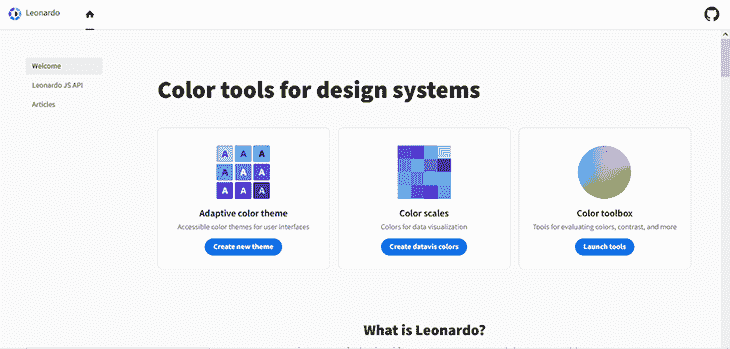

### 创建颜色主题

在主页上，你可以选择**自适应颜色主题**。这将打开一个工作区，你可以在这里选择你的主要颜色。灰色是默认颜色，但您可以选择编辑它或创建新的颜色。

点击默认颜色或**添加颜色**进入下一部分。

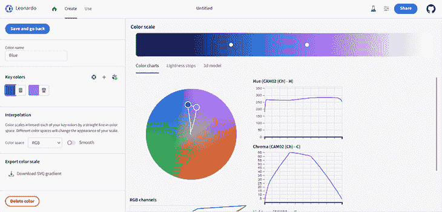

正如您所看到的，有一个可视化工具，它带有一个色标来显示诸如对比度、亮度等内容。选择颜色后，保存您的工作并返回到前一部分。在这里，你可以选择更多的关键颜色来完成主题。

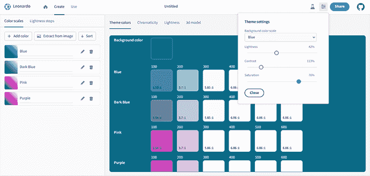

接下来，移动到**使用**部分。我们已经看到了如何安装达芬奇，所以现在我们只需要颜色。您可以在 JavaScript 参数、CSS 变量和设计标记之间进行选择。

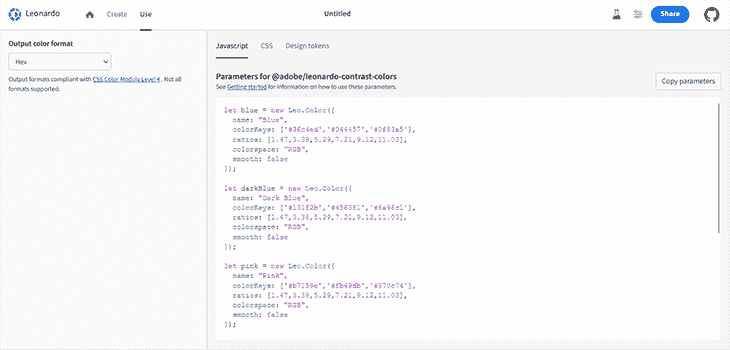

这就是创建和使用颜色主题！

### 色阶

当你看色标时，你可以看到主色是如何从暗变亮的。它还推荐了与你的主色调相配的其他颜色。

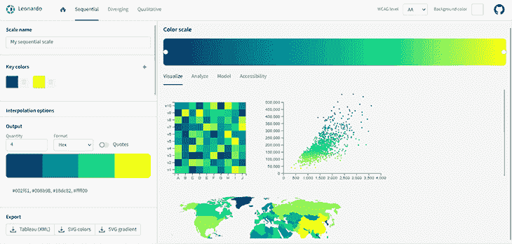

在这里，你可以比较两种颜色，看看他们是否兼容。还有一个将颜色转换成其他格式的转换器。

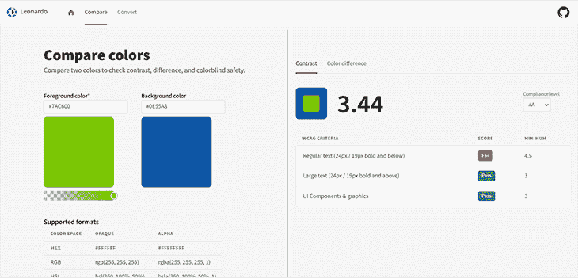

## 暗淡的颜色

Dopely 是一个纯粹的图形界面，有大量的工具。您可以使用它来创建调色板和渐变，查找颜色的名称，从图像中提取颜色，等等。如果你不能自己创建调色板，你可以探索现成的调色板和图像。

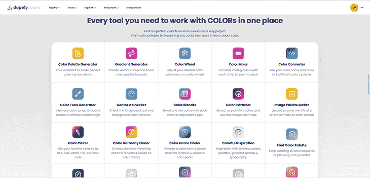

Dopely 可以作为[浏览器扩展安装在 Chrome](https://chrome.google.com/webstore/detail/dopely-colors/likjnedfkpkabglldlnelmochinjpbjm) 上。不清楚它是否能在其他浏览器上使用。

Dopely 的伟大之处在于它没有陡峭的学习曲线。您需要的一切都在那里，只需选择一个工具！您可以注册一个帐户，并保存您的调色板。

这个工具是列表中的第一个，它的名字是一个非常简单的描述。当您导航到这个部分时，您应该会看到五种随机的颜色。将鼠标悬停在这些颜色中的任何一种上会显示一些隐藏的特征。

以下是该视图的屏幕截图(在您关闭任何可能弹出的广告后):

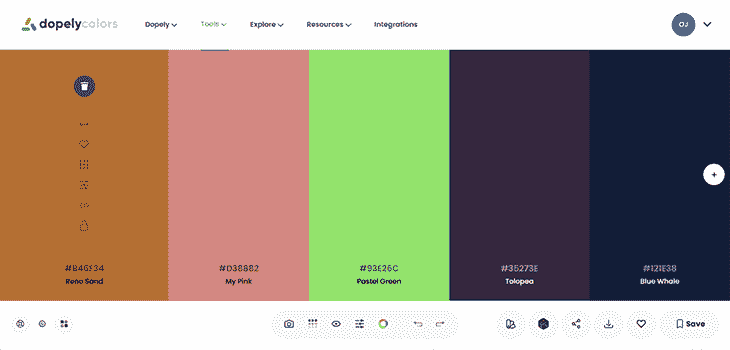

您会注意到的第一件事是，即使您将鼠标悬停在这些功能上，它们也不会被标注。通过试错和直觉的结合，你很可能能够弄清楚这些特性的功能，但是为了清楚起见，我们现在来看一下它们。

首先是垃圾桶，一个可以删除的通用图标符号。这将丢弃颜色。接下来，双箭头图标允许您移动颜色。下面是心形图标。这是用来喜欢和不喜欢的一种颜色。您可以在您的个人资料中找到您喜欢的颜色，只需在页面右上角的下拉菜单中点击**个人资料**。

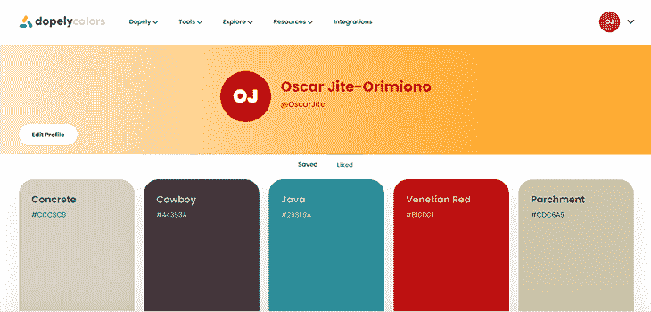

接下来，网格图标将颜色拆分为其淡色、色调和阴影。你可以在下面看到一个例子。

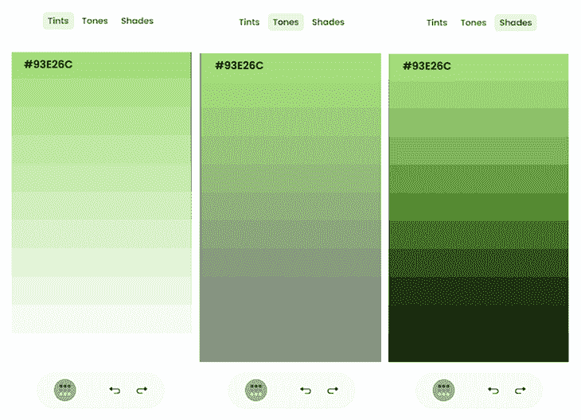

滑块图标打开一个颜色选择器。这使您可以手动选择一种颜色。接下来是代码图标，允许您以自己选择的格式复制颜色代码。最后，我们有锁定图标来锁定颜色。

现在，让我们来谈谈页面底部的图标。

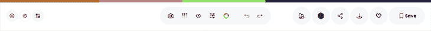

最左边的第一个图标看起来像一个沙滩球。它会打开调色板生成器工具的“关于”页面，详细介绍如何使用它。中间的齿轮图标允许您选择要显示的颜色格式。最后，最右边的图标会打开一个菜单，您可以在其中更改页面的布局。

现在来看看中间的图标功能。相机可以让你从图像中选择颜色。您可以选择自定义颜色，或者让该工具根据一些预定义的选项为您挑选颜色。

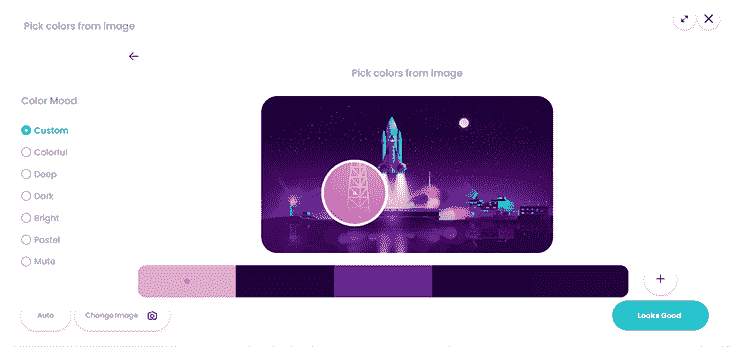

您可以移动镜头来选择图像部分的颜色。从左边的菜单中，您可以选择想要的颜色类型，让工具自动为您生成颜色。也许你只想要鲜艳的颜色。

回到特征。你可以通过点击眼睛图标来模拟色盲。有不同形式的色盲可供选择。

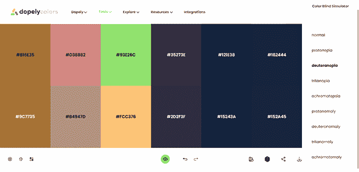

我们已经看到了网格图标可以做什么，这次它一次覆盖了所有的颜色。接下来，滑块功能允许您通过更改色调、饱和度、亮度和温度来调整调色板。

右边的最后一组图标分别用于检查您保存的调色板、随机切换颜色、共享调色板、下载调色板、喜欢和保存调色板。

大多数其他工具都包含在调色板生成器工具中。您可以尝试一些其他工具，如对比度检查器和渐变发生器。

## icolorpaletta

iColorPalette 与 Dopely Colors 非常相似，只是少了一些令人愉悦的美感和更多的广告。它提供了创建调色板、创建图像调色板或浏览调色板集合的选项。

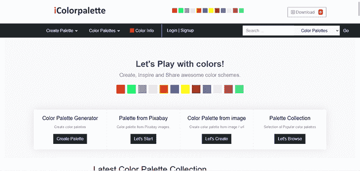

让我们看看它的调色板生成器，看看它是否能给 Dopely 一个机会。关闭(甚至更多)广告后，你会发现:

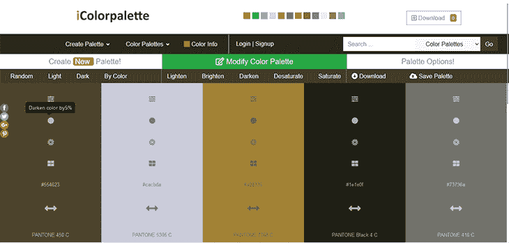

虽然 Dopely 在我看来领先，但 iColor 至少在标签上清楚地描述了每个特性的功能，这一点上得了一些分！

让我们尝试一些不同的东西——来自图像的**调色板工具。回到主页，点击链接，这是你会发现的截图。**

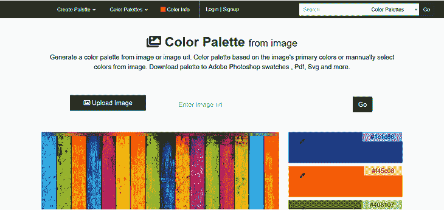

在顶部，您可以选择上传图片或输入图片链接。如果你向下滚动，你会发现图像的预览和从中生成的五色调色板。

现在，您可以通过单击任何颜色并在图像上拖动指针来编辑调色板，直到获得所需的结果。

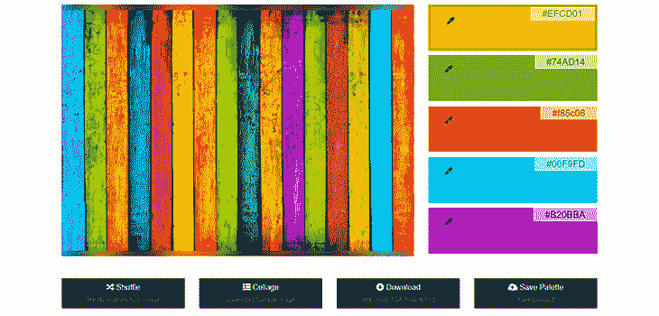

在它的正下方，你会找到一个选项来混合颜色，并从图像中生成另一组颜色。你也可以下载图像和颜色作为拼贴画。

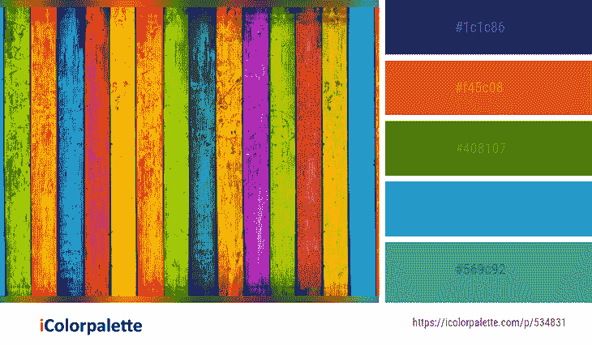

最后，有一个选项，以六种不同的格式保存颜色。您也可以保存调色板。

现在，最初的调色板产生了五种颜色，但仅仅看这张特定的图像就有五种以上的颜色。如果您想要图像中的所有颜色呢？好吧，我会保护你的。

进一步向下滚动，你会发现图像中的所有颜色！有几个下载选项，选择最适合你的格式。

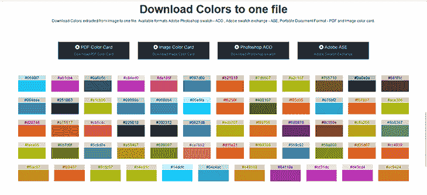

iColorPalette 的另一点。忽略所有的广告和粗糙的外观，这是一个相当不错的色彩生成工具。

## 合理的颜色

[合理的颜色](https://reasonable.work/colors/)是一个用于构建调色板的开源系统。它由马修·豪厄尔创建，其源代码可在 [GitHub](https://github.com/matthewhowell/reasonable-colors) 上获得。

就像列奥纳多一样，合理的色彩对色彩对比有很高的重视。与纯 JavaScript 的 Leonardo 不同，Reasonable 本质上是一个 CSS 颜色库。现在，让我们来看看如何在你的项目中使用它。

### 入门指南

合理的颜色既可以作为外部样式表链接，也可以用`npm`安装到项目中。

下面是 CSS 链接。

```
<link rel="stylesheet" href="https://unpkg.com/[email protected]/reasonable-colors.css">

```

然后我们通过终端进行`npm`安装。

```
npm install reasonable-colors

```

现在你有了一个不同颜色的库！您有用于`rgb`、`hsl`、`lch`和十六进制的样式表(CSS 和 SCSS)。您所要做的就是链接 HTML 文件中的相关样式表，并使用变量名来应用颜色。

还有不同颜色格式的外部样式表。默认的颜色格式是十六进制。这里分别是`hsl`、`rgb`和`lch`的链接。

```
<link rel="stylesheet" href="https://unpkg.com/[email protected]/reasonable-colors-hsl.css">

<link rel="stylesheet" href="https://unpkg.com/[email protected]/reasonable-colors-rgb.css">

<link rel="stylesheet" href="https://unpkg.com/[email protected]/reasonable-colors-lch.css">

```

合理颜色还附带默认颜色集，可在[中找到](https://reasonable.work/colors/)。它允许你检查这些颜色。

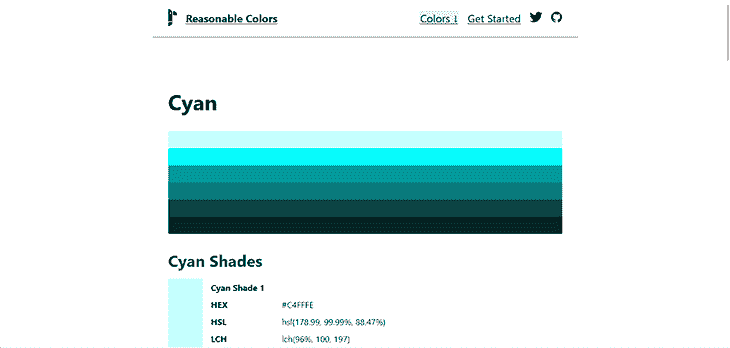

您可以看到颜色的不同颜色格式。您还可以预览同一颜色的不同色调。

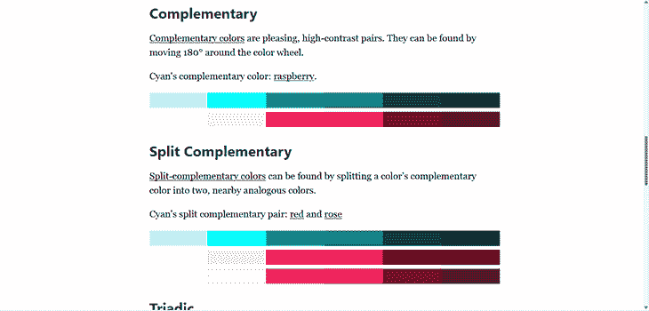

合理的色彩也向你展示了互补色。现在，由您来决定在设计网页样式时如何组合它们！

## OSCS

[OSCS](https://www.opensourcecolorsystem.design/) 是开源色彩系统的缩写。这是一个简单的系统，有各种精选的调色板可供选择。OSCS 还告诉你如何在不同的网页组件上使用这些颜色。

这是一个非常简单的网站！一旦你进入主页，前往**调色板**寻找颜色。在这里，你会发现为语义和口音选择的十个调色板。在未来的更新中，有一部分是为中性色和叠加色保留的。

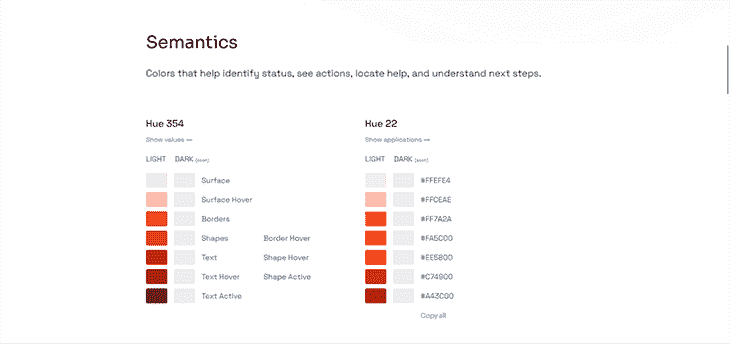

OSCS 还提供了一个工具 [ColorBox](https://colorbox.io/) 的链接，在这里你可以创建自定义调色板。这是一个很容易理解的工具。

左边有一个面板用于添加和命名颜色。最右边的面板允许你调整对比度、亮度和饱和度。中间可以预览颜色。

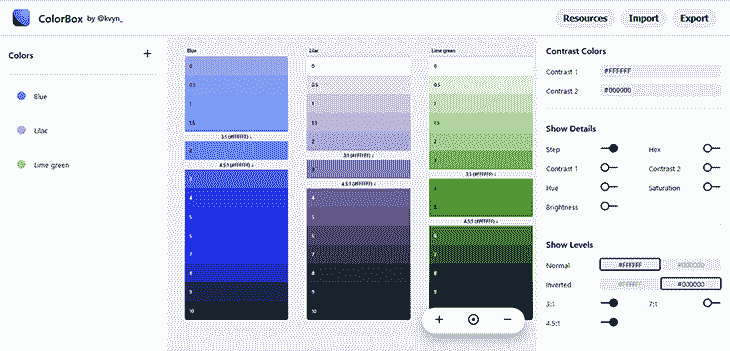

您还可以预览文本颜色。

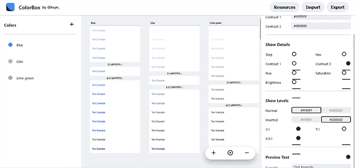

尝试直到你得到你喜欢的，然后你可以导出调色板。

## 更简单的颜色

[更简单的颜色](https://github.com/arnelenero/simpler-color)是一个创建颜色系统的工具。它允许您为任何 JavaScript/TypeScript 项目实现自己的 CSS 兼容颜色系统，无论您使用什么平台、框架或 UI 库。

它适用于浏览器、服务器(节点)、移动设备(本地反应)和桌面设备(电子)。

### 入门指南

更简单的颜色托管在 GitHub 上。从`README`文件中，您将能够使用`npm`安装它。

首先，安装软件包。

```
npm install simpler-color

```

接下来，您可以构建调色板。有两种选择，第一种是自己定义你的基色或主色。

```
const baseColors = {
  primary: '#609E3F',
  secondary: '#5D745D',
  neutral: '#5E5F5A',
}

```

您也可以选择一种基色，系统将生成调色板的其余部分。

```
import { harmony } from 'simpler-color'

// Generate 5 harmonious base colors from your main brand color!
const baseColors = harmony('#609E3F')
```

末尾的数字控制颜色的明暗。这里有一个图表可以帮助你更好地理解它。

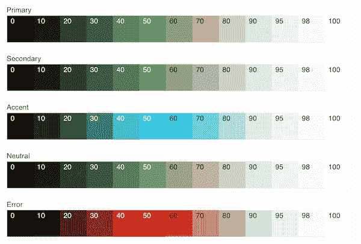

这些数字控制颜色的浓淡。[你可以在这里了解更多关于简单色彩的知识](https://github.com/arnelenero/simpler-color/blob/4c872ffa6f1fd92a55bbc05a49824b7b419446eb/README.md)。

现在你有了，六个用于颜色生成的 JavaScript(嗯，不是所有的 JavaScript)工具！为您的项目选择正确的颜色变得更加容易。

有些颜色发生器比其他颜色发生器更容易使用，而有些颜色发生器有某些缺点。以列奥纳多为例，立即创建和使用它很好，但是没有选项保存调色板供以后使用，也没有 cookies 来保存您的会话。想象一下，如果你准备好了 10 个色标，却不小心关闭了标签！

一些工具提供了拥有配置文件和保存调色板的选项。然而，可访问性提出了一个不同的问题，因为这些只是作为参考，不能直接在你的项目中使用。

也许你可以一起使用它们。您可以使用 Dopely 或 iColorPalette 保存您的颜色，并对莱昂纳多、合理的颜色或更简单的颜色使用相同的参数。这是双赢，你不觉得吗？

## 结论

艺术家总是手里拿着调色板。正是在这个调色板上，颜色被混合和匹配，创造出一个杰作！

颜色很重要，原因有很多——没有它们，我们的生活会变得平淡无奇。在这篇文章中，我们介绍了六种颜色工具，它们可以指导你设计下一个项目。

这个项目是你潜在的杰作，确保它脱颖而出！

## 您是否添加了新的 JS 库来提高性能或构建新特性？如果他们反其道而行之呢？

毫无疑问，前端变得越来越复杂。当您向应用程序添加新的 JavaScript 库和其他依赖项时，您将需要更多的可见性，以确保您的用户不会遇到未知的问题。

LogRocket 是一个前端应用程序监控解决方案，可以让您回放 JavaScript 错误，就像它们发生在您自己的浏览器中一样，这样您就可以更有效地对错误做出反应。

[](https://lp.logrocket.com/blg/javascript-signup)[https://logrocket.com/signup/](https://lp.logrocket.com/blg/javascript-signup)

[LogRocket](https://lp.logrocket.com/blg/javascript-signup) 可以与任何应用程序完美配合，不管是什么框架，并且有插件可以记录来自 Redux、Vuex 和@ngrx/store 的额外上下文。您可以汇总并报告问题发生时应用程序的状态，而不是猜测问题发生的原因。LogRocket 还可以监控应用的性能，报告客户端 CPU 负载、客户端内存使用等指标。

自信地构建— [开始免费监控](https://lp.logrocket.com/blg/javascript-signup)。