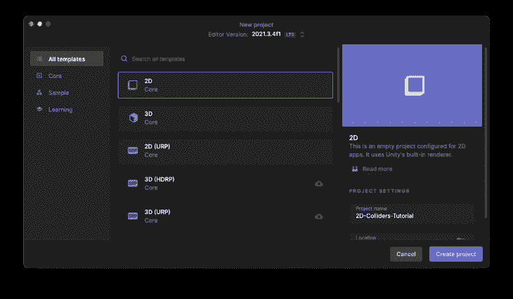
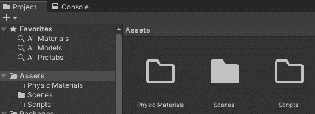

# 6 个现代 C#特性，让 Unity 代码更简洁

> 原文：<https://blog.logrocket.com/6-modern-c-sharp-features-cleaner-unity-code/>

从 C# 7.0 开始，许多帮助我们编写更少代码的代码改进已经被添加到语言中。本教程将重点介绍六个新特性，它们可以帮助我们编写更简洁易读的代码，以及我们如何在 Unity 的 C#上使用这些特性。

这些是教程部分:

## 先决条件

本教程需要满足以下先决条件:

*   统一的基本知识
*   以前在 Unity 中编写 C#脚本的经验

## 设置我们的 Unity 项目

首先，我们需要创建我们的 Unity 项目。对于本教程，我们将使用版本 2021.3.4f1，在我写这篇文章的时候，这是最新的 LTS Unity 版本。

在项目模板列表中，选择 **2D(核心)**(最简单的)，给它命名，然后点击**创建项目**按钮。



项目启动后，在`Assets`文件夹中创建一个名为`Scripts`的文件夹。在教程中，我们将使用它们来保持我们的项目有条理。



## 教程结构

对于如何使用新的 C#特性的每个示例，我们将首先看看以前是如何完成的，然后看看我们如何使用新特性编写更少、更可读的代码。

下面的类只是在整个教程的所有示例中使用的存根。您可以将它们添加到`Scripts`文件夹内的脚本中:

```
// GAME MODE.
public enum GameMode
{
    TimeAttack,
    Survive,
    Points
}

// ENEMIES.
public abstract class Enemy
{
    public bool IsVisible { get; set; }
    public bool HasArmor { get; set; }
}

public class Minion : Enemy { }
public class Troll : Enemy { }
public class Vampire : Enemy { }

public class Zombie : Enemy { }

// WEAPONS.
public abstract class Weapon { }
public class Stake : Weapon { }
public class Shotgun : Weapon { }
```

## Unity 中的 C#特性支持

在 C#版本 8 和 9 中，语言中加入了许多新特性。您可以在下面的链接中阅读每个版本的完整功能列表:

### Unity 中的 C# 8 和 c # 9 特性:缺少什么？

对 C# 8 的统一支持从版本 [2020.2](https://docs.unity3d.com/2020.2/Documentation/Manual/CSharpCompiler.html) 开始，C# 9 从版本 [2021.2](https://docs.unity3d.com/2021.2/Documentation/Manual/CSharpCompiler.html) 开始。

请注意，Unity 并不支持所有的 C# 8 和 c# 9 特性，比如:

*   默认接口方法
*   指数和范围
*   异步流
*   异步一次性
*   抑制发出局部初始化标志
*   协变返回类型
*   模块初始化器
*   非托管函数指针的可扩展调用约定
*   仅初始化设置器

这些不受支持的特性大多用于非常特殊的场景，比如非托管函数指针的[可扩展调用约定](https://docs.microsoft.com/en-us/dotnet/csharp/language-reference/proposals/csharp-9.0/function-pointers)，有些则不然，比如[索引和范围](https://docs.microsoft.com/en-us/dotnet/csharp/whats-new/csharp-8#indices-and-ranges)。

正因为如此，像索引和范围以及 init only setters 这样的特性可能会在 Unity 的未来版本中得到支持。然而，对于一个非常特殊的场景，一个不被支持的特性在未来获得 Unity 支持的机会比像[索引和范围](https://docs.microsoft.com/en-us/dotnet/csharp/whats-new/csharp-8#indices-and-ranges)这样的特性要小。

也许你可以找到一些变通方法来使用 Unity 中这些不支持的功能，但我不鼓励你这样做，因为 Unity 是一个跨平台的游戏引擎。新特性中的变通方法可能会导致难以理解、调试和解决的问题。

幸运的是，Unity 支持 C# 8 和 C # 9 中一些更常见的模式和表达式。让我们回顾下面一些最有帮助的方法，看看它们如何让我们写出更干净的代码。

## 开关表达式

switch 表达式可以极大地简化和减少 [LOC(代码行)](https://en.wikipedia.org/wiki/Source_lines_of_code)来生成`switch`，因为我们可以避免一堆样板代码，比如 case 和 return 语句。

*[文档提示](https://docs.microsoft.com/en-us/dotnet/csharp/whats-new/csharp-8#switch-expressions):开关表达式在表达式上下文中提供了类似开关的语义。当开关臂产生一个值时，它提供了一个简洁的语法。*

通常，switch 语句在其每个 case 块中产生一个值。开关表达式使您能够使用更简洁的表达式语法。重复的 case 和 break 关键字较少，花括号也较少。

### 以前

```
public string GetModeTitleOld(GameMode mode)
{
    switch (mode)
    {
        case GameMode.Points:
            return "Points mode";

        case GameMode.Survive:
            return "Survive mode";

        case GameMode.TimeAttack:
            return "Time Attack mode";

        default:
            return "Unsupported game mode";
    }
}

```

### 在...之后

```
public string GetModeTitleNew(GameMode mode)
{
    return mode switch
    {
        GameMode.Points => "Points mode",
        GameMode.Survive => "Survive mode",
        GameMode.TimeAttack => "Time Attack mode",
        _ => "Unsupported game mode",
    };
}
```

## 财产模式

属性模式使您能够匹配在`switch`表达式中检查的对象的属性。

正如您在下面的示例中看到的，使用属性模式，我们可以将一系列的`if`语句转换成 switch 语句上的对象应该匹配的简单属性列表。

`_ =>`与经典`switch`上的`default`含义相同。

*[单据提示](https://docs.microsoft.com/en-us/dotnet/csharp/whats-new/csharp-8#property-patterns):当表达式结果非空，且每个嵌套模式都匹配表达式结果对应的属性或字段时，属性模式匹配表达式。*

### 以前

```
public float CalculateDamageOld(Enemy enemy)
{
    if (enemy.IsVisible)
        return enemy.HasArmor ? 1 : 2;

    return 0;
}
```

### 在...之后

```
public static float CalculateDamageNew(Enemy enemy) => enemy switch
{
    { IsVisible: true, HasArmor: true } => 1,
    { IsVisible: true, HasArmor: false } => 2,
    _ => 0
};
```

## 类型模式

我们可以使用类型模式来检查表达式的运行时类型是否与给定的类型兼容。

类型模式与属性模式的逻辑几乎相同，但现在用于对象类型的上下文中。我们可以将一系列检查对象类型的`if`语句转换成一系列类型，这些类型是`switch`语句中的对象应该匹配的。

### 之前之后

```
public static float GetEnemyStrengthOld(Enemy enemy)
{
    if (enemy is Minion)
        return 1;

    if (enemy is Troll)
        return 2;

    if (enemy is Vampire)
        return 3;

    if (enemy == null)
        throw new ArgumentNullException(nameof(enemy));

    throw new ArgumentException("Unknown enemy", nameof(enemy));
}
```

### 使用类型模式，我们从 16 行代码减少到只有 8 行代码，它们具有相同的结果，并且非常清晰易读。

```
public static float GetEnemyStrengthNew(Enemy enemy) => enemy switch
{
    Minion => 1,
    Troll => 2,
    Vampire => 3,
    null => throw new ArgumentNullException(nameof(enemy)),
    _ => throw new ArgumentException("Unknown enemy", nameof(enemy)),
};
```

恒定模式

## 常量模式可用于测试表达式结果是否等于指定的常量。

可能是最简单的模式匹配，它只是匹配一个常量值—例如，一个字符串—然后返回结果。

之前之后

### 常量模式可以用于任何常量表达式，如`int`、`float`、`char`、`string`、`bool`和`enum`。

```
public Enemy CreateEnemyByNameOld(string name)
{
    if(name == null)
        throw new ArgumentNullException(nameof(name));

    if (name.Equals("Minion"))
        return new Minion();

    if (name.Equals("Troll"))
        return new Troll();

    if (name.Equals("Vampire"))
        return new Vampire();

    throw new ArgumentException($"Unknown enemy: {name}", nameof(name));
}
```

### 更多来自 LogRocket 的精彩文章:

```
public Enemy CreateEnemyByNameNew(string name) => name switch
{
    "Minion" => new Minion(),
    "Troll" => new Troll(),
    "Vampire" => new Vampire(),
    null => throw new ArgumentNullException(nameof(name)),
    _ => throw new ArgumentException($"Unknown enemy: {name}", nameof(name)),
};
```

关系模式

* * *

### 关系模式会将表达式结果与常数进行比较。

* * *

## 这可能是最复杂的模式匹配，但其核心并不复杂。对于关系模式，我们可以直接使用逻辑操作符作为`<`、`>`、`<=`或`>=`来评估对象，然后为`switch`提供一个结果。

*[文档提示](https://docs.microsoft.com/en-us/dotnet/csharp/language-reference/operators/patterns#relational-patterns):关系模式的右边部分必须是常量表达式。*

之前之后

任何一个[关系操作符](https://docs.microsoft.com/en-us/dotnet/csharp/language-reference/operators/comparison-operators) `<`、`>`、`<=`或`>=`都可以用在一个关系模式上。

### 逻辑模式

```
public string GetEnemyEnergyMessageOld(float energy)
{
    if(energy < 0 || energy > 1)
        throw new ArgumentException("Energy should be between 0.0 and 1.0", nameof(energy));

    if (energy >= 1f)
        return "Healthy";

    if (energy > .5f)
        return "Injured";

        return "Very hurt";
}
```

### 我们可以使用`not`、`and`和`or`模式组合子来创建逻辑表达式。

```
public string GetEnemyEnergyMessageNew(float energy) => energy switch
{
    < 0 or > 1 => throw new ArgumentException("Energy should be between 0.0 and 1.0", nameof(energy)),
    >= 1 => "Healthy",
    > .5f => "Injured",
    _ => "Very hurt"
};
```

这就像是关系模式的扩展，您可以组合逻辑操作符`not`、`and`和`or`来创建更复杂和精细的模式匹配。

## *[文档提示](https://docs.microsoft.com/en-us/dotnet/csharp/language-reference/operators/patterns#logical-patterns):您使用`not`、`and`和`or`模式组合器来创建以下逻辑模式:*

*当被求反的模式不匹配表达式*时，匹配表达式的求反`not`模式

*合取`and`模式，当两个模式都匹配表达式*时匹配表达式

*析取`or`模式，当任一模式匹配表达式时匹配表达式*

*   以前
*   在...之后
*   结论

### 在本教程中，我们学习了如何使用开关表达式、属性模式、类型模式、常量模式、关系模式和逻辑模式在 Unity 上编写越来越少的现代 C#代码。

```
public float CalculateEnergyLossByStakeOld(Enemy enemy)
{
    if (enemy == null)
        throw new ArgumentNullException(nameof(enemy));

    if (enemy is not Vampire)
        return .1f;

    return 1f;
}
```

### 希望您可以在下一个项目中使用其中的一些来节省您的时间，同时编写更干净的代码。

```
public float CalculateEnergyLossByStakeNew(Enemy enemy) => enemy switch
{
    null => throw new ArgumentNullException(nameof(enemy)),
    not Vampire => .1f,
    _ => 1f
};
```

## 使用 [LogRocket](https://lp.logrocket.com/blg/signup) 消除传统错误报告的干扰

[LogRocket](https://lp.logrocket.com/blg/signup) 是一个数字体验分析解决方案，它可以保护您免受数百个假阳性错误警报的影响，只针对几个真正重要的项目。LogRocket 会告诉您应用程序中实际影响用户的最具影响力的 bug 和 UX 问题。

然后，使用具有深层技术遥测的会话重放来确切地查看用户看到了什么以及是什么导致了问题，就像你在他们身后看一样。

## LogRocket 自动聚合客户端错误、JS 异常、前端性能指标和用户交互。然后 LogRocket 使用机器学习来告诉你哪些问题正在影响大多数用户，并提供你需要修复它的上下文。

[](https://lp.logrocket.com/blg/signup)

关注重要的 bug—[今天就试试 LogRocket】。](https://lp.logrocket.com/blg/signup-issue-free)

Then, use session replay with deep technical telemetry to see exactly what the user saw and what caused the problem, as if you were looking over their shoulder.

LogRocket automatically aggregates client side errors, JS exceptions, frontend performance metrics, and user interactions. Then LogRocket uses machine learning to tell you which problems are affecting the most users and provides the context you need to fix it.

Focus on the bugs that matter — [try LogRocket today](https://lp.logrocket.com/blg/signup-issue-free).