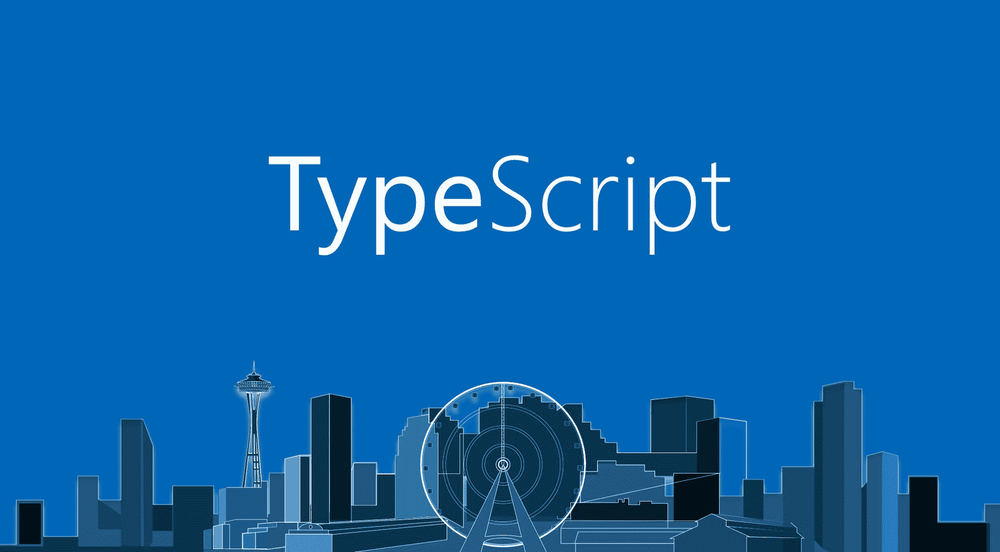

# 不使用 TypeScript - LogRocket 博客的 7 个糟糕借口

> 原文：<https://blog.logrocket.com/7-bad-excuses-for-not-using-typescript-dbf5e603a9a8/>



Typescript 自六年前[问世以来已经走过了漫长的道路，并被领先的网络公司所采用。虽然*可能*是避免使用它的好理由，但你不使用 TypeScript 的借口很可能是糟糕的。](https://en.wikipedia.org/wiki/TypeScript)

在本文中，我将讨论一些常见的问题，如学习曲线、工具、开发速度、可持续性和标准遵从性。

### 1.学习曲线太陡了

需要注意的是，TypeScript 并不是一种全新的语言。像 CoffeeScript 和 Reason 这样的语言将 JavaScript 打扮成其他编程语言的语法和语义——相应地还有 Ruby 和 OCaml。TypeScript 追求更保守的目标。

相反，它采用普通的 JavaScript，只是在其上添加了一个类型系统(TypeScript 是 JavaScript 的超集)。这使得学习曲线非常倾斜。从 JavaScript 切换到 TypeScript 和在不同语言之间切换是不一样的。

下面是 TypeScript 中的一段代码:

```
class Greeter {
    greeting: string;

    constructor(message: string) {
        this.greeting = message;
    }

    greet() {
        return "Hello, " + this.greeting;
    }
}
```

以下是现代(ES6) JavaScript 中的相同代码:

```
class Greeter {
    constructor(message) {
        this.greeting = message;
    }

    greet() {
        return "Hello, " + this.greeting;
    }
}
```

正如该语言的共同创造者安德斯·海尔斯伯格所言，[**如果你懂 JavaScript，你就已经懂了 TypeScript**](https://www.hanselminutes.com/340/what-is-typescript-and-why-with-anders-hejlsberg)。在本文的后面，我将更多地讨论将现有项目转换为 TypeScript 的途径。

### 2.但是 JavaScript 是标准的，TypeScript 不是

当 TypeScript 在 2012 年问世时，它带来了像类和模块这样的功能，直到 2015 年 ECMAScript 第 6 版(ES6，或 ES2015)最终确定时，这些功能才成为“标准 JavaScript”。TypeScript 中模块的最初实现偏离了 ES6，但是在标准最终确定的同一年，它被更新(保持向后兼容性)以匹配 ES6 规范。

今天，TypeScript 语言严格遵循 ECMAScript 规范，实现了大多数达到阶段 [](#38bf) 的提议。这意味着**当你写 TypeScript 时，你写的是现代的、符合标准的 JavaScript** 。由于内置的 ES3/ES5 transpiler，输出的`.js`文件在旧浏览器中运行时不会出现问题。

### 3.它扼杀了 JavaScript 的动态本质

如果您使用脚本语言已经有一段时间了，那么您会逐渐体会到它们所带来的开发速度。您可以自由地动态讨论数据结构，而不必预先声明它们。然而，这种自由是有代价的。动态类型的程序比静态类型的程序更难推理，因为流经程序的数据没有编译时验证。

考虑这个简单的普通 JavaScript 示例:

```
function greeter(person) {
    return "Hello, " + person.firstName + " " + person.lastName;
}
```

通过查看代码，我们可以*推断*参数`person`应该是一个具有属性`firstName`和`lastName`的`Object`。但是不能保证在运行时总是如此。

您的项目越大，出现与类型相关的错误的可能性就越大。

防止代码出现这种错误的一种方法是通过运行时类型检查和附加的单元测试，如下所示:

```
function greeter(person) {
    if (!person || !person.firstName || !person.lastName) {
        throw new Error('invalid arguments');
    }

    return "Hello, " + person.firstName + " " + person.lastName;
}

// Jasmine spec:
describe("greeter", function() {
    it("returns greeting on valid input", function() {
        expect(
            greeter({firstName: 'James', lastName: 'Hetfield'})
        ).toEqual('Hello, James Hetfield');
    });

    it("throws on invalid input", function() {
        expect(() => greeter()).toThrowError('invalid arguments');
        expect(() => greeter(5)).toThrowError('invalid arguments');
        expect(() => greeter({firstName: 'Jason'})).toThrowError('invalid arguments');
    });
});
```

但是这种解决方案非常冗长，将验证数据的责任留给了开发人员。相反，如果我们可以简单地在函数中添加一个类型注释呢？

```
interface Person {
    firstName: string;
    lastName: string;
}

function greeter(person: Person): string {
    return "Hello, " + person.firstName + " " + person.lastName;
}

// Jasmine spec:
describe("greeter", function() {
    it("returns greeting", function() {
        expect(
            greeter({firstName: 'James', lastName: 'Hetfield'})
        ).toEqual('Hello, James Hetfield');
    });
});
```

上面的例子更符合习惯，让我们只关注在测试中验证业务逻辑。

TypeScript 通过采用一个**结构化类型系统**和惊人地擅长**类型推断**来拥抱 JavaScript 的动态本质，这意味着您不必像在 C#或 Java 中那样显式地使用类型。下面是一个使用我们上面在 TypeScript 中编写的函数的示例:

```
let user = { firstName: "James", lastName: "Hetfield" };
console.log(greeter(user));
```

此代码成功编译。请注意，我们不必显式地说`user`变量实现了`Person`接口，也不必定义一个扩展它的类。该语言的[设计目标之一](https://github.com/Microsoft/TypeScript/wiki/TypeScript-Design-Goals)不是创建一个“声音或*可证明正确的*类型系统”，而是“在正确性和生产力之间取得平衡”。

同样重要的是，TypeScript 编译器并不强迫你在任何地方声明类型，你可以选择你想在类型安全方面有多积极。您甚至可以决定在项目的不同区域应用不同级别的类型严格性。这种灵活性不是传统静态类型语言所能提供的。

### 4.五年后它将不复存在

我有消息告诉你。没有人知道 5 年后会出现什么语言、工具或框架，尤其是在网络领域。下面是 StackOverflow 博客作者写的关于 JavaScript 框架生命周期的文章:

> JavaScript 框架的使用似乎有两个主要阶段。随着框架越来越受欢迎，似乎会有一个快速的上升，然后随着开发人员采用更新的技术，会有一个稍慢但稳定的下降。这些生命周期只持续几年。

你在一个快速发展的行业工作，如果你和你的项目能从今天的某些技术中真正受益，考虑采用它。即使你在 1-2 年内把它换成其他东西，你在这段时间内获得的收益也会加速你的项目，让它物有所值。

### 5.这不是社区驱动的

Typescript 于 2012 年由专有软件巨头微软发布。考虑到公司及其开发平台的声誉，很容易理解 TypeScript 是“一种 JavaScript 风格”。NET 开发者”。也许这种看法被这样一个事实进一步强化了，即 Visual Studio 是当时唯一一个对该语言有丰富支持的 IDE。或者这个项目的源代码最初是在微软的 GitHub 替代软件 [CodePlex](https://archive.codeplex.com/?p=typescript) 上发布的。

从那以后，很多事情都变了。TypeScript 背后的团队意识到，如果他们希望看到该语言得到更广泛的采用，他们需要通过提供高质量的工具和听取反馈来更好地融入 web 开发社区。他们不仅仅是把源代码放在那里，同时在真空中继续开发，而是完全接受了开放开发的概念。

2014 年，TypeScript 的代码被[转移到 GitHub](https://blogs.msdn.microsoft.com/typescript/2014/07/21/new-compiler-and-moving-to-github/) ，开发实际上是在那里进行的(而不是在其他地方开发，只是将新版本的代码导出到 GitHub，就像在一些项目中看到的那样)。项目[以记录错误、记录提议和提交请求的形式邀请投稿](https://github.com/Microsoft/TypeScript/wiki/Contributing-to-TypeScript)。“问题跟踪者”会定期查看，每份提交的材料通常会在几天内进行筛选。核心团队已经发布了我之前提到的语言的[设计目标](https://github.com/Microsoft/TypeScript/wiki/TypeScript-Design-Goals)，这有助于该项目忠实于它的使命，同时仍然接受来自社区的输入。他们保持一个最新的路线图(大约每两个月发布一个新版本)，同时记录任何突破性的变化。


An overview of the activity on the [TypeScript](https://github.com/Microsoft/TypeScript) project on Github

在撰写本文时，所有主要的跨平台 ide 和文本编辑器，如 Eclipse、Webstorm、Emacs、Vim、Sublime、Atom、VS Code，都已经或通过插件对 TypeScript 提供了成熟的支持。核心团队还投入了大量精力来创建类型定义文件，以实现与用普通 JavaScript 编写的现有库和框架的互操作性(稍后将详细介绍)。另一件值得注意的事情是一个文档完善的 TypeScript 编译器 API，它支持创建许多有价值的第三方语言工具。鼓励使用 Typescript 的开发人员在 [StackOverflow](https://stackoverflow.com/questions/tagged/typescript) 上提出技术问题。

考虑到所有这些，并重申 TypeScript 严重依赖 ECMAScript 的事实，我认为公平地说项目*是* *社区驱动的*，并且在过去几年中一直如此。以下是 EmberJS，[的联合创始人汤姆·戴尔在 2017 年对 TypeScript](https://tomdale.net/2017/04/whats-the-deal-with-typescript/) 的评论:

> 最重要的是，我仍然对 TypeScript 团队的专业精神印象深刻。在一个可以感觉建立在无人维护的卡片房子上的生态系统中，TypeScript 不断迭代改进的鼓点令人耳目一新。

### 6.转换现有项目的工作量太大

好吧，为了在你的项目中充分利用 TypeScript，你*将*不得不花时间声明类型和修复编译器错误，并且*将*有些乏味。然而，作者在构建它时考虑到了 JavaScript 生态系统，并为在现有项目中采用 TypeScript 提供了一个平稳的入口。

根据[官方迁移指南](https://www.typescriptlang.org/docs/handbook/migrating-from-javascript.html)，你可以通过 TypeScript 编译器简单地运行你的*现有 JavaScript* *代码*来获得一些早期的好处。此时，编译器会捕捉一些低级错误，比如在函数或不可达代码块的末尾缺少`return`语句。然后，您可以开始将`.js`文件逐个重命名为`.ts`，并处理新的编译器反馈。默认的编译器选项相当宽松，但是您可以打开更严格的检查。您甚至可以在项目的不同部分使用一组不同的编译器选项，让您的团队按照他们自己的速度采用 TypeScript，根据他们的需要使用或多或少。底线是**有一个平稳的过渡路径，不会停止整个公司的发展，**这不是一个全有或全无的承诺。

您可以选择逐渐将现有项目转换为 TypeScript，或者[执行“大爆炸”转换](https://www.lucidchart.com/techblog/2017/11/16/converting-600k-lines-to-typescript-in-72-hours/)，或者简单地将其用于新项目。还有像 [TypeWiz](https://medium.com/@urish/manual-typing-is-no-fun-introducing-typewiz-58e3e8813f4c) 这样的社区项目，可以自动将缺失的类型信息添加到代码中。

### 7.但是我使用的所有库都是 JavaScript 的

为了实现与现有 JavaScript 代码的互操作性，该语言支持 TypeScript 声明文件。例如，如果您使用的 JavaScript 库导出了一个名为`camelize`的全局函数，那么它的 TypeScript 声明将如下所示:

```
declare function camelize(s: string): string;
```

将这样的声明导入到项目中后，TypeScript 将知道该函数的类型。

同年，TypeScript 发布， [DefinitelyTyped](https://github.com/DefinitelyTyped/DefinitelyTyped) ，一个流行库的声明文件的社区存储库被创建。在撰写本文时，它包含了 5，000 多个 JavaScript 包的声明。使用这些声明非常容易。例如，如果您在项目中使用 Jasmine 测试框架，只需运行:

```
npm install --save-dev @types/jasmine
```

编译器会自动包含这些类型，您可以在代码编辑器中进行动态类型检查和自动完成。您使用的所有或大部分包都应该已经为它们创建了高质量的类型声明，或者捆绑在一起，或者通过 DefinitelyTyped repo 提供。Slack 的工程团队分享了他们的经验:

> 展望未来并思考代码维护，我们欣赏围绕 TypeScript 的生态系统。作为 React 和 Node/npm 生态系统的大量用户，第三方库的类型定义的可用性是一个巨大的优势。我们导入的许多库已经与 TypeScript 兼容。如果模块本身没有提供定义，那么它们可能会出现在奇妙的[明确类型化的](https://github.com/DefinitelyTyped/DefinitelyTyped)项目中。例如，React 没有附带类型定义，但是一个简单的`*npm install @types/react*`就可以安装它们，不需要进一步的配置。

### 结论

使用静态类型检查有助于消除一整类错误，TypeScript 是 Node/JavaScript 项目中最流行的静态类型解决方案。对于一个相对较小或实验性的项目来说，这可能不值得，但其好处远远超过大规模项目的额外开销，正如谷歌、Slack、Asana、Ember 等公司所证明的那样。希望这篇文章为您提供了关于 TypeScript 的新观点，并解决了一些不再相关的反对它的具体论点。也许你该再给它一次机会了。

您目前正在使用 TypeScript 还是计划使用它？如果不是，是什么阻碍了你？

P.S .值得注意的是，还有另一个项目在保留语言语法和语义的同时向 JavaScript 添加静态类型，它被称为 [Flow](https://flow.org/) 。如果你正在寻找 TypeScript 的替代品，一定要去看看。

[ [^](#bb31) ]根据 ECMAScript 的[标准化流程](https://tc39.github.io/process-document/)，阶段 3(“候选”)是标准提案五个“成熟”步骤中的第四个。这意味着提案规范已经可以在现实世界中实现了。

## [LogRocket](https://lp.logrocket.com/blg/typescript-signup) :全面了解您的网络和移动应用

[](https://lp.logrocket.com/blg/typescript-signup)

LogRocket 是一个前端应用程序监控解决方案，可以让您回放问题，就像问题发生在您自己的浏览器中一样。LogRocket 不需要猜测错误发生的原因，也不需要向用户询问截图和日志转储，而是让您重放会话以快速了解哪里出错了。它可以与任何应用程序完美配合，不管是什么框架，并且有插件可以记录来自 Redux、Vuex 和@ngrx/store 的额外上下文。

除了记录 Redux 操作和状态，LogRocket 还记录控制台日志、JavaScript 错误、堆栈跟踪、带有头+正文的网络请求/响应、浏览器元数据和自定义日志。它还使用 DOM 来记录页面上的 HTML 和 CSS，甚至为最复杂的单页面和移动应用程序重新创建像素级完美视频。

[Try it for free](https://lp.logrocket.com/blg/typescript-signup)

.