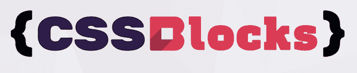
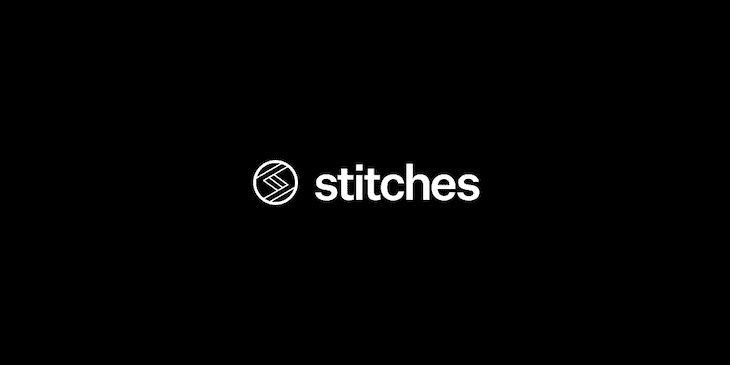
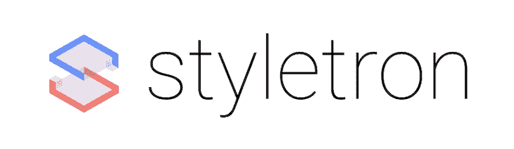
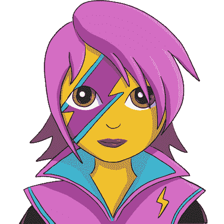
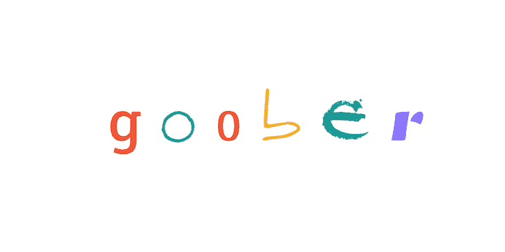

# 风格化组件的 7 个功能丰富的替代方案

> 原文：<https://blog.logrocket.com/7-feature-rich-alternatives-to-styled-components/>

在过去的几年里，我们已经看到 CSS-in-JS 成为现代前端开发的一个重要部分。根据样式组件创建者 T2·马克斯·斯托伊伯的说法，大约 60%的 React 安装都会安装 CSS-in-JS 库。始于 2014 年 11 月 [JSS](https://cssinjs.org/?v=v10.4.0) 的冒险现在相对稳定，风格化组件获得了一大块 CSS-in-JS 市场。

在这里，我们将分享一些很酷的样式化组件的替代品，它们提供了巨大的价值，可以成为你下一个应用的 CSS-in-JS 库。

## Linaria:零运行时 CSS-in-JS 库

| **维护人员** | **捆尺寸** | **npm 下载量** |
| [调用堆栈](https://callstack.com/) | 510B | > 19k |

CSS-in-JS 库的一个缺点是运行时成本，因为当 DOM 元素发生变化时，大多数 CSS-in-JS 库都会在`<style>`标签中添加和删除样式。

Linaria 通过在构建期间提取文件中的所有 CSS 来解决这个问题。另一个惊人的特性是所有的动态样式都是使用 CSS 变量来应用的，这使得它们完全独立于任何运行时。

然而，这是有代价的——动态样式在不支持 CSS 变量的浏览器中不可用。Linaria 还支持嵌套样式的类似 Sass 的语法。

至于开发人员体验，它支持 stylelint，还提供了一个 CSS 源代码图，用于无缝调试体验。它还有一个 Babel loader，带有一个 webpack 指南、一个 Rollup 插件以及 Gatsby、Svelte 和 Preact 指南。

如果您计划从样式化组件转移，Linaria 有一个样式化的助手，使切换变得容易。linaria/react 还支持具有类似样式组件的语法的动态样式。

## LinkedIn 的 CSS 块

| **维护人员** | **捆尺寸** | **npm 下载量** |
| [LinkedIn](https://github.com/linkedin) | 510B | — |

今天，样式库的核心挑战之一是在性能和可维护性之间找到最佳平衡。CSS 块的设想是给两者最好的。CSS Blocks 的灵感来源于 [CSS 模块](https://github.com/css-modules/css-modules)、 [BEM](http://getbem.com/) 和[原子 CSS](https://acss.io/) 。

最棒的是，CSS 块是可静态分析的。它可以查看您的代码库，并分析 CSS 的哪些部分被使用、未使用或有条件地使用。它将 CSS 中的所有规则分成不同的组，没有重复。它允许您为自己和其他开发人员保持 CSS 的可维护性，并为您的最终用户进行更好的优化。

与样式组件或类似的样式库相比，CSS 块提供了一个新的模型。一些团队可能需要一些时间来学习和适应它，但是性能和可维护性的提高是值得的。

## 缝合:接近零的运行时间和一流的开发人员体验

| **维护人员** | **捆尺寸** | **npm 下载量** |
| [Modulz](https://modulz.app/) | 28.8 kB | < 1k |

它的维护者将 Stitches 描述为一个样式库，具有接近零的运行时、服务器端渲染、多变体支持和一流的开发人员体验。与 Linaria 和 CSS 块相比，谈到架构时，Stitches 更接近于样式化组件。与样式化组件相比，它的尺寸更小，但却用类似的 API 提供了许多相同的功能。

Stitches 最好的部分是变体，它有助于开发更好的组件 API。您可以为每个变体定义样式，也可以组合它们。它还使用 CSS 变量进行主题化；这使得它可以避免运行时道具插值，与其他可用的样式库相比，提供了相当不错的性能提升。

另一个漂亮的特性是标记，它使您能够声明变量并将它们用作 CSS 值——是的，甚至可以用速记的方式。此外，从样式化组件的切换是相对无缝的，因为它们的 API 非常相似。

## Styletron:面向组件样式的通用工具包

| **维护人员** | **捆尺寸** | **npm 下载量** |
| 优步使用的 OSS | 28.8 kB | > 20k |

开发能够很好地与任何 UI 库或框架一起工作的库和组件是当今所有前端开发人员都在寻找的东西。Styletron 与库无关，允许您编写与任何 UI 库都很好地工作的组件，无论是 React 还是其他任何库。

Styletron 对原子 CSS 和关键渲染路径都有好处。它只将所需的 CSS 添加到样式标签中，并执行声明级的重复数据删除，这减少了浏览器必须处理的 CSS 的大小。您可以在一个小小的 8KB gzipped 库中获得所有这些内容。至于开发人员的体验，它不需要任何 bundler 配置或工具设置。

## 情感:下一代 CSS-in-JS

Emotion 已经存在了一段时间，并且开创了许多其他样式库已经采用的想法。它是框架无关的，也有一个样式 API 来创建带有附加样式的 React 组件。

Emotion 提供了出色的开发人员体验，因为它支持源地图。它带有开箱即用的主题化机制、ESLint 插件和对 CSS 道具的支持。

简而言之，Emotion 拥有 styled-components 提供的所有东西——除此之外还有一个稍微小一点的包——所以您可以用 Emotion 轻松地交换 styled-components。

## 费拉:作为国家功能的风格

Fela 基于一个独特的原则:如果视图是状态的函数，你的 CSS 也应该是，因为它是视图的一部分。就像 React 和 Redux 一样，Fela 不会明确地告诉你如何编写你的样式；它附带了一个强大的 API，可以帮助您构建自己的样式环境。

Fela 认为动态样式是它的核心，它是与框架无关的。它还采用了原子 CSS 原则，因为每个规则都有一个唯一的类，这使得你的 CSS 更小，性能更好。

至于它的 API 和从样式化组件的切换，Fela 有一个不同的心智模型和一个非常不同的 API。这可能需要一点时间来赶上进度，但它是独一无二的，对于有很多动态风格的应用程序有很大的好处。

## Goober:不到 1KB 的 CSS-in-JS 解决方案

Goober 是一个不太为人所知的库，旨在避免样式化组件(~12KB)和 Emotion (~11KB)对包大小的影响。Goober 声称拥有 styled-components 提供的所有商品。

从性能角度来看，Goober 可以击败样式化组件。但是[对 SSR](https://github.com/cristianbote/goober#ssr-1) 进行基准测试时，稍微落后于情感。至于它的特性，几乎所有最广泛使用的样式化组件的特性都可以在 Goober 中获得。

它的 API 非常类似于风格化组件，由于心智模型保持不变，从风格化组件转移到 Goober 应该不是什么大问题。

## 把一切都包起来

CSS-in-JS 为开发人员提供了一种轻松维护应用程序风格的方法，并解决了许多与裸 CSS 相关的问题。随着我们向前发展，令人惊叹的前端社区，以及各种技术巨头，现在正在基于我们从样式化组件中获得的知识，构建可扩展的和更高性能的解决方案。

我很欣赏那些努力维护这些酷东西的人。所有这些都有其独特的优点和缺点，并且在某些情况下都很方便。如果你想了解更多，看看其他的 CSS-in-JS 库[这里](https://github.com/MicheleBertoli/css-in-js)，由[米歇尔·贝托里](https://github.com/MicheleBertoli)比较。

## 使用 [LogRocket](https://lp.logrocket.com/blg/signup) 消除传统错误报告的干扰

[LogRocket](https://lp.logrocket.com/blg/signup) 是一个数字体验分析解决方案，它可以保护您免受数百个假阳性错误警报的影响，只针对几个真正重要的项目。LogRocket 会告诉您应用程序中实际影响用户的最具影响力的 bug 和 UX 问题。

然后，使用具有深层技术遥测的会话重放来确切地查看用户看到了什么以及是什么导致了问题，就像你在他们身后看一样。

LogRocket 自动聚合客户端错误、JS 异常、前端性能指标和用户交互。然后 LogRocket 使用机器学习来告诉你哪些问题正在影响大多数用户，并提供你需要修复它的上下文。

关注重要的 bug—[今天就试试 LogRocket】。](https://lp.logrocket.com/blg/signup-issue-free)