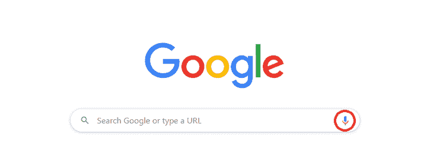
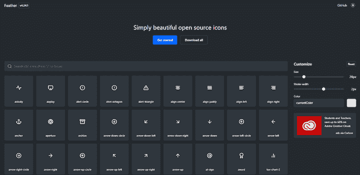
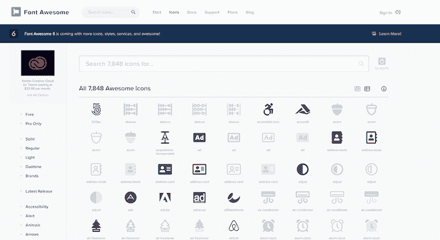
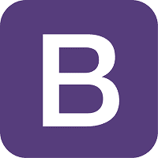
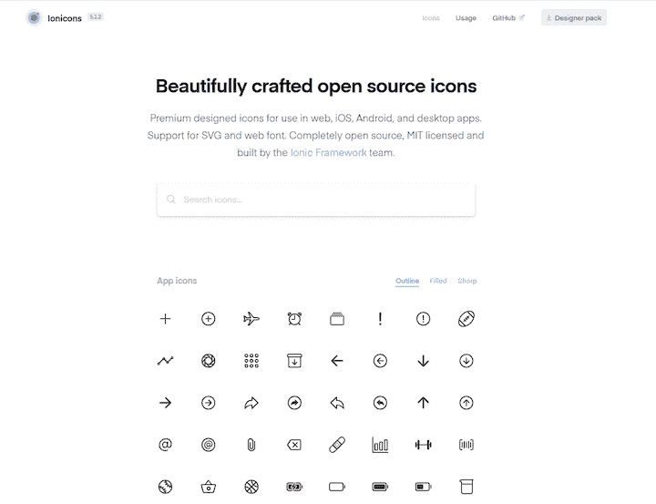
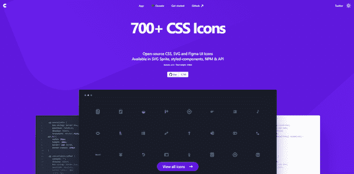
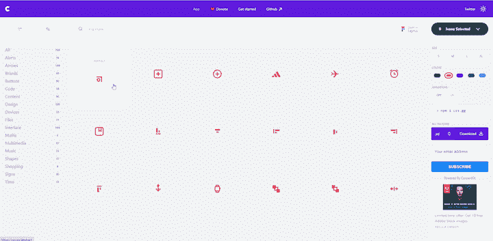
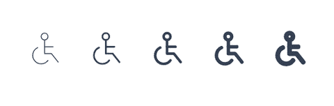
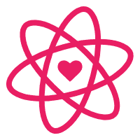
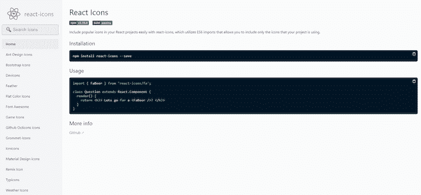

# 7 个流行的图标库，你可以用来写免费的博客

> 原文：<https://blog.logrocket.com/7-popular-icon-libraries-you-can-use-for-free/>

作为 web 开发人员，我们使用图标来使我们的网站和应用程序更具视觉吸引力、可导航性和吸引力。图标是大多数用户熟悉的公认模式。例如，web 或移动应用程序中的麦克风图标几乎总是表示某种语音命令或录音功能。



图标之所以有用，正是因为它们是通用的符号。在许多情况下，图标甚至可以完全取代文本。

在本教程中，我们将探索和比较一些你可以在下一个 JavaScript 项目中使用的最流行的图标库。这些图标库设置起来非常简单，它们都允许你只导入你需要的图标，而不是整个集合。最棒的是，它们不花一分钱。

以下是你可以免费使用的 7 大图标库。

## 1.羽毛


羽毛是一个干净、漂亮的开源图标的集合，通常用来帮助用户导航和操作应用程序。每个图标都设计在 24×24 的网格上，强调简单性、一致性和灵活性。

Feather 中的所有图标都是基于 SVG 的，这意味着你可以在大多数 HTML 和 CSS 属性中使用它们，比如`img`、`background-image`、`inline`、`object`、`embed`、`iframe`等。



在撰写本文时， [Feather 已经收集了 282 个图标](https://feathericons.com/)，您可以根据大小、笔画宽度和颜色进行调整。

要使用羽毛图标，请安装它的软件包。

```
npm install feather-icons
#or
yarn add feather-icons

```

您也可以从 CDN 获取它。

```
<!-- choose one -->
<script src="https://unpkg.com/feather-icons"></script>
<script src="https://cdn.jsdelivr.net/npm/feather-icons/dist/feather.min.js"></script>

```

Feather 拥有第三方库,使得在 Angular、Vue 等现代流行框架中使用图标变得更加容易，并且反应起来没有什么麻烦。

## 2.字体真棒


由 Dave Gandy 于 2012 年开发的 [Font Awesome](https://fontawesome.com/) 是最古老、最受欢迎的图标系列之一。它最初是为 Bootstrap 设计的，后来发展成为自己独立的图标集。字体 Awesome 5 创下了 Kickstarter 有史以来资金最多的软件的记录。

该库包括 1500 多个图标，您可以免费使用。它支持流行的 web 开发框架，如 React、Angular 和 Vue，以及流行的设计工具，如 Sketch 和 Adobe apps。

Font Awesome 还有一个[付费高级计划](https://fontawesome.com/plans)，包括 6000 多个图标，图标加载速度更快，更多工具包，更多图标，更多工具，以及实际的人力技术支持。



尽管它收集了大量的图标，但你的应用程序可能只需要几个图标。如果您担心应用程序的大小，请确保使用主页上的搜索栏来单独查找您的图标，而不是导入整个库。

## 3.引导图标



从版本 4 开始，最流行的 CSS 框架现在有了自己的[图标库](https://icons.getbootstrap.com/)。显然，Bootstrap 图标是为 Bootstrap 的组件和文档设计的。在字体 Awesome 是基于字体的时候，Bootstrap 选择使用基于 SVG 的图标。

Bootstrap Icons 目前处于 alpha 版本，有超过 1000 个图标可供使用。

可以通过 [npm](https://icons.getbootstrap.com/#install) 安装引导图标，也可以手动下载。

根据您的设置，您可以通过多种方式包含引导图标:

*   将 SVG 复制/粘贴为嵌入的 HTML
*   通过``元素引用
*   使用 SVG 精灵
*   通过 CSS 包含

## 4.离子体


Ionicons 是一个高质量的图标库，设计用于 web、iOS、Android 和桌面应用程序，支持 SVG 和 web 字体。它有两个版本:材质设计和 iOS。



虽然它是为 Ionic 框架而构建的，但这些图标是完全开源的，并得到了麻省理工学院的许可，这意味着你可以在任何类型的项目中使用它们，无论是个人项目还是商业项目。

要使用 Ionicons，请在您的项目中包含它的 CDN 链接。

```
<script src="https://unpkg.com/[email protected]/dist/ionicons.js"></script>

```

然后，使用特殊的`ion-icon`组件来呈现图标。

```
<ion-icon name="heart"></ion-icon>

```

## 5.css.gg


css.gg 是一个独特的图标库，完全用 css 编写。它包括 700 多个用户界面图标，而且完全免费。

关于 css.gg 最值得注意的一点是，每个单独的图标页面都显示了如何构建图标的源代码。例如，看看这个 [Git Pull 图标](https://css.gg/git-pull)。

因为图标是用纯 CSS 制作的，所以渲染速度非常快，因为它们不需要任何其他资源。



css.gg 是 Astrid Malsija 作为个人项目创建的[，但它引起了社区的注意，几位设计师为其添加了一个 SVG 版本，一个针对](https://dev.to/astrit/why-how-did-i-build-500-css-only-icons-library-a-life-story-34on) [Figma](https://www.figma.com/community/file/834587122842084475) 和 [Adobe XD](https://xd.adobe.com/view/258f1c41-07d1-4036-7c67-f9f75a375f91-53be/) 的设计师包，以及针对 [React](https://github.com/astrit/css.gg#react) 的 web 组件。



这些图标也缩放得很好，因为默认情况下它们是视网膜就绪的。您可以通过定义`--ggs`来放大图标尺寸，从而轻松缩放图标尺寸。如果你想在你的项目中使用 css.gg 图标，你可以安装这个包，使用 CDN 链接，下载 SVG，或者使用 React 的组件。

## 6 .表格图标


Tabler Icons 是一组超过 550 个免费的、麻省理工学院许可的 SVG 图标。每个图标都设计在 24×24 的网格上，笔画为 2px。

要使用 Tabler 图标，从 npm 安装这个库，或者直接从 GitHub 下载。

与 Feather 一样，Tabler 也包含了`stroke-width` CSS 属性，使您能够生成不同的图标变体。



您可以将 Tabler 图标放置为``、`background-image`，并内嵌在 HTML 代码中。要了解关于这个包的更多信息并查看完整的安装说明，请访问 [GitHub](https://github.com/tabler/tabler-icons) 上的源代码。

## 7.反应图标



与前面提到的图标库不同， [React Icons](https://react-icons.github.io/react-icons/) 是一个图标编译库，它使您能够将各种库中的图标作为 SVG 元素添加到 React 项目中。

要添加图标，请安装软件包并将其导入到组件文件中。

```
# Install the package
npm install react-icons
# or
yarn add react-icons

// FaBeer component will be rendered as an SVG..
import { FaBeer } from 'react-icons/fa';
class Question extends React.Component {
  render() {
    return <h3> Lets go for a <FaBeer />? </h3>
  }
}

```



React 图标包括以下库中的图标。

只有导入的图标包含在您的构建中，以防止您的包因未使用的图标而膨胀。

## 结论

无论你创建什么样的应用程序，有一组图标来帮助用户导航和与你的界面交互都是很好的。普遍认可的通用图标会让用户在使用你的应用程序时感觉更舒服，更投入。因为大多数用于应用程序开发的图标都是免费的，所以没有理由不将它们包含在您的项目中。

为你的应用程序选择一个图标库时，一定要查看每个库的网站，并搜索对你的应用程序至关重要的图标。

## 通过理解上下文，更容易地调试 JavaScript 错误

调试代码总是一项单调乏味的任务。但是你越了解自己的错误，就越容易改正。

LogRocket 让你以新的独特的方式理解这些错误。我们的前端监控解决方案跟踪用户与您的 JavaScript 前端的互动，让您能够准确找出导致错误的用户行为。

[](https://lp.logrocket.com/blg/javascript-signup)

LogRocket 记录控制台日志、页面加载时间、堆栈跟踪、慢速网络请求/响应(带有标题+正文)、浏览器元数据和自定义日志。理解您的 JavaScript 代码的影响从来没有这么简单过！

[Try it for free](https://lp.logrocket.com/blg/javascript-signup)

.