# 为免费博客部署 React 应用程序的 8 种方法

> 原文：<https://blog.logrocket.com/8-ways-deploy-react-app-free/>

***编者按*** *:本帖更新于 2022 年 2 月 2 日，从列表中移除并替换过时的和未维护的选项，提供更现代的选项，并根据其最新的方法和部署选项修改每个服务的构建步骤。*

是时候将 React 应用程序从开发阶段转移到生产阶段了！但是部署构建在框架之上的应用程序(如 React、Vue.js 或 Angular)的过程与部署使用 HTML、CSS 和 JavaScript 构建的站点的过程有很大不同。

在本教程中，我们将演示如何使用八种不同的服务部署 React 应用程序:

1.  韦尔塞尔
2.  [燃烧基地](#firebase)
3.  [Netlify](#netlify)
4.  github pages
5.  [Heroku](#heroku)
6.  [浪涌](#surge)
7.  [渲染](#render)
8.  [GitLab Pages](#gitlab-pages)

这篇文章中描述的所有服务都是完全免费的，没有隐藏的信用卡要求，直到你超过一定的限制，这通常是基于浏览量或带宽。我还列出了一些其他平台的简短列表[,这些平台值得一试，但并没有在列表中。](#some-other-platforms-worth-checking-out)

我们开始吧！

## 韦尔塞尔

Vercel 是一项革命性的无服务器部署服务，专为 React、Angular、Vue 和其他 JavaScript 库设计。使用 Vercel 可以很容易地从 GitLab 或 Bitbucket 导入项目。自动 SSL 是它提供的许多很酷的特性之一。

要部署 Vercel，[创建一个新帐户](https://vercel.com/signup)。您可以使用 OAuth 快速登录。

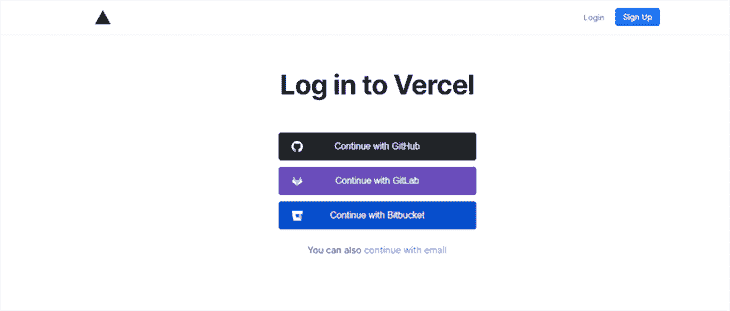

成功登录后，将出现仪表板屏幕。您可以使用此仪表板或 Vercel CLI，并从终端部署它；我们将更详细地讨论这两种方法。

### 使用仪表板部署

要使用 Vercel dashboard 进行部署，请集成 GitHub、GitLab 或 bit bucket——无论您的 React 应用程序存储在哪里。点击面板上的**导入项目**。

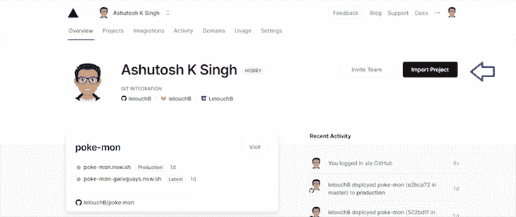

您可以选择从 Git 存储库中导入项目，或者使用模板，这是 Vercel 的另一个优秀特性。

从 Git 库中点击**下的**继续**。**

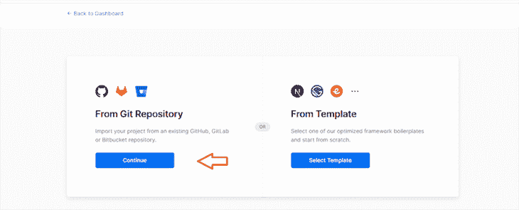

你可能集成了 GitHub，GitLab，或者 Bitbucket 出于本教程的目的，我们假设您使用了 GitHub。

点击**从 GitHub** 导入项目。如果这是您第一次使用 Vercel，您会看到这样一个屏幕:

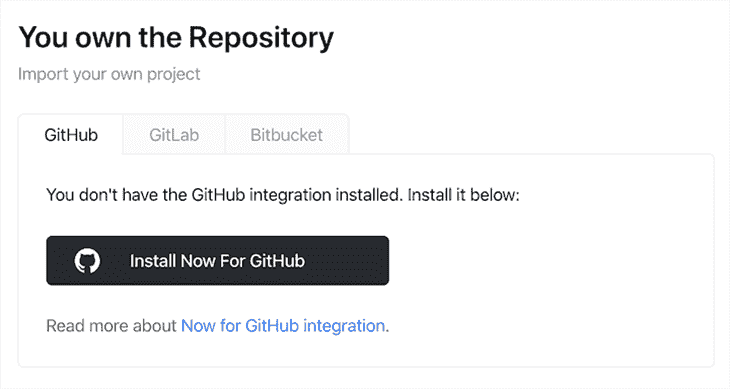

点击 **Install Now For GitHub** 会提示你安装 Vercel for GitHub。保存 GitHub 的设置，导航回[导入 Git 页面](https://vercel.com/import/git)，你会看到你的 GitHub 现在已经连接好了。点击**从 GitHub 导入项目**。

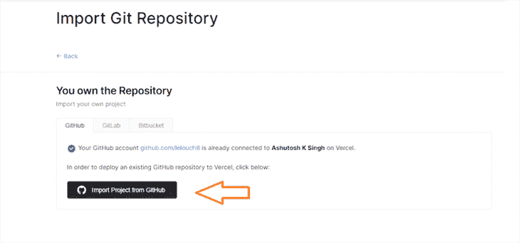

系统会提示您选择要部署的项目。选择 React 项目，点击**导入**，然后就可以写入项目名称了。保留默认设置，点击**继续**。当询问根目录时，相应地选择并点击**继续**。

下一步很重要。如果您已经使用 [Create React App](https://blog.logrocket.com/tag/create-react-app) 初始化了 React 项目，Vercel 将自动检测它并自行选择合适的配置。保留默认配置，点击**部署**。我们将配置保留为默认设置，以便 Vercel 知道基于配置部署网站的正确方法。

如果您的 React 应用程序没有使用 Create React App 初始化，您将被要求进行配置。以上面的配置为例，填写所有的配置字段并点击 **Deploy** 。

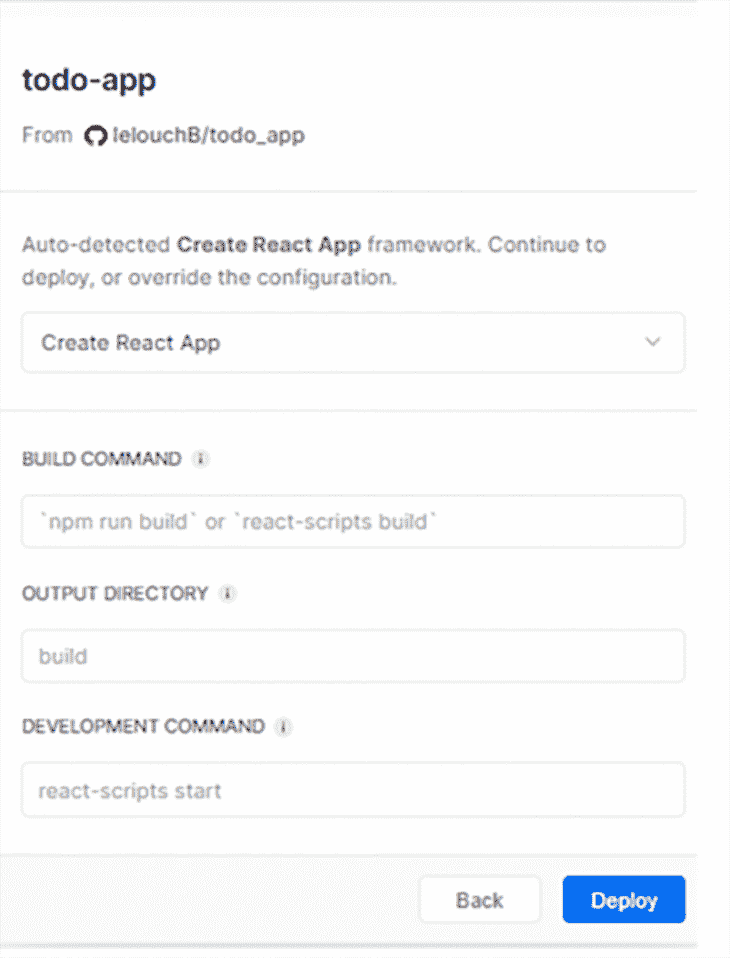

您的 React 应用程序将在几秒钟内部署，并带有两到三个预览链接。

### 使用 Vercel CLI 部署

第一步是全局安装 Vercel。

```
npm i -g vercel
// or
yarn global add vercel

```

一旦安装了 Vercel，运行下面的命令。

```
vercel login

```

系统会提示您输入您在 Vercel 上注册时使用的电子邮件。提交后，您将收到一封电子邮件来验证您的登录。

接下来，转到项目根目录并运行以下命令。

```
vercel

```

系统会提示您回答几个问题。首先，确认这是您想要部署的项目。

```
? Set up and deploy “path to your project”? [Y/n] y

```

接下来，系统会询问您希望在哪个帐户中部署此应用程序。它会给你一个默认选项。只要按下回车键。

* * *

### 更多来自 LogRocket 的精彩文章:

* * *

之后，会询问您是否将它链接到现有项目。回答`N`。

```
? Which scope do you want to deploy to? Your Vercel Account
? Link to existing project? [y/N] n

```

下一步是命名项目并指定路径。因为我们已经在项目目录中，所以它将与默认选项`./`相同。

```
? What’s your project’s name? project-name
? In which directory is your code located? ./

```

它将自动检测您的项目是否使用 Create React App 初始化，并相应地配置设置。否则，它会要求您设置它们。如果要求您覆盖设置，请回答`No`。

```
Auto-detected Project Settings (Create React App):
- Build Command: `npm run build` or `react-scripts build`
- Output Directory: build
- Development Command: react-scripts start
? Want to override the settings? [y/N] n

```

现在将部署您的项目。

```
�  Deployed to production. Run `vercel --prod` to overwrite later (https://vercel.link/2F).

```

## 重火力点

Firebase 是一个完整的平台，你可以用它来开发和扩展你的应用。除了托管，它还提供[无数其他服务](https://firebase.google.com/products)，包括身份验证、云 Firestore、云功能等等。

如果你还没有，在 [Firebase](https://firebase.google.com/products) 上创建一个帐户，然后创建一个新项目。然后点击工具条上的**主持**，点击**入门**。这将为我们启动 Firebase 主机。

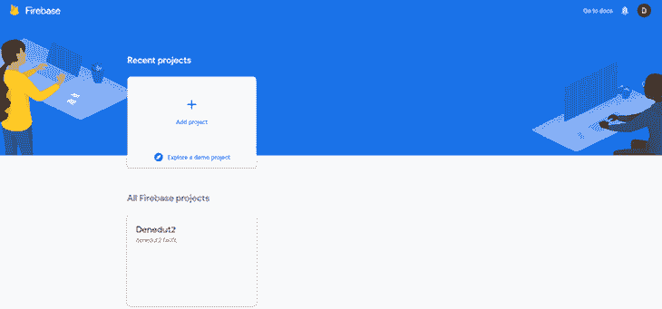

全局安装 Firebase CLI，以便在不同的项目中更容易使用。

```
npm install -g firebase-tools

```

用你的 Firebase 或 Google 帐户登录。

```
firebase login

```

将在浏览器中打开的终端中提示您一个 URL 以进行验证。授予必要的权限后，您将看到一条成功登录的消息。

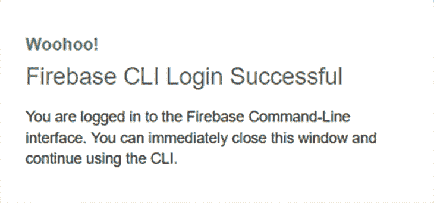

接下来，转到项目根目录，运行以下命令来初始化 Firebase 项目。

```
firebase init

```

你会被要求确认；回复`Yes`。

```
 ? Are you ready to proceed? Yes

```

点击**主机**上的**空格**选择主机选项，然后点击回车键。

```
? Which Firebase CLI features do you want to setup for this folder? Press Space to select features, then Enter to confirm your choices.
 ◯ Database: Deploy Firebase Realtime Database Rules
 ◯ Firestore: Deploy rules and create indexes for Firestore
 ◯ Functions: Configure and deploy Cloud Functions
❯◯ Hosting: Configure and deploy Firebase Hosting sites
 ◯ Storage: Deploy Cloud Storage security rules

```

因为您已经在第一步中创建了一个项目，所以当要求您选择与您的应用程序相关联的 Firebase 项目时，请选择`Use an existing project`。否则可以选择`Create a new project`。

```
=== Project Setup

First, let's associate this project directory with a Firebase project.
You can create multiple project aliases by running firebase use --add,
but for now we'll just set up a default project.

? Please select an option: (Use arrow keys)
> Use an existing project
  Create a new project
  Add Firebase to an existing Google Cloud Platform project
  Don't set up a default project

```

如果您选择`Create a new project`，您将被要求提供一个唯一的项目 ID。

最后，将 Create React App 项目的默认`public`文件夹更改为`build`。如果您尚未使用 Create React App 初始化项目，请选择适当的构建文件夹。

```
=== Hosting Setup

Your public directory is the folder (relative to your project directory) that
will contain Hosting assets to be uploaded with firebase deploy. If you
have a build process for your assets, use your build's output directory.

? What do you want to use as your public directory? build
? Configure as a single-page app (rewrite all urls to /index.html)? Yes

```

如果您已经构建了项目，系统会询问您是否要覆盖。回答`No`。

```
? File public/index.html already exists. Overwrite? No

```

至此，`firebase init`完成。

在继续下一步之前，构建您的 React 项目。

```
 npm run build

```

下一步也是最后一步是部署项目。运行以下命令。

```
firebase deploy

```

一旦该过程完成，您将在终端中看到已部署的链接。

```
+  Deploy complete!

Project Console: https://console.firebase.google.com/project/react-project/overview
Hosting URL: https://react-project.web.app

```

## Netlify

Netlify 是最受欢迎的网络部署服务之一。它很容易从 GitHub、GitLab 和 Bitbucket 导入项目，并广泛用于 [Jamstack](https://blog.logrocket.com/why-you-should-be-using-jamstack/) 应用程序。一个很酷的特性是它为每个项目创建了一个随机的名字——而且这些名字很容易记。

如果你还没有，先创建一个 [Netlify 账户](https://app.netlify.com/signup)。

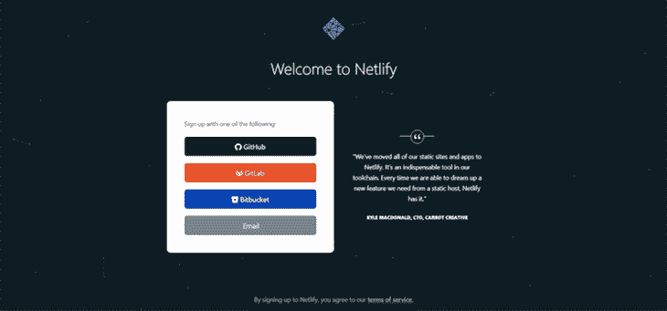

与 Vercel 一样，您可以选择通过 Netlify Dashboard 或 Netlify CLI 部署您的应用程序。

### 使用 Netlify 拖放进行部署

Netlify 提供的最酷的功能之一是能够在 Netlify 仪表板上拖放您的站点文件夹，并让它像变魔术一样部署您的应用程序。

对于 React 应用程序，您必须将`build`文件夹拖放到 Netlify 仪表板上。预先运行`npm run build`来部署最新的构建。

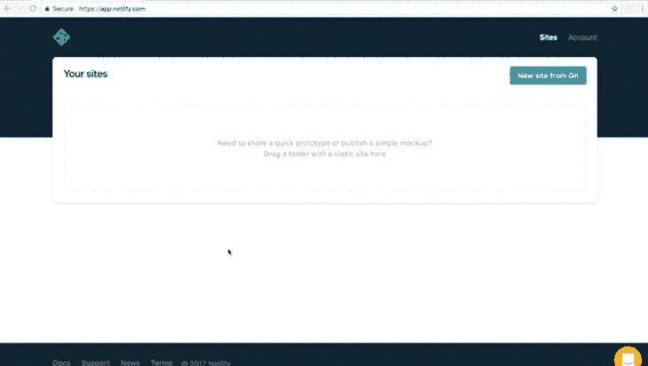

您也可以连接 GitHub、GitLab 或 Bitbucket，这取决于您的项目存储的位置。这允许在您推送更改时自动部署。

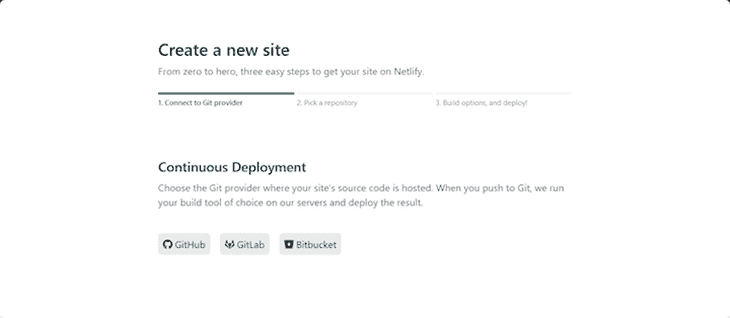

选择要部署的项目存储库。

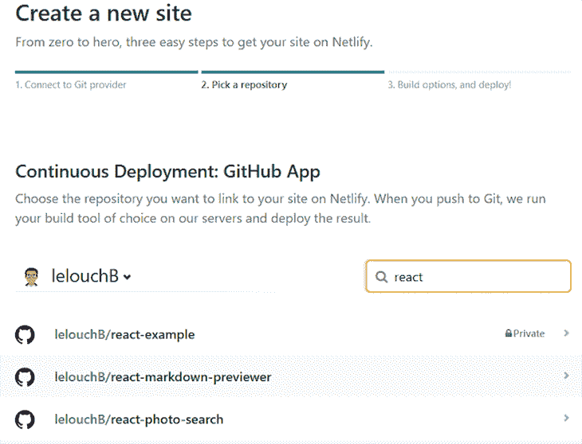

一旦选择了项目，最后一步就是配置，Netlify 会自动检测项目是否用 Create React App 初始化。

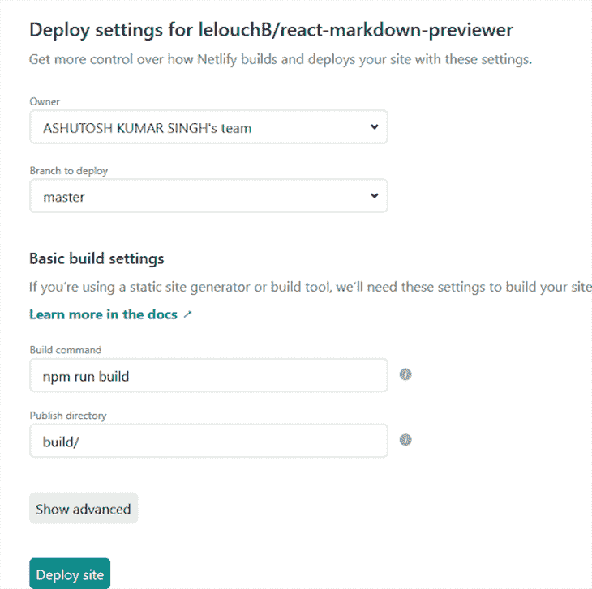

点击**部署站点**，你的 app 就部署好了！

### 使用 Netlify CLI 部署

如果您喜欢通过终端部署应用程序，以下是使用 Netlify CLI 部署应用程序的步骤。要部署最新的构建，预先运行`npm run build`并全局安装`netlify-cli`。

```
npm install netlify-cli -g

```

在项目根目录中，运行以下命令。

```
netlify deploy

```

可能会提示您授予对 Netlify CLI 的访问权限。点击**授权**。

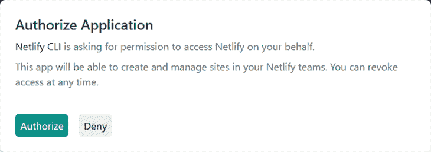

成功授权后，您将在终端中看到一条成功登录的消息。

```
You are now logged into your Netlify account!

```

以下步骤将指导您完成终端中会遇到的提示。

首先，您将被要求将此项目链接到一个站点，因为这是您第一次部署此应用程序。选择`Create configure a new site`。

```
This folder isn't linked to a site yet
? What would you like to do?
Link this directory to an existing site
Create configure a new site

```

然后你会被要求`Team`。除非您已经在本地机器上使用 Netlify，否则您很可能只会看到一个以您的名字命名的选项；选择它。

```
? Team:
ASHUTOSH KUMAR SINGH's team

```

下一个提示是`Site name`。这是一个可选字段，如下所示。如果你已经想好了一个名字，输入并按回车键。如果您将此字段留空，Netlify 将为该站点提供一个随机名称，您可以在以后更改该名称。

```
Choose a unique site name (e.g. netlify-thinks-lelouchB-is-great.netlify.app) or leave it blank for a random name. You can update the site name later.
? Site name (optional):

```

在这一步之后，你的站点将被创建，你将被要求一个`Publish directory`。在这里输入`build`。

```
Please provide a publish directory

? Publish directory build

```

这样，你的网站将被发布，你将获得一个草稿 URL。

```
Deploying to draft URL...
✔ Finished hashing 19 files
✔ CDN requesting 10 files
✔ Finished uploading 10 assets
✔ Draft deploy is live!

Logs:https://app.netlify.com/sites/serene-fermi-6d50a8/deploys/5f1194c3b903cadb238eabb4 
Website Draft URL: https://5f1194c3b903cadb238eabb4--serene-fermi-6d50a8.netlify.app

If everything looks good on your draft URL, deploy it to your main site URL with the --prod flag.
netlify deploy --prod

```

转到此草稿 URL。如果一切正常，您可以将网站部署到主站点 URL。
运行以下命令部署到生产环境。

```
netlify deploy --prod

```

它将最后一次询问`Publish directory`。键入`build`并按回车键。您将获得两个网址。

```
Unique Deploy URL: https://5f11977085ef8fafe7535ff9--serene-fermi-6d50a8.netlify.app
Website URL:       https://serene-fermi-6d50a8.netlify.app

```

这两个 URL 的区别在于,`Unique Deploy URL`指向应用程序的特定版本。例如，如果您对应用程序进行了更改并再次部署，您将获得另一个特定于该更改的`Unique Deploy URL`。您的`Website URL`是主 URL，它对应于您的应用程序的最新版本。

如果您的应用程序使用路由器，比如 [React Router](https://blog.logrocket.com/react-router-v6-future-reach-router/) ，您可能会遇到 404 错误。

在您的`build`文件夹中，创建一个名为`_redirects`的新文件，并向其中添加以下内容。

```
/*    /index.html  200

```

重新部署您的应用程序以查看更改。

## github pages-github 页面

GitHub Pages 是初学者部署网站的最快和最广泛使用的方法之一。使用 [GitHub Actions](https://github.com/marketplace?type=actions) ，您可以触发自动部署、[配置 CI/CD](https://blog.logrocket.com/ci-cd-node-js-github-actions/) 等等——这比本指南中描述的许多其他工具更易于维护。

创建一个 GitHub 帐户(如果你还没有的话),然后为你的应用程序创建一个资源库。

当您创建一个新的存储库时，您将获得存储库 URL 和 Git URL。


在您的终端中，将本地目录初始化为 Git 存储库，提交所有更改，并通过在项目根目录中运行以下命令将其推送到 remote。

```
git init
git add .
git commit -m "initial commit"
git remote add origin (repository remote git url here)
git push -u origin master

```

有了这个，你的项目就会被推送到 GitHub。

在项目的`package.json`中，添加一个`homepage`字段，如下所示:

```
"homepage": "https://myusername.github.io/my-app"

```

`myusername`是您的 GitHub 用户名，`my-app`是您的存储库名称。

接下来，在您的项目中安装`gh-pages`。

```
npm install --save gh-pages

```

在您的`package.json`中，添加以下脚本。

```
"scripts": {
+   "predeploy": "npm run build",
+   "deploy": "gh-pages -d build",
    "start": "react-scripts start",
    "build": "react-scripts build",
    "test": "react-scripts test",
    "eject": "react-scripts eject"
}

```

`predeploy`和`deploy`是对脚本的唯一补充。`predeploy`将在`deploy`之前自动运行，并确保应用程序的最新版本已部署。

运行以下命令来部署应用程序。

```
npm run deploy

```

该命令将在项目的 GitHub 存储库中创建一个名为`gh-pages`的新分支。您可能需要设置一个源，这可以在存储库设置中的 GitHub Pages 选项下完成。将其设置为`gh-pages branch`。

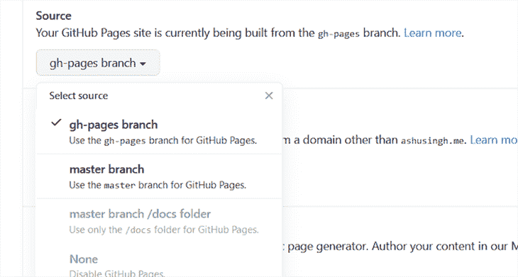

## Heroku

Heroku 是一个云应用平台，自 2007 年推出以来吸引了大量开发者。原因之一是它支持大多数编程语言，包括 Go、Node.js、Clojure 等。

### 使用 Heroku CLI 部署

像我们到目前为止讨论的大多数其他服务一样，首先在 Heroku 上创建一个免费账户。

通过运行以下命令全局安装`heroku-cli`。

```
npm install -g heroku

```

您可以在[官方文档](https://devcenter.heroku.com/articles/heroku-cli)中了解其他安装方法。

登录`heroku-cli`。

```
heroku login

```

浏览器会提示您登录您的帐户。点击**登录**。


我们将使用 [Heroku Buildpack 来创建 React 应用程序](https://github.com/mars/create-react-app-buildpack#user-content-create-the-heroku-app)以实现快速部署。以下是您需要的所有代码；您可以一步完成复制/粘贴和部署！

```
git init
heroku create -b https://github.com/mars/create-react-app-buildpack.git
git add .
git commit -m "react-create-app on Heroku"
git push heroku master
heroku open

```

这可能是通过终端部署的[最快方式，因为您不必回答任何提示，就像我们在其他 CLI 中所做的那样。](https://blog.heroku.com/deploying-react-with-zero-configuration)

### 使用 Heroku 仪表板部署

您也可以通过 Heroku 的仪表板来部署。首先，确保您的项目存储在 GitHub 存储库中。

进入你的 [Heroku 仪表盘](https://blog.heroku.com/deploying-react-with-zero-configuration)，点击**新建**，然后点击**新建 app** 。


系统会提示您为项目命名。键入您的应用程序名称，然后单击**创建应用程序**。

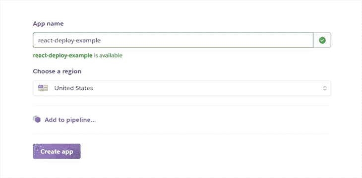

创建应用程序后，同步 GitHub 存储库。你会在你的应用仪表板上看到类似这样的东西。

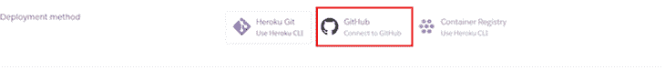

一旦您成功地将 GitHub 连接到 Heroku，您就可以搜索项目存储库并部署它。

从存储库列表中选择您的项目。

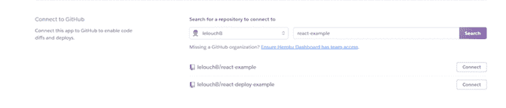

您将有两种选择:手动或自动部署，这意味着无论何时您将更改推送到 GitHub，Heroku 都会自动为您部署新网站。出于本教程的目的，我们将采用手动部署。

点击**手动部署**下的**部署分支**，一旦构建过程完成，您的应用将被部署。

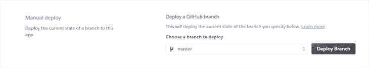

## 汹涌

Surge 是另一种快速部署前端项目的方法。与其他 CLI 相比，它需要更少的配置，易于部署，并允许您在首次使用时直接从终端创建一个 Surge 帐户。

若要部署项目的最新版本，请在项目根目录中运行以下命令。

```
npm run build

```

要在全球范围内安装 Surge CLI:

```
npm install -g surge

```

在`build`文件夹中运行`surge`。

```
cd build
surge

```

按照提示操作。首先，你会被要求输入电子邮件和密码。

```
Welcome to surge! (surge.sh)
Login (or create surge account) by entering email & password.
      email: [email protected]
      password:

```

在填写任何其他提示之前，最好确认您的 Surge 帐户。

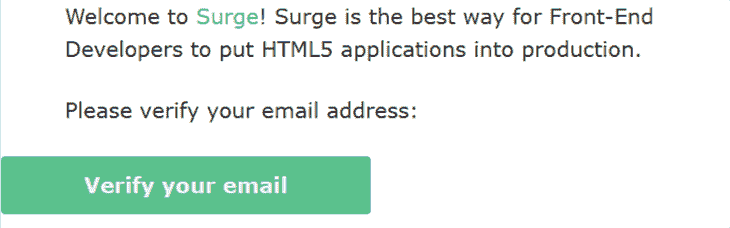

在终端中，您将被要求确认您的项目目录。按回车键。

您将看到项目的域。再次按回车键。

```
    project: D:\code\react-example-deploy\build\
    domain: tremendous-person.surge.sh 

```

这将发布您的应用程序。

```
   Success! - Published to outstanding-scent.surge.sh

```

在 surging 支持 HTML5 [`pushState` API](https://surge.sh/help/adding-a-200-page-for-client-side-routing) 之前，您可能想将您的`build`文件夹中的`index.html`重命名为`200.html`，React 库使用该 API 进行路由。

如果遇到中止的错误，尝试[再次运行`surge`命令](https://github.com/sintaxi/surge/issues/55)。

## 提供；给予

[Render](https://render.com/) ，创业战场在 [Disrupt SF 2019](https://github.com/sintaxi/surge/issues/55) 的获胜者，是一个人气正在上升的较新的云平台。

虽然在 Render 上托管站点是免费的，但你需要为其他服务付费，比如数据库、cron 任务、Docker 容器和渲染磁盘。Heroku 和 Render 都被归类为平台即服务。

### 使用渲染部署

在部署之前，确保您的项目存储在 GitHub 存储库中，然后在 [Render](https://dashboard.render.com/) 上创建一个帐户。

接下来，点击**仪表盘上的**新增**静态站点**。

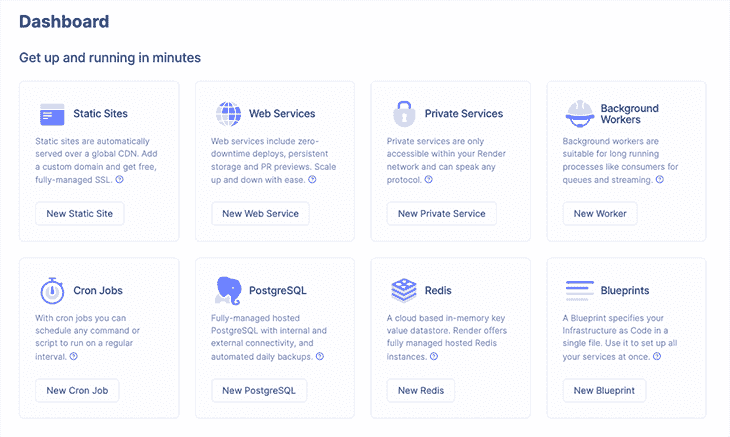

如果这是你第一次使用 Render，你需要连接你的 GitHub 或者 GitLab，不管你的库在哪里。

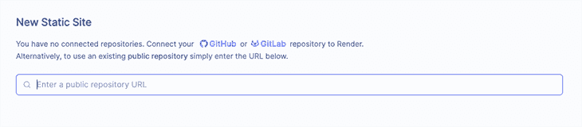

连接后，搜索并选择您的项目存储库。之后，您需要为您的 web 服务取一个唯一的名称。

Render 将自动检测您的应用程序是否使用 Create React App 引导，并相应地填充配置。

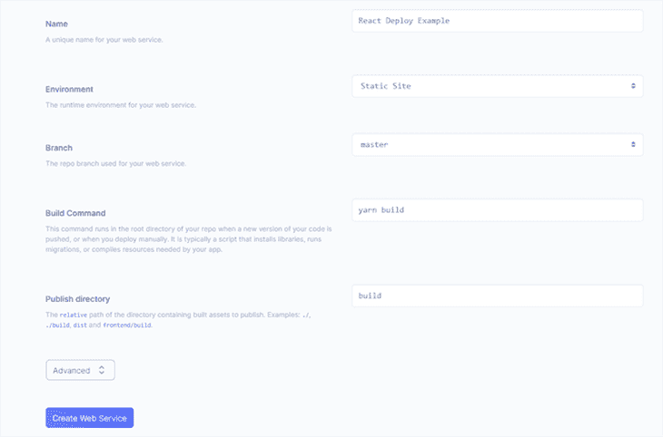

点击**创建** **静态站点**，之后您的项目将被部署。

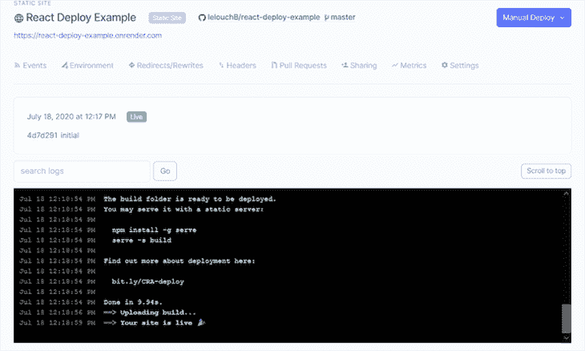

### 客户端路由

如果您的项目使用 React Router 之类的东西，您需要将所有路由请求重定向到`index.html`。转到服务的**重定向/重写**选项卡，添加规则，并保存更改。

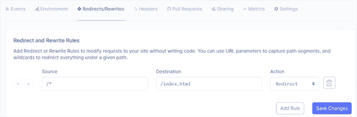

## GitLab 页面

您还可以使用 [GitLab Pages](https://docs.gitlab.com/ee/user/project/pages/) 直接从 GitLab 的存储库中发布静态站点。使用 GitLab 页面，您可以轻松连接您的自定义域和 TLS 证书。

如果您还没有，请创建一个 [GitLab 帐户](https://gitlab.com/users/sign_up)。

创建帐户后，您将看到以下选项来添加 React 应用程序。

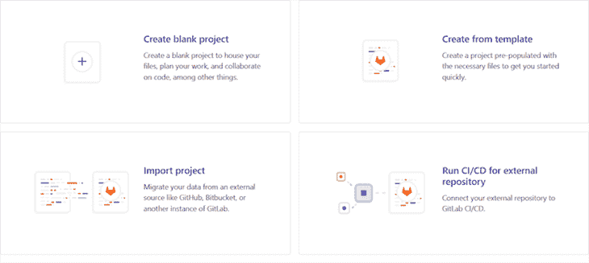

如果您的项目已经在 GitHub 上，那么选择**导入项目**并导入项目。否则，选择**创建空白项目**并创建一个空项目。

给你的项目命名，然后点击**创建项目**。

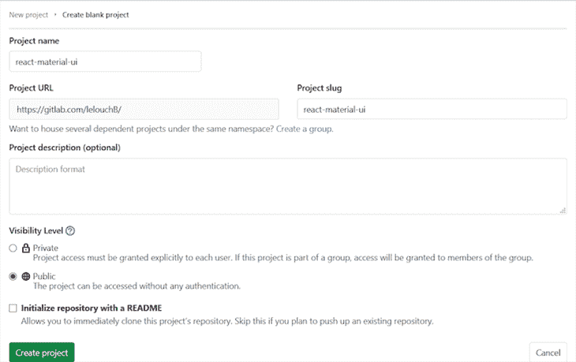

在下一页，您将看到添加 React 项目的各种命令，这些命令是根据您的凭证配置的。

在您的终端中，将本地目录初始化为 Git 存储库，提交所有更改，并通过在项目根目录中运行以下命令将其推送到 remote。

```
git init
git remote add origin [email protected]:<username/project-name>.git
git add .
git commit -m "Initial commit"
git push -u origin master

```

确保用您的用户名和项目名称替换`<username/project-name>`。例如:

```
git remote add origin [email protected]:lelouchB/react-material-ui.git

```

在您项目的`package.json`中，添加一个`homepage`字段。

```
"homepage": "https://myusername.gitlab.io/my-app"

```

`myusername`是您的用户名，`my-app`是您项目的名称。例如:

```
"homepage":"https://lelouchB.gitlab.io/react-material-ui/"

```

创建一个名为`.gitlab-ci.yml`的新文件，并向其中添加以下代码。

```
image: node:10 # change to match your node version

cache:
  paths:
    - node_modules/

before_script:
  - rm -rf build
  - npm install

pages:
  stage: deploy
  script:
    - npm run build
    - rm -rf public
    - mv build public
  artifacts:
    paths:
      - public
  only:
    - master

```

提交该文件后，将启动一个管道。这将把您的 React 应用程序部署到 GitLab 页面。你可以在`CI/CD`标签下看到这条管线。

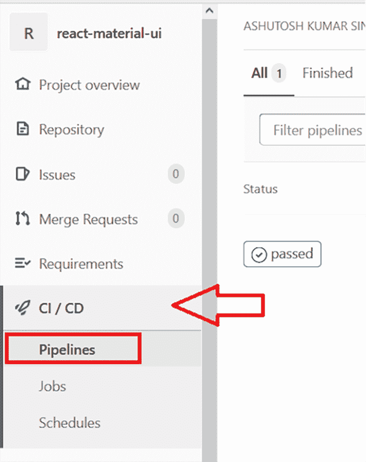

管道成功通过后，在第一次部署后，站点可能需要 30 分钟才可用，因此请耐心等待。

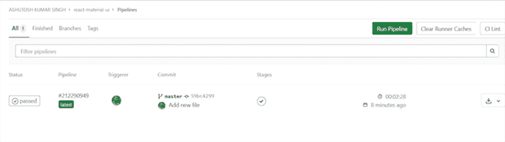

你可以在`Settings/Pages`标签下管理你的 React 应用。

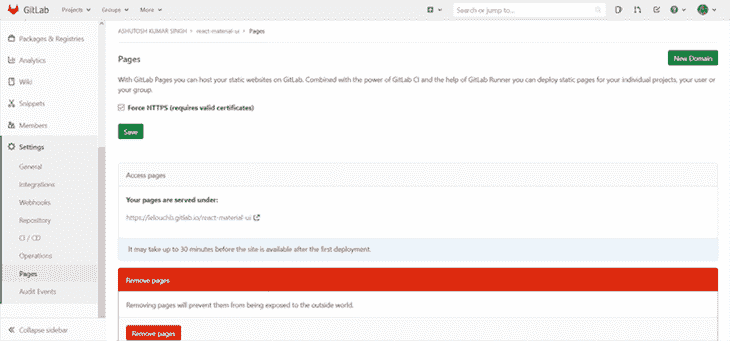

您的应用程序将被部署到相同的 URL，正如在`package.json`的`homepage`字段中提到的。

## 摘要

## 其他一些值得一试的平台

以下平台可能不是最好的托管平台，但主要是因为其他服务而闻名，如后端、数据库和存储。我也提到了他们的托管计划。

*   [StormKit](https://www.stormkit.io/) —免费层提供单个应用部署
*   Platform.sh —提供 30 天免费试用
*   Bip —提供七天免费试用

## 结论

既然我们已经讨论了部署 React 的八种不同方式，您应该尽可能多地尝试，以确定哪种方式最符合您的部署需求。毕竟，它们是免费使用的。

为了下一步做得更好，请尝试向您部署的应用程序添加自定义域。项目有一个独特的域是很好的，它有不同的方式来添加一个定制的域——一些简单，一些相对复杂。

下次见，编码快乐！