# TypeScript - LogRocket 博客的 9 个基本 VS 代码扩展

> 原文：<https://blog.logrocket.com/9-essential-vs-code-extensions-typescript/>

TypeScript 具有可用于定义类型的类、接口和模块。将 TypeScript 与 JavaScript 一起使用总是一个好习惯。

如果您使用 VS 代码编写代码，那么它有丰富的扩展来帮助轻松配置和使用 TypeScript。以下是 TypeScript 的一些基本 VS 代码扩展。

## **type script ESL**型式脚本式脚本式脚本式脚本式脚本式脚本式脚本式脚本式脚本式脚本式脚本式脚本式脚本式脚本式脚本式脚本式脚本式脚本式脚本式脚本式脚本式脚本式脚本式脚本式脚本式脚本式脚本式脚本式脚本式脚本

TS ESLint 是使用 TypeScript 时必备的 VS 代码扩展。TypeScript ESLint 用于 Lint 您的代码并检查基本的代码准则。通过使用它，您可以确保基本的代码质量和完整性。

### 为什么使用林挺？

您知道 JS 是一种解释器语言，所以每个错误都是在运行时遇到的，因为没有编译阶段。您需要确保您的代码在执行阶段不会抛出任何错误。

ESLint 在捕捉错误方面做得非常好。除此之外，当您的代码被其他人使用或者当您的项目有多个参与者时，维护代码约定是必要的。通常，linters 用于识别基本错误，如范围错误和未声明的变量赋值。

### 设置 VS 代码 ESLint

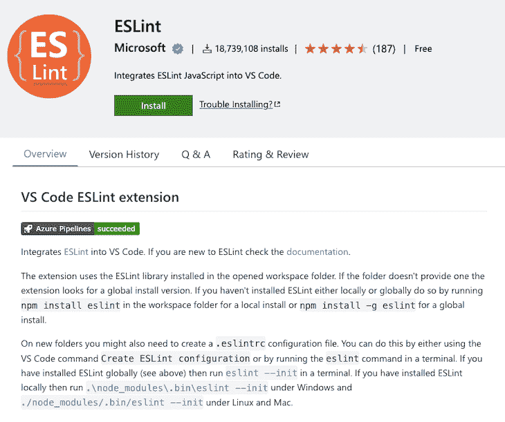

一旦你[安装了 ESLint](https://marketplace.visualstudio.com/items?itemName=dbaeumer.vscode-eslint) ，它就可以在 VS 代码中使用。如果您的项目有一个本地 ESLint 文件，它就可以工作。如果没有找到，那么它将检查系统中的全局配置文件。在接下来的步骤中，您可以找到如何在现有的或新的项目中配置 ESLint。

安装后，您也可以更改默认的 ES Lint 设置。进入**代码** > **首选项** > **设置**然后直接在搜索栏输入 **ESLint** 或者在**扩展**菜单下找到 ESLint 并点击。确保您在**用户**选项卡中。现在你可以看到 VS 代码提供的所有设置。还有一个修改 VS 代码默认`setting.json`的条款。

### 如何配置 TypeScript ESLint？

通过运行给定的命令，安装整个项目中所需的基本依赖项:

```
> npm install --save-dev eslint typescript @typescript-eslint/parser @typescript-eslint/eslint-plugin

```

现在您需要配置 lint 文件。为此有两种选择:要么手动配置它，要么直接在根目录下创建一个 lint 文件。我们来了解一下如何手动配置。运行以下两个命令中的任意一个:

```
> eslint --init 

> npm init @eslint/config

```

之后，您需要为所提问题选择适当的选项。让我们从第一步开始；根据您的要求选择:

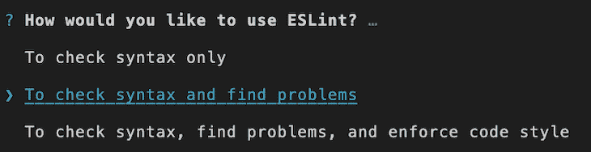

最佳实践是使用第三种方法，这样您就可以分析代码语法缺陷，并且对于大规模的分析来说会更好。

转到第二步，根据您的项目指南选择一个选项:

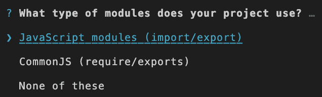

下一个问题是关于您的项目框架的:

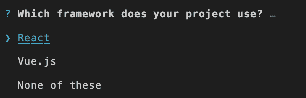

在这之后，它将要求使用 TypeScript:


当然是 TypeScript 项目，所以需要点击**是**。因为 TypeScript 和 ESLint 对前端和后端都有用，所以下一步是确定您的项目适用于哪一个:

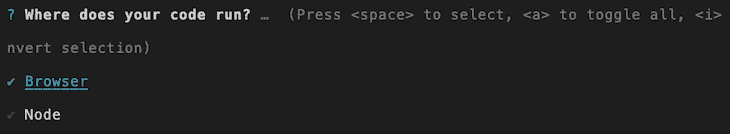

现在选择一个样式指南:

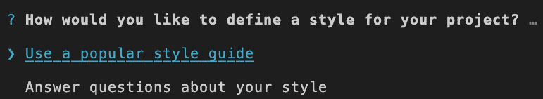

它纯粹是基于你的项目需求。你可以选择任何一种。下一个问题是关于配置文件格式。选择你觉得合适的形式:

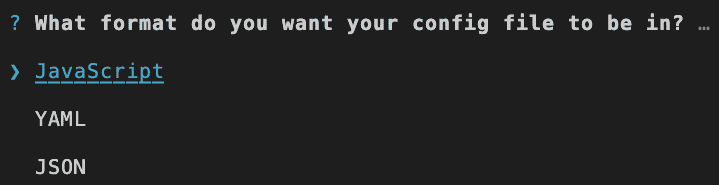

然后，它会根据您的选择要求您安装依赖项；你只需要选择**是**选项。

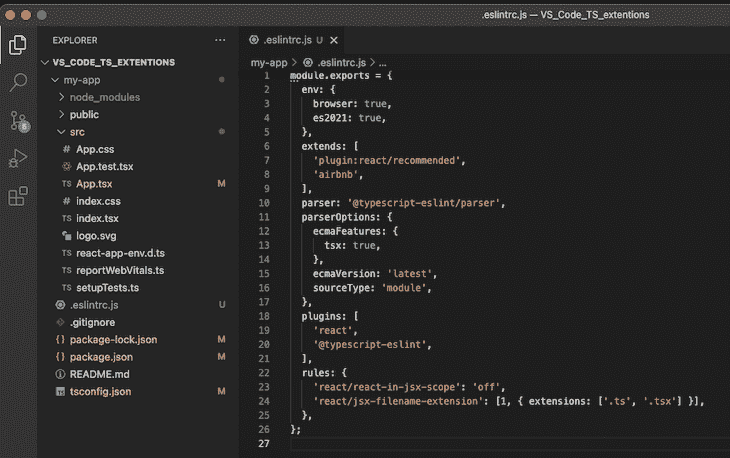

成功安装依赖项后，您可以在您的项目根中看到带有您选择的选项的`.eslintrc.js`(这里，扩展名是`.js`，因为我在配置文件格式中选择了 JavaScript)文件。最初，规则有一个空对象。对于 TypeScript 支持，您需要添加一个类似于`react/jsx-filename-extension': [1, { extensions: ['.ts'] }]`的规则。

在“扩展名”部分，您可以添加文件扩展名。例如，对于 React，`.tsx`也是必需的。此外，您可以从[可用规则](https://eslint.org/docs/rules/)中添加任何您想要的规则。

第二种方法是在项目根目录下创建 JavaScript、JSON 或 YAML 文件，并从头开始编写。下面是一个`.js`文件的例子:

```
//.eslintrc.js
module.exports = {
    rules: {
        // Write rules here
    }
};

```

如果您打开任何文件，如果它不符合类型脚本规则，它将有一个彩色下划线。如果您想了解关于错误或警告的更多信息，将鼠标悬停在带下划线的代码上，您会看到一条弹出消息。有两个按钮:一个是查看问题的更多细节，另一个是快速修复问题。**快速修复**选项仅适用于某些规则。

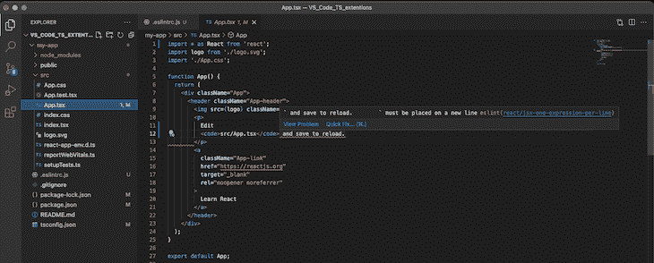

您还可以通过将某些特定的代码块封装在`/* eslint-disable */`和`/* eslint-enable */`中来禁用 ES Lint。如果是单行，就在你的行尾加上`// eslint-disable-line`。当您想要禁用林挺时，这很有用。

VS 代码提供的另一个很好的特性是，当你保存文件时，它提供了一个自动修复问题的选项。为此，您需要更改设置。进入**代码** > **偏好** > **设置**，在搜索栏中输入 ES Lint。

搜索结果出现后，点击 **ESLint** 表单扩展。之后，选择搜索框正下方的**工作区**选项卡。在右侧，你可以在 settings.json 中看到类似**编辑的选项。当你点击它时，它会将你导航到你的工作区的 ESLint 设置文件。你需要复制下面写的几行:**

```
{
    "editor.codeActionsOnSave": {
        "source.fixAll.eslint": true
    },
    "eslint.validate": ["typescript", "typescriptreact"]
}

```

有了这个设置，VS 代码将在保存时纠正基本错误。

### 领先公司提供的 ESLint 配置

当你写代码的时候，有三件事情需要处理:架构、风格和可维护性。从长远考虑，最好遵循 ESLint 最佳实践。

如果你的代码每次都没有效率，你就需要重构它。所以最好在一开始就照顾好你的代码。代码质量应该高且一致。领先的 IT 公司提供了一些最佳的 ESLint 配置:

如果这些不适合你，还有很多配置可供选择。或者你可以做你自己的配置并在项目中使用它。TS 还提供了避免某些规则或添加自定义规则的功能。

### 手动运行 ESLint

假设您在一个项目中禁用了林挺，但是您想要签入一个特定的文件。您只需运行:

```
eslint fileName.ts

```

如果文件包含错误，那么每个错误将按顺序列出。

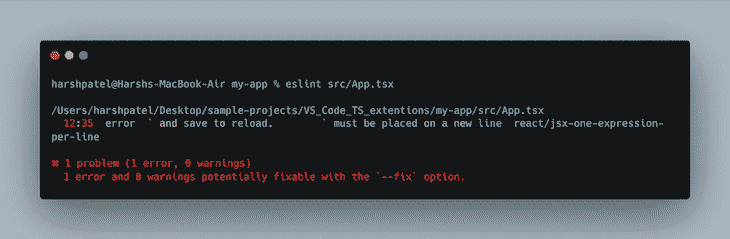

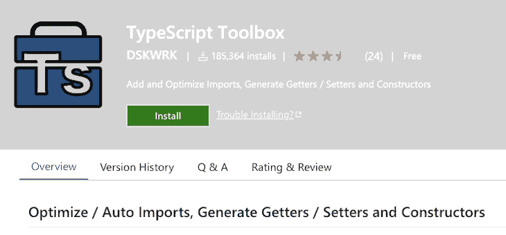

当你想改进现有的 VS 代码生成扩展时，TypeScript 工具箱是最好的选择。如概述所示，它主要用于代码生成。除此之外，它还用于以下情况:

*   自动添加缺失的导入并删除未使用的导入。
    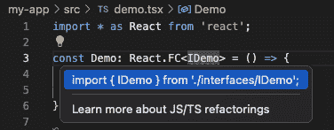
    当你点击黄色灯泡图标时，那么你可以看到一个关于缺失进口的弹出窗口。一旦你点击它，它将被添加到你的代码。
*   自动生成具有适当名称的 getter/setter。
    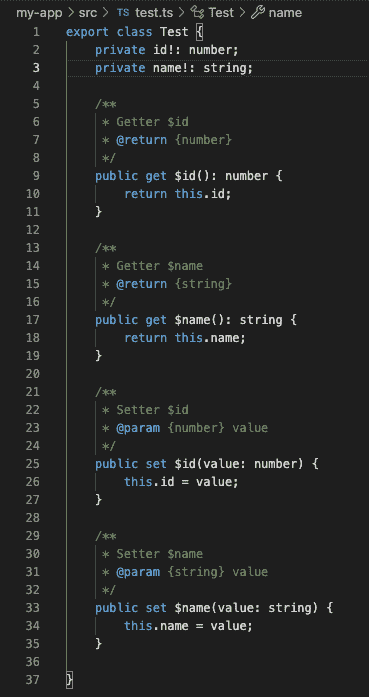
    可以看到，所有的 getter 和 setter 方法都是正确生成的。只需几个步骤，就可以生成所有的方法；它节省了很多时间。
*   当处理类时，它会自动生成构造函数。
    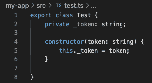
    在这段代码中，构造函数是使用 TypeScript 工具箱自动生成的。

## 打字稿导入程序

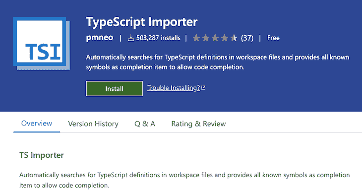

当您想要导入文件中使用的每个外部模块时，有必要节省时间。当您想在文件中添加一个适当的导入语句而不编写它时，TS importer 是最好的扩展。

[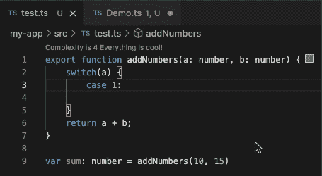](https://blog.logrocket.com/essential-vs-code-extensions-typescript/using-ts-importer-2/)

您可以从视频中看到如何添加导入。在屏幕后面，它在现有的工作空间中搜索定义，如果可用，它就会显示在下拉列表中，只需选择它就会被导入。

## Ponicode


测试项目的单个单元总是一个好的实践。单元测试将提供关于项目的单个单元的有用见解，如果你使用 TypeScript 和 VS 代码， [Ponicode](https://marketplace.visualstudio.com/items?itemName=ponicode.ponicode) 可以减轻你的单元测试任务。

Ponicode 识别哪些功能需要测试，并使用 AI 生成单元测试用例，因此您可以运行测试用例并检查输出。因此，代码将是无错误的。

Ponicode 提供了一个很好的 GUI 来编写测试套件，一个相应的测试文件将由正确编写的测试用例生成。它还推荐了最佳测试用例。

除此之外，Ponicode 只需一次点击就可以生成端到端的测试用例，因此您可以实现高覆盖率。

[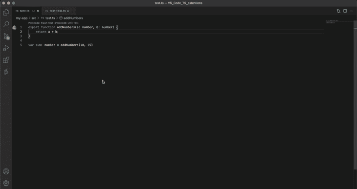](https://blog.logrocket.com/essential-vs-code-extensions-typescript/ponicode-demo-2/)

你可以看到它为一个简单的功能快速生成了测试用例。您只需要从 GUI 中选择或添加测试数据，其余的将由 Ponicode 处理。

## 代码度量

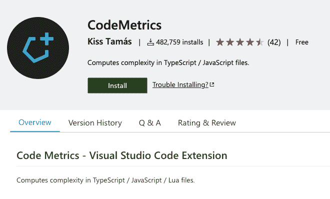

代码复杂性确实很重要。有时候逻辑可能很简单，但是代码是用许多不必要的条件或复杂的逻辑编写的，这导致了反射。反映时间和精力的影响。因此，像 [CodeMetric](https://marketplace.visualstudio.com/items?itemName=kisstkondoros.vscode-codemetrics) 这样的工具是有用的。CodeMagic 根据其预定义的条件识别代码的复杂性。

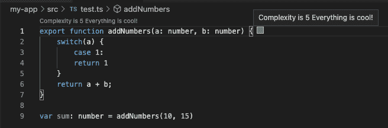

在一个函数的开始，你可以看到复杂度数字；这是 CodeMetric 提供的默认设置，但是可以定制。只需编辑`codemetrics.basics`文件的设置。当你想写优化的代码时，这是非常有用的。

## 移到

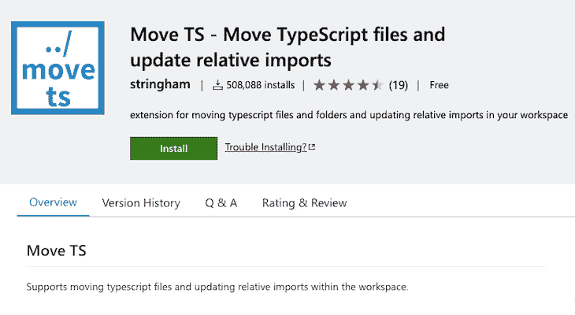

文件经常需要从一个目录移动到另一个目录。如果一个项目包含许多文件，很难跟踪该文件在哪里被使用。如果你没有使用 [Move TS](https://marketplace.visualstudio.com/items?itemName=stringham.move-ts) ，那么你需要搜索它，然后遍历到每个文件，手动改变导入路径。移动 TS 使这项工作变得更容易。如果您更改文件位置，那么它将自动更改所有相对使用的路径。很简单，对吧？

## DotEnv


While working on multiple environments, we need to manage multiple .env files that contain our environment configurations. Currently, VS Code has no default syntax highlighter for .env files. Now imagine your file without syntax highlights. It will look like this:

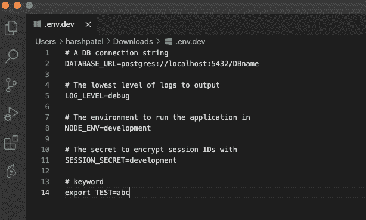

使用 DotEnv 扩展名，您的文件看起来很好，因为您可以识别每个变量的键和值。这将防止大的错误。

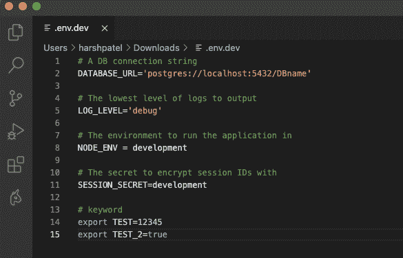


While working with multiple team members, it’s always a good practice to put comments about the code, which saves lots of time for your colleagues. They can quickly understand the working flow and code just by reading the comments. On the other hand, a poorly-written comment will spoil the result.

为了更好的注释管理，VS 代码有一个名为 Better Comments 的扩展。它将创建可读的注释。您可以按类别创建彩色注释。例如，对于警告，使用红色。

## Quokka.js


在 VS 代码中，Quokka.js 为 TypeScript 和 JavaScript 提供了一个活动场所。您可以运行示例代码并查看动态变化。我们知道，如果我们想尝试一些东西，我们导航到浏览器的控制台或在节点终端中尝试。

除此之外，Quokka.js 显示的运行时错误确实节省了大量时间。

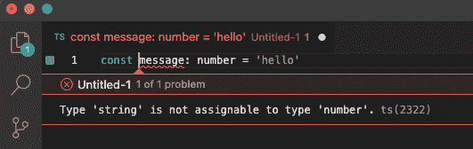

如果你真的喜欢它，你可以购买专业版。它还有额外的好处，比如实时评论、CPU 剖析器、实时性能测试等等。

## 结论

VS 代码是一个广泛使用的编程 IDE。拥有多个 TypeScript 扩展将是最棒的。

扩展将帮助您编写优雅的代码，并通过自动化一些任务来节省时间。VS 代码为用户提供了很好的支持。如果您是 TS 开发人员，那么您应该使用这些扩展来使您的代码美观且没有错误。

## [LogRocket](https://lp.logrocket.com/blg/typescript-signup) :全面了解您的网络和移动应用

[](https://lp.logrocket.com/blg/typescript-signup)

LogRocket 是一个前端应用程序监控解决方案，可以让您回放问题，就像问题发生在您自己的浏览器中一样。LogRocket 不需要猜测错误发生的原因，也不需要向用户询问截图和日志转储，而是让您重放会话以快速了解哪里出错了。它可以与任何应用程序完美配合，不管是什么框架，并且有插件可以记录来自 Redux、Vuex 和@ngrx/store 的额外上下文。

除了记录 Redux 操作和状态，LogRocket 还记录控制台日志、JavaScript 错误、堆栈跟踪、带有头+正文的网络请求/响应、浏览器元数据和自定义日志。它还使用 DOM 来记录页面上的 HTML 和 CSS，甚至为最复杂的单页面和移动应用程序重新创建像素级完美视频。

[Try it for free](https://lp.logrocket.com/blg/typescript-signup)

.