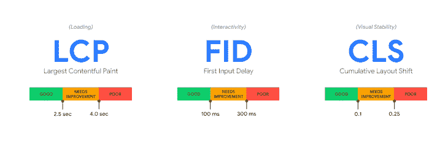
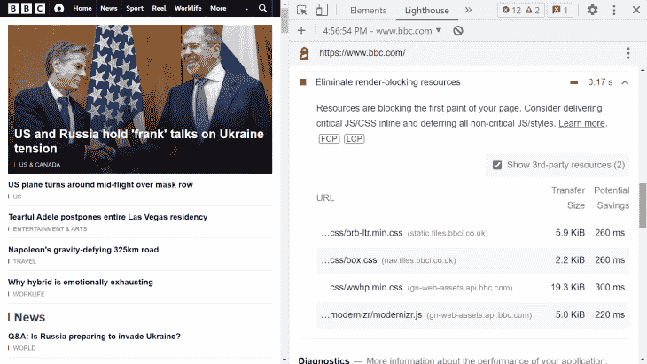
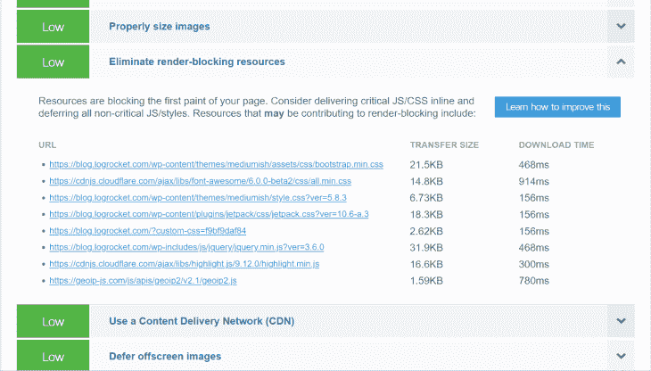
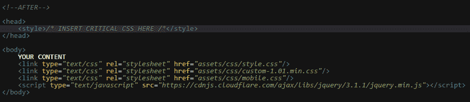
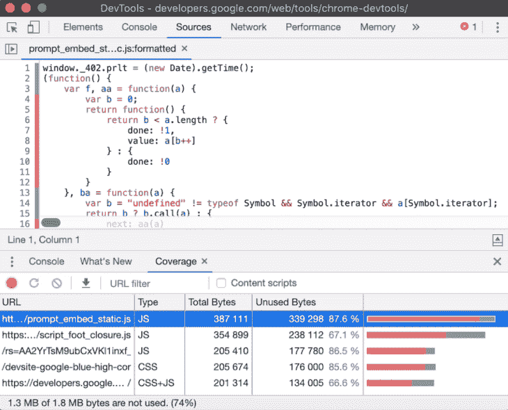

# 消除渲染阻塞资源的 9 个技巧

> 原文：<https://blog.logrocket.com/9-tricks-eliminate-render-blocking-resources/>

***编者按:**这篇文章于 2022 年 1 月 28 日更新，包含了关于谷歌核心网络生命指标发布的信息。*

## 什么是渲染阻塞资源？

渲染块资源是静态文件，如字体、HTML、CSS 和 JavaScript 文件，它们对渲染网页的过程至关重要。当浏览器遇到渲染阻塞资源时，它会停止下载其余的资源，直到这些关键文件得到处理。与此同时，整个渲染过程将暂停。

另一方面，非呈现阻塞资源不会推迟页面的呈现。在最初的页面呈现之后，浏览器可以在后台安全地下载它们。

但是，并不是所有浏览器认为渲染阻塞的资源对于第一次绘制都是必不可少的；这完全取决于页面的个人特征。您可以使用最佳实践将这些非关键的渲染阻塞资源转换为非渲染阻塞资源。此外，您还可以减少仍然重要且无法消除的渲染阻塞资源的数量和/或大小。

在本文中，我将回顾消除渲染阻塞资源的九个技巧和诀窍。它们是:

1.  1.  [识别你的渲染阻塞资源](#identify-render-blocking-resources)
    2.  [不要用`@import`规则](#dont-add-css-import-rule)添加 CSS
    3.  [对条件 CSS 使用`media`属性](#use-media-attribute-conditional-css)
    4.  [推迟非关键 CSS](#defer-non-critical-css)
    5.  [使用`defer`和`async`属性来消除阻塞渲染的 JavaScript](#use-defer-async-attributes-eliminate-render-blocking-javascript)
    6.  [找到并删除未使用的 CSS 和 JavaScript](#find-remove-unused-css-javascript)
    7.  [将代码分割成更小的包](#split-code-smaller-bundles)
    8.  [缩小 CSS 和 JavaScript 文件](#minifiy-css-javascript)
    9.  [本地加载自定义字体](#load-custom-fonts-locally)

## **为什么要消除渲染阻塞资源？**

如果减少渲染阻塞资源的数量，可以缩短[关键渲染路径](https://blog.logrocket.com/how-css-works-parsing-painting-css-in-the-critical-rendering-path-b3ee290762d3/)，减少页面加载次数，从而改善用户体验和搜索引擎优化。

有三种方法可以减少渲染块资源的数量和影响:

1.  通过推迟下载使它们成为非呈现阻塞资源
2.  使用捆绑等技术减少渲染阻塞资源的总数(这也意味着更少的 HTTP 请求)
3.  通过缩小来减小资源的大小，以便页面加载更少的字节

## 渲染阻塞资源和核心 Web 活力

尽管消除渲染阻塞资源一直是一项重要的性能优化技术，但谷歌新的性能指标[核心 Web Vitals](https://web.dev/vitals/#core-web-vitals) 的引入使其变得更加重要。

由于谷歌的搜索算法中包含了核心的网络要素，如果你想让你的网站在谷歌中排名靠前，你就不能忽视它们。渲染阻塞资源可能会对三个核心 Web 要素之一产生负面影响:最大内容绘画(LCP)。



Source: [https://web.dev/vitals/#core-web-vitals](https://web.dev/vitals/#core-web-vitals)

[LCP](https://web.dev/lcp/#what-is-lcp) 测量用户视窗中可见的最大图像或文本块的渲染时间。如果您的关键渲染路径太长(您有太多的渲染块资源，或者文件太大)，最大的内容元素将需要更长的时间来加载。因此，为了获得更好的 LCP 分数，建议检查渲染阻塞资源的数量和权重。

## **渲染分块资源的类型**

根据经验，浏览器会将它在 HTML 页面的`<head>`部分发现的所有内容视为渲染阻塞。这包括:

*   CSS 样式表
*   添加到`<head>`部分的 JavaScript 文件
*   从 CDN 或本地服务器添加的字体
*   HTML 导入(尽管 [HTML 导入现在已经过时了](https://developer.mozilla.org/en-US/docs/Web/Web_Components/HTML_Imports)，但您仍可能在遗留页面上遇到它们)

位于`<body>`部分底部的图像、媒体文件和`<script>`标签被视为非渲染阻塞资源。

现在，让我们放大九个策略来消除或减少渲染阻塞资源的数量和影响。

## 1.识别您的渲染块资源

无论你有一个现有的网站还是仍在开发阶段，首先要做的是找到你的渲染阻塞资源，这样你就可以决定如何处理它们。幸运的是，现在有许多免费的性能度量工具可以用于这个目的。

最值得注意的是 [Lighthouse](https://developers.google.com/web/tools/lighthouse) ，它现在是 Chrome DevTools 的一部分， [PageSpeed Insights](https://pagespeed.web.dev/) ，以及 [GTmetrix](https://gtmetrix.com/) 。PageSpeed Insights 和 GTmetrix 都是免费的 web 应用程序，使用 Lighthouse 库来测量页面速度、核心 Web 生命周期和其他性能指标。

然而，在 Lighthouse 中，如果您的渲染阻塞资源导致您的站点出现性能问题，您将只能在性能报告的**机会**部分看到**消除渲染阻塞资源**标志。

例如，这是 Lighthouse 对 BBC 主页的警告:



如果你想得到关于你的渲染阻塞资源的反馈，使用前面提到的网络应用。除了识别渲染阻塞资源之外，它们还为您提供了如何消除这些资源的有用提示。

例如，下面是 GTmetrix 为 LogRocket 的博客页面提供的报告的相关部分。您可以看到**消除渲染块资源**建议的优先级较低，但“可能导致渲染块”的文件仍会列出:



你将如何继续前进取决于你的目标。如果您收到有关渲染阻塞资源的警告，您应该尝试并消除它们。如果你没有，你仍然可以应用下面的一些技术，因为它们仍然可以提高你的页面加载时间和核心网站的重要指数。

## 2.不要用`@import`规则添加 CSS

您可以使用以下任一方法将 CSS 添加到页面:

*   您需要添加到 HTML 文件中的`<link rel="stylesheet">`标签
*   您需要添加到 CSS 文件中的`@import`规则

尽管`[@import](https://developer.mozilla.org/en-US/docs/Web/CSS/@import)`规则使你的 HTML 文件更加整洁，并允许你将所有的 CSS 依赖项放在同一个地方，但从性能角度来看，这并不是最好的选择。`@import`规则允许您从其他样式表导入 CSS，但是这会导致浏览器处理您的 CSS 文件更慢，因为它还必须下载导入的文件。在此之前，渲染过程将被阻止。

如果你想在你的页面上添加一个以上的 CSS 文件，你可以使用`<link>`标签或者使用缩小和/或捆绑工具连接文件。

您需要通过以下方式将`[<link>](https://developer.mozilla.org/en-US/docs/Web/HTML/Element/link)`元素添加到 HTML 页面的`<head>`部分:

```
<head>
  <link href="style.css" rel="stylesheet">
</head>

```

默认情况下，浏览器将所有 CSS 文件视为渲染阻止资源。但是，如果将`media`属性添加到`<link>`标签中，就可以向浏览器指示条件 CSS 文件的存在。

条件 CSS 仅在特定条件下适用，例如低于或高于给定的视窗大小或在打印页面上。使用`media`属性，您可以为 CSS 文件定义特定的媒体条件。您可以在 CSS 文件中使用任何用于媒体查询的值。例如:

```
<link href="print.css" rel="stylesheet" media="print">
<link href="large.css" rel="stylesheet" media="screen and (min-width: 1500px)">
<link href="mobile.css" rel="stylesheet" media="screen and (max-width: 600px)">

```

即使这些文件仍在所有设备上下载，如果条件评估为 false，它们也将成为非渲染阻塞资源。但是，如果条件评估为真，它们仍将被呈现为阻塞。

例如，上例中的`mobile.css`样式表将在移动设备上呈现阻塞，最大视窗宽度为`600px`，在大于`600px`的视窗上不呈现阻塞。

如果您有一个包含一个或多个媒体查询的 CSS 文件，您可以提取所有的`@media`规则，并使用这个 [PostCSS 插件](https://www.npmjs.com/package/postcss-extract-media-query)将它们保存为单独的文件。

## 4.推迟非关键 CSS

放入 HTML 页面的`<head>`部分的所有 CSS 文件都被自动视为渲染阻塞资源。但是，您不需要所有这些代码来呈现页面的关键部分:折叠内容。将 CSS 分成关键和非关键部分是一种性能优化技术，自从引入核心 Web Vitals 以来，这种技术已经获得了很大的流行，因为它还提高了 LCP 分数(即折叠上方最大内容元素的呈现时间)。

幸运的是，您不必手动找到您的关键路径 CSS 尽管[可以这样做](https://web.dev/defer-non-critical-css/)。你可以使用在线工具，如[关键路径 CSS 生成器](https://www.sitelocity.com/critical-path-css-generator)或阿迪·奥斯马尼的[关键](https://github.com/addyosmani/critical)库，来提取与你的上述内容相关的 CSS 规则。

例如，关键路径 CSS 生成器生成两个可下载的 CSS 文件:一个“关键”文件和一个“组合”文件。您可以将关键的 CSS 文件作为外部资源添加到`<head>`部分，或者使用`<style>`标记内联它，以减少 HTTP 请求的数量。

组合的 CSS 文件包含了所有的 CSS 规则，您需要将它移到结束的 `<body>`标记之前，这样它将成为一个非呈现阻塞资源。您可以阅读生成器下面的详细说明，但优化后的代码应该是这样的:



Source: [https://www.sitelocity.com/critical-path-css-generator](https://www.sitelocity.com/critical-path-css-generator)

或者，您也可以使用 JavaScript 在浏览器下载完页面后动态加载下层 CSS。这种技术在关键路径 CSS 生成器(方法二)中也有详细介绍，它将进一步提高你的网站的性能。然而，它不会有助于消除渲染阻塞资源，因为非关键 CSS 已经被移出了`<head>`部分。

## 5.使用`defer`和`async`属性来消除渲染阻塞 JavaScript

与 CSS 类似，默认情况下，添加到文档的`<head>`部分的 JavaScript 文件也被视为渲染阻塞资源。

您可以通过将`<script>`标签放在结束的`</body>`标签之前而不是`<head>`部分之前，将它们从关键渲染路径中移除。在这种情况下，它们只在整个 HTML 下载完毕后才开始下载。但是，由于这些脚本的下载开始得较晚，因此它们加载的元素(如广告、动画或动态功能)可能会比前端的其余部分加载得晚，尤其是如果它是一个较长的脚本。这可能会在较慢的连接上导致明显的延迟和滞后的用户界面，这对用户体验不利。

`[<script>](https://developer.mozilla.org/en-US/docs/Web/HTML/Element/script)`标签的`defer`和`async`属性为这个问题提供了一个解决方案。两者都是布尔属性，这意味着如果您添加它们，它们将在没有任何进一步配置的情况下启动。他们还使添加到 HTML 文档的`<head>`部分的脚本不呈现阻塞，但是以不同的方式；延迟脚本尊重文档顺序，而异步脚本独立于 DOM。

属性指示浏览器在后台下载脚本，这样就不会阻碍页面的呈现。一旦 DOM 准备好，延迟脚本就会执行，但是在触发`[DOMContentLoaded](https://developer.mozilla.org/en-US/docs/Web/API/Window/DOMContentLoaded_event)`事件之前。

```
<script src="script01.js" defer></script>
<script src="script02.js" defer></script>

```

延迟脚本遵循文档顺序，就像非延迟的默认脚本一样。例如，在上面的例子中，`script01.js`将首先被执行，而不管哪个脚本首先被加载。您不能将`defer`添加到内联脚本中；它只适用于使用`src`属性指定脚本位置的外部脚本。

* * *

### 更多来自 LogRocket 的精彩文章:

* * *

另一方面，`async`属性通知浏览器脚本完全独立于页面。它将作为非渲染阻塞资源在后台下载，就像延迟脚本一样。然而，与延迟脚本不同，异步脚本不遵循文档顺序，因此它们将在完成下载时执行——这可能在任何时候发生。

例如，在下面的例子中，我们不能确定哪个脚本将首先运行；这完全取决于哪个下载更快(通常是较小的那个)。记住，异步脚本既独立于文档，也相互独立，所以文档顺序不会以任何方式影响它们。

```
<script src="script03.js" async></script>
<script src="script04.js" async></script>

```

对于需要 DOM 的脚本，建议使用`defer`属性，但是您希望在文档加载之前开始下载它们，不要让它们成为呈现阻塞资源。如果文档顺序很重要，你也应该使用`defer`而不是`async`——例如，当连续的脚本相互依赖时。

建议将`async attribute`用于独立的第三方脚本，如广告、追踪器和分析脚本。例如，Google Analytics 建议添加`async`属性，以支持现代浏览器中的异步加载。

## 6.查找并删除未使用的 CSS 和 JavaScript

除了推迟非关键的 CSS 和 JavaScript，还建议检查你的站点上是否有任何未使用的 CSS 或 JavaScript。你可以在代码分析工具的帮助下做到这一点，例如 [PurgeCSS](https://blog.logrocket.com/purgecss-remove-unused-css-code/) ，它检查你的 CSS 代码并从中删除任何未使用的选择器，包括由第三方库或框架(如 Bootstrap)添加的选择器。

找到并删除未使用的 JavaScript 有点棘手，因为您需要手动分析代码。你可以使用 Chrome DevTools 的覆盖率标签(参见[详细说明](https://developer.chrome.com/docs/devtools/coverage/))来执行代码分析，它会用红色突出显示你未使用的代码。尽管我只在您擅长 JavaScript 并且知道要删除什么的情况下才推荐这种技术，但这也是找到您很少使用的第三方库的一种很好的方式。如果你发现这样的资产，你可以考虑把它从你的网站上完全删除。



Source: [https://developer.chrome.com/docs/devtools/coverage/](https://developer.chrome.com/docs/devtools/coverage/)

WordPress 等流行的内容管理系统也有清理插件，可以让你自动删除不用的 CSS 和 JavaScript。

## 7.将代码分成更小的包

您可以使用模块捆绑器，如 [Webpack、Rollup 和 package](https://blog.logrocket.com/benchmarking-bundlers-2020-rollup-parcel-webpack/)将您的代码分割成更小的捆绑包，并按需甚至并行加载每个捆绑包。这些较小的包中有许多是不必要的资源，可以在网页呈现后安全地延迟加载。如果用户想要使用页面的特定部分或特性，您可能只需要加载一些代码。

尽管可以手动执行代码拆分和创建更小的包，但是自动化使这个过程变得简单、安全和快速。如今，大多数捆绑工具都附带了开箱即用的零配置代码分割功能，但如果您愿意，它们也允许您手动调整配置。

## 8.缩小 CSS 和 JavaScript

除了代码分割之外，还可以缩小渲染阻塞和非渲染阻塞资源。由于缩小的文件更轻，初始页面渲染将更快完成。另外，在后台下载非渲染阻塞资源也将花费更少的时间。

有许多工具可以帮助你[根据最佳实践](https://blog.logrocket.com/the-complete-best-practices-for-minifying-css/)执行缩小，包括 Minify、CSS Minifier、Minify Code 和 [PostCSS](https://blog.logrocket.com/getting-started-with-postcss-in-2019-484262a4d725/) 。构建工具，如 Webpack、Parcel 和 Rollup，也带有内置的缩小功能，使您能够快速减少渲染块资源的重量。

## 9.本地加载自定义字体

因为自定义字体是从文档的`<head>`部分调用的，所以它们也是渲染阻塞资源。例如:

```
<link href="https://fonts.googleapis.com/css2?family=Lato&display=swap" rel="stylesheet">

```

您可以在本地添加自定义字体，而不是从内容交付网络(如 Google CDN)获取，从而减少自定义字体对初始页面呈现的影响。字体提供商倾向于添加多个`[@font-face](https://developer.mozilla.org/en-US/docs/Web/CSS/@font-face)`规则，其中许多你并不需要。

例如，Google Fonts 为字体附带的所有字符集添加了`@font-face`规则，如拉丁语、西里尔语、中文、越南语等。比方说，您添加了`<link>`标签的在线 CSS 文件包含七种不同字符集的`@font-face`规则，但是您只想使用其中一种(例如，拉丁语)。然而，谷歌字体并不下载所有字符集的字体文件；他们只是在 CSS 文件中添加了许多冗余的`@font-face`规则。

如果您在本地添加字体，您也可以缩小字体相关的 CSS，并将其与 CSS 的其余部分捆绑在一起。你可以使用[谷歌网页字体助手](https://google-webfonts-helper.herokuapp.com/fonts)快速生成谷歌字体的本地`@font-face`规则。例如，您需要添加以下内容来包含 Lato 常规字体:

```
/* lato-regular - latin */
@font-face {
  font-family: 'Lato';
  font-style: normal;
  font-weight: 400;
  font-display: swap;
  src: local('Lato Regular'), local('Lato-Regular'),
       url('../fonts/lato-v16-latin-regular.woff2') format('woff2'),
       url('../fonts/lato-v16-latin-regular.woff') format('woff');
}

```

注意 Google Web Fonts Helper 没有添加`[font-display: swap](https://developer.mozilla.org/en-US/docs/Web/CSS/@font-face/font-display)`规则；我自己加在上面的声明里。这是`@font-face`规则的描述符，它允许您指定浏览器应该如何在页面上显示字体。

通过将`font-display`与`swap`值一起使用，您可以指示浏览器立即开始使用系统字体，并在下载后将其替换为自定义字体(当您从 Google 的 CDN 中提取字体时，也会添加该规则)。这使您能够在自定义字体仍在加载时避免页面上的不可见文本。

当你在本地加载字体时，确保你提供了现代浏览器的压缩字体格式，比如 [WOFF 和 WOFF2](https://developer.mozilla.org/en-US/docs/Web/Guide/WOFF) 。请记住，较轻的文件也会减少渲染阻塞资源的影响。除了生成`@font-face`规则，Google Web Fonts Helper 还允许您下载一个包含您需要的所有字体格式的压缩文件。

### **为什么不能异步加载自定义字体**

一些关于渲染分块资源的文章推荐使用 TypeKit 的 [Web 字体加载器](https://github.com/typekit/webfontloader)异步加载自定义字体。它曾经是一个不错的工具，但自 2017 年以来一直没有更新，并且它有[许多未解决的问题](https://github.com/typekit/webfontloader/issues)。我不会推荐使用它。

尽管异步加载字体会缩短关键的渲染路径，但您应该始终小心操作。如果字体加载晚于页面内容，页面可能会产生一个常见的 UX 问题，称为不可见文本闪烁(FOIT)。

有各种方法来处理 FOIT，比如使用第三方库或前面提到的`font-display: swap`规则(参见[浏览器对`font-display`的支持](https://caniuse.com/#search=font-display)，注意使用它和`swap`值只是把 FOIT 变成了 FOUT——无样式文本的闪现——但并没有完全消除这个问题)。尽管如此，你还是要花时间考虑是否真的值得去异步路由的性能。想想额外脚本的重量、潜在的问题、禁用 JavaScript 的用户(你仍然需要在`<noscript>`标签中添加静态的`<link>`元素来支持它们)等等。

## **总结**

在本文中，我们讨论了消除渲染阻塞资源的九种策略。总结一下:

1.  识别您的渲染块资源
2.  不要使用 CSS 导入
3.  加载带有`media`属性的条件 CSS
4.  推迟非关键 CSS
5.  使用`defer`和`async`属性来消除呈现阻塞的 JavaScript
6.  查找并删除未使用的 CSS 和 JavaScript
7.  将代码分成更小的包
8.  缩小 CSS 和 JavaScript 文件
9.  本地加载自定义字体

为了[改善整体页面加载时间](https://blog.logrocket.com/using-resource-hints-to-optimize-performance/)，您还可以使用资源提示和预加载指令。它们本身并没有消除渲染阻塞资源，但是您可以使用它们来改善页面加载时间。Render blocking 资源不会停止预加载资源的抓取过程，如果不想本地加载，还可以预连接 Google CDN 让 web 字体加载更快。

要深入了解浏览器渲染，请查看“[浏览器渲染如何工作——幕后](https://blog.logrocket.com/how-browser-rendering-works-behind-the-scenes-6782b0e8fb10/)”

## 通过理解上下文，更容易地调试 JavaScript 错误

调试代码总是一项单调乏味的任务。但是你越了解自己的错误，就越容易改正。

LogRocket 让你以新的独特的方式理解这些错误。我们的前端监控解决方案跟踪用户与您的 JavaScript 前端的互动，让您能够准确找出导致错误的用户行为。

[](https://lp.logrocket.com/blg/javascript-signup)

LogRocket 记录控制台日志、页面加载时间、堆栈跟踪、慢速网络请求/响应(带有标题+正文)、浏览器元数据和自定义日志。理解您的 JavaScript 代码的影响从来没有这么简单过！

[Try it for free](https://lp.logrocket.com/blg/javascript-signup)

.