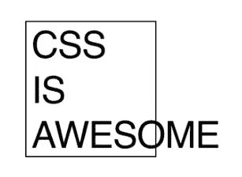

# 仔细看看 CSS 纵横比属性

> 原文：<https://blog.logrocket.com/a-closer-look-at-the-css-aspect-ratio/>

在 CSS 中保持给定的长宽比一直是一个挑战，以至于它是最著名的迷因之一的起源，CSS 是令人敬畏的溢出广场。嗯，来自 [CSS 框大小调整级别 4](https://drafts.csswg.org/css-sizing-4/#ratios) 模块的新的`aspect-ratio`属性最近已经在所有主流浏览器中实现，允许我们摆脱旧的攻击，最终给我们对任何元素的纵横比的完美控制。

## 古老的方式

多年来，我们一直依赖一个非常有创意但麻烦的技巧——百分比技术，它完成了工作，但要求我们围绕它计划一切。这个技巧依赖于 CSS 的一个非常模糊的行为，当声明为百分比时，垂直填充(或技术上的块方向填充)是基于元素的宽度而不是高度来计算的，否则，它们将进入一个使元素越来越高的冗余循环。我们可以用它来保持一个长宽比，简单地应用一个顶部填充百分比，计算为`height / width * 100`。

例如，如果我们想要 1 比 1 的长宽比(比如一个正方形)，我们可以简单地声明元素的`padding-top: 100%`。

使用`padding-top: 75%`*(3/4 * 100)*`padding-top: 56.25%`*(9/16 * 100)*可以分别实现 4:3 和 16:9 的典型图像/视频比。

这对于创建我们可以用于装饰目的的空容器非常有用。如果我们想要一个容器，它的背景图像可以根据容器的大小进行调整，并保持纵横比，那么只需声明:

```
.block-element{
  width: 100%;
  padding-top: 75% /* 4:3 aspect ratio */
  background: url(/img/example.svg);
  background-size:cover; /* prevents cropping */
}
```

背景图片见笔 [长宽比，老办法](https://codepen.io/facundocorradini/pen/JjEWbMd)由法库多科拉迪尼([@法库多科拉迪尼](https://codepen.io/facundocorradini) )
上[码笔](https://codepen.io)。

但是，一旦我们开始向盒子中添加实际内容(例如，一段视频)，事情就变得有点复杂了，因为填充会将我们的内容向下推。这意味着我们必须依赖于将黑客抽象到一个容器中，并对内容进行绝对定位，以使我们的内容忽略填充。综上所述，16:9 视频的典型宽高比实现为:

```
.video-container{
  position: relative;
  width: 100%;
  padding-top: 56.25%;
}

iframe[src*="https://www.youtube.com"] {
  position: absolute;
  top: 0;
  width: 100%;
  height: 100%;
}
```

请看 [CodePen](https://codepen.io) 上法库多科拉迪尼([@法库多科拉迪尼](https://codepen.io/facundocorradini) )
的 [保持视频纵横比的笔，老办法](https://codepen.io/facundocorradini/pen/XWpMNyW)。

这对于视频和 100%宽度的容器来说很好，但是如果我们想要保持一个长宽比并让容器根据其内容动态调整大小呢？这就是黑客升级到不成比例的水平。如果我们使用绝对定位技术，过多的内容会让我们面临可怕的溢出风险。如果我们想让容器的宽度根据内容自动调整，我们的绝对定位元素就不能让容器变大。

解决这两个问题的一个方法是在浮动的伪元素中使用 padding-top hack 来控制纵横比，如果需要的话，让容器随内容一起增长。接下来的挑战是让伪元素以对用户隐藏的方式呈现，但仍然获得影响容器的实际尺寸。

这可以在具有匹配 1px 宽度的负边距的正常流中实现，就好像我们试图使用零宽度元素，浏览器会完全忽略它:

```
.container::before {
  content: "";
  float: left;
  padding-top: 75%; /* 4 : 3 ratio*/
  width: 1px;
  margin-left: -1px;
}
.container::after { /* classic clearfix */
  content: "";
  display: table;
  clear: both;
}
```

看笔 [长宽比与内容，老办法](https://codepen.io/facundocorradini/pen/XWpRYow)由法库多科拉迪尼([@法库多科拉迪尼](https://codepen.io/facundocorradini) )
上[码笔](https://codepen.io)。

在网格布局中，我们可能会强制伪元素共享实际内容的列和行:

```
.element{
  grid-column:1;
  grid-row: 1;
}

.container::before{
  content: "";
  padding-top: 100%; /* 1:1 aspect ratio*/
  grid-column:1; grid-row: 1;
}
```

参见法孔多·科拉迪尼([@法孔多·科拉迪尼](https://codepen.io/facundocorradini) )
关于 [CodePen](https://codepen.io) 的 [保持圆形的笔，老(稍)的方式](https://codepen.io/facundocorradini/pen/JjbRwQx)。

## CSS `aspect-ratio`属性

新的、更简单的方法不需要任何黑客。它允许我们明确地声明想要的长宽比，浏览器会神奇地保持它。

一个方块简单来说就是`aspect-ratio: 1 / 1`，一个 16:9 的视频得到`aspect-ratio: 16 / 9`等等。

只要维度中至少有一个是`auto`，浏览器就会调整框的大小以保持给定的`aspect-ratio`(如果我们同时指定`height`和`width`，`aspect-ratio`将被忽略)。

更好的是，一个声明了`aspect-ratio`的元素将**尝试**来保持它，但是如果需要的话会扩展以防止溢出，这样我们就不用使用绝对定位和伪元素攻击了。

这使我们能够以更简单的方式实现老把戏，但也打开了无限新可能性的大门。

## `aspect-ratio`艺术指导

我们可以使用新属性的一个巧妙技巧是在媒体查询中改变图像的纵横比。我们可能希望图像在横向模式下为 16:9，但在纵向模式下保持 1:1 的格式。

当然，使用带有`<picture>`元素的多图像源集合是更好的方式，但是我们并不总是有这种奢侈。

```
.ratiod-image {
  aspect-ratio: 1/1;
  object-fit: cover;
  width: 75vw;
}

@media (orientation: landscape) {  
  .ratiod-image {
    aspect-ratio: 16/9;
  }
}
```

艺术指导见[笔](https://codepen.io)上法库多科拉迪尼([@法库多科拉迪尼](https://codepen.io/facundocorradini) )
的笔[。](https://codepen.io/facundocorradini/pen/bGgqgVO)

一件有趣的事情是，未来的实现甚至将允许插入纵横比属性，因此它将能够从一个平滑地过渡到另一个！

## 不用辅助容器保存视频的`aspect-ratio`

我最喜欢的新特性的应用之一是保持嵌入视频的纵横比，而不必依赖绝对定位或填充顶部黑客，因此保持标记没有不必要的容器。

为此，我们可以简单地将宽度声明为我们想要的任何值(最有可能的是，`100%`)，使用 aspect-ratio 属性来保持宽度和高度之间的关系，并将`height`设置为`unset`，以防止 HTML 中声明的高度接管:

```
iframe[src*="https://www.youtube.com"] { /* targets any iframe from YouTube*/
  width: 100%; /* elongates the iframe to the container's width */
  height: unset; /* ignore the height attribute from the HTML */
  aspect-ratio: 16/9; /* adjust the height to keep aspect-ratio*/
}
```

见 [CodePen](https://codepen.io) 上法库多科拉迪尼([@法库多科拉迪尼](https://codepen.io/facundocorradini) )
)的无容器无黑客视频上的笔 [。](https://codepen.io/facundocorradini/pen/oNYzQVE)

## 根据动态列宽调整网格行高

CSS grid 的一个我最喜欢的方面是 autofit/minmax 组合，它允许我们的网格有尽可能多的确定最小宽度的列，以适应容器，但也让它们均匀增长以分配额外的空间。

但通常，我们的行会保持预定的高度，将开始的正方形变成矩形。现在我们可以根据列的动态宽度自动调整行的大小了！

我们只需为网格项定义一个`aspect-ratio`，浏览器就会发挥它的魔力:

```
.grid{
  display: grid;
  grid-template-columns: repeat(auto-fit, minmax(160px, 1fr));
}
.grid > *{
  aspect-ratio: 1 / 1;
}
```

在 [CodePen](https://codepen.io) 上看到法库多·科拉迪尼([@法库多科拉迪尼](https://codepen.io/facundocorradini) )
的用动态大小的列在 CSS 网格中保持纵横比的笔[。](https://codepen.io/facundocorradini/pen/abpJWYz)

## 解决旧的“CSS 很棒”迷因

我们可以说迷因的问题是定义过度。溢出是 CSS 的一个设计特征，而不是一个错误，因为它优先防止内容的丢失。假定的作者过度定义了界面，给了它固定的宽度和高度，以及根本不适合的大字母，这就是它溢出的原因。

有几种可能的方法来修复它——例如，我们可以通过将固定宽度改为最小内容来让它变得更宽，如果我们没有定义高度，让它变得更高，允许滚动条带有`overflow: auto`或`scroll`等。

但我会假设目的是保持正方形…正方形，并让框根据需要增长，以适应我们放入的任何文本。

嗯，有了长宽比，这就简单了:

```
.grid{
  display:grid;
/* minimum width is 120px, max autogrows */
  grid-template-columns: minmax(120px, auto);
/* square aspect ratio */
  aspect-ratio: 1 / 1;
  align-items: center;
}
```

看 [CodePen](https://codepen.io) 上 Facundo 科拉迪尼([@ facundocoradini](https://codepen.io/facundocorradini))
的笔[CSS 长宽比牛逼](https://codepen.io/facundocorradini/pen/dyPbKxm)。

结论

## 尽管乍一看，`aspect-ratio`看起来像是旧的长宽比 hack 的替代拼写，正如我们刚刚看到的，它远不止如此！它帮助我们简化 HTML，摆脱容器，在 CSS 上明确声明意图，使其更容易维护，并实现以前极其困难甚至不可能的东西。我们的 CSS 工具箱中的一个伟大的新成员！

你的前端是否占用了用户的 CPU？

## 随着 web 前端变得越来越复杂，资源贪婪的特性对浏览器的要求越来越高。如果您对监控和跟踪生产环境中所有用户的客户端 CPU 使用、内存使用等感兴趣，

.

[try LogRocket](https://lp.logrocket.com/blg/css-signup)

LogRocket 就像是网络和移动应用的 DVR，记录你的网络应用或网站上发生的一切。您可以汇总和报告关键的前端性能指标，重放用户会话和应用程序状态，记录网络请求，并自动显示所有错误，而不是猜测问题发生的原因。

[](https://lp.logrocket.com/blg/css-signup)[https://logrocket.com/signup/](https://lp.logrocket.com/blg/css-signup)

现代化您调试 web 和移动应用的方式— [开始免费监控](https://lp.logrocket.com/blg/css-signup)。

Modernize how you debug web and mobile apps — [Start monitoring for free](https://lp.logrocket.com/blg/css-signup).