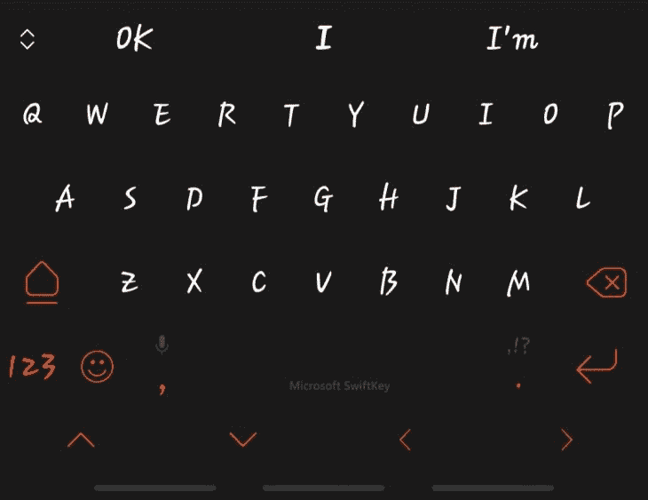
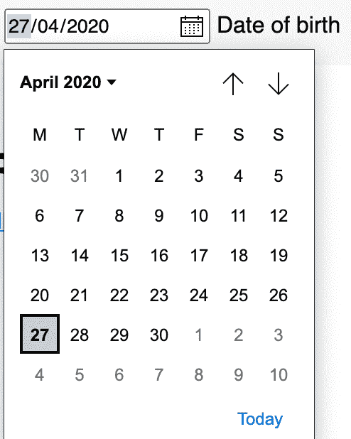
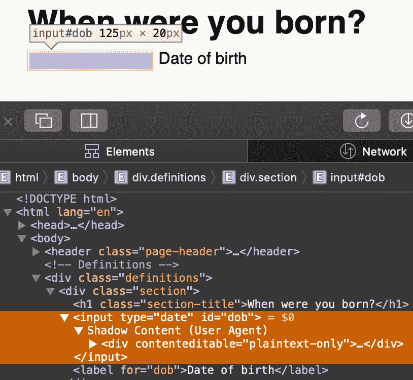
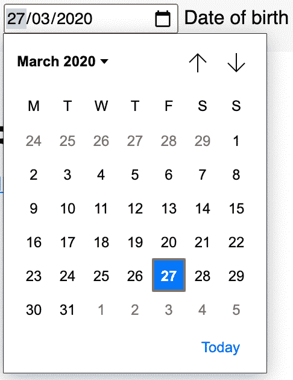
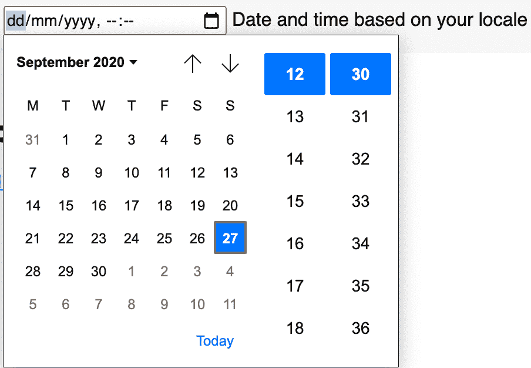
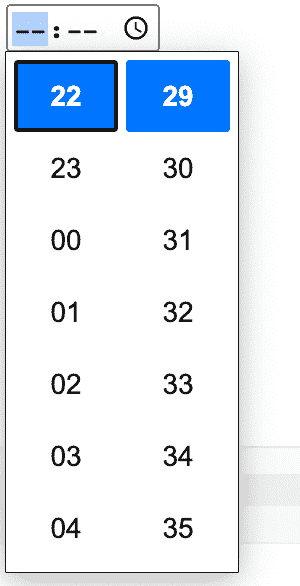
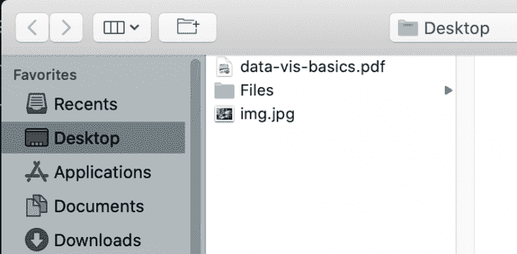
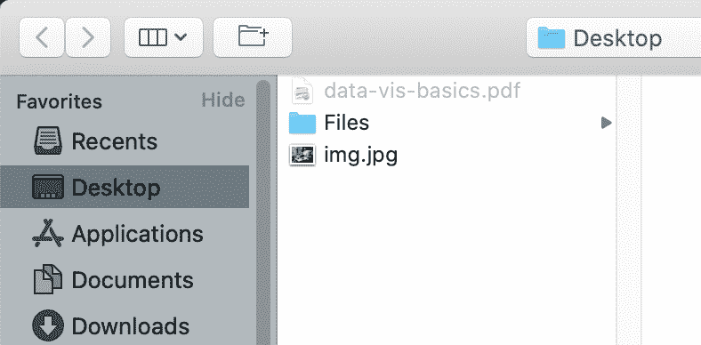
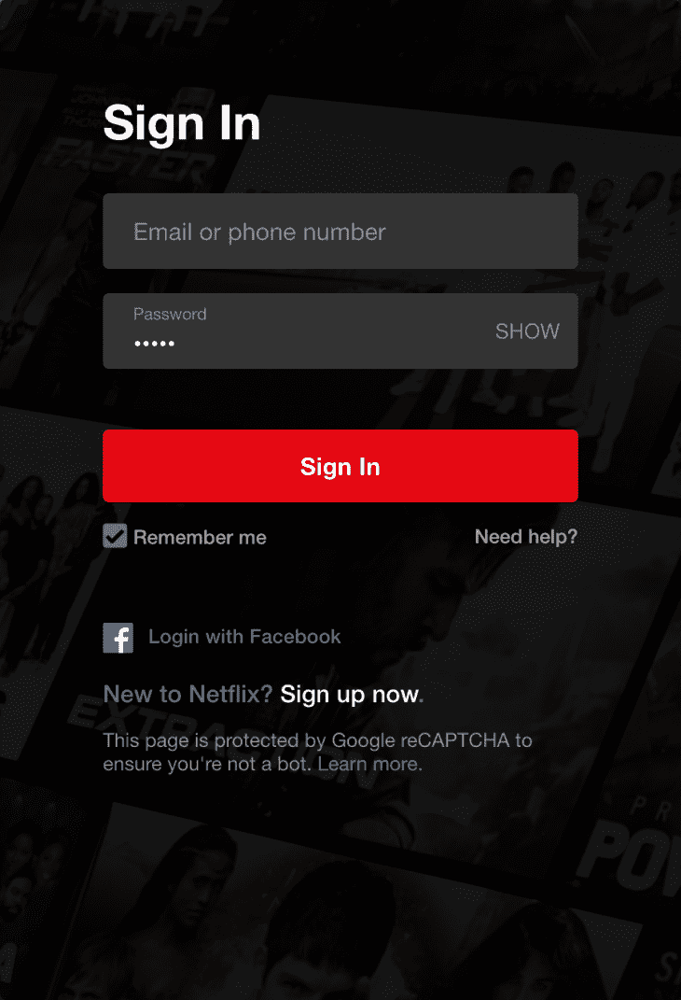

# 深入探究 HTML 表单输入元素——log rocket 博客

> 原文：<https://blog.logrocket.com/a-deep-dive-into-the-html-form-input-element/>

根据[MDN Web Docs](https://developer.mozilla.org/en-US/docs/Web/HTML/Element/form),`HTML <form> element`表示包含用于提交信息的交互控件的文档部分。作为 web 开发人员，每当我们需要来自用户的信息时，我们都会向他们提供一个`<form>`元素。

在高层次上，它可以是带有用户电子邮件地址和密码的普通登录表单，或者是用于双重检查敏感操作的安全性增强的双因素身份验证(2FA)表单。无论哪种方式，表单都代表了我们的需求和用户所有物之间的契约接口。

`<form>`元素的基本构件是它的[控件](https://developer.mozilla.org/en-US/docs/Learn/Forms/Basic_native_form_controls)。这些控件的范围从基本的交互元素如`<input>`，到结构元素如`<fieldset>`用来分组其他几个控件。其他控件包括用于执行点击动作的`<button>`和用于描述其他控件的`<label>`。

在所有控件中，`input`可能是变化最大、使用最多的。或者如 MDN 上所述，由于输入类型和属性的组合数量庞大，它是所有 HTML 元素中最强大和最复杂的元素之一。

### 关于`<input>`元素复杂性的简短说明

要理解 web 表单背后的真正复杂性，就要退一步理解 web 表单的主要目的:从用户那里获取信息，但更重要的是，促进用户和网站之间的交互，甚至更基本的是人和计算机之间的交互。这种交互足够复杂，复杂到足以产生多学科领域的[人机交互](https://www.interaction-design.org/literature/topics/human-computer-interaction) (HCI)。

这里的关键是，当用户与网站交互时，他们基本上是在执行一个基本的 [CRUD(创建、读取、更新、删除](https://en.wikipedia.org/wiki/Create,_read,_update_and_delete)操作[查询、变异和订阅](https://graphql.org/learn/queries/)在 [GraphQL](https://graphql.org/) 。当我们向用户呈现一个表单时，我们基本上是通过一个“对话系统”与他们进行交互。

当谈到与 [web 表单](https://developer.mozilla.org/en-US/docs/Learn/Forms)相关的 HCI 时，我们经常被引向可用性和安全性的道路。我们通常不需要像许多网站那样增加默认的[表单元素](https://developer.mozilla.org/en-US/docs/Web/API/HTMLFormElement/elements)，我们也不需要手动增强验证，但是试图提供一个通用的 API 不会满足每个人最好的、特定的和安全的需求。

当你在这个对话系统中工作时，你会注意到你试图从用户那里获得的数据类型取决于你使用的`<input>`的类型，并且正如你将学到的，[数据类型和输入类型有时是互斥的](https://bradfrost.com/blog/post/you-probably-dont-need-input-typenumber/)。

尽管如此,`<inputs>` s 的灵活性仍然比其他表单控件更出色。对于大多数的交互，通常有一个`<input>`可以从用户那里得到你想要的数据类型。它也有一些合理的默认设置，你不必重新连接，比如`password`输入，用户输入已经被遮住了。有时候，您需要扩展某些输入的功能，以便让它们按照您的意愿工作。

`<input>`控件的灵活性使它变得强大，但也使它变得复杂，再加上它是用来实现 web 表单目标的控件之一这一事实，你可以预期有太多的方法来正确和错误地完成它。

### `<input>`类型

与其他 HTML 元素类似，`<input>`元素有许多属性，可以用来配置它以满足特定的需求。在所有可用的属性中，`type`属性是最重要的，因为它赋予了`<input>`身份。当没有明确指定或不支持时，或者当指定了不存在的类型时，类型默认为`text`。即`<input>`或`<input type="undefined">`在技术上等同于`<input type="text">`

从技术上来说，所有输入都共享 [HTMLInputElement](https://developer.mozilla.org/en-US/docs/Web/API/HTMLInputElement) 接口，并且通过扩展，拥有完全相同的属性集。

然而，这些属性在功能上依赖于它们所使用的输入的`type`。例如，`text`和`checkbox`输入都有`autocomplete`属性，但是当它作用于`text`输入时，它在`checkbox`输入时被忽略。

此外，`<input>`的功能、设计和可用性取决于设备和[用户代理](https://developer.mozilla.org/en-US/docs/Glossary/user_agent)。

以电话输入(`<input type="tel">`)为例。它在支持屏幕/虚拟键盘的设备(如电话)上显示电话键盘，在没有屏幕键盘的设备上使用时，与`text`输入相比没有实际优势。

说到虚拟键盘，你如何配置或定制它们以及你使用的类型也会导致你所看到的不同。

除了`type`属性之外，还有其他重要的属性，如`[required](https://developer.mozilla.org/en-US/docs/Web/HTML/Attributes/required)`(表示用户必须在提交表单之前为该控件提供一个值)或`[placeholder](https://developer.mozilla.org/en-US/docs/Web/HTML/Element/input#htmlattrdefplaceholder)`(表示描述`<input>`的提示)。

但是`type`属性是最重要的，不仅仅是因为它赋予了`<input>`它的身份，或者是因为它们促成了使`<input>`变得复杂的大量组合，还因为属性对它们的函数依赖。

除去过时的`[datetime](https://developer.mozilla.org/en-US/docs/Web/HTML/Element/input/datetime)`类型，目前共有 22 种输入类型，如下表所示:

| 类型 | 描述 | 基本定义 |
| --- | --- | --- |
| `button` | 表示没有默认行为的按钮。 | `<input type="button"/>` |
| `checkbox` | 呈现一个可以是`checked`、`unchecked`或`indeterminate`的复选框 | `<input type="checkbox"/>` |
| `color` | 如果支持的话，呈现一个颜色选择器，或者一个`text`框，用于输入带有验证的颜色代码/值。 | `<input type="color"/>` |
| `date` | 用于输入日期的控件，其解析的有效期格式为:`YYYY-MM-DD` | `<input type="date" />` |
| `datetime-local` | 呈现用于选择或输入日期和时间的控件。 | `<input type="datetime-local" />` |
| `email` | 呈现电子邮件地址条目的控件。它验证输入的电子邮件地址的格式。 | `<input type="email" />` |
| `file` | 允许从本地存储上传文件。 | `<input type="file" />` |
| `hidden` | 顾名思义，这是一个隐藏控件。它没有可视化表示，但是它的值将被提交。 | `<input type="hidden" />` |
| `image` | 表示按钮，但以图像作为其值。 | `<input type="image" />` |
| `month` | 用于输入日期的控件，其解析的有效期格式为:`YYYY-MM` | `<input type="month" />` |
| `number` | 表示允许数字输入(包括验证)的控件。在带有屏幕键盘的设备上，可能会显示优化的数字键盘。 | `<input type="number" />` |
| `password` | 呈现针对密码输入增强的`text`字段。条目通常用点符号模糊不清。 | `<input type="password" />` |
| `radio` | 类似于`checkbox`，但在群体中最有用。允许选择一组中的单个`radio`按钮，只能是`checked`或`unchecked` | `<input type="radio" />` |
| `range` | 表示具有预定义的最小值和最大值的滑块控件。 | `<input type="range" />` |
| `reset` | 表示具有默认行为或将表单值重置为其初始状态的按钮。 | `<input type="reset" />` |
| `search` | 基本上是一个`text`型的视觉优化搜索。 | `<input type="search" />` |
| `submit` | 表示具有提交表单默认行为的按钮。 | `<input type="submit"/>` |
| `tel` | 它基本上是一种`text`类型，在具有用于输入电话号码的屏幕键盘的设备中进行了优化。它不对其条目进行验证。 | `<input type="tel"/>` |
| `text` | 它呈现一个基本的单行文本字段，并作为其他不支持的`input`的默认字段 | `<input type="text" />` |
| `time` | 用于输入日期的控件，其外观和格式取决于用户代理，但通常是`hh:mm:ss` | `<input type="time" />` |
| `url` | 它基本上是一个`text`类型，为输入带有自动验证的格式正确的 URL 进行了优化。 | `<input type="url" />` |
| `week` | 用于输入日期的控件，其解析的有效期格式为:`yyyy-Www` | `<input type="week" />` |

在我们深入这些`types`之前，有些事情你应该记住:

*   客户端验证不能替代服务器端验证。不管这些`types`提供了什么样的验证，考虑它们只对不知情的用户足够了
*   对于自动验证的输入，相应地应用`:valid`和`:invalid` CSS 伪类
*   对于自动验证并接受空格为有效的输入，`required`属性可用于无效

> html-每日输入

`<input type="hidden">`

### 这个比较简单。它没有任何可视化的表示，但是它总是存在于 DOM 中，所以它可以被交互。

当用户提交表单时，它经常被用来发送带有表单值的附加数据，尽管我怀疑这些天它是否有任何真实或实际的用途。更重要的是，仅仅因为用户看不到它并不意味着他们不能改变 DOM 中的值，这使得如果您将它用于敏感数据，它容易受到攻击。不要。

`<input type="text">`和`<input type="search">`

### 输入可能是所有输入中最常见和最灵活的一种。当推至紧要关头时(这是必然的)，某些输入在浏览器中缺乏支持。像`date`输入一样，`text`输入通常是替罪羊或英雄。

它呈现一个基本的单行文本字段。

它的`value`是一个`DOMString`，并且它支持像`placeholder`、`maxlength`和`minlength`这样的一组属性进行增强。

```
<input type="text" />
```

上面的`text`输入将有一个长度至少为`minlength`，1，最多为`maxlength`，30 的`value`。请记住，空格是有效的。在这些情况下，您可能希望使用`pattern`属性来强制执行 [RegExp](https://developer.mozilla.org/en-US/docs/Web/JavaScript/Reference/Global_Objects/RegExp) 模式，或者使用`required`来使空白无效。

```
<input type="text" placeholder="Beetwen 1 and 30 characters" minength="1" maxlength="30" />
```

`Search`输入在技术上是`text`输入，但是它们被隐含地增强了搜索。您可以不使用它们，当不支持时，它会退回到一个`text`输入。

一些改进体现在造型上。记住，这取决于设备和用户代理。就设计而言，`search`在与带有虚拟键盘的设备(如手机)配合使用时会更加出色。我比较了 Android Swift 键盘上的`text`和`search`键盘显示:




它们的运作方式也有一些根本的不同。但目前这仅适用于使用非标准属性的情况，比如`i[ncremental](https://developer.mozilla.org/en-US/docs/Web/HTML/Element/input/search#incrementa)`或`[results](https://developer.mozilla.org/en-US/docs/Web/HTML/Element/input/search#results)`。

它的可视化表示也得到增强，并且在不同的用户代理之间会有所不同。

`<input type="url">`和`<input type="tel">`

### `url` inputs 允许用户输入一个 URL，并自动验证它是一个格式正确的 URL(而不是该 URL 存在)。同样，空字符串也是有效的，除非被`required`属性推翻:

就像`text`输入一样，`pattern`属性可以用来检查输入的 URL 是否符合特定的情况。在下面的定义中，这个输入只有在具有`HTTPS` URL 方案并且不为空的情况下才有效。

```
<input type="url" placeholder="Enter your profile URL" required/>
```

投入几乎不值得，但它的存在是有原因的。与`url`输入不同，`tel`输入不会被自动验证。然而，它们对于带有虚拟小键盘的设备可能很有用，虚拟小键盘可以显示自定义键盘，这有助于提高可用性。

```
<input type="url" placeholder="Enter your profile URL" pattern="https://.*" required/>
```

注意，它们的总体有用性也可以通过`inputmode`全局属性(用于提示用户代理需要哪种数据)来实现，其中`tel`值可以用于产生与`tel`类型相同的效果。

像`url`输入一样，空字符串也是有效的，所以您可能希望包含`required`属性，以及用于某种级别验证的`pattern`属性。

```
<input type="tel" /> // tel type
<input type="text" inputmode="tel" /> // text type with an inputmode of tel
```

不支持时，`url`和`tel`型都退回到`text`。

`<input type="email">`

### 这是最常见的一种。它更像是一个`text`输入，除了值需要是一个格式正确的电子邮件，因此类型为`email`。您可以包含`multiple`属性来接受多个电子邮件地址。

验证也是自动完成的，所以您可以放心，开始时会有一定程度的强制执行。根据电子邮件地址的有效性自动应用`:valid`和`:invalid` CSS 伪类。

```
<input type="email" /> // default
<input type="email" multiple /> // multiple, values will be a comma-separated list
```

在指定了`multiple`属性的情况下，输入的电子邮件将是逗号分隔的有效电子邮件列表(用户不一定知道这一点，所以您可能需要提供一个提示)。还可以添加许多其他属性来增强`email`输入的功能，比如如果您想指定所需电子邮件的外观，可以添加`pattern`。或`autocomplete`增强控件的可用性。

`<input type="password">`

```
// Only accepts emails that ends with @logrocket.com
<input type="email" pattern="[email protected]" />
```

### 在需要密码的网站上，输入是很常见的。它允许用户输入一个字符串，该字符串几乎立即被用户代理定义的符号(通常是一个点)替换。在移动设备上，密码字符会显示一小段时间，然后会变得模糊不清，让用户意识到自己输入了密码。

当密码保存在浏览器中时，浏览器将自动完成密码字段。这是一件好事，但它可能会在不知不觉中导致不必要的行为。

```
<input type="password" />
```

即使当用户没有登录时，浏览器仍然会尝试预填密码输入，比如在注册页面上，并因此暴露用户的密码(它已经在登录页面上暴露了，那么这与注册页面有什么不同呢？当用户可能实际登录时，它会出现在登录页面上，但不会出现在注册页面上)。

你可以使用`off`或`new-password`自动完成值来指示浏览器不要自动预填充密码字段(尽管我发现 [Chrome 不尊重这个](https://github.com/algolia/autocomplete.js/issues/247)–[Chrome 页面中有一个问题](https://bugs.chromium.org/p/chromium/issues/detail?id=914451)。`New-password`还允许浏览器(或密码管理器)向用户建议密码。

如果您向用户请求仅数字形式的通行证，如 PIN，您可以使用带有`password`输入的`inputmode="numeric"`来激活支持设备上的数字键盘。

```
/* The for values of autocomplete applicable to a password field
 on, off, current-password, new-password */

<input tye="password" autcomplete="on" /> /* Yes, prefill the password field */
<input tye="password" autcomplete="current-password" /> /* Same as on */
<input tye="password" autcomplete="off" />
<input tye="password" autcomplete="new-password" />
```

可以使用`minlength`、`maxlength`或`pattern`属性来约束该值，以便让不知情的用户保持警惕。

`<input type="date">`、`<input type="datetime-local">`、`<input type="time">`、`<input type="month">`和`<input type="week">`

### `date`类型表示允许根据用户浏览器的位置选择日期格式的输入。在不支持的浏览器中，它退回到`text`输入。选择日期后，解析的值将采用以下格式:`YYYY-MM-DD`。

通常，您会看到一个日期选择器 UI。然而，这也因浏览器而异。



Microsoft Edge date picker.



Safari date picker.



Google Chrome date picker.

Safari(版本 13.1)依靠`[contenteditable](https://developer.mozilla.org/en-US/docs/Web/API/HTMLElement/contentEditable)`而不是`text`输入。Chrome 和 Edge 有些相似，因为它们本质上是一样的。

> `min`和`max`属性可用于为日期选择提供一个下限和上限，以及强制执行这些边界。然而，手动验证所提供的值总是一个好主意，因为并不是所有的浏览器都支持`date`输入(就像上面的 Safari 一样)。始终验证。

说到验证，您可以做的一件事是使用`pattern`属性来指定一个可接受的模式。因此，即使不支持`date`输入，`text`输入也会根据该模式进行验证。

或者，您可以使用`required`属性。请记住，有人可能会进入 DOM 删除所有约束属性，只是为了提交表单。换句话说，进行手工验证。

`datetime-local`类似于`date`输入，只是您也可以选择或输入旁边的时间。支持并不总是那么好。在我写这篇文章的时候， [MDN 有一个详细的解释](https://developer.mozilla.org/en-US/docs/Web/HTML/Element/input/datetime-local)，我鼓励你去阅读。

下面是它在 Chrome 版本 87 上的样子(淡黄色):



`Time` inputs 为用户提供一个时间选择字段，其外观因用户代理而异。由于可用的约束，没有自动验证。用户不能超出或低于 24 小时制时间格式的最小和最大界限。

除了外观之外，不同浏览器的格式也不同。在某些浏览器中，时间格式取决于用户的系统位置，而在其他浏览器中则不然。此外，有些浏览器像 Chrome 一样提供时间选择器，而有些则没有。

```
<input type="time" />
```



`time`输入的`value`始终采用 24 小时制。即`hh:mm`，包括前导零，如:01:30。您可以使用`step`属性在格式:`hh:mm:ss`中包含秒，但是由于浏览器的不同，这并不完全可靠。

除了月和周之外，`month`和`week`输入类似于`date`输入。它们在外观和值格式上有所不同。一个月的格式是“2018-07”中的`YYYY-MM`，而一周的格式是“2020-W24”中的`yyyy-Www`。

```
<input type="time" id="timeOfBirth" name="timeOfBirth" step="2" required />
```

在这个由 [Jen Simmons](https://twitter.com/jensimmons) 撰写的 [Twitter 帖子](https://twitter.com/jensimmons/status/1305914116314341376)中，我鼓励你浏览一下关于`month`和`week`类型的沮丧。


Month picker.


Week picker.

如果你想理解各种可用的格式，阅读 HTML 中使用的[日期和时间格式是很重要的。](https://developer.mozilla.org/en-US/docs/Web/HTML/Date_and_time_formats#Format_of_a_valid_week_string)

> `<input type="number">`和`<input type="range">`

### `Number`输入允许用户输入一个数字，自动验证非数字输入。有些浏览器还显示上下箭头，可用于增加或减少输入值。

默认步长为 1，也就是说，使用提供的箭头或键盘以 1 为步长递增或递减，但是可以使用`step`属性进行更改。`min`和`max`属性也可以用来实施一些约束。

`pattern`属性对`number`输入无效，在带有虚拟键盘的设备上，可能会显示数字键盘。

```
<input type="number" />
<input type="number" step="2" min="18" max="70" />
<input type="number" step="0.1" min="18" max="70" />
```

布拉德·弗罗斯特写了一篇文章，[你可能不需要输入 type="number"](https://bradfrost.com/blog/post/you-probably-dont-need-input-typenumber/) ，我鼓励你阅读这篇文章，因为`number`输入，尽管它们很好很有用，但会给你带来一些痛苦，这往往始于你正确地确定`number`是否真的是你需要的。

我见过自定义数字字段，在那里除了数字我不能在键盘上键入任何东西，比如价格字段，它们不是`number`类型。不言而喻，信任和可靠性有很长的路要走，在使用它之前，您应该确保它工作得非常好。

`Range`输入用滑块控件表示，允许用户在预定义的最小值和最大值之间进行选择。

未指定时，最小值和最大值分别默认为 0 和 100。您很可能无法摆脱默认行为，所以在您认为值得这么做之后，您需要根据您的喜好调整功能。像`number`输入一样，它的默认步长为 1，但是可以用`step`属性改变。

输入不精确，建议在不需要精确值的情况下使用，如音量控制或颜色主题选择器。它们的外观因用户代理而异，但是可以通过一些额外的努力来定制它们，使它们看起来更漂亮、更聪明。

`<input type="color">`

### 你知道 HTML 中有一个原生的颜色选择器吗？嗯，也许不是——这有点复杂。我甚至不会称它为颜色选择器，因为不同浏览器的表示是不同的。有些浏览器显示颜色选择器，有些显示自动验证颜色格式的`text`输入。还有另一个限制:不允许使用 alpha 颜色。可以有`RGB`，不能有`RGBA`等等。

这是用于 Mac 的颜色选择器:

```
<input type="color" />
```


有两个事件可用于`color`类型:

`change`–当颜色选择器关闭时触发

*   `input`–只要你不停地变换颜色，它就会燃烧
*   `<input type="checkbox">`和`<input type="radio">`

### 复选框由可以选中(true)或不选中(false)的框表示。它们有一个`checked`属性通知它们的选中状态，还有第三个`indeterminate`状态，既不是选中也不是未选中，既不是真也不是假。

复选框的一个用例是当你想让用户在一个可枚举的选项列表中选择多个值时(这是它们不同于单选按钮的地方。对于单选按钮，部分是单个而不是多个)。考虑在表格中填写一些问题，比如你知道多少种编程语言，或者检查你去过的目的地列表。

复选框也很有趣。因为它们有一个选中/未选中的布尔状态，如果我们把它们想成点击事件，我们可以构建一些奇特的东西。

```
<input type="checkbox" value="Toronto" />
<input type="checkbox" value="Ilorin" />
```

默认情况下，复选框可以是带有`checked`属性的`checked`，如下所示:

复选框需要注意的一点是它们对表单提交的反应。

```
<input type="checkbox" value="Toronto" />
<input type="checkbox" value="Ilorin" checked/>
```

如果复选框未被选中，它不会被发送到服务器，因为它没有任何实际值。向服务器发送未检查的值是没有意义的，因为如果它不存在，我们可以确定它是未检查的。

`Radio`输入与`checkbox`输入不同，因为一组中只能选择一个选项。当不在群体中时，他们几乎没有用处。

要创建一组单选按钮，它们必须都具有类似于`value`的`name`属性:

```
<input type="radio" />
```

`Radio`输入没有像`checkbox`那样的`indeterminate`状态，但是它们有`checked`。但是，一次只能选择一个`radio`按钮。

```
<input type="radio" name="accent-color" value="orange" />
<input type="radio" name="accent-color" value="yellow" />
```

`<input type="file">`

### 这种输入允许用户从他们的计算机中选择一个文件，然后可以使用它，无论它是如何被编程的。

使用`accept`属性，您可以指定允许的文件类型。这是一个逗号分隔的有效或可接受的 MIME 类型列表[T2](https://developer.mozilla.org/en-US/docs/Web/HTTP/Basics_of_HTTP/MIME_types)

```
<input type="file" />
```



```
<input type="file" id="profile-img" accept="image/png, image/jpeg" />
```

上面，你可以看到将`accept`应用到`file`输入的结果。



在上图中，`accept`不存在。在底部图像中，它被指定为`accept="image/png, image/jpeg"`，这意味着用户只能选择以`.png`或`.jpeg` ( `jpg`在技术上与`jpeg`相同)结尾的图像。你有没有注意到`Files`文件夹是可以选择的？其实不能。它是活动的，因为其中可能有可接受的文件。

`accept`属性是一个约束，强制规定可以上传什么类型的文件。实际上，用户可以绕过它，所以一定要验证上传的内容。

`<input type="button">`、 `<input type="reset">`和`<input type="submit">`

### 输入表示一个可点击的控件，它可以被编程地控制来执行一个点击动作。输入按钮可以定义如下:

像上面那样定义输入按钮会导致按钮为空。这是因为标签文本应该在`value`属性中，而我们还没有指定。指定一个就像给`value`属性一个值一样简单。

```
<input type="button" />
```

尽管这在技术上是绝对正确的，但较新的按钮元素现在是创建按钮的首选方式。

```
<input type="button" value="click me" />
```

与`reset`和`submit`输入不同，`button`输入没有默认行为，除非专门编程这样做。

`Reset`和`submit`按钮在与`form`一起使用时很有用。它们分别有一个默认的重置和提交表单的行为。

与`button`输入不同，它们都有一个依赖于用户代理的默认值。除了上述差异，它们的操作非常类似于`button`输入。

```
<input type="reset" value="Reset form" />
<input type="submit" value="Submit form" />
```

`<input type="image">`

### 如果我们有``元素，你认为这是什么？它是一个值为图像的按钮。这种情况下的值不是`value`属性。事实上，它没有。如果您指定了一个，它将被忽略。那么如何指定图像呢？

至少在视觉上，`image`输入的`src`属性与`button`输入的`value`属性是一样的。如果`<input type="button" value="click me" />`使用文本“点击我”呈现一个`button`输入，那么`<input type="image" src="./path/to/img" />`将使用`src`中指定的图像呈现一个按钮。

`Image`输入类似于`img`元素，其属性类似于`src`和`alt`属性。

`<input>`属性

### [HTML 属性](https://developer.mozilla.org/en-US/docs/Web/HTML/Attributes#Content_versus_IDL_attributes)是对其元素的配置。正如我们提到的,`type`属性赋予了`input`元素它的身份，其他属性也可以贡献它们的配额，使`input`元素更加灵活、强大和复杂(考虑到它们对不同类型的函数依赖)。

有两种类型的属性:

内容属性

#### 内容属性是满足三个标准的属性:

也许最常见的是`class`属性或`id`属性，而且有很多。事实上，大多数[的全局属性](https://developer.mozilla.org/en-US/docs/Web/HTML/Global_attributes)都属于这一类。

IDL 属性

#### IDL 代表接口描述语言，属于这一类别的属性通常只能通过编程来访问，比如用于`checkbox`输入的`indeterminate`属性。

IDL 属性有一个变化，在规范中有一个部分:[反映了 IDL 属性](https://html.spec.whatwg.org/multipage/common-dom-interfaces.html#reflecting-content-attributes-in-idl-attributes)中的内容属性。某些属性可能具有偏转行为。建议通读该部分以获得更好的理解，并监控规范是否已经更新。

下表显示了 32 种(标准)属性:

属性

| 描述 | 基本用途 | `accept` |
| --- | --- | --- |
| 文件上传控件中预期文件类型的提示 | `<input``*type*="file"` | `alt` |
| `image`类型的 alt 属性。可访问性所必需的 | `<input type="image" alt="alternate text" />` | `autocomplete` |
| 指示浏览器主动自动填充 | `<input type="email"autocomplete="current-password" />` | `autofocus` |
| 加载页面时自动聚焦表单控件 | `<input type="text"autofocus />` | `capture` |
| 文件上传控件中的媒体捕获输入法 | 参见**捕捉** | `checked` |
| 是否检查了命令或控件 | `<input type="checkbox" checked />` | `dirname` |
| 用于在表单提交中发送元素方向的表单字段的名称 | 参见**目录名** | `disabled` |
| 表示已禁用或无法与之交互 | `<input type="button" disabled />` | `form` |
| 将控件与表单元素相关联 | `<input type="submit" form="form-id" />` | `formaction` |
| 用于表单提交的 URL | `<input type="submit" formaction="url-to-submit-form-data" />` | `formenctype` |
| 用于表单提交的表单数据集编码类型 | `<input type="submit" formenctype="text/string" />` | `formmethod` |
| 处理表单提交的方法 | `<input type="submit" formmethod="POST" />` | `formnovalidate` |
| 关闭本机验证 | `<input type="submit" formnovalidate />` | `formtarget` |
| 表单提交的浏览上下文 | `<input type="submit" formtarget="_blank" />` | `height` |
| 用于指定`image`高度 | `<input type="image" height="30" />` | `list` |
| 自动完成选项的`<datalist>`的 id 属性的值 | `<input type="text" list="id-of-a-defined-datalist">` | `max` |
| 最大可接受值 | `<input type="number" max="30" />` | `maxlength` |
| 指定可接受字符的最大长度 | `<input type="text" maxlength="50" />` | `min` |
| 最小可接受值 | `<input type="number" min="0" />` | `minlength` |
| 指定可接受字符的最小长度 | `<input type="text" minlength="10" />` | `multiple` |
| 指示允许多个值 | `<input type="email" multiple />` | `name` |
| 表示表单提交中使用的控件的名称 | `<input type="password" name="secret" />` | `pattern` |
| 用于为有效条目提供正则表达式 | `<input type="url" pattern="https://.*" required/>` | `placeholder` |
| 控件的提示。 | `<input type="url" placeholder="Enter your profile URL" />` | `readonly` |
| 指示控件不可编辑 | `<input type="email" readonly />` | `required` |
| 指示用户必须提供一个值 | `<input type="email" required />` | `size` |
| 用于指定控件的大小 | `<input type="email" size="50 />` | `src` |
| 用于为`image`输入指定图像的路径 | `<input type="image" src="/path/to/image" />` | `step` |
| 有效的增量值。 | `<input type="time" step="2" />` | `type` |
| 赋予`input`它的身份(类型)。 | `<input type="email" />` | `value` |
| 保存表单控件的值。 | `<input type="text" value="John Doe" />` | `width` |
| 用于指定`image`宽度 | `<input type="image" width="100" />` |   |

[W3](https://www.w3.org/TR/html52/sec-forms.html#apply) 和 [WHATWG](https://html.spec.whatwg.org/multipage/input.html#concept-input-apply) 在它们的规范页面上都有下表，但我只是想确定它在这里是为了进一步解释“函数依赖”。

> 基本上，表格描述的是`type`和它们相应的适用属性之间的重叠。

例如，`autofocus`可以用在除`hidden`之外的每个`input`控件上。`Autocomplete`对`checkbox` es、`radio`按钮、`file`输入等没有任何影响。而`hidden`输入是出了名的不合群。

属性

| `hidden` | `text`，`search` | `url`，`tel` | `email` | `password` | `datetime-local`、`date`、`time`、`month`、`week` | `number` | `range` | `color` | `checkbox`，`radio` | `file` | `submit` | `image` | `reset`，`button` | `accept` |
| --- | --- | --- | --- | --- | --- | --- | --- | --- | --- | --- | --- | --- | --- | --- |
| `accept` |  |  |  |  |  |  |  |  |  | ✅ | `alt` |  |  |  |
| `alt` |  |  |  |  |  |  |  |  | ✅ | `autocomplete` |  | 981 号房 | 981 号房 | 981 号房 |
| 981 号房 | 981 号房 | 981 号房 | 981 号房 | 981 号房 | ✅ | ✅ | ✅ | ✅ | ✅ | `autofocus` |  | 981 号房 | 981 号房 | 981 号房 |
| 981 号房 | 981 号房 | 981 号房 | 981 号房 | 981 号房 | 981 号房 | 981 号房 | 981 号房 | 981 号房 | 981 号房 | `capture` | ✅ | ✅ | ✅ | ✅ |
| `capture` |  |  |  |  |  | 981 号房 | `checked` |  |  |  | ✅ |  |  |  |
| `checked` |  | ✅ | `dirname` |  | ✅ | `disabled` | 981 号房 | 981 号房 | 981 号房 | 981 号房 | 981 号房 | 981 号房 | 981 号房 | 981 号房 |
| 981 号房 | 981 号房 | 981 号房 | 981 号房 | 981 号房 | 981 号房 | `form` | 981 号房 | 981 号房 | 981 号房 | 981 号房 | 981 号房 | 981 号房 | 981 号房 | 981 号房 |
| 981 号房 | 981 号房 | 981 号房 | 981 号房 | 981 号房 | 981 号房 | `formaction` | ✅ | ✅ | ✅ | ✅ | ✅ | ✅ | ✅ | ✅ |
| `form` | ✅ | ✅ | 981 号房 | 981 号房 | ✅ | `formenctype` | ✅ | ✅ | ✅ | ✅ | ✅ | ✅ | ✅ | ✅ |
| `formaction` |  |  | 981 号房 | 981 号房 | `formmethod` |  |  |  |  |  |  | ✅ | ✅ |  |
| `formenctype` |  | 981 号房 | 981 号房 | `formnovalidate` |  |  |  |  |  |  |  | ✅ | ✅ |  |
| `formmethod` | 981 号房 | 981 号房 | `formtarget` |  |  |  |  |  |  |  |  | ✅ | ✅ |  |
| 981 号房 | 981 号房 | `height` |  |  |  |  |  |  |  |  |  | ✅ | ✅ |  |
| ✅ | `list` |  | 981 号房 | 981 号房 | 981 号房 |  | 981 号房 | 981 号房 | 981 号房 | 981 号房 | `max` | ✅ | ✅ |  |
| `height` |  | 981 号房 | 981 号房 | 981 号房 | `maxlength` |  | 981 号房 | 981 号房 | 981 号房 | 981 号房 | `min` |  | ✅ |  |
| `list` |  | 981 号房 | 981 号房 | 981 号房 | `minlength` | ✅ | 981 号房 | 981 号房 | 981 号房 | 981 号房 | `multiple` |  |  |  |
| 981 号房 |  |  |  |  |  | ✅ | 981 号房 | `name` | 981 号房 | 981 号房 | 981 号房 | 981 号房 | 981 号房 | 981 号房 |
| 981 号房 | 981 号房 | 981 号房 | 981 号房 | 981 号房 | 981 号房 | 981 号房 | 981 号房 | `pattern` |  | 981 号房 | 981 号房 | 981 号房 | 981 号房 | `placeholder` |
| `min` | 981 号房 | 981 号房 | 981 号房 | 981 号房 |  | 981 号房 | `readonly` | ✅ | 981 号房 | 981 号房 | 981 号房 | 981 号房 | 981 号房 | 981 号房 |
| `required` |  | 981 号房 | 981 号房 | 981 号房 | 981 号房 | 981 号房 | 981 号房 |  |  | 981 号房 | 981 号房 | `size` |  | 981 号房 |
| 981 号房 | 981 号房 | 981 号房 | `src` | ✅ |  |  |  |  |  |  | ✅ |  |  |  |
| `name` | ✅ | `step` | ✅ | ✅ | ✅ | ✅ | ✅ | 981 号房 | 981 号房 | 981 号房 | `type` | 981 号房 | 981 号房 | 981 号房 |
| 981 号房 | 981 号房 | 981 号房 | 981 号房 | 981 号房 | 981 号房 | 981 号房 | 981 号房 | 981 号房 | 981 号房 | 981 号房 | `value` | 981 号房 | 981 号房 | 981 号房 |
| 981 号房 | 981 号房 | 981 号房 | 981 号房 | 981 号房 | 981 号房 | 981 号房 | 981 号房 | 981 号房 | 981 号房 | 981 号房 | `width` |  |  |  |
| `readonly` |  | ✅ | ✅ | ✅ | ✅ | ✅ | ✅ |  | 981 号房 | 关于验证的讨论 | 验证将永远是一个持续的话题。当考虑表单验证时，我喜欢从可用性和安全性的角度来考虑。有许多属性的唯一目的是约束用户遵守我们的输入规范。`Required`确保用户提供一个值，`pattern`实施一个特定的模式，`min`和`max`实施一个下限和上限，等等。 | 但是最终，这些都是客户端验证，最重要的是在 HTML 中，所有东西都在 DOM 中，它们很容易被绕过。一个更有见识的用户可以很容易地进入 DOM 来删除一个`submit`按钮上的`disabled`属性——我以前做过，而且很有效。 | 知道了风险所在，我试图通过编程验证将验证提升一个档次。在这个话题上有相互矛盾的观点，所以我宁愿我们讨论我喜欢怎么做。 | 让我们以一个带有用户名(`text`输入)和电子邮件(`email`输入)的登录表单为例。 |
| 以下是我做的事情清单: | 我从不依赖默认的输入验证。我用 [Formik](https://formik.org/) 管理我的表单，用 [Yup](https://github.com/jquense/yup) 进行对象模式验证 | 我禁用提交按钮，直到必填字段通过验证 | 当有多个输入字段时，我验证`onBlur`(当输入字段丢失`focus`时)。这样，我可以在用户离开输入后立即显示错误消息 | 当只有一个输入字段时，我验证`onChange`。这样，用户会得到一条错误消息(如果有的话),因为他们很可能不会尝试提交带有禁用按钮的表单，并且他们可能不知道为什么按钮没有被启用 | 假设我已经使表单可用于步骤 1-4。仍然会有安全风险。这就是身份验证和授权的用武之地。 | 我最初做的基本上是客户端验证。当然，我并不依赖于默认的输入验证，而是通过自定义验证来进一步验证。尽管如此，我怀疑这是可以绕过的，所以无论如何都应该进行服务器端验证。 | 可用性和安全性是广泛的话题。正如 Phil Nash 在他的文章[HTML attributes to improve your user ' s two-factor authentic ation](https://www.twilio.com/blog/html-attributes-two-factor-authentication-autocomplete)中指出的，开发人员应该构建支持帐户安全需求但又不降低用户体验的应用程序。有时会感觉这些需求在互相争斗。 | 提示和技巧 | 在和`<input>`们一起工作的时候，我学到了一些有用的技巧和窍门。有些诞生于错误修复、设计，或者仅仅是出于好奇。我最喜欢的发现是一个我喜欢称之为“给我看看你的密码”的发现，我知道你可能对此很熟悉，但这是一个我真正感到自豪的发现。 | 给我看看你的密码 | 从登录表单到注册表单，密码输入无处不在。当用户键入密码时，最好让他们看到自己键入的内容，这样他们就可以在需要时纠正错误。 | 你以前见过。这里有一个野外的例子: |  | 在输入的末尾通常有一个切换按钮，用于切换密码的显示。当用户点击那个按钮时会发生什么？嗯，我们通过编程将输入的类型从`password`切换到`text`。 |
| 这里有一个例子: | 单击带有复选框的事件 | 我们有三种状态:选中状态和不确定状态——仅指选中状态。 | 这个很有意思。想想点击状态是什么:布尔值，真或假，点击或未点击。`<input type="checkbox" />`有一个 checked 属性，让我们知道复选框是否被选中。再加上一个标签，我们可以创造一些有趣的东西。 | 让我们来看看这个片段: | 当点击一个标签时，它聚焦于其`id`值与其`for`值匹配的相应输入。 | 在复选框的情况下，单击相关联的标签会激活它。它将选中的属性切换为开(真)或关(假)。 | 这是个有趣的线索。 | 我的一个用例是下拉菜单。通过一点额外的 CSS，我可以控制下拉列表的高度: | 最初，下拉高度将为 0。然后，当复选框被选中时，(`input[type="checkbox"]:checked`)，您将寻找下一个兄弟(这是一个标签)。然后，寻找下一个兄弟姐妹——这就是下拉列表。 | 这里有一个完整的例子: | “复选框黑客”(以及您可以用它做的事情) | Checkbox hack 更多的是一种副作用，它绝对不是完美的。当你的下拉菜单出现时，你需要有一个绝对的最大高度，通常下拉菜单元素会保留在 DOM 中。所以要谨慎使用它，在使用它之前确保它解决了你的整个用例。 | 结论 | 随着您继续使用这些 HTML 输入，您会发现它们非常有用。然而，由于用户代理、支持和任何其他建立在原始规范之上以实现特定或简化目标的东西，它们有时是不完美的。 |
| 您应该记住，这些规范将继续发展，支持也将继续发展，所以不要完全忽视它们。在重新发明轮子之前，总是检查他们当前的能力。 |  |  |  |  |  |  |  |  |  |  |  |  | ✅ |  |
| `step` |  |  |  |  |  | ✅ | ✅ | ✅ |  |  |  |  |  |  |
| `type` | ✅ | ✅ | ✅ | ✅ | ✅ | ✅ | ✅ | ✅ | ✅ | ✅ | ✅ | ✅ | ✅ | ✅ |
| `value` | ✅ | ✅ | ✅ | ✅ | ✅ | ✅ | ✅ | ✅ | ✅ | ✅ | ✅ | ✅ | ✅ | ✅ |
| `width` |  |  |  |  |  |  |  |  |  |  |  |  | ✅ |  |

## A discussion about validation

Validation will forever be an ongoing topic. When thinking about form validation, I like to think about it in terms of usability and security. There are a lot of attributes with the sole purpose of constraining the user to adhere to our input specification. `Required` makes sure the user provides a value, `pattern` enforces a specific pattern, `min` and `max` enforce a lower and upper boundary, and so on.

But in the end, these are all client-side validation, and most importantly in HTML where everything is in the DOM, they can easily be bypassed. A more informed user can easily go into the DOM to remove the `disabled` attribute on a `submit` button — I’ve done it before and it’s worked.

Knowing what’s at risk, I try to take validation up a notch by programmatically validating. There are conflicting opinions on this topic, so I’d rather we discuss how I like to do it.

Let’s take a login form with a username (`text` input) and email (`email` input) as an example.

Here’s a list of things I do:

*   I never rely on the default input validation to begin with. I use [Formik](https://formik.org/) to manage my forms with [Yup](https://github.com/jquense/yup) for Object schema validation
*   I disable the submit button until required fields have been validated
*   When there’s more than one input field, I validate `onBlur` (when the input field loses `focus`). This way I can show error messages immediately after the user leaves the input
*   When there’s a single input field, I validate `onChange`. This way the user gets an error message (if there is one) because they most likely won’t attempt to submit the form with a disabled button, and they might be oblivious to why the button isn’t enabled

Say I’ve made the form usable with steps 1-4\. There would still be a security risk. This is where authentication and authorization come in.

What I’ve done initially is basically client-side validation. Of course, I’m not relying on the default input validation and I’m taking my validation a little further with custom validation. Still, I suspect this could be bypassed, so server-side validation should always be done regardless.

Usability and security are broad topics. As Phil Nash pointed out in his article [HTML attributes to improve your users’ two factor authentication](https://www.twilio.com/blog/html-attributes-two-factor-authentication-autocomplete), developers should be building applications that support the need for account security but don’t detract from the user experience. Sometimes it can feel as though these requirements are in a battle against each other.

## Tips and Tricks

While working with `<input>`s, there have been some helpful tips and tricks I’ve learned along the way. Some have been born out of bug-fixes, design, or just out of curiosity. My favorite discovery is one I like to call “show me your password”, and I know you might be familiar with this, but it is one I’m really proud of.

#### Show me your password

Password inputs are everywhere, from login forms to registration forms. When users type in their password, it is a good idea to let them see what they’re typing so they can correct their mistakes should they need to.

You’ve seen it before. Here’s an example in the wild:


There’s often a toggle button at the end of the input that toggles the display of the password. What happens when the user clicks that button? Well, we programmatically switch the type of the input from `password` to `text`.

Here’s an example:

#### Click event with checkboxes

> We have three states checked and indeterminate — refer to the checked state alone.

This one is interesting. Think about what a click state is: a boolean, true or false, clicked or not-clicked. The `<input type="checkbox" />` has a checked property that lets us know if the checkbox has been checked or not. Couple this with a label, and we can create something interesting.

Let’s take a look at this snippet:

```
<div class="div">
  <input type="checkbox" id="toggle" />
  <label for="toggle">toggle dropdown</label>
  <div class="dropdown">
    <p>Lionel Messi</p>
    <p>Cristiano Ronaldo</p>
    <p>Andres Iniesta</p>
    <p>Xavi</p>
  </div>
</div>
```

When a label is clicked, it focuses the corresponding input whose `id` value matches its `for` value.

In the case of a checkbox, clicking the associated label activates it. It toggles the checked attribute on (true) or off (false).

That’s an interesting lead.

One of my use cases for this is for a dropdown. With an extra bit of CSS, I can control the height of my dropdown:

```
.dropdown {
  max-height: 0px;
  overflow: hidden;
}

input[type="checkbox"]:checked + label[for="toggle"] + .dropdown {
  max-height: 150px;
}
```

Initially the dropdown height will be 0\. Then, when the checkbox is checked, (`input[type="checkbox"]:checked`), you’ll look for the next sibling (which is a label). Then, look for the next sibling after that — that’s the dropdown.

Here’s a complete example:

> The “Checkbox Hack” (and things you can do with it)

The Checkbox hack is more of a side-effect, and it’s definitely far from perfect. You need to have an absolute maximum height for your dropdown when it shows up, and ordinarily the dropdown elements will remain in the DOM. So be prudent with it, and make sure it solves your entire use case before using it.

## Conclusion

As you continue to work with these HTML inputs, you will find them extremely useful. However, they are sometimes imperfect due to user-agents, support, and any other things that have been built upon the original specifications to achieve a specific or streamlined goal.

You should remember that these specifications will continue to grow, and so will support, so don’t just dismiss them entirely. Always check back on their current capability before reinventing the wheel.