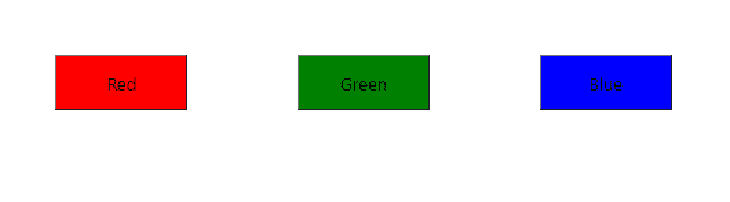
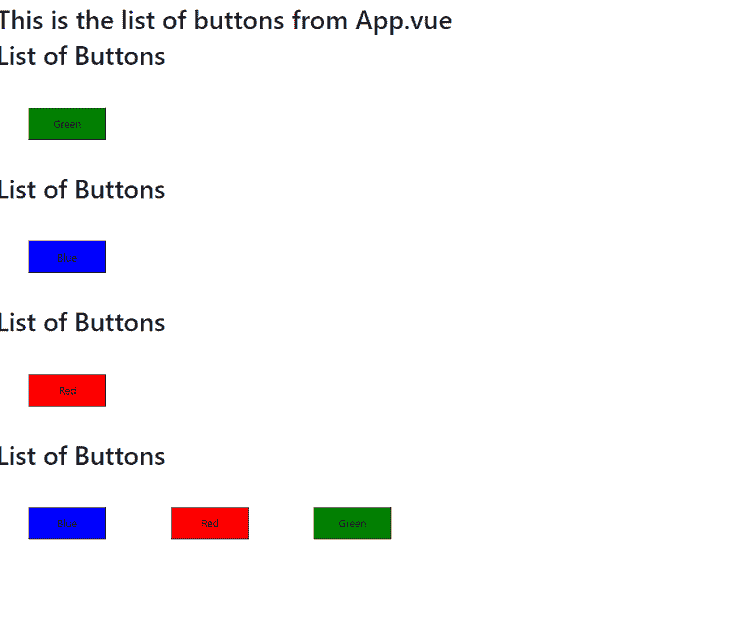
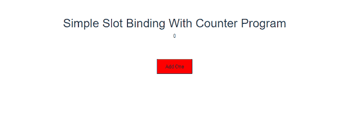
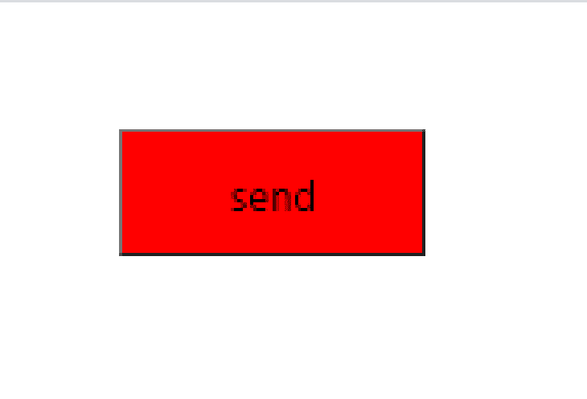
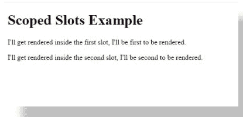

# 深入了解 Vue 老虎机- LogRocket 博客

> 原文：<https://blog.logrocket.com/a-deep-dive-into-vue-slots/>

很多时候，我们可能希望将数据从一个组件传递到另一个组件——不是用传统的父组件到子组件的方法，而是用一种使组件可重用的方法。

组件用于制作 web 模板，您可以将这些模板转储到不同的地方，以重新呈现同类代码。如果您可以重用一个组件，但是根据估算的属性在不同的地方以不同的方式呈现该组件，那该有多酷？相当酷。

使用 Vue slots，您可以将部分或全部组件转换成可重用的模板，这些模板将基于不同的用例进行不同的呈现。你需要做的就是把它们嵌入插槽。

在本文中，我将帮助您理解 Vue 插槽的概念，并向您展示如何使用它们。

## 插槽的基本用法

因此，我们从插槽的定义中理解了整个概念——它是关于使组件可重用的。现在，我们将深入探讨一些展示 Vue 插槽的示例，并讨论如何利用它们。

我们将在`App.vue`中创建一些按钮，并允许这些按钮被`Buttons.vue`重用:

```
/**App.vue**/
<template>
  <div id="app">
  <button-helper>
    <button type="button" class="Red">Red</button>
    <button type="button" class="Green">Green</button>
    <button type="button" class="Blue">Blue</button>
  </button-helper>
  </div>
</template>
<script>
import buttonHelper from './components/Buttons.vue'
export default {
  name: 'App',
  components: {
    'button-helper':buttonHelper
  }
    }
</script>

<style>
.Red{
  width:120px;
  height: 50px;
  margin: 50px;
  padding: 10px;
  background-color:red;
  text-align: center;
  cursor:pointer;
}
.Green{
  width:120px;
  height: 50px;
  margin: 50px;
  padding: 10px;
  background-color:Green;
  text-align: center;
  cursor:pointer;
}
.Blue{
  width:120px;
  height: 50px;
  margin: 50px;
  padding: 10px;
  background-color:blue;
  text-align: center;
  cursor:pointer;
}
</style>
```

```
//Buttons.vue

<template>
<div>
  <slot></slot>
  </div>
</template>
<script>
export default {
  name: 'Buttons',
    }
</script>
```



在上面的例子中，我们在`<App></App>`模板中创建了一些按钮。我们还将它们调用到我们的`Buttons.vue`中。当我们将`<slot></slot>`从`App.vue`中移除时，我们会看到只显示了`<h1>List of Buttons</h1>`。

这是因为您不能简单地通过在子组件标签中嵌入属性来将组件的属性从一个组件(`App.vue`)传递到另一个组件(`Buttons.vue`)。

如果我们想控制按钮在`Buttons.vue`中的呈现方式呢？我们可能希望首先呈现绿色按钮，最后呈现红色按钮。

下面的例子说明了我们如何通过不同的渲染方式重用组件:

```
//App.vue

<template>
  <div id="app">
  <button-helper>
    <h1 slot="title">List of Buttons</h1>
    <button slot="red" type="button" class="Red">Red</button>
    <button slot="green" type="button" class="Green">Green</button>
    <button slot="blue" type="button" class="Blue">Blue</button>
  </button-helper>
  </div>
</template>
<script>
import buttonHelper from './components/Buttons.vue'
export default {
  name: 'App',
  components: {
    'button-helper':buttonHelper
  }
    }
</script>

<style>
.Red{
  width:120px;
  height: 50px;
  margin: 50px;
  padding: 10px;
  background-color:red;
  text-align: center;
  cursor:pointer;
}
.Green{
  width:120px;
  height: 50px;
  margin: 50px;
  padding: 10px;
  background-color:Green;
  text-align: center;
  cursor:pointer;
}
.Blue{
  width:120px;
  height: 50px;
  margin: 50px;
  padding: 10px;
  background-color:blue;
  text-align: center;
  cursor:pointer;
}
</style>
```

```
//Buttons.vue
<template>
<div>
  <h1>This is the list of buttons from App.vue</h1>
<div>
  <slot name="title"></slot>
  <slot name="green"></slot>
</div>
<div>
  <slot name="title"></slot>
  <slot name="blue"></slot>
</div>
<div>
  <slot name="title"></slot>
  <slot name="red"></slot>
  </div>
<div>
  <slot name="title"></slot>
  <slot name="blue"></slot>
  <slot name="red"></slot>
  <slot name="green"></slot>
</div>
</div>
</template>
<script>
export default {
  name: 'Buttons',
    }
</script>
```



上面，我们已经命名了我们的插槽。当我们有多个属性作为插槽传递时，这是非常重要的——我们需要为插槽指定名称。例如，当我们调用它们时，我们可能不希望所有的槽一起出现。

这样，我们可以通过调用它们的名称从子组件中调用我们想要的插槽。

我们通过在想要传递给子组件的父组件的属性中添加`slot="name"`来命名插槽。我们通过将`<slot name="name"></slot>`添加到我们希望调用槽的位置来调用子组件中的命名槽。这种方法称为用名称属性命名插槽。

我们也可以在`<template>`上使用`v-slot`指令来命名我们的模板。这样，插槽的名称将作为`v-slot`的参数传递:

```
//Buttons.vue
<template>
  <div>
    <h1>List of Buttons</h1>
    <slot name="green"></slot>
    <slot name="red"></slot>
    <slot name="blue"></slot>
  </div>
</template>
<script>
export default {
  name: 'Buttons',
    }
</script>
```

```
//App.vue
<template>
  <div id="app">
    <Buttons>
      <template v-slot:green>
        <button class="Green">I am Green</button>
      </template>
    </Buttons>
      <Buttons>
      <template v-slot:blue>
        <button class="Blue">I am Blue</button>
      </template>
    </Buttons>
      <Buttons>
      <template v-slot:red> 
        <button class="Red">I am Red</button>
      </template>
    </Buttons>
    </div>
</template>
<script>
import Buttons from './components/Buttons'
export default {
  name: 'App',
  components: {
    Buttons,
  }
    }
</script>
<style>
.Red{
  width:120px;
  height: 50px;
  margin: 50px;
  padding: 10px;
  background-color:red;
  text-align: center;
  cursor:pointer;
}
.Green{
  width:120px;
  height: 50px;
  margin: 50px;
  padding: 10px;
  background-color:Green;
  text-align: center;
  cursor:pointer;
}
.Blue{
  width:120px;
  height: 50px;
  margin: 50px;
  padding: 10px;
  background-color:blue;
  text-align: center;
  cursor:pointer;
}
</style>
```

### 数据绑定

现在，让我们深入研究一些通过绑定表达式传递槽的更高级的方法。通过这种方式，我们可以基于用例来呈现插槽——特别是来自用户的输入，比如当我们操作 DOM 时。

我们将创建一个简单的程序，根据用户的输入将数据从子组件(`Buttons.vue`)绑定到父组件(`App.vue`):

```
// Button.vue

<template>
  <div class="hello">
    <h1>{{ msg }}</h1>
    <slot name="propsTest" :count="count" :addOne="addOne" />
  </div>
</template>
<script>
export default {
  name: "Buttons",
  props: {
    msg: String
  },
  data() {
    return {
      count: 0
    };
  },
  methods: {
    addOne() {
      this.count++;
    }
  }
};
</script>
<!-- Add "scoped" attribute to limit CSS to this component only -->
<style scoped>
h3 {
  margin: 40px 0 0;
}
ul {
  list-style-type: none;
  padding: 0;
}
li {
  display: inline-block;
  margin: 0 10px;
}
a {
  color: #42b983;
}
</style>
```

```
<template>
  <div id="app">
    <Buttons msg="Simple Slot Binding With Counter Program">
      <template v-slot:propsTest="{ count, addOne }">
        <p>{{ count }}</p>
        <button @click="addOne" class="Red">Add One</button>
      </template>
    </Buttons>
  </div>
</template>
<script>
import Buttons from "./components/Buttons";
export default {
  name: "app",
  components: {
    Buttons
  }
};
</script>
<style>
#app {
  font-family: "Avenir", Helvetica, Arial, sans-serif;
  -webkit-font-smoothing: antialiased;
  -moz-osx-font-smoothing: grayscale;
  text-align: center;
  color: #2c3e50;
  margin-top: 60px;
}
.Red{
  width:120px;
  height: 50px;
  margin: 50px;
  padding: 10px;
  background-color:red;
  text-align: center;
  cursor:pointer;
}
</style>
```



在上面的例子中，我们将计数器属性从`Button.vue`传递到`App.vue`，并通过使用`vue-slots`添加了一个按钮。

### 后备内容

因此，我们可能希望从`Button.vue`开始为我们的属性分配回退内容。这样，如果在`App.vue`或其他从`Button.vue`访问数据的组件中没有分配属性，组件可以退回到退回内容:

```
//Buttons.vue
<template>
<button type="submit" class="Red">
  <slot>Submit</slot>
</button>
</template>
<script>
export default {
  name: 'Buttons',
    }
</script>
<style>
.Red{
  width:120px;
  height: 50px;
  margin: 50px;
  padding: 10px;
  background-color:red;
  text-align: center;
  cursor:pointer;
}
</style>
```

```
//App.vue
<template>
  <div id="app">
    <Buttons>
      send
    </Buttons>
  </div>
</template>

<script>
import Buttons from './components/Buttons'
export default {
  name: 'App',
  components: {
    Buttons,
  }
    }
</script>
```



如果我们移除第五行`App.vue`中的发送按钮，我们会看到按钮中的文本从`Submit`变为`Send`。

## 作用域插槽

要在 Vue 中传递属性，您需要在父组件中定义数据，并为数据赋值。然后，将属性值传递给子组件，这样数据就成为子组件中的一个属性。

但是对于作用域插槽，您可以将属性从子组件传递到作用域插槽，然后从父组件访问它们。这与传统的 Vue 中的属性传递是相反的。这个概念是允许父组件访问子组件上的一些数据。

为了正确理解这个概念，我们将创建一个简单的表达式，并使用`slot-scope`将属性从子组件传递到父组件。

```
//App.vue
<template>
  <div>
    <Buttons>
      <template slot-scope="firstSlotScope">
        <p>{{firstSlotScope.text}}</p>
        <!-- Renders <p>I'll get rendered inside the first slot.</p> -->
      </template>
      <template slot="not-first" slot-scope="secondSlotScope">
        <p>{{secondSlotScope.text}}</p>
        <!-- Renders <p>I'll get rendered inside the second slot.</p> -->
      </template>
    </Buttons>
  </div>
</template>
<script>
import Buttons from './components/Buttons';
export default {
  name: 'App',
  components: {
    Buttons,
  }
}
</script>
```

```
//Buttons.vue
<template>
  <div>
    <h1>Scoped Slots Example</h1>
    <slot :text="firstSlotText"></slot>
    <slot name="not-first" :text="secondSlotText"></slot>
  </div>
</template>
<script>
export default {
  name: 'Buttons',
  data() {
    return {
      firstSlotText: "I'll get rendered inside the first slot, I'll be first to be rendered.",
      secondSlotText: "I'll get rendered inside the second slot, I'll be second to be rendered."
    }
  }
}
</script>
```



您可以从父组件访问子组件上的数据作为道具，而不是用 Vue 插槽绑定数据并给它们赋值。

## 结论

我们已经看到了通过使用 slot 属性来重用组件属性的不同方法。本文还解释了如何动态地或者通过使用插槽属性来命名插槽。我们还看到了如何使用插槽将特定数据从子组件传递到父组件，以及如何使用作用域插槽。

用这个 [Github repo](https://github.com/hannydevelop/Vue-slots) 可以多练习吃角子老虎机。ReadMe.md 文件中附有设置存储库的所有说明。这个项目的完整代码可以在[这里](https://vueslots.netlify.app/)找到。

你可以在 Vue 的官方网站上阅读更多关于 Vue 插槽的信息。如果您对本文有任何建议或问题，请随时[联系](https://twitter.com/hannydevelop)我。

## 像用户一样体验您的 Vue 应用

调试 Vue.js 应用程序可能会很困难，尤其是当用户会话期间有几十个(如果不是几百个)突变时。如果您对监视和跟踪生产中所有用户的 Vue 突变感兴趣，

[try LogRocket](https://lp.logrocket.com/blg/vue-signup)

.

[](https://lp.logrocket.com/blg/vue-signup)[https://logrocket.com/signup/](https://lp.logrocket.com/blg/vue-signup)

LogRocket 就像是网络和移动应用程序的 DVR，记录你的 Vue 应用程序中发生的一切，包括网络请求、JavaScript 错误、性能问题等等。您可以汇总并报告问题发生时应用程序的状态，而不是猜测问题发生的原因。

LogRocket Vuex 插件将 Vuex 突变记录到 LogRocket 控制台，为您提供导致错误的环境，以及出现问题时应用程序的状态。

现代化您调试 Vue 应用的方式- [开始免费监控](https://lp.logrocket.com/blg/vue-signup)。