# 设计易访问网站的开发者指南

> 原文：<https://blog.logrocket.com/a-developers-guide-to-designing-accessible-websites/>

## 介绍

每个项目都始于解决问题或创造新事物的需求，网站也不例外。我会教你如何设计一个网站，不仅容易访问和使用，而且经得起时间的考验。

我们将讨论与网页设计相关的理论，代码，以及为什么所有的东西都能工作。这一切都始于网页的可访问性。

## 网页可访问性

光是术语“可访问性”就应该让你知道它是怎么回事了。简而言之，就是让某些东西变得可及。在 web 开发中，这是说起来容易做起来难。

根据 [W3](https://www.w3.org/WAI/fundamentals/accessibility-intro/) :

> 网页可访问性意味着网站、工具和技术的设计和开发是为了方便残疾人使用。更具体地说，人们可以:感知、理解、导航并与*网络*互动。

对上述定义的总结是，网页可访问性是指为所有人创建网站，而不考虑以下因素:

*   残疾
*   设备类型(移动或桌面)
*   设备方向
*   网络连接
*   浏览器类型和版本
*   操作系统

我们将从设计到编码，一直到测试和发布。结果呢？一个用户可以访问和使用的网站，因为蒂姆·伯纳斯·李说过:

> 网络的力量在于它的普遍性。
> 
> 无论是否残疾，每个人都能获得服务是一个重要方面。

如果你感到好奇，以下是网站的最终设计:

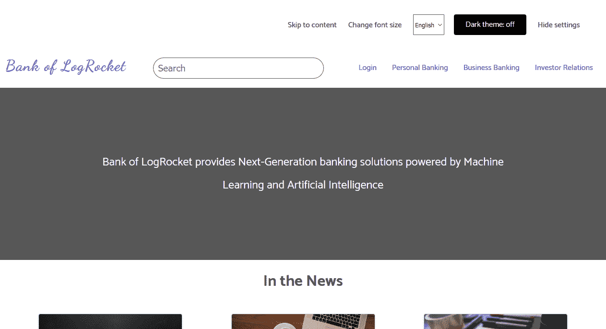

如果赶时间，可以[在线](https://bankoflogrocket.netlify.app)查看。如果没有，请继续阅读，看看它是如何制作的。

我们的想法是从网站的顶部(在网络浏览器中看到的)一路向下(到网站页脚)。

让我们从用户界面设计开始，俗称 UI 设计。

### 用户界面设计

当你开始设计一个界面时，你应该问自己一些问题:

*   谁是应用程序的用户？
*   他们希望在申请中发现什么？
*   类似应用程序的布局是什么？
*   他们将如何找到绕过应用程序的方法？
*   用户是在台式机上还是在移动设备上？

这些问题的答案是走向正确的第一步。如果应用程序的用户群很大，您可能需要进行研究，找出用户真正想要的应用程序。总而言之，界面必须易于使用和理解，即使用户处于紧急情况下。

有各种各样的工具可用于 UI 设计。有时候，这完全取决于设计师的选择。一些工具包括:

*   Balsamiq 模型
*   素描
*   Adobe XD

对于我们的网站设计，界面是用 Balsamiq 设计的。我们从移动显示开始，因为大多数用户通过他们的移动设备访问网络。

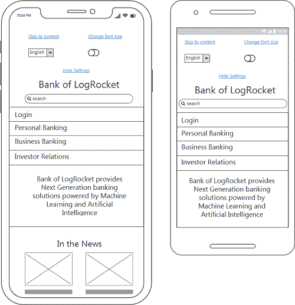

该图像被称为线框，它向您展示了 iPhone 和智能手机上的网站外观。存在细微的差异，最显著的是设备的高度和宽度。

您还应该注意以下几点:

*   网页元素以清晰的层次结构排列
*   导航看起来很容易使用(这取决于实现)
*   字体都是一样的(我们稍后会修复)

移动用户包括 iPhone 用户、智能手机用户和平板电脑用户。

你已经看到了 iPhone 和智能手机上的布局。接下来，你会看到平板电脑用户:

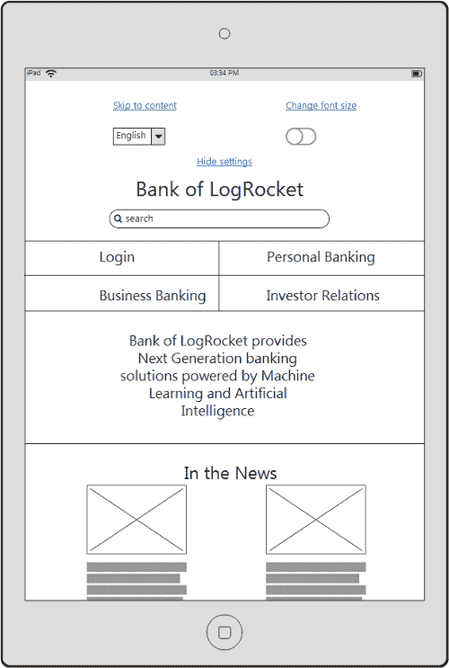

当你将这种布局与 iPhone/智能手机布局进行比较时，几乎是一样的，但导航现在分成了两行。

接下来，我们有桌面视图。这将充分展示网站的布局:

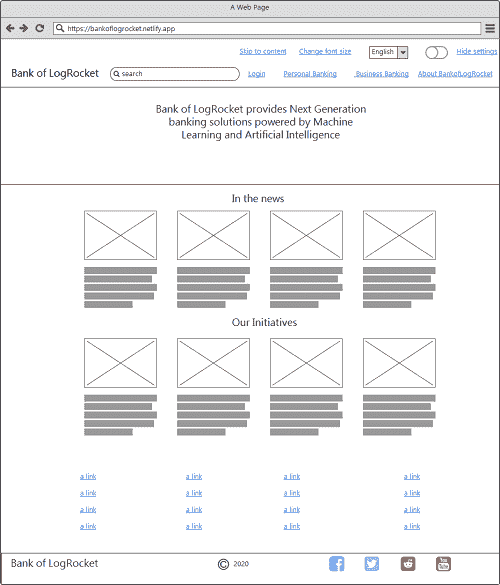

从我们到目前为止展示的 3 种布局来看，即 iPhone/智能手机、平板电脑和桌面，很明显布局应该适应设备方向。

该网站的最终实现是不同的相比，我们在样机。问题是:为什么会这样？答案是:用户体验。

## 用户体验

如果用户界面设计是关于它看起来如何，用户体验设计是关于它如何工作，这也可以改变我们对网站的看法。

在最初的网站线框图中，我们展示了照顾用户体验的意图。现在，我们必须确保布局的行为符合我们的预期。

以下是我们迄今为止所做的工作:

*   导航旨在便于在手机上使用和访问
*   搜索按钮对于手机和平板电脑来说足够宽
*   与桌面上的 4 行相比，新闻部分排列成 2 行(平板电脑上的导航也是如此)
*   页面元素中有足够的空白
*   结构良好的布局

你可能会考虑这些次要的页面功能(是的，在一定程度上，我们仍然需要编码)，但是如果我们忽略了它们，网站的可用性将会大大降低。

网络是为每个人而建的，所以你不应该不管人们的浏览器版本而将他们拒之门外。确保你做出的设计决定不会影响你的网站的用户体验，并编写语义上的代码，保证能在用户的浏览器中工作。

## 语义标记

超文本标记语言是大多数网站使用的标记语言。你可以按照你认为合适的方式编写网站的标记，但这并不意味着它是语义化的。简单地说，语义标记就是为工作使用正确的 HTML 标签。大多数语义标签都内置了可访问性。

在网页设计的早期，设计师不得不求助于一些 HTML 标签来解决 CSS 无法解决的布局问题。选择的超级 HTML 标签是`table`标签。这个标签甚至被用于亚马逊在线商店的早期设计中。后来，就有了`div`和`span`的标签。

* * *

### 更多来自 LogRocket 的精彩文章:

* * *

HTML5 带有一些语义标签，通过它们的名字告诉你它们的意思。

有些是:

*   `header`
*   ``nav``
`*   ``aside```   ``main```   ``section```   ``article```   ``footer```````

 ``当您查看我们的索引页面的标记时，您会发现类似于下面给出的代码结构:

```
<header>
    <!-- header content -->
</header>

<aside>
    <!-- aside content -->
</aside>

<main>
    <!-- main content -->
</main>

<footer>
    <!-- footer content -->
</footer>
```

当你使用相似的格式(或其他语义标签)时，你已经为网页的可访问性定下了基调。但是，您应该知道这些标签可以包含其他标签，其中一些标签没有语义。它们是有用途的，因为没有其他标签适合你可能发现自己所处的情况。这种标签的一个例子是`span`。

## 良好的颜色组合

如果使用和结合得好，颜色是很棒的。利用纯色组合的知名网站让用户敬畏不已。一个主要的例子是亚马逊。他们是怎么做到的？色彩理论。

色彩理论是一个有趣的领域。这需要:

*   颜色的内在细节
*   何时使用它们。
*   何时不使用它们
*   如何使用和组合它们；当然了
*   色轮

大多数处理食品和农业的网站都使用一些绿色的组合。如果是烘焙相关的网站，会经常看到棕色。

如果你想让用户第一眼看到你的网站，颜色组合应该很棒。这就是色轮大有用武之地的时候。

色轮是由颜色组成的圆形轮子。颜色可以按以下格式组合:

*   类似的
*   称赞的
*   分割-赠送
*   三人组合的
*   四元的

在我们的原型网站中，我们使用了以下颜色:

*   `#764abc` —紫色
*   `#1a1a1a` —黑色
*   `#e3e3e3` —浅灰色
*   `#575757` —灰色阴影
*   `#000000` —黑色

紫色是这个设计中的主色调。你可以在大多数网页元素中找到它，例如链接和表单提交按钮。

在我们的原型网站设计中，颜色没有被过度使用。相反，无论你在哪里找到它们，它们都会传递意义。

当你观察导航前的链接时，它们的颜色表明它们的用途与页面上的其他链接不同，例如导航链接。主题切换链接是黑色的，因为我们试图传达这个特殊的元素是用来在亮暗主题之间切换的。

这个主题切换器只适用于支持 JavaScript 的浏览器。当浏览器不支持 JavaScript 或禁用了 JavaScript 时，用户将看到一个灰色的禁用按钮，而看不到鼠标光标。

大多数用户界面设计使用这种效果来让用户知道这个功能是不可用的。

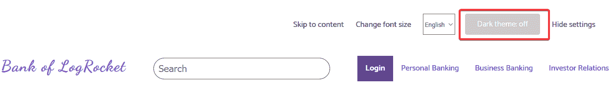

另一个例子是如上图所示的活动链接。活动链接有一个紫色背景的白色文本，让用户知道这是他们当前正在查看的页面。这里的课程是用颜色来:

*   必要时传达意思
*   指示元素状态
*   区分网页元素的用途
*   不要单独使用颜色来传递信息，使用伴随文本，如主题切换器和活动链接按钮所示

其他颜色组合将在本文的适当部分讨论。此外，主题切换器是如何实现的将在“黑暗模式”部分详细讨论。

在设计过程中选择颜色组合后的下一步是使用响应式网页设计开始网站编码，这是我们实现线框中描述的不同布局的部分。

## 响应式网页设计

RWD 的三个要素是流动的网格、灵活的图像和媒体询问。

多年来，与设备无关的设计已经成为关注的焦点。这个想法背后的概念是为内容而设计。你从移动布局开始。完成后，你开始调整布局，直到它打破。此时，是时候重新设计布局了。这是我们原型设计中使用的方法。

当您捕捉到移动布局时，您将获得以下内容:

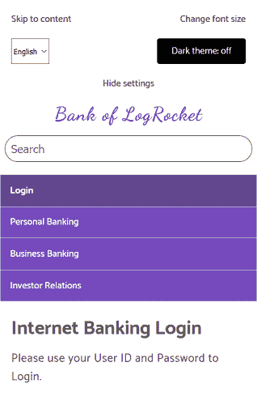

该布局与桌面用户将看到的布局完全不同。这里，网页元素被安排成便于用户访问。

当你开始调整布局时，你会注意到网站布局的变化，尤其是导航。媒体查询用于重新排列布局。

```
@media screen and (min-width: 48em) {
    /* Code to ra-arrange the layout */
}
```

在媒体查询中，应用了一些更改以使其适合该点。这些变化可以包括以下内容:

*   调整边距和填充
*   将一些 CSS 元素设置为`inherit`(如有必要)
*   改变某些元素的显示属性，例如`display: flex`或`display: inline-block`
*   更改某些元素的宽度

在我们的原型网站设计中，以下代码用于更改导航布局:

```
@media screen and (min-width: 35em) {
    @supports (display: grid) {
        .navigation__menu {
            display: grid;
            grid-template-areas: "h1 h2" "h3 h4";
        }

        .navigation__item:nth-child(2) {
            border-top: none;
        }
    }
}
```

在这个媒体查询中，我们使用`@supports`规则测试网格布局，这意味着只有支持 CSS 网格布局的浏览器才会调整导航。

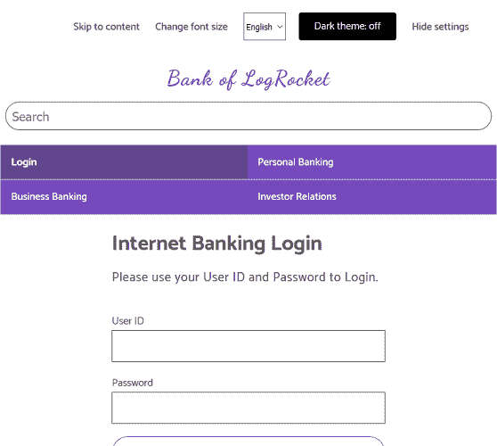

不支持 CSS 网格的浏览器将显示更大版本的移动布局。下面的布局来自 Internet Explorer 11。

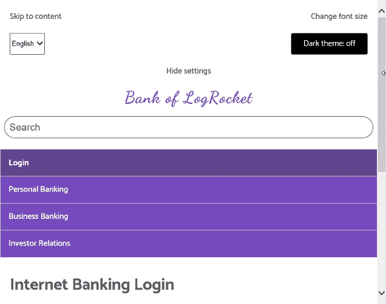

此外，调整布局大小超过这一点将导致桌面布局，这都归功于媒体查询。

灵活的图像也是 RWD 的一部分。这样做的目的是确保图像不会超出它们的父容器。值为`100`的 CSS `max-width`属性就是这背后的秘密。

```
img {
    /* max-width means maximum width */
    max-width: 100%;
}
```

流体网格是 RWD 的第三个组成部分，它包括使用相对单位来确定容器的大小。相对单位的例子包括`%`和`em`。在我们的原型设计中完全使用了相关单位。一个例子是当容器宽度被调整为占据浏览器视窗的百分之`60%`。

```
@media screen and (min-width: 48em ) {
    .container {
        width: 60%;
        margin: 0 auto;
    }
}
```

## 渐进增强

渐进式增强背后的想法是提供一个可靠的基线体验，让尽可能多的用户可以访问，并且只为支持它们的浏览器提供功能。

我们的网站原型是在逐步增强的思想下构建的。该布局的构建依据是:

*   语义标记——保证在大多数浏览器上运行的作业的正确标记
*   响应式网页设计——从移动布局到桌面布局
*   功能检测—在为浏览器提供某些代码之前测试特定的功能

您已经在前面的章节中了解了语义标记和响应式 web 设计，并且看到了一个特性检测的例子。但是我们再来重温一下。

当重新排列导航布局时，我们执行了以下操作:

```
@media screen and (min-width: 35em) {
    @supports (display: grid) { /* feature detection */
        /* Code here */
    }
}
```

使用`@supports`测试浏览器是否支持 CSS 网格的代码。因此，只有当指定的条件为真时，`@supports`中的代码才会运行。在这种情况下，它询问浏览器是否要支持 CSS 网格。如果是，运行该块中的代码。如果浏览器不理解它，它会很乐意忽略`@supports`块中的代码。

那就是你看到 Internet Explorer 11 不支持 CSS 网格的时候。因此，它忽略了导航重新安排，它只显示默认的移动布局。这就是渐进增强的力量。

另一个例子是主题切换器。只有当用户的支持 JavaScript 时，切换器才是有用的，因此，它在 HTML 代码中是默认禁用的。

```
<label
       id="themer-label"
       class="button header__form-label"
       data-state="disabled"
>
    <input type="checkbox" id="themer" disabled />
    Dark theme: <span aria-hidden="true"></span>
</label>
```

使用 CSS 降低了不透明度。

```
.button[data-state="disabled"]{
    opacity: 0.2;
    cursor: not-allowed;
}
```

当用户浏览器支持 JavaScript 时，我们分别从`label`和`input`中移除`data-state`和`disabled`属性。

```
if (
    checkbox.hasAttribute("disabled") &&
    themerLabel.hasAttribute("data-state") &&
    themerLabel.getAttribute("data-state") === "disabled"
) {
    checkbox.removeAttribute("disabled");
    themerLabel.removeAttribute("data-state");
}
```

这确保了如果浏览器支持 JavaScript，主题切换器可以工作。如果我们没有做到这一点，禁用 JavaScript 的用户可能会点击切换器，认为它可以工作。通过这种方式，我们向他们展示了这种功能是不可用的。

另一个选择是，如果主题切换器不起作用的话，其他开发人员会主张将它完全隐藏起来，但是我们会让它保持原样。

以下是考虑渐进式改进的最佳方式:

*   从适用于大多数浏览器的语义 HTML 开始
*   添加也适用于大多数浏览器的 CSS，并在提供现代功能之前使用功能检测
*   在需要的地方添加 JavaScript 来增加趣味
*   使用 JavaScript 填充 HTML 和 CSS 中缺少的功能
*   只有在功能正常的情况下才使用它，否则，禁用或隐藏它

当你遵循这种方法时，你的用户将在你的网站上获得基线体验。如果他们的浏览器支持现代功能，他们将获得完整的功能和体验。

### 无障碍导航

你已经看到了网址导航的图片，但手机能方便地使用它吗？嗯，是的。

当你设计你的网站导航时，你应该考虑移动用户——尤其是触摸设备。在我们的设计中，用户可以很容易地点击导航链接，因为它足够宽。这里的秘密是一个双向过程:

*   将链接的`display`属性更改为`block`
*   应用一个`padding`

CSS 中的结果代码:

```
.navigation__link {
    display: block;         /* Setup to make it cliackable */
    padding: 0.8em 1em;     /* Creating the clickable area */

    /* Other styling */
}
```

如果有必要，为导航添加不同的布局重新安排，但是不要牺牲可点击性和可用性。一些台式电脑有触摸功能，用户可能会选择用手而不是键盘来与你的网站互动。

## 可用搜索表单

我们的原型网站是一个静态网站，而不是动态的，但我们已经确保，即使你可能会决定加强它，并将其转换为动态的，搜索输入是可用的。

表单是一个关联的标签，带有一个输入和一个告诉用户“搜索”的占位符。当输入接收到焦点时，边框半径从弯曲的角改变为其初始格式。这是输入现在有效的另一个指示。

下面是 HTML 代码:

```
<form class="header__search-form">
    <label class="visuallyhidden" for="search-site">Search site</label>
    <input
        id="search-site"
        class="header__search-input"
        type="text"
        name="search"
        placeholder="Search"
    />
</form>
```

表单标签在视觉上是隐藏的，但是屏幕阅读器可以看到它。

### 良好的字体组合

字体组合的时候要美观。这将确保读者会继续阅读你的网站内容。在我们的网站设计中，两种字体结合在一起:双体船和舞蹈脚本。

这两种字体在谷歌字体上都有。你也可以查看 Michael Andreuzza 关于颜色和字体的字体配对资源。

## 跳到内容

一些网站在网站主要内容之前有复杂的导航。当一个屏幕阅读器在你的网站上导航时，它必须阅读整个导航，用户听了会觉得不舒服。幸运的是，有一个解决办法:跳到内容。

跳转到内容是一个 HTML 链接，允许用户“跳转”到网站内容。有两种方法可以实现此功能:

*   隐藏跳转到内容链接，并允许它显示在焦点上
*   显示它并允许用户按需使用它

在我们的网站设计中，我们选择了展示。这个决定是受 W3 网站设计的启发。跳到内容背后的机制如下:

*   “跳转到内容”链接有一个超链接位置，告诉浏览器该去哪里。它的格式是`#content`
*   该位置的 ID 与位置名称相同

在 HTML 中:

```
<ul>
    <li><a href="#content">Skip to content</a></li>
</ul>

<main id="content">
    <!-- main content here -->
</main>
```

另一种方法是使用 CSS 隐藏跳转到内容的链接。当链接通过用户的`<kbd>Tab</kbd>`键获得焦点时，它会显示在屏幕上。

首先是 HTML:

```
<div id="skip">
    <a href="#content">Skip to main content</a>
</div>

<main id="content">
    <!-- content here -->
</main>
```

CSS:

```
#skip a {
    height: 1px;
    left: -10000px;
    position: absolute;
    overflow: hidden;
    top: auto;
    width: 1px;
    padding: 1.2em;
}

/**
  * Change the background color and color
  * based on your design.
 */
#skip a:focus {
    height: auto;
    position: static;
    width: auto;
    background-color: #06162f;
    color: #ffffff;
}
```

当你实现了这个特性，你就让用户更容易浏览你的网站。

## 可访问的链接

你阅读这篇文章很有可能是因为你点击了网页或其他媒体上的链接。

当你编写链接时，确保用户能够区分链接和其他网页元素。有多种方法可以做到这一点。这完全取决于你的设计。在我们的网站设计中，链接基于它们在网页上的位置是不同的。当用户与他们交互时，他们会得到额外的指示，表明他们已经悬停在一个链接上。

我鼓励你阅读耶鲁大学关于链接的可用性和网页可访问性的文章。

## 响应式印刷

当你的用户发现很难阅读你网站上的信息时，他们会去别的地方寻找信息。响应式排版是正确的排版和可扩展的排版。

有多种技术可以实现响应性排版，但是在我们的原型设计中，我们使用相对字体大小来实现它。

这意味着网页上的字体使用以下两种方法之一来调整大小:

这样，当用户在浏览器中放大时，他们仍然可以毫无困难地阅读文本。

此外，我们还实现了垂直节奏，即段落之后或之前的空格。这是网站设计的样本代码:

```
main p {
    font-size: 1.2em;
    line-height: 1.618;
    letter-spacing: 0.04em;
    font-weight: 400;
    font-style: normal;
    margin-bottom: 2em; /* This creates a space below all paragraphs */
}
```

这样做是为了方便用户的阅读过程。

## 辅助图像

你会在大多数网站上找到图像，你肯定会在你的设计项目中处理图像。确保图像可访问的第一步是提供替代文本。

替代文本是图像的简短描述。当编写替代文本时，避免使用“图像”一词，例如“大象的图像”，因为我们稍后将了解到，辅助功能检查器会很乐意指出这一点。

当图像因编码错误或网络错误而无法下载或损坏时，替代文本还会向用户提供有关图像的信息。

在我们的设计中，实现了一种定制的方法来设计破碎图像的样式。以下是部分内容:

```
/* parts of code for styling broken images*/
.media-card__image::before {
    content: " ";
    background-color: #eee;
    width: 100%;
    height: 100%;
    display: block;
    position: absolute;
    border: 1px dashed #aaa;
    border-radius: 4px;
}

/* Remaining code truncated, check the styles.css file */
```

在 Chrome 支持的勇敢浏览器中看到的风格破碎图像示例:

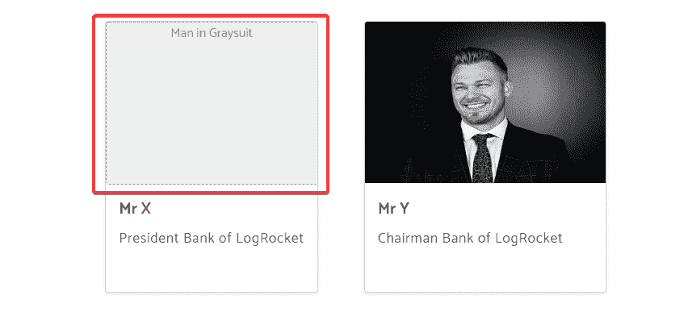

您还应该在 HTML 中为图像提供一个`width`和`height`。这允许浏览器在图像下载完成之前保留该空间。

```

```

如果不这样做，浏览器会下载文本和其他内容，图像会凭空出现在用户面前。

最后，图像应该具有响应性。

```
img {
    max-width: 100%;
}
```

> 注意:如果你使用一个图像作为英雄图像，确保它有一个小尺寸。这样，用户不会注意到它正在下载。否则，通过减小宽度来创建此图像的不同版本，从而减小大小。然后在设计中的不同断点使用它们。

## 可访问的表单

大多数网站上都有表格。以下是使您的表单更易访问的一些步骤:

*   使用语义标记
*   将每个表单标签与其表单输入相关联
*   对`fieldset`中的相关元素进行分组，例如单选按钮
*   明智地使用空格来表明清晰的层次结构
*   相关的表单输入应该一起出现，例如名字和姓氏
*   使用 HTML `input`和`type=submit`，而不是`button`元素。

根据表单设计的复杂程度，这些步骤可能会增加，但始终要记住可访问性。

请看一下联系人表单的一些代码:

```
<form class="form">
    <span><em>All fields are required</em></span>

    <div class="form__row">
        <label class="form__label" for="full-name"
            >Full Name</label
        >
        <input
            class="form__input"
            id="full-name"
            type="text"
            name="full-name"
            placeholder="Entery your full name"
        />
    </div>

    <div class="form__row">
        <label class="form__label" for="email"
            >Email Address</label
        >
        <input
            class="form__input"
            id="email"
            type="email"
            name="email"
            placeholder="Enter your email address"
        />
    </div>

    <!-- remaining code truncated to save space -->
</form>
```

在 Firefox web 浏览器中看到的联系人表单:

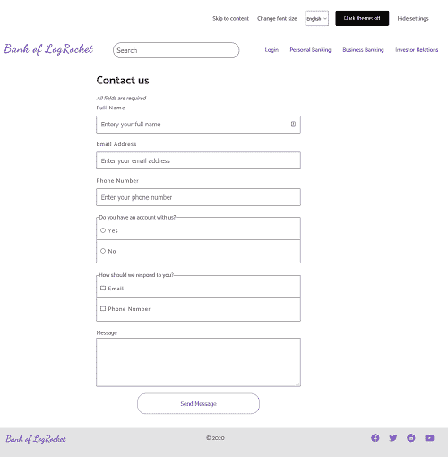

## 可访问和响应的表

表格以表格的形式提供数据。对开发者来说幸运的是，它在 HTML 中有自己的标签，即`table`标签。其他相关标签有:

在引入响应式网页设计之后，表格并没有很好地发挥作用。然而，开发人员解决问题，所以他们解决了这个问题。

我们的原型设计中的“货币兑换表”是可访问的和可响应的。不相信我？调整浏览器视窗的大小，观察变化。

用于实现这一点的技术是由 Chris Coyier 和 Adrian Roselli 在他们的文章[响应式数据表](https://css-tricks.com/responsive-data-tables/)和[响应式可访问表](https://adrianroselli.com/2017/11/a-responsive-accessible-table.html)中的工作提供的。

这两种方法都可以在没有 JavaScript 的情况下工作，但是 Adrian 的方法不太适合移动设备。因此，我在不牺牲可访问性的情况下，结合了适用于有或没有 JavaScript 的浏览器的两种技术。

Chris 的方法是默认设计，因为它不需要 JavaScript 就能工作。当浏览器加载 JavaScript 时，我们更改为 Adrian 的设计。

下面的 JavaScript 实现了这个功能:

```
let table = document.getElementById("currencyTable");
table.classList.remove("noJS-version");
table.classList.add("js-version");
```

它更改了表标记中的以下 CSS 类:

```
<table id="currencyTable" class="noJS-version">
    <!-- remaining table markup truncated -->
</table>
```

您将在`styles.css`中找到表格标记的 CSS。

启用了 JavaScript 的较小视窗上的响应表:

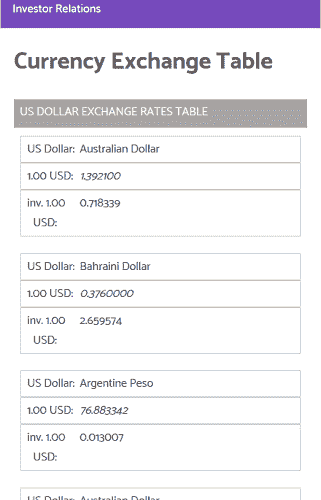

不使用 JavaScript:

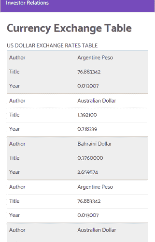

当像 NVDA 这样的屏幕阅读器在手机上或在更小的视窗中阅读时，这些表格的显著区别是布局。

## 无障碍视频

我们没有包括任何视频，但很高兴你知道如何创建可访问的视频。

如果有必要，视频应该有标题和字幕。由于屏幕阅读器的原因，这是必需的。

YouTube 视频有字幕，如果你使用 EDX 平台，所有视频都有字幕，允许用户跳转到视频中的特定点。

您应该查看以下资源，了解有关辅助视频的更多信息:

## 黑暗模式

你在你的代码编辑器和喜欢的网站中使用深色主题吗？我知道。

黑暗模式在几年前成为一种趋势，随着 Twitter 和 DEV 等流行网站的实施，这种趋势正在与日俱增。

我们的原型网站也以黑暗主题为特色。它在支持 JavaScript 的浏览器上工作。以下是启用了黑暗主题的网站:

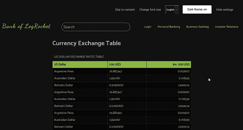

黑暗主题代码是 Heydon Pickering 在他们的书《包容性组件》中提供的。具体来说，主题切换器的[章节。](https://inclusive-components.design/a-theme-switcher/)

主题的工作原理是使用 CSS 滤镜反转所有页面元素的颜色。

下面是代码:

```
<style id="inverter" media="none">
    html {
        background-color: #eee;
        filter: invert(100%);
    }
    * {
        background-color: inherit;
    }
    img:not([src*=".svg"]),
    [style*="url("] {
        filter: invert(100%);
    }
</style>
```

CSS 代码位于每个文档的`head`中的`style`属性中。

HTML 如下所示:

```
<label
       id="themer-label"
       class="button header__form-label"
       data-state="disabled"
>
    <input type="checkbox" id="themer" disabled />
    Dark theme: <span aria-hidden="true"></span>
</label>
```

您将观察到`label`元素的`data-state`属性被设置为`disabled`，并且输入也被禁用。

做出这个设计决定是因为主题切换器只对 JavaScript 有用。因此，默认情况下它是禁用的。当浏览器支持 JavaScript 时，我们移除`input`的禁用状态，以及`label`元素的`data-state`属性。

```
var themerLabel = document.getElementById("themer-label");
if (
    checkbox.hasAttribute("disabled") &&
    themerLabel.hasAttribute("data-state") &&
    themerLabel.getAttribute("data-state") === "disabled"
) {
    checkbox.removeAttribute("disabled");
    themerLabel.removeAttribute("data-state");
}
```

你必须在每个页面的用户浏览器中启用深色主题首选项。您可以使用 JavaScript 本地存储解决这个问题。

当 JavaScript 在你的浏览器中被禁用时，主题切换器被禁用，因为没有 JavaScript 它是没有用的。如果您愿意，可以在禁用 JavaScript 时隐藏它。我把那个留给你。

## 屏幕阅读器

如果你已经遵循了我们在本教程中的路线，你的网站应该可以被屏幕阅读器访问。

如果您的网站内容基于语义和有效的 HTML，屏幕阅读器将会正确地阅读您的网站内容，但是您可以使用下面的任何屏幕阅读器来测试原型网站或您的网站:

就我个人而言，我在为本教程设计的网站上使用了 NVDA。

## 可访问性测试

现在是时候对你的网站进行可访问性测试了。

可访问性测试允许您注意到 HTML 代码中的一些错误，这些错误可能会对您站点的可访问性产生影响。

我在设计这个教程的网站时发现了一些问题。有些是错误，有些是警告。我解决了大部分问题，但是有一个特定的错误在通过可访问性检查时似乎没有解决方案。

我使用了 Firefox 的 WEBAIM accessibility checker 扩展，它在所有测试页面的标题部分的组合框中报告了一个对比度错误。经过一些研究，我发现浏览器不允许在`option`标签上使用 CSS 样式，特别是背景颜色。结果，该工具报告了一个对比度错误，因为`option`标签在蓝光背景上有一个白色文本，这是该标签的默认设置。

我找到了多种改变`option`标签外观的解决方案，但是没有一个通过了可访问性测试。WEBAIM 在所有找到的解决方案上报告了相同的对比度错误。因此，这是一个我们必须忍受的小代价。

在每个页面的下半部分，有一个站点资源部分，在平板电脑和移动设备上实现为一个手风琴。

我采用的实现 accordion 的方法涉及到重复的标记:一个用于 accordion，另一个用于更宽屏幕上的完整布局。手风琴的代码隐藏在更宽的屏幕上，反之亦然。

WEBAIM 辅助工具为此报告了一个警报，因为它涉及将两个相邻链接指向同一资源。

你可以在你的设计中抛弃手风琴，在平板电脑和移动设备上将链接堆叠在一起，并确保它易于点击。我也认为这是一个小的交换，因为你可以很容易地去掉它们。

除了现在看起来无法解决的错误和你可以在设计中去掉的警告，其他的可访问性检查都是一路绿灯。

## 源代码验证

到目前为止，我们的代码是有效的 HTML 和 CSS。您可以使用 [W3 验证器](https://validator.w3.org)来验证自己，但是您会注意到在`head`部分有一个小错误。

这是主题切换器的代码。验证程序报告用于`media`属性的值未知。

我坚持使用这个主题切换器，因为它可以通过键盘访问。但是如果您不希望出现这种错误，您可以实现自己的。

在你的设计过程之后，确保你验证你的 HTML 和 CSS——这是免费的。

## 打印样式表

本教程的原型网站是一个虚构的 LogRocket 银行。因为这是一个银行网站，我们可能需要担心打印样式表(除了网页组件)。大多数银行操作都是在身份验证之后完成的，我们在本教程中没有达到那个级别。

只有`currencyexchange.html`文件上的货币兑换表和 accordion 有打印样式。

打印样式表应该确保网站内容正确打印在纸上，并减少墨水的使用。您可以执行以下操作来减少油墨用量:

*   将背景颜色改为白色
*   隐藏图像和其他图形元素(如有必要)
*   如果有其他花哨的东西只是为了美观而出现在屏幕上，但是会消耗用户的墨水，那就把它们去掉吧

如果你的网站是一个食谱网站，打印样式表是必须的，你必须把它做好。

## 结论

当您吸取了本文中的经验并将其应用到您的下一个设计项目中时，您就已经尽了作为 web 开发人员的最大努力，您的用户将能够获得基线体验以及更多的体验(如果他们的浏览器支持的话)。

## 使用 [LogRocket](https://lp.logrocket.com/blg/signup) 消除传统错误报告的干扰

[](https://lp.logrocket.com/blg/signup)

[LogRocket](https://lp.logrocket.com/blg/signup) 是一个数字体验分析解决方案，它可以保护您免受数百个假阳性错误警报的影响，只针对几个真正重要的项目。LogRocket 会告诉您应用程序中实际影响用户的最具影响力的 bug 和 UX 问题。

然后，使用具有深层技术遥测的会话重放来确切地查看用户看到了什么以及是什么导致了问题，就像你在他们身后看一样。

LogRocket 自动聚合客户端错误、JS 异常、前端性能指标和用户交互。然后 LogRocket 使用机器学习来告诉你哪些问题正在影响大多数用户，并提供你需要修复它的上下文。

关注重要的 bug—[今天就试试 LogRocket】。](https://lp.logrocket.com/blg/signup-issue-free)``