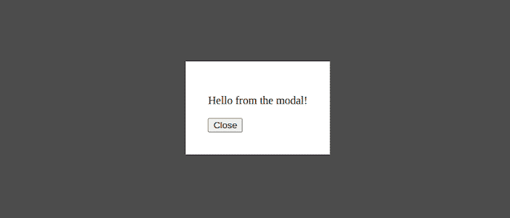
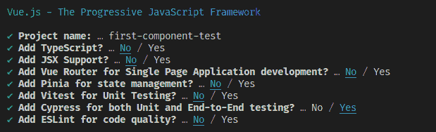
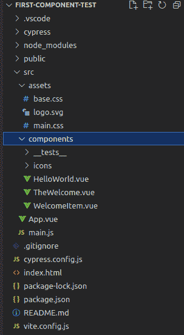
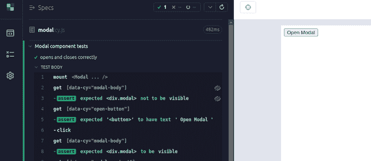
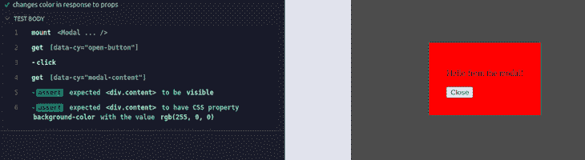

# 使用 Cypress 的 Vue 自动化测试指南

> 原文：<https://blog.logrocket.com/a-guide-to-automated-testing-in-vue-with-cypress/>

对于任何代码库来说，测试都是绝对必要的，它可以帮助你在用户之前发现难以发现的错误，并作为你的代码应该如何工作的文档。随着项目的增长和变得越来越复杂，拥有完整的文档和无错误的代码库对于 UX 和应用程序的安全性变得越来越重要。

如果你使用 Vue，Cypress 是测试你的应用程序的最好工具之一。在本文中，我们将学习如何用 Cypress 测试单个 Vue 组件。

要跟随本教程，您需要:

*   文本编辑器
*   本地安装的 Node.js
*   HTML、CSS、JavaScript、Vue 和 Cypress 的工作知识

请记住，本教程使用的是 [Vue 3 和组合 API](https://blog.logrocket.com/provide-inject-vue-js-3-composition-api/) 。

*向前跳转:*

## 组件测试与 E2E 测试

端到端(E2E)测试的目标是以与最终用户相同的方式体验您的整个应用程序，确保它按预期工作。虽然组件测试使用相同的一般思想，但它侧重于将前端的每个组件作为一个独立的部分进行测试，而不考虑组件与其他组件的协同工作情况。因此，即使您的所有组件测试都通过了，也不能保证您的应用程序整体上工作正常。

那么，为什么要费心进行组件测试呢？编写组件测试更快，需要更少的设置和基础设施。如果您正在构建一个库，组件测试是非常宝贵的，因为单独测试每个组件要明智得多。测试应用程序时，修复组件内部的问题会更容易，而在 E2E 测试中，由于组件的范围较小，这些问题可能很难查明。理想情况下，您的项目应该混合了组件测试和 E2E 测试。

## 为什么是柏树？

Vue 文档[推荐 Cypress 来测试组件](https://vuejs.org/guide/scaling-up/testing.html#component-testing)，这些组件的行为取决于渲染风格。此外，Cypress 是免费的、开源的，并且易于设置和安装。Cypress 测试易于读写，并且它有非常[全面的文档](https://docs.cypress.io/)。

## 用 Cypress 测试 Vue 组件

首先，我们将学习如何将 Cypress 添加到我们的 Vue 项目中，然后我们将为 Cypress 组件编写测试。在本教程中，我们将测试一个简单的模态，如下图所示:



### 项目设置

首先，打开您的终端并导航到您希望项目所在的目录。接下来，在您的终端中运行以下命令来[用 Vue 和 Vite](https://blog.logrocket.com/vite-3-vs-create-react-app-comparison-migration-guide/) 创建一个应用程序:

```
npm init [email protected]

```

该命令将提示您回答一系列问题；用下面显示的配置回答这些问题:



现在，您应该有一个名为`first-component-test`的新目录。运行以下命令:

```
cd first-component-test
npm install
npm run dev

```

上面的代码将为您切换目录，安装必要的依赖项，然后为您的应用程序启动一个开发服务器。现在，`first-component-test`目录应该具有以下结构:



让我们从这个项目中删除一些不必要的文件。进入`cypress/support/component.js`并删除以下行:

```
import '@/assets/main.css'

```

删除`src/assets`和`src/components/icons`文件夹。删除`src/components`中的所有`.vue`文件，并在`src/components`中创建一个名为`Modal.vue`的文件。

用以下代码替换`src/App.vue`的内容:

```
<script setup>
import Modal from "./components/Modal.vue"
</script>

<template>
  <Modal />
</template>

```

最后，删除`src/main.js`中的以下一行:

```
import './assets/main.css'

```

有了这个，你就可以走了！

### 构建组件

由于本教程的重点是测试，并且这个模型是一个简单的组件，我们不会在它的代码上花太多时间。将以下代码添加到`src/components/Modal.vue`中:

```
<template>
  <button
      @click="open = true; $emit('modalOpened')"
      data-cy="open-button"
  >
      Open Modal
  </button>

  <Teleport to="body">
    <div v-show="open" class="modal" data-cy="modal-body">
      <div class="content"
           data-cy="modal-content"
           :style="{backgroundColor: contentColor}"
      >
        <div data-cy="default-slot">
          <slot>
            <p>Hello from the modal!</p>
          </slot>
        </div>
        <div data-cy="extra-slot">
          <slot name="extra"></slot>
        </div>
        <button @click="open = false; $emit('modalClosed')" data-cy="close-modal">Close</button>
      </div>
    </div>
  </Teleport>
</template>
<script setup>
import {ref} from "vue";
const open = ref(false);
const props  = defineProps({
  color: String
})
const contentColor = props.color ? props.color : "white"
defineEmits(['modalOpened', 'modalClosed'])
</script>
<style scoped>
.modal {
  position: fixed;
  height: 100%;
  top: 0;
  left: 0;
  right: 0;
  background-color: rgba(0,0,0, 0.7);
  display: flex;
  justify-content: center;
  align-items: center;
}
.modal > .content {
  width: fit-content;
  padding: 2rem;
}
</style>

```

上面的代码包含打开模态的按钮的模板和模态主体本身，一个关闭按钮和几个槽。它还包含控制打开和关闭模态的逻辑、让模态接受名为`color`的属性的逻辑、当模态打开和关闭时发出事件的逻辑，以及少量的样式。

### 编写测试

接下来，您将编写一组测试来检查模态是否正常工作。首先在您的`src/components/__tests__`文件夹中创建一个名为`modal.cy.js`的新文件。然后，将下面的代码添加到`modal.cy.js`中:

```
import Modal from "../Modal.vue"

describe("Modal component tests", () => {
    const modalBodySelector = '[data-cy="modal-body"]'
    const modalContentSelector = '[data-cy="modal-content"]'
    const openButtonSelector = '[data-cy="open-button"]'
    const closeButtonSelector = '[data-cy="close-modal"]'
})

```

上面的代码导入了您的`Modal`组件，并创建了针对模态模板部分的选择器。

#### 测试模态呈现的

我们将编写的第一个测试检查模态的打开和关闭以及它的结构是否完整。在最后一个`const`语句后的`describe`块中编写以下代码:

```
it ("opens and closes correctly", () => {
        cy.mount(Modal)
        cy.get(modalBodySelector).should("not.be.visible")
        cy.get(openButtonSelector).should("have.text", " Open Modal ").click()
        cy.get(modalBodySelector).should("be.visible")
        cy.get(modalContentSelector)
            .should("be.visible")
            .should("have.css", "background-color", "rgb(255, 255, 255)")
        cy.get(closeButtonSelector).click()
        cy.get(modalBodySelector).should("not.be.visible")
})

```

测试从挂载`Modal`组件开始，创建它，并使用`cy.mount` 命令、 命令将它附加到 DOM，这是 Cypress 在设置时添加的自定义命令 ，允许您挂载单个组件。

其余的测试是标准的柏树。它确保模式的主体不可见，并且“打开”按钮存在并且具有正确的文本。接下来，它单击“打开”按钮，确保模式体可见，并且其内容具有正确的背景色，白色。然后单击“关闭”按钮，检查模态实体是否再次不可见。

现在，您可以运行您的测试。打开一个新的终端窗口，运行以下命令来启动 Cypress 测试运行程序:

```
npm run test:unit

```

在对话框中，选择您喜欢的浏览器，然后点击`modal.cy.js`运行您的测试。您应该会看到它通过，如下图所示:



现在 Cypress 已经打开了，只要您对`modal.cy.js`做了更改，测试就会重新运行。

#### 测试道具

接下来，我们将编写一个测试来检查当`color` prop 向 modal 传递一个值时，modal 的背景颜色是否与该值匹配。在前一个`it`块后添加以下代码:

```
 it ("changes color in response to props", () => {
        cy.mount(Modal, { props: {color: 'red'} })
        cy.get(openButtonSelector).click()
        cy.get(modalContentSelector)
            .should("be.visible")
            .and("have.css", "background-color", "rgb(255, 0, 0)")
})

```

就像第一个测试一样，第一步是安装组件。但是在这里，我们正在做一些新的事情。我们传递给`cy.mount`一个属性为`props`的`options`对象。属性允许你将道具传递给你挂载的组件。在这个测试中，我们将传入名为`color`的道具，其值为`red`。

挂载后，测试打开模态，然后检查背景颜色是否与您传入的道具相同。如果您再次打开 Cypress，您应该看到新的测试通过了，并且模态的背景现在是红色的:



#### 测试发出的事件

现在，我们将编写一个测试来确保 modal 在打开和关闭时发出事件。在最后一个`it`块后添加以下代码:

```
it ("fires the right event when the modal opens", () => {
        const openSpy = cy.spy().as('openSpy')
        cy.mount(Modal, { props: {onModalOpened: openSpy} })
        cy.get(openButtonSelector).click()
        cy.get('@openSpy').should("have.been.called")
})

it ("fires the right event when the modal closes", () => {
        const closeSpy = cy.spy().as('closeSpy')
        cy.mount(Modal, { props: {onModalClosed: closeSpy} })
        cy.get(openButtonSelector).click()
        cy.get(closeButtonSelector).click()
        cy.get('@closeSpy').should("have.been.called")
})

```

第一个测试从创建一个 Cypress spy 开始，它是一个函数包装器，允许您跟踪它包装的函数何时被调用，然后将其别名化为`openSpy`。您为间谍设置了别名，这样 Cypress 就可以使用它的别名进行调试。

创建一个间谍后，测试装载`Modal`并将`openSpy`分配给`modalOpened`事件。因此，每当`modalOpened`发生火灾时，`openSpy`就会被召唤。然后它打开模态并断言实际调用了`openSpy`。第二个测试遵循一个类似的过程，使用一个别名为`closeSpy`的间谍和`modalClosed`事件。

#### 测试插槽

我们将编写一个最终的测试来确保你的模态的插槽正常工作。在最后一个`it`块后添加以下代码:

```
it ("renders the correct content when given slots", () => {
        const slots = {
            default: () => 'Some default content',
            extra: () => 'Some extra text',
        }
        cy.mount(Modal, { slots })
        cy.get(openButtonSelector).click()
        cy.get("[data-cy='default-slot']")
            .should('not.have.text', 'Hello from the modal!')
            .and('have.text', 'Some default content')
        cy.get("[data-cy='extra-slot']")
            .and('have.text', 'Some extra text',)
})

```

测试从创建一个具有两个属性`default`和`extra`的`slots`对象开始。每个属性的值是一个返回文本值的函数，属性的名称对应于您正在测试的插槽的名称。

接下来，测试装载`Modal`并向`cy.mount`传递一个`options`对象，就像之前一样。然而，这一次，不是拥有一个`props`属性，而是将您的`slots`作为`slots`属性的值进行传递。接下来，测试打开了这个模型，检查这个模型是否没有默认的文本，并确保它包含了您在插槽中传递的文本。

如果您打开 Cypress，您现在应该看到 modal 具有正确的文本内容:


## 结论

在本文中，我们了解了组件测试与 E2E 测试的不同之处，为什么应该使用 Cypress 进行组件测试，以及如何使用 Cypress 测试 Vue 组件的基础知识。如果你想了解更多关于在 Cypress 中测试 Vue 组件的信息，请查看文档。感谢阅读，祝测试愉快！

## 像用户一样体验您的 Vue 应用

调试 Vue.js 应用程序可能会很困难，尤其是当用户会话期间有几十个(如果不是几百个)突变时。如果您对监视和跟踪生产中所有用户的 Vue 突变感兴趣，

[try LogRocket](https://lp.logrocket.com/blg/vue-signup)

.

[](https://lp.logrocket.com/blg/vue-signup)[https://logrocket.com/signup/](https://lp.logrocket.com/blg/vue-signup)

LogRocket 就像是网络和移动应用程序的 DVR，记录你的 Vue 应用程序中发生的一切，包括网络请求、JavaScript 错误、性能问题等等。您可以汇总并报告问题发生时应用程序的状态，而不是猜测问题发生的原因。

LogRocket Vuex 插件将 Vuex 突变记录到 LogRocket 控制台，为您提供导致错误的环境，以及出现问题时应用程序的状态。

现代化您调试 Vue 应用的方式- [开始免费监控](https://lp.logrocket.com/blg/vue-signup)。