# CSS at-rules - LogRocket 博客指南

> 原文：<https://blog.logrocket.com/a-guide-to-css-at-rules/>

## 介绍

[CSS at-rules](https://developer.mozilla.org/en-US/docs/Web/CSS/At-rule) 在告诉 CSS 如何行为方面非常实用。有几个这样的规则，比如`@media`、`@import`、`@font-face`等等。唯一标识符是这些规则之前的`@`标记。

为了简单起见，这些规则可以分为两组，一般规则和嵌套规则。在本帖中，我们将通过代码示例介绍每组中最实用和有用的规则。

## 通则

首先，我们将讨论一般的 CSS at-rules。这些规则需要放在样式表的顶部，在所有其他 CSS 属性之前，因为它们定义了 CSS 规则的一般设置，不会被其他规则覆盖。

## @charset

这是需要在样式表中声明的第一个 CSS at-rule，用于定义字符编码，在它之前不应该有其他规则。还有其他处理 charset 的方法，比如把它放在 HTTP 头上，但是在 CSS 中声明它有一些特定的用例。例如，当我们对`[content](https://developer.mozilla.org/en-US/docs/Web/CSS/content)`属性使用[非 ASCII 字符](https://terpconnect.umd.edu/~zben/Web/CharSet/htmlchars.html)时，浏览器有不同的方式来计算字符编码。

在调用 HTML 文件中设置它:

```
<meta charset="UTF-8" />
```

服务器可能会在响应头中设置具有特定字符编码的内容类型:

```
Content-Type: text/css; charset=utf-8
```

所以在大多数情况下，这是被管理的，但是如果调用或返回的 HTML 的编码不同于某个样式表，那么`@charset`需要在 CSS 文件中声明。

下面是一个`@charset`用法的例子:

除了早期版本的 Safari 之外，支持多种浏览器。

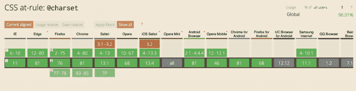

Source: [https://caniuse.com/#search=%40charset](https://caniuse.com/#search=%40charset)

## @导入

我们使用[这个规则](https://developer.mozilla.org/en-US/docs/Web/CSS/@import)将来自另一个源的 CSS 包含在当前的 CSS 文件中。因此，当解析 CSS 文件并遇到一个`@import`规则时，浏览器发出一个 HTTP 请求来获取外部样式表，并在声明`@import`规则的地方包含它的 CSS 属性。因此，需要注意的是，该规则必须在除`@charset`之外的所有其他规则之前声明。让我们探索一些关于 CSS 规则的事实。

### @import 不能在条件组 at-rules 中使用

因为这个规则是为了帮助开发人员包含来自其他来源的样式表而构建的，所以不可能将它包含在任何条件组 at 规则中，如`@media`、`@page`和`@document`:

```
// THIS IS WRONG

/* iPhone in Portrait and Landscape */
@media only screen
  @import 'custom.css';
}
```

然而，我们可以指定依赖于媒体的`@import`规则，以避免为不支持的媒体类型获取资源。这里有一个例子:

```
@import 'custom.css' screen and (orientation:landscape);

```

### 良好的浏览器支持

这个规则有很好的浏览器支持，几乎所有的传统浏览器都支持它。

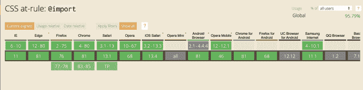

Source: [https://caniuse.com/#search=%40import](https://caniuse.com/#search=%40import)

### SASS 支持

由于 CSS 预处理程序如 [SASS](https://sass-lang.com/) 的流行，将 SASS 中使用的`@import`属性与原生 CSS 属性相混淆是不可避免的。虽然他们很相似，但也有不同之处。

SASS `@import`是对原生 CSS 的扩展，允许导入`.scss`和`.css`文件。在导入`.scss`文件的情况下，样式表中使用的所有混合、变量和函数将在`@import`定义行中可用。然而，两者之间最大的区别在于，在 CSS 中声明`@import`会产生多个 HTTP 请求来获取样式表并呈现页面，而 SASS 导入完全在编译时处理，这样性能更高。

这里有一个`@import`的例子:

@命名空间

## 这条规则旨在帮助[基于 XML 的名称空间](https://developer.mozilla.org/en-US/docs/Archive/Mozilla/XUL/Namespaces)防止重复样式相互干扰。即使有更复杂的概念，如 [SMACSS](http://smacss.com/) ，在我们的 CSS 中也可能有这个规则的潜在用例。

简而言之，`@namespace`规则有助于为混合不同 XML 名称空间样式的 CSS 应用范围。XML 名称空间的例子有 [HTML、SVG、MathML、XLink 等](https://www.w3.org/TR/2011/WD-html5-20110525/namespaces.html)。这样，来自不同名称空间的元素之间就不会发生样式冲突:

In a nutshell, the `@namespace` rule helps apply scoping for CSS that mix styles from different XML namespaces. Examples of XML namespaces are [HTML, SVG, MathML, XLink, etc](https://www.w3.org/TR/2011/WD-html5-20110525/namespaces.html). This way, there will be no styling collisions between elements from different namespaces:

在浏览器支持方面，`@namespace`覆盖了大部分浏览器的良好范围，除了 IE 6-8。

嵌套规则

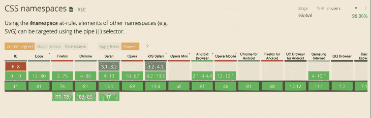

Source: [https://caniuse.com/#search=%40namespace](https://caniuse.com/#search=%40namespace)

## CSS at-rules 有一个子集，其中存储了语句的子集。他们通常遵循我们上面讨论的一般规则。

@文档

## 这是一个独特的规则，允许您为某个页面指定样式，而不会影响其他页面的样式。这种基于页面的样式定制有不同的形式:

您可以为特定的 URL 指定规则:

*   您可以为 URL 以其开头的页面指定规则:

```
@document url(https://example.com/),
```

*   您可以在域级别上为与其相关的所有页面指定规则:

```
@document  url-prefix(https://example.com/index),
```

*   您还可以为预定义的正则表达式模式指定规则，以便进行更多的控制:

```
@document domain(example.com),
```

*   记住`@document`规则目前对浏览器的支持是有限的。

```
@document regexp("https:.*"),
```

@font-face

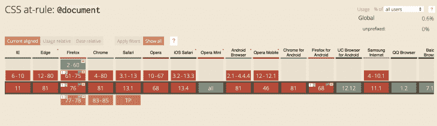

Source: [https://caniuse.com/#search=%40document](https://caniuse.com/#search=%40document)

## 曾经有一段时间，开发人员和设计人员只能使用有限的字体来设计网页。事实上，你可以看到最常见和最著名的 websafe CSS 字体的[列表，许多人依赖它来设计他们的页面，因为它们是预先安装在用户系统上的。](https://www.cssfontstack.com/)

然后`@font-face` CSS 规则被引入[作为在网络上使用自定义字体的途径之一](https://www.webfx.com/blog/web-design/font-face-guide/)，为网页带来更时尚的排版。此外，随着网络字体现代化的进展和[网络开放字体格式(WOFF2 沃夫 2)](https://en.wikipedia.org/wiki/Web_Open_Font_Format) 的使用，网络排版的未来看起来非常令人兴奋。

`@font-face`是一个嵌套的规则，使用它，你可以得到不同的属性来定义字体，但是其中两个主要的是`src`和`font-family`。

使用`font-family`，您可以在下载并可以使用时访问自定义字体的标识符名称。例如:

使用`src`，定义字体数据的来源。字体数据可以来自使用`url()`的外部来源或使用`local()`的本地来源。这样，如果该字体在站点目录或用户系统中本地不可用，它将从外部源下载。

```
@font-face {
  font-family: "CustomFont";
}

// Possible usage
p {
  font-family: 'CustomFont';
}
```

此外，您可以传递一个`format`参数，以提示所定义字体的格式:

现在，当谈到浏览器对`@font-face`的支持时，大多数浏览器都支持在 CSS 中定义自定义字体的功能，但不同的是可以在其中使用的字体类型。

```
@font-face {
  font-family: 'Helvetica';
  src:  url('Helvetica') format('woff'),
        local('Helvetica.woff') format('woff');
}
```

正如我们所知， [WOFF2](https://www.w3.org/TR/WOFF2/) 是下一代网络字体，具有更好的压缩性，并将成为未来的标准，但在此之前[我们也需要支持旧的浏览器](https://css-tricks.com/snippets/css/using-font-face/)。

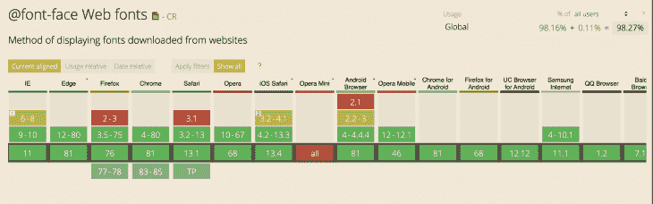

Source: [https://caniuse.com/#feat=fontface](https://caniuse.com/#feat=fontface)

为了支持旧的 IE 浏览器(6-9)，你可以使用下面的方法。`.eot`是微软开发的网络字体，只能通过 IE 浏览器使用:

对于支持`.woff`的现代浏览器，你可以使用下面的方法:

```
@font-face {
  font-family: 'CustomFont';
  src: url('customfont.eot'), /* IE9 */
       url('customfont.eot?#iefix') format('embedded-opentype'); /* IE6-IE8 */
}
```

对于更现代的支持`woff2`的浏览器，你可以使用下面的规则:
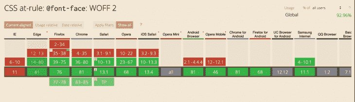

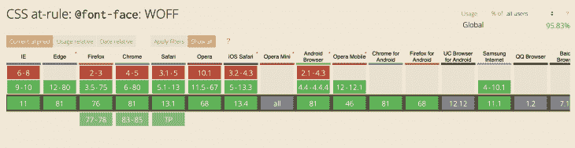

Source: [https://caniuse.com/#feat=mdn-css_at-rules_font-face_woff](https://caniuse.com/#feat=mdn-css_at-rules_font-face_woff)

```
@font-face {
  font-family: 'CustomFont';
  url('webfont.woff') format('woff');
}
```

一些 Android 或 iOS 设备依赖于`.ttf`，它被称为 [TrueType 字体](https://en.wikipedia.org/wiki/TrueType)。这就是`.woff`和`.woff2`的由来。这种字体的问题在于，它可以在没有字体创建者同意的情况下被轻易地复制。您可以将此字体用作上述某些设备的传统支持:

```
@font-face {
  font-family: 'CustomFont';
  url('webfont.woff2') format('woff2');
}
```

最后，一些传统的 iOS 浏览器支持`.svg`字体。因为 SVG 的尺寸更小，所以它是旧浏览器的理想用例，尤其是对于 iOS。但是新版本都不支持这种类型。因此，如果您需要支持旧版本的 iOS Safari 浏览器，请确保在您的`@font-face`规则中添加这一选项作为后备选项:

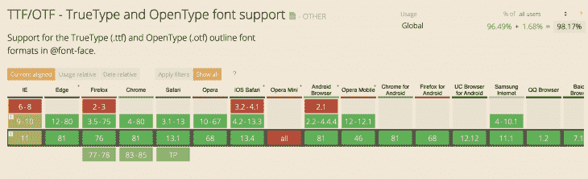

Source: [https://caniuse.com/#search=ttf](https://caniuse.com/#search=ttf)

```
@font-face {
  font-family: 'CustomFont';
  url('customfont.ttf')  format('truetype');
}
```

关键帧@

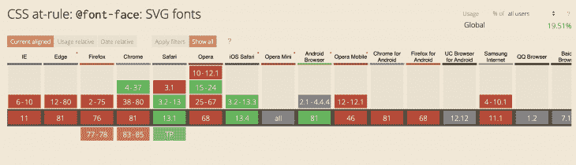

Source: [https://caniuse.com/#feat=mdn-css_at-rules_font-face_svg_fonts](https://caniuse.com/#feat=mdn-css_at-rules_font-face_svg_fonts)

```
@font-face {
  font-family: 'CustomFont';
  url('customfont.svg#svgFontName') format('svg');
}
```

## 这是定义 CSS 动画规则的一个非常方便的规则。因此，通过在`@keyframes`规则中应用 CSS 规则，我们定义了当附加到`@keyframe`规则的 CSS 动画名称应用到元素时需要应用的 CSS 规则。让我们看看这是如何实现的:

通过这种方法，我们定义了动画的生命周期和 CSS 规则，这些规则需要应用于生命周期的不同部分。这是一个简单的例子，仅用两步(0%和 100%)设置动画:

```
// CSS

@keyframes ANIMATION-NAME {
  0%   { opacity: 0; }
  100% { opacity: 1; }
}

// OR
@keyframes ANIMATION-NAME {
  from { opacity: 0; }
  to { opacity: 1; }
}
```

With this approach, we are defining the lifecycle of the animation and CSS rules that needs to be applied for different parts of this lifecycle. This is a simple example that sets the animation with just two steps (0% and 100%):

在用`@keyframe`定义 CSS 动画时，我们可以变得更有创造性。例如，这里我们定义了一个应用于圆形的弹跳动画:

We can get much more creative when it comes to defining CSS animations with `@keyframe`. For example, here we are defining a bouncing animation that is applied to the circle:

在现代浏览器中，浏览器对该规则的支持非常好。但是不支持老版本的 IE (6-9)、Firefox(v4 以下)、Opera(12 以下)。

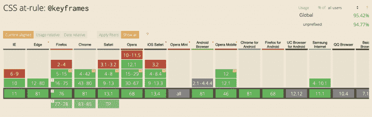

@媒体

## 这是最常见的 CSS at 规则之一，用于设置将应用于不同屏幕和窗口大小的元素的 CSS 样式。这主要用于响应式设计，因此开发人员可以设计不同窗口大小的元素，这些元素往往类似于常见的移动设备、平板电脑和桌面设备。让我们来看一个实际例子:

根据上面的 CSS 规则，当浏览器窗口大小为 600 像素或更小时，我们希望将 box 元素的颜色改为黄色。否则，我们将 600 像素以上的窗口颜色设置为绿色:

```
#box {
  background-color: green;
}

@media only screen and (max-width: 600px) {
  #box {
    background-color: yellow;
  }
}
```

@属性

这个[实验特性](https://drafts.css-houdini.org/css-properties-values-api-1/#at-property-rule)仍然没有在任何现代浏览器中实现，围绕其规范的对话[仍在进行](https://groups.google.com/a/chromium.org/forum/#!msg/blink-dev/3ygpsew53a0/T7acB6sRBQAJ)。然而，它背后的想法是有希望的，它似乎可以修复一些以前的 CSS 问题，如在悬停或聚焦时将渐变淡化为新的颜色。

## [@属性](https://css-tricks.com/property/)不过是`[CSS.registerProperty()](https://developer.mozilla.org/en-US/docs/Web/API/CSS/RegisterProperty)`的简化版。利用这些特性，您可以定义自定义 CSS 属性的语法。然后，您可以在其他选择器下使用这些属性。例如，使用@property 和`CSS.registerProperty()`定义一个名为`my-color`的自定义 CSS 属性，如下所示:

然后，您可以在其他选择器下使用该自定义属性:

检查后发现，按钮的渐变将从定义的自定义属性`--mycolor`变为红色的`'#FF0000'`。与使用伪元素处理此类场景的其他方式相比，这是一种更简单的处理方式。

```
@property --my-color {
  syntax: "<color>";
  inherits: false;
  initial-value: '#9400D3';
}

/
window.CSS.registerProperty({
  name: '--my-color',
  syntax: '<color>',
  inherits: false,
  initialValue: '#9400D3',
});
```

然而，在我们得到更广泛的浏览器对这一特性的支持之前，这是一个关于这一特性最终功能的各种猜测的问题。在此之前，请随意将它作为一个实验性特性进行测试，并关注它在浏览器中的广泛支持。

```
// CSS
.mycolor {
  --my-color: '#FFFFFF';
  background: linear-gradient(var(--my-color), black);
  transition: --my-color 1s;
}

..mycolor:hover {
  --my-color: '#FF0000';
}

// HTML
<button class="mycolor">@property</button>
```

结论

我们一起回顾了一些最实用的 CSS 规则。几乎任何需要 CSS 的项目都可以从这些规则中受益，但是要确保你完全理解它们背后的概念。此外，请确保检查浏览器对您要使用的规则的支持，这样，如果应用的规则在特定浏览器中不起作用，您就不会感到惊讶。

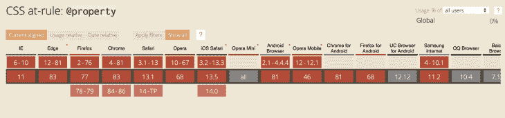

Source: [https://caniuse.com/#search=%40property](https://caniuse.com/#search=%40property)

## 对于 CSS 的新版本，一些规则仍在开发中，您可能需要在使用它们之前使用供应商前缀。点击查看当前 CSS at-rules [列表。](https://developer.mozilla.org/en-US/docs/Web/CSS/At-rule)

资源

[https://meiert.com/en/blog/css-at-rules/](https://meiert.com/en/blog/css-at-rules/)

## [https://css-tricks.com/the-at-rules-of-css/](https://css-tricks.com/the-at-rules-of-css/)

[https://css-tricks.com/snippets/css/using-font-face/](https://css-tricks.com/snippets/css/using-font-face/)

[https://developer.mozilla.org/en-US/docs/Web/CSS/At-rule](https://developer.mozilla.org/en-US/docs/Web/CSS/At-rule)

你的前端是否占用了用户的 CPU？

随着 web 前端变得越来越复杂，资源贪婪的特性对浏览器的要求越来越高。如果您对监控和跟踪生产环境中所有用户的客户端 CPU 使用情况、内存使用情况等感兴趣，

## .

LogRocket 就像是网络和移动应用的 DVR，记录你的网络应用或网站上发生的一切。您可以汇总和报告关键的前端性能指标，重放用户会话和应用程序状态，记录网络请求，并自动显示所有错误，而不是猜测问题发生的原因。

[try LogRocket](https://lp.logrocket.com/blg/css-signup)

现代化您调试 web 和移动应用的方式— [开始免费监控](https://lp.logrocket.com/blg/css-signup)。

[](https://lp.logrocket.com/blg/css-signup)[https://logrocket.com/signup/](https://lp.logrocket.com/blg/css-signup)

[LogRocket](https://lp.logrocket.com/blg/css-signup) is like a DVR for web and mobile apps, recording everything that happens in your web app or site. Instead of guessing why problems happen, you can aggregate and report on key frontend performance metrics, replay user sessions along with application state, log network requests, and automatically surface all errors.

Modernize how you debug web and mobile apps — [Start monitoring for free](https://lp.logrocket.com/blg/css-signup).