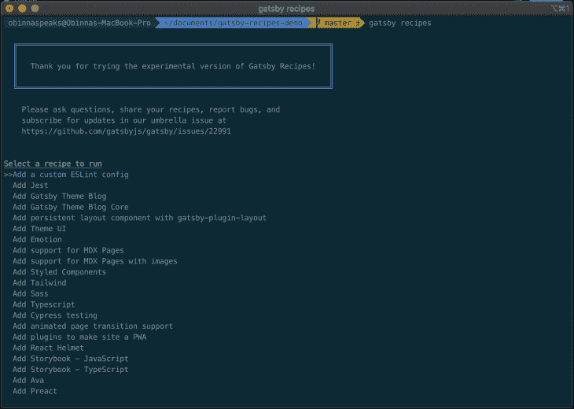
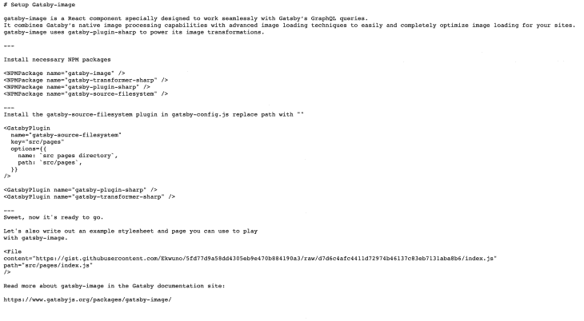

# 盖茨比食谱指南

> 原文：<https://blog.logrocket.com/a-guide-to-gatsby-recipes/>

在本文中，我们将看到 Gatsby recipes 的自动化版本，这是一个用于将站点构建任务自动化到一个命令中的工具。

## 什么是盖茨比食谱？

在官方的[盖茨比文档](https://www.gatsbyjs.org/docs/)中，食谱提供了一个介于观看[的完整教程](https://www.gatsbyjs.org/tutorial/)和浏览[文档](https://www.gatsbyjs.org/docs/)之间的媒介。

菜谱是为开发人员创建的，他们可以做一些事情，比如给你的 Gatsby 项目添加一个特定的包或插件，而不需要为了解决一个任务而做一个完整的教程。在这个过程自动化之前，[文档](https://www.gatsbyjs.org/docs/recipes/)提供了一系列关于处理快速任务的有价值的信息。

## 自动化盖茨比食谱

随着盖茨比最后几项进步，如[增量构建](https://blog.logrocket.com/gatsby-incremental-builds/)——可在[盖茨比云](https://www.gatsbyjs.com/docs/)上获得，盖茨比发布了用 [MDX](https://mdxjs.com/getting-started) 和 [React](https://reactjs.org/) 构建的食谱的[金丝雀版本](https://martinfowler.com/bliki/CanaryRelease.html#:~:text=Canary%20release%20is%20a%20technique,making%20it%20available%20to%20everybody)。MDX 组件将步骤列表转换成文件，当由解释器运行时，这些文件执行常见的操作，如安装 NPM 软件包、安装插件和创建页面。任何东西都可以是配方，因为流程被设计为可扩展的，这允许配方自动化更多的事情。

使用 MDX 编写菜谱的选项允许使用更容易理解的语法。这有助于将文档中的[配方列表中的配方移植到单个命令以及将来的任何教程中。](https://www.gatsbyjs.org/docs/recipes/)

## 先决条件

使用`gatsby recipes` Gatsby 需要一些设置:

*   通过在终端中运行`npm install -g [[email protected]](/cdn-cgi/l/email-protection)`将您的全局 gatsby-cli 包升级到最新版本。要确认这是否有效，请在您的终端中运行`gatsby --help`。输出应该显示 recipes 命令。

盖茨比食谱最初与 11 个现成的食谱一起运送。其中包括添加[打字稿](https://www.typescriptlang.org/)、[主题界面](https://theme-ui.com/)、[萨斯](https://sass-lang.com/)、[柏树](https://www.cypress.io/)的方法，以及设置有用的技术，如动画页面过渡和持久布局组件。

由于鼓励从最初的发布添加更多的食谱到列表中，可用的食谱列表增加了。



让我们来看看如何创建自己的食谱。

## 创造你自己的食谱

recipes 的想法是允许 Gatsby 用户自己自动化流程，为此，存在一些 MDX 组件，因此这是可能的，并且可以在 GitHub gist 中或使用本地 MDX 文件来完成。

Gatsby 提供了一些用于创建定制食谱的组件。其中一些组件接受一些道具，你可以在 GitHub 上看到这一期的这个[组件列表](https://github.com/gatsbyjs/gatsby/blob/master/packages/gatsby-recipes/README.md#recipe-api)。

在本文中，我们将使用其中的三个组件，`<GatsbyPlugin/>`、`<NPMPackage />`和`<File />`:

*   Gatsby-plugin 组件(`<GatsbyPlugin/>`)用于在站点的`gatsby-config.js`中安装一个 Gatsby 插件。它接受一个*名称*，这是插件的名称，一个选项列表，这是指定进程的插件声明，以及一个用于区分多个插件实例的关键属性

> 注意:选项中尚不支持 JavaScript 代码。目前，它只是字符串，而这个特性还在试验阶段。

*   NPM-软件包组件(`<NPMPackage/>`)用于安装命令列表中的软件包。它需要一个名为的道具，这是要安装的软件包的名称
*   文件组件(`<File/>`)用于添加示例文件，以显示已安装的包和插件的实现。它需要一个指向文件目录的内容属性

## 食谱的一个例子

有了从上一节获得的信息，你就可以开始制作自己的食谱了。在本例中，我们将学习如何创建一个配方来将`gatsby-image`添加到项目中。

下图显示了 GitHub gist 上的最终产品:



如果你看一下将 Gatsby 映像添加到项目的 Gatsby [文档，你会注意到这些步骤要求你安装以下 npm 包:gatsby-image、](https://www.gatsbyjs.org/packages/gatsby-image/) [gatsby-transformer-sharp](https://www.gatsbyjs.org/packages/gatsby-transformer-sharp/) 和 [gatsby-plugin-sharp](https://www.gatsbyjs.org/packages/gatsby-plugin-sharp/) 。

你可能需要包括 [gatsby-transformer-sharp](https://www.gatsbyjs.org/packages/gatsby-transformer-sharp/) 和 [gatsby-plugin-sharp](https://www.gatsbyjs.org/packages/gatsby-plugin-sharp/) ，这取决于你使用的 gatsby 启动器。

安装完这些包之后，您还需要确保它们已经安装并包含在您的 gatsby-config 中。

通过执行以下操作，可以自动完成配方中的前两个过程:

```
---

Install necessary NPM packages

<NPMPackage name="gatsby-image" />
<NPMPackage name="gatsby-transformer-sharp" />
<NPMPackage name="gatsby-plugin-sharp" />
<NPMPackage name="gatsby-source-filesystem" />

---
```

用三个破折号来分隔食谱的各个步骤。

您将使用`<GatsbyPlugin />`组件将插件添加到`gatsby-config.js`文件中。鉴于`gatsby-source-filesystem`接受钥匙和选项作为道具，我们将这样包括它:

```
Install the gatsby-source-filesystem plugin in gatsby-config.js replace path with ${__dirname}/src/data/:<GatsbyPlugin
  name="gatsby-source-filesystem"
  key="src/pages"
  options={{
    name: `src pages directory`,
    path: `src/images`,
  }}
/>

<GatsbyPlugin name="gatsby-plugin-sharp" />
<GatsbyPlugin name="gatsby-transformer-sharp" />
```

`<GatsbyPlugin>`还不支持用 JavaScript 添加选项，所以你可以在步骤中留下注释。

建议文档中的下一步是添加一个示例文件。您可以通过使用`<File/>`组件来做到这一点:

```
<File
content="https://gist.githubusercontent.com/Ekwuno/5fd77d9a58dd4305eb9e470b884190a3/raw/d7d6c4afc4411d72974b46137c83eb7131aba8b6/index.js"
path="src/pages/index.js"
/>
```

要将示例文件链接到 GitHub gist 中的主文件，我们可以通过使用原始文件的 URL 并在`content` props 中进行链接来实现。

我们可以把这个文件叫做`index.js`:

```
import React from "react"
import { graphql } from "gatsby"
import Img from "gatsby-image"

export default ({ data }) => (
  <div>
    <h1>Hello gatsby-image</h1>
    
  </div>
)

export const query = graphql`
  query {
    file(relativePath: { eq: "blog/avatars/Image.jpeg" }) {
      childImageSharp {
        # Specify the image processing specifications right in the query.
        # Makes it trivial to update as your page's design changes.
        fixed(width: 125, height: 125) {
          ...GatsbyImageSharpFixed
        }
      }
    }
  }
`
```

这里有一个链接，链接到 gist 的最终产品[。](https://gist.github.com/Ekwuno/5fd77d9a58dd4305eb9e470b884190a3)

## 结论

在这篇博文中，你已经看到了什么是盖茨比食谱，以及你如何创造自己的食谱。自动化过程的重要性来自于让我们作为开发人员的生活更容易的需要。随着这项功能的展开(目前还处于试验阶段),我确信创建定制食谱的过程会变得更加容易。与盖茨比共筑的可能性是无穷无尽的。快乐编码😄。

## 使用 [LogRocket](https://lp.logrocket.com/blg/signup) 消除传统错误报告的干扰

[](https://lp.logrocket.com/blg/signup)

[LogRocket](https://lp.logrocket.com/blg/signup) 是一个数字体验分析解决方案，它可以保护您免受数百个假阳性错误警报的影响，只针对几个真正重要的项目。LogRocket 会告诉您应用程序中实际影响用户的最具影响力的 bug 和 UX 问题。

然后，使用具有深层技术遥测的会话重放来确切地查看用户看到了什么以及是什么导致了问题，就像你在他们身后看一样。

LogRocket 自动聚合客户端错误、JS 异常、前端性能指标和用户交互。然后 LogRocket 使用机器学习来告诉你哪些问题正在影响大多数用户，并提供你需要修复它的上下文。

关注重要的 bug—[今天就试试 LogRocket】。](https://lp.logrocket.com/blg/signup-issue-free)