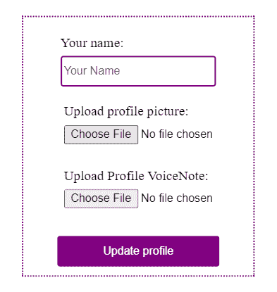
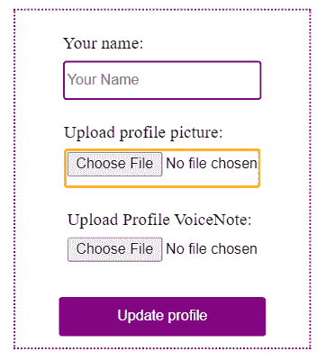
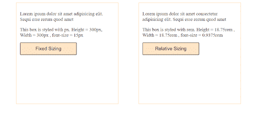
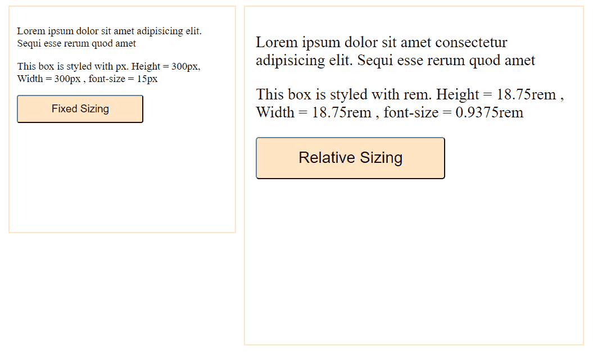

# 用 CSS 提高网页可访问性的指南

> 原文：<https://blog.logrocket.com/a-guide-to-improving-web-accessibility-with-css/>

网页可访问性意味着建立可供所有人使用的网络体验。正如网络本身的发展一样，其用户的多样性也在增长。然而，大多数资源只关注屏幕阅读器和键盘使用的可访问性，这可以通过 HTML 的适当[结构来改善。有不同听觉、认知、神经、身体或语言限制的用户怎么办？](https://www.codewithlinda.com/blog/writing-accessible-html/)

为了真正创造无障碍的网络体验，促进可用性和包容性的概念，如响应式设计、跨浏览器兼容性、网络性能优化和渐进增强，都应该发挥作用。好消息是，只要我们愿意对我们编写和发布它的方式做一些小小的改变，CSS 就可以帮助我们做到这一切。

在本文中，我总结了一些可能影响某些用户体验 web 的独特条件，以及相应的 CSS 技术，它们将帮助您构建更好的 web 体验。

## 键盘导航

一些用户依靠键盘来浏览网页。应该有一个指示器，像鼠标指针一样帮助确定用户在网页上的确切位置。那么你能用 CSS 做什么呢？

### 不要禁用焦点样式

焦点样式帮助键盘用户意识到网页上的交互。每个浏览器都有其默认的元素轮廓焦点样式，这可能与您的设计不一致。想要禁用轮廓是可以的，但是无论你做什么，不要在没有提供可选焦点样式的情况下使用`outline:none`:

```
*:focus{
 outline: none;
 border: 3px dotted orange;
}
```



No focus style. Impossible for users to know what they’re interacting with.



Focus style enabled. Users know exactly what they’re interacting with.

如果你想深入了解，这里有更多关于[应用焦点样式](https://blog.logrocket.com/why-you-should-use-focus-styles-193d58672c5c/)的最佳实践。

## 不同的设备功能和互联网速度

不是每个人都会使用兼容 5G 的最新苹果 20+手机。有些人可能使用 3G 手机，或者在一个互联网计划相对昂贵的国家。一些用户可能没有太多的带宽用于一个繁重的数据消耗应用程序。

对于这类用户来说，每一个微小的性能优化都很重要。下面是你可以用 CSS 做的事情。

### 异步加载 CSS

CSS 是一种呈现阻塞资源。这意味着浏览器可能会延迟加载内容，直到样式表被加载，这可能会增加[第一次绘制内容的时间](https://web.dev/fcp/)。为了防止这种情况，使用`preload`和`preconnect` [资源提示](https://blog.logrocket.com/using-resource-hints-to-optimize-performance/)来加载样式表。

Preload 强制浏览器在不阻止呈现的情况下加载资源。它是项目中托管的资源的理想选择:

```
<link rel="preload" as=”style” href="mystyle.css”>
```

另一方面，`preconnect`通过在最初请求资源之前很久就保护与外部资源服务器的连接，减少了资源加载时间。它非常适合外部托管的资源，如 Google 字体:

```
<link rel="preconnect" href="https://fonts.gstatic.com/" crossorigin>
<link href="https://fonts.googleapis.com/css?family=Muli:400" rel="stylesheet">
```

### 不要让用户下载他们不需要的样式

不必要的样式会增加样式表的文件大小。反过来，这将增加总页面大小，从而增加总页面加载时间。记住，每多等待一秒钟，用户就有机会放弃一个网页。

根据设备类型/大小或其他条件分离样式使用媒体查询来仅加载所需的样式:

```
<link rel="preload"as=”style” type="text/css" media="only screen and (max-device-width: 480px)" href="small-device.css" />
<link rel="preload"as=”style” type="text/css" media="only screen and (min-device-width: 1000px)" href="laptop-device.css" />

```

考虑到移动设备上的延迟更高，这种方法还提供了完全重构网站流程的灵活性，并为移动设备提供了更简约的内容优先设计。

## 使用不同的浏览器

不是你所有的用户都会用最新的 Chrome 100.2 测试版。不同的浏览器行为不同，对不同功能的支持程度也不同。

根据本报告的报道[，超过 20%的尼日利亚人将 Opera Mini 浏览器作为他们的默认浏览器。由于 Opera Mini 几乎不支持大多数 web 特性，如果目标用户属于这一人群，就有必要从渐进增强的角度来处理 web 开发。](https://gs.statcounter.com/browser-market-share/all/nigeria)

主要的焦点应该是用 HTML 构建适当的内容。从非常基本的样式和单列布局开始，然后为装备更好的浏览器开发更复杂的布局。

有一件事需要测试，那就是如果去掉了所有的风格，网页在内容上还能看得见吗？

目标是确保无论浏览器版本如何，每个用户都能获得最佳体验。下面是 CSS 可以提供帮助的方式。

### 总是使用浏览器前缀

浏览器前缀用于使最新的 CSS 特性在还不完全支持它们的浏览器中工作。这确保了样式规则在不同的浏览器中仍能正常工作:

```
.example {
  -webkit-transform: rotate(30deg); /* Ch <36, Saf 5.1+, iOS < 9.2, An =<4.4.4 */
      -ms-transform: rotate(30deg); /* IE 9 */
          transform: rotate(30deg); /* IE 10, Fx 16+, Op 12.1+ */
}
```

跨项目手动完成这项工作压力很大。幸运的是， [Autoprefixer](https://www.npmjs.com/package/autoprefixer) 可以自动完成这个过程。Autoprefixer 是一个 CSS 后处理器，在与 caniuse.com 交叉检查后，根据需要添加或删除供应商前缀。你可以使用不同的开发设置，如图所示[这里](https://github.com/postcss/autoprefixer#usage)。

对于我的简单项目，我通过 npm 用`npm i autoprefixer`安装它，然后将下面的代码添加到`package.json`:

```
"scripts": {
        "prefix-css": "postcss --use autoprefixer -b \"last 5 versions\" style.css -o style.prefix.css",
     },

```

上面的脚本使用`postcss cli`在`style.css`上运行 Autoprefixer，然后将前缀样式输出到`style.prefix.css`。

### 提供后备样式

CSS 在一定程度上是防错的。由于 CSS 层叠的工作方式，如果浏览器遇到它不理解的样式规则，它会简单地忽略它或使用该属性的最后一个可用值。根据您需要支持的浏览器，只要您编写的样式规则没有得到跨浏览器的广泛支持，就可以充分利用这一特性，并始终提供后备样式。这样，浏览器不支持特定样式值的用户就不会被遗漏。Caniuse.com[是验证浏览器支持的最佳地点。](https://caniuse.com/)

例如，我们想使用`rgba`来增加一点不透明度，但是它在 ie 浏览器上不被支持。作为后备，我们将简单地提供一个受支持的十六进制值:

```
background-color: #000000;/* Fallback*/
background-color: rgba(0, 0, 0, 0.5);/* RGBa with 0.5 opacity */
```

### 使用要素查询

浏览器使用[特征](https://hacks.mozilla.org/2016/08/using-feature-queries-in-css/)查询进行 CSS 特征检测，仅当指定条件为真时才应用样式块——就像媒体查询一样。

如果主流浏览器不完全支持全新的 CSS 特性，但你仍然想使用它，特性查询是你的好朋友。

不过，在进行特性查询之前，先问问自己是否真的需要使用这个新特性，或者旧的方法是否能完美地工作？

例如，对于两列或三列的简单网页布局，使用网格是不必要的。Float 和 flexbox 可以很好地完成这项工作，并且所有浏览器都支持它们。但是，如果您想尝试网格，首先使用 float 或 flexbox 布局页面，然后使用特性查询为支持网格的浏览器提供更复杂的布局:

```
<div>
     <div class='box'></div>
     <div class='box'></div>
     <div class='box'></div>
 </div> 

 /**/
 box {
     float: left;
     width: 24.25%;
 }

 article:not(:last-child) {
     margin-right: 1%;
 }

 section:after {
     clear: both;
     content: "";
     display: table;
 }

 @supports(display: grid) {
    /*All grid styles go here*/

 }
```

特征检测也可以用像 [Modernizr](https://modernizr.com/) 和 [Feature.js](http://featurejs.com/) 这样的库来完成。

## 个人偏好

适应性就是可及性。由于某些条件，用户可能更喜欢较大的文本、较小的文本、无动画、黑暗模式等。使用网络时。

作为开发人员，您的工作是构建适应性强的网页，并尽可能让用户以他们想要的方式体验网络。

* * *

### 更多来自 LogRocket 的精彩文章:

* * *

下面是你可以用 CSS 做的事情。

### 使用相对单位进行调整

通常，用户可能会因为视力低下而需要增加网页内容的大小，或者因为需要一次查看更多内容而需要减小网页内容的大小。在主流浏览器中，有两种方法可以做到这一点，使用缩放选项或更改默认字体大小。

理想情况下，如果调整了缩放百分比或默认字体大小这两个设置，网页上的所有内容都应该按照新的大小成比例缩放。不幸的是，如果您使用像`px`这样的固定单位来调整大小，它们就不会。

对于大多数浏览器，默认字体大小设置为`16px`，可通过浏览器设置进行调整:

*   **Chrome:** 设置>外观>字体大小
*   **Firefox:** 选项>通用>语言和外观>字体和颜色>大小
*   **边缘:**设置和更多>设置>外观>字体>字号
*   **浏览器 11:** Alt >视图>文本大小

web 开发人员之间有一个与 web 设计一样古老的争论，即使用缩放选项可以处理固定单位和相对单位的缩放，因为没有用户会真正经历手动更改浏览器默认字体大小的压力，所以这条规则毫无意义。我希望这是真的。事实上，现代浏览器还没有从它们的设置中删除这个功能，这意味着它是相关的，在[的这篇文章](https://medium.com/@vamptvo/pixels-vs-ems-users-do-change-font-size-5cfb20831773)中，埃文·明托表明，在使用他公司的产品时，改变默认字体大小的用户比例是 3.08%。

让我们举例说明当浏览器的默认字体大小被调整时，`px`相对于相对大小会发生什么。我有两个盒子，一个是带`px`的，另一个是带`rem`的。



Webpage with zoom = 100% and default font-size = medium(16px) on Chrome



Webpage with zoom = 100% and font-size = very large(24px) on Chrome

注意到默认字体大小调整后`px`大小的框没有缩放吗？这对可访问性不利。

就我个人而言，我只在媒体询问时使用`px`。然后，我用`vw`和`vh`表示应该根据设备大小缩放的布局，`rem`表示固定的布局和字体大小，`%`表示应该与其父布局成比例缩放的子布局——所有这些都是相对单位。

CSS `rem`单元——代表根临时单元——提供了一种将大小指定为`html`元素当前字体大小的一部分的方法。除非明确定义，`html`元素的字体大小等于浏览器设置的字体大小。因此，对于默认的字体大小`16px`,`html`元素的字体大小是`16px`，这意味着 1 rem = 16px。如果浏览器的字体大小设置为 24px，`html`字体大小将为`24px`，这将使 1rem = 24px。

为了便于使用`rem`，这里有一个我已经使用了一段时间的提示:

```
html{
  font-size: 62.5%; /*Default font-size: 16px. 62.5% of 16px = 10px*/
}
p{
  font-size: 1.5rem; /*15px*/
}

```

我将`html`上的字体大小设置为浏览器字体大小的 62.5%。这意味着对于默认字体大小`16px` , `html`的字体大小为`10px`，因此 1.5 雷姆等于 15px。我这样做只是为了更容易计算以 10 为基数的`rems`。如果用户将浏览器字体大小调整为 24px，`html`字体大小变为 15px，段落元素变为 22.5px，仍然可缩放。

### 使用 CSS 用户首选项媒体功能

许多操作系统和浏览器都有辅助功能设置，用于指定主题、文本到语音转换、字幕等首选项。CSS level 5 媒体查询引入了用户偏好媒体功能，允许开发人员根据用户在设备或浏览器设置上的偏好，创建更易于访问的 web 体验。

有六种媒体偏好功能，但目前只有两种得到所有主流浏览器的支持。对于不支持它们的浏览器，CSS 只是忽略它。所以，你可以从今天开始使用它们。

#### 首选颜色方案

该媒体查询用于适应用户设备/浏览器设置上的颜色主题偏好(亮或暗)。黑暗模式提高了弱视用户的无障碍性，因为它对眼睛更容易:

```
body{background-color: white; color:black}

@media (prefers-color-scheme: dark){
          body{background-color: black; color:white}
 }
```

#### 偏好-减少运动

过多的动画和视差会引发用户的前庭失调，可能会导致短暂的恶心、头晕或头痛。这就是为什么在许多设备中，有一个设置，使减少运动。`prefers-reduced-motion`媒体功能应用于检测此类设置是否启用，并相应地禁止过度移动:

```
/*Default for no preference*/
element{
   animation: 3s alternate infinite slide-in;
   transition: width 2s; 
}
/*for reduced preference. Disable decorative animations,
parallax scrolling, background videos e.t.c */

@media (prefers-reduced-motion: reduce){
  element{
     animation: unset !important;
     transition: none !important;
  }
}

```

不过有一个问题，最佳实践要求用户应该有能力控制尽可能多的网络体验。用户可能在设备设置中启用了深色主题偏好设置，但由于环境变化(如在黑暗的地方)，可能需要在浅色模式下查看网页。永远记住提供按钮来切换这样的偏好。如果操作系统和浏览器让用户自己做选择，你为什么不呢？

## 进一步的考虑

一些用户在理解和记忆内容方面有困难，并且很容易被不一致或非传统的网页布局所迷惑。应该不惜一切代价避免混乱和模糊。以下是一些有帮助的时尚小贴士:

*   保持至少 1.5 的行高
*   没有`text-align: justify`。对齐文本中不均匀的空白会使阅读变得困难
*   保持段落和分组文本简短，最多五行
*   将相关内容紧密组合在一起
*   尽可能把事情分解成清单

### 你真的需要 CSS 吗？

一句流行的谚语说，“如果你有一把锤子，那么一切看起来都像钉子”。前端开发人员有时也会遇到同样的情况。

我偶尔会看到很多只使用 CSS 的解决方案。虽然这些对于实验和学习来说很棒，但是对于可访问性来说并不是最理想的。CSS 是用来展示的。为手头的工作使用合适的工具。

一个常见的例子是使用`::before`和`:: after`伪元素向 HTML 添加文本内容:

```
input[type=password]::after{
  content: “Enter your password”
}
```

这样的实现是疯狂的。伪元素应该只用于装饰性的样式，而不是插入文本内容来增加网页的意义。这是因为屏幕阅读器可能无法正确解释用 CSS 插入的内容。

## 结论

在这篇文章中，我总结了一些技巧和微小的变化，作为开发人员，你可以开始将它们应用到你编写 CSS 的方式中，以创建更好的 web 体验。

虽然这不是一个详尽的列表，但它是一个很好的起点。请记住，创建可访问的 web 体验不是“一蹴而就”的任务。这是一个持续渐进的过程，从一开始就将可访问性纳入开发工作流，然后在测试和发现错误的过程中进行更改。

## 你的前端是否占用了用户的 CPU？

随着 web 前端变得越来越复杂，资源贪婪的特性对浏览器的要求越来越高。如果您对监控和跟踪生产环境中所有用户的客户端 CPU 使用、内存使用等感兴趣，

[try LogRocket](https://lp.logrocket.com/blg/css-signup)

.

[](https://lp.logrocket.com/blg/css-signup)[https://logrocket.com/signup/](https://lp.logrocket.com/blg/css-signup)

LogRocket 就像是网络和移动应用的 DVR，记录你的网络应用或网站上发生的一切。您可以汇总和报告关键的前端性能指标，重放用户会话和应用程序状态，记录网络请求，并自动显示所有错误，而不是猜测问题发生的原因。

现代化您调试 web 和移动应用的方式— [开始免费监控](https://lp.logrocket.com/blg/css-signup)。