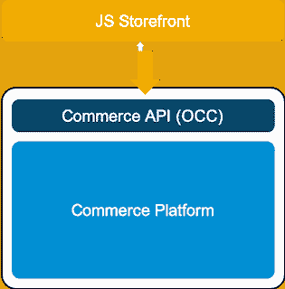

# SAP Spartacus 指南

> 原文：<https://blog.logrocket.com/a-guide-to-sap-spartacus/>

## 什么是闷棍斯巴达克斯？

SAP Spartacus 简称为 [Spartacus](https://github.com/SAP/spartacus) ，是一个面向在线店面应用的开源平台。更具体地说，Spartacus 是一个面向 B2C 和 B2B 电子商务平台的开源 JavaScript 应用程序，位于 SAP 商务云之上。Spartacus 库为 storefront 应用程序提供了一个核心框架，包括:

*   主页
*   产品详情
*   产品类别
*   搜索功能
*   将商品添加到购物车
*   购物车页面
*   检验
*   订单历史

Spartacus 的灵活性允许客户通过传统的计算机和移动环境购物。斯巴达克斯是免费的、开源的，每隔几周就会通过 GitHub 库进行更新。

在本文中，我们将介绍斯巴达克斯的一些特性，如何使用它，以及一些你应该考虑的技巧和诀窍。

## 先决条件

利用 Spartacus 需要掌握 JavaScript 和 T2 以及 SAP 商业云和商业应用编程接口的工作知识。

## 斯巴达克斯的显著特征

### 去耦架构

Spartacus 是一种纯粹的前端技术，独立于后端商务平台，因此与网站的架构分离。SAP 商务云保持不变，并通过 REST APIs 运行。

通过利用去耦架构，使用 Spartacus 的前端开发人员不需要将他们的发布时间表与后端平台发布同步。相反，每个团队可以独立地工作在自己的开发周期上，并允许 Spartacus 通过 REST 服务处理通信。



The Spartacus storefront sits independently on the commerce platform. | Source: [CX Works](https://www.sap.com/cxworks/article/480453417/five_reasons_to_move_to_a_project_spartacus_javascript_storefront)

### 可扩展和升级

因为斯巴达克斯库被导入到现有的网站中，斯巴达克斯天生具有可升级性和可扩展性。次要版本和补丁不应影响兼容性。斯巴达克斯的版本遵循标准的版本约定。

用户可以添加自己定制的功能。然而，Spartacus 的设计是可扩展的，因此用户可以继续升级现有的网站，以利用最新的组件集。

### 开放源码

Spartacus 是一个开源平台，最初由 SAP 开发人员编写。借助开源平台，Spartacus 为 SAP 商务云和非官方 SAP 合作伙伴提供了更广泛的访问途径。由于开源架构，开发人员可以快速访问代码，以探索新的组件，测试新的功能，并修改店面。

斯巴达克斯是用[敏捷模型](https://blog.logrocket.com/four-agile-manifesto-values-explained/)开发的，这为大约每两周一次的快速变更和快速发布提供了途径。然而，你可以选择，如果你想让你的设置自动包含新的版本，或者如果你想保持一个特定版本的斯巴达克斯。

### 进步和响应

当涉及到 Web 应用程序时，Spartacus 代码开发人员努力完全符合 Progressive Web Application (PWA)的能力、可靠性和可安装性清单。这个目标的一个重要因素是整合响应式设计并支持大量断点——用户也可以配置断点。支持的断点包括:

*   移动的
*   药片
*   桌面
*   宽桌面

Spartacus 还可以让您的电子商务网站更像传统的 iOS/Android 移动应用程序一样运行。它包括移动就绪功能以及稳定的性能和可靠性。

### 专注于内容管理系统

Spartacus 非常灵活，可以与各种内容管理系统(CMS)配合使用。在内容管理器使用 SAP Commerce CMS 的情况下，店面内容通过 SAP Commerce Cloud CMS 工具进行编辑。然而，Spartacus 也可以通过第三方 CMS 应用程序访问内容。

## 如何利用斯巴达克斯

### 利用斯巴达克斯

典型的实现包括设置一个 JavaScript 或 Angular web 应用程序，然后导入 Spartacus 库。即使没有修改，斯巴达克斯店面开箱即用。然而，Spartacus 非常灵活，因此开发人员可以根据需要定制、升级和扩展功能和品牌。

### 要求

*   **前端**:斯巴达克斯是在角平台上写的，也用了 node.js 和 yarn。斯巴达克斯的每个版本(1.x、2.x 或 3.x)都需要 Angular、node.js 和 yarn 的[不同版本](https://github.com/SAP/spartacus#requirements)。
*   **后端**:要使用 Spartacus，所用的 SAP 商务云必须至少是 1905 版本，但最好是 2005 版本。

## 斯巴达克斯演练指南

### 创建商店

在这个演练中，我们将创建一个名为`mynewstore`的新 Angular 应用程序。

首先，打开命令提示符或终端窗口。然后，使用 Angular CLI 和以下命令创建一个新的角度应用程序:

```
ng new mynewstore --style=scss

```

您将被询问角度路由—输入`n`表示“否”。`mynewstore`文件夹应用程序和相关文件夹被创建。

现在，使用以下命令访问新创建的`mynewstore`文件夹:

```
cd mynewstore

```

### 斯巴达克斯项目设置

使用[角度示意图](https://angular.io/guide/schematics)是快速设置应用的最简单方法。

首先，让我们使用 schematics 设置项目。此 schematics 命令安装最新版本的斯巴达克斯:

```
ng add @spartacus/schematics
```

如果你想安装最新的“下一个”或者发布候选，上面的命令可以在末尾包含`@next`或者`@rc`。

要验证安装的 Spartacus 库版本，打开`package.json`，搜索`@spartacus`。

现在，使用以下命令安装 Spartacus 应用程序所需的依赖项:

```
yarn install
```

之后，我们将检查 app.module.ts 的基本 URL 和其他设置。打开`src\app\app.module.ts`,看看您是否想要进行任何设置更改。
要检查的几个特征:

*   **`baseUrl`** :设置您的 SAP 商务云服务器
*   **`prefix`** :设置通话中的 OCC 前缀；将`/rest/v2/`更改为`/occ/v2/`(如果在 2005 版本上)
*   **`features.level`** :设置兼容级别
*   **`context`** :设置语言、货币、基本站点等站点常量

要启动您的应用程序，请输入命令:

```
yarn start
```

此时，您的应用程序已经编译并启动。要查看`mynewstore`店面——如果所有东西都安装在本地——请浏览到`[http://localhost:4200](http://localhost:4200)`。

## 斯巴达克斯提示和技巧

### 不要抄袭斯巴达克斯的源代码

尽管复制 Spartacus 源代码并为您的站点进行调整可能很诱人，但这破坏了可升级性。相反，参考斯巴达克斯库，并以其他方式改变网站行为。

### 检查斯巴达克斯的特征

在开发你自己的店面功能之前，检查一下它是否已经包含在 Spartacus 中，或者是否已经在设计中。

### 选择您的功能

开发人员可以根据电子商务需求选择利用哪些 Spartacus 特性。例如，您可能希望允许快速结账，但不利用客人结账。

## 结论

斯巴达克斯为在线商店提供轻量级的前端功能。我们讲述了利用 Spartacus 的一些基本功能和优点，学习了如何创建新的 Angular 应用程序和添加 Spartacus，还讲述了一些技巧和诀窍。

* * *

### 更多来自 LogRocket 的精彩文章:

* * *

## [LogRocket](https://lp.logrocket.com/blg/ecommerce-signup) :看看用户为什么不完成你的电子商务流程中的一个步骤的技术和 UX 原因。

[](https://lp.logrocket.com/blg/ecommerce-signup)

LogRocket 就像是一个网络和移动应用程序和网站的 DVR，记录你的电子商务应用程序上发生的一切。LogRocket 没有猜测用户不转化的原因，而是主动揭示了阻止你转化的根本原因，比如 JavaScript 错误或死点击。LogRocket 还可以监控应用的性能，报告客户端 CPU 负载、客户端内存使用等指标。

开始主动监控您的电子商务应用程序— [免费试用](https://lp.logrocket.com/blg/ecommerce-signup)。