# Vue.js - LogRocket 博客中的用户验收测试指南

> 原文：<https://blog.logrocket.com/a-guide-to-user-acceptance-testing-in-vue-js/>

## 什么是验收测试？

验收测试，也称为用户验收测试(UAT)，是一种测试过程或技术，用于确定软件或应用程序是否符合所有者要求的规格。此过程的目的是评估应用程序是否符合业务规范，并以用户的角度来看待应用程序。

### 系统测试类型和用户验收测试的区别

**单元测试**

单元测试包括将代码分解成易于测试的小部分。这些小零件被称为单元。单元的范围从简单的函数到复杂的算法(有时是 Vue 中的组件)。一个例子是在你的代码中测试一个简单的`multiplication function`。测试结果返回预期的输出是至关重要的，在我们的例子中，输出是我们输入的数字的乘积。这通常是对应用程序进行的第一次测试。

**集成测试**

集成测试的目的是确保集成其他组件(子组件)的组件(父组件)正常工作。集成测试用于检查组件之间的数据流，以确保应用程序中的所有组件按照要求进行协作。该测试通常在单元测试完成后进行。

**端到端(E2E)测试**

E2E 测试是一种应用程序测试，在这种测试中，您不必将应用程序分解成单元。相反，您要将应用程序作为一个整体来测试。这是为了确保您在系统的各个组件之间维护数据完整性，并且应用程序的流程从头到尾都按照要求运行。这个测试主要是在集成测试之后进行的。

**验收测试**

验收测试确保应用程序满足客户的要求。在这个测试中，仅 las 与端到端(E2E)测试，整个应用程序都被测试。然而，与 E2E 测试方法不同，这种测试只是为了证明系统符合客户的要求。它不关注表面错误、拼写错误或系统测试。该测试通常是对应用程序进行的最后一次测试。

### 用户验收测试的类型

**运行测试**

操作测试是一种验收测试，由开发人员执行，以确定应用程序的功能。这种类型的测试也称为生产验收测试。它用于确保应用程序已经准备好交付给用户。

**符合性测试**

合规性测试主要是在应用程序上运行，以查看它们是否符合监管法律。这种测试的目的是确保应用程序遵守管辖法律。

**合同测试**

合同测试在产品所有者和开发团队之间进行。这种类型的测试旨在确保合同中列出的所有规范都融入到应用程序中。该测试检查契约中列出的功能，并观察应用程序如何能够完成其规范。

**阿尔法&贝塔测试**

Alpha 测试是在开发环境中对应用程序执行的简单测试，主要在员工中进行。应用程序的整体功能在 alpha 测试中进行了测试。测试人员甚至在部署应用程序之前就发送他们的反馈。

Beta 测试是指客户在生产环境中测试应用程序。该测试的目的是确保大量客户可以同时使用该产品，同时在真实环境中测试性能和可伸缩性。

### 验收测试的重要性

验收测试在应用程序中的重要性怎么强调都不为过。让我们来看看验收测试在您的应用中的核心重要性:

*   增强开发人员、客户和用户之间的协作
*   确保最终产品符合企业所有者的期望
*   确保最终产品没有错误，并提供正确的用户体验

## 使用 Logrocket 进行 Vue 应用程序验收测试

在本节中，我们将看到如何使用真实场景在 Logrocket 上对 Vue.js 应用程序进行测试，以测试可伸缩性和性能。

**先决条件**

为了对您的 Vue.js 应用程序进行用户接受度测试，我假设您的应用程序已经在线托管。本教程涵盖了 Netlify 上的 Vue 应用验收测试。如果您需要在 Netlify 上托管您的应用程序的帮助，请参阅我写的这篇关于 [Netlify](https://hannydevelop.hashnode.dev/deploying-a-vue-js-app-on-netlify-cken2i4uq003uefs16k0jbm59) 的文章。

我还假设您有一个准备部署或已经部署的应用程序。

要使用 Logrocket 对您的 Vue 应用程序进行用户接受度测试，您需要做的第一件事就是注册 LogRocket。通过[跟随这个链接](https://logrocket.com/)创建一个 Logrocket 应用程序。点击`get started free`:

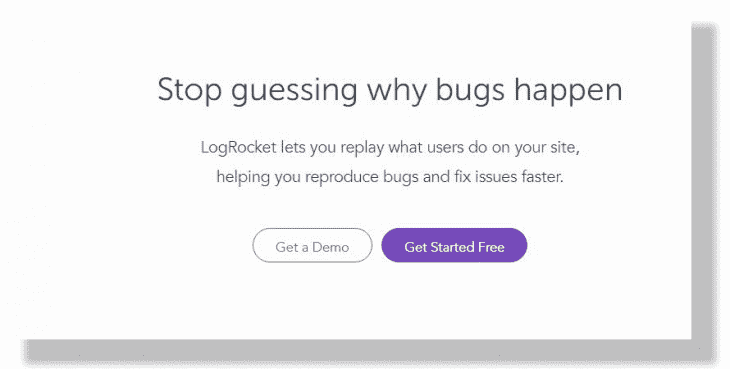

您将被引导至注册页面。因为我有一个 GitHub 页面，所以我更愿意注册 GitHub。选择你想要的任何方法。

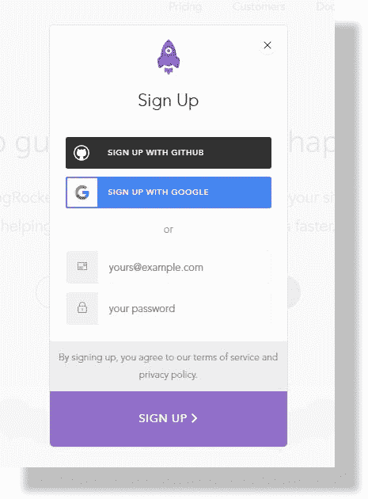

接下来，您将被要求授权 GitHub。


然后你会看到下面的页面。单击继续。

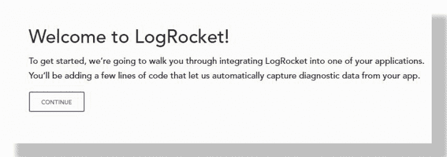

适当地填写本页的表格。使用有效的电子邮件地址。

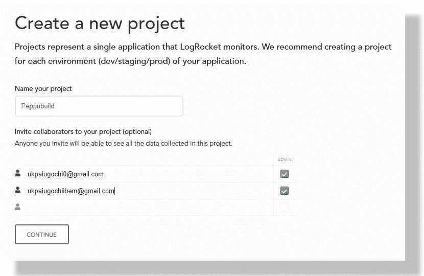

在`install Logrocket`部分，我更喜欢用`Script tag`而不是 NPM。我将复制`Script tag section`上的代码，如下图所示:

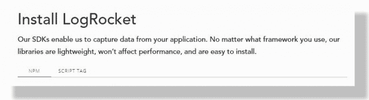

在您的 LogRocket 仪表板设置上转到集成。使用以下命令通过 npm 安装`logrocket-vuex`插件:

```
npm i --save logrocket-vuex
```

要将 LogRocket 插件添加到您的商店，请复制仪表板中显示的代码，并将其添加到您的 Vuex 商店。

您已经成功创建了一个 LogRocket 帐户。下一步是将我们的代码片段添加到 Netlify 中。这将允许我们查看视频，我们的用户与我们的网站互动，以及其他 UAT 工具。在您的托管应用程序上，单击站点设置。

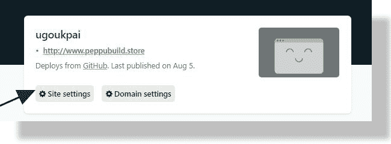

单击构建和部署。

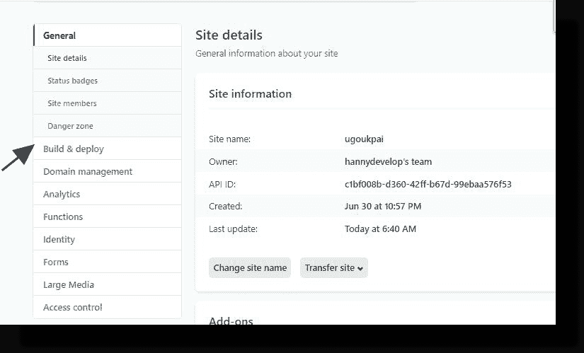

接下来，点击后处理:

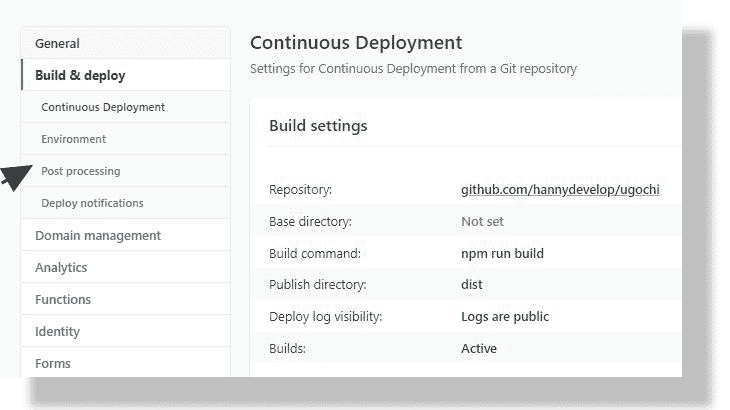

然后，我们将点击`Snippet Injection`和`Add Snippet`。将`Insert before`改为`head`。在`Script Name`部分添加任何名字。用 LogRocket 中的代码片段填充 HTML 部分。最后，单击保存按钮。

查看您的 Vue.js 应用程序和 Vuex 商店并与之互动。您可以在仪表板上查看新的会议视频。

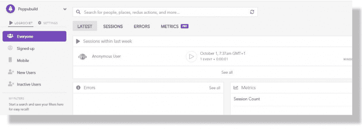

## 奖金

我们将看到如何用 Postman 对一个应用程序 API 进行 alpha 测试。在向我们的后端发送请求之前，测试 API 端点总是明智的。当您测试 API 端点时，您会预先知道是否有错误。Postman 是一个主要用于测试、共享和记录 API 调用的工具。

在连接前端应用程序和后端应用程序之前，我们将学习如何用 Postman 测试我们的 API 调用。

您首先需要在您的工作环境中安装 Postman。如果没有安装 Postman，可以在这里获得[。](https://www.postman.com/downloads/)

按照这些步骤，在您的系统上安装 postman。我们将使用一个[在线假 rest API](https://jsonplaceholder.typicode.com/) 来运行 Postman 测试。

启动 Postman 环境，然后点击`create a request`。

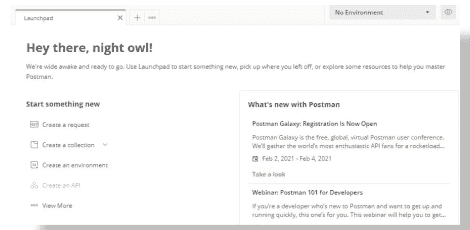

在您的工作区中，输入`[https://jsonplaceholder.typicode.com/todos/1](https://jsonplaceholder.typicode.com/todos/1)`作为请求 URL，并将请求设置为`GET`。

点击`Tests`:


将以下代码添加到测试工作区:

```
//Let postman test status code be 200
pm.test("status.code is 200", function () {

//If status does not return 200, test fails
       pm.response.to.have.status(200);
})
```

当您使用上面的地址运行这段代码时，它会给出下面的响应。这是因为 GET 请求成功。

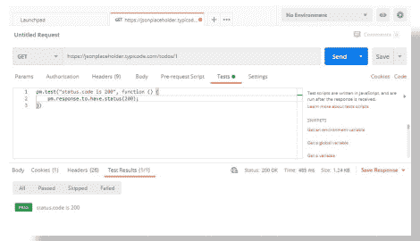

如果您将地址更改为一个错误的地址，您将会得到测试失败的代码。下面的例子返回代码 404，因为我从地址中删除了`O`。

由于 404 不是 200，测试状态为失败:

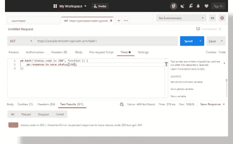

## 结论

在本文中，我们介绍了 Vue.js 应用程序和 Vuex 商店中的用户验收测试。我们用 LogRocket 测试了业务所有者的需求和功能。我们还看到了如何用 Postman 对我们的应用程序 API 执行 alpha 测试。

我们从什么是验收测试开始，以及验收测试之前可以在应用程序上执行的其他测试。我们还讨论了在应用程序交付给最终用户之前进行验收测试的重要性。

非常感谢你的时间。请随时在 Twitter 上联系我。

## 像用户一样体验您的 Vue 应用

调试 Vue.js 应用程序可能会很困难，尤其是当用户会话期间有几十个(如果不是几百个)突变时。如果您对监视和跟踪生产中所有用户的 Vue 突变感兴趣，

[try LogRocket](https://lp.logrocket.com/blg/vue-signup)

.

[](https://lp.logrocket.com/blg/vue-signup)[https://logrocket.com/signup/](https://lp.logrocket.com/blg/vue-signup)

LogRocket 就像是网络和移动应用程序的 DVR，记录你的 Vue 应用程序中发生的一切，包括网络请求、JavaScript 错误、性能问题等等。您可以汇总并报告问题发生时应用程序的状态，而不是猜测问题发生的原因。

LogRocket Vuex 插件将 Vuex 突变记录到 LogRocket 控制台，为您提供导致错误的环境，以及出现问题时应用程序的状态。

现代化您调试 Vue 应用的方式- [开始免费监控](https://lp.logrocket.com/blg/vue-signup)。