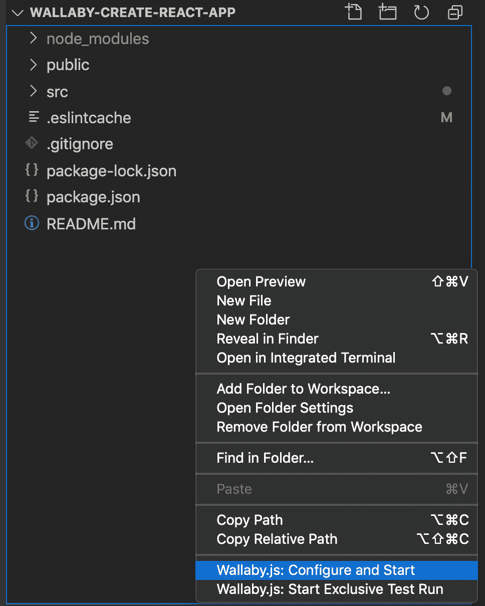
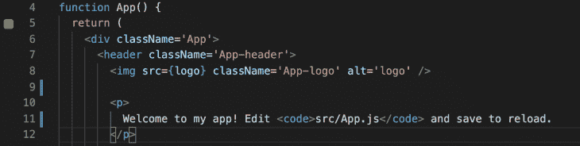
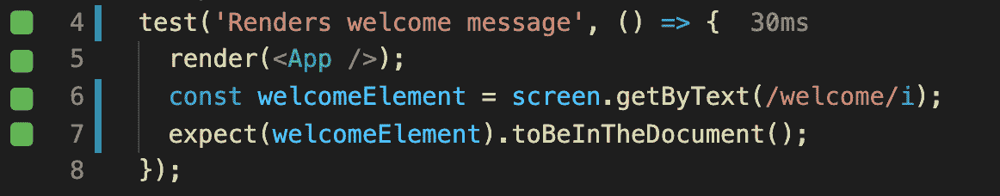

# 如何在 React - LogRocket 博客中使用 Wallaby.js

> 原文：<https://blog.logrocket.com/a-guide-to-using-wallaby-js-in-react/>

如果您在 JavaScript 开发领域工作过一段时间，您可能听说过测试驱动开发(TDD)。它可能已经成为你的一种生活方式，或者你可能正在抵制它，因为它似乎很麻烦，很费时间。无论哪种情况，你都可以从查看 Wallaby.js 提供的所有内容中受益。

本入门指南的目标是探索 Wallaby.js 的用途和优点，并提供分步说明来帮助您开始在 React 中使用 Wallaby.js。

无论你是测试新手还是有经验的 TDD 专家，这个指南都应该易于理解。考虑到这一点，例子将会非常简单，但是它们将会展示你第一次遇到时所期望的。

## Wallaby.js 是什么？

直接引用 documentationn 的话来说，Wallaby.js 是“一个集成的 JavaScript 连续测试工具”，这意味着它在你的 ide 中运行，在你写的时候提供持续的反馈。就像拼写检查一样，但是是为了测试。

在大多数正常的测试环境中，测试要么手动运行，要么最好在保存源代码时运行。这对于较小的项目来说没问题，但是它的伸缩性不是很好。随着项目的增长，测试套件往往会随之增长，成为大量的工作，随着时间的推移，测试人员需要花费越来越多的时间来处理。

更重要的是:许多测试人员提供的反馈不是特别直观易懂，这也是许多新手开发人员一开始就对测试不感兴趣的部分原因。

他们花时间正确配置测试框架，学习编写测试，然后意识到他们还必须弄清楚如何解释结果。

输入 Wallaby.js。因为它在您正在处理的代码旁边提供自然英语的实时反馈，所以在您的按键和每个新测试或代码块的结果之间几乎没有延迟时间。

Wallaby.js 还会计算受代码更改影响的最小测试数量，因此即使您正在处理一个大规模的代码库，有时也可能只需要运行一个测试。

仅仅这些好处就足以让 Wallaby.js 值得研究，但是你可以做的事情太多了，以至于一个完整的特性评论不得不成为它自己的主题。现在，让我们进入如何开始。

## React 中的 Wallaby.js 入门

使用 React 开始使用 Wallaby.js 很容易，因为 [create-react-app](https://create-react-app.dev/) 包已经包含了一个兼容的测试框架: [Jest](https://jestjs.io/) 。如果你愿意，你也可以使用其他的工具，比如 Mocha 或者 Jasmine，但是为了简单起见，我们现在坚持使用 Jest。

我还将使用 [VSCode](https://code.visualstudio.com/) ,因为它恰巧是我选择的编辑器，但是你可以自由使用任何其他兼容的编辑器，包括 Atom 和 Sublime Text。要获得兼容编辑器的完整列表，请前往 [Wallaby.js 文档](https://wallabyjs.com/docs/tutorial/overview.html)的教程部分。

解决了这个问题，让我们继续使用 npx 开始我们的示例应用程序:

```
npx create-react-app wallaby-create-react-app
```

如果您不熟悉 CLI，这将在名为 wallaby-create-react-app 的目录下创建一个新的 React 项目。这可能需要一些时间，所以当 npx 完成它的工作时，我们可以在 VSCode 中安装 Wallaby.js。

它可以免费用于开源项目，尽管您可能希望请求一个扩展的试用代码来消除安装时出现的提示。

最简单的形式是，Wallaby 可以与 React 应用无缝运行，而不需要大量的配置。它是如此无缝，一旦安装，你只需要指向你的项目目录，让它工作。

现在，您的 React 应用程序应该已经完成，因此您可以右键单击它，然后选择“**wallaby . js:Configure and Start**”



Wallaby.js options in VSCode context menu.

此时，如果您打开 App.test.js 文件，您应该会看到类似这样的内容:

```
import { render, screen } from '@testing-library/react';
import App from './App';
test('renders learn react link', () => {
  render();
  const linkElement = screen.getByText(/learn react/i);
  expect(linkElement).toBeInTheDocument();
});

```

因为我们还没有修改任何东西，默认测试应该通过。现在让我们改变一些东西。如果您参考 Wallaby 文档(截至 2020 年 11 月 24 日)，您会注意到预设测试文件中的代码略有不同，因此我们需要使用另一个示例来演示当您做出影响测试的更改时会发生什么。

假设我们希望标题显示“欢迎使用我的应用程序”，而不是默认文本。在 TDD 中，你首先要写一个测试，让你知道你将要写的代码正在工作，所以这就是我们现在要做的。更新默认测试，如下所示:

```
test('Renders welcome message', () => {
  render();
  const welcomeElement = screen.getByText(/welcome/i);
  expect(welcomeElement).toBeInTheDocument();
});

```

一旦您更改了`screen.getByText()`方法中的文本，您会注意到即时的反馈。代码左边的红色块表示测试失败，因为 Jest 在文档中找不到任何包含单词“welcome”的文本。您可能还会注意到，原始页面仍然会呈现出来——因为尽管测试失败，但没有什么可以阻止代码按原样运行。

现在我们要修改代码，以便通过测试。首先，我们将导航到 **App.js** 文件。注意 Wallaby 给我们的反馈。


Wallaby.js indicates a failed test running against a line of code.

从文档来看:粉色方块意味着源代码行位于失败测试的执行路径上。
现在，更新`<p>`标签的内容，使其包含单词“welcome”:

```
<p> 
Welcome to my app! Edit src/App.js and save to reload. </p>
```

一旦完成，您将会看到组件和测试文件中的方框又变绿了。



Wallaby.js shows a passing test against a line of code.

Wallaby.js 的后续步骤



Wallaby.js shows a passing test.

## 恭喜你！您刚刚完成了第一次实时集成测试。如果您是测试新手，这应该会向您展示发生了什么，而不需要跳过许多额外的环节，从而使整个过程变得不那么神秘。

如果你已经是一个专业人士，其含义将是显而易见的。随着项目变得越来越复杂，为节省时间而做的任何事情都变得越来越有价值。

最终，这一切都归结为效率，效率转化为生产力。因为 Wallaby 有能力限制对新代码的测试，所以它防止了几十个甚至几百个不相关的测试运行，以便证明单个功能按预期工作。

到目前为止，我们已经介绍了在 React 中使用 Wallaby.js 的基本知识，包括如何设置以及 Wallaby.js 能做些什么。同样，Wallaby.js 中包含的全部功能超出了本指南的范围，所以请访问官方文档，看看这个令人难以置信的工具还能为您做些什么。

使用 LogRocket 消除传统反应错误报告的噪音

## 是一款 React analytics 解决方案，可保护您免受数百个误报错误警报的影响，只针对少数真正重要的项目。LogRocket 告诉您 React 应用程序中实际影响用户的最具影响力的 bug 和 UX 问题。

[LogRocket](https://lp.logrocket.com/blg/react-signup-issue-free)

自动聚合客户端错误、反应错误边界、还原状态、缓慢的组件加载时间、JS 异常、前端性能指标和用户交互。然后，LogRocket 使用机器学习来通知您影响大多数用户的最具影响力的问题，并提供您修复它所需的上下文。

[ ](https://lp.logrocket.com/blg/react-signup-general) [  ](https://lp.logrocket.com/blg/react-signup-general) [LogRocket](https://lp.logrocket.com/blg/react-signup-issue-free)

关注重要的 React bug—[今天就试试 LogRocket】。](https://lp.logrocket.com/blg/react-signup-issue-free)

您是否添加了新的 JS 库来提高性能或构建新特性？如果他们反其道而行之呢？

## 毫无疑问，前端变得越来越复杂。当您向应用程序添加新的 JavaScript 库和其他依赖项时，您将需要更多的可见性，以确保您的用户不会遇到未知的问题。

LogRocket 是一个前端应用程序监控解决方案，可以让您回放 JavaScript 错误，就像它们发生在您自己的浏览器中一样，这样您就可以更有效地对错误做出反应。

[LogRocket](https://lp.logrocket.com/blg/javascript-signup) 可以与任何应用程序完美配合，不管是什么框架，并且有插件可以记录来自 Redux、Vuex 和@ngrx/store 的额外上下文。您可以汇总并报告问题发生时应用程序的状态，而不是猜测问题发生的原因。LogRocket 还可以监控应用的性能，报告客户端 CPU 负载、客户端内存使用等指标。

[](https://lp.logrocket.com/blg/javascript-signup)[https://logrocket.com/signup/](https://lp.logrocket.com/blg/javascript-signup)

自信地构建— [开始免费监控](https://lp.logrocket.com/blg/javascript-signup)。

Build confidently — [Start monitoring for free](https://lp.logrocket.com/blg/javascript-signup).