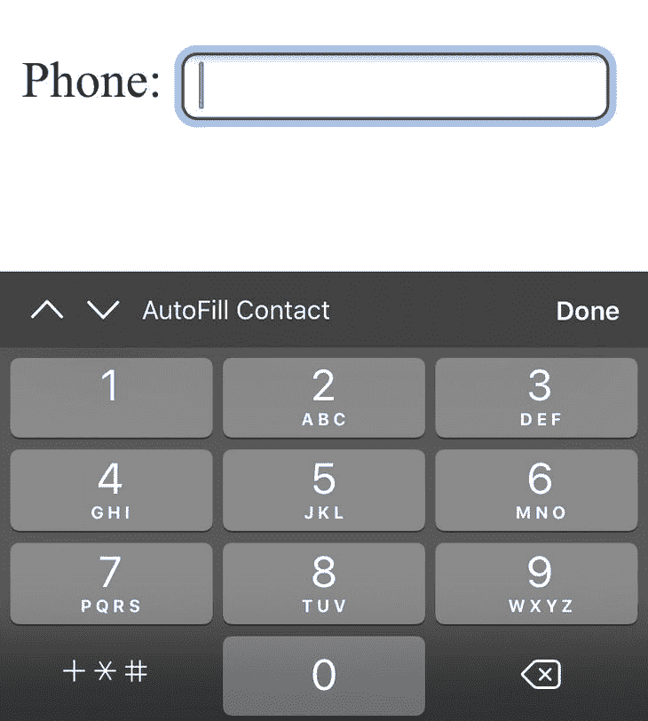
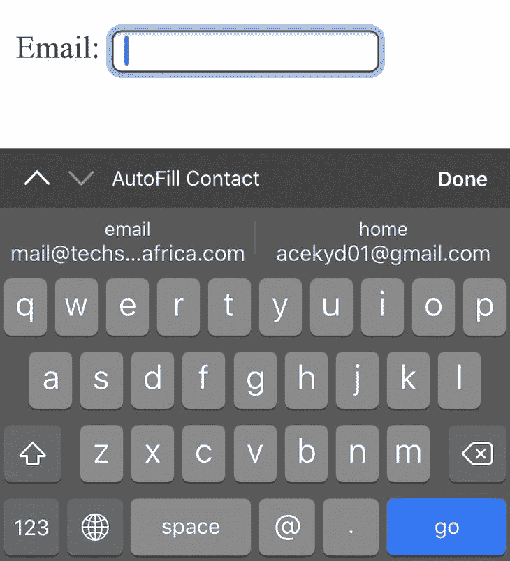
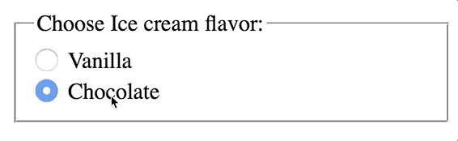

# 表单可访问性实用指南

> 原文：<https://blog.logrocket.com/a-practical-guide-to-accessibility-for-forms/>

## 介绍

从我们开始学习编码的那一刻起，有一件事是很难做到的，那就是从用户那里收集交互数据。为了从用户那里收集数据，我们需要某种类型的表单。

从收集评论到注册、登录、购买或在应用程序中提供反馈，我们都使用表单。表单是 web 的一个重要部分，因此，我们必须确保每个人都能够与它们交互，不管他们是否有残疾。

## 为什么它很重要

无障碍往往被认为只是一种适应盲人用户的方式，但它远不止于此。残疾的形式多种多样，包括手或手臂受伤等暂时性残疾，网速慢等情境性残疾，以及失明等永久性残疾。

我们希望确保我们所有的用户都能够在任何时候使用表单，而不会有糟糕的体验，我们的目标是使这些关键的用户交互尽可能无摩擦。当表单变得可访问时，它们不仅对残疾人，而且对每个人都更容易使用。

同样值得注意的是，在包括美国、英国和加拿大在内的许多国家，企业遵守网页可访问性标准越来越重要，并逐渐成为一项法律要求。

2016 年， [Target 向全国盲人联合会](https://en.wikipedia.org/wiki/National_Federation_of_the_Blind_v._Target_Corp.)支付了数百万美元，因为他们的产品图片上没有 alt 文本，以及其他可访问性问题。就在最近，[美国最高法院驳回了达美乐](https://slate.com/technology/2019/10/the-supreme-court-denies-dominos-petition-on-a-disability-lawsuit.html)的请愿，此前该公司在下级法院输给了一名盲人，该盲人曾起诉达美乐，称其尽管使用了屏幕阅读器，却无法在网站上下单。

越来越多的国家采用类似的法律并建立更多的标准，给网站提供清晰的步骤来实现可访问性，这只是时间问题。

## 需要考虑的事项

当我们试图改进现有的表单或创建新的表单时，有几个问题需要解决，以确定我们需要采取的步骤:

*   用户是否容易确定他们需要提供什么信息以及以什么格式提供？
*   有视觉障碍的人在使用表格时会有什么困难？
*   屏幕阅读器对表单处理得好吗？
*   表格是否符合逻辑，易于理解？
*   用户可以只用键盘填写表单吗？

## 如何制作可访问的表单

有很多方法可以帮助改进表单，使每个人都可以完全访问表单。这里有几个建议:

### 编写语义 HTML

这是第一点，因为如果使用了正确的 HTML 元素，许多可访问性问题已经可以解决了。有超过 100 个 HTML 元素，每一个都有一个独特的目的来完成一项任务。

由于 HTML 的不断改进，通常不需要使用另一个带有自定义 JavaScript 代码的元素来使它像另一个元素一样工作。在正确的位置使用一个`button`元素，而不是定制一个`div`来看起来和功能上像一个按钮。这使得屏幕阅读器更容易向用户提供有关元素的更多信息。

### 使用适当的 HTML 输入类型

有许多 HTML 输入类型，每一种都是为了更容易从用户那里检索特定类型的数据而创建的。通过指定正确的`type`和`name`属性——例如，`type="password"`帮助隐藏显示的文本，`type="email"`收集电子邮件——浏览器变得优化以接收数据并向用户提供自动填充建议。


在手机上，使用正确的输入类型显示合适的键盘。例如，当使用`type="tel"`时，键盘显示输入电话号码的键盘，而`type="email"`显示优先使用`@`按钮的键盘。



input type=”tel” on mobile



input type=”email” on mobile

另外，请使用`<input type="submit">`为您的表单创建提交按钮。这将使用户只需按下键盘上的 enter 键即可提交。

### 将 HTML 输入类型连接到它们的标签

我认为标签是 HTML 中最被低估的元素之一。它们非常强大，可以让很多事情更好地工作。除了知道输入请求什么数据的表示目的之外，还可以更进一步。

通过使用`for`属性将标签直接连接到输入，我们可以提高可用性。

```
<label for="hungry">Are you hungry?:</label>
<input type="checkbox" name="hungry" id="hungry">
```

这样，我们可以为每个输入元素获得一个更大的目标尺寸，因为单击标签会使输入成为焦点。这对有运动障碍的人来说很有用，尤其是当他们必须选择像收音机或复选框这样的小元素时。屏幕阅读器还读出输入的连接标签，而不是在焦点上时简单地指出输入类型。


Clicking on the label triggers the checkbox.

标签`<label>`的`for`属性应该等于相关元素的`id`属性，以将它们绑定在一起，如上例所示。对于没有视觉障碍的用户来说，将标签与其连接的表单域进行视觉关联也应该很容易。

### 仅使用占位符来描述预期值

在某些情况下，用户只能用占位符来代替告诉他们应该在每个输入中输入什么的标签。这种方法的问题是，一旦用户开始键入，占位符就会消失。

有认知障碍的人也倾向于对占位符有问题，因为它可以被认为是预先填充的文本。请避免通过占位符提供说明；它们不是标签的替代品。

### 提供附加帮助文本

根据表单所需的数据类型，最好在表单顶部包含需要的说明。因为每个字段只允许一个`<label>`元素，所以在需要为输入提供描述性文本的情况下，可以使用`aria-describedby`属性将它与表单字段链接起来。当表单域获得焦点时，屏幕阅读器将同时显示标签和帮助文本。

```
<label for="employment_date">Employment date:</label>
<input type="date" name="employment_date" id="employment_date" aria-describedby="employment_date_help">
<span id="employment_date_help">MM/DD/YYYY</span>
```

还建议包括输入数据的例子，而不是冗长的描述性消息，因为这对用户来说更容易理解。

### 分组相关表单控件

在必须为某个目的提供多个控件的情况下——通常在使用单选按钮或复选框时——强烈建议使用`<fieldset></fieldset>`元素对它们进行分组，然后使用`<legend></legend>`来提供它们的描述性文本。



Grouped controls with fieldset.

使用`<fieldset></fieldset>`和`<legend></legend>`可以确保一旦分组的控件成为焦点，屏幕阅读器用户就能读到文本描述。

### 可访问验证

表单的验证是在服务器端或客户端使用 JavaScript 完成的。HTML5 提供了一系列内置功能来帮助验证输入，如电子邮件地址。当错误发生时，以一种容易理解的方式向用户显示它们是很重要的——包括使用屏幕阅读器使用户更容易理解。

要做到这一点，错误消息应该显示属性`role="alert"`,因为屏幕阅读器支持这一点，并会立即通知用户错误。错误消息还可以包括建议或示例，使用户更容易纠正错误。

一种常见的做法是将所有的错误汇总起来，并将其添加到表单的顶部，但最好是将错误直接与输入相关联。在下面添加错误信息，用`aria-`连接，直观的指出哪些输入字段有错误。

对于必需的输入字段，它们应该可以使用标签来识别。HTML5 还提供了`required`属性，可以将它添加到表单控件中，以表明它们是必需的。这一属性得到了现代 web 浏览器的支持，并传达了用户所缺少的必要输入。

## 结论

表单对于 web 应用程序的一般可用性至关重要，因为它们用于互联网上各种类型的交互。使用正确的 HTML 元素使我们更近了一步，但是做出有意识的决定来放置额外的东西可以确保每个用户，不管他们是否有残疾，都能够使用我们的表单。

为了找到更多的方法使整个 web 体验对用户来说是可访问的， [Web 内容可访问性指南(WCAG) 2.0](https://www.w3.org/WAI/GL/WCAG20/) 提供了使内容对各种残障人士和非残障人士都是可访问的说明。

当我们改进表单的可访问性和可用性时，每个人都会受益。

## 使用 [LogRocket](https://lp.logrocket.com/blg/signup) 消除传统错误报告的干扰

[](https://lp.logrocket.com/blg/signup)

[LogRocket](https://lp.logrocket.com/blg/signup) 是一个数字体验分析解决方案，它可以保护您免受数百个假阳性错误警报的影响，只针对几个真正重要的项目。LogRocket 会告诉您应用程序中实际影响用户的最具影响力的 bug 和 UX 问题。

然后，使用具有深层技术遥测的会话重放来确切地查看用户看到了什么以及是什么导致了问题，就像你在他们身后看一样。

LogRocket 自动聚合客户端错误、JS 异常、前端性能指标和用户交互。然后 LogRocket 使用机器学习来告诉你哪些问题正在影响大多数用户，并提供你需要修复它的上下文。

关注重要的 bug—[今天就试试 LogRocket】。](https://lp.logrocket.com/blg/signup-issue-free)