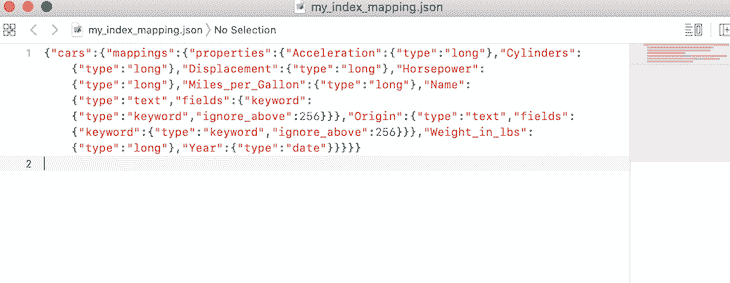
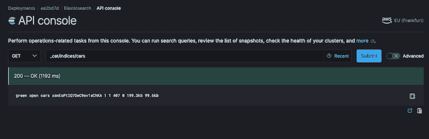
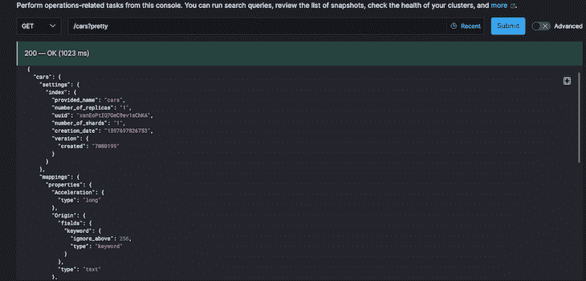
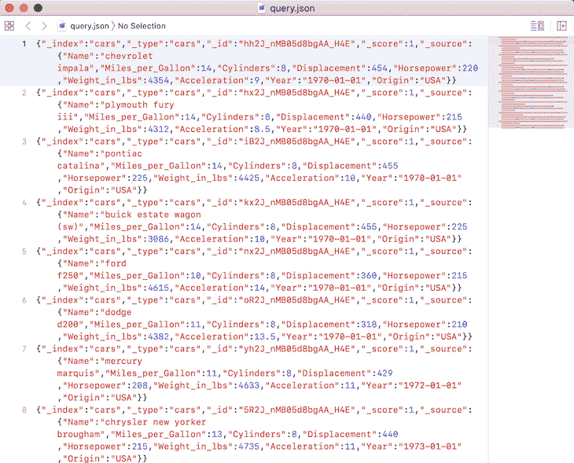
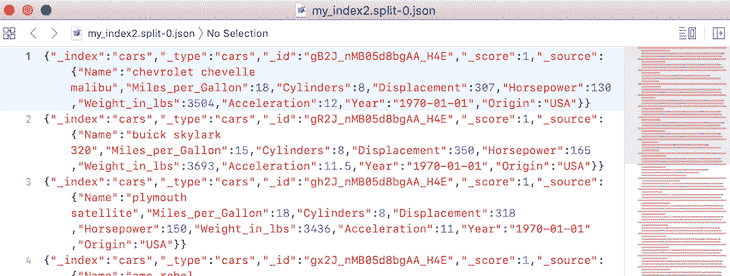
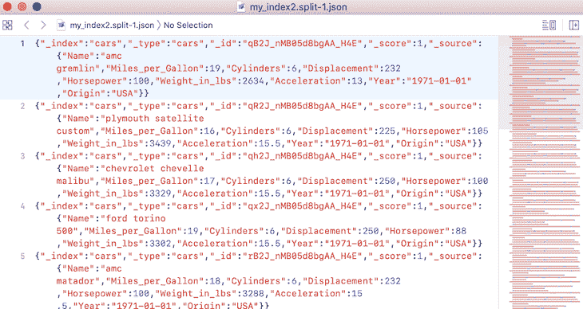

# 使用 Elasticdump - LogRocket 博客的实用指南

> 原文：<https://blog.logrocket.com/a-practical-guide-to-working-with-elasticdump/>

## 介绍

一般来说，数据库将有一种机制，用于迁移、复制/备份，或者更好的是，将存储的数据转移到不同的数据库或支持格式的文件中。顾名思义，Elasticdump 是一个用于导入和导出存储在 Elasticsearch 索引或集群中的数据的工具。

因此，对于我们打算在 Elasticsearch (ES)索引之间管理数据传输的情况， [Elasticdump](https://github.com/elasticsearch-dump/elasticsearch-dump) 是一个非常棒的工具。它通过发送一个`input`到一个`output`来工作，从而允许我们从一个 ES 服务器导出保存的数据，作为源和输出，直接到另一个，作为目的地。

此外，它允许我们将一组数据集(以及映射)从 ES 索引/集群导出到 JSON 格式的文件，甚至是 gzipped 格式的文件。它还支持将多个索引同时导出到受支持的目标。

## Elasticdump 入门

使用 Elasticdump，我们可以将索引导入/导出 JSON 文件，或者从一个集群导出到另一个集群。在这篇文章中，我们将探索如何使用这个令人敬畏的工具来做到这一点——为那些打算这样做的人(以及我未来的自己)提供一个参考点。

作为练习，我们将使用一些虚拟数据创建一个 Elasticsearch 索引，然后将相同的索引导出到 JSON。此外，我们将展示如何将一些虚拟数据从一个 ES 服务器/集群移动或转储到另一个。

> **注意** : Elasticdump 是开源的(Apache-2.0 许可的)并且是积极维护的。在最近的版本中，对“转储/上传”算法的性能更新提高了并行处理速度。然而，这种改变是有代价的，因为记录或数据集不再按顺序处理。

### 先决条件

为了跟随本教程，建议您对 Elasticsearch 的工作原理有一个基本的了解。此外，读者应该确保他们的机器上安装了 Elasticsearch。这样做的说明可以在[这里](https://www.elastic.co/elasticsearch/?ultron=EL-B-Stack-Trials-EMEA-UK-BMM&blade=adwords-s&hulk=cpc&gambit=Elasticsearch-install&Device=c&gclid=EAIaIQobChMIhbGx5oGl6wIV0e3tCh1b0wrpEAAYASAAEgIKCPD_BwE)找到。

或者，我们可以选择使用云托管的弹性搜索提供商。要了解如何设置它，我们可以参考这篇关于使用 Elasticsearch 的早期文章[。](https://blog.logrocket.com/elasticsearch-query-body-builder-node-js/)

应该注意的是，无论我们选择什么方法与我们的 Elasticsearch 集群进行交互，它在我们的本地开发环境和云托管版本中都是一样的。

### 装置

首先，我们应该在本地机器上安装 Elasticdump，因为我们打算在本地使用它。在这里，我们既可以按项目安装，也可以全局安装。为此，我们可以运行以下命令:

```
npm install elasticdump -g
```

基于每个项目，我们可以运行:

```
npm install elasticdump --save
```

> **注意**:通过 [docker](https://github.com/elasticsearch-dump/elasticsearch-dump#docker-install) 以及[非标准安装](https://github.com/elasticsearch-dump/elasticsearch-dump#non-standard-install)安装和运行该工具还有其他方式。

### 弹性泵的使用

该工具的用法如下所示:

```
elasticdump --input SOURCE --output DESTINATION [OPTIONS]
```

从上面的命令可以看出，我们有一个输入源和一个输出目的地。options 属性用于指定运行命令所需的额外参数。

此外，正如我们之前提到的，Elasticdump 通过将输入发送到输出来工作，其中输出或输入可以是弹性 URL 或文件，反之亦然。

通常，Elasticsearch URL 的格式如下所示:

```
{protocol}://{host}:{port}/{index}
```

它相当于下面显示的 URL:

```
http://localhost:9200/sample_index?pretty
```

或者，文件格式示例如下所示:

```
/Users/retina/Desktop/sample_file.json
```

然后，我们可以像这样使用弹性转储工具将样本索引中的数据备份转移到一个文件中:

```
elasticdump \
    --input=http://localhost:9200/sample_index \
    --output=/Users/retina/Desktop/sample_file.json \
    --type=data
```

正如我们从上面的命令中可以看到的，我们正在使用带有适当选项标志的`elasticdump`命令来指定`--input`和`--output`源。我们也用一个`--type`选项标志来指定类型。我们也可以对我们的`mappings`或模式运行相同的命令:

```
elasticdump \
    --input=http://localhost:9200/sample_index \
    --output=/Users/retina/Desktop/sample_mapping.json \
    --type=mapping
```

上面的命令复制了我们输入的 Elasticsearch URL 的输出。这指定了一个输出的索引，该输出是一个文件`sample_mapping.json`。我们还可以运行其他命令。例如，为了将数据从一个 Elasticsearch 服务器/集群传输到另一个，我们可以运行以下命令:

```
elasticdump \
  --input=http://sample-es-url/sample_index \
  --output=http://localhost:9200/sample_index \
  --type=analyzer

elasticdump \
  --input=http://sample-es-url/sample_index \
  --output=http://localhost:9200/sample_index \
  --type=mapping

elasticdump \
  --input=http://sample-es-url/sample_index \
  --output=http://localhost:9200/sample_index \
  --type=data
```

上述命令将复制所述索引中的数据以及映射和分析器。请注意，我们还可以运行其他命令，包括:

*   gzip 数据，并备份到合适的目标位置
*   将 Elasticsearch 查询的结果备份到文件中
*   使用 S3 时段 URL 将数据从 S3 时段导入 Elasticsearch。请注意，我们还可以通过 URL 将数据从 ES 集群导出到 S3 存储桶
*   将别名和模板备份到文件中，并导入到 Elasticsearch 中
*   根据`--fileSize`选项标志等将文件分割成多个部分

在 GitHub 上的 readme 文件中可以找到更多关于上述操作和我们可以在 Elasticdump 的帮助下运行的其他操作的签名的细节。

> **注意**:如果我们需要使用基本身份验证来创建转储，我们可以在 URL 上添加基本身份验证，也可以使用包含身份验证凭证的文件。更多细节可以在这个[维基](https://github.com/elasticsearch-dump/elasticsearch-dump/wiki)中找到。

### 关于选项参数的注释

对于我们传递给转储命令的选项参数，只有`--input`和`--output`标志是必需的。原因是显而易见的:我们需要一个要迁移的数据源和一个目的地。其他选项包括:

*   `--input-index`–我们可以传递源索引和类型(`default: all`)
*   `--output-index`–我们可以传递目的地索引和类型(`default: all`)
*   `--overwrite`–如果输出文件存在，我们可以传递这个可选标志来覆盖它(`default: false`)
*   `--limit`–我们还可以传递一个限制标志来指定我们打算在每次操作中批量移动的对象数量(`default: 100`)
*   `--size`–我们也可以通过这个标志来指定要检索多少个对象(`default: -1 to no limit`)
*   `--debug`–我们可以使用该标志来显示正在使用的 Elasticsearch 命令(`default: false`)
*   `--searchBody`–此标志帮助我们根据搜索结果执行部分提取。注意，只有当 Elasticsearch 是我们的输入数据源时，我们才能使用这个标志
*   当我们打算在将文档写到目的地之前即时修改文档时，这个标志非常有用。关于这个工具的内部细节可以在[这里](https://github.com/elasticsearch-dump/elasticsearch-dump#module-transform)找到

关于我们可以作为选项传递给`elasticdump`命令的其他标志的详细信息，包括`--headers`、`--params`、`--ignore-errors`、`--timeout`、`--awsUrlRegex`等等，可以在文档中的这里找到[。](https://github.com/elasticsearch-dump/elasticsearch-dump#options)

### 值得注意的版本改进

*   因为 Elasticdump 依赖于 Elasticsearch，所以这个工具很可能需要 elastic search 1 . 0 . 0 或更高版本
*   Elasticdump 已经放弃了对节点 v8 的支持。现在需要节点≥v10，工具才能正常工作
*   Elasticdump 现在支持指定一个逗号分隔的字段列表，应该对这些字段进行检查`bigint`
*   如前所述，转储算法也有升级，使其能够并行处理数据集，从而提高性能。

关于版本变更的更多细节可以在 readme 文档的本节中找到[。此外，对于使用该工具时的问题或注意事项，我们可以](https://github.com/elasticsearch-dump/elasticsearch-dump#version-warnings)[参考同一文档的本节](https://github.com/elasticsearch-dump/elasticsearch-dump#notes)。

## 对真实数据使用 Elasticdump

在这一节中，我们将演示如何使用这个工具将数据从一个索引转储到另一个索引，以及转储到一个文件。为此，我们需要两个独立的 ES 集群。我们将按照本教程中概述的[步骤来提供 Elasticsearch 的云托管版本。](https://blog.logrocket.com/elasticsearch-query-body-builder-node-js/)

注意，要将样本数据复制或写入我们的 ES 集群或索引，我们可以参考上一段中链接的早期文章中的脚本。此外，可以在处找到样本数据[。](https://github.com/firebase007/Elastic_search_query_builder_tutorial/blob/master/app/dataToEs.json)

### 步伐

1.  因为我们是在本地开发，所以我们应该确保我们的 ES 集群启动并运行
2.  之后，我们可以在 CLI 上运行`elasticdump`命令
3.  这里，我们通过运行`npm install elasticdump -g`在全局范围内安装了`elasticdump`
4.  当我们完成设置后，在终端上运行`elasticdump`的结果应该是:

    ```
    Mon, 17 Aug 2020 22:39:24 GMT | Error Emitted => {"errors":["input is a required input","output is a required input"]}
    ```

当然，这是因为我们没有包括前面提到的必需的输入和输出字段。我们可以通过运行以下命令来包含它们:

```
elasticdump \
  --input=http://localhost:9200/cars \            
  --output=/Users/retina/Desktop/my_index_mapping.json \
  --type=mapping

elasticdump \
  --input=http://localhost:9200/cars \            
  --output=/Users/retina/Desktop/my_index.json \
  --type=data
```

这会将数据从本地 es 集群复制或转储到 JSON 格式的文件中。请注意，如果该文件不可用，它会在指定的路径上自动创建，并将数据写入其中。运行该命令的结果如下所示:

```
Mon, 17 Aug 2020 22:42:59 GMT | starting dump
Mon, 17 Aug 2020 22:43:00 GMT | got 1 objects from source elasticsearch (offset: 0)
Mon, 17 Aug 2020 22:43:00 GMT | sent 1 objects to destination file, wrote 1
Mon, 17 Aug 2020 22:43:00 GMT | got 0 objects from source elasticsearch (offset: 1)
Mon, 17 Aug 2020 22:43:00 GMT | Total Writes: 1
Mon, 17 Aug 2020 22:43:00 GMT | dump complete
Mon, 17 Aug 2020 22:43:01 GMT | starting dump
Mon, 17 Aug 2020 22:43:02 GMT | got 100 objects from source elasticsearch (offset: 0)
Mon, 17 Aug 2020 22:43:02 GMT | sent 100 objects to destination file, wrote 100
Mon, 17 Aug 2020 22:43:02 GMT | got 100 objects from source elasticsearch (offset: 100)
Mon, 17 Aug 2020 22:43:02 GMT | sent 100 objects to destination file, wrote 100
Mon, 17 Aug 2020 22:43:02 GMT | got 100 objects from source elasticsearch (offset: 200)
Mon, 17 Aug 2020 22:43:02 GMT | sent 100 objects to destination file, wrote 100
Mon, 17 Aug 2020 22:43:02 GMT | got 100 objects from source elasticsearch (offset: 300)
Mon, 17 Aug 2020 22:43:02 GMT | sent 100 objects to destination file, wrote 100
Mon, 17 Aug 2020 22:43:02 GMT | got 6 objects from source elasticsearch (offset: 400)
Mon, 17 Aug 2020 22:43:02 GMT | sent 6 objects to destination file, wrote 6
Mon, 17 Aug 2020 22:43:02 GMT | got 0 objects from source elasticsearch (offset: 406)
Mon, 17 Aug 2020 22:43:02 GMT | Total Writes: 406
Mon, 17 Aug 2020 22:43:02 GMT | dump complete
```

编写转储文件会在指定的路径上创建 JSON 文件。在这种情况下，文件是在我的桌面上创建的。



my_index_mapping.json


my_index.json

> **注意**:从上面我们可以看出，dump 工具生成的文件格式不是有效的 JSON 但是，每一行都有效。事实上，转储文件是一个行分隔的 JSON 文件。请注意，这样做是为了可以轻松地传输和附加转储文件。

现在，让我们尝试将数据从本地 ES 集群备份到我最近在 E[elastic cloud](https://cloud.elastic.co/home)上配置的集群。这里，我们将输入指定为本地 Elasticsearch，将目的地或输出指定为云中的 Elastic cluster。

```
[email protected] ~ % elasticdump \
  --input=http://localhost:9200/cars \
  --output=https://elastic:[email protected]tral-1.aws.cloud.es.io:9243/car \
  --type=analyzer
elasticdump \
  --input=http://localhost:9200/cars \
  --output=https://elastic:[email protected]tral-1.aws.cloud.es.io:9243/car \
  --type=mapping
elasticdump \
  --input=http://localhost:9200/cars \
  --output=https://elastic:[email protected]tral-1.aws.cloud.es.io:9243/cars \
  --type=data
```

输出如下所示:

```
Mon, 17 Aug 2020 23:10:26 GMT | starting dump
Mon, 17 Aug 2020 23:10:26 GMT | got 1 objects from source elasticsearch (offset: 0)
Mon, 17 Aug 2020 23:10:34 GMT | sent 1 objects to destination elasticsearch, wrote 1
Mon, 17 Aug 2020 23:10:34 GMT | got 0 objects from source elasticsearch (offset: 1)
Mon, 17 Aug 2020 23:10:34 GMT | Total Writes: 1
Mon, 17 Aug 2020 23:10:34 GMT | dump complete
Mon, 17 Aug 2020 23:10:35 GMT | starting dump
Mon, 17 Aug 2020 23:10:35 GMT | got 1 objects from source elasticsearch (offset: 0)
Mon, 17 Aug 2020 23:10:38 GMT | sent 1 objects to destination elasticsearch, wrote 1
Mon, 17 Aug 2020 23:10:38 GMT | got 0 objects from source elasticsearch (offset: 1)
Mon, 17 Aug 2020 23:10:38 GMT | Total Writes: 1
Mon, 17 Aug 2020 23:10:38 GMT | dump complete
Mon, 17 Aug 2020 23:10:38 GMT | starting dump
Mon, 17 Aug 2020 23:10:38 GMT | got 100 objects from source elasticsearch (offset: 0)
Mon, 17 Aug 2020 23:10:42 GMT | sent 100 objects to destination elasticsearch, wrote 100
Mon, 17 Aug 2020 23:10:43 GMT | got 100 objects from source elasticsearch (offset: 100)
Mon, 17 Aug 2020 23:10:46 GMT | sent 100 objects to destination elasticsearch, wrote 100
Mon, 17 Aug 2020 23:10:46 GMT | got 100 objects from source elasticsearch (offset: 200)
Mon, 17 Aug 2020 23:10:49 GMT | sent 100 objects to destination elasticsearch, wrote 100
Mon, 17 Aug 2020 23:10:49 GMT | got 100 objects from source elasticsearch (offset: 300)
Mon, 17 Aug 2020 23:10:52 GMT | sent 100 objects to destination elasticsearch, wrote 100
Mon, 17 Aug 2020 23:10:52 GMT | got 6 objects from source elasticsearch (offset: 400)
Mon, 17 Aug 2020 23:10:54 GMT | sent 6 objects to destination elasticsearch, wrote 6
Mon, 17 Aug 2020 23:10:54 GMT | got 0 objects from source elasticsearch (offset: 406)
Mon, 17 Aug 2020 23:10:54 GMT | Total Writes: 406
Mon, 17 Aug 2020 23:10:54 GMT | dump complete
```

转储完成后，我们现在可以继续检查索引在我们最初提供的 Elasticsearch 服务中是否可用。

当我们访问云托管版本上的 API 控制台并对汽车索引执行 get 请求时，我们得到的索引显示了复制的正确记录数，如下面的截图所示。



Showing the backup index on the cloud version.



Showing the mappings on the cloud version.

接下来，让我们看看这个将查询结果备份到文件的例子。该命令如下所示:

```
[email protected] ~ % elasticdump \
  --input=http://localhost:9200/cars \
  --output=/Users/retina/Desktop/query.json \
  --searchBody="{\"query\":{\"range\":{\"Horsepower\": {\"gte\": "201", \"lte\": "300"}}}}"
```

运行上述命令的输出如下所示:

```
Mon, 17 Aug 2020 23:42:46 GMT | starting dump
Mon, 17 Aug 2020 23:42:47 GMT | got 10 objects from source elasticsearch (offset: 0)
Mon, 17 Aug 2020 23:42:47 GMT | sent 10 objects to destination file, wrote 10
Mon, 17 Aug 2020 23:42:47 GMT | got 0 objects from source elasticsearch (offset: 10)
Mon, 17 Aug 2020 23:42:47 GMT | Total Writes: 10
Mon, 17 Aug 2020 23:42:47 GMT | dump complete
```

如果我们检查文件的内容，我们可以看到我们的查询结果被复制到文件中:



Result of writing a query to a file in JSON format.

如果我们检查一下，我们正在做一个范围查询，其中`Horsepower`字段的结果应该返回大于`201`但小于`300`的值，这就是我们得到的结果！

最后，我们的最后一个例子是在备份文件时将文件分成多个部分。为此，我们运行以下命令:

```
[email protected] ~ % elasticdump \
  --input=http://localhost:9200/cars \
  --output=/Users/retina/Desktop/my_index2.json \
  --fileSize=10kb
```

我们将得到如下所示的输出:

```
Tue, 18 Aug 2020 00:05:01 GMT | starting dump
Tue, 18 Aug 2020 00:05:01 GMT | got 100 objects from source elasticsearch (offset: 0)
Tue, 18 Aug 2020 00:05:02 GMT | sent 100 objects to destination file, wrote 100
Tue, 18 Aug 2020 00:05:02 GMT | got 100 objects from source elasticsearch (offset: 100)
Tue, 18 Aug 2020 00:05:02 GMT | sent 100 objects to destination file, wrote 100
Tue, 18 Aug 2020 00:05:02 GMT | got 100 objects from source elasticsearch (offset: 200)
Tue, 18 Aug 2020 00:05:02 GMT | sent 100 objects to destination file, wrote 100
Tue, 18 Aug 2020 00:05:02 GMT | got 100 objects from source elasticsearch (offset: 300)
Tue, 18 Aug 2020 00:05:02 GMT | sent 100 objects to destination file, wrote 100
Tue, 18 Aug 2020 00:05:02 GMT | got 6 objects from source elasticsearch (offset: 400)
Tue, 18 Aug 2020 00:05:02 GMT | sent 6 objects to destination file, wrote 6
Tue, 18 Aug 2020 00:05:02 GMT | got 0 objects from source elasticsearch (offset: 406)
Tue, 18 Aug 2020 00:05:02 GMT | Total Writes: 406
Tue, 18 Aug 2020 00:05:02 GMT | dump complete
```

如果我们检查指定的输出路径，我们会发现文件被分成了八个不同的路径。下面显示了一个示例屏幕截图:



Output of splitting our files, part 1.



Output of splitting our files, part 2.

注意，如果我们检查上面的输出文件，我们会注意到文件名被相应地标记为从 1 到 8。

最后，应该指出的是，原生 Elasticsearch 附带了[快照和恢复](https://www.elastic.co/guide/en/elasticsearch/reference/current/snapshot-restore.html)模块，它们也可以帮助我们备份正在运行的 es 集群。

## 结论

Elasticdump 是一个移动和保存 ES 索引的工具。正如我们在本教程中看到的，我们已经探索了这个非常棒的工具，在我们的 ES 集群中使用了大约 406 条记录，而且速度非常快。

作为练习，我们还可以决定尝试备份更大的数据转储，以验证性能。我们还可以决定探索我们可以做的其他事情，比如对多个 Elasticsearch 索引和其他可用的命令执行数据转储，我们前面提到过。

关于这个工具用法的额外细节总是可以在 readme 文件中找到，[源代码](https://github.com/elasticsearch-dump/elasticsearch-dump)也可以在 GitHub 上找到。

再次感谢您走到这一步，我希望您已经了解了一些关于使用这个非常棒的工具在 ES 集群上执行数据迁移或转储的知识。

此外，如果您有任何问题，请不要犹豫留下您的评论，或者您也可以通过 [Twitter](https://twitter.com/alex_nnakwue) 联系我。

## 使用 [LogRocket](https://lp.logrocket.com/blg/signup) 消除传统错误报告的干扰

[](https://lp.logrocket.com/blg/signup)

[LogRocket](https://lp.logrocket.com/blg/signup) 是一个数字体验分析解决方案，它可以保护您免受数百个假阳性错误警报的影响，只针对几个真正重要的项目。LogRocket 会告诉您应用程序中实际影响用户的最具影响力的 bug 和 UX 问题。

然后，使用具有深层技术遥测的会话重放来确切地查看用户看到了什么以及是什么导致了问题，就像你在他们身后看一样。

LogRocket 自动聚合客户端错误、JS 异常、前端性能指标和用户交互。然后 LogRocket 使用机器学习来告诉你哪些问题正在影响大多数用户，并提供你需要修复它的上下文。

关注重要的 bug—[今天就试试 LogRocket】。](https://lp.logrocket.com/blg/signup-issue-free)