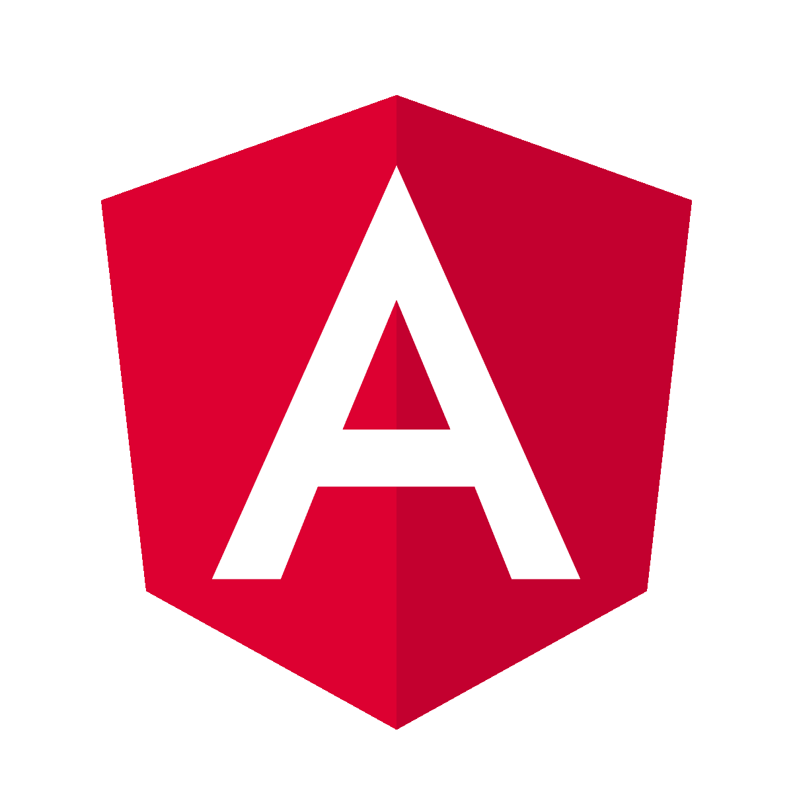
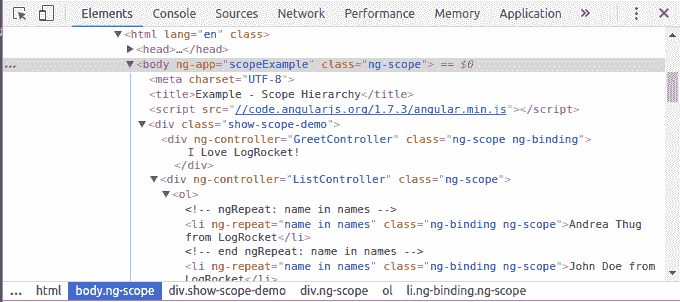
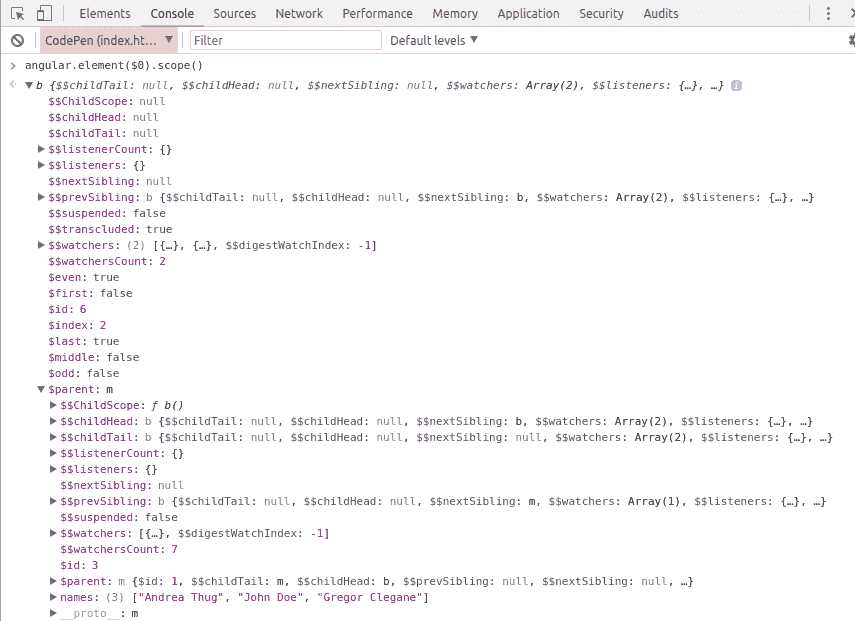

# 角度观测仪快速指南

> 原文：<https://blog.logrocket.com/a-quick-guide-to-angular-scopes-1888cc2b706b/>

[Claudio Ribeiro Follow](https://blog.logrocket.com/author/claudioribeiro/) Cláudio Ribeiro is a software developer, traveler, and writer from Lisbon. When he is not developing some cool feature at Kununu, he is probably backpacking somewhere in the world or messing with some obscure framework.

# 角度观测仪快速指南

## 

2018 年 8 月 29 日 3 min 读 1015

角度应用通常依靠控制器来控制应用中的数据流。然后，这些数据被传递到视图中进行渲染。为了将控制器和视图连接在一起，Angular 使用了一个名为 **scope** 的特殊对象。这个 scope 对象充当表达式的执行上下文，并模仿 DOM 结构分层排列。

在模板链接阶段，指令在作用域上设置 *$watch* 表达式。这些允许在属性发生变化时通知指令。这样，指令可以将更新后的值呈现给 DOM。

控制器和指令都可以访问作用域，但不能相互访问。现在，作用域确保了来自指令和 DOM 的控制器的正确封装。

见笔 [我爱 LogRocket！](https://codepen.io/DailyMatters/pen/wxNEWy/)由克劳迪奥( [@DailyMatters](https://codepen.io/DailyMatters) )
于 [CodePen](https://codepen.io) 。

正如我们在示例中看到的，控制器既可以将数据写入范围，也可以为其分配行为。

它首先将`LogRocket`赋给作用域的`initial`属性。然后将`sayIlove()`行为分配给`Love!`按钮。`sayIlove()`方法可以读取`initial`属性并创建一个`token`属性。在这个例子中，我们可以看到，当绑定到 HTML 输入小部件时，作用域上的属性可以自动更新。

当我们最终渲染`{{token}}`时，我们实际上:

*   检索与定义了`{{token}}`的 DOM 节点相关联的范围
*   根据上面检索的范围评估`token`表达式，并将结果赋给封闭 DOM 元素的文本。

总而言之，以一种非常简单的方式，范围可以被看作仅仅是用于呈现视图的数据。

#### 范围层次结构

每个角度应用程序都有一个根作用域，并且可以有任意数量的子作用域。每当创建 Angular 应用程序时，都会创建根作用域，但是之后，指令可以创建新的子作用域。当一个新的子作用域被创建时，它被添加为其父作用域的子作用域。这种子作用域树通常与它们所在的 DOM 平行。

这种效果的一个很好的例子是动态生成的列表。控制器从任何来源获取列表的每个元素，然后为每个元素创建一个新的范围。这个新的范围然后被传递给视图，在那里它将被绑定到一个新创建的 DOM 元素。正如我们在下一个例子中看到的:

参见克劳迪奥( [@DailyMatters](https://codepen.io/DailyMatters) )
关于 [CodePen](https://codepen.io) 的笔 [范围层次](https://codepen.io/DailyMatters/pen/zLbvQe/)。

快速范围层次结构示例。

A common DOM tree, check the `ng-scope` in all elements.

如果我们仔细观察 DOM 树，我们可以看到 Angular 将`ng-scope`添加到所有附加了作用域的元素中。所有这些子作用域都是必要的，因为根据计算表达式的作用域，会产生不同的结果。

`$scope`数据属性附加在 DOM 上，因此可以检索它用于调试。要在调试器中检查特定的范围，我们可以使用浏览器的内置调试器。这主要有三个步骤:

*   右键单击浏览器中感兴趣的元素，并选择*检查元素*选项。这将打开调试窗口，突出显示单击的元素。
*   如果尚未选择*控制台*选项，请选择该选项。调试器允许我们使用`$0`变量访问控制台中当前选中的元素。
*   要检索与当前元素相关的范围，执行`angular.element($0).scope()`命令。

Debugging a scope object.

#### 范围事件传播

与 DOM 事件类似，作用域也可以传播事件。该事件可以广播给子范围，也可以发送给父范围。下面的例子说明了如何做到这一点。

参见 [CodePen](https://codepen.io) 上 Claudio([@ daily matters](https://codepen.io/DailyMatters))
的笔 [角度范围事件传播](https://codepen.io/DailyMatters/pen/ajMMxP/)。

作用中的角度范围传播。

`$emit`函数用于通过作用域层次结构向上传播事件。正如我们在示例中看到的，当单击“emit”按钮时，事件被传播到较高的作用域层，这意味着根作用域。

`$broadcast`函数将事件向下传播到每个子作用域及其子作用域。在我们的示例中，当单击“broadcast”按钮时，事件被传播到较低的作用域层，这意味着子作用域和第二个子作用域。

#### 范围生命周期

在我们结束之前，让我们讨论一下范围生命周期。

Angular 使用我们称之为 *$digest — $apply* 循环的东西来处理事件的生命周期。

Angular 本身不知道模型修改。这是因为当浏览器调用 Javascript 时，代码在角度执行上下文之外运行。要进入角度执行上下文，需要调用`$apply`方法。对`$apply`的这个调用将计算传递给它的表达式，然后执行一个' $digest '。

`$digest`是一个内部循环，它运行整个应用程序，执行`$watch`表达式，并将返回的值与作用域中已经存在的前一个值进行比较。如果值不匹配，将触发一个侦听器。这个循环将一直运行，直到不再有侦听器被激发。

例如，像`$scope.company=LogRocket`这样的赋值不会立即触发`$watch`。这是`$digest`的责任，它可能会也可能不会触发`$watch`，这取决于已经在`$scope.company`上的值。

这种效果有利于角度性能，因为它将所有模型更新整合到一个单一的`$watch`通知中。它还确保我们不会进入不一致的状态，因为在给定时间只能运行一个`$watch`通知。对于额外的模型修改，必须触发新的`$digest`周期。

#### 结论

在这篇文章中，我们谈到了角度观测仪，以及它们如何成为角度应用的重要组成部分。我们查看了范围层次和事件，并触及了范围生命周期的基础。

我希望这篇文章能够让你开始使用角度观测仪，并更好地理解它们在每个角度应用中的重要性。

## 像用户一样体验 Angular 应用程序

调试 Angular 应用程序可能很困难，尤其是当用户遇到难以重现的问题时。如果您对监视和跟踪生产中所有用户的角度状态和动作感兴趣，

[try LogRocket](https://lp.logrocket.com/blg/angular-signup)

.

[https://logrocket.com/signup/](https://lp.logrocket.com/blg/angular-signup)

LogRocket 就像是网络和移动应用程序的 DVR，记录你网站上发生的一切，包括网络请求、JavaScript 错误等等。您可以汇总并报告问题发生时应用程序的状态，而不是猜测问题发生的原因。

LogRocket NgRx 插件将角度状态和动作记录到 LogRocket 控制台，为您提供导致错误的环境，以及出现问题时应用程序的状态。

现代化调试 Angular 应用的方式- [开始免费监控](https://lp.logrocket.com/blg/angular-signup)。

* * *