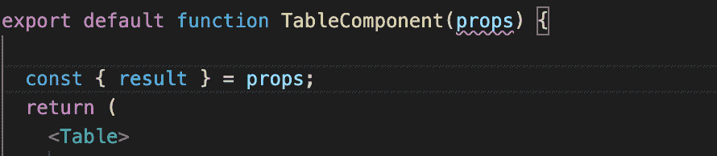

# 从 JavaScript 迁移到 TypeScript 的简单指南

> 原文：<https://blog.logrocket.com/a-simple-guide-for-migrating-from-javascript-to-typescript/>

您可能已经知道，TypeScript 是一种流行的静态类型检查器，是作为 JavaScript 的超集构建的。TypeScript 对于在执行之前发现类型错误非常方便——这是普通 Javascript 所没有的规则。然而，Typescript 运行起来和 Javascript 一样流畅。

我们将假设你用 JavaScript 开始了一个项目，现在重新开始已经太晚了。因此，您遇到了一个问题:您想在 TypeScript 中工作，但是已经进行了很长时间，无法重新开始。

你是做什么的？

在本文中，我们将介绍一种平稳高效地迁移到 Typescript 的方法。

当迁移到 TypeScript 时，要记住的一个基本事情是 TypeScript 文件有一个`.ts`扩展名，而不是`.js`。这很简单。要记住的另一件事是，要使迁移变得轻而易举，您可以配置您的 TypeScript 编译器来允许 JavaScript 文件。

正如我们前面所说的，TypeScript 只是 Javascript 之上的一个超集——因此，您可以一次迁移一个文件，而不必担心为迁移创建一个完全独立的分支。

说到编译器，最好不要去管当前捆绑或编译你的 JavaScript 的东西。TypeScript 有一种简单的方法，可以简单地将自己添加到编译器上，而不会把事情弄糟。如果你正在使用`npm`，你可以简单地运行`npm i -g typescript`。

在进一步了解 TypeScript 设置之前，需要考虑的一件事是您的 IDE 是否配置为使用 TypeScript。预编译自动更正 TypeScript 提供的功能，以及在这个阶段检测错误的能力，是您不想错过的功能。如果您使用的是 VS 代码，则内置了对 TypeScript 的支持。否则，您可能需要找到一个包来获得 IDE 对 TypeScript 的支持。

## 类型脚本编译器

现在您需要添加 TypeScript 编译器。

在项目的根目录下创建一个名为`tsconfig.json`的文件。有数百种方法来配置这个文件，但是让我们只看一些基本的。

在我们深入研究之前，您可以在项目的根目录下运行以下命令，而不是自己创建文件:

```
npx tsc --init
```

这将为您创建一个`tsconfig.json`文件，打开几个默认选项，并注释掉一些可能的选项供您查看。

如您所见，这将是一个 JSON 文件。因此，这里要配置的两个常见属性是`compileOptions`和`include`。

`CompileOptions`是一个对象，其中的选项可以设置为 true，以更改将 TypeScript transpiles 文件转换为 JavaScript 的方式。

例如，在`compileOptions`中，我们可以打开`noImplicitAny: true`(如果为 false，Typescript 将推断没有定义类型的“any”的类型)和`strictNullChecks: true`(如果为 false，TypeScript 将忽略“null”和“undefined”)。

打开这两个选项后，我们可以确定我们的`.ts`文件将实际检查类型。如果没有，您可以在`.ts`文件中运行普通的 JavaScript。

`include`选项是指定文件名或 glob 模式来匹配类型脚本文件的一种方式。它是一个数组，可以包含特定的文件名或所有 TypeScript 文件遵循的模式。一个简单的设置是简单地将这个选项定义为`include: ["src/**/*"]` ( `*_`匹配任何目录，而`_`匹配任何文件)。

默认情况下，选择`src`目录下扩展名为`.ts`、`.tsx`或`.d.ts`的任何文件。

如果您将`allowJs: true`添加到`compileOptions`中，那么上面定义的`include`也将包括我们的`src`目录中的`.js`和`.jsx`文件。

短边注释:`.d.ts`扩展和普通`.ts`的区别在于，`.d.ts`用于声明要打印的内容，而`.ts`用于打印编译成 JavaScript。`.d.ts`最常用于在`npm`模块中声明类型，让 TypeScript 知道，而`.ts`用于所有的 JavaScript 文件。`.ts`和`.tsx`的区别在于`.tsx`用于 JSX 文件，就像 React 组件一样。

另一个需要理解的基本选项是`exclude`。如果您的`exclude`范围很广，那么您可能不希望编译器匹配某些文件。例如，包含所有内容是一种选择，但是您可能希望将`node_modules`放在 exclude 数组下。

关于配置你的 TypeScript 编译器的更多信息，请参见官方文档。

一旦完成了对`tsconfig.json`文件的配置，就可以在`package.json`中添加一个脚本来运行编译器。在脚本下，添加类似于`"tsc:w": "tsc -w"`的内容。然后你可以运行脚本，它将指向你的`tsconfig.json`文件并编译！

### `@types`

如果你使用像 React 这样的前端框架，你还需要安装`@types`包。因为 TypeScript 中的所有东西都需要类型定义，所以像`@types/react`这样的包会让 TypeScript 知道所有基本的 React 类、函数、组件等的类型。

这是满足 TypeScript 所必需的，也是理所当然的。你还需要记住将类型添加到添加到你的项目中的任何其他库中(例如`@types/react-router-dom`、`@types/react-bootstrap`或`@types/react-redux`)。

* * *

### 更多来自 LogRocket 的精彩文章:

* * *

`@types`包的另一个例子是`@types/node`。如果没有这个包，我们习惯的关键字在 Typescript 文件(`.ts`文件)中将无法被识别。

例如，使用`require`来导入一个包，将会返回如下错误:`Error:(3, 12) TS2304:Cannot find name 'require'`。包`@types/node`为 TypeScript 定义了这一点，所以我们现在可以使用`require`而不会出错。

一些 JavaScript 包中已经编写了类型。这些不需要安装类型包。但是，如果包中没有编写类型，也没有要安装的类型包，该怎么办呢？

首先，这很难找到，因为 TypeScript 有很多支持。但是，如果你广泛使用 TypeScript，你将不可避免地发现一个没有 TypeScript 支持的 JavaScript 包。

这里最简单的解决方案是简单地让 TypeScript 编译器知道你的模块存在。这不会将 TypeScript 添加到包中，但会绕过 TypeScript 检查器并允许您使用它。有很多方法可以解决这个问题，比如自己将 TypeScript 完全添加到包中(大多数情况下需要做很多工作)，但这只是一个简单的解决方法。

创建一个文件，命名如下:`MyModuleDesc.d.ts`(T1 是重要的部分)。

在该文件中，只需编写`declare module "my-module"`(其中“my-module”是没有 Typescript 的包)。然后，在您的`tsconfig.json`文件中，在`include`数组下，添加`MyModuleDesc.d.ts`文件(假设这个文件在您的项目的根目录下)。

### 反应示例

好了，基本的操作方法已经讲得够多了，让我们实际看看这种迁移是如何进行的。我为从 Swapi.dev 接收的数据创建了一个简单的表:

```
export default function TableComponent(props) {

  const { result } = props;
  return (
    <Table>
      <Row><Cell>{result.name}</Cell></Row>
      <Row><Cell>Hair Color</Cell><Cell>{result.hairColor}</Cell></Row>
      <Row><Cell>Height</Cell><Cell>{result.height}</Cell></Row>
      <Row><Cell>Weight</Cell><Cell>{result.weight}</Cell></Row>
      <Row><Cell>Date of Birth</Cell><Cell>{result.dateOfBirth}</Cell></Row>
      <Row>
        <Cell>{result.filmNames.length <= 1 ? "Film" : "Films"}</Cell>
        <Cell>{result.filmNames.length === 0 ?
          "None" :
          result.filmNames.map((film, idx) => (
            <LineItem key={'film' + idx}>{film}</LineItem>))}
        </Cell>
      </Row>
    </Table>
  )
}
```

这将成为一个好榜样。我们在这里看到的每个元素都是我在别处定义的一个`styled-component`；它们是这样定义的`const Table = styled.div;`(在引号之间定义了一堆 CSS)。

首先，在我的项目中完全没有使用任何类型脚本。文件名是`TableComponent.js`，为了简单起见，它是 App.js 的子文件。我最初是用`create-react-app`初始化这个项目的——你也可以很容易地这样做。你唯一需要跟随的包裹是`styled-components`。

接下来要添加 TypeScript，可以通过`npm`安装几样东西:

```
npm i --save typescript @types/react @types/react-dom @types/styled-components
```

在这一级别，让我们在终端中运行命令:

```
npx tsc --init
```

这将创建我们的`tsconfig.json`文件。

现在，您可能会注意到您的`tsconfig.json`文件中有一个错误。如果您将鼠标悬停在该文件中最上面的第一个花括号上，您将会看到以下错误:

"错误 TS18003:在配置文件`tsconfig.json`中找不到输入。指定的`include`路径为`["**/*"]`，`exclude`路径为`[]`

我注意到这个错误时不时地出现，如果你关闭你的编辑器然后再打开，但是如果你试着运行你的应用程序，你会看到这个错误。

这里的基本思想是，我们至少需要一个 TypeScript 文件，编译器才能工作。让我们把`TableComponent.js`的文件名改成`TableComponent.tsx`。您可能需要重新启动 IDE，就像我在使用 Visual Studio 代码时所做的那样，但是您应该会在道具下和其他一些地方看到红线，这表示有错误。

我们将到达那里，但是首先让我们试着用这个命令运行它:

```
npm run start
```

它会变得很远，你甚至可以看到应用程序组件完成了，但是我们的`TableComponent`会显示一个错误。

更具体地说，您将看到一个 Typescript 错误:“参数`props`隐式地具有一个`any`类型。TS7006”。

这正是红线所指示的。这是因为`noImplicitAny`被默认为 true，而这正是我们想要的。我们可以转到我们的`tsconfig.json`文件，并将其更改为 false。然后，我们将没有错误，但基本上有普通的 JavaScript。



值得注意的一点是，TypeScript 运行在我们当前的 bundler 之上，而没有干扰它。

我们做了一个`npm run start`,尽管我们似乎没有调用任何类型脚本。从技术上讲，当`noEmit`选项设置为 true 时，TypeScript 只是在我们的 JSX 中检查类型，但是我们的 bundler 发出/输出它。另一件事是查看`tsconfig.json`文件——它读取了我们的应用程序，并为我们填写了一些默认选项。

让我们也注意一下 TypeScript 在我们的项目中做了什么:它在我们的`src`文件夹中自动创建了一个名为`react-app-env.d.ts`的文件。这个文件并不太重要，但是您会注意到，即使您删除了它，它也会在每次启动/构建时自动生成。让 TypeScript 了解`react-scripts`类型是一件奇怪的事情。

事不宜迟，让我们把这个文件改成 TypeScript。

### JSX 到 TSX

我们可以通过在变量末尾添加`: any`来轻松消除红线错误，但这基本上没用。

一个更好的方法是做 TypeScript 应该做的事情:检查类型以避免错误。让我们从解决映射函数中的变量开始:“电影”。

你会看到它们下面有红线，坦白地说，它们是最容易理解它们所需要的类型:它们都是字符串，所以我们可以很容易地浏览并在最后加上注释:`: string`。

然后，我们可以用`: number`注释`idx`，它会满足 TypeScript 编译器。所有这些都没问题，但是 props 变量仍然存在问题，它仍然没有注释。老实说，在 JSX 仔细检查道具并做注解并不是最好的方式。

更好的方法是为传入的道具创建我们自己的 TypeScript 接口或类型。现在，当我们从一个 API(或者更好，如果我们已经创建了它，也在 API 中)获取结果时，我们可能已经在父`App.js`组件中正常地完成了这一点，但是因此你可以看到 TypeScript 的灵活性，你甚至不需要这样做。

让我们为我们的道具创建一个类型:

```
type Props = {
  result: Result,
};
```

然后输入结果:

```
type Result = {
  name: string,
  hairColor: string,
  height: string,
  weight: string,
  dateOfBirth: string,
  filmNames: string[],
};
```

然后，简单注释一下道具:`props: Props`。现在，你应该看到电影不再是红色下划线。

我们可以把这些接口中的每一个都做成一个新的类型，但是作为一个通用的经验法则，尽量把更多受控的东西(比如道具)做成一个类型。关于在类型和接口之间选择的更多信息，请参见这篇文章。

## 样式组件

这绝不是完整的 TypeScript 指南。然而，为了看更多的基础知识，让我们看看`styled-components`。

现在我们没有错误，但是关于样式化组件的一个很棒的事情是能够传入一个道具，所以你可以重用相同的定义，并根据道具做一点改变。

例如，在我们的 JSX 中，我们希望第一个单元格(一个样式化的组件)占据整个表格的宽度，但是其他单元格应该只有一半的宽度。所以让我们在这里放一个“头”道具:

```
<Cell header> {result.name} </Cell>.
```

TypeScript 不喜欢这个，也不知道怎么处理。以下是我目前对细胞的定义:

```
const Cell = styled.div`
  padding: 5px 20px;
  display: flex;
  border: 1px solid black;
  flex-direction: column;
  justify-content: center;
  align-items: center;
  width: 50%;
`;
```

通常，我们可以将我们的道具添加到我们创建的样式中，如下所示:

```
width: ${props => props.header ? '100%' : '50%}
```

但是我们会看到，根据 TypeScript，header 在这里也是一个错误，因为我们还没有定义它。

我们需要为细胞道具创造一种新的类型，就像这样:

```
type cellProp = {
  header: boolean,
};
```

现在将它添加到我们创建的单元组件中:

```
const Cell =
  styled.div <
  cellProp >
  `
        ...
        width: ${(props) => (props.header ? "100%" : "50%")};
    `;
```

这将清除错误。然后我们得到了其他东西:Cell 的每个其他实例都得到一个错误，因为它没有 header 属性。

这可能看起来很奇怪，但这是预期的行为——我们告诉 TypeScript Cell 的每个实例都需要这个头布尔值。

我们可以遍历并使每个实例都有一个 prop `header={false}`，但这在我们的 JSX 中是额外的混乱。

一个更好的解决方案是让 header prop 可选。我们可以通过在类型定义中添加一个问号来轻松做到这一点:

```
type cellProps = {
  header?: boolean,
};
```

维奥拉。不再有错误。

## 结论

这有点将 React 组件迁移到 TypeScript 的味道。如您所见，迁移到 TypeScript 一点也不麻烦。它很灵活，所以您可以在需要它的文件上使用它，同时等待优先级较低的文件。在您知道之前，您可以让 TypeScript 在您的项目中工作！

更多信息，请参见[正式文档](https://www.typescriptlang.org/)。

## [LogRocket](https://lp.logrocket.com/blg/typescript-signup) :全面了解您的网络和移动应用

[](https://lp.logrocket.com/blg/typescript-signup)

LogRocket 是一个前端应用程序监控解决方案，可以让您回放问题，就像问题发生在您自己的浏览器中一样。LogRocket 不需要猜测错误发生的原因，也不需要向用户询问截图和日志转储，而是让您重放会话以快速了解哪里出错了。它可以与任何应用程序完美配合，不管是什么框架，并且有插件可以记录来自 Redux、Vuex 和@ngrx/store 的额外上下文。

除了记录 Redux 操作和状态，LogRocket 还记录控制台日志、JavaScript 错误、堆栈跟踪、带有头+正文的网络请求/响应、浏览器元数据和自定义日志。它还使用 DOM 来记录页面上的 HTML 和 CSS，甚至为最复杂的单页面和移动应用程序重新创建像素级完美视频。

[Try it for free](https://lp.logrocket.com/blg/typescript-signup)

.