# 用 React 钩子访问以前的道具或状态

> 原文：<https://blog.logrocket.com/accessing-previous-props-state-react-hooks/>

***编者按*** :本帖最后更新于 2022 年 1 月 28 日，包含第三方库的状态管理。

在使用 React 钩子时，从功能组件中访问以前的属性或状态是您可能会遇到的看似简单的问题之一。虽然目前还没有现成的 React 钩子来做这件事，但是您可以通过利用 React 中的`useRef`、`useState`、`usePrevious`和`useEffect`钩子，从功能组件中手动检索以前的状态或道具。在这篇文章中，我们将学习如何。


### 目录

## 示例:获取上一个道具或状态

如果你查看 React 官方文档，[你会看到下面的例子](https://reactjs.org/docs/hooks-faq.html#how-to-get-the-previous-props-or-state)，其中`Counter`代表一个简单的计数器组件:

```
function Counter() {
  const [count, setCount] = useState(0);
//the useRef Hook allows you to persist data between renders
  const prevCountRef = useRef();
  useEffect(() => {
    //assign the ref's current value to the count Hook
    prevCountRef.current = count;
  }, [count]); //run this code when the value of count changes
  return (
    <h1>
      Now: {count}, before: {prevCountRef.current}
      {/*Increment  */}
      <button onClick={() => setCount((count) => count + 1)}>Increment</button>
    </h1>
  );
}

```

上面的代码生成以下输出:

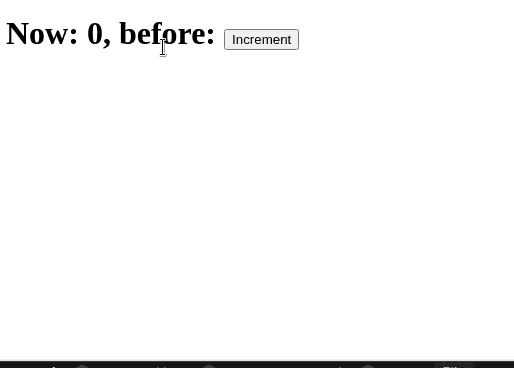

## 用`usePrevious`钩子定制钩子

但是，如果您正在寻找一个更快的解决方案，您可以构建以下自定义挂钩:

```
function usePrevious(value) {
  const ref = useRef();
  useEffect(() => {
    ref.current = value; //assign the value of ref to the argument
  },[value]); //this code will run when the value of 'value' changes
  return ref.current; //in the end, return the current ref value.
}
export default usePrevious;

```

要在应用程序中使用自定义挂钩，请编写以下代码:

```
function Counter() {
  const [count, setCount] = useState(0);
  // 👇 look here
  const prevCount = usePrevious(count)

  return <h1> Now: {count}, before: {prevCount} </h1>;
}

```

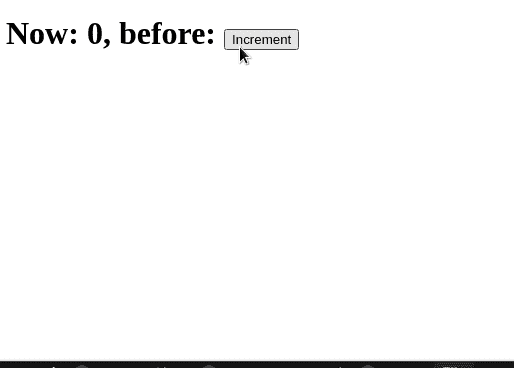

虽然这个例子看起来很简单，但是你真的能解释一下`usePrevious`钩子是如何工作的吗？让我们清楚地了解一下定制钩子中发生了什么，以及先前的值是如何保留的。

## 深度:一个被忽视的反应钩

我每天都用钩子工作，无论是个人项目还是专业的工作场所项目。根据我的经验，[我发现很少有人真正理解并利用`useRef`钩子](https://blog.logrocket.com/usestate-vs-useref/)。

除了擅长处理 DOM refs 之外，`useRef` Hook 还是在函数组件中实现类实例变量的完美替代品。此外，它会记住 UI 呈现之间的数据，允许开发人员访问以前被覆盖的值。

考虑下面的类组件示例:

```
// class component 
class Count extends React.Component {

   constructor() {
     this.specialVariable = "SPECIAL_VARIABLE"
   }

  render() {
    return null
  }
}

```

每个实例化的`Count`类都有自己的`specialVariable`实例变量。`useRef`钩子可以用一个更有趣的特性来模拟这种行为:

```
// functional component 

function Count() {
  const specialVariable = useRef("SPECIAL_VARAIBLE"); //store initial value into the specialVariable Hook. 
  return null
}

```

`useRef`钩子取一个要存储的初始值，即`useRef("INITIAL_VALUE")`，返回一个当前属性为`{current: "INITIAL_VALUE"}`的对象。

最初传递给`useRef`钩子的任何值都被保存到`ref`对象的`current`属性中:

```
function Count() {
  const specialVariable = useRef("SPECIAL_VARAIBLE");
  // specialVariable resolves to {current: "SPECIAL_VARIABLE"}
  console.log(specialVariable); //for debugging purposes, log out its value
  return null;
}

```

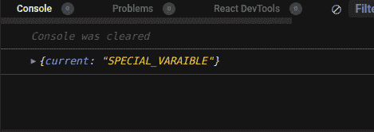

与普通变量不同，当重新呈现`Count`组件时，不会重新计算`specialVariable` ref 对象。使用`useRef`钩子，保存在`ref`对象中的值在重新渲染时保持不变。该值既不会丢失，也不会重新计算；它保持不变。

## 用`useRef`检索以前的道具和状态

值得一提的是，更新`ref`对象的唯一方法是直接设置当前属性的值，即`specialVariable.current = "NEW_SPECIAL_VARIABLE`。为什么这个解释很重要？

为了理解发生了什么，让我们一步一步地执行前面提到的检索以前的道具和状态的解决方案:

```
// custom hook for getting previous value 
function usePrevious(value) {
  const ref = useRef();
  useEffect(() => {
    ref.current = value;
  },[value]);
  return ref.current;
}

// the App where the hook is used 
function Counter() {
  const [count, setCount] = useState(0);
  // 👇 look here
  const prevCount = usePrevious(count)

  return <h1>Now: {count}, before: {prevCount}</h1>;
}

// How the App is rendered 
<Counter />

```

当`Counter`应用程序的渲染过程开始时，首先调用`useState`钩子，并设置变量`count`和`setCount`。注意`count`现在是`0`:

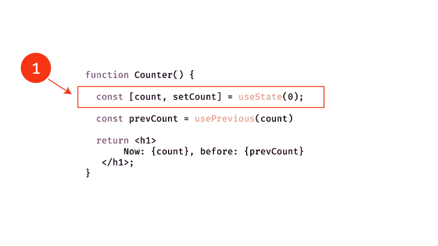

之后，将执行下一行。用计数状态变量`0`的当前值调用`usePrevious`钩子:

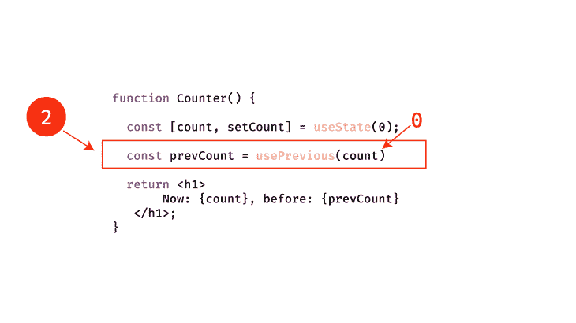

在调用`usePrevious`钩子时，React 创建一个新的`useRef`实例:

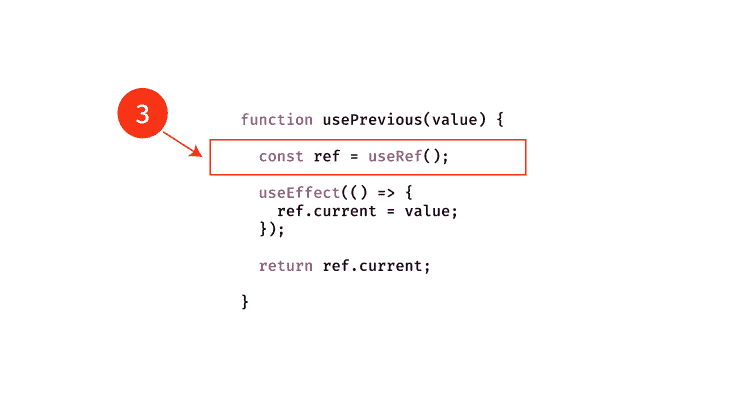

这个钩子的初始值是`undefined`。控制台返回`{current: undefined}`，因为当前数据不存在。

下一步是大多数人犯错的地方。React 不执行`useEffect`调用，而是返回定制钩子的当前值:

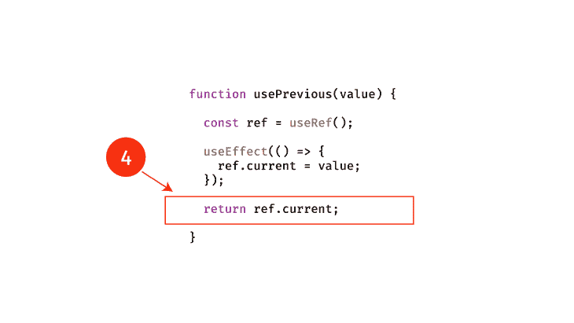

只有在调用钩子的组件被渲染后，钩子才会被调用。本质上，必须首先执行组件的返回值。

接下来，组件内的执行继续。这一次，`prevCount`变量保存值`undefined`:

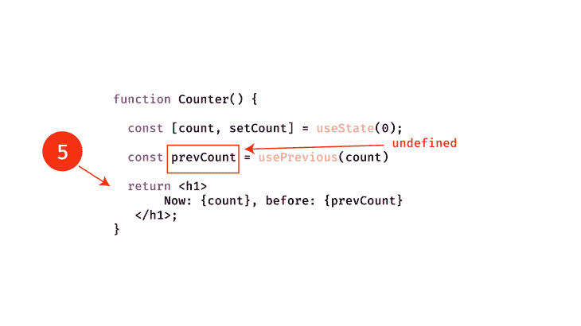

组件的返回值被计算:

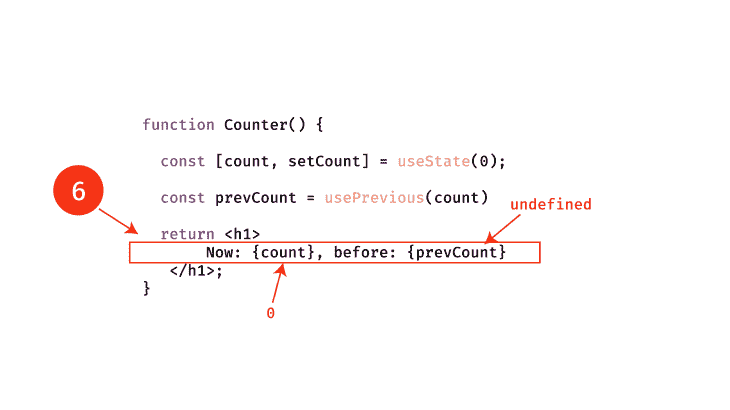

该过程将`<h1>Now: {count}, before: {prevCount}</h1>`返回到屏幕，其中`count`和`prevCount`分别是`0`和`undefined`。

为了避免阻止浏览器绘制 DOM 变化，现在异步调用`usePrevious`钩子中的`useEffect`调用。`useEffect`在功能组件渲染后被调用:

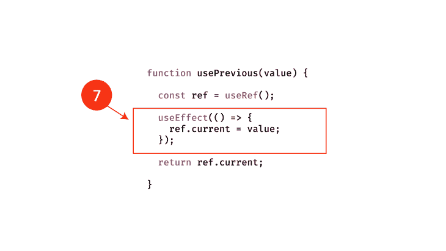

在效果函数中，我们有以下内容:

```
useEffect(() => {
    ref.current = value;
},[value]);

```

`useEffect`函数中的代码行将`ref`对象的当前属性更新为值。`value`现在表示自定义钩子最初被调用时的名称。

在这种情况下，值为`0`。在这个电流流中，记住`usePrevious`只被用`0`的初始值调用过一次。

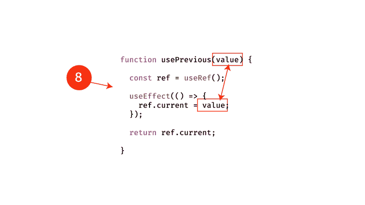

现在，ref 保存值`0`。当应用程序中的`count state`变量从`0`更新为`1`，或者更新为新的计数时，应用程序将再次运行这段代码。

用新的状态值`1`调用`usePrevious`钩子。然后，计算 return 语句，返回`ref.current`，这将是`0`，而不是`1`，因为 ref 对象还没有更新。

这里，`ref.current`是在`useEffect`被触发之前存储的前一个值，或者是`0`。组件的`return`语句与先前成功返回的值相等。

只有在渲染之后，`usePrevious`钩子中的`useEffect`调用才会用新值`1`更新。这个循环继续下去，通过这种方式，您总是可以将之前的值传递给自定义钩子，`usePrevious`。

### 为什么会这样

要理解为什么我们可以以这种方式访问以前的属性或状态，您必须记住以下几点:

1.  `ref`对象将总是返回保存在`ref.current`中的相同值，除非它被显式更新
2.  `useEffect`仅在组件使用之前的值呈现后调用。只有在渲染完成后，ref 对象才会在`useEffect`内更新

通过利用这两个事实，您可以轻松地自行复制这一功能。

## 使用 Zustand

如果你想使用第三方库进行简单的状态管理，我推荐使用 [Zustand API](https://github.com/pmndrs/zustand) 。 [Zustand](https://blog.logrocket.com/using-zustand-to-simplify-state-management/) [允许你创建订阅者](https://blog.logrocket.com/using-zustand-to-simplify-state-management/)，这些函数让你获得你的状态变量的先前和当前值。

首先，创建一个商店及其订户，如下所示:

```
import create from "zustand";
const useStore = create((set) => ({
  dollars: 0,
  increaseIncome: () => set((state) => ({ dollars: state.dollars + 1 }))
}));
//create a subscriber
const unsubscribe = useStore.subscribe((newValue, oldValue) => {
  console.log(
    "new Value " + newValue.dollars + ", old Value:" + oldValue.dollars
  );
});

```

首先，我们声明了一个名为`dollars`的全局变量。它的初始值将是`0`。然后，我们创建了一个名为`increaseIncome`的函数。如果用户执行该方法，程序将增加`dollars`状态。

然后我们编写了一个订户函数，它将记录变量`dollars`的当前值和旧值。要实际使用该存储，请编写以下代码:

```
export default function App() {
  //extract our state and functions
  const dollars = useStore((state) => state.dollars);
  const increaseIncome = useStore((state) => state.increaseIncome);
  return (
    <div>
      <h1> Current: ${dollars} </h1>
      {/*When clicked, execute the 'increaseIncome' function */}
      <button onClick={() => increaseIncome()}>Increment </button>
    </div>
  );

```

使用上面的代码，我们从我们的自定义存储中获得了`dollars`变量和`increaseIncome`函数:

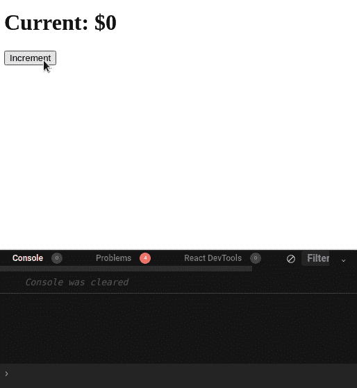

## 结论

在本文中，我们学习了如何从 React 中的`useRef`、`useState`、`usePrevious`和`useEffect`钩子获取先前的值。

调用`useRef`返回的`ref`对象在功能组件的重新渲染中保持不变，这是一个非常强大的特性。它不需要你像在`useMemo`或`useCallback`中那样传递任何数组依赖就可以做到这一点。

当您将使用`useRef`作为实例变量的能力与`useEffect`钩子总是在父组件的 return 语句被求值之后被触发的事实结合起来时，您就有了一个无价的武器。

* * *

### 更多来自 LogRocket 的精彩文章:

* * *

感谢您的阅读，祝您编码愉快！