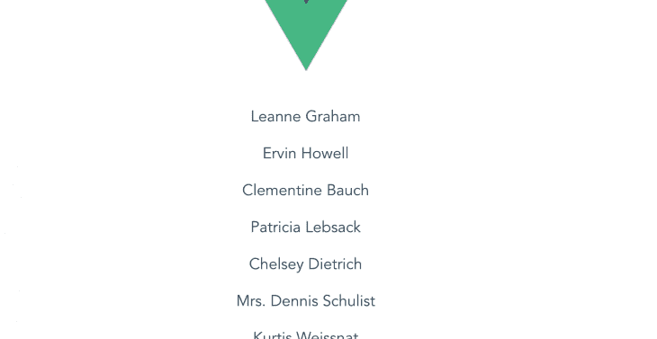

# 使用原型在 Vue.js 中全局访问属性

> 原文：<https://blog.logrocket.com/accessing-properties-globally-in-vue-js-with-prototypes/>

在这篇文章中，你将被介绍使用 [Vue.js](https://blog.logrocket.com/how-to-make-your-components-dynamic-in-vue-js/) 中的原型来全局访问属性，而不是在你的工作流中使用多个导入。

## 开始之前…

这篇文章适合所有阶段的开发者，包括初学者。在阅读本教程之前，您应该已经掌握了以下一些东西:

## 导入如何帮助我们访问文件

在您的 Vue 项目中工作时，访问另一个项目或嵌套项目中的新组件的最快方法就是导入所需的组件或资源。

然而，这很容易变得低效，因为您将不得不重复 import 语句，甚至为每次导入注册组件(如果它们*是*组件)。幸运的是，Vue 提供了一种更有效的方法来处理这种情况，在这种情况下，您已经全局定义了一个数据对象或一个传入的 HTTP 请求。

## `Vue.prototype`

为了在你的 Vue 应用中创建一个全局属性，然后通过属性语句而不是导入语句来访问它，Vue 提供了一个我们称之为原型的平台。这样，您定义了全局属性或数据对象，告诉 Vue 记住它，然后只需一行代码就可以在任何组件中访问它。

### 原型语法

主 JavaScript 文件中 Vue 原型的定义如下所示:

```
Vue.prototype.$blogName = ‘LogRocket’
```

这里，`blogName`是属性或数据名，`LogRocket`字符串是值。有了这个定义，Vue.js 就可以让整个项目中的每个 Vue 实例使用这个属性(在我们的例子中是博客名),甚至在实例创建之前。

### `$`标志

在 Vue.js 中使用`$`符号来标识可以在任何给定 Vue 项目的所有可用实例中使用的属性。这种区分是由于与属性名称定义和访问相关的冲突。有了`$`符号，所有实例可用的属性和全局属性之间就有了明显的区别。

### 演示

要完成这一部分，您必须从头开始阅读这篇文章，从上面的链接下载 starter 项目，并在 VS 代码中打开它。为了说明上一节中的语法示例，打开您的`main.js`文件并添加原型定义，因此整个文件如下所示:

```
import Vue from 'vue'
import App from './App.vue'
Vue.config.productionTip = false
Vue.prototype.$blogName = 'LogRocket'
new Vue({
  render: h => h(App),
}).$mount('#app')
```

现在您已经定义了一个属性名，打开您的根组件并复制下面的代码块:

```
<template>
  <div id="app">
    
    <Test msg="Welcome to Your Vue.js App"/>
  </div>
</template>
<script>
import Test from './components/Test.vue'
export default {
  name: 'app',
  components: {
    Test
  },
   beforeCreate: function() {
    console.log(this.$blogName)
  }
}
</script>
```

这里你可以看到,`beforeCreate`生命周期钩子方法被用来验证关于 Vue 原型的实例化声明。如果您在您的开发服务器上运行该应用程序，您将会看到保存的名称(LogRocket)显示在您的浏览器控制台中。

## 一些 Vue 原型用例

许多数据值、属性和实用程序(如 HTTP 资源)可以通过 Vue 原型成为全局属性。在这一节中，我将介绍其中的几个。

### 用作原型

Vue.js 不仅允许添加属性，还允许添加方法作为原型。这样，使用原型的每个实例都可以访问原型定义中设置的逻辑。

这包括使用`this`访问数据、计算属性，甚至项目中任何 Vue 实例内的其他方法。一个简单的例子就是使用字符串反转函数。在您的`main.js`文件中，在旧原型下添加新原型:

```
Vue.prototype.$reverseString = function(x) {
  this[x] = this[x]
    .split('')
    .reverse()
    .join('')
}
```

将下面的代码块复制到您的`app.vue`文件中:

```
<template>
  <div id="app">
    
    <Test msg="Welcome to Your Vue.js App"/>
  </div>
</template>
<script>
import Test from './components/Test.vue'
export default {
  name: 'app',
  components: {
    Test
  },
  data() {
    return {
      msg: 'LogRocket'
    }
  },
   beforeCreate: function() {
    console.log(this.$blogName)
  },
  created: function() {
    console.log(this.msg) 
    this.$reverseString('msg')
    console.log(this.msg) 
  }
}
</script>
```

这里，创建的生命周期钩子被用来记录`reverseString`函数，如果您在 dev 服务器中运行您的应用程序，您将看到 LogRocket 被反向打印。

### 进口原型

如果您的应用程序与第三方 API 通信，您通常必须在您想要发出`get`请求的每个组件上导入 [Axios](https://blog.logrocket.com/axios-or-fetch-api/) 。下面是一个简单的例子——在 VS 代码应用程序中打开一个新的终端并安装 Axios:

```
npm install axios
```

现在，转到您想要发出`get`请求的`app.vue`文件，并将这段代码块复制到其中:

```
<template>
  <div id="app">
    
    <Test msg="Welcome to Your Vue.js App"/>
    <div v-for="user in users" :key="user.id">
      <p>{{user.name}}</p>
    </div>
  </div>
</template>
<script>
import Test from './components/Test.vue'
import axios from 'axios'
export default {
  name: 'app',
  components: {
    Test
  },
  data() {
    return {
      msg: 'LogRocket',
      users: []
    }
  },
  created: function (){
      axios.get('https://jsonplaceholder.typicode.com/users')
      .then(res => {
        this.users = res.data;
      })
  }
  ,
   beforeCreate: function() {
    console.log(this.$blogName)
  }
}
</script>
```

您将会注意到，对于您想要发出 get 请求的每个组件，您都必须重复这个 import 语句。为了解决这个问题，Vue 允许您使用 prototype 特性一次性导入项目中的任何 Vue 实例。

打开您的`main.js`文件，并将下面的代码块复制到其中:

```
import Vue from 'vue'
import App from './App.vue'
import axios from 'axios'
Vue.config.productionTip = false
Vue.prototype.$blogName = 'LogRocket'
Vue.prototype.$reverseString = function(x) {
  this[x] = this[x]
    .split('')
    .reverse()
    .join('')
}
Vue.prototype.$axios = axios
new Vue({
  render: h => h(App),
}).$mount('#app')
```

在您的`app.vue`文件中，删除 import 语句并使用您已经创建的`$axios`别名，如下所示:

```
<script>
import Test from './components/Test.vue'
export default {
  name: 'app',
  components: {
    Test
  },
  data() {
    return {
      msg: 'LogRocket',
      users: []
    }
  },
  created: function (){
      this.$axios.get('https://jsonplaceholder.typicode.com/users')
      .then(res => {
        this.users = res.data;
      })
  }
  ,
   beforeCreate: function() {
    console.log(this.$blogName)
  }
}
</script>
```



你可以在 GitHub 上找到本教程[的完整代码。](https://github.com/viclotana/vue_prototypes)

## 结论

现在，您已经了解了在 Vue 中使用原型的概念，以使属性对项目中的所有 Vue 实例全局可用。还向您展示了使用原型的优势，包括但不限于更高效的工作流。黑客快乐！

## 像用户一样体验您的 Vue 应用

调试 Vue.js 应用程序可能会很困难，尤其是当用户会话期间有几十个(如果不是几百个)突变时。如果您对监视和跟踪生产中所有用户的 Vue 突变感兴趣，

[try LogRocket](https://lp.logrocket.com/blg/vue-signup)

.

[](https://lp.logrocket.com/blg/vue-signup)[https://logrocket.com/signup/](https://lp.logrocket.com/blg/vue-signup)

LogRocket 就像是网络和移动应用程序的 DVR，记录你的 Vue 应用程序中发生的一切，包括网络请求、JavaScript 错误、性能问题等等。您可以汇总并报告问题发生时应用程序的状态，而不是猜测问题发生的原因。

LogRocket Vuex 插件将 Vuex 突变记录到 LogRocket 控制台，为您提供导致错误的环境，以及出现问题时应用程序的状态。

现代化您调试 Vue 应用的方式- [开始免费监控](https://lp.logrocket.com/blg/vue-signup)。