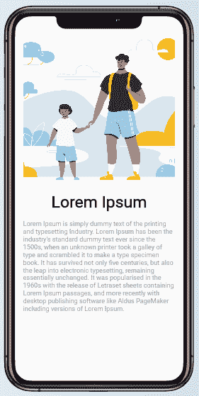
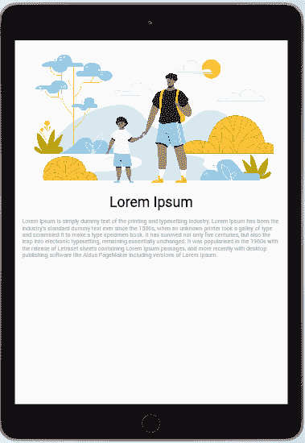
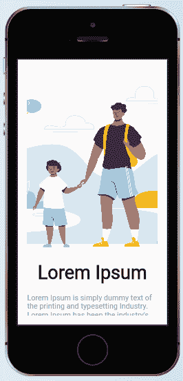
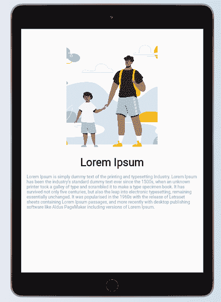
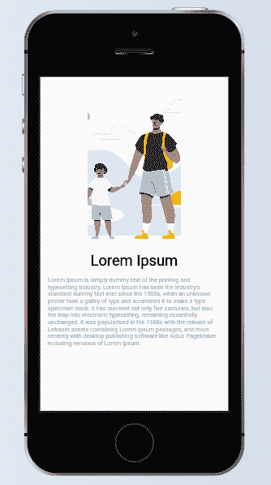

# 在 Flutter - LogRocket 博客中实现响应式设计

> 原文：<https://blog.logrocket.com/achieving-responsive-design-flutter/>

您的应用程序和网站的访问者希望获得适合他们设备的用户体验。糟糕的用户体验不会让你获得实现营销和销售目标所需的用户保持率。

用户可用的设备有不同的规格，这就是为什么响应式设计很重要。

在本文中，我们将讨论如何在 Flutter 中为移动设备创建响应式设计，首先快速回顾一下为什么响应式设计对 Flutter 很重要。

## 为什么响应设计在颤振中很重要？

一些额外的好处来自于用响应式设计创建的 Flutter 应用程序。

不同屏幕尺寸的应用程序的一致性可以确保您拥有更广泛的用户。平板电脑和更小的移动设备可以享受量身定制的用户体验。

此外，一旦你考虑了响应式设计，你的应用程序的保留率往往会更高。

由于 [Flutter 是 web 和移动应用](https://blog.logrocket.com/how-to-create-desktop-applications-with-flutter/)的良好选择，响应式设计可确保您的应用程序的吸引力保持一致，并为用户提供无缝体验，无论使用的设备大小如何。

不言而喻，如果你在应用程序中考虑到响应能力，也可以避免负面评价。App store 上有超过 200 万个应用程序，Google Play store 上有超过 300 万个应用程序。大多数用户根据评论决定下载哪些应用程序。

你会希望在这些评论中处于有利的一面。因此，您应该将响应能力纳入您的应用程序开发清单。

## 颤振响应设计的选择

颤振响应设计没有通用的解决方案。在您的 Flutter 应用程序中，有不同的方法来获得响应。

根据[官方文件](https://flutter.dev/docs/development/ui/layout/adaptive-responsive)，一些流行的方法包括:

### `LayoutBuilder`

`[LayoutBuilder](https://api.flutter.dev/flutter/widgets/LayoutBuilder-class.html)`有一个 builder 属性，可以为我们提供`BoxConstraint`对象，该对象包含特定小部件的约束信息。我们可以使用像`maxWidth`和`maxHeight`这样的信息来决定我们想要如何呈现我们的显示。

这些值将帮助我们根据分配给小部件的大小约束来调整显示。更重要的是，当这些值由于屏幕旋转之类的事件而改变时，`LayoutBuilder`将调用我们的`build`函数，该函数根据我们拥有的新约束重新构建小部件。

### `MediaQuery`

`[MediaQuery](https://api.flutter.dev/flutter/widgets/MediaQuery/of.html)`类不仅为我们提供了小部件的尺寸，还提供了运行时应用程序的整个屏幕尺寸以及当时的设备方向。

每当这些配置改变时，我们的`build`方法也会被调用，这确保我们的小部件树被重建以反映最近的改变。

### `AspectRatio`

`[AspectRatio](https://api.flutter.dev/flutter/widgets/AspectRatio-class.html)`是一个小部件，试图将孩子的大小调整到一个特定的长宽比。
小工具首先尝试布局约束允许的最大宽度。小部件的高度是通过将给定的长宽比应用于宽度来确定的，表示为宽度与高度的比率。

## 颤振响应的简单方法

虽然这些文档提供了很好的选择，但本文将探索一种更简单的方法来实现响应式设计。建议您对此进行适当的评估，以了解它是否是您的应用程序的正确方法。

由于 Flutter 的开源特性和 Flutter 社区的共同努力，您可以使用两个包来实现响应:

我们将在本教程中介绍 FlutterScreenUtil。

### 入门指南

首先，我们将构建一个简单的用户界面屏幕，如下图所示:



在为移动应用程序创建用户界面时，最好不要硬编码小部件的尺寸值，而是使用百分比来表示尺寸。在颤振中，这可以通过使用`MediaQuery`类来实现。

为了创建上面的屏幕，下面是我们使用的代码片段:

```
import 'package:flutter/material.dart';

class HomePage extends StatelessWidget {
  const HomePage({Key key}) : super(key: key);

  @override
  Widget build(BuildContext context) {
    return SafeArea(
      child: Scaffold(
          body: Padding(
            padding: EdgeInsets.all(20),
            child: SingleChildScrollView(
              child: SizedBox(
                width:double.infinity,
                child: Column(
        children: [
                Container(
                  height:MediaQuery.of(context).size.height/2,
                  width: MediaQuery.of(context).size.width/2,
                  decoration: BoxDecoration(
                      image: DecorationImage(
                          image: AssetImage('assets/family.png'), fit: BoxFit.cover)),
                ),

                Text("Lorem Ipsum",
                    style: TextStyle(fontSize: 40, fontWeight: FontWeight.w700)),
                SizedBox(
                  height: 20,
                ),
                Text(
                    "Lorem Ipsum is simply dummy text of the printing and typesetting Industry. Lorem Ipsum has been the industry's standard dummy text ever since the 1500s, when an unknown printer took a galley of type and scrambled it to make a type specimen book. It has survived not only five centuries, but also the leap into electronic typesetting, remaining essentially unchanged. It was popularised in the 1960s with the release of Letraset sheets containing Lorem Ipsum passages, and more recently with desktop publishing software like Aldus PageMaker including versions of Lorem Ipsum.",
                    style: TextStyle(fontSize: 16, color: Colors.grey)),

        ],
      ),
              ),
            ),
          )),
    );
  }
}

```

正如你从上图中看到的，我们的文本在大屏幕上很难阅读。
我们只需将我们想要的包的依赖项添加到我们的`pubspec.yaml`文件中。

为此，请在终端中运行以下命令:

```
flutter pub add flutter_screenutil

```

### 正在初始化包

为了使用 FlutterScreenUtil 包，首先需要初始化应用程序中的父部件，在我们的例子中就是`MaterialApp`。
看起来是这样的:

```
@override
Widget build(BuildContext context) {
  return ScreenUtilInit(
    designSize: Size(360, 690),
    builder: ()=> MaterialApp(
        title: 'Responsiveness Demo',
        debugShowCheckedModeBanner: false,
        theme: ThemeData(
          primarySwatch: Colors.blue,
        ),
        home:  HomePage()),
  );
}

```

设计尺寸小部件是可选的，如果没有提供，将默认使用以下值:

```
static const Size defaultSize = Size(360, 690);

```

我喜欢使用 FlutterScreenUtil 包的扩展功能。为此，只需将包导入到您的库中:

```
import 'package:flutter_screenutil/flutter_screenutil.dart';

```

对于有高度值的地方，我们会为它添加扩展函数。宽度值和文本大小也一样。

这类似于下面的代码:

```
Container(
    width: 70,
    height:250,
    child: Text("Responsive Design", style:TextStyle(fontSize: 18))
)

Container(
padding: EdgeInsets.all(10),
  height:MediaQuery.of(context).size.height/2,
  width: MediaQuery.of(context).size.width/2,
  decoration: BoxDecoration(
      image: DecorationImage(
          image: AssetImage('assets/family.png'), fit: BoxFit.cover)),
),

```

* * *

```
Container(
    width: 70.w, //Scaled based on the screen's width;
    height:250.h, //Scaled based on the screen's height;
    child: Text("Responsive Design", style:TextStyle(fontSize: 18.sp))//Adapted Font
)
Container(
padding: EdgeInsets.all(10.r),///Adapt according to the smaller of width or height
  height:0.5.sh,//50% of our screen height
  width: 0.5.sw,//50% of our screen width
  decoration: BoxDecoration(
      image: DecorationImage(
          image: AssetImage('assets/family.png'), fit: BoxFit.cover)),
),

```

一旦我们使用 FlutterScreenUtil 包中的扩展值对初始代码进行了必要的修改，我们的`HomePage`类现在应该是这样的:

```
import 'package:flutter/material.dart';
import 'package:flutter_screenutil/flutter_screenutil.dart';

class HomePage extends StatelessWidget {
  const HomePage({Key key}) : super(key: key);

  @override
  Widget build(BuildContext context) {
   return SafeArea(
      child: Scaffold(
          body: Padding(
            padding: EdgeInsets.all(20.r),
            child: SingleChildScrollView(
              child: SizedBox(
                width:double.infinity,
                child: Column(
        children: [
                Container(
                  height:0.5.sh,
                  width: 0.5.sw,
                  decoration: BoxDecoration(
                      image: DecorationImage(
                          image: AssetImage('assets/family.png'), fit: BoxFit.cover)),
                ),

                Text("Lorem Ipsum",
                    style: TextStyle(fontSize: 40.sp, fontWeight: FontWeight.w700)),
                SizedBox(
                  height: 20.h,
                ),
                Text(
                    "Lorem Ipsum is simply dummy text of the printing and typesetting Industry. Lorem Ipsum has been the industry's standard dummy text ever since the 1500s, when an unknown printer took a galley of type and scrambled it to make a type specimen book. It has survived not only five centuries, but also the leap into electronic typesetting, remaining essentially unchanged. It was popularised in the 1960s with the release of Letraset sheets containing Lorem Ipsum passages, and more recently with desktop publishing software like Aldus PageMaker including versions of Lorem Ipsum.",
                    style: TextStyle(fontSize: 16.sp, color: Colors.grey)),

        ],
      ),
              ),
            ),
          )),
    );
  }
}

```

如果我们运行我们的应用程序，我们将得到以下结果:

#### 


#### 在...之后





从上面的图片中，您可以看到小部件如何根据设备的大小调整自己的大小，以完美地适应每个设备，主要的收获是，这是使用非常少的代码行实现的。

Responsive Sizer 的工作方式与 FlutterScreenUtil 类似，安装过程也与上面的包类似。你只需要为它添加导入，并使用相同的扩展来适应宽度和高度。

## 最后的想法

一致的 UI 设计需要响应能力。这些包使得在这方面很容易实现，不需要很多行代码。

如果您以前没有尝试过，希望您能在下一个应用程序中探索这一点，并更容易地完成工作。

## 使用 [LogRocket](https://lp.logrocket.com/blg/signup) 消除传统错误报告的干扰

[](https://lp.logrocket.com/blg/signup)

[LogRocket](https://lp.logrocket.com/blg/signup) 是一个数字体验分析解决方案，它可以保护您免受数百个假阳性错误警报的影响，只针对几个真正重要的项目。LogRocket 会告诉您应用程序中实际影响用户的最具影响力的 bug 和 UX 问题。

然后，使用具有深层技术遥测的会话重放来确切地查看用户看到了什么以及是什么导致了问题，就像你在他们身后看一样。

LogRocket 自动聚合客户端错误、JS 异常、前端性能指标和用户交互。然后 LogRocket 使用机器学习来告诉你哪些问题正在影响大多数用户，并提供你需要修复它的上下文。

关注重要的 bug—[今天就试试 LogRocket】。](https://lp.logrocket.com/blg/signup-issue-free)