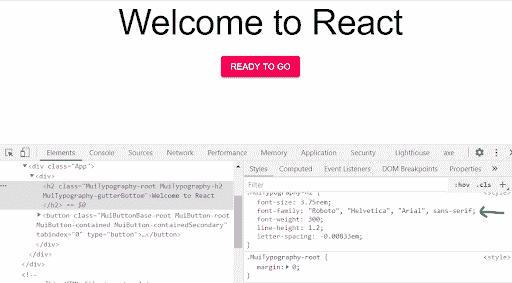
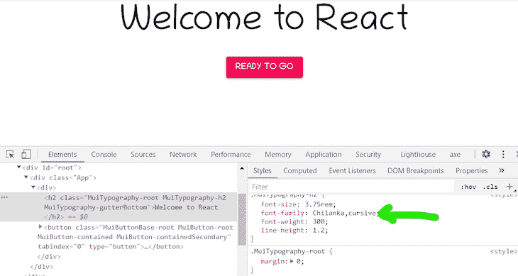
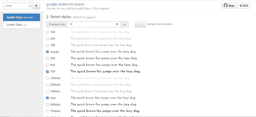
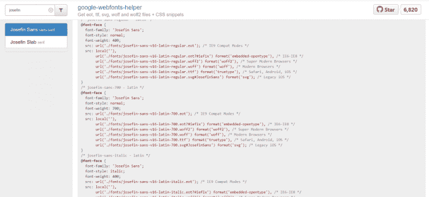
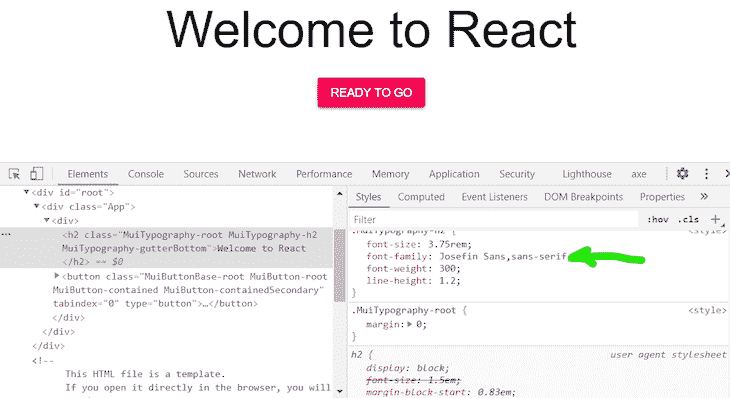
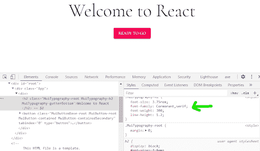
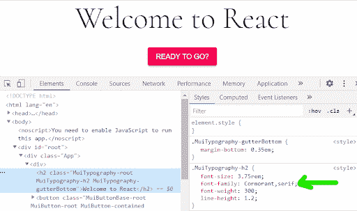
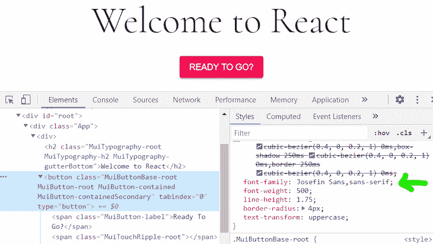

# 向 MUI 项目添加自定义字体的 3 种方法

> 原文：<https://blog.logrocket.com/add-custom-fonts-mui/>

***编者按**:本文最后一次更新于 2022 年 11 月 15 日，以反映 MUI v5 中所做的更改，包括删除已弃用的`createMuiTheme`函数。*

在撰写本文时，在 GitHub 上有超过 82k 的明星和 2600 名贡献者，MUI 是 React 开发人员最喜爱的 UI 组件库之一。凭借其多样化的常用 UI 组件，开发人员可以快速轻松地构建 web 界面，专注于功能而不是 UI 实现。

MUI 使用 Google 创建的[材料设计指南中的原则。在本文中，我们将探索 MUI，并回顾向 MUI 项目添加自定义字体的三种不同方式。我们开始吧！](https://material.io/design/guidelines-overview)

## 开始使用 MUI

本文假设您使用 [Create React App](https://create-react-app.dev) 或任何[其他 React 工具链](https://github.com/facebook/create-react-app/blob/master/README.md#popular-alternatives)。如果你正在建立你自己的工具链和构建管道，确保包含一个插件或者加载器来加载字体。

要开始使用，请安装 Create React 应用程序，如下所示:

```
/ with npm
npx create-react-app font-app
//with yarn
yarn create-react-app font-app

```

要在您的应用程序中使用 MUI，请通过 npm 或 yarn 安装它:

```
// with npm
npm install @mui/material @emotion/react @emotion/styled

// with yarn
yarn add @mui/material @emotion/react @emotion/styled

```

然后，我们将添加一些 UI 组件在我们的`App.js`文件夹中工作:

```
import Button from '@mui/material/Button';
import Typography from '@mui/material/Typography';
import './App.css';

function App() {
  return (
    <div className="App">
      <div>
      <Typography variant="h2" gutterBottom>
          Welcome to React
      &lt;/Typography>
        <Button variant="contained" color="secondary">Ready To Go</Button>
      </div>
    </div>
  );
}
export default App;

```

## 如何将自定义字体添加到 MUI 项目中

使用浏览器的检查器来检查按钮和标题，您会看到 UI 组件是使用 Roboto 的默认字体系列呈现的。那么，我们该如何改变呢？



Roboto font

我们将通过三种不同的方式将您选择的任何字体添加到您的 MUI 项目中。

## 方法 1:使用谷歌字体 CDN

前往[谷歌字体](https://fonts.google.com/)，选择你喜欢的字体系列；我将使用[奇兰卡草书](https://fonts.google.com/specimen/Chilanka)字体。复制 CDN 链接并将其添加到`public/index.html`文件的`<head>`中，如下所示:

```
<link href="https://fonts.googleapis.com/css2?family=Chilanka&display=swap" rel="stylesheet">

```

要使用该字体，您必须使用 [`CreateTheme`](https://mui.com/material-ui/customization/theming/#createtheme-options-args-theme) 和 [`ThemeProvider`](https://mui.com/material-ui/customization/theming/#theme-provider) 对其进行初始化，前者是 MUI 提供的一个 API，可根据收到的选项生成自定义主题，后者是一个组件，用于将自定义主题注入到您的应用程序中。

将以下代码添加到您的`App.js`文件中:

```
import { createTheme, ThemeProvider } from '@mui/material';
const theme = createMuiTheme({
  typography: {
    fontFamily: [
      'Chilanka',
      'cursive',
    ].join(','),
  },});

```

然后，用默认的 MUI `ThemeProvider`组件包装您的组件，并传递给它`theme` props。`theme`道具的价值应该是你定义的主题的名称:

```
<ThemeProvider theme={theme}>
 <div className="App">
   <div>
     <Typography variant="h2" gutterBottom>
       Welcome to React
     </Typography>
     <Button variant="contained" color="secondary">Ready To Go</Button>
   </div>
 </div>
</ThemeProvider>

```

现在使用浏览器检查工具检查组件，您会发现字体系列已更改为 Chilanka:



Welcome to React in Chilanka font

## 方法 2:使用 google-webfonts-helper 自带字体

自托管字体有一些好处。它明显更快，而且你的字体可以离线加载。

google-webfonts-helper 是一个神奇的工具，它让自托管字体变得没有麻烦。它根据您选择的字体、字符集、样式和浏览器支持提供字体文件和字体外观声明。

只需搜索任何谷歌字体，并选择所需的字体粗细。我将使用 Josefin Sans:



List of Google Fonts

将生成的字体声明复制到您的`src/index.css`文件中。您可以自定义字体文件的位置。默认假设为`../fonts/`。我们将使用`./fonts`，因为我们将把下载的字体放在`src/fonts`目录中:



Font sources

最后，下载你的文件。解压缩它们，并将它们放在项目中适当的位置，`src/fonts`。

像以前一样，您必须使用`CreateTheme`定义字体系列，然后用`ThemeProvider`组件包装您的组件:

```
const theme = createTheme({
 typography: {
   fontFamily: [
     'Josefin Sans',
     'sans-serif',
   ].join(','),
},});

```

现在进行检查，您应该看到字体系列已经更改为 Josefin Sans:



## 方法 3:使用 Typefaces npm 包的自宿主字体

Typefaces 是一个由 Kyle Matthews 创建的用于 Google 字体和其他一些开源字体的 npm 包的集合。就像其他依赖项一样，您可以通过安装 npm 将字体添加到项目中。使用 Typefaces 是我最喜欢的方法，因为所有网站和 web 应用程序的依赖关系都应该尽可能通过 npm 来管理。

只需在 repo 中搜索字体，然后点击 **`font`** 文件夹，即可找到正确的 npm 安装命令。我选鸬鹚:

```
npm install typeface-cormorant

```

然后，将包导入到项目的入口文件中，在我们的例子中是`src/index.js`:

```
import "typeface-cormorant";

```

像以前一样，您必须使用`CreateTheme`定义您的字体系列，并用`Themeprovider`组件包装您的组件:

```
const theme = createTheme({
  typography: {
    fontFamily: [
      'Cormorant',
      'serif',
    ].join(','),
},});

```

现在进行检查，您会看到字体系列已更改为 Cormorant:



## 为不同元素定义不同的字体

如果你想为我们的标题和按钮定义不同的字体。比如说，一个主要字体和一个次要字体？

您将简单地定义两个主题常量并用`Themeprovider`组件包装预期的组件，每个组件都有一个相应字体的主题道具。

例如，如果您想对标题使用 Cormorant 字体，对按钮使用 Josefin Sans 字体，您首先要为这两种字体分别定义两个主题:

```
const headingFont = createTheme({
  typography: {
    fontFamily: [
      'Cormorant',
      'serif',
    ].join(','),
},});

const buttonFont = createTheme({
  typography: {
    fontFamily: [
      'Josefin Sans',
      'sans-serif',
    ].join(','),
},});

```

然后，用所需字体的`ThemeProvider`组件包装目标组件，如下所示:

```
function App() {
  return (

    <div className="App">
      <div>
        <ThemeProvider theme={headingFont}>
          <Typography variant="h2" gutterBottom>
            Welcome to React
          </Typography>
        </ThemeProvider>
        <ThemeProvider theme={buttonFont}>
          <Button variant="contained" color="secondary">
                         Ready To Go
          </Button>
        </ThemeProvider>

      </div>
    </div>
  );
}

```

维奥拉。现在，您将看到标题呈现为 Cormorant 字体，按钮呈现为 Josefin Sans 字体:





## 结论

在本文中，我们介绍了向 MUI 项目添加自定义字体的三种简单方法，包括 Google Fonts CDN、google-webfonts-helper 和 npm。我们还学习了如何为不同的组件定义不同的字体。有问题一定要留言评论，编码快乐！