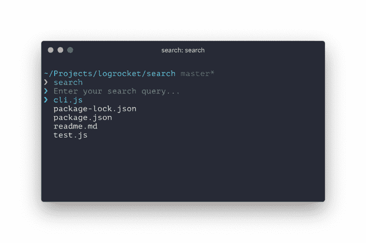

# 使用 React 为您的 CLIs 添加交互性

> 原文：<https://blog.logrocket.com/add-interactivity-to-your-clis-with-react/>

命令行界面(或 CLI)最近变得越来越交互。它们接受用户输入，呈现多种多样的用户界面，拥有改进的设计，而且目前使用起来通常更加愉快。

由于这些进步，CLI 不再是核心程序员的专利。越来越多的人开始通过图形用户界面使用 CLI。

以 Jest 为例:它提供了一种用户友好的交互式观看模式，无需任何 GUI。然而，创建这样的 CLI 并不是一件容易的事情。

将某些内容呈现到终端基本上包括将多个字符串连接在一起，并将它们写入输出流。

这段代码可能很难测试，因为它通常不能很好地与代码库的其余部分分离。

交互性是另一个令人头疼的问题，因为工具主要解决特定的问题，比如问用户一个问题，让他们从一系列问题中选择答案。

如果我们有一个平台来构建交互式命令行应用程序，为我们提供创建任何可以想象的用户界面的构件，会怎么样？

更好的是，如果这些积木也是组件呢？

这就是[反应](https://reactjs.org/)和[墨迹](https://github.com/vadimdemedes/ink)的地方。

React 允许您在组件中构建终端输出，就像您为浏览器构建应用程序一样。

Ink 获取这些组件并将其呈现到终端，从而将您从手动组装终端输出的负担中解脱出来。

以下是在终端中使用墨迹创建一个简单计数器的简单方法:

```
const React = require('react');
const {render, Text, Color} = require('ink');
const useAutoCounter = require('@use-it/auto-counter');

const Counter = () => {
  // Count from zero to infinity every 100ms
  const count = useAutoCounter(0, 100);

  return (
    <Text>
      Count: <Color green>{count}</Color>
    </Text>
  );
};

render(<Counter/>);
```

这里有一个自动计数器的例子。

值得注意的是，Ink 不仅可以呈现像`Text`、`Color`和`Box`这样的组件，还可以让你使用 Flexbox 来布局这些组件，就像在使用 CSS 的浏览器中一样。

得益于 React 和 Ink，您可以导入第三方组件，并在您的终端应用程序中混合和匹配它们。

这在以前是不容易实现的。有各种你可以重用的组件，从[文本输入](https://github.com/vadimdemedes/ink-text-input)、[可选列表](https://github.com/vadimdemedes/ink-select-input)、[微调器](https://github.com/vadimdemedes/ink-spinner)和[进度条](https://github.com/brigand/ink-progress-bar)到[链接](https://github.com/sindresorhus/ink-link)(是的，终端中的链接)，以及[图像](https://github.com/kevva/ink-image)(是的，终端中的图像！)

像 [Gatsby](https://www.gatsbyjs.org/) 和 [Shopify](https://www.shopify.com/) 这样的公司，以及像 [Parcel](https://parceljs.org/) 和 [Tap](https://node-tap.org/) 这样受欢迎的项目，已经在使用 Ink 来构建和渲染他们的 CLI 的用户界面。

让我们找出原因。

### 使用 React 和 Ink 创建 CLI

现在，让我们亲身体验一下这种神奇的感觉，并使用 React 和 Ink 创建我们自己的命令行应用程序。

我们将构建一个小工具，它在当前目录中搜索文件，然后在用户喜欢的代码编辑器中打开它。

在本教程结束时，我们将有一个类似这样的交互式 CLI。

事情是这样的:

1.  用户输入搜索查询，将文件名与当前目录中的文件名进行比较
2.  搜索结果作为用户类型列出，允许用户选择要在代码编辑器中打开的文件

### 入门指南

让我们跳过样板文件，使用 [create-ink-app](https://github.com/vadimdemedes/create-ink-app) ，它搭建了一个预配置了 React 和 ink 的新 CLI，因此我们可以立即开始构建我们的工具。你可能听说过`create-react-app`，它做了同样的工作，但在浏览器中的 React 应用程序。

创建一个名为`search`(这将是我们 CLI 的名称)的新目录，并在其中运行`create-ink-app`:

```
$ mkdir search
$ cd search
$ npx create-ink-app
```

为您安装所有依赖项可能需要几分钟时间。完成后，您应该会看到以下输出:


此时，`search` CLI 已经在您的环境中可用，您可以尝试运行它:

```
$ search
```

如果一切正常，您应该会看到一条“你好，陌生人”的消息，其中“陌生人”是绿色的。

如果你看一下`search`目录，你会发现`cli.js`和`ui.js`文件。为了简化本教程，我们将只使用`ui.js`，因为那是我们 CLI 的用户界面实现的地方。

用这个替换`create-ink-app`为我们搭建的`ui.js`的源代码，这样我们可以从头开始:

```
'use strict';
    const React = require('react');
    const {Box} = require('ink');

    const App = () => {
      return (
        <Box/>
      );
    };

    module.exports = App;
```

如果运行它，将不会呈现任何内容，因为`App`返回一个空的`Box`组件。`Box`组件被用作其他组件如`Text`或`Color`的容器。

* * *

### 更多来自 LogRocket 的精彩文章:

* * *

每个`Box`组件水平对齐其子组件，类似于浏览器中应用了`display: flex`的`div`元素。

### 添加搜索输入

我们的 CLI 需要做的第一件事是接受和处理用户输入。

我们需要安装`ink-text-input`组件来轻松实现它，它已经处理了光标管理和用户输入记录之类的事情。

```
$ npm install ink-text-input
```

现在，我们将向 CLI 添加一个`TextInput`组件。

`TextInput`组件不处理输入状态，所以我们需要传递带有当前输入值的`value`属性和一个`onChange`处理程序，以便在用户输入更多字符时更新它。

当用户还没有输入任何文本时，将显示通过`placeholder`属性传递的文本。

```
'use strict';
const React = require('react');
const {Box} = require('ink');
const TextInput = require('ink-text-input').default;

const App = () => {
  const [value, setValue] = React.useState('');

  return (
    <Box>
      <TextInput
        placeholder="Enter your search query..."
        value={value}
        onChange={setValue}
      />
    </Box>
  );
};

module.exports = App;
```

如果您现在尝试在终端中运行`search`命令，您应该会看到“输入您的搜索查询…”文本，并且能够键入您想要的任何文本。

您还应该能够使用光标在您输入的文本值内左右移动。

让我们将`value`和`setValue`分别重命名为`searchQuery`和`setSearchQuery`，以更好地反映这个变量的用途。

我们还将使用`Color`组件在文本输入前添加一个漂亮的绿色箭头，以便更好地突出显示:

```
'use strict';
const React = require('react');
const {Box, Color} = require('ink');
const TextInput = require('ink-text-input').default;

const App = () => {
  const [searchQuery, setSearchQuery] = React.useState('');

  return (
    <Box>
      <Color green>❯ </Color>
      <TextInput
        placeholder="Enter your search query..."
        value={searchQuery}
        onChange={setSearchQuery}
      />
    </Box>
  );
};

module.exports = App;
```

如果您再次运行`search`命令，您应该会在您正在键入的文本前看到一个漂亮的绿色箭头。

### 在当前目录中搜索匹配的文件

现在，让我们添加一个实际的搜索功能。

当用户键入他们的查询时，我们将在整个目录中搜索匹配该查询的文件。

为此，我们将安装两个新模块——[glob by](https://github.com/sindresorhus/globby)和 [fuzzaldrin](https://github.com/atom/fuzzaldrin) 。Globby 返回当前目录中所有文件的列表，而 fuzzaldrin 搜索该列表以查看是否有文件名匹配搜索查询。

```
$ npm install globby fuzzaldrin
```

为了加快搜索速度，我们只需要扫描一次目录，然后继续用不同的搜索查询过滤它。

为此，我们将使用一个带有空依赖列表的`useEffect`钩子，这使得它在组件第一次呈现后只执行一次。

我们还将通过名为`files`的`useState`创建一个新的状态变量，在这里我们将存储所有文件的列表。

```
'use strict';
const React = require('react');
const {Box, Color} = require('ink');
const TextInput = require('ink-text-input').default;
const globby = require('globby');

const App = () => {
  const [searchQuery, setSearchQuery] = React.useState('');
  const [files, setFiles] = React.useState([]);

  React.useEffect(() => {
    globby(['**/*', '!node_modules']).then(files => {
      setFiles(files);
    });
  });

  return (
    <Box>
      <Color green>❯ </Color>
      <TextInput
        placeholder="Enter your search query..."
        value={searchQuery}
        onChange={setSearchQuery}
      />
    </Box>
  );
};

module.exports = App;
```

有两个模式被传递给`globby`，每个模式执行以下操作:

*   `**/*`–发出信号递归搜索所有目录(查找所有嵌套文件)
*   `!node_modules`-发出忽略`node_modules`目录的信号，因为您通常不希望在依赖项中搜索

接下来，由于我们已经在`searchQuery`中存储了当前的搜索查询，我们可以立即用`fuzzaldrin`过滤`files`数组以获得我们的搜索结果。

Fuzzaldrin 足够快，我们可以在每次渲染时执行它。

```
'use strict';
const React = require('react');
const {Box, Color} = require('ink');
const TextInput = require('ink-text-input').default;
const globby = require('globby');
const fuzzaldrin = require('fuzzaldrin');

const App = () => {
  const [searchQuery, setSearchQuery] = React.useState('');
  const [files, setFiles] = React.useState([]);

  React.useEffect(() => {
    globby(['**/*', '!node_modules']).then(files => {
      setFiles(files);
    });
  });

  const searchResults = fuzzaldrin.filter(files, searchQuery);

  return (
    <Box>
      <Color green>❯ </Color>
      <TextInput
        placeholder="Enter your search query..."
        value={searchQuery}
        onChange={setSearchQuery}
      />
    </Box>
  );
};

module.exports = App;
```

### 显示结果列表

现在，我们需要显示结果列表，并允许我们的 CLI 用户选择他们想要的文件。

我们可以使用`ink-select-input`模块，它提供了一个实现选择列表的`SelectInput`组件。要安装此组件，请运行以下命令:

```
$ npm install ink-select-input
```

接下来，我们将通过添加一个`SelectInput`组件和一个选项列表来修改我们的`ui.js`文件。

不过，中间还有一步。

在我们当前的代码中，`searchResults`是一个字符串数组，其中每一项都是一个文件路径。然而，`SelectInput`需要一个对象数组，其中每个对象如下所示:

```
{
  label: "Label of item, displayed to the user",
  value: "Internal value, not displayed to the user"
}
```

为了传递一个`SelectInput`能够理解的条目列表，我们需要更新`searchResults`数组来包含如下对象:

```
'use strict';
const React = require('react');
const {Box, Color} = require('ink');
const TextInput = require('ink-text-input').default;
const SelectInput = require('ink-select-input').default;
const globby = require('globby');
const fuzzaldrin = require('fuzzaldrin');

const App = () => {
  const [searchQuery, setSearchQuery] = React.useState('');
  const [files, setFiles] = React.useState([]);

  React.useEffect(() => {
    globby(['**/*', '!node_modules']).then(files => {
      setFiles(files);
    });
  });

  const searchResults = fuzzaldrin.filter(files, searchQuery).map(file => ({
    label: file,
    value: file
  }));

  return (
    <Box flexDirection="column">
      <Box>
        <Color green>❯ </Color>
        <TextInput
          placeholder="Enter your search query..."
          value={searchQuery}
          onChange={setSearchQuery}
        />
      </Box>

      <SelectInput
        limit={5}
        items={searchResults}
      />
    </Box>
  );
};

module.exports = App;
```

注意，我还添加了一个`limit={5}`属性，所以列表一次最多只显示 5 个项目。

如果项目的数量实际上大于 5，列表将变得可滚动。多酷啊。

您可能也注意到了，我将整个输出打包在`<Box flexDirection="column">`中。

我这样做是为了把搜索结果放在搜索输入的下面。否则它们将会并排水平显示。

让我们看看我们的 CLI 是什么样子的！运行`search`命令，您应该会看到类似这样的内容:

默认情况下，它显示当前目录中的所有文件。你可以用箭头键在列表中上下移动。

如果您输入一个搜索查询，它应该会用只匹配搜索模式的文件来过滤列表。

### 在代码编辑器中打开选定的文件

现在让我们添加最后一个缺失的部分——选择文件并在用户首选的代码编辑器中打开它们。我们需要安装一个`open-editor`依赖项，它会为我们完成这项工作。

```
$ npm install open-editor
```

在我们开始之前，首先检查一下您是否有首选的代码编辑器是很重要的。

您可以通过在终端中运行以下命令来验证这一点:

```
$ echo $EDITOR
```

如果命令运行成功，可以跳过下一段。

如果它没有输出任何东西，这意味着您需要设置一个首选的代码编辑器。

出于本教程的目的，我们将只为当前终端会话设置它。

但是，最好在您的配置文件中设置它，比如`.bashrc`或`.zshrc`。下面是几个如何选择不同的代码编辑器作为首选编辑器的示例:

```
# Set Atom as preferred editor
export EDITOR=atom

# Set Sublime Text as preferred editor
export EDITOR=subl

# Set Vim as preferred editor
export EDITOR=vim
```

接下来，让我们向`SelectInput`组件添加一个`onSelect`处理程序。这个处理程序将从`searchResults`数组中接收一个项目，我们将使用它在用户编辑器中打开一个文件。

```
'use strict';
const React = require('react');
const {Box, Color} = require('ink');
const TextInput = require('ink-text-input').default;
const SelectInput = require('ink-select-input').default;
const globby = require('globby');
const fuzzaldrin = require('fuzzaldrin');
const openEditor = require('open-editor');

const App = () => {
  const [searchQuery, setSearchQuery] = React.useState('');
  const [files, setFiles] = React.useState([]);

  React.useEffect(() => {
    globby(['**/*', '!node_modules']).then(files => {
      setFiles(files);
    });
  });

  const searchResults = fuzzaldrin.filter(files, searchQuery).map(file => ({
    label: file,
    value: file
  }));

  const handleSelect = searchResult => {
    openEditor([
      {
        file: searchResult.value,
        line: 1,
        column: 1
      }
    ]);
  };

  return (
    <Box flexDirection="column">
      <Box>
        <Color green>❯ </Color>
        <TextInput
          placeholder="Enter your search query..."
          value={searchQuery}
          onChange={setSearchQuery}
        />
      </Box>

      <SelectInput
        limit={5}
        items={searchResults}
        onSelect={handleSelect}
      />
    </Box>
  );
};

module.exports = App;
```

瞧啊。我们自己的带有 React 和 Ink 的命令行应用已经准备好了。

### 后续步骤

尝试进一步发展此 CLI 以增强您的 Ink 知识。

你可以在文件列表加载时添加一个[加载微调器](https://github.com/vadimdemedes/ink-spinner)，让用户选择[多个文件](https://github.com/karaggeorge/ink-multi-select)，添加一个[大的花哨标志](https://github.com/sindresorhus/ink-big-text)，或者做任何想到的事情。

### 结论

如您所见，当您手头有合适的工具时，构建交互式 CLI 并不可怕。

凭借 React 的卓越功能，将用户界面拆分成组件比以往任何时候都更容易。

重要的是要记住，React 的范围远远超出了浏览器中的应用程序。

人们使用 React 构建移动、VR 以及现在的终端应用。我相信我们会看到更多 React 方法大放异彩的环境。

不要停止你的好奇心。

## 使用 LogRocket 消除传统反应错误报告的噪音

[LogRocket](https://lp.logrocket.com/blg/react-signup-issue-free)

是一款 React analytics 解决方案，可保护您免受数百个误报错误警报的影响，只针对少数真正重要的项目。LogRocket 告诉您 React 应用程序中实际影响用户的最具影响力的 bug 和 UX 问题。

[ ](https://lp.logrocket.com/blg/react-signup-general) [  ](https://lp.logrocket.com/blg/react-signup-general) [LogRocket](https://lp.logrocket.com/blg/react-signup-issue-free)

自动聚合客户端错误、反应错误边界、还原状态、缓慢的组件加载时间、JS 异常、前端性能指标和用户交互。然后，LogRocket 使用机器学习来通知您影响大多数用户的最具影响力的问题，并提供您修复它所需的上下文。

关注重要的 React bug—[今天就试试 LogRocket】。](https://lp.logrocket.com/blg/react-signup-issue-free)